# INDEX

<a id="s0001"></a>
- [S0001](#s0001) 00.index — `00.index.md`
<a id="s0002"></a>
- [S0002](#s0002) 01.tutorial map — `01.tutorial-map.md`
<a id="s0003"></a>
- [S0003](#s0003) 02.flight safety notification — `02.flight-safety-notification.md`
<a id="s0004"></a>
- [S0004](#s0004) 10.product introduction — `10.overview/10.product-introduction.md`
<a id="s0005"></a>
- [S0005](#s0005) 20.product architecture — `10.overview/20.product-architecture.md`
<a id="s0006"></a>
- [S0006](#s0006) 30.product support — `10.overview/30.product-support.md`
<a id="s0007"></a>
- [S0007](#s0007) 10.proper noun — `10.overview/40.basic-concept/10.proper-noun.md`
<a id="s0008"></a>
- [S0008](#s0008) 20.mqtt — `10.overview/40.basic-concept/20.mqtt.md`
<a id="s0009"></a>
- [S0009](#s0009) 30.thing model — `10.overview/40.basic-concept/30.thing-model.md`
<a id="s0010"></a>
- [S0010](#s0010) 40.https — `10.overview/40.basic-concept/40.https.md`
<a id="s0011"></a>
- [S0011](#s0011) 50.websocket — `10.overview/40.basic-concept/50.websocket.md`
<a id="s0012"></a>
- [S0012](#s0012) 60.jsbridge — `10.overview/40.basic-concept/60.jsbridge.md`
<a id="s0013"></a>
- [S0013](#s0013) 10.environment prepare list — `20.quick-start/10.environment-prepare-list.md`
<a id="s0014"></a>
- [S0014](#s0014) 20.source code deployment steps — `20.quick-start/20.source-code-deployment-steps.md`
<a id="s0015"></a>
- [S0015](#s0015) 30.docker deployment steps — `20.quick-start/30.docker-deployment-steps.md`
<a id="s0016"></a>
- [S0016](#s0016) 40.function display video — `20.quick-start/40.function-display-video.md`
<a id="s0017"></a>
- [S0017](#s0017) 10.pilot access to cloud — `30.feature-set/10.pilot-feature-set/10.pilot-access-to-cloud.md`
<a id="s0018"></a>
- [S0018](#s0018) 20.pilot situation awareness — `30.feature-set/10.pilot-feature-set/20.pilot-situation-awareness.md`
<a id="s0019"></a>
- [S0019](#s0019) 30.pilot livestream — `30.feature-set/10.pilot-feature-set/30.pilot-livestream.md`
<a id="s0020"></a>
- [S0020](#s0020) 40.pilot map elements — `30.feature-set/10.pilot-feature-set/40.pilot-map-elements.md`
<a id="s0021"></a>
- [S0021](#s0021) 50.pilot media management — `30.feature-set/10.pilot-feature-set/50.pilot-media-management.md`
<a id="s0022"></a>
- [S0022](#s0022) 60.pilot wayline management — `30.feature-set/10.pilot-feature-set/60.pilot-wayline-management.md`
<a id="s0023"></a>
- [S0023](#s0023) 70.pull pilot log — `30.feature-set/10.pilot-feature-set/70.pull-pilot-log.md`
<a id="s0024"></a>
- [S0024](#s0024) 80.pilot third party app — `30.feature-set/10.pilot-feature-set/80.pilot-third-party-app.md`
<a id="s0025"></a>
- [S0025](#s0025) 90.drc — `30.feature-set/10.pilot-feature-set/90.drc.md`
<a id="s0026"></a>
- [S0026](#s0026) 10.dock access to cloud — `30.feature-set/20.dock-feature-set/10.dock-access-to-cloud.md`
<a id="s0027"></a>
- [S0027](#s0027) 100.drc — `30.feature-set/20.dock-feature-set/100.drc.md`
<a id="s0028"></a>
- [S0028](#s0028) 110.custom flight area — `30.feature-set/20.dock-feature-set/110.custom-flight-area.md`
<a id="s0029"></a>
- [S0029](#s0029) 120.multi dock — `30.feature-set/20.dock-feature-set/120.multi-dock.md`
<a id="s0030"></a>
- [S0030](#s0030) 20.dock device management — `30.feature-set/20.dock-feature-set/20.dock-device-management.md`
<a id="s0031"></a>
- [S0031](#s0031) 30.dock livestream — `30.feature-set/20.dock-feature-set/30.dock-livestream.md`
<a id="s0032"></a>
- [S0032](#s0032) 40.dock media management — `30.feature-set/20.dock-feature-set/40.dock-media-management.md`
<a id="s0033"></a>
- [S0033](#s0033) 50.dock wayline management — `30.feature-set/20.dock-feature-set/50.dock-wayline-management.md`
<a id="s0034"></a>
- [S0034](#s0034) 60.hms — `30.feature-set/20.dock-feature-set/60.hms.md`
<a id="s0035"></a>
- [S0035](#s0035) 70.remote debug — `30.feature-set/20.dock-feature-set/70.remote-debug.md`
<a id="s0036"></a>
- [S0036](#s0036) 80.firmware upgrade — `30.feature-set/20.dock-feature-set/80.firmware-upgrade.md`
<a id="s0037"></a>
- [S0037](#s0037) 90.remote log — `30.feature-set/20.dock-feature-set/90.remote-log.md`
<a id="s0038"></a>
- [S0038](#s0038) 10.dji pilot2 webview debug — `50.debug/10.dji-pilot2-webview-debug.md`
<a id="s0039"></a>
- [S0039](#s0039) 20.log export — `50.debug/20.log-export.md`
<a id="s0040"></a>
- [S0040](#s0040) 30.mqttx — `50.debug/30.mqttx.md`
<a id="s0041"></a>
- [S0041](#s0041) 10.overview — `60.api-reference/00.dji-wpml/10.overview.md`
<a id="s0042"></a>
- [S0042](#s0042) 20.template kml — `60.api-reference/00.dji-wpml/20.template-kml.md`
<a id="s0043"></a>
- [S0043](#s0043) 30.waylines wpml — `60.api-reference/00.dji-wpml/30.waylines-wpml.md`
<a id="s0044"></a>
- [S0044](#s0044) 40.common element — `60.api-reference/00.dji-wpml/40.common-element.md`
<a id="s0045"></a>
- [S0045](#s0045) 00.topic definition — `60.api-reference/10.pilot-to-cloud/00.mqtt/00.topic-definition.md`
<a id="s0046"></a>
- [S0046](#s0046) 00.properties — `60.api-reference/10.pilot-to-cloud/00.mqtt/10.m3-series/00.properties.md`
<a id="s0047"></a>
- [S0047](#s0047) 00.properties — `60.api-reference/10.pilot-to-cloud/00.mqtt/20.rc-pro/00.properties.md`
<a id="s0048"></a>
- [S0048](#s0048) Event — `60.api-reference/10.pilot-to-cloud/00.mqtt/20.rc-pro/10.device.md`
<a id="s0049"></a>
- [S0049](#s0049) Service — `60.api-reference/10.pilot-to-cloud/00.mqtt/20.rc-pro/20.live.md`
<a id="s0050"></a>
- [S0050](#s0050) Event — `60.api-reference/10.pilot-to-cloud/00.mqtt/20.rc-pro/30.drc.md`
<a id="s0051"></a>
- [S0051](#s0051) Event — `60.api-reference/10.pilot-to-cloud/00.mqtt/20.rc-pro/40.remote-control.md`
<a id="s0052"></a>
- [S0052](#s0052) 00.properties — `60.api-reference/10.pilot-to-cloud/00.mqtt/30.others/10.aircraft/00.properties.md`
<a id="s0053"></a>
- [S0053](#s0053) 00.properties — `60.api-reference/10.pilot-to-cloud/00.mqtt/30.others/20.rc/00.properties.md`
<a id="s0054"></a>
- [S0054](#s0054) Event — `60.api-reference/10.pilot-to-cloud/00.mqtt/30.others/20.rc/10.device.md`
<a id="s0055"></a>
- [S0055](#s0055) Service — `60.api-reference/10.pilot-to-cloud/00.mqtt/30.others/20.rc/20.live.md`
<a id="s0056"></a>
- [S0056](#s0056) Schemas — `60.api-reference/10.pilot-to-cloud/10.https/10.map-elements/10.create.md`
<a id="s0057"></a>
- [S0057](#s0057) Schemas — `60.api-reference/10.pilot-to-cloud/10.https/10.map-elements/20.update.md`
<a id="s0058"></a>
- [S0058](#s0058) Schemas — `60.api-reference/10.pilot-to-cloud/10.https/10.map-elements/30.obtain.md`
<a id="s0059"></a>
- [S0059](#s0059) Schemas — `60.api-reference/10.pilot-to-cloud/10.https/10.map-elements/40.delete.md`
<a id="s0060"></a>
- [S0060](#s0060) Schemas — `60.api-reference/10.pilot-to-cloud/10.https/20.waypoint-management/10.obtain-waypointfile-list.md`
<a id="s0061"></a>
- [S0061](#s0061) Schemas — `60.api-reference/10.pilot-to-cloud/10.https/20.waypoint-management/20.obtain-temporary-credential.md`
<a id="s0062"></a>
- [S0062](#s0062) 30.get waypointfile download location — `60.api-reference/10.pilot-to-cloud/10.https/20.waypoint-management/30.get-waypointfile-download-location.md`
<a id="s0063"></a>
- [S0063](#s0063) Schemas — `60.api-reference/10.pilot-to-cloud/10.https/20.waypoint-management/40.get-duplicated-waypointfile-name.md`
<a id="s0064"></a>
- [S0064](#s0064) Schemas — `60.api-reference/10.pilot-to-cloud/10.https/20.waypoint-management/50.waypointfile-upload-result-report.md`
<a id="s0065"></a>
- [S0065](#s0065) Schemas — `60.api-reference/10.pilot-to-cloud/10.https/20.waypoint-management/60.collect-waypointfile-in-batch.md`
<a id="s0066"></a>
- [S0066](#s0066) Schemas — `60.api-reference/10.pilot-to-cloud/10.https/20.waypoint-management/70.cancel-collect.md`
<a id="s0067"></a>
- [S0067](#s0067) Schemas — `60.api-reference/10.pilot-to-cloud/10.https/30.media-management/10.fast-upload.md`
<a id="s0068"></a>
- [S0068](#s0068) Schemas — `60.api-reference/10.pilot-to-cloud/10.https/30.media-management/20.obtain-exited-tiny-fingerprint.md`
<a id="s0069"></a>
- [S0069](#s0069) Schemas — `60.api-reference/10.pilot-to-cloud/10.https/30.media-management/30.obtain-temporary-credential.md`
<a id="s0070"></a>
- [S0070](#s0070) Schemas — `60.api-reference/10.pilot-to-cloud/10.https/30.media-management/40.mediafile-upload-result-report.md`
<a id="s0071"></a>
- [S0071](#s0071) Schemas — `60.api-reference/10.pilot-to-cloud/10.https/30.media-management/50.group-upload-callback.md`
<a id="s0072"></a>
- [S0072](#s0072) Schemas — `60.api-reference/10.pilot-to-cloud/10.https/40.situation-awareness/10.obtain-device-topology-list.md`
<a id="s0073"></a>
- [S0073](#s0073) 10.message push — `60.api-reference/10.pilot-to-cloud/20.websocket/10.map-elements/10.message-push.md`
<a id="s0074"></a>
- [S0074](#s0074) 10.message push — `60.api-reference/10.pilot-to-cloud/20.websocket/20.situation-awareness/10.message-push.md`
<a id="s0075"></a>
- [S0075](#s0075) 30.jsbridge — `60.api-reference/10.pilot-to-cloud/30.jsbridge.md`
<a id="s0076"></a>
- [S0076](#s0076) 00.topic definition — `60.api-reference/20.dock-to-cloud/00.mqtt/00.topic-definition.md`
<a id="s0077"></a>
- [S0077](#s0077) 00.m30 properties — `60.api-reference/20.dock-to-cloud/00.mqtt/10.aircraft/00.m30-properties.md`
<a id="s0078"></a>
- [S0078](#s0078) 10.m3d properties — `60.api-reference/20.dock-to-cloud/00.mqtt/10.aircraft/10.m3d-properties.md`
<a id="s0079"></a>
- [S0079](#s0079) 00.properties — `60.api-reference/20.dock-to-cloud/00.mqtt/20.dock/00.dock1/00.properties.md`
<a id="s0080"></a>
- [S0080](#s0080) Status — `60.api-reference/20.dock-to-cloud/00.mqtt/20.dock/00.dock1/10.device.md`
<a id="s0081"></a>
- [S0081](#s0081) Requests — `60.api-reference/20.dock-to-cloud/00.mqtt/20.dock/00.dock1/100.config.md`
<a id="s0082"></a>
- [S0082](#s0082) Event — `60.api-reference/20.dock-to-cloud/00.mqtt/20.dock/00.dock1/110.drc.md`
<a id="s0083"></a>
- [S0083](#s0083) Event — `60.api-reference/20.dock-to-cloud/00.mqtt/20.dock/00.dock1/120.airsense.md`
<a id="s0084"></a>
- [S0084](#s0084) 130.custom flight area — `60.api-reference/20.dock-to-cloud/00.mqtt/20.dock/00.dock1/130.custom-flight-area.md`
<a id="s0085"></a>
- [S0085](#s0085) Event — `60.api-reference/20.dock-to-cloud/00.mqtt/20.dock/00.dock1/140.psdk.md`
<a id="s0086"></a>
- [S0086](#s0086) Event — `60.api-reference/20.dock-to-cloud/00.mqtt/20.dock/00.dock1/150.psdk-transmit-custom-data.md`
<a id="s0087"></a>
- [S0087](#s0087) Event — `60.api-reference/20.dock-to-cloud/00.mqtt/20.dock/00.dock1/160.esdk-transmit-custom-data.md`
<a id="s0088"></a>
- [S0088](#s0088) Service — `60.api-reference/20.dock-to-cloud/00.mqtt/20.dock/00.dock1/170.flysafe.md`
<a id="s0089"></a>
- [S0089](#s0089) Requests — `60.api-reference/20.dock-to-cloud/00.mqtt/20.dock/00.dock1/20.organization.md`
<a id="s0090"></a>
- [S0090](#s0090) Service — `60.api-reference/20.dock-to-cloud/00.mqtt/20.dock/00.dock1/30.live.md`
<a id="s0091"></a>
- [S0091](#s0091) Event — `60.api-reference/20.dock-to-cloud/00.mqtt/20.dock/00.dock1/40.file.md`
<a id="s0092"></a>
- [S0092](#s0092) Event — `60.api-reference/20.dock-to-cloud/00.mqtt/20.dock/00.dock1/50.wayline.md`
<a id="s0093"></a>
- [S0093](#s0093) Event — `60.api-reference/20.dock-to-cloud/00.mqtt/20.dock/00.dock1/60.hms.md`
<a id="s0094"></a>
- [S0094](#s0094) Event — `60.api-reference/20.dock-to-cloud/00.mqtt/20.dock/00.dock1/70.cmd.md`
<a id="s0095"></a>
- [S0095](#s0095) Event — `60.api-reference/20.dock-to-cloud/00.mqtt/20.dock/00.dock1/80.firmware.md`
<a id="s0096"></a>
- [S0096](#s0096) Event — `60.api-reference/20.dock-to-cloud/00.mqtt/20.dock/00.dock1/90.log.md`
<a id="s0097"></a>
- [S0097](#s0097) 00.properties — `60.api-reference/20.dock-to-cloud/00.mqtt/20.dock/10.dock2/00.properties.md`
<a id="s0098"></a>
- [S0098](#s0098) Status — `60.api-reference/20.dock-to-cloud/00.mqtt/20.dock/10.dock2/10.device.md`
<a id="s0099"></a>
- [S0099](#s0099) Requests — `60.api-reference/20.dock-to-cloud/00.mqtt/20.dock/10.dock2/100.config.md`
<a id="s0100"></a>
- [S0100](#s0100) Event — `60.api-reference/20.dock-to-cloud/00.mqtt/20.dock/10.dock2/110.drc.md`
<a id="s0101"></a>
- [S0101](#s0101) Event — `60.api-reference/20.dock-to-cloud/00.mqtt/20.dock/10.dock2/120.airsense.md`
<a id="s0102"></a>
- [S0102](#s0102) 130.custom flight area — `60.api-reference/20.dock-to-cloud/00.mqtt/20.dock/10.dock2/130.custom-flight-area.md`
<a id="s0103"></a>
- [S0103](#s0103) Event — `60.api-reference/20.dock-to-cloud/00.mqtt/20.dock/10.dock2/140.psdk.md`
<a id="s0104"></a>
- [S0104](#s0104) Event — `60.api-reference/20.dock-to-cloud/00.mqtt/20.dock/10.dock2/150.psdk-transmit-custom-data.md`
<a id="s0105"></a>
- [S0105](#s0105) Event — `60.api-reference/20.dock-to-cloud/00.mqtt/20.dock/10.dock2/160.esdk-transmit-custom-data.md`
<a id="s0106"></a>
- [S0106](#s0106) Service — `60.api-reference/20.dock-to-cloud/00.mqtt/20.dock/10.dock2/170.flysafe.md`
<a id="s0107"></a>
- [S0107](#s0107) Event — `60.api-reference/20.dock-to-cloud/00.mqtt/20.dock/10.dock2/180.remote-control.md`
<a id="s0108"></a>
- [S0108](#s0108) Requests — `60.api-reference/20.dock-to-cloud/00.mqtt/20.dock/10.dock2/20.organization.md`
<a id="s0109"></a>
- [S0109](#s0109) Service — `60.api-reference/20.dock-to-cloud/00.mqtt/20.dock/10.dock2/30.live.md`
<a id="s0110"></a>
- [S0110](#s0110) Event — `60.api-reference/20.dock-to-cloud/00.mqtt/20.dock/10.dock2/40.file.md`
<a id="s0111"></a>
- [S0111](#s0111) Event — `60.api-reference/20.dock-to-cloud/00.mqtt/20.dock/10.dock2/50.wayline.md`
<a id="s0112"></a>
- [S0112](#s0112) Event — `60.api-reference/20.dock-to-cloud/00.mqtt/20.dock/10.dock2/60.hms.md`
<a id="s0113"></a>
- [S0113](#s0113) Event — `60.api-reference/20.dock-to-cloud/00.mqtt/20.dock/10.dock2/70.cmd.md`
<a id="s0114"></a>
- [S0114](#s0114) Event — `60.api-reference/20.dock-to-cloud/00.mqtt/20.dock/10.dock2/80.firmware.md`
<a id="s0115"></a>
- [S0115](#s0115) Event — `60.api-reference/20.dock-to-cloud/00.mqtt/20.dock/10.dock2/90.log.md`
<a id="s0116"></a>
- [S0116](#s0116) 71.error code — `71.error-code.md`
<a id="s0117"></a>
- [S0117](#s0117) 80.faq — `80.faq.md`

<a id="s0001"></a>
## S0001 — 00.index
Path: `00.index.md`

## Cloud API v1.11.3 Release Notes
### Released Date
2024.11.07
### Released Function List
DJI Dock 2

* [Supported greater ability to control the payload, such as, Timed Shot and Link Zoom.](https://developer.dji.com/doc/cloud-api-tutorial/en/api-reference/dock-to-cloud/mqtt/dock/dock2/remote-control.html)

* [Supported synchronizing RTCM data (.dat) to the cloud.](https://developer.dji.com/doc/cloud-api-tutorial/en/feature-set/dock-feature-set/dock-media-management.html)

* Added the switch of pulling terrain data before taking off (flight_safety_advance_check) in [Live Flight Controls](https://developer.dji.com/doc/cloud-api-tutorial/en/api-reference/dock-to-cloud/mqtt/dock/dock2/drc.html) and [Wayline Management](https://developer.dji.com/doc/cloud-api-tutorial/en/api-reference/dock-to-cloud/mqtt/dock/dock2/wayline.html) funnctions.

* [Supported emergency landing and forced landing. Both of them can be cancelled by drone_emergency_stop.](https://developer.dji.com/doc/cloud-api-tutorial/en/api-reference/dock-to-cloud/mqtt/dock/dock2/remote-control.html)

* [Supported changing the stream source to vision assist during the live stream.](https://developer.dji.com/doc/cloud-api-tutorial/en/overview/product-support.html)

* [Added an API for message confirmation to determine whether to force close the dock cover or not.](https://developer.dji.com/doc/cloud-api-tutorial/en/api-reference/dock-to-cloud/mqtt/dock/dock2/cmd.html)

* [Supported PSDK interconnection.](https://developer.dji.com/doc/cloud-api-tutorial/en/api-reference/dock-to-cloud/mqtt/dock/dock2/psdk-transmit-custom-data.html)

Note: RTCM data (.dat) will be uploaded with media files. Extra configuration is needed to display .dat files.
### Supported Products and Firmware Version
> Notes:
> * Firmware getting path: Search the model you need at [DJI official website](https://www.dji.com/), click the "Downloads" and download the firmware by yourself.
> * The firmware versions in the table below are the lowest version that can support the development.
> * [How to get the installation package of DJI Pilot 2](https://sdk-forum.dji.net/hc/en-us/articles/6177232395801-How-do-I-install-Pilot2-Where-can-I-get-the-installation-package-).

DJI Pilot 2 access to Cloud Server

<table width="100%" style="display: table; table-layout:fixed;">
    <tr>
        <td>Product</td>
        <td>Firmware Version</td>
    </tr>
    <tr>
        <td>DJI Pilot 2</td>
        <td>10.1.0.30</td>
    </tr>
    <tr>
        <td>Matrice 350 RTK</td>
        <td>10.01.00.09</td>
    </tr>
    <tr>
        <td>Matrice 30/30T</td>
        <td>10.01.00.14</td>
    </tr>
    <tr>
        <td>Matrice 300 RTK (Compatible with DJI RC Plus)</td>
        <td>60.01.00.03</td>
    </tr>
       <tr>
        <td>Matrice 300 RTK (Compatible with DJI Smart Controller Enterprise)</td>
        <td>09.00.05.03</td>
    </tr>
    <tr>
        <td>DJI RC Plus</td>
        <td>05.02.11.06</td>
    </tr>
       <tr>
        <td>DJI Smart Controller Enterprise</td>
        <td>09.00.05.01</td>
    </tr>
    <tr>
        <td>Mavic 3E/3T</td>
        <td>10.01.00.14</td>
    </tr>
    <tr>
        <td>DJI RC Pro Enterprise</td>
        <td>02.01.05.07</td>
    </tr>
  </table>

DJI Dock access to Cloud Server

<table width="100%" style="display: table; table-layout:fixed;">
    <tr>
        <td>Product</td>
        <td>Firmware Version</td>
    </tr>
    <tr>
        <td>Matrice 3D/3TD</td>
        <td>10.01.32.05</td>
    </tr>
    <tr>
        <td>DJI RC Pro Enterprise</td>
        <td>02.01.05.15</td>
    </tr>
    <tr>
        <td>DJI Dock 2</td>
        <td>10.01.32.05</td>
    </tr>
    <tr>
        <td>Matrice 30/30T</td>
        <td>10.01.0014</td>
    </tr>
    <tr>
        <td>DJI RC Plus</td>
        <td>05.02.1106</td>
    </tr>
    <tr>
        <td>DJI Dock</td>
        <td>10.01.0205</td>
    </tr>
</table>
## Cloud API v1.11.2 Release Notes
### Released Date
2024.09.26
### Released Function List
[Supported the "Cancel Tasks in Preparation" interface, allowing the flight mission to be canceled after issuing the flight command before the aircraft takes off and the RTK has not been converged.](https://developer.dji.com/doc/cloud-api-tutorial/en/api-reference/dock-to-cloud/mqtt/dock/dock1/wayline.html)
### Supported Products and Firmware Version
> Notes:
> * Firmware getting path: Search the model you need at [DJI official website](https://www.dji.com/), click the "Downloads" and download the firmware by yourself.
> * The firmware versions in the table below are the lowest version that can support the development.
> * [How to get the installation package of DJI Pilot 2](https://sdk-forum.dji.net/hc/en-us/articles/6177232395801-How-do-I-install-Pilot2-Where-can-I-get-the-installation-package-).

DJI Pilot 2 access to Cloud Server

<table width="100%" style="display: table; table-layout:fixed;">
    <tr>
        <td>Product</td>
        <td>Firmware Version</td>
    </tr>
    <tr>
        <td>DJI Pilot 2</td>
        <td>10.1.0.30</td>
    </tr>
    <tr>
        <td>Matrice 350 RTK</td>
        <td>10.01.00.09</td>
    </tr>
    <tr>
        <td>Matrice 30/30T</td>
        <td>10.01.00.14</td>
    </tr>
    <tr>
        <td>Matrice 300 RTK (Compatible with DJI RC Plus)</td>
        <td>60.01.00.03</td>
    </tr>
       <tr>
        <td>Matrice 300 RTK (Compatible with DJI Smart Controller Enterprise)</td>
        <td>09.00.05.03</td>
    </tr>
    <tr>
        <td>DJI RC Plus</td>
        <td>05.02.11.06</td>
    </tr>
       <tr>
        <td>DJI Smart Controller Enterprise</td>
        <td>09.00.05.01</td>
    </tr>
    <tr>
        <td>Mavic 3E/3T</td>
        <td>10.01.00.14</td>
    </tr>
    <tr>
        <td>DJI RC Pro Enterprise</td>
        <td>02.01.05.07</td>
    </tr>
  </table>

DJI Dock access to Cloud Server

<table width="100%" style="display: table; table-layout:fixed;">
    <tr>
        <td>Product</td>
        <td>Firmware Version</td>
    </tr>
    <tr>
        <td>Matrice 3D/3TD</td>
        <td>10.01.1607</td>
    </tr>
    <tr>
        <td>DJI RC Pro Enterprise</td>
        <td>02.01.0507</td>
    </tr>
    <tr>
        <td>DJI Dock 2</td>
        <td>10.01.1607</td>
    </tr>
    <tr>
        <td>Matrice 30/30T</td>
        <td>10.01.0014</td>
    </tr>
    <tr>
        <td>DJI RC Plus</td>
        <td>05.02.1106</td>
    </tr>
    <tr>
        <td>DJI Dock</td>
        <td>10.01.0205</td>
    </tr>
</table>
## Cloud API v1.11.1 Release Notes
### Released Date
2024.08.13
### Released Function List
DJI Dock 2 supported hardware-level interfaces of multi-dock task. Refer to the [multi-dock tutorial](https://developer.dji.com/doc/cloud-api-tutorial/en/feature-set/dock-feature-set/multi-dock.html) for further development.
### Supported Products and Firmware Version
> Notes:
> * Firmware getting path: Search the model you need at [DJI official website](https://www.dji.com/), click the "Downloads" and download the firmware by yourself.
> * The firmware versions in the table below are the lowest version that can support the development.
> * [How to get the installation package of DJI Pilot 2](https://sdk-forum.dji.net/hc/en-us/articles/6177232395801-How-do-I-install-Pilot2-Where-can-I-get-the-installation-package-).

DJI Pilot 2 access to Cloud Server

<table width="100%" style="display: table; table-layout:fixed;">
    <tr>
        <td>Product</td>
        <td>Firmware Version</td>
    </tr>
    <tr>
        <td>DJI Pilot 2</td>
        <td>10.1.0.30</td>
    </tr>
    <tr>
        <td>Matrice 350 RTK</td>
        <td>10.01.00.09</td>
    </tr>
    <tr>
        <td>Matrice 30/30T</td>
        <td>10.01.00.14</td>
    </tr>
    <tr>
        <td>Matrice 300 RTK (Compatible with DJI RC Plus)</td>
        <td>60.01.00.03</td>
    </tr>
       <tr>
        <td>Matrice 300 RTK (Compatible with DJI Smart Controller Enterprise)</td>
        <td>09.00.05.03</td>
    </tr>
    <tr>
        <td>DJI RC Plus</td>
        <td>05.02.11.06</td>
    </tr>
       <tr>
        <td>DJI Smart Controller Enterprise</td>
        <td>09.00.05.01</td>
    </tr>
    <tr>
        <td>Mavic 3E/3T</td>
        <td>10.01.00.14</td>
    </tr>
    <tr>
        <td>DJI RC Pro Enterprise</td>
        <td>02.01.05.07</td>
    </tr>
  </table>

DJI Dock access to Cloud Server

<table width="100%" style="display: table; table-layout:fixed;">
    <tr>
        <td>Product</td>
        <td>Firmware Version</td>
    </tr>
    <tr>
        <td>Matrice 3D/3TD</td>
        <td>10.01.1607</td>
    </tr>
    <tr>
        <td>DJI RC Pro Enterprise</td>
        <td>02.01.0507</td>
    </tr>
    <tr>
        <td>DJI Dock 2</td>
        <td>10.01.1607</td>
    </tr>
    <tr>
        <td>Matrice 30/30T</td>
        <td>10.01.0014</td>
    </tr>
    <tr>
        <td>DJI RC Plus</td>
        <td>05.02.1106</td>
    </tr>
    <tr>
        <td>DJI Dock</td>
        <td>10.01.0203</td>
    </tr>
</table>
## Cloud API v1.11.0 Release Notes
### Released Date
2024.07.18
### Released Function List
#### Pilot to Cloud Protocol
DJI Mavic 3 Enterprise series models supported remote control of the aircraft gimbal. Added [live flight controls protocol](https://developer.dji.com/doc/cloud-api-tutorial/en/api-reference/pilot-to-cloud/mqtt/rc-pro/drc.html) and [remote control protocol](https://developer.dji.com/doc/cloud-api-tutorial/en/api-reference/pilot-to-cloud/mqtt/rc-pro/remote-control.html). Provided [related tutorial](https://developer.dji.com/doc/cloud-api-tutorial/en/feature-set/pilot-feature-set/drc.html).
#### Dock to Cloud Protocol
DJI Dock and DJI Dock 2:
* [Added support for setting the NTP server port number](https://developer.dji.com/doc/cloud-api-tutorial/en/api-reference/dock-to-cloud/mqtt/dock/dock2/config.html).
* [Added support for remote unlocking](https://developer.dji.com/doc/cloud-api-tutorial/en/api-reference/dock-to-cloud/mqtt/dock/dock2/flysafe.html).

DJI Dock 2:
* [Supported panorama in waypoint route](https://developer.dji.com/doc/cloud-api-tutorial/en/api-reference/dji-wpml/common-element.html)
* [Added embedding of SRT subtitle information (including aircraft/gimbal attitude information) into video files](https://developer.dji.com/doc/cloud-api-tutorial/en/feature-set/dock-feature-set/dock-media-management.html).
* [Added remote control functions:](https://developer.dji.com/doc/cloud-api-tutorial/en/api-reference/dock-to-cloud/mqtt/dock/dock2/remote-control.html)
  * Support for stealth mode and night flight light switch settings.
  * Support for camera aperture, shutter, and ISO settings.
  * Matrice 3D models support mechanical shutter and lens distortion correction switch settings.
* [Matrice 3D models support PPK file transmission for wayline missions, which can be downloaded and transferred via cloud connectivity. And cloud API interfaces are provided](https://developer.dji.com/doc/cloud-api-tutorial/en/feature-set/dock-feature-set/dock-media-management.html).
* [The DRC-heartbeat (Method: heart_beat) protocol of live flight controls changes the timeout period](https://developer.dji.com/doc/cloud-api-tutorial/en/api-reference/dock-to-cloud/mqtt/dock/dock2/drc.html).

[Added tutorial for custom flight area](https://developer.dji.com/doc/cloud-api-tutorial/en/feature-set/dock-feature-set/custom-flight-area.html).
#### Tutorials
* Added [remote control/Live flight controls tutorial](https://developer.dji.com/doc/cloud-api-tutorial/en/feature-set/pilot-feature-set/drc.html), [custom flight area tutorial](https://developer.dji.com/doc/cloud-api-tutorial/en/feature-set/dock-feature-set/custom-flight-area.html), [FAQ](https://developer.dji.com/doc/cloud-api-tutorial/en/faq.html).
* The address of [hms.json](https://terra-1-g.djicdn.com/fee90c2e03e04e8da67ea6f56365fc76/SDK%20%E6%96%87%E6%A1%A3/CloudAPI/hms.json) file from [HMS function](https://developer.dji.com/doc/cloud-api-tutorial/en/feature-set/dock-feature-set/hms.html) has changed.
### Supported Products and Firmware Version
> Notes:
> * Firmware getting path: Search the model you need at [DJI official website](https://www.dji.com/), click the "Downloads" and download the firmware by yourself.
> * The firmware versions in the table below are the lowest version that can support the development.
> * [How to get the installation package of DJI Pilot 2](https://sdk-forum.dji.net/hc/en-us/articles/6177232395801-How-do-I-install-Pilot2-Where-can-I-get-the-installation-package-).

DJI Pilot 2 access to Cloud Server

<table width="100%" style="display: table; table-layout:fixed;">
    <tr>
        <td>Product</td>
        <td>Firmware Version</td>
    </tr>
    <tr>
        <td>DJI Pilot 2</td>
        <td>10.1.0.30</td>
    </tr>
    <tr>
        <td>Matrice 350 RTK</td>
        <td>10.01.00.09</td>
    </tr>
    <tr>
        <td>Matrice 30/30T</td>
        <td>10.01.00.14</td>
    </tr>
    <tr>
        <td>Matrice 300 RTK (Compatible with DJI RC Plus)</td>
        <td>60.01.00.03</td>
    </tr>
       <tr>
        <td>Matrice 300 RTK (Compatible with DJI Smart Controller Enterprise)</td>
        <td>09.00.05.03</td>
    </tr>
    <tr>
        <td>DJI RC Plus</td>
        <td>05.02.11.06</td>
    </tr>
       <tr>
        <td>DJI Smart Controller Enterprise</td>
        <td>09.00.05.01</td>
    </tr>
    <tr>
        <td>Mavic 3E/3T</td>
        <td>10.01.00.14</td>
    </tr>
    <tr>
        <td>DJI RC Pro Enterprise</td>
        <td>02.01.05.07</td>
    </tr>
  </table>

DJI Dock access to Cloud Server

<table width="100%" style="display: table; table-layout:fixed;">
    <tr>
        <td>Product</td>
        <td>Firmware Version</td>
    </tr>
    <tr>
        <td>Matrice 3D/3TD</td>
        <td>10.01.16.04</td>
    </tr>
    <tr>
        <td>DJI RC Pro Enterprise</td>
        <td>02.01.05.07</td>
    </tr>
    <tr>
        <td>DJI Dock 2</td>
        <td>10.01.16.04</td>
    </tr>
    <tr>
        <td>Matrice 30/30T</td>
        <td>10.01.00.14</td>
    </tr>
    <tr>
        <td>DJI RC Plus</td>
        <td>05.02.11.06</td>
    </tr>
    <tr>
        <td>DJI Dock</td>
        <td>10.01.0203</td>
    </tr>
</table>
## Cloud API v1.10.0 Release Notes
### Released Date
2024.04.07
### Released Function List
* ‌[Matrice 3D/3TD properties:](https://developer.dji.com/doc/cloud-api-tutorial/en/api-reference/dock-to-cloud/mqtt/aircraft/m3d-properties.html)
  * Added properties related to the wide camera, zoom camera, and infrared temperature measurement.
  * The enumeration value of Camera mode (camera_mode) has been changed.
* DJI Dock 2:
  * [Added silent mode to the properties.](https://developer.dji.com/doc/cloud-api-tutorial/en/api-reference/dock-to-cloud/mqtt/dock/dock2/properties.html)
  * [Live stream function:](https://developer.dji.com/doc/cloud-api-tutorial/en/api-reference/dock-to-cloud/mqtt/dock/dock2/live.html)
    * Added new live streaming protocol type: WebRTC.
    * Added live streaming camera switching protocol.
  * [Live flight controls function:](https://developer.dji.com/doc/cloud-api-tutorial/en/api-reference/dock-to-cloud/mqtt/dock/dock2/drc.html)
    * Added payload control capabilities such as camera exposure setting, infrared camera temperature display, and so on.
    * Improved the night operation capabilities such as zoom mode, Smart Low-Light mode switching, and so on.
    * Added panorama capture mode.
    * Added new payload control capability: Subject zoom.
  * [Added custom flight area function and provided template file.](https://developer.dji.com/doc/cloud-api-tutorial/en/api-reference/dock-to-cloud/mqtt/dock/dock2/custom-flight-area.html)
  * [Added AirSense function.](https://developer.dji.com/doc/cloud-api-tutorial/en/api-reference/dock-to-cloud/mqtt/dock/dock2/airsense.html)
### Supported Products and Firmware Version
> Notes:
> * Firmware getting path: Search the model you need at [DJI official website](https://www.dji.com/), click the "Downloads" and download the firmware by yourself.
> * The firmware versions in the table below are the lowest version that can support the development.
> * [How to get the installation package of DJI Pilot 2](https://sdk-forum.dji.net/hc/en-us/articles/6177232395801-How-do-I-install-Pilot2-Where-can-I-get-the-installation-package-).

DJI Pilot 2 access to Cloud Server

<table width="100%" style="display: table; table-layout:fixed;">
    <tr>
        <td>Product</td>
        <td>Firmware Version</td>
    </tr>
    <tr>
        <td>DJI Pilot 2</td>
        <td>9.1.0.21</td>
    </tr>
    <tr>
        <td>M350 RTK</td>
        <td>09.01.01.02</td>
    </tr>
    <tr>
        <td>Matrice 30/30T</td>
        <td>09.01.00.06</td>
    </tr>
    <tr>
        <td>M300 RTK (Compatible with DJI RC Plus)</td>
        <td>59.01.00.01</td>
    </tr>
       <tr>
        <td>M300 RTK (Compatible with DJI Smart Controller Enterprise)</td>
        <td>09.00.05.03</td>
    </tr>
    <tr>
        <td>DJI RC Plus</td>
        <td>03.02.09.07</td>
    </tr>
       <tr>
        <td>DJI Smart Controller Enterprise</td>
        <td>09.00.05.01</td>
    </tr>
    <tr>
        <td>Mavic 3E/3T</td>
        <td>09.02.07.06</td>
    </tr>
    <tr>
        <td>DJI RC Pro Enterprise</td>
        <td>02.01.03.19</td>
    </tr>
  </table>

DJI Dock access to Cloud Server

<table width="100%" style="display: table; table-layout:fixed;">
    <tr>
        <td>Product</td>
        <td>Firmware Version</td>
    </tr>
    <tr>
        <td>Matrice 3D/3TD</td>
        <td>09.02.0108</td>
    </tr>
    <tr>
        <td>DJI RC Pro Enterprise</td>
        <td>02.01.0319</td>
    </tr>
    <tr>
        <td>DJI Dock 2</td>
        <td>09.02.0108</td>
    </tr>
    <tr>
        <td>Matrice 30/30T</td>
        <td>09.01.0006</td>
    </tr>
    <tr>
        <td>DJI RC Plus</td>
        <td>03.02.0907</td>
    </tr>
    <tr>
        <td>DJI Dock</td>
        <td>01.06.1704</td>
    </tr>
</table>
## Cloud API v1.9.0 Release Notes
### Released Date
2024.02.22
### Released Function List
* [DJI WPML](https://developer.dji.com/doc/cloud-api-tutorial/en/api-reference/dji-wpml/overview.html):
    * Supported panorama.
    * Linear flight supported height adjustment.
* DJI Dock:
  * [Properties](https://developer.dji.com/doc/cloud-api-tutorial/en/api-reference/dock-to-cloud/mqtt/dock/dock1/properties.html) added silent mode.
  * [Live Stream](https://developer.dji.com/doc/cloud-api-tutorial/en/api-reference/dock-to-cloud/mqtt/dock/dock1/live.html): Added new live streaming protocol type, WebRTC
  * [Live Flight Controls Function](https://developer.dji.com/doc/cloud-api-tutorial/en/api-reference/dock-to-cloud/mqtt/dock/dock1/drc.html):
    * Supported new payload control abilities, such as camera exposure setting, infrared camera temperature display and so on.
    * Improved night operation abilities, such as focus mode setting, Smart Low-Light mode switching and so on.
    * Supported panorama mode.
    * Supported POI.
  * [Added custom flight area function and provides custom flight area template file.](https://developer.dji.com/doc/cloud-api-tutorial/en/api-reference/dock-to-cloud/mqtt/dock/dock1/custom-flight-area.html)
### Supported Products and Firmware Version
> Notes:
> * Firmware getting path: Search the model you need at [DJI official website](https://www.dji.com/), click the "Downloads" and download the firmware by yourself.
> * The firmware versions in the table below are the lowest version that can support the development.
> * [How to get the installation package of DJI Pilot 2](https://sdk-forum.dji.net/hc/en-us/articles/6177232395801-How-do-I-install-Pilot2-Where-can-I-get-the-installation-package-).

DJI Pilot 2 access to Cloud Server

<table width="100%" style="display: table; table-layout:fixed;">
    <tr>
        <td>Product</td>
        <td>Firmware Version</td>
    </tr>
    <tr>
        <td>DJI Pilot 2</td>
        <td>9.1.0.21</td>
    </tr>
    <tr>
        <td>M350 RTK</td>
        <td>09.01.01.02</td>
    </tr>
    <tr>
        <td>Matrice 30/30T</td>
        <td>09.01.00.06</td>
    </tr>
    <tr>
        <td>M300 RTK (Compatible with DJI RC Plus)</td>
        <td>59.01.00.01</td>
    </tr>
       <tr>
        <td>M300 RTK (Compatible with DJI Smart Controller Enterprise)</td>
        <td>09.00.05.03</td>
    </tr>
    <tr>
        <td>DJI RC Plus</td>
        <td>03.02.09.07</td>
    </tr>
       <tr>
        <td>DJI Smart Controller Enterprise</td>
        <td>09.00.05.01</td>
    </tr>
    <tr>
        <td>Mavic 3E/3T</td>
        <td>09.00.05.05</td>
    </tr>
    <tr>
        <td>DJI RC Pro Enterprise</td>
        <td>02.01.02.02</td>
    </tr>
  </table>

DJI Dock access to Cloud Server

<table width="100%" style="display: table; table-layout:fixed;">
    <tr>
        <td>Product</td>
        <td>Firmware Version</td>
    </tr>
    <tr>
        <td>Matrice 3D/3TD</td>
        <td>09.00.06.01</td>
    </tr>
    <tr>
        <td>DJI RC Pro Enterprise</td>
        <td>02.01.02.02</td>
    </tr>
    <tr>
        <td>DJI Dock 2</td>
        <td>09.00.06.01</td>
    </tr>
    <tr>
        <td>Matrice 30/30T</td>
        <td>09.01.0006</td>
    </tr>
    <tr>
        <td>DJI RC Plus</td>
        <td>03.02.0907</td>
    </tr>
    <tr>
        <td>DJI Dock</td>
        <td>01.06.1704</td>
    </tr>
</table>
## Cloud API V1.8.0 Release Notes
### Released Date
2023.12.11
### Released Function List
* [Supports DJI Dock 2 and Matrice 3D/3TD models](https://developer.dji.com/doc/cloud-api-tutorial/en/overview/product-support.html).
* [Supports of Matrice 3D/3TD for DJI WPML fields](https://developer.dji.com/doc/cloud-api-tutorial/en/api-reference/dji-wpml/template-kml.html).
* Thing model differences between DJI Dock 2 and DJI Dock:
  * [Wayline Management](https://developer.dji.com/doc/cloud-api-tutorial/en/api-reference/dock-to-cloud/mqtt/dock/dock2/wayline.html): `Issue mission (Method: flighttask_prepare)` adds new filed `Wayline precision type` (wayline_precision_type).
  * [Remote debugging](https://developer.dji.com/doc/cloud-api-tutorial/en/api-reference/dock-to-cloud/mqtt/dock/dock2/cmd.html): adds 4G Dongle related APIs.
  * [Live flight controls](https://developer.dji.com/doc/cloud-api-tutorial/en/api-reference/dock-to-cloud/mqtt/dock/dock2/drc.html):
    * Some fields of `One-key takeoff (Method: takeoff_to_point)` are required.
    * `flyto target point (Method: fly_to_point) and one-key takeoff (Method: takeoff_to_point)` add explanation for lowest flight altitude: The aircraft implements a minimum flight altitude safety mechanism of 20 meters. If the altitude of the aircraft relative to the take-off point is below 20 meters, it will first rise to 20 meters.
### Supported Products and Firmware Version
> Notes:
> * Firmware getting path: Search the model you need at [DJI official website](https://www.dji.com/), click the "Downloads" and download the firmware by yourself.
> * The firmware versions in the table below are the lowest version that can support the development.
> * [How to get the installation package of DJI Pilot 2](https://sdk-forum.dji.net/hc/en-us/articles/6177232395801-How-do-I-install-Pilot2-Where-can-I-get-the-installation-package-).

DJI Pilot 2 access to Cloud Server

<table width="100%" style="display: table; table-layout:fixed;">
    <tr>
        <td>Product</td>
        <td>Firmware Version</td>
    </tr>
    <tr>
        <td>DJI Pilot 2</td>
        <td>8.0.0.38</td>
    </tr>
    <tr>
        <td>M350 RTK</td>
        <td>V08.00.00.04</td>
    </tr>
    <tr>
        <td>Matrice 30/30T</td>
        <td>08.00.00.03</td>
    </tr>
    <tr>
        <td>M300 RTK (Compatible with DJI RC Plus)</td>
        <td>58.00.00.10</td>
    </tr>
       <tr>
        <td>M300 RTK (Compatible with DJI Smart Controller Enterprise)</td>
        <td>07.00.01.00</td>
    </tr>
    <tr>
        <td>DJI RC Plus</td>
        <td>02.02.05.07</td>
    </tr>
       <tr>
        <td> DJI Smart Controller Enterprise</td>
        <td>07.00.01.01</td>
    </tr>
    <tr>
        <td>Mavic 3E/3T</td>
        <td>07.01.20.01</td>
    </tr>
    <tr>
        <td>DJI RC Pro Enterprise</td>
        <td>02.01.01.08</td>
    </tr>
  </table>

DJI Dock access to Cloud Server

<table width="100%" style="display: table; table-layout:fixed;">
    <tr>
        <td>Product</td>
        <td>Firmware Version</td>
    </tr>
    <tr>
        <td>Matrice 3D/3TD</td>
        <td>09.00.01.00</td>
    </tr>
    <tr>
        <td>DJI RC Pro Enterprise</td>
        <td>02.01.01.08</td>
    </tr>
    <tr>
        <td>DJI Dock 2</td>
        <td>09.00.01.00</td>
    </tr>
    <tr>
        <td>Matrice 30/30T</td>
        <td>08.00.0003</td>
    </tr>
    <tr>
        <td>DJI RC Plus</td>
        <td>02.02.0405</td>
    </tr>
    <tr>
        <td>DJI Dock</td>
        <td>01.05.0905</td>
    </tr>
</table>
## Cloud API V1.7.0 Release Notes
### Released Date
2023-09-18
### Released Function List
* [Wayline Management Function](https://developer.dji.com/doc/cloud-api-tutorial/en/api-reference/dock-to-cloud/mqtt/dock/wayline.html):
  * Adds support for simulated flight debugging `simulate_mission`
  * Adds support for Wayline 2.0
  * Adds `return_home_info` event
* [Live Flight Controls Function](https://developer.dji.com/doc/cloud-api-tutorial/en/api-reference/dock-to-cloud/mqtt/dock/drc.html):
  * Adds support for simulated flight debugging `simulate_mission`
  * Adds support for Live Flight Controls 2.0
  * Adds support for lookat function `camera_look_at` and screen split function `camera_screen_split`
  * Adds photo and video storage setting `photo_storage_set` and `video_storage_set`
* Adds [ESDK Interconnection](https://developer.dji.com/doc/cloud-api-tutorial/en/api-reference/dock-to-cloud/mqtt/dock/esdk-transmit-custom-data.html) and [PSDK interconnection](https://developer.dji.com/doc/cloud-api-tutorial/en/api-reference/dock-to-cloud/mqtt/dock/psdk-transmit-custom-data.html) function
* Adds [PSDK and Speaker](https://developer.dji.com/doc/cloud-api-tutorial/en/api-reference/dock-to-cloud/mqtt/dock/psdk.html) function
* Adds [AirSense](https://developer.dji.com/doc/cloud-api-tutorial/en/api-reference/dock-to-cloud/mqtt/dock/airsense.html) function
### Supported Products and Firmware Version
> Notes:
> * Firmware getting path: Search the model you need at [DJI official website](https://www.dji.com/), click the "Downloads" and download the firmware by yourself.
> * The firmware versions in the table below are the lowest version that can support the development.
> * [How to get the installation package of DJI Pilot 2](https://sdk-forum.dji.net/hc/en-us/articles/6177232395801-How-do-I-install-Pilot2-Where-can-I-get-the-installation-package-).

DJI Pilot 2 access to Cloud Server

<table width="100%" style="display: table; table-layout:fixed;">
    <tr>
        <td>Product</td>
        <td>Firmware Version</td>
    </tr>
    <tr>
        <td>M350 RTK</td>
        <td>07.01.00.01</td>
    </tr>
    <tr>
        <td>Matrice 30/30T</td>
        <td>07.01.00.26</td>
    </tr>
    <tr>
        <td>M300 RTK (Compatible with DJI RC Plus)</td>
        <td>57.01.00.01</td>
    </tr>
       <tr>
        <td>M300 RTK (Compatible with DJI Smart Controller Enterprise)</td>
        <td>07.00.01.00</td>
    </tr>
    <tr>
        <td>DJI RC Plus</td>
        <td>02.02.0405</td>
    </tr>
       <tr>
        <td> DJI Smart Controller Enterprise</td>
        <td>07.00.01.01</td>
    </tr>
    <tr>
        <td>Mavic 3E/3T</td>
        <td>07.01.10.03</td>
    </tr>
    <tr>
        <td>DJI RC Pro Enterprise</td>
        <td>02.01.00.03</td>
    </tr>
  </table>

DJI Dock access to Cloud Server

<table width="100%" style="display: table; table-layout:fixed;">
    <tr>
        <td>Product</td>
        <td>Firmware Version</td>
    </tr>
    <tr>
        <td>Matrice 30/30T</td>
        <td>07.01.00.26</td>
    </tr>
    <tr>
        <td>DJI RC Plus</td>
        <td>02.02.0405</td>
    </tr>
    <tr>
        <td>DJI Dock</td>
        <td>01.05.0902</td>
    </tr>
</table>
## Cloud API V1.6.0 Release Notes
### Released Date
2023-07-18
### Released Function List
* [Added aircraft properties: RID working state, Area code.](https://developer.dji.com/doc/cloud-api-tutorial/en/api-reference/dock-to-cloud/mqtt/aircraft/properties.html)
### Supported Products and Firmware Version
> Notes:
> * Firmware getting path: Search the model you need at [DJI official website](https://www.dji.com/), click the "Downloads" and download the firmware by yourself.
> * The firmware versions in the table below are the lowest version that can support the development.
> * [How to get the installation package of DJI Pilot 2](https://sdk-forum.dji.net/hc/en-us/articles/6177232395801-How-do-I-install-Pilot2-Where-can-I-get-the-installation-package-).

DJI Pilot 2 access to Cloud Server

<table width="100%" style="display: table; table-layout:fixed;">
    <tr>
        <td>Product</td>
        <td>Firmware Version</td>
    </tr>
    <tr>
        <td>M350 RTK</td>
        <td>07.00.00.02</td>
    </tr>
    <tr>
        <td>Matrice 30/30T</td>
        <td>07.00.01.46</td>
    </tr>
    <tr>
        <td>M300 RTK (Compatible with DJI RC Plus)</td>
        <td>57.00.01.00</td>
    </tr>
       <tr>
        <td>M300 RTK (Compatible with DJI Smart Controller Enterprise)</td>
        <td>07.00.01.00</td>
    </tr>
    <tr>
        <td>DJI RC Plus</td>
        <td>01.02.04.45</td>
    </tr>
       <tr>
        <td>DJI Smart Controller Enterprise</td>
        <td>07.00.01.01</td>
    </tr>
    <tr>
        <td>Mavic 3E/3T</td>
        <td>07.00.01.02</td>
    </tr>
    <tr>
        <td>DJI RC Pro Enterprise</td>
        <td>02.00.05.01</td>
    </tr>
  </table>

<table width="100%" style="display: table; table-layout:fixed;">
    <tr>
        <td>Product</td>
        <td>Pilot Version</td>
    </tr>
    <tr>
        <td>DJI RC Plus</td>
        <td>7.0.3.9</td>
    </tr>
    <tr>
        <td>DJI RC Pro Enterprise</td>
        <td>7.0.2.2</td>
    </tr>
       <tr>
        <td>DJI Smart Controller Enterprise</td>
        <td>7.0.2.5</td>
    </tr>
</table>

DJI Dock access to Cloud Server

<table width="100%" style="display: table; table-layout:fixed;">
    <tr>
        <td>Product</td>
        <td>Firmware Version</td>
    </tr>
    <tr>
        <td>Matrice 30/30T</td>
        <td>07.00.0146</td>
    </tr>
    <tr>
        <td>DJI RC Plus</td>
        <td>01.02.0445</td>
    </tr>
    <tr>
        <td>DJI Dock</td>
        <td>01.04.0705</td>
    </tr>
    <tr>
        <td>DJI Pilot 2</td>
        <td>7.0.3.9</td>
    </tr>
</table>
## Cloud API V1.5.0 Release Notes
### Released Date
2023-05-18
### Released Function List
* Added support for new drone model: Matrice 350 RTK

* Matrice 300 RTK added support for DJI RC Plus

* [Wayline task tutorial added content of `Resume from Breakpoint`](https://developer.dji.com/doc/cloud-api-tutorial/en/feature-set/dock-feature-set/dock-wayline-management.html)

* [Alarm copy query json file is updated](https://developer.dji.com/doc/cloud-api-tutorial/en/feature-set/dock-feature-set/hms.html)
  * [hms.json](https://terra-1-g.djicdn.com/fee90c2e03e04e8da67ea6f56365fc76/SDK%20%E6%96%87%E6%A1%A3/CloudAPI/hms.json)
### Supported Products and Firmware Version
> Notes:
> * Firmware getting path: Search the model you need at [DJI official website](https://www.dji.com/), click the "Downloads" and download the firmware by yourself.
> * The firmware versions in the table below are the lowest version that can support the development.
> * [How to get the installation package of DJI Pilot 2](https://sdk-forum.dji.net/hc/en-us/articles/6177232395801-How-do-I-install-Pilot2-Where-can-I-get-the-installation-package-).

DJI Pilot 2 access to cloud server

<table width="100%" style="display: table; table-layout:fixed;">
    <tr>
        <td>Product</td>
        <td>Firmware Version</td>
    </tr>
    <tr>
        <td>M350 RTK</td>
        <td>07.00.00.01</td>
    </tr>
    <tr>
        <td>M3E/M3T/M3M</td>
        <td>06.01.06.06</td>
    </tr>
    <tr>
        <td>M30/M30T</td>
        <td>06.01.10.02</td>
    </tr>
    <tr>
        <td>M300 RTK</td>
        <td>57.00.01.00 (Only supports DJI RC Plus)</td>
    </tr>
       <tr>
        <td>M300 RTK</td>
        <td>07.00.01.00 (Only supports DJI Smart Controller Enterprise)</td>
    </tr>
    <tr>
        <td>DJI RC Plus</td>
        <td>01.02.04.40</td>
    </tr>
    <tr>
        <td>DJI RC Pro Enterprise</td>
        <td>02.00.04.07</td>
    </tr>
       <tr>
        <td>DJI Smart Controller Enterprise</td>
        <td>07.00.01.00</td>
    </tr>
  </table>

<table width="100%" style="display: table; table-layout:fixed;">
    <tr>
        <td>Product</td>
        <td>Pilot Version</td>
    </tr>
    <tr>
        <td>DJI RC Plus</td>
        <td>7.0.1.0</td>
    </tr>
    <tr>
        <td>DJI RC Pro Enterprise</td>
        <td>6.1.2.2</td>
    </tr>
</table>

Dock access to cloud server

<table width="100%" style="display: table; table-layout:fixed;">
    <tr>
        <td>Product</td>
        <td>Firmware Version</td>
    </tr>
    <tr>
        <td>M30/M30T</td>
        <td>06.02.0803</td>
    </tr>
    <tr>
        <td>DJI RC Plus</td>
        <td>01.02.0367</td>
    </tr>
    <tr>
        <td>DJI Dock</td>
        <td>01.03.0902<br/><strong>Once the dock firmware version is updated to 01.03.0902, it is not allowed to roll back. Otherwise, the device will fail to go online.</strong></td>
    </tr>
    <tr>
        <td>DJI Pilot 2</td>
        <td>6.1.2.2</td>
    </tr>
</table>
## Cloud API V1.4.0 Release Notes
### Released Date
2023-04-25
### Released List
* [Function set > Dock Function Set: added live flight controls tutorial.](https://developer.dji.com/doc/cloud-api-tutorial/en/feature-set/dock-feature-set/drc.html)
* Server API > MQTT:
  * Wayline Management: [added methods of `pause wayline task` and `resume wayline task`, and the ability of resuming flight from breakpoint.](https://developer.dji.com/doc/cloud-api-tutorial/en/api-reference/dock-to-cloud/mqtt/dock/wayline.html)
  * [Remote Log: added support for minio.](https://developer.dji.com/doc/cloud-api-tutorial/en/api-reference/dock-to-cloud/mqtt/dock/log.html)
  * [Topic Definition: added DRC Topic and struct example.](https://developer.dji.com/doc/cloud-api-tutorial/en/api-reference/dock-to-cloud/mqtt/topic-definition.html)
  * Device Property: added [live flight controls property](https://developer.dji.com/doc/cloud-api-tutorial/en/api-reference/dock-to-cloud/mqtt/dock/properties.html), [palette property](https://developer.dji.com/doc/cloud-api-tutorial/en/api-reference/dock-to-cloud/mqtt/aircraft/properties.html).
  * [Added live flight controls function:](https://developer.dji.com/doc/cloud-api-tutorial/en/api-reference/dock-to-cloud/mqtt/dock/drc.html)
    * Flight control: flight direction control, gimbal rotation control, one-key taking off and flyto.
    * Payload control: photo taking, video recording, stop recording, double tap to become AIM and so on.
    * Events pushing: obstacle avoidance, HSI information, delay information of live streaming link.
* Error Code: added error code of live flight controls.
### Supported Products and Firmware Version
> Notes:
> * Firmware getting path: Search the model you need at [DJI official website](https://www.dji.com/), click the "Downloads" and download the firmware by yourself.
> * The firmware versions in the table below are the lowest version that can support the development.
> * [How to get the installation package of DJI Pilot 2](https://sdk-forum.dji.net/hc/en-us/articles/6177232395801-How-do-I-install-Pilot2-Where-can-I-get-the-installation-package-).

DJI Pilot 2 access to cloud server

<table width="100%" style="display: table; table-layout:fixed;">
<thead>
    <tr>
        <td>Product</td>
        <td>Firmware Version</td>
    </tr>
</thead>
<tbody>
    <tr>
        <td>M3E/M3T/M3M</td>
        <td>06.01.06.06</td>
    </tr>
    <tr>
        <td>M30/M30T</td>
        <td>06.01.10.02</td>
    </tr>
    <tr>
        <td>M300 RTK</td>
        <td>04.01.00.00</td>
    </tr>
    <tr>
        <td>DJI RC Plus</td>
        <td>01.02.03.66</td>
    </tr>
    <tr>
        <td>DJI RC Pro Enterprise</td>
        <td>02.00.04.07</td>
    </tr>
    <tr>
        <td>DJI Pilot 2</td>
        <td>6.1.2.2</td>
    </tr>
</tbody>
</table>

DJI Dock access to cloud server

<table width="100%" style="display: table; table-layout:fixed;">
    <tr>
        <td>Product</td>
        <td>Firmware Version</td>
    </tr>
    <tr>
        <td>M30/M30T</td>
        <td>06.02.0803</td>
    </tr>
    <tr>
        <td>DJI RC Plus</td>
        <td>01.02.0367</td>
    </tr>
    <tr>
        <td>DJI Dock</td>
        <td>01.03.0902<br/><strong>Once the dock firmware version is updated to 01.03.0902, it is not allowed to roll back. Otherwise, the device will fail to go online.</strong></td>
    </tr>
    <tr>
        <td>DJI Pilot 2</td>
        <td>6.1.2.2</td>
    </tr>
</table>
### Upcoming Function List
Drone and DJI Dock can transmit data by the image transmission server based on private 4G enhancement.
## Cloud API V1.3.2 Release Notes
### Release Date
2023-03-10
### Released Function List
DJI Dock:
* Device Property:
  * Add the state of air conditioner.
  * Update the maintenance information of aircraft battery.
* Configuration Update: Add license configuration.
* Wayline Task: Add conditional task.
* Remote Debugging: Add working mode switch of air conditioner
### Supported Products and Firmware Version
> Notes:
> * Firmware getting path: Search the model you need at [DJI official website](https://www.dji.com/), click "Downloads" and download the firmware by yourself.
> * The firmware versions in the table below are the lowest version that can support the development.
> * [How to get the installation package of DJI Pilot 2](https://sdk-forum.dji.net/hc/en-us/articles/6177232395801-How-do-I-install-Pilot2-Where-can-I-get-the-installation-package-).

DJI Pilot 2 access to cloud server

<table width="100%" style="display: table; table-layout:fixed;">
<thead>
    <tr>
        <td>Product</td>
        <td>Firmware Version</td>
    </tr>
    </thead>
    <tbody>
    <tr>
        <td>M3E/M3T/M3M</td>
        <td>06.01.06.06</td>
    </tr>
    <tr>
        <td>M30/M30T</td>
        <td>06.01.10.02</td>
    </tr>
    <tr>
        <td>M300 RTK</td>
        <td>04.01.00.00</td>
    </tr>
    <tr>
        <td>DJI RC Plus</td>
        <td>01.02.03.66</td>
    </tr>
    <tr>
        <td>DJI RC Pro Enterprise</td>
        <td>02.00.04.07</td>
    </tr>
    <tr>
        <td>DJI Pilot 2</td>
        <td>6.1.2.2</td>
    </tr>
    </tbody>
</table>

DJI Dock access to cloud server

<table width="100%" style="display: table; table-layout:fixed;">
    <tr>
        <td>Product</td>
        <td>Firmware Version</td>
    </tr>
    <tr>
        <td>M30/M30T</td>
        <td>06.01.10.02</td>
    </tr>
    <tr>
        <td>DJI RC Plus</td>
        <td>01.02.03.66</td>
    </tr>
    <tr>
        <td>DJI Dock</td>
        <td>01.02.05.00</td>
    </tr>
    <tr>
        <td>DJI Pilot 2</td>
        <td>6.1.2.2</td>
    </tr>
</table>
### Upcoming Function List
DRC Function
## Cloud API V1.3.1 Release Notes
### Release Date
2022-12-12
### Released Function List
* DJI Dock API Remote Debugging:
  * Add new API: `Switch of image transmission enhancement`
* Alarm copy query json file(hms.json) of HMS function is updated
* Pilot API of Media Management:
  * `Report Media Upload Result` API adds the result code of file upload
  * Add new API:  `Callback after the File Group Upload Complete`
* Add new model: DJI Mavic 3M
* Demo: example about `Firmware management`, `Priority report of the media file uploading`, `Switch of image transmission enhancement`
### Supported Products and Firmware Version
> Notes:
> * Firmware getting path: Search the model you need at [DJI official website](https://www.dji.com/), click the "Downloads" and download the firmware by yourself.
> * The firmware versions in the table below are the lowest version that can support the development.
> * [How to get the installation package of DJI Pilot 2](https://sdk-forum.dji.net/hc/en-us/articles/6177232395801-How-do-I-install-Pilot2-Where-can-I-get-the-installation-package-).

DJI Pilot 2 access to cloud server

|Product|Firmware Version|
|---|---|
|DJI Mavic 3 Enterprise Series<br/>DJI Mavic 3M|05.00.02.04|
|DJI RC Pro Enterprise|02.00.03.03|
|DJI Pilot 2|5.2.1.3|

|Product|Firmware Version|
|---|---|
|Matrice 30 Series|04.05.10.03|
|Matrice 300 RTK|04.01.00.00|
|DJI Pilot 2|5.0.2.9|

DJI Dock access to cloud server (Compatible with real DJI Dock)

|Product|Firmware Version|
|---|---|
|Matrice 30 Series|05.01.02.14|
|DJI RC Plus|01.02.03.39|
|DJI Dock|00.03.00.04|
|DJI Pilot 2|6.0.1.1|
### Upcoming Function List
DJI Dock:
* Control of aircraft emergency stop
* Control of aircraft returning to alternate landing site
* One-key self check
## Cloud API V1.3.0 Release Notes
### Release Date
2022-11-18
### Released Function List
DJI Dock:
* Remote Debugging: Maintenance state switch of the aircraft battery, Storage mode switch of the DJI Drone battery, and Sound and light alarm switch of the DJI Dock
* Media Management: Priority report of the media file uploading
* Wayline Management: Notification of device exit state
### Supported Products and Firmware Version
> Notes:
> * Firmware getting path: Search the model you need at [DJI official website](https://www.dji.com/), click the "Downloads" and download the firmware by yourself.
> * The firmware versions in the table below are the lowest version that can support the development.

DJI Pilot 2 access to cloud server

|Product|Firmware Version|
|---|---|
|DJI Mavic 3 Enterprise Series|05.00.02.04|
|Matrice 30 Series|04.05.10.03|
|Matrice 300 RTK|04.01.00.00|
|DJI Pilot 2|5.0.2.9|

DJI Dock access to cloud server (Compatible with real DJI Dock)

|Product|Firmware Version|
|---|---|
|Matrice 30 Series|05.01.02.12|
|DJI Dock|00.03.00.01|
|DJI Pilot 2|6.0.1.1|
### Upcoming Function List
DJI Dock:
* Backup link switching of device communicate
* Emergency stop control of the aircraft
* Backup landing point control of the aircraft returning
* One key self-checking
## Cloud API V1.3.0 beta3 Release Notes
### Release Date
2022-11-14
### Released Function List
DJI Dock:
* New API `Configuration Update`: Support NTP service Host.
## Bug Fix
* When DJI Dock is deploying, the setting of MQTT account and password is invalid.
### Supported Products and Firmware Version
DJI Pilot 2 access to cloud server

|Product|Firmware Version|
|---|---|
|DJI Mavic 3 Enterprise Series|05.00.02.06|
|Matrice 30 Series|04.05.10.03|
|Matrice 300 RTK|04.01.00.00|
|DJI Pilot 2|5.0.2.9|

DJI Dock access to cloud server (Compatible with real DJI Dock)

|Product|Firmware Version|
|---|---|
|Matrice 30 Series|05.01.02.12|
|DJI Dock|00.03.00.01|
|DJI Pilot 2|6.0.0.25|
### Upcoming Function List
* Priority control of media file uploading
* Switch of aircraft battery maintenance mode
* Status announcement of aircraft offline
* Switch of Dock battery maintenance mode
* Switch of Dock audible alarm switch
## Cloud API V1.3.0 beta2 Release Notes
### Release Date
2022-11-04
### Released Function List
DJI Dock:
* Device Management Function adds property `Device Property Set`. The following aircraft propeties can be set:
  * Aircraft night light status `night_lights_state`
  * Height limit `height_limit`
  * Distance limit `distance_limit_status`
  * Obstacle avoidance `obstacle_avoidance`

* Add new properties of DJI Dock:

|Dock Property|Explanation|Struction|
|--------------------------------|-----------------|--------|
| activation_time                | Dock activation time(unix timestamp) | int    |
| maintain_status                | Dock maintenance status          | struct |
| air_conditioner_mode           | Air conditioner working mode          | enum   |
| battery_store_mode             | Battery charging mode      | enum   |
| alarm_state                    | Dock audible alarm status        | enum   |
| drone_battery_maintenance_info | Aircraft battery maintenance information       | struct |
| backup_battery                 | Dock backup battery information        | struct |

* Add new [dock function display video](https://developer.dji.com/doc/cloud-api-tutorial/en/quick-start/function-display-video.html) of Demo.
* Add parameters of Mavic 3 Enterprise Series to [WPML](https://developer.dji.com/doc/cloud-api-tutorial/en/api-reference/dji-wpml/template-kml.html).
* Update [Server API Error Code](https://developer.dji.com/doc/cloud-api-tutorial/en/error-code.html)
## Bug Fix
* DJI Dock can not use the minio: Fixed
### Supported Products and Firmware Version
DJI Pilot 2 access to cloud server

|Product|Firmware Version|
|---|---|
|DJI Mavic 3 Enterprise Series|05.00.02.04|
|Matrice 30 Series|04.05.10.03|
|Matrice 300 RTK|04.01.00.00|
|DJI Pilot 2|5.0.2.9|

DJI Dock access to cloud server (Compatible with real DJI Dock)

|Product|Firmware Version|
|---|---|
|Matrice 30 Series|04.05.12.14|
|DJI Dock|04.05.12.19|
|DJI Pilot 2|6.0.0.25|
### Upcoming Function List
* Priority control of media file uploading
* Switch of aircraft battery maintenance mode
* Status announcement of aircraft offline
* Switch of Dock battery maintenance mode
* Switch of Dock audible alarm switch
## Cloud API V1.3.0 beta1 Release Notes
### Release Date
2022-10-21
### Released Function List
DJI Dock:
* New interface `Set livestream lens` is added to live streaming function.
* The wayline management function is optimized:
  * Deprecated interface: `Create wayline task`
  * New interfaces: `Issue wayline task`, `Execute wayline task`, `Cancel wayline task`
### Supported Products and Firmware Version
DJI Pilot 2 access to cloud server

|Product|Firmware Version|
|---|---|
|DJI Mavic 3 Enterprise Series|05.00.02.04|
|Matrice 30 Series|04.05.10.03|
|Matrice 300 RTK|04.01.00.00|
|DJI Pilot 2|5.0.2.9|

DJI Dock access to cloud server

|Product|Firmware Version|Explanation|
|---|---|---|
|Matrice 30 Series<br/>DJI Dock<br/>DJI Pilot 2|04.05.12.14<br/>00.02.05.14<br/>6.0.0.25|Compatible with real DJI Dock|
### Upcoming Function List
DJI Dock adds the support of:
* The switch of communication link
* The switch of Dock battery maintenance status
* The switch of Dock battery preservation status
* The switch of audible alarm
## Cloud API V1.2.0 Release Notes
### Release Date
2022-09-09
### Released Function List
DJI Dock adds the support of:
* HMS, Remote Debugging, Firmware Upgrade, Remote Log
* One key return
* File upload adds the support of object storage: aws, minio
### Supported Products and Firmware Version
DJI Pilot 2 access to cloud server

|Product|Firmware Version|
|---|---|
|DJI Mavic 3 Enterprise Series|05.00.02.04|
|Matrice 30 Series|04.05.10.03|
|Matrice 300 RTK|04.01.00.00|
|DJI Pilot 2|5.0.2.9|

DJI Dock access to cloud server

|Product|Firmware Version|
|---|---|
|Matrice 30 Series<br/>DJI Dock<br/>DJI Pilot 2|04.01.0021<br/>99.02.0305<br/>6.0.0.24|
### Upcoming Function List
DJI Dock adds the support of:
 * Switch lenses when livestreaming
 * Remotely control the 4G image transmission
 * Logic optimization of waypoint mission: add the function of command pre-sending, command pausing.

DJI Pilot 2 adds the support of:
 * File upload adds the support of object storage: minio
 * Media Management:
    1. Adds the `Folder uploading result report` interface, which provides the amount of uploading files and successfully uploaded files.
    2. Optimizes the `File uploadign result report` interface, whcih provides the identifier of media file uploading result.
## Cloud API V1.1.0 Release Notes
### Release Date:
2022-07-22
### Highlights:
- Support DJI Dock access to third-party cloud platform.
- Support DJI Dock bind to the organization and customize device management.
- Support DJI Dock report property, online and offline.
- Support the live streaming through DJI Dock camera and drone. Live streaming protocols of RTMP, Agora, GB28181, RTSP are supported.
- Support DJI Dock to assign waypoint tasks through Server.
- Support DJI Dock automatically upload the media files to Server.
### Supported Products:
- DJI M30 Series + DJI Dock
## Cloud API V1.0.0 Release Notes
### Release Date:
2022-03-21
### Highlights:
- Support DJI Pilot 2 access to the third-party cloud platform.
- Support any kind of cloud platform such as public cloud server or private cloud server.
- Support live streaming, including RTMP, Agora, RTSP, and GB28181.
- Support live streaming directly in the DJI Pilot 2.
- Support waypoints library, and it can sync with the cloud platform.
- Support DJI WPML which is the new DJI Waypoints Protocol, DJI WPML will be in the firmware of M300 RTK and M30 series.
- Support DJI Pilot 2 media library, support media auto upload, and manual upload.
- Support DJI Pilot 2 Situation awareness.
- Support DJI Pilot 2 map elements.
- Support DJI Pilot 2 webview embedded, developer can run their own web page in the webview.
- Support launch third-party App by DJI Pilot 2.
- Support log of  DJI Pilot 2 push to third-party cloud platform.
### Supported Products:
- DJI M30 Series + DJI Pilot 2
- DJI M300 RTK + DJI Pilot 2

Comment: DJI Dock is not supported in this version.
### Supported Firmware:
- M300 RTK: v04.00.00.21
- DJI Smart Controller: v04.00.00.18
- M30 Series: v00.04.05.01
- DJI RC Plus: v01.02.01.08
- DJI Pilot 2: v4.0.0.74
### Known Issues
- it fails when uploading media files to Minio object storage.

2023 DJI. All Rights Reserved.

<a id="s0002"></a>
## S0002 — 01.tutorial map
Path: `01.tutorial-map.md`

Before reading the tutorials, please read this page to understand the structure and content of our tutorial, and to get reading guideline.
## Announcement
* We will temporarily not provide the single installation package of DJI Pilot 2, and it will be put into the firmware package of the remote controller How to install the DJI Pilot 2: [How do I install Pilot 2? Where can I get the installation package?](https://sdk-forum.dji.net/hc/en-us/articles/6177232395801-How-do-I-install-Pilot2-Where-can-I-get-the-installation-package-).
* We collect the problem that users might encounter in practice, provide answers and guidance, and also add explanations to our tutorial. Please refer to the [library](https://sdk-forum.dji.net/hc/en-us/categories/900001352083-Cloud-API).
* If you have any questions about our tutorial, please click the "Feedback" icon in the bottom right corner of any page, and leave your problems and your E-mail address. We will get back to you as soon as possible.
* If you have any technical problems, please contact our engineers through [DJI technical support community](https://sdk-forum.dji.net/hc/en-us) or [submit a request](https://sdk-forum.dji.net/hc/en-us/requests/new).
## Tutorial Overview
* We put "Product Enumeration Type" in [Supported Product](https://developer.dji.com/doc/cloud-api-tutorial/en/overview/product-support.html) under the "Basic Intrduction".
* We put "API Reference" in [DJI WPML](https://developer.dji.com/doc/cloud-api-tutorial/en/api-reference/dji-wpml/overview.html) under the "Function Set".

<div>
<div style="text-align: center"><p></p>
</div>
<div align=center></div>
</div>
## API Overview
* Currently only DJI Dock supports the `Device Property Set` API and the `Set livestream lens` API.
* If user's cloud service can not connect to the Internet (that is, the WAN), it is necessary to implement the `update configuration` function to send the URL of the NTP service which can be accessed by the cloud service in order to synchronize the clock. Otherwise, the wayline task can not work properly.

<div>
<div style="text-align: center"><p></p>
</div>
<div align=center></div>
</div>
## Functions Set
<table width="100%" style="display: table; table-layout:fixed;">
<thead>
   <tr>
        <th>Function</th>
        <th>Pilot Interface Realization</th>
        <th>DJI Dock Interface Realization</th>
    </tr>
</thead>
<tbody>
    <tr>
        <td>Pilot access to the Cloud Server</td>
        <td>App API (JSBridge):<br/>Verify License<br/>Load Function Module - API Module<br/>Get Token<br/>Load Function Module - Cloud Module<br/>Set workspace Id<br/>Set platform name<br/></td>
        <td>-</td>
    </tr>
    <tr>
        <td>DJI Dock access to the Cloud Server</td>
        <td>-</td>
        <td>Server API (MQTT):<br/>Get Device Binding Status<br/>Get Organization Information<br/>Bind the Organization<br/></td>
    </tr>
    <tr>
        <td>Live stream</td>
        <td>App API (JSBridge):<br/>Load Function Module - Live Stream Module<br/><br/>Server API (MQTT):<br/>Update Live Streaming Capacity<br/>Start Live Streaming<br/>Stop Live Streaming<br/>Set Live Streaming Quality<br/><br/>App API (JSBridge):<br/>Manual in App side</td>
        <td>Server API (MQTT):<br/>Update Live Streaming Capacity<br/>Start Live Streaming<br/>Stop Live Streaming<br/>Set Livestream Quality<br/>Set Livestream Lens<br/></td>
    </tr>
    <tr>
        <td>Wayline Management</td>
        <td>App API (JSBridge):<br/>Load Function Module - Mission Module<br/><br/>Server API (HTTPS):<br/>Obtain Temporary Credential<br/>Obtain Waypoints List<br/>Obtain Waypoints File Download Address<br/>Obtain Duplicated Waypoints Name<br/>Obtain File Upload Result Report<br/>Batch Favorites Waypoints<br/>Batch Unfavorites Waypoints<br/></td>
        <td>Server API (MQTT):<br/>Create wayline task (Deprecated)<br/>Report wayline task progress<br/>Issue wayline task<br/>Execute wayline task<br/>Cancel wayline task<br/>Get the wayline task resource</td>
    </tr>
    <tr>
        <td>Map elements</td>
        <td>App API (JSBridge):<br/>Load Function Module - Map Module<br/><br/>Server API (HTTPS):<br/>Obtain Map Elements<br/>Create Map Elements<br/>Update Map Elements<br/>Delete Map Elements<br/><br/>Server API (WebSocket): <br/>Map Elements - Push Element<br/></td>
        <td>-</td>
    </tr>
    <tr>
        <td>Media library</td>
        <td>App API (JSBridge):<br/>Load Function Module - Media Module<br/><br/>Server API (HTTPS):<br/>Media Fast Upload<br/>Obtain Exist File Tiny Fingerprint<br/>Obtain Temporary Credential<br/>App Reports File Upload Result<br/></td>
        <td>Server API (MQTT): <br/>Obtain Temporary Credential<br/>App Reports File Upload Result</td>
    </tr>
    <tr>
        <td>Situation awareness</td>
        <td>App API (JSBridge):<br/>Load Function Module - TSA Module<br/><br/>Server API (HTTPS):<br/>Obtain Device Topology List<br/>Custom Icon<br/>Push Device Status<br/>Update Device Topology<br/><br/>Server API (WebSocket): <br/>Push Message</td>
        <td>-</td>
    </tr>
    <tr>
        <td>Device Management</td>
        <td>To be sorted</td>
        <td>Server API (MQTT): <br/>Device Property Push<br/>Device Topology Update<br/>Device Property Set</td>
    </tr>
    <tr>
        <td>Obtain log through JSBridge</td>
        <td>App API (JSBridge):<br/>Obtain the log path<br/>Set the log  encryption key<br/>Clear the log encryption key </td>
        <td>-</td>
    </tr>
    <tr>
        <td>Jump to third-party App</td>
        <td>App API (JSBridge):<br/>Launch the third-party App</td>
        <td>-</td>
    </tr>
    <tr>
        <td>HMS Function</td>
        <td>-</td>
        <td>Server API (MQTT): <br/>Health alarm</td>
    </tr>
    <tr>
        <td>Remote Debug</td>
        <td>-</td>
        <td>Server API (MQTT): <br/>Mission progress<br/>Command<br/>Mission</td>
    </tr>
    <tr>
        <td>Firmware Upgrade</td>
        <td>-</td>
        <td>Server API (MQTT): <br/>Firmware upgrade progress<br/>Firmware upgrade</td>
    </tr>
    <tr>
        <td>Remote Log</td>
        <td>-</td>
        <td>Server API (MQTT): <br/>Get file list of uploadable device<br/>Start the log file uploading<br/>Update the uploding status<br/>Inform of file uploding progress<br/></td>
    </tr>
    <tr>
        <td>Live Flight Controls</td>
        <td>-</td>
        <td>Server API (MQTT):<br/>Flight control commands (DRC commands)<br/>Payload control commands<br/>flyto commands<br/>One-key taking off commands</td>
    </tr>
</tbody>
</table>

<a id="s0003"></a>
## S0003 — 02.flight safety notification
Path: `02.flight-safety-notification.md`

### Key Functions Development
To ensure that DJI can provide a comprehensive maintenance service for your DJI aircract and DJI Dock, as well as to analyze aircraft incidents and determine liability, DJI strongly recommmends completing the development of the following key features before using the "Cloud API" for cloud-based development:

* [Remote Log](https://developer.dji.com/doc/cloud-api-tutorial/en/feature-set/dock-feature-set/remote-log.html)

* [Firmware Upgrade](https://developer.dji.com/doc/cloud-api-tutorial/en/feature-set/dock-feature-set/firmware-upgrade.html)

* [HMS Function](https://developer.dji.com/doc/cloud-api-tutorial/en/feature-set/dock-feature-set/hms.html)

* [Remote Debugging](https://developer.dji.com/doc/cloud-api-tutorial/en/feature-set/dock-feature-set/remote-debug.html)

* [Locate Last Known Position](https://developer.dji.com/doc/cloud-api-tutorial/en/server-api-reference/mqtt/thing-model/gateway/dock/device.html): Issue a task to request the device to report the aircraft's latitude and longitude parameter in osd properties, and upload it to could servers using the Dock or the remote controller.

* [Record Task Plan Library History](https://developer.dji.com/doc/cloud-api-tutorial/en/api-reference/dock-to-cloud/mqtt/dock/dock1/wayline.html): After Issuing a task, developers can record associated records in a database.
### Firmware Upgrade
To ensure stable operation of DJI Dock and DJI aircraft and reduce the occurrence of incidents, DJI strongly recommends encouraging your customers to upgrade to the latest firmware whenever new firmware versions are released.

To check for the latest firmware version, taking DJI Dock and Matrice 30/30T as examples:

* Visit the product downloads page of [DJI Dock](https://enterprise.dji.com/dock/downloads) and open the "release note" PDF file to look up for the latest firmware version. You can download the corresponding firmware package from the product downloads page of [DJI Dock](https://enterprise.dji.com/dock/downloads).

* Visit the product downloads page of [Matrice 30/30T](https://enterprise.dji.com/cn/matrice-30/downloads) and open the "release note" PDF file to look up for the latest firmware version. You can download the corresponding firmware package from the product downloads page of [Matrice 30/30T](https://enterprise.dji.com/cn/matrice-30/downloads).

<a id="s0004"></a>
## S0004 — 10.product introduction
Path: `10.overview/10.product-introduction.md`

## Introduction
At present, for DJI drones to access the third-party cloud platform, it is mainly based on MSDK to develop a custom App, and then define a private cloud communication protocol to connect to the cloud platform. For developers whose core business is cloud platform and drone is only one of the hardware devices, developing an App based on MSDK requires a lot of work and investment, and they also need to spend a lot of energy on drone functional interface adaptation, resulting in the relatively slow development progress of the overall scheme.

The Cloud API is mainly aimed at users without in-depth App customization requirements. DJI Pilot 2 can be directly used to communicate with its own cloud platform, enabling developers to focus more on the development of the Cloud Server.

<center>        <br>    <div style="color:orange; border-bottom: 1px solid #d9d9d9;    display: inline-block;    color: #999;    padding: 2px;">Existing three-party cloud access topology</div> </center>

<center>        <br>    <div style="color:orange; border-bottom: 1px solid #d9d9d9;    display: inline-block;    color: #999;    padding: 2px;">Cloud API access to third-party cloud topology</div> </center>
## Core Ideology
DJI Cloud API mainly uses the HTTPS, WebSocket and MQTT protocol commonly used in the industry to abstract the capability of the drone into an Internet of things device. Developers can easily develop logic based on the capability of the thing model of the hardware device, without having to care about the complex flight control problems of the drone itself.

DJI Pilot 2 also has a Webview H5 page, which can be customized by developers to meet their business needs, giving developers more flexibility in defining their business functions.

The Cloud API ensures that each DJI industry device (drone model, Remote Controller and so on) has a standard thing model file. The functional interface protocol is the same in each device so that developers only need to implement it once, without having to adapt it once with each new device release.

<center>        <br>  </center>

<a id="s0005"></a>
## S0005 — 20.product architecture
Path: `10.overview/20.product-architecture.md`

<center>        <br>    <div style="color:orange; border-bottom: 1px solid #d9d9d9;    display: inline-block;    color: #999;    padding: 2px;">Cloud API Framework</div> </center>

It can be seen from the framework that the Cloud API is an interface set based on the DJI industrial drones. The overall idea adopts the layering of the device-edge-cloud architecture similar to the Internet of Things. The drone cannot be directly connected to the third-party cloud platform. It needs to connect to the gateway device first such as DJI RC Plus, DJI Dock, and then indirectly connect to the cloud through the DJI Pilot 2 in the remote controller and the DJI Dock. DJI Pilot 2 and DJI Dock are registered and logged into the third-party cloud platform. When the platform is on, the aircraft and payload capacity will be reported at the same time.

The communication protocols between the gateway device and the third-party cloud platform adopt the common MQTT, HTTPS, and WebSocket protocols in the industry. On the basis of this protocol, the thing specification of each hardware device and the function set required are abstracted by business applications.

The third-party cloud platform generally refers to each server that the gateway device can directly access. For the Cloud API, as long as the communication link can access the third-party cloud platform service, communication can be carried out, so there is no need for the environment deployment of the third-party cloud platform. Restrictions, whether private deployments or public cloud deployments can work as long as they are accessible.

The three-party cloud platform needs to deploy basic services such as MQTT gateway, HTTPS service, Websocket service, object storage, etc., and open up the communication link with the gateway device, then the function set can be developed and implemented. The function set provided by the Cloud API is mainly divided into two parts.

Part one is in the DJI Pilot 2 operation scenario. The function set provided in this scenario includes map elements, situational awareness, live broadcast, media library, route library, and equipment management. The other part is mainly for the scene of DJI Dock. The function set includes firmware remote upgrade, device abnormal alarm, DJI Dock remote control, etc. Of course, some function sets overlap both scenarios, such as live video.

After the third-party cloud platform has opened up a business with drones, it can build front-end web pages, App applications, small programs, etc. through its own private agreement, and go deep into business scenarios such as security, energy, environmental protection, maritime, etc., to build a complete scene business workflow.

<a id="s0006"></a>
## S0006 — 30.product support
Path: `10.overview/30.product-support.md`

## Supported Model
> Notes:
>
> * Cloud API does not support M200 V2 series, M200 series, M2E, P4R, M2EA and other old drones.
> * If you want to get more specific information about our drones, please go to [DJI Official website](https://www.dji.com) and search for it. For example: [DJI Dock](https://www.dji.com/dock).

<table width="100%" style="display: table; table-layout:fixed;">
    <thead>
        <tr>
            <th>Aircraft</th>
            <th>Gateway</th>
            <th>Payload</th>
            <th>Comment</th>
        </tr>
    </thead>
    <tbody>
        <tr>
            <td><a href="https://enterprise.dji.com/dock-2">Matrice 3D/Matrice 3TD</a></td>
            <td><a href="https://enterprise.dji.com/dock-2">DJI Dock 2</a></td>
            <td>--</td>
            <td>Can't support third-party payload now.</td>
        </tr>
        <tr>
            <td><a href="https://enterprise.dji.com/matrice-350-rtk">Matrice 350 RTK</a></td>
            <td>DJI RC Plus + DJI Pilot 2</td>
            <td>H20/H20T<br/>H20N<br/>H30/H30T</td>
            <td>Can't support third-party payload now.<br/>In the following documents, models are referred to simply as M350 RTK.</td>
        </tr>
        <tr>
            <td><a href="https://www.dji.com/matrice-300">Matrice 300 RTK</a></td>
            <td>DJI RC Plus + DJI Pilot 2</td>
            <td>H20/H20T<br/>H20N<br/>H30/H30T</td>
            <td>Can't support third-party payload now.<br/>In the following documents, models are referred to simply as M300 RTK.</td>
        </tr>
        <tr>
            <td><a href="https://www.dji.com/matrice-300">Matrice 300 RTK</a></td>
            <td>DJI Smart Controller Enterprise + DJI Pilot 2</td>
            <td>H20/H20T<br/>H20N<br/>H30/H30T</td>
            <td>Can't support third-party payload now.</td>
        </tr>
        <tr>
            <td><a href="https://www.dji.com/matrice-30">Matrice 30/Matrice 30T</a></td>
            <td>DJI RC Plus + DJI Pilot 2</td>
            <td>--</td>
            <td>Can't support third-party payload now.<br/>In the following documents, models are referred to simply as M30/M30T.</td>
        </tr>
        <tr>
            <td><a href="https://www.dji.com/matrice-30">Matrice 30/Matrice 30T</a></td>
            <td><a href="https://www.dji.com/dock">DJI Dock</a></td>
            <td>--</td>
            <td>Can't support third-party payload now.</td>
        </tr>
        <tr>
            <td><a href="https://www.dji.com/mavic-3-enterprise">DJI Mavic 3 Enterprise Series</a></td>
            <td>DJI RC Pro + DJI Pilot 2</td>
            <td>--</td>
            <td>Can't support third-party payload now. <br/> In the following documents<br/>DJI Mavic 3 Enterprise Series are referred to simply as M3E/M3T.</td>
        </tr>
    </tbody>
</table>
## Enumeration Values of Aircraft, RC and Dock
<table width="100%" style="display: table; table-layout:fixed;">
    <thead>
        <tr>
            <th>Product Name</th>
            <th>type</th>
            <th>sub_type</th>
            <th>Description</th>
        </tr>
    </thead>
    <tbody>
        <tr>
            <td>Matrice 350 RTK</td>
            <td>89</td>
            <td>0</td>
            <td>-</td>
        </tr>
        <tr>
            <td>Matrice 300 RTK</td>
            <td>60</td>
            <td>0</td>
            <td>-</td>
        </tr>
        <tr>
            <td>Matrice 30</td>
            <td>67</td>
            <td>0</td>
            <td>-</td>
        </tr>
        <tr>
            <td>Matrice 30T</td>
            <td>67</td>
            <td>1</td>
            <td>-</td>
        </tr>
        <tr>
            <td>Mavic 3 Enterprise Series (M3E Camera)</td>
            <td>77</td>
            <td>0</td>
            <td>-</td>
        </tr>
        <tr>
            <td>Mavic 3 Enterprise Series (M3T Camera)</td>
            <td>77</td>
            <td>1</td>
            <td>-</td>
        </tr>
        <tr>
            <td>Matrice 3D</td>
            <td>91</td>
            <td>0</td>
            <td>-</td>
        </tr>
        <tr>
            <td>Matrice 3TD</td>
            <td>91</td>
            <td>1</td>
            <td>-</td>
        </tr>
        <tr>
            <td>DJI Smart Controller Enterprise</td>
            <td>56</td>
            <td>0</td>
            <td>Compatible with Matrice 300 RTK</td>
        </tr>
        <tr>
            <td>DJI RC Plus</td>
            <td>119</td>
            <td>0</td>
            <td>Compatible with <br>Matrice 350 RTK<br>Matrice 300 RTK<br>Matrice 30/30T</td>
        </tr>
        <tr>
            <td>DJI RC Pro Enterprise</td>
            <td>144</td>
            <td>0</td>
            <td>Compatible with <br>Mavic 3 Enterprise Series<br>Matrice 3D/3TD</td>
        </tr>
        <tr>
            <td>DJI  Dock</td>
            <td>1</td>
            <td>0</td>
            <td>-</td>
        </tr>
        <tr>
            <td>DJI  Dock 2</td>
            <td>2</td>
            <td>0</td>
            <td>-</td>
        </tr>
    </tbody>
</table>
## Enumeration Values of Camera
<table width="100%" style="display: table; table-layout:fixed;">
    <thead>
        <tr>
            <th>Product Type</th>
            <th>Camera Name</th>
            <th>type-subtype-gimbalindex</th>
            <th>Description</th>
        </tr>
    </thead>
    <tbody>
        <tr>
            <td rowspan="6">Aircraft FPV</td>
            <td>Matrice 300 RTK  FPV</td>
            <td>39-0-7</td>
            <td>-</td>
        </tr>
        <tr>
            <td>Matrice 350 RTK FPV</td>
            <td>39-0-7</td>
            <td>-</td>
        </tr>
        <tr>
            <td>Matrice 30 FPV</td>
            <td>39-0-7</td>
            <td>-</td>
        </tr>
        <tr>
            <td>Matrice 30T FPV</td>
            <td>39-0-7</td>
            <td>-</td>
        </tr>
        <tr>
            <td>Matrice 3D Vision Assist</td>
            <td>176-0-0</td>
            <td>-</td>
        </tr>
        <tr>
            <td>Matrice 3TD Vision Assist</td>
            <td>176-0-0</td>
            <td>-</td>
        </tr>
        <tr>
            <td rowspan="14">Camera</td>
            <td>Zenmuse Z30</td>
            <td>The position where the camera is mounted on the aircraft<br/>Portside: 20-0-0<br/>Starboard: 20-0-1<br/>Upside: 20-0-2</td>
            <td>-</td>
        </tr>
        <tr>
            <td>Zenmuse XT2</td>
            <td>The position where the camera is mounted on the aircraft<br/>Portside: 26-0-0<br/>Starboard: 26-0-1<br/>Upside: 26-0-2</td>
            <td>-</td>
        </tr>
        <tr>
            <td>Zenmuse XTS</td>
            <td>The position where the camera is mounted on the aircraft<br/>Portside: 41-0-0<br/>Starboard: 41-0-1<br/>Upside: 41-0-2</td>
            <td>-</td>
        </tr>
        <tr>
            <td>Zenmuse H20</td>
            <td>The position where the camera is mounted on the aircraft<br/>Portside: 42-0-0<br/>Starboard: 42-0-1<br/>Upside: 42-0-2</td>
            <td>-</td>
        </tr>
        <tr>
            <td>Zenmuse H20T</td>
            <td>The position where the camera is mounted on the aircraft<br/>Portside: 43-0-0<br/>Starboard: 43-0-1<br/>Upside: 43-0-2</td>
            <td>-</td>
        </tr>
        <tr>
            <td>Zenmuse H20N</td>
            <td>The position where the camera is mounted on the aircraft<br/>Portside: 61-0-0<br/>Starboard: 61-0-1<br/>Upside: 61-0-2</td>
            <td>-</td>
        </tr>
        <tr>
            <td>Zenmuse H30</td>
            <td>The position where the camera is mounted on the aircraft<br/>Portside: 82-0-0<br/>Starboard: 82-0-1<br/>Upside: 82-0-2</td>
            <td>-</td>
        </tr>
        <tr>
            <td>Zenmuse H30T</td>
            <td>The position where the camera is mounted on the aircraft<br/>Portside: 83-0-0<br/>Starboard: 83-0-1<br/>Upside: 83-0-2</td>
            <td>-</td>
        </tr>
        <tr>
            <td>Matrice 30 Camera</td>
            <td>Portside of aircraft: 52-0-0</td>
            <td>-</td>
        </tr>
        <tr>
            <td>Matrice 30T Camera</td>
            <td>Portside of aircraft: 53-0-0</td>
            <td>-</td>
        </tr>
        <tr>
            <td>Mavic 3E Camera</td>
            <td>Portside of aircraft: 66-0-0</td>
            <td>-</td>
        </tr>
        <tr>
            <td>Mavic 3T Camera</td>
            <td>Portside of aircraft: 67-0-0</td>
            <td>-</td>
        </tr>
        <tr>
            <td>Matrice 3D Camera</td>
            <td>Portside of aircraft: 80-0-0</td>
            <td>-</td>
        </tr>
        <tr>
            <td>Matrice 3TD Camera</td>
            <td>Portside of aircraft: 81-0-0</td>
            <td>-</td>
        </tr>
        <tr>
            <td rowspan="3">Camera of Dock</td>
            <td>DJI Dock inside camera</td>
            <td>165-0-7</td>
            <td>DJI  Dock<br/>camera_position: 1</td>
        </tr>
        <tr>
            <td>DJI Dock 2 outside camera</td>
            <td>165-0-7</td>
            <td>DJI  Dock2<br/>camera_position: 0</td>
        </tr>
        <tr>
            <td>DJI Dock 2 outside camera</td>
            <td>165-0-7</td>
            <td>DJI  Dock2<br/>camera_position: 1</td>
        </tr>
    </tbody>
</table>

>Note: `camera_position` is field of live_camera_change API.

<a id="s0007"></a>
## S0007 — 10.proper noun
Path: `10.overview/40.basic-concept/10.proper-noun.md`

| Noun                           | Explanation                                                  |
| ------------------------------ | ------------------------------------------------------------ |
| Hardware products              | The types of hardware released by DJI that can be sold independently. For example, M300 RTK, H20T and remote control with screen are independent products. The product should have its own unique thing model data. The product has a unique ProductKey identification. |
| Component                      | Some devices consist of multiple components, such as flight platforms, with their own Camera, Gimbal and so on. Payloads are also mounted as components and form a capability topology with the flight platform. |
| Gateway device                 | Devices that can directly connect to the cloud platform and have hardware device management functions, and can act as an agent for hardware devices to connect to the cloud, such as remote controls with screen, DJI Dock and other devices. Gateway devices generally have only simple geographic reporting, online and offline status, power on and restart and other simple functions. |
| Thing model                    | It is the functional description of the device in the cloud, including the properties, services and events of the device. The IoT platform describes the thing model by defining a thing description language called TSL (Thing Specification Language) in JSON format, and the server side can receive the thing model data and do JSON parsing. |
| Device properties (Properties) | One of the functional models of the device, is typically used to describe the state of the device while it is running, such as the current ambient temperature as read by the environmental monitoring device. |
| Device service (Services)      | One of the functional models of a device, is a capability or method that the device can be invoked externally to set input parameters and output parameters. Compared to attributes, services can implement more complex business logic with a single instruction. An example is the commanded flight of an aircraft. |
| Device events (Events)         | One of the functional models of a device, the events that occur when the device is running. Events typically contain notification information that needs to be sensed and processed externally and can contain multiple output parameters. For example, information about the completion of a task, or the temperature of the device in case of a failure or alarm and so on, events can be subscribed to and published. |
| Persistent connection          | A bidirectional communication connection established between the cloud platform and the gateway device or directly connected device. Such as WebSocket, MQTT and so on. |
| Device topology                | Devices in the field. Including aircraft, payload, and remote control connection relationships. |
| Device online status           | Indicates the network status of the device, which can be divided into online, disconnected and offline. Disconnected for the persistent connection of the device without notification, can be understood as the network caused by offline. Offline is triggered by human consciousness, such as task completion, gateway device shutdown and other actions triggered. |

<a id="s0008"></a>
## S0008 — 20.mqtt
Path: `10.overview/40.basic-concept/20.mqtt.md`

## Introduction
DJI Cloud API part of the interface using the IoT common MQTT5.0 protocol standard, the specific MQTT5.0 protocol details can refer to the link: [MQTT5.0](https://docs.oasis-open.org/mqtt/mqtt/v5.0/mqtt-v5.0.html).

MQTT is a publish/subscribe model message transmission protocol for the client-server architecture. Its design ideas are light, open, simple, and standardized, so it is easy to implement. These features make it a good choice for many scenarios, including constrained environments such as machine-to-machine communication (M2M) and Internet of Things (IoT) environments that require small code encapsulation or very high network bandwidth expensive.

This protocol runs over TCP/IP, or other network connections that provide an orderly, reliable, bidirectional connection. It has the following features:

- Using the publish/subscribe message mode, it provides one-to-many message distribution and decoupling between applications.
- Message transmission does not need to know the payload content.
- Provides three levels of Quality of Service (QoS):
  1. "At most once": Distribute messages to the best of the operating environment's ability to provide. Messages may be lost. For example, this level can be used for environmental sensor data, a single loss of data does not matter, because it will be sent again shortly after.
  2. "At least once": The message is guaranteed to arrive, but it may be repeated.
  3. "Only Once": The message is guaranteed to arrive only once. For example, this level could be used in a billing system where duplicate or lost messages would result in incorrect billing.
- Small transmission consumption and protocol data exchange, minimizing network traffic.
- When abnormal connection disconnection occurs, relevant parties can be notified.
## MQTT Term
Application Message
The MQTT protocol transmits application data over the network. When application messages are transmitted over MQTT, they have an associated quality of service (QoS) and topic (Topic).

Client Client
A program or device that uses MQTT. The client always connects to the server over the network. it can:

- Open a network connection to the server
- Publish application messages to other related clients
- Subscribe to request to receive relevant app messages
- Unsubscribe to remove the request to accept app messages
- close the network connection to the server

Server Server
A program or device that acts as an intermediary between a client sending a message and a client requesting a subscription. Server

- Accept network connections from clients
- Accept application messages published by clients
- Handle client's subscribe and unsubscribe requests
- Forward application messages to eligible subscribed clients
- Close the network connection from the client

Session Session
State interaction between client and server. Some sessions last as long as a network connection, others can be extended across multiple consecutive network connections on the client and server.

Subscription
Subscriptions contain a Topic Filter and a maximum Quality of Service (QoS) level. Subscriptions are associated with a single session (Session). A session can contain more than one subscription. Each subscription to a session has a different topic filter.

Shared Subscription
A shared subscription contains a topic filter (Topic Filter) and a maximum quality of service (QoS) level. A shared subscription can be associated with multiple subscription sessions, facilitating support for a wide range of message exchange patterns. An application message with a matching topic is sent to only one of the sessions associated with this shared subscription. A session can include multiple shared subscriptions and can contain both shared and non-shared subscriptions.

Wildcard Subscription
A wildcard subscription is a subscription whose topic filter (Topic Filter) contains one or more wildcards. Wildcard subscriptions allow a subscription to match multiple Topic Names. Section 4.7 describes wildcards in topic filters.

Topic Name
A tag is attached to the application message, known to the server and matched the subscription. The server sends a copy of the application message to each matching client subscription.

Topic Filter
An expression included in the subscription that represents one or more topics of interest. Topic filters can use wildcards.

MQTT Control Packet
Packets of information are sent over a network connection. The MQTT specification defines fourteen different types of MQTT control messages, one of which (PUBLISH message) is used to transmit application messages.

Invalid Packet Malformed Packet
Control packets that cannot be correctly parsed according to the specification.

Protocol Error
Errors containing data not permitted by the protocol or inconsistent with the current state of the client or server were found after packet parsing.

Will Message
Application messages are published by the server when the network connection is closed abnormally.
## MQTT Message Model
The MQTT message model is a Pub/Sub architecture. All devices connected to the cloud are a Client in the message model.

| Variable     | Description                                                  |
| ------------ | ------------------------------------------------------------ |
| Client       | In the message model, all devices that establish connections with the centralized Broker are Clients. |
| Broker       | Message gateway, in the message model, there are message producers and consumers, similar to buyers and sellers in the real estate industry, brokers must facilitate the transaction between the two, that is, complete the function of message transfer from producers to consumers. |
| Topic        | Multiple clients subscribe based on the same topic, and then send and consume information based on the topic. Also known as Subject or Channel in some message model schemes. The delimiter DJI drone cloud platform is layered with a forward slash (/), such as /sys/device/register. |
| Message      | The content of the message sent is based on the topic.          |
| Subscription | After the Client connects to the Broker, it needs to subscribe to the Topic to receive all messages under the Topic, otherwise, it will not receive any messages from other Clients. |

<font size=4>Message Model</font>


Whether it is DJI Dock, DJI Pilot 2 or a Web page, they all establish a persistent connection with the Broker as a Client, and the information is precisely published to each client through the Broker. For example, the Pilot publishes the device status information to the Broker and displays it in real-time through two Web clients.

Broker is the server for connecting message routing. Through the Broker, the Client subscribed to a certain topic can receive the information published by the topic in time.


## MQTT Topic Format
<font size=4>List of Topic prefixes</font>

| Category          | Topic prefix | Explanation                                                  | Remark |
| ----------------- | ------------ | ------------------------------------------------------------ | ------ |
| Basic Topic       | sys/         | Any device has common cloud functionality, such as device registration, device lifecycle status updates and so on. |        |
| Thing Model Topic | thing/       | The Topic that supports the implementation of the functions defined by each device thing model mainly revolves around Property, Service, and Event. |        |

<font size=4>message(payload) format</font>

```json
{
	"tid": "xxxx",			# The tid of the message, which is used for the reply listener.
	"bid": "xxxx",			# Listen to the message id of the service result, asynchronous methods in service do not need to 								# listen.
	"method": "xxx",		# The identifier of the service in the thing model file.
	"data": {				# Payload specific information.
		"properties": {},	# Used to indicate device properties.
		"result": {},		# Used to indicate the result of the event in the ack message (whether it was successful or not).
		"output": {},		# It is used to indicate additional information attached to an upstream event or service, which is 								# part of the extention content.
		"event": {}			# Used to represent device events, which are used in the event topics of the thing model.
	},
	"timestamp": xxxx		# 13-bit Unit timestamp (milliseconds) when the message was sent.
}
```

<a id="s0009"></a>
## S0009 — 30.thing model
Path: `10.overview/40.basic-concept/30.thing-model.md`

## Introduction
A thing model refers to digitizing an entity in physical space and building a data model of that entity in the cloud. In the IoT platform, defining the thing model means defining the product function. After finishing the function definition, the system will automatically generate the thing model of the product. The thing model describes what the product is, what it can do, and what services it can provide to the public.

The Thing Model TSL (Thing Specification Language) is a JSON formatted file. It is an entity in physical space, such as drones, cameras, DJI Docks, etc. In the cloud, the digital representation describes what the entity is, what it can do, and what information it can provide to the public in three dimensions: properties, services, and events. Once these three dimensions are defined, the definition of product functionality is completed.

| Type     | Description                                                  |
| -------- | ------------------------------------------------------------ |
| Property | Generally used to describe the state of a device when it is running. For example, aircraft attitude, battery level, camera mode, etc. Properties support Get and Set request methods, and the application can initiate requests to read and set the properties. Please note: The Get and Set methods of the corresponding properties are automatically generated when the properties are set, and do not need to be added additionally through Service. |
| Service  | Capabilities and methods that can be called externally by the device and can set input parameters and output parameters. Services can implement more complex business logic with a single instruction than properties, and there is no need to set Set or Get the contents of a Property. |
| Event    | Events when the device is running. Events generally include notification that needs to be externally perceived and processed, and can include multiple output parameters. Such as the aircraft approaching the no-fly zone, device failure and other events. Events are generally subscribed by additional systems for alarms or subsequent processing actions. |

Note: When the property is set, the Get and Set methods of the corresponding property will be automatically generated, and there is no need to add additionally through the Service.
## Why We Need Thing Model
DJI, as a design manufacturer of smart space hardware, will have various types of hardware products not limited to drones, payloads, ground terminals, handheld devices, etc. The thing model is digital modeling of hardware devices from the perspective of their ability to be exposed to the user externally. After the devices are connected to the cloud, the mapping of the thing model enables the display of automatic interaction pages. Theoretically, with the enrichment of thing model parameter types, the cost of subsequent access to hardware is to be greatly reduced because the components and capabilities with the same attributes have been developed and can be directly reused, and consistency can be achieved across various different device front-end components.

At the same time, the thing model definition can shield the complex logic inside the hardware, which can help the user to focus more on the use, rather than the internal implementation details of the hardware, greatly enhancing the threshold of hardware access.
## Thing Model File Specification
The thing model file of any product consists of four parts.

```json
{
	"profile": {},		# indicates what the product is
	"properties": [],	# indicates what properties the product has
	"services": [],		# indicates the capabilities and methods of the product that can be called externally
	"events": []		# indicates what notification are available for this product that need to be perceived and processe
}
```
## Data Triggering Mechanism
| Channel  <div style="width: 100pt"/>    | Type       <div style="width: 100pt"/>    | Transmission mechanism         <div style="width: 200pt"/>                                | Frequency  <div style="width: 100pt"/> |
| ---------- | ------------ | ------------------------------------------------------------ | --------- |
| Properties | PushMode = 0 | The device side will publish messages with a specific frequency. | 0.5 Hz    |
| Properties | PushMode = 1 | The device side will not publish at regular intervals. If the Property changes, it will be published to the server immediately. |      -     |
| Properties | PushMode = 2 | The device side will not publish at regular intervals. If the Property changes, the server is not notified and needs to obtain it itself. |     -      |
| Service    |       -       | The event is triggered. The cloud gets it through the service channel. |     -      |
| Event      |      -        | The event is triggered. If the trigger event requirement defined by the thing model is met, the device side will notify actively. |    -       |

<a id="s0010"></a>
## S0010 — 40.https
Path: `10.overview/40.basic-concept/40.https.md`

## Introduction
In addition to using the MQTT protocol in the Cloud API, some functions also require communication with the server via HTTP. As the tripartite business application has various scenarios, it is necessary to open a certain degree of freedom to combine business based on PILOT. So DJI Pilot 2.0 has an embedded Webview component, which can directly access the H5 webpage of the tripartite cloud platform by configuring the HTTP request URL link. On this web page, after logging in through the developer's custom account, you can exchange the token, MQTT gateway address and other information for HTTP communication access. After the Webview component gets this information, it is passed to Pilot application layer and device layer through the JSBridge interface, the application layer needs to bring the token for application business communication, and the device layer carries out MQTT authentication connection.

<div align=center>
</div>
## Interface Format
```path
{URI-scheme}://{Endpoint}/{{module}}/api/{api_version}/{resouce_path}?{query_string}
```

- URI-scheme: enforces the use of secure https
- Endpoint: service domain or ip
- module : function module
- api_version: api version number, used to manage api versions
- resource_path: resource path
- query_string: query parameter, not require

<font size=4>Request Method</font>

The following request methods are supported.

- `GET`
- `PUT`
- `POST`
- `DELETE`

The `Content-Type` of the request should be `application/json`.

Any interface can include the following parameter in the header:

| Parameter      <div style="width: 200pt"/>        | Type  <div style="width: 50pt"/>   | Position <div style="width: 50pt"/>  | Required <div style="width: 50pt"/>  | Description            <div style="width: 150pt"/>                                        |
| -------------------- | ------ | -------- | -------- | ------------------------------------------------------------ |
| `X-Auth-Token`       | String | header   | Yes      | token, access_token                                          |
| `X-Device-ID`        | String | header   | No       | Device ID number, used for sometimes the server needs to determine the model to do the corresponding processing. There is no need to use it for now. |
| `X-Firmware-Version` | String | Header   | No       | Firmware version of the aircraft                             |
| `X-Request-ID`       | String | Header   | No       | Uuid, Identifies an HTTP request                             |

Parameter specification:

- `GET` `DELETE`:  Parameter in query
- `POST` `PUT`: The parameter is in the header, in json format.

<font size=4>Response Specification</font>

```json
{
   "code":0,
   "message":"string",
   "data": {},
}
```
## Error Code
- 2xx: Success, the operation was successfully received and processed
  - 200: The request was successful. Generally used for GET and POST requests
  - 201: Created. Successfully requested and created a new resource
- 3xx: Redirect, further action required to complete request
  - 301: Move permanently. The requested resource has been permanently moved to the new URI, the returned information will include the new URI, and the browser will be automatically directed to the new URI. Any new requests in the future should use the new URI instead
  - 304: Not modified. The requested resource has not been modified, and no resource will be returned when the server returns this status code. Clients typically cache visited resources, by providing a header indicating that the client wishes to return only resources modified after a specified date
- 4xx: Client error, the request contained a syntax error or the request could not be completed
  - 400: The syntax of the client request is incorrect and the server cannot understand it
  - 401: The request requires user authentication
  - 403: The server understands the request of the requesting client, but refuses to execute the request
  - 404: The server cannot find the resource (web page) according to the client's request. With this code, web designers can set up a personalized page that says "the resource you requested could not be found"
  - 410: The resource requested by the client no longer exists. 410 is different from 404. If the resource has been permanently deleted before, the 410 code can be used, and the website designer can specify the new location of the resource through the 301 code.
- 5xx: server error, the server encountered an error while processing the request
  - 500: Internal server error, unable to complete the request

<font size=4>Corresponding error code behavior of DJI Pilot 2:</font>

| Status code | App behavior (on the image transmission page)                | App behavior (not on the image transmission page)            |
| ----------- | ------------------------------------------------------------ | ------------------------------------------------------------ |
| 2xx         | Normal Flow                                                  | Normal Flow                                                  |
| 3xx         | Normal Flow                                                  | Normal Flow                                                  |
| 400         | toast prompts "parameter error, please try again, or contact the administrator" | toast prompts "parameter error, please try again, or contact the administrator" |
| 401         | 1. The toast prompts "The login to the cloud platform is invalid, please log in again"<br />2. The cloud platform does the cloud withdrawal processing | 1. The cloud platform does the cloud withdrawal processing<br />2. The pop-up box prompts, go to login <br /> |
| 403         | toast prompts "You do not have permission to operate, please try again, or contact the administrator" | toast prompts "You do not have permission to operate, please try again, or contact the administrator" |
| 404         | toast prompts "the resource does not exist, please try again, or contact the administrator" | toast prompts "the resource does not exist, please try again, or contact the administrator" |
| 5xx         | toast prompts "server exception, please try again later (`resp.code`)" | toast prompts "server exception, please try again later (`resp.code`)" |
| Unknown     | toast prompts "The network request is abnormal, please try again later (`resp.code`)" | toast prompts "The network request is abnormal, please try again later (`resp.code`)" |

<a id="s0011"></a>
## S0011 — 50.websocket
Path: `10.overview/40.basic-concept/50.websocket.md`

For some features, Websocket communication is required, so DJI Pilot 2 and the server need to establish a WebSocket channel. When DJI Pilot 2 logs in and goes online through Webview, the server needs to respond to the URL address of the WebSocket to DJI Pilot 2, and then DJI Pilot 2 will make a WebSocket connection request.

The specific general message push interface protocol format is as follows:

```json
url: xxxx.xx.xxx

body:
{
    "biz_code": "device_topo_update",
    "version":"1.0"
    "timestamp": 146052438362,
    "data":{
        "operator": "zhangsan", //It is recommended to use callsign directly
         // The specific content is adjusted with biz_code or sub_biz_code
    }
}
```

<a id="s0012"></a>
## S0012 — 60.jsbridge
Path: `10.overview/40.basic-concept/60.jsbridge.md`

## Introduction
Currently, most mobile Apps are developed by using the hybrid development model which involves two major technologies: Native, Web H5

- Native technology mainly refers to iOS (Objective C), Android (Java), native development is less efficient, the need to repackage the entire App after development is complete, the release depends on the user's updates, higher performance higher feature coverage.

- Web H5 mainly consists of HTML, CSS, JavaScript. web can be better to achieve release updates, cross-platform is also better, but the performance is lower, the characteristics are also limited.

In the hybrid development model, Web H5 often needs to use Native functions, such as calling native pages, getting user information, and so on. At the same time, Native also needs to send push, update status, etc. to the Web end, while JavaScript is running in a separate JS Context (Webview container, JSCore, etc.), and the native has the isolation of the runtime environment. Therefore, there is a necessity for a mechanism to realize two-way communication between the Native end and Web end, which is the JSBridge. A mechanism to realize two-way communication between Native side and Web side by using JavaScript engine or Webview container as a medium to communicate through the protocol.

ThroughJSBridge, the Web end can call the Native side's Java interface, and the Native side can also call the Web side's JavaScript interface through JSBridge, realizing the two-way call to each other.

<center>        <br>     </center>
##  Webview
WebView is the environment provided by mobile to run JavaScript, a control for system rendering of Web pages that can interact with page JavaScript for hybrid development. WebView control can load the specified URL, but also can be powerful for URL requests, JavaScript dialog box, loading progress, page interaction. The interception of requests and execution of JS scripts mentioned later rely on it.

A Webview control will be embedded in DJI Pilot 2 to provide developers with a web page environment and communicate with DJI Pilot 2 through the JSBridge.

Note: For the M300 RTK remote control, the firmware of the remote control needs to be upgraded to the latest version, otherwise the Webview page will be blank.
## Example ofJSBridge
- JS calls Java

```javascript
// Java injection js methods
webview.addJavascriptInterface(JsModule,"android");

// JsModule.java
@JavascriptInterface
public void jsCallAndroid(){
    tvShowmsg.setText("Js calls Android");
}
@JavascriptInterface
public void jsCallAndroidArgs(String args){
    tvShowmsg.setText(args);
}

// Js calls Java
<input type="button" value="js calls Java" onclick="window.android.jsCallAndroid()"/>
```

- Java calls js

```java
// Java calls the js method, javacalljs() is a method in the javascript code
 webview.loadUrl("javascript:javacalljs()");
```

 Notes:

1. The data passing between Java and js is between two different runtime environments, which is not very fast in terms of efficiency, and will affect the performance if a large amount of data is passed.

2. For js to run, it needs to run with the help of a WebView instance, and running a WebView takes up a certain amount of memory. There is no intention to have the js code of the open platform running in the background all the time in the early stage. Only when the platform page is carried out will run the third-party H5 page.

<a id="s0013"></a>
## S0013 — 10.environment prepare list
Path: `20.quick-start/10.environment-prepare-list.md`

The Cloud API demo is designed with a separate front-end and back-end, using the TS+Vue3 framework for the front-end and the JAVA language for the back-end (must be 11 and above, otherwise, the back-end code will not compile) and the Spring Boot framework. To use this demo, the user needs to be familiar with the following knowledge in advance.

- Front-end

1. TypeScript, HTML, CSS.
2. Vue3.x, Node.js npm.
3. Ant Design Vue V2
4. HTTP/Websocket
5. The Linux environment deploys front-end application services via Nginx.
6. Open API for amap.

- Back-end

1. Java
2. Spring Boot
3. MQTT
4. MySQL
5. WebSocket
6. Redis

- Environment & Versions*

1. Linux, Ubuntu16.04
2. Java version: openJDK must be 11 and above.
3. MySQL version: 8.0.26
4. EMQX version: 4.4.0
5. Redis version: 6.2
6. Nginx version: 1.20.2
7. Vue version: 3.0.5
8. Node.js version: 17.8

- Demo Download

1. [Click to download the front-end source code.](https://github.com/dji-sdk/Cloud-API-Demo-Web)
2. [Click to download the back-end source code.](https://github.com/dji-sdk/DJI-Cloud-API-Demo)
3. If you don't want to install the development environment, you can try deploying with docker. [Click the link to download.](https://terra-sz-hc1pro-cloudapi.oss-cn-shenzhen.aliyuncs.com/c0af9fe0d7eb4f35a8fe5b695e4d0b96/docker/cloud_api_sample_docker.zip)

<a id="s0014"></a>
## S0014 — 20.source code deployment steps
Path: `20.quick-start/20.source-code-deployment-steps.md`

## Register as a DJI Developer
Register for a DJI Developer account [here](https://account.dji.com/register?appId=dji_sdk&backUrl=https%3A%2F%2Fdeveloper.dji.com%2Fuser&locale=en_US).

During the registration process, email information and a credit card or phone number will need to be supplied to verify the registration. Any credit card information given will only be used for verification and will not be charged.
## Generate a License
When calling a Cloud API interface, you first need to verify the interface through license to ensure the availability of subsequent interfaces. The program only needs to call it once at the beginning, and then all the interfaces can be used.

To create a license for an application:

Go to the DJI developer [Developer Center](https://developer.dji.com/user)

- Select the "Apps" tab on the left.
- Select the "Create App" button on the right.
- Select App Type as Cloud API, enter APP Name, Catagory and Description.
- An application activation email will be sent to complete license generation.
- The App ID, App Key and App License will appear in the developer center and can be copied and pasted into the frontend configuration file (src/api/http/config.ts).
## Build Front-end Service Environment
### Install Node.js and Npm
Installation tutorial: [https://docs.npmjs.com/downloading-and-installing-node-js-and-npm](https://docs.npmjs.com/downloading-and-installing-node-js-and-npm)
### Launch Front-end Source Code
1. Sample code: [https://github.com/dji-sdk/Cloud-API-Demo-Web](https://github.com/dji-sdk/Cloud-API-Demo-Web)

2. Open the source code using the IDE.

   ​	

3. Modify the parameters in the configuration file (src/api/http/config.ts) and enter the appId, appKey and appLicense applied for on the developer website.

> Note:
>
> 1. If the live stream function is not used, only baseURL and websocketURL need to be set first.
> 2. If the map is in need, you should apply for amapKey on the official website of Gaode Map.
> 3. rtmp parameter is the stream server address.

   ​	

4. Open the console at the root of the project and run the command to install the dependencies.

   ```shell
   npm install
   ```

5. If the installation is complete you will see a node_modules directory in the root directory.

6. Run the command to start the service.

   ```shell
   npm run serve
   ```

   
## Build Back-end Service Environment
### Install Java
Installation tutorial: [https://www.java.com/en/download/help/index_installing.html](https://www.java.com/en/download/help/index_installing.html)
### Install EMQX
Installation tutorial: [https://www.emqx.io/docs/en/v4.4/](https://www.emqx.io/docs/en/v4.4/)
### Install MySQL
Installation tutorial:[https://dev.mysql.com/doc/refman/8.0/en/installing.html](https://dev.mysql.com/doc/refman/8.0/en/installing.html)
### Install Redis
Installation tutorial:[https://redis.io/docs/getting-started/](https://redis.io/docs/getting-started/)
## Initialize the Database
- Login MySQL.

  ```shell
  mysql -u username -p
  ```

- Import the initialization file "cloud_sample.sql" from the sql directory in the source code.

  ```shell
  source "path to cloud_sample.sql file"
  ```
## Launch Back-end Source Code
1. Sample code: [https://github.com/dji-sdk/DJI-Cloud-API-Demo](https://github.com/dji-sdk/DJI-Cloud-API-Demo)

2. Open the source code using the IDE.

   ​	

3. As Lombok is used in the project, the Lombok plugin needs to be installed in IDEA's Plugin Marketplace.

   - ​	Open Preferences

     ​	

   - Then select Plugins -> Marketplace, search for Lombok to install, and restart the project after installation.

     ​	

4. Open the configuration file (src/main/resources/application.yml) and modify the MySQL configuration, the MQTT configuration, and the Redis configuration in the configuration file. If you don't use the media library and wayline library, you can do so without configuring an object storage server.

> Note:
>
> If MQTT does not use anonymous login, you will also need to change the MQTT account name and password in the database, in the manage_user table.

   ​	

5. Configuring startup.

   

   

6. Launch project.

   ​	
## Login in Pilot 2
1. Open pilot 2, go to the main page and click on Cloud Services to access it.

   ​	

2. Click Open Platforms in the bottom right-hand corner.

3. Enter the front-end access address (default: http://ip:8080/pilot-login), and click on the Connect button in the top right-hand corner to access it.

   ​	

4. Click the Login button to log in.

   username: pilot

   password: pilot123

   ​	

5. If the main page shows Connected, you are successfully logged in, and the remote control is connected to the emqx server and is pushing data. Now that the demo is up and running, you can click the back button on the remote control to return to the main page, as long as you don't click the exit button in the upper right corner, you will still be logged in.

   ​	

6. You can already see the information on the workspace on the main page. As long as the font is dark black, it means that you are still logged in, and the data of the remote control and the drone will be continuously pushed. If you want to exit the workspace, you only need to click enter again, and then click the Log Out button in the upper right corner to exit, and the remote control and the drone will no longer push data.

   ​	
## Login on Web Page
Default login page: http://ip:8080/project , `ip` should be changed to the real IP address that users are actually using.

username: adminPC

password: adminPC

<a id="s0015"></a>
## S0015 — 30.docker deployment steps
Path: `20.quick-start/30.docker-deployment-steps.md`

## Install Docker
  - Installation tutorial: [https://docs.docker.com/engine/install/ubuntu/](https://docs.docker.com/engine/install/ubuntu/)
## Install Docker Compose
  - Installation tutorial: [https://docs.docker.com/compose/install/](https://docs.docker.com/compose/install/)
## Download Docker Source Code
- Click to download the [Source Code](https://terra-sz-hc1pro-cloudapi.oss-cn-shenzhen.aliyuncs.com/c0af9fe0d7eb4f35a8fe5b695e4d0b96/docker/cloud_api_sample_docker.zip)
## Unzip the File
The directory structure after decompressing the cloud_api_sample_docker_1.0.0.zip file is as follows.


- data
  Store the user data when the demo service is running.

- docker-compose.yml
  The running configuration file for docker-compose.

- docs
  Store all types of documents, including API documents.

- source
  Store source code and source files for all types of mirrors.

- cloud_api_sample_docker_v1.0.0.tar
  Docker images for all environments.

- README.md

- update_backend.sh

  Build the back-end image file.

- update_front.sh

  Build the front-end image file.
## Load Images
Use the docker load command to load this image file.

```shell
  sudo docker load < cloud_api_sample_docker_v1.0.0.tar
```

- Go to source/backend_service/sample/src/main/resources, modify the backend configuration file "application.yml", modify the MySQL configuration, MQTT configuration, Redis configuration and object storage server configuration in the configuration file.

- Go to source/nginx/front_page/src/api/http, modify the front-end configuration file "config.ts" and [enter the APP ID, APP Key and APP License applied for on the developer website.](https://developer.dji.com/en/user/apps/#all)

<div>
<div style="text-align: center"><p></p>
</div>
<div align=center></div>
</div>

> Note:
> * If you are not using the live function, you only need to set the baseURL and websocketURL first. If you are using the amap, you also need to apply for an amapKey on the official website of amap.
> * rtmp parameter is streaming server address.
> * Except for these two configuration files, nothing else needs to be changed for the time being, just build and start the project to try.

- <font size="4">Go to the directory of the update_front.sh file and build the front and back-end images.</font>

  ```shell
   # Build the front-end image file.
   ./update_front.sh

   # Build the back-end image file.
   ./update_backend.sh
  ```
## Start the Container
Go to the path of the docker-compose.yml file and use docker-compose to start all the images.

```shell
  sudo docker-compose up -d
```
## Login in Pilot 2
1. Open pilot 2, go to the main page and click on Cloud Services to access it.

   ​	

2. Click Open Platforms in the bottom right-hand corner.


3. Enter the front-end access address (default: http://ip:8080/pilot-login), click on the Connect button in the top right-hand corner to access it.

   ​	

4. Click the Login button to log in.

   username: pilot

   password: pilot123

   ​	

5. If the main page shows Connected, you are successfully logged in, the remote control is connected to the emqx server and is pushing data. Now that the demo is up and running, you can click the back button on the remote control to return to the main page, as long as you don't click the exit button in the upper right corner, you will still be logged in.

   ​	

6. You can already see the information on the workspace on the main page. As long as the font is dark black, it means that you are still logged in, and the data of the remote control and the drone will be continuously pushed. If you want to exit the workspace, you only need to click enter again and then click the exit button in the upper right corner to exit, and the remote control and the drone will no longer push data.

   ​	
## Login on Web Page
Default login page: http://ip:8080/project , `ip` should be changed to the real IP address that users are using.

username: adminPC

password: adminPC

<a id="s0016"></a>
## S0016 — 40.function display video
Path: `20.quick-start/40.function-display-video.md`

## Pilot access to Cloud Server
<video controls width ="100%">

<source src="https://terra-1-g.djicdn.com/71a7d383e71a4fb8887a310eb746b47f/cloudapi/demo/pilot-en.mp4" type = "video/mp4">

</video>
## Dock access to Cloud Server
<video controls width ="100%">

<source src="https://terra-1-g.djicdn.com/71a7d383e71a4fb8887a310eb746b47f/cloudapi/V1.3/deploy-en.mp4" type = "video/mp4">

</video>
## Live Streaming
<video controls width ="100%">

<source src="https://terra-1-g.djicdn.com/71a7d383e71a4fb8887a310eb746b47f/cloudapi/demo/livestream-en.mp4" type = "video/mp4">

</video>
## Map Elements
<video controls width ="100%">

<source src="https://terra-1-g.djicdn.com/71a7d383e71a4fb8887a310eb746b47f/cloudapi/demo/map.mp4" type = "video/mp4">

</video>
## Media Management
<video controls width ="100%">

<source src="https://terra-1-g.djicdn.com/71a7d383e71a4fb8887a310eb746b47f/cloudapi/demo/media-en.mp4" type = "video/mp4">

</video>
## Pilot Wayline Management
<video controls width ="100%">

<source src="https://terra-1-g.djicdn.com/71a7d383e71a4fb8887a310eb746b47f/cloudapi/demo/waypoint-en.mp4" type = "video/mp4">

</video>
## Firmware Upgrade
<video controls width ="100%">

<source src="https://terra-1-g.djicdn.com/71a7d383e71a4fb8887a310eb746b47f/cloudapi/V1.3/%E5%9B%BA%E4%BB%B6%E5%8D%87%E7%BA%A7-en.mp4" type = "video/mp4">

</video>
## Remote Log
<video controls width ="100%">

<source src="https://terra-1-g.djicdn.com/71a7d383e71a4fb8887a310eb746b47f/cloudapi/V1.3/%E8%BF%9C%E7%A8%8B%E6%97%A5%E5%BF%97-en.mp4" type = "video/mp4">

</video>
## HMS Function
<video controls width ="100%">

<source src="https://terra-1-g.djicdn.com/71a7d383e71a4fb8887a310eb746b47f/cloudapi/V1.3/hms-en.mp4" type = "video/mp4">

</video>

<a id="s0017"></a>
## S0017 — 10.pilot access to cloud
Path: `30.feature-set/10.pilot-feature-set/10.pilot-access-to-cloud.md`

## Create Cloud API License
Before you can use the Cloud API interface, you need to register as a developer on the DJI developer website. After registration, you will be able to create the "Cloud API" application and get the APP ID, APP key, and APP License required for the API interaction. If the DJI Pilot 2 does not check the license correctly, then it will not be able to complete the subsequent actions of the DJI Pilot 2 on the cloud. Before the pilot access to the Third-Party platform, the App License should be verified. API: JSBridge:`platformVerifyLicense`.

<center>        <br>     </center>

<center>        <br>     </center>
## Pilot access to Third-party Platform
> Notes:
>
> * When DJI Pilot 2 and the DJI Dock access third-party clouds, in scenarios with high-security requirements, the communication link needs to be encrypted to achieve secure data communication. By default, the SSL link believe that the device will authenticate the server, and the server will not authenticate the device. If the server enables the device authentication, the configuration of "clientAuth" needs to be performed on the server.
> * DJI Pilot 2 and DJI Dock support certificates issued by Godaddy. If developers need data security encryption, they can use the same certification authority certificate as DJI to achieve MQTT SSL authentication.
## Interaction Sequence Diagram


To verify the Token, there are three situations:

* No Token, return H5 login page.

* Have Token and Token is valid, return the main page after login.

* Have Token but Token is invalid, the following process should be executed.


## Configure Third Cloud
As shown in the image below, there is an "Open Platforms" portal in the Cloud Service section of the DJI Pilot 2's main page, and then you can initiate a connection by entering the URL link you are accessing on the Open Platforms page.

Since the first time the H5 page is requested, there is no token. so the server needs to develop an H5 login page, which the DJI Pilot 2 will first pull after each configured access link, and then all subsequent actions to obtain the token will be completed by this H5 page.

> Note:
>
> The access link is an http/https link. If https is required, SSL certification is required.

<center>        <br>     </center>

<center>        <br>     </center>
## Pilot disconnect to the Third-party platform
* Active offline
  Active offline always is that the drone disconnect from the remote controller.
  

* Passive offline
  
## Detailed API Realization
### License Certificate Verification.
After registering the Cloud API application, developers will need to perform a license authentication verification. Refer to [JSBridge](https://developer.dji.com/doc/cloud-api-tutorial/en/api-reference/pilot-to-cloud/jsbridge.html)`window.djiBridge.platformVerifyLicense(String appId,String appKey,String license)`
### Requests the Token that is Stored in DJI Pilot 2
The DJI Pilot 2 stores the token locally and developers can get the token stored by the DJI Pilot 2 through the Webview JSBridge interface, which allows developers to check whether the token has expired. Refer to [JSBridge](https://developer.dji.com/doc/cloud-api-tutorial/en/api-reference/pilot-to-cloud/jsbridge.html)`window.djiBridge.apiGetToken()`

> Note:
>
> Before you can use this interface, you need to load the "API Module".

Refer to [JSBridge](https://developer.dji.com/doc/cloud-api-tutorial/en/api-reference/pilot-to-cloud/jsbridge.html)`window.djiBridge.platformVerifyLicense(String appId,String appKey,String license)`
### Load Cloud Module
The process of loading the cloud module will initiate an MQTT login request, so the server needs to pre-configure the login password for the MQTT gateway and remove the MQTT anonymous login method. Of course, if there is no requirement for security, you can also directly use the default anonymous login, thus reducing the configuration of the MQTT account password.

DJI Pilot 2 does not load the cloud module by default, so the Webview needs to apply to the server to get the MQTT related login information required for the cloud module and assign the value to DJI Pilot 2's cloud module throughJSBridge. After DJI Pilot 2's cloud module component is loaded, it will initiate an MQTT connection request to the server using MQTT parameters. After successful login, DJI Pilot 2 will also inform the Webview of the status throughJSBridge. Refer to [JSBridge](https://developer.dji.com/doc/cloud-api-tutorial/en/api-reference/pilot-to-cloud/jsbridge.html)`window.djiBridge.platformVerifyLicense(String appId,String appKey,String license)`
### Set Workspace ID/Platform Information
The Webview can request the platform and workspace name and description that need to be set in DJI Pilot 2 to the backend after getting the online success information pushed from the cloud module, and the content of these three fields will be defined by the developer according to the actual business requirements. After the H5 page gets the platform name, workspace name and workspace description, it can set the information to DJI Pilot 2 throughJSBridge interface, and DJI Pilot 2 will display the workspace name and workspace description fields in the cloud portal on DJI Pilot 2, and the platform name is displayed in the top tab bar of webview.

Relative APIs

1. Set workspace id: Refer to [JSBridge](https://developer.dji.com/doc/cloud-api-tutorial/en/api-reference/pilot-to-cloud/jsbridge.html) `window.djiBridge.platformSetWorkspaceId(String uuid)`
2. Set platform information: Refer to [JSBridge](https://developer.dji.com/doc/cloud-api-tutorial/en/api-reference/pilot-to-cloud/jsbridge.html)`window.djiBridge.platformSetInformation(String platformName, String workspaceName, String desc)`

<center>        <br>     </center>

<center>        <br>     </center>

<a id="s0018"></a>
## S0018 — 20.pilot situation awareness
Path: `30.feature-set/10.pilot-feature-set/20.pilot-situation-awareness.md`

## Function Overview
TSA is a function that supports DJI Pilot 2 to display the aircraft/RC info on the map by using the device coordinate information which is sent by the Server end. Both web end and DJI Pilot 2 end will have all devices info under the same workspace. It can help the communication and info sharing between all devices/Pilot2/teammates.

For example, in the following figure,Pilot A,Pilot B, DOCK A, DOCK B, Human, and other devices have pushed their information to the server through API. Once the server end receives all information, it will summarize it and push it to different DJI Pilot 2 through WebSocket, thenPilot A andPilot B will have all info displayed in their APP.

 <center>        <br>     </center>
## Interaction Sequence Diagram
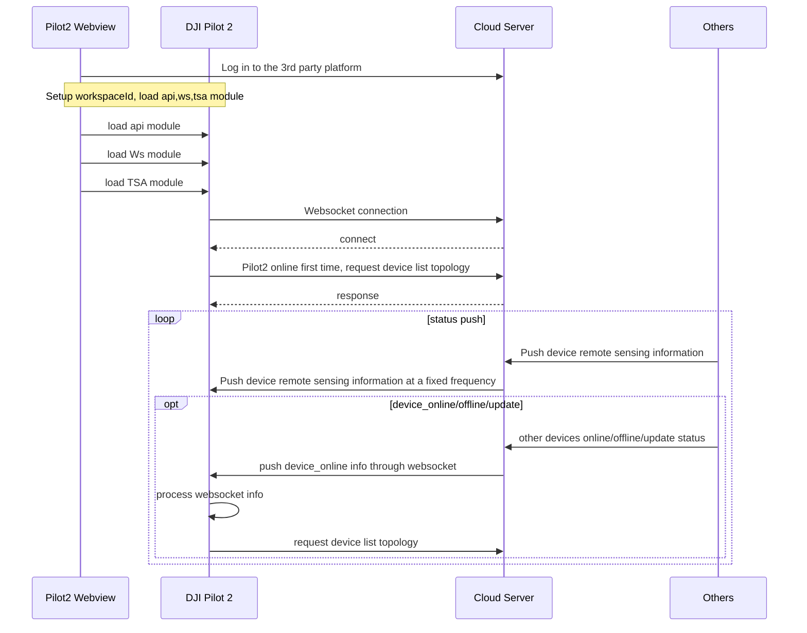
```mermaid
sequenceDiagram

participant h5 as Pilot2 Webview
participant app as DJI Pilot 2
participant cloud as Cloud Server
participant other as Others
h5 ->> cloud:Log in to the 3rd party platform
note over app, h5: Setup workspaceId, load api,ws,tsa module
h5 ->> app: load api module
h5 ->> app: load Ws module
h5 ->> app: load TSA module
app ->> cloud: Websocket connection
cloud -->> app:connect

app ->> cloud:Pilot2 online first time, request device list topology
cloud -->> app: response

loop status push
other ->> cloud: Push device remote sensing information
cloud ->> app: Push device remote sensing information at a fixed frequency

opt device_online/offline/update
	other ->> cloud: other devices online/offline/update status
	cloud ->> app: push device_online info through websocket
	app ->> app:process websocket info
	app ->> cloud: request device list topology
end

end

```
## Detailed API Realization
* [JSBridge](https://developer.dji.com/doc/cloud-api-tutorial/en/api-reference/pilot-to-cloud/jsbridge.html)

  * Load DJI Pilot 2 TSA Module `window.djiBridge.platformLoadComponent(String name, String param)` <br/>
    Before using the TSA function, developers need to set up the workspaceId, configure the Ws module and api module, and then load the DJI Pilot 2 map module. Also, developers can consider adding the loading interface of map module in log-in phase.

* [Situation Awareness (HTTPS)](https://developer.dji.com/doc/cloud-api-tutorial/en/api-reference/pilot-to-cloud/https/situation-awareness/obtain-device-topology-list.html)

  * Obtain Device Topology List<br/>
    In the first connection, DJI Pilot 2 will send out an http request to obtain all devices list and topology list. On the server end, it needs to synchronize the device list to DJI Pilot 2. Also, if it receives an instruction of device online/offline/update from WebSocket, it needs the same interface to request the update of the device topology list.

  * Custom Icon<br/>
    The device can display custom icons by using icon_urls. If the field is defined, it will be displayed in preference to the content of the field. If not, it is displayed by default by device_model.

```json
"icon_urls":{
                "normal_icon_url":"resource://Pilot2/drawable/tsa_aircraft_others_normal",    // Normal status icon
                "selected_icon_url":"resource://Pilot2/drawable/tsa_aircraft_others_pressed",   // Selected status icon
            }
```

App has some built-in icons.

```json
url style:  resource://Pilot2/drawable/tsa_aircraft_others_normal
```

Built-in Icon List

| Icon                                                         | Icon_url                                        | Remark |
| ------------------------------------------------------------ | ----------------------------------------------- | ------ |
|  | resource://Pilot2/drawable/tsa_car_select       |        |
|  | resource://Pilot2/drawable/tsa_car_normal       |        |
|  | resource://Pilot2/drawable/tsa_person_select    |        |
|  | resource://Pilot2/drawable/tsa_person_normal    |        |
|  | resource://Pilot2/drawable/tsa_equipment_select |        |
|  | resource://Pilot2/drawable/tsa_equipment_normal |        |

Support online icon. Online Icons are downloaded and cached inside the App and displayed on the map at a fixed size (28dp).

```
url style: http://r56978dr7.hn-bkt.clouddn.com/tsa_equipment_normal.png
```

The icon in DJI Pilot 2 Map:

<center>        <br>     </center>

* [Situation Awareness (WebSocket)](https://developer.dji.com/doc/cloud-api-tutorial/en/api-reference/pilot-to-cloud/websocket/situation-awareness/message-push.html) and [Remote Controller Properties](https://developer.dji.com/doc/cloud-api-tutorial/en/api-reference/pilot-to-cloud/mqtt/rc-plus/properties.html)

  * Device Remote Sensing information Push<br/>
    The Server end will push all devices' remote sensing information under the same workspace to DJI Pilot 2 and DJI Pilot 2 will update the status and position of the device based on the received data.

  * Device Online/Offline/Update Topology Status Push<br/>
    When the Server end has received a request for any device online/offline/topology update, it will broadcast a device online/offline/topology update push notification to DJI Pilot 2. DJI Pilot 2 will trigger "obtain device topology list"

<a id="s0019"></a>
## S0019 — 30.pilot livestream
Path: `30.feature-set/10.pilot-feature-set/30.pilot-livestream.md`

## Overview
The live streaming mainly sends the camera payload of the aircraft and the video stream of the DJI Dock to the tripartite cloud platform for broadcasting, and users can conveniently broadcast live on the remote web page.
## Supported Live Streaming Types
| Type    | Description                                                  |
| ------- | ------------------------------------------------------------ |
| Agora   | The DJI public cloud platform is also based on the "Interactive Live Streaming Standard" function of Agora. The overall live broadcast delay is relatively low and the effect is good. <br/>For the third-party cloud privatization deployment, Agora also provides a hybrid cloud deployment model. The data is in the customer's private server, and then a link is opened through the air gap to the Agora's public cloud. This link channel is mainly used to upgrade and operate and maintain the privatized deployed servers. |
| RTMP    | Real-Time Messaging Protocol (RTMP) is a communication protocol for streaming audio, video and data over the Internet. This protocol is based on TCP and is a protocol family that includes the RTMP and RTMPT, RTMPS, RTMPE and many other variants. |
| RTSP    | RTSP (Real Time Streaming Protocol) is an application layer protocol in the TCP/IP protocol architecture that defines how one-to-many applications can efficiently deliver multimedia data over IP networks. RTSP is on top of RTP and RTCP in architecture, and it uses TCP or UDP to complete data transmission. Compared with RTSP, HTTP transmits HTML, while RTSP transmits multimedia data. |
| GB28181 | GB/T 28181-2016 is a transmission control standard for the access of security video equipment to platforms in Mainland China. For some servers which already have 28181 downlink gateway, the data rate of DJI enterprise devices can be pushed to the server directly through this protocol. |
## Framework for Live Streaming


As shown above, the aircraft flight platform is not directly connected to the tripartite cloud platform, it needs to be forwarded through the remote control or the DJI Dock. The communication between the remote control and the DJI Dock and the aircraft is still using DJI private AirLink.

The tripartite cloud platform requires pre-deployment of MQTT and streaming media server. DJI's streaming protocol supports RTMP, RTSP, GB28181 and Agora. MQTT is mainly used for message communication, configuration information setting and reading.
## Pilot Interactive Timing Diagram
### Load Live Streaming Module
 ```mermaid
sequenceDiagram

participant pilot as DJI Pilot 2
participant webview as Pilot Webview
participant mqtt as MQTT Gateway
participant server as Cloud Server
participant web as Third-party Web Page

server ->> mqtt: Subscribe "thing/product/{gateway_sn}/state" topic
server ->> mqtt: Subscribe "thing/product/{gateway_sn}/osd" topic
server ->> mqtt: Subscribe "thing/product/{gateway_sn}/services_reply" topic

pilot ->> mqtt: Subscribe "thing/product/{gateway_sn}/services" topic
pilot ->> mqtt: Publish "thing/product/{gateway_sn}/state" topic

    note left of webview: The live capability is included in the topic and <br/>needs to be resolved by the server after <br/>subscription.

mqtt ->> server: Publish state topic

    note over server: Resolve the live_capacity structure in the <br/>state topic, and save it in the database
    note over pilot: Loading live streaming module <br/>JSBridge:platformLoadComponent
    note left of webview: Note: You need to load live streaming module <br/>through JSBridge interface in advance to use <br/>live streaming function.
```
### Server Side call protocol to start live stream
 ```mermaid
sequenceDiagram

participant pilot as DJI Pilot 2
participant preview as Pilot Preview
participant mqtt as MQTT Gateway
participant server as Cloud Server
participant web as Third-party Web Page

web ->> server: Send a request to query the device live capability

    note over server: Query the local database for <br/>device live capability

server ->> web: Return live capability data
server ->> web: Click to start live streaming
server ->> mqtt: Sending services topics of method="live_start_push"
mqtt ->> pilot: Publish services topic

    note over pilot: Parse and verify services topic
    note left of preview: The checks include whether the camera is decoding, <br/>whether in flight control interface and so on

pilot -->> mqtt: Publish "service_reply" topic
mqtt -->> server: Publish service_reply topic
pilot ->> mqtt: Publish osd topic that contains the live_status field
mqtt ->> server: Publish osd topic

```
### Verification Succeeded
 ```mermaid
sequenceDiagram

participant pilot as DJI Pilot 2
participant webview as Pilot Webview
participant mqtt as MQTT Gateway
participant server as Cloud Server
participant web as Third-party Web Page

    note over pilot: Turn on the encoder

pilot ->> server: Pushing streams to live streaming servers
pilot ->> mqtt: Report opening success <br/>through service_reply topic

mqtt -->> server: Publish that live streaming <br/>was successfully opened
server -->> web: Start pulling the streaming

```
### Verification Failed
 ```mermaid
sequenceDiagram

participant pilot as DJI Pilot 2
participant webview as Pilot Webview
participant mqtt as MQTT Gateway
participant server as Cloud Server
participant web as Third-party Web Page

pilot ->> mqtt: Publish the failure and the reason for the failure of start <br/>the live streaming through the service_reply topic
mqtt ->> server: Publish the failure message

```
### App Side call JSBridge to start live stream
 ```mermaid
sequenceDiagram

participant pilot as DJI Pilot 2
participant webview as Pilot Webview
participant mqtt as MQTT Gateway
participant server as Cloud Server
participant web as Third-party Web Page

webview ->> server: Go to the DJI Pilot 2 webview page and pull the <br/>live streaming configuration parameters in the <br/>server-side
server -->> webview: Return live streaming parameters
webview ->> pilot: Set manual live streaming parameters, and initiate <br/>live streaming immediately after the first setting <br/>JSBridge:liveshareSetConfig

    note over pilot: User chooses to start or stop <br/>a live streaming from the flight <br/>control screen

pilot ->> server: Push streaming
server ->> web: Pull the streaming and play

```
## Detailed API Realization
* [JSBridge](https://developer.dji.com/doc/cloud-api-tutorial/en/api-reference/pilot-to-cloud/jsbridge.html)

  * Load DJI Pilot 2 Live Module `window.djiBridge.platformLoadComponent(String name, String param)`<br/>
    Before using the live streaming function, you need to pre-load Pilot2's live streaming module via JSBridge in the Webview, developers can consider adding the interface to load the live module directly during the up/down login stage.

  * App Side call JSBridge to start livestreaming<br/>
    For scenarios that do not require live viewing in the background, but need to turn on live streaming when the user is using it and send the code stream back to the server for archival analysis. The interface can be combined to allow users to manually trigger the live streaming function in Pilot2, with the following detailed steps.
      1. After logging into the three-party cloud platform in the Webview of Pilot2, you need to request a live streaming server address parameter from the server, which is configured differently by each three-party cloud platform, or you can write it directly in the front-end code.
      2. Send the live streaming parameters to DJI Pilot 2 for setting through the JSBridge interface.
      3. After DJI Pilot 2 receives the live broadcast configuration, it immediately initiates a live stream push, and users can enter the flight interface to view live information, stop the live broadcast, restart the live broadcast, and other operations.

      > Note: In the manual live streaming mode, the streaming image is always the main image stream of DJI Pilot 2. When DJI Pilot 2 switches the camera image, the streaming image will also change accordingly.

* [Live Stream (MQTT)](https://developer.dji.com/doc/cloud-api-tutorial/en/api-reference/pilot-to-cloud/mqtt/rc-plus/live.html)

  * Live Capacity<br/>
    The field live_capacity is placed in the object model of the gateway device and is only pushed when there is a state change on the device side.

  * Start Live Streaming<br/>
    The server sends the command ``method=live_start_push`` to the device via MQTT, which uses the service method of the thing model to interact.

  * Stop Live Streaming

  * Set Live Streaming Quality

<a id="s0020"></a>
## S0020 — 40.pilot map elements
Path: `30.feature-set/10.pilot-feature-set/40.pilot-map-elements.md`

## Function Overview
The Map Elements is a function that can synchronize points, lines, and polygons from the DJI Pilot 2 map to the cloud server. To achieve a real-time tactical layout, it gives the commander/host the ability to share the layers with DJI Pilot 2 through the web browser. On the other side, DJI Pilot 2 can also share the signs to the web end to help the commander/host have more information. In addition, the platform also can distribute the layers from one DJI Pilot 2 to another different DJI Pilot 2 during the mission.

Notes:

1. Please set up the workspace. The DJI Pilot 2 only starts synchronizing the workspace's elements once the setup is complete.
2. Different remote controllers will synchronize the map elements automatically without the transference from the Server end.
3. If an aircraft connect with two remote controller A and B and only remote B has connected with Server, the new point/sign/mark from the remote controller A would synchronize with remote controller B first. Then the remote controller B will upload the point to the server end.
4. The latitude and longitude coordinates of map elements use the WGS84 coordinate system. If the Web terminal uses Baidu, AutoNavi, etc., coordinate conversion is required.


Legend: DJI Pilot 2 Map UI


Legend: Web map page
## Interaction Sequence Diagram
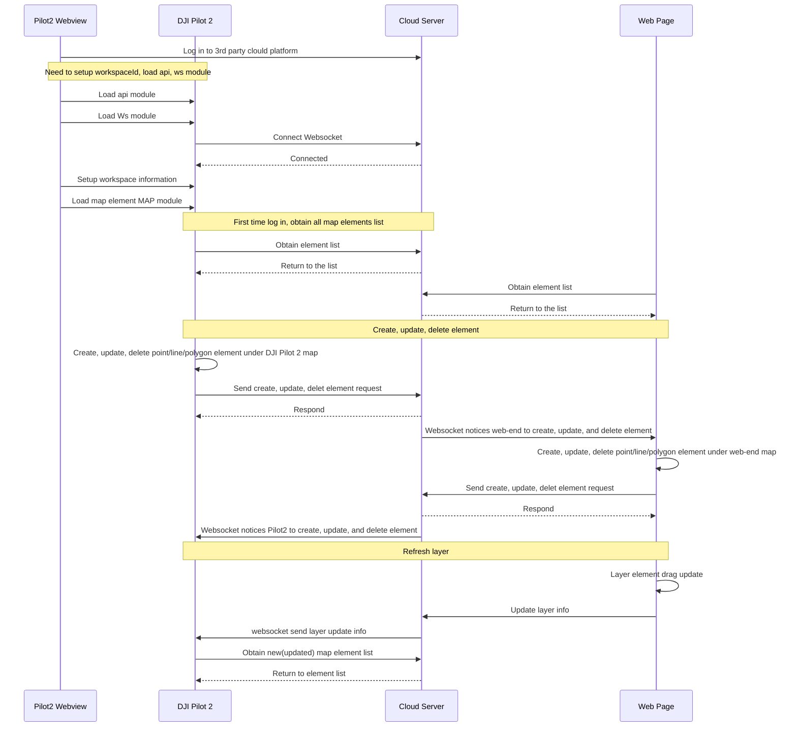
```mermaid
sequenceDiagram

participant h5 as Pilot2 Webview
participant app as DJI Pilot 2
participant cloud as Cloud Server
participant web as Web Page
h5 ->> cloud:Log in to 3rd party clould platform
note over app, h5: Need to setup workspaceId, load api, ws module
h5 ->> app: Load api module
h5 ->> app: Load Ws module
app ->> cloud: Connect Websocket
cloud -->> app:Connected
h5 ->> app: Setup workspace information
h5 ->> app:Load map element MAP module
note over app,cloud: First time log in, obtain all map elements list

app ->> cloud: Obtain element list
cloud -->> app:Return to the list
web ->> cloud: Obtain element list
cloud -->> web:Return to the list

note over app,web:Create, update, delete element
app ->> app: Create, update, delete point/line/polygon element under DJI Pilot 2 map
app ->> cloud: Send create, update, delet element request
cloud -->> app:Respond
cloud ->>web: Websocket notices web-end to create, update, and delete element
web ->> web: Create, update, delete point/line/polygon element under web-end map
web ->> cloud: Send create, update, delet element request
cloud -->> web:Respond
cloud ->>app: Websocket notices Pilot2 to create, update, and delete element

note over app, web:Refresh layer
web  ->> web:Layer element drag update
web ->> cloud:Update layer info
cloud ->> app: websocket send layer update info
app ->> cloud: Obtain new(updated) map element list
cloud -->> app: Return to element list

```
## Detailed API Realization
* [JSBridge](https://developer.dji.com/doc/cloud-api-tutorial/en/api-reference/pilot-to-cloud/jsbridge.html)

  * Load DJI Pilot 2 Map Element Module `window.djiBridge.platformLoadComponent(String name, String param)`<br/>
    Before using the map element function, developers need to set up the workspaceId, configure the Ws module and api module, and then load the DJI Pilot 2 map module. Also, developers can consider adding the loading interface of map module in log-in phase.

* [Map Element (HTTPS)](https://developer.dji.com/doc/cloud-api-tutorial/en/api-reference/pilot-to-cloud/https/map-elements/create.html)

  * Obtain Map Element List<br/>
    In the first connection, DJI Pilot 2 will send out an http request to obtain the map element list. On the server end, it needs to synchronize the map element list to DJI Pilot 2. Also, if it receives a layer refresh instruction from WebSocket, it needs the same interface to request the map element list.

    > Note: The list has to have the APP sharing layer, otherwise the successor element cannot be synchronized to the server.

  * New Map Element Request<br/>
    When user draws a point, line or polygon on the Pilot2/Web side, it will send out a new map element request to the server end. Then the server end will respond after receiving the request.

  * Map Element Update Request<br/>
    When user draws a point, line or polygon on the Pilot2/Web side, it will send out a map element update request to the server end. Then the server end will respond after receiving the request.

  * Delete Map Element Request<br/>
    When user deletes a point, line or polygon on the Pilot2/Web side, it will send out a delete map element request to the server end. Then the server end will respond after receiving the request.

* [Map Element (WebSocket)](https://developer.dji.com/doc/cloud-api-tutorial/en/api-reference/pilot-to-cloud/websocket/map-elements/message-push.html)

  * Refresh Map Element List Push<br/>
    When several elements have changed on the server end, such as drag an element on web end, the user end can be notified through WebSocket. The downward parameter has the layer group_id. The user end can call "Obtain Map Element List" to refresh the element list through http after receiving the ID.

  * New/Update/Delete Map Element Push<br/>
    After receiving the new/update/delete map element request from Pilot2/Web end, the server end will update the stored element and will notify all terminal in the same workspace.

<a id="s0021"></a>
## S0021 — 50.pilot media management
Path: `30.feature-set/10.pilot-feature-set/50.pilot-media-management.md`

## Function Overview
The media library is the function that helps Pilot2/DOCK to upload the photos/videos, downloaded from aircraft to the remote controller/dock, to the third-party server. Media upload function includes auto upload or manual upload. For DJI Dock, it has auto upload only.

We provide the Demo of media management function, and you can see the running result from [Function Display Video](https://developer.dji.com/doc/cloud-api-tutorial/en/quick-start/function-display-video.html). From that video, you can get how to configure the object storage, how to open the uploading switch automatically, the operation steps of automatic uploading and manual uploading.  Media object storage support OSS and S3.

<center>        <br>     </center>
## Interaction Sequence Diagram

## Detailed API Realization
* [JSBridge](https://developer.dji.com/doc/cloud-api-tutorial/en/api-reference/pilot-to-cloud/jsbridge.html)

  * Load Media Library Module `window.djiBridge.platformLoadComponent(String name, String param)`<br/>
    Before using the media library module, developer needs to set up the workspace ID in H5 through JSBridge, configure API module, and then load the DJI Pilot 2 media module. Also, developers can consider adding the loading interface of Media Library module in log-in phase.

* [Media Management (HTTPS)](https://developer.dji.com/doc/cloud-api-tutorial/en/api-reference/pilot-to-cloud/https/media-management/fast-upload.html)

  * Media Fast Upload<br/>
    As the transfer of files may exist in the cloud of existing images, then DJI Pilot 2 or dock will start the file fast transfer interface when uploading files, the server needs to check whether the file has been uploaded exists, if it exists, directly return the upload success.

  * Obtain Exist File Tiny Fingerprint<br/>
    For whether the file exists or not, the corresponding fingerprint verification needs to be done, but since media files vary in size, DJI provides a set of media file streamlined fingerprint generation schemes, and the server side only needs to calculate the media fingerprint information according to this scheme and return it to the DJI Pilot 2 side.

  * Obtain Temporary Credential<br/>
    For each media upload, you need to obtain temporary file upload credentials from the server, so that DJI Pilot 2 will bring the credentials to the object storage service for verification when uploading.

  * App Reports File Upload Result<br/>
    After the media file transfer is finished, DJI Pilot 2 will call this interface to inform the server of the corresponding media file upload result.

<a id="s0022"></a>
## S0022 — 60.pilot wayline management
Path: `30.feature-set/10.pilot-feature-set/60.pilot-wayline-management.md`

## Function Overview
Wayline management provides an ability that the flight path can be downloaded or uploaded in the same workspace. After logging in to the server through Pilot2, the user can obtain the Wayline list and display it in the Wayline library. In Pilot2, the Waylines existing in the cloud can be previewed directly, but when the user wants to edit the Wayline, it needs to be downloaded in DJI Pilot 2 locally and it will not affect the original Wayline in cloud. The edited Wayline need a new name for sharing.

Note: After editing Wayline locally, it has to give a new name for the Wayline. Otherwise, the transmission of the Wayline will fail.

<center>        <br>     </center>

We provide [Waypoint File Format Standard](https://developer.dji.com/doc/cloud-api-tutorial/en/api-reference/dji-wpml/overview.html). If users write waypoint files based on our standard, the development threshold can be significantly lowered.
## Interaction Sequence Diagram
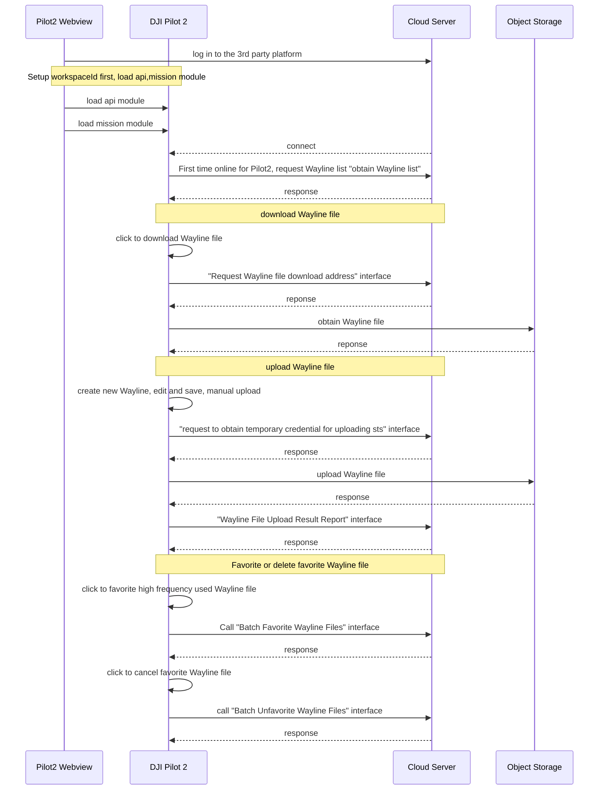
```mermaid
sequenceDiagram
participant h5 as Pilot2 Webview
participant app  as DJI Pilot 2
participant cloud as Cloud Server
participant oss as Object Storage

h5 ->> cloud:log in to the 3rd party platform
note over app, h5: Setup workspaceId first, load api,mission module
h5 ->> app: load api module
h5 ->> app: load mission module
cloud -->> app:connect

app ->> cloud:First time online for Pilot2, request Wayline list "obtain Wayline list"
cloud -->> app: response

note over app,cloud: download Wayline file
app ->> app: click to download Wayline file
app ->> cloud: "Request Wayline file download address" interface
cloud -->> app: reponse
app ->> oss: obtain Wayline file
oss -->> app: reponse

note over app,cloud: upload Wayline file
app ->> app: create new Wayline, edit and save, manual upload
app ->> cloud: "request to obtain temporary credential for uploading sts" interface
cloud -->> app: response
app ->> oss: upload Wayline file
oss -->> app: response
app ->> cloud: "Wayline File Upload Result Report" interface
cloud -->> app: response

note over app,cloud: Favorite or delete favorite Wayline file
app ->> app: click to favorite high frequency used Wayline file
app ->> cloud: Call "Batch Favorite Wayline Files" interface
cloud -->> app: response
app ->> app: click to cancel favorite Wayline file
app ->> cloud: call "Batch Unfavorite Wayline Files" interface
cloud -->> app: response

```
## Detailed API Realization
* [JSBridge](https://developer.dji.com/doc/cloud-api-tutorial/en/api-reference/pilot-to-cloud/jsbridge.html)

  * Load Mission Wayline Module `window.djiBridge.platformLoadComponent(String name, String param)`<br/>
    Before using the Wayline library module, developer need to setup the workspace ID in H5 through JSBridge, configure API module and then load the DJI Pilot 2 mission module. Also, developers can consider adding the loading interface of mission module in log-in phase.

* [Wayline Management (HTTPS)](https://developer.dji.com/doc/cloud-api-tutorial/en/api-reference/pilot-to-cloud/https/waypoint-management/obtain-waypointfile-list.html)

  * Obtain Temporary Credential<br/>
    For each waypoint file upload, you need to obtain temporary file upload credentials from the server, so that DJI Pilot 2 will bring the credentials to the object storage service for verification when uploading.

  * Obtain Wayline List<br/>
    After loading the Mission Wayline library module, DJI Pilot 2 will pull the list of Wayline files from the server via HTTP and display them in the DJI Pilot 2 Wayline library.

  * Obtain Wayline File Download Address<br/>
    When user clicks to download Wayline in the DJI Pilot 2 Wayline list, the DJI Pilot 2 will initiate a request to get the Wayline download address.

  * Obtain Duplicated Wayline Name<br/>
    DJI Pilot 2 does not allow duplicate Wayline names to exist in locally edited and uploaded Wayline files, so when uploading a Wayline file, you need to call this interface first to check if there is a duplicate Wayline file name, and if there is a duplicate Wayline file name, a pop-up window will prompt the user to rename the Wayline file name.

  * Wayline File Upload Result Report<br/>
    After the Wayline file is uploaded to the object storage service, DJI Pilot 2 will report the upload result to the server side, which will perform the corresponding business operations on the result.

  * Batch Favorite Wayline Files<br/>
    When users need to pay special attention to waypoint files, they can click on Favorites. At the same time, the interface will be called to mark the Wayline files that need to be favored.

  * Batch Unfavorite Wayline Files<br/>
    Same function as above, to unmark the Wayline files as favorites.

<a id="s0023"></a>
## S0023 — 70.pull pilot log
Path: `30.feature-set/10.pilot-feature-set/70.pull-pilot-log.md`

## Overview
In the process of using DJI Pilot 2, it is inevitable to encounter problems such as abnormal interface communication and function failure, and it is necessary to pull the DJI Pilot 2 log for diagnosis(Refer to [Log Export](https://developer.dji.com/doc/cloud-api-tutorial/en/debug/log-export.html)). In order to solve this problem, DJI Pilot 2 also provides JSBridge interface for developers to pull the log. And upload the Webview to the developer's own server for analysis.

> Note:
>
> DJI Pilot 2 logs are encrypted, so the developer needs to provide the public key information for log encryption through the JSBridge interface, and the pulled logs also need to be decrypted to view them. DJI provides a JAR library for decrypting logs that can be decrypted by developers running scripts.

Decryption method: Use plogdecoder. jar library to run scripts to decrypt the pulled logs. [Download](https://terra-1-g.djicdn.com/71a7d383e71a4fb8887a310eb746b47f/cloudapi/V1.1/PlogDecoder.jar)

Example:

```shell
java -jar PlogDecoder.jar -key "Desktop/rsa_keys/pri.key" -log "/open_platform/log-2022-01-18.log".
//If the public key is not set, you can omit the -key parameter.
```
## Detailed API Realization
Please refer to [JSBridge](https://developer.dji.com/doc/cloud-api-tutorial/en/api-reference/pilot-to-cloud/jsbridge.html).

* Get Logs Path `window.djiBridge.platformGetLogPath()`

  The developer can get the path to the logs saved by the DJI Pilot 2 via the js method and then can upload the logs via file upload.

* Set Logs Encrypt Key `window.djiBridge.platformSetLogEncryptKey(String key)`

* Clear Logs Encrypt Key `window.djiBridge.platformClearLogEncryptKey()`

> Note: When clearing the encryption key, if there is already part of the log using the original key, it will not be re-encrypted. In this case, the developer needs to save the historical key himself to prevent the log file from not being opened.

<a id="s0024"></a>
## S0024 — 80.pilot third party app
Path: `30.feature-set/10.pilot-feature-set/80.pilot-third-party-app.md`

## Overview
For business scenarios that cannot be met by using DJI Pilot 2, developers can develop a lightweight App to be used together with Pilot2, such as intercom, special task commands, work orders, etc. In this way, users can directly open the third-party App through the Webview page of DJI Pilot 2. While developer only needs to automatically invoke the JsBridge interface to wake up the third-party App when opening the WebView page. The detailed configuration can be found at the link. [Jump to third-party apps in Android WebView](https://developer.aliyun.com/article/595078).
## Detailed API Realization
* Jump to Third-party Apps

  API: Refer to App API > JSBridge API References-`window.open('scheme://host...', arg)`

<a id="s0025"></a>
## S0025 — 90.drc
Path: `30.feature-set/10.pilot-feature-set/90.drc.md`

## Overview
Pilot access to the cloud adds the remote control functionality. Users can control the aircraft gimbal and payloads via Pilot to achieve tasks such as looking at specific location, capturing, recording, measuring infrared temperature and so on. OSD and obstacle sensing information reporting is also supported. Currently only Mavic 3 Enterprise Series model is supported and there is no distinction between the flight control authority and payload control authority.

* Flight control commands (DRC commands)

  Drone Remote Control (DRC) uses MQTT protocol and add two new topics to represents upward link and downward link. [MQTT Topic Definition](https://developer.dji.com/doc/cloud-api-tutorial/en/api-reference/dock-to-cloud/mqtt/topic-definition.html) provides introduction and example of drc Topic structure. After the server and device successfully build MQTT link, an EMQX Broker will be distributed to the DRC communication link from server to device for faster transmission and response. To use DRC commands, the live flight controls control mode should be entered in advanced. DRC commands usually do not limited by flight control authority, but the `DRC-flight control Method: drone_control` must need the flight control authority.

<div>
<div div style="text-align: center"><p>Figure. DRC link</p></div>
<div align=center>

</div></div>

* Payload control commands: All the payload control commands require payload control authority. Current payload control commands control the camera and gimbal actions to realize the payload operations like photo taking, camera zooming in or zooming out, gimbal reset and so on. Therefore the target information can be obtained through these payload operations.
## Interaction Sequence Diagram
> Note: To avoid the drone damage, executing the control authority seizure is recommended before issue the live flight controls APIs.

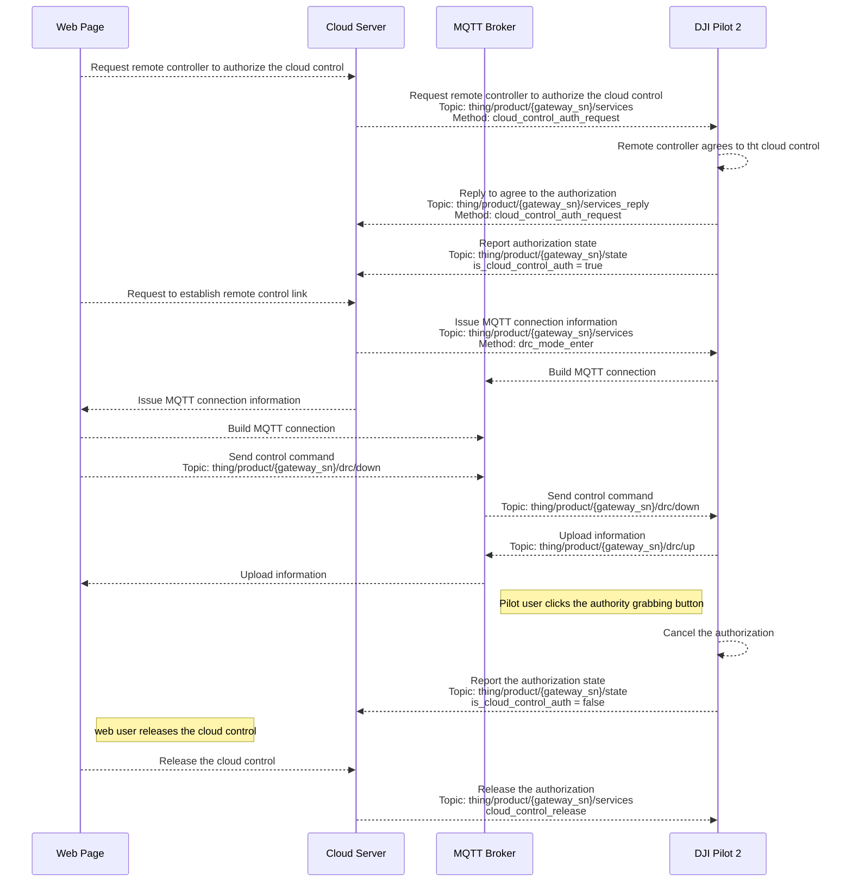
```mermaid
sequenceDiagram

participant web as Web Page
participant cloud as Cloud Server
participant mqtt as MQTT Broker
participant pilot as DJI Pilot 2

web -->> cloud: Request remote controller to authorize the cloud control
cloud -->> pilot: Request remote controller to authorize the cloud control <br/>Topic: thing/product/{gateway_sn}/services <br/>Method: cloud_control_auth_request
pilot -->> pilot: Remote controller agrees to tht cloud control
pilot -->> cloud: Reply to agree to the authorization <br/>Topic: thing/product/{gateway_sn}/services_reply <br/>Method: cloud_control_auth_request
pilot -->> cloud: Report authorization state <br/>Topic: thing/product/{gateway_sn}/state <br/>is_cloud_control_auth = true

web -->> cloud: Request to establish remote control link
cloud -->> pilot: Issue MQTT connection information <br/>Topic: thing/product/{gateway_sn}/services <br/>Method: drc_mode_enter
pilot -->> mqtt: Build MQTT connection
cloud -->> web: Issue MQTT connection information
web -->> mqtt: Build MQTT connection

web -->> mqtt: Send control command <br/>Topic: thing/product/{gateway_sn}/drc/down
mqtt -->> pilot: Send control command <br/>Topic: thing/product/{gateway_sn}/drc/down

pilot -->> mqtt: Upload information <br/>Topic: thing/product/{gateway_sn}/drc/up
mqtt -->> web: Upload information

    note left of pilot: Pilot user clicks the authority grabbing button

pilot -->> pilot: Cancel the authorization
pilot -->> cloud: Report the authorization state <br/>Topic: thing/product/{gateway_sn}/state <br/>is_cloud_control_auth = false

    note right of web: web user releases the cloud control

web -->> cloud: Release the cloud control
cloud -->> pilot: Release the authorization <br/>Topic: thing/product/{gateway_sn}/services <br/>cloud_control_release
```
## Detailed API Realization
> Note: Only when the "Media File Upload" is opened on Pilot, the media files generated by the payload control commands will be pushed by the media management function. For how to open the "Media File Upload" on Pilot, please refer to [the Media File Library chapter of DJI FlightHub 2 User Manual](https://fh.dji.com/user-manual/en/media-files.html).

[Live Flight Controls](https://developer.dji.com/doc/cloud-api-tutorial/en/api-reference/pilot-to-cloud/mqtt/rc-pro/drc.html)

* Flight control commands (DRC commands)
* Payload control commands

[Remote Control](https://developer.dji.com/doc/cloud-api-tutorial/en/api-reference/pilot-to-cloud/mqtt/rc-pro/remote-control.html)

<a id="s0026"></a>
## S0026 — 10.dock access to cloud
Path: `30.feature-set/20.dock-feature-set/10.dock-access-to-cloud.md`

## Overview
The DJI Dock access to the Server requires the DJI Pilot 2 installed on the remote controller. As shown in the following figure, developers can complete the access process according to the instruction displayed in the Pilot. During the access process, developers need to check the device (such as checking the emergency stop buttons, and whether the internet is connected), connect the aircraft to the Dock, complete the configuration information (such as filling in the MQTT account and password to realize the MQTT connection), and so on. Through the Demo, operation instruction for the access process can be obtained. For the instruction video, please read the "Dock access to Cloud Server" in [Function Display Video](https://developer.dji.com/doc/cloud-api-tutorial/en/quick-start/function-display-video.html).

<div align=center>

</div>

Dock access to the server needs License verification. The License comes from the App application of Cloud API type in the [Developer Website](https://developer.dji.com/user/apps/#all). The application result is shown in the following figure. After the successful application, the developer can be determined as a developer authorized by DJI.

<div align=center>

</div>

> Notes:
>
> * When DJI Pilot 2 and the DJI Dock access third-party clouds, in scenarios with high-security requirements, the communication link needs to be encrypted to achieve secure data communication. By default, the SSL link believe that the device will authenticate the server, and the server will not authenticate the device. If the server enables the device authentication, the configuration of "clientAuth" needs to be performed on the server.
> * DJI Pilot 2 and DJI Dock support certificates issued by Godaddy. If developers need data security encryption, they can use the same certification authority certificate as DJI to achieve MQTT SSL authentication.
## Interaction Sequence Diagram
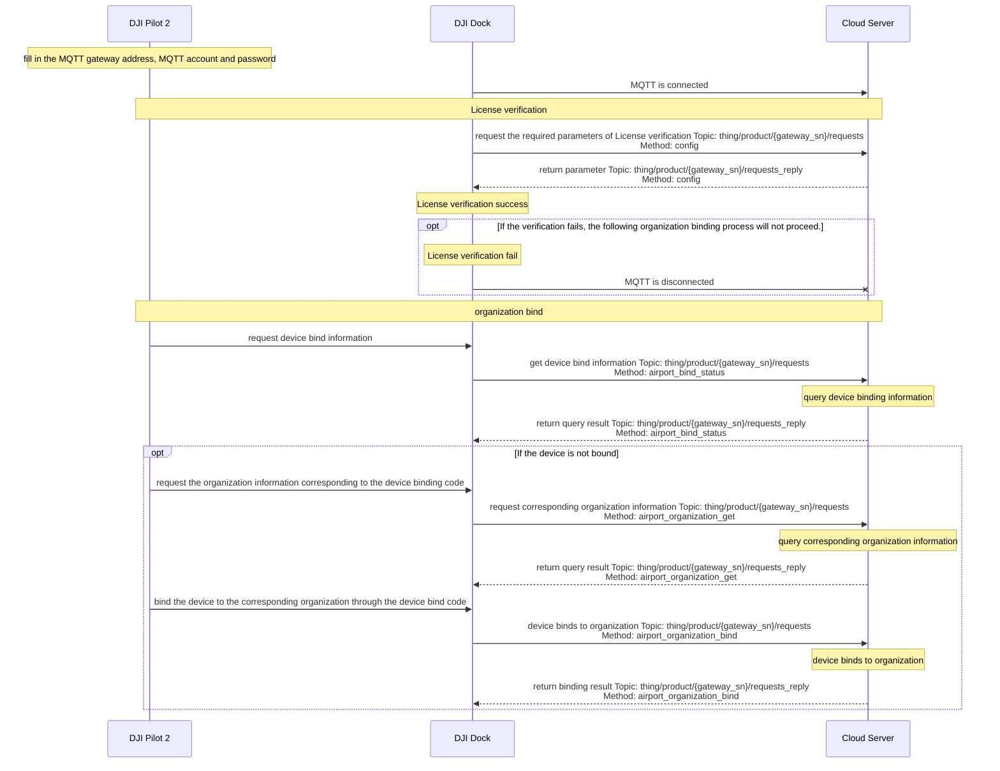
```mermaid
sequenceDiagram
participant pilot as DJI Pilot 2
participant client as DJI Dock
participant server as Cloud Server

note over pilot: fill in the MQTT gateway address, MQTT account and password
client ->> server: MQTT is connected

note over pilot, server: License verification

client ->> server: request the required parameters of License verification Topic: thing/product/{gateway_sn}/requests<br/>Method: config
server -->> client: return parameter Topic: thing/product/{gateway_sn}/requests_reply<br/>Method: config

note over client: License verification success
opt If the verification fails, the following organization binding process will not proceed.
    note over client: License verification fail
    client -x server: MQTT is disconnected
end

note over pilot, server: organization bind
pilot ->> client: request device bind information
client ->> server: get device bind information Topic: thing/product/{gateway_sn}/requests<br/>Method: airport_bind_status
note over server: query device binding information
server -->> client: return query result Topic: thing/product/{gateway_sn}/requests_reply<br/>Method: airport_bind_status

opt If the device is not bound
pilot ->> client: request the organization information corresponding to the device binding code
client ->> server: request corresponding organization information Topic: thing/product/{gateway_sn}/requests<br/>Method: airport_organization_get
note over server: query corresponding organization information
server -->> client: return query result Topic: thing/product/{gateway_sn}/requests_reply<br/>Method: airport_organization_get
pilot ->> client: bind the device to the corresponding organization through the device bind code
client ->> server: device binds to organization Topic: thing/product/{gateway_sn}/requests<br/>Method: airport_organization_bind
note over server: device binds to organization
server -->> client: return binding result Topic: thing/product/{gateway_sn}/requests_reply<br/>Method: airport_organization_bind
end
```
## Detailed API Realization
* [Pilot installation package](https://sdk-forum.dji.net/hc/en-us/articles/6177232395801-How-do-I-install-Pilot2-Where-can-I-get-the-installation-package-)

* [Configuration Update](https://developer.dji.com/doc/cloud-api-tutorial/en/api-reference/dock-to-cloud/mqtt/dock/dock1/config.html)
  * Get the configuration

* [Organization Management](https://developer.dji.com/doc/cloud-api-tutorial/en/server-api-reference/mqtt/thing-model/gateway/dock/organization.html)
  * Obtain organization binding information
  * Search for the organization information that the device is bound to<br/>
    If the device is successfully bound, the DJI Dock and aircraft will be bound to the corresponding organization of the device binding code. Developers can custom design how to verify and get the organization name for binding through the device binding code and organization ID filled in the Pilot. In the Demo, the device binding code is filled by default, it is only for reference.
  * Device binds to organization

<a id="s0027"></a>
## S0027 — 100.drc
Path: `30.feature-set/20.dock-feature-set/100.drc.md`

## Function Overview
The live flight controls function is provided to solve the restriction that the drone and DJI Dock can not be immediately operated during the remote controlling process. At real scenes, the drone can response from idle state or pause the executing flight mission. Developer can control the device or payload through manual method. Through the live flight controls function, developer can get safe and reliable drone control, high real-time command sending and live streaming screen transmission, osd information pushing and payload control ability.

Live flight controls APIs can be divided into flight control commands (DRC commands), payload control commands, flyto commands and one-key taking off commands.

* Flight control commands (DRC commands)

  Drone Remote Control (DRC) uses MQTT protocol and add two new topics to represents upward link and downward link. [MQTT Topic Definition](https://developer.dji.com/doc/cloud-api-tutorial/en/api-reference/dock-to-cloud/mqtt/topic-definition.html) provides introduction and example of drc Topic structure. After the server and device successfully build MQTT link, an EMQX Broker will be distributed to the DRC communication link from server to device for faster transmission and response. To use DRC commands, the live flight controls control mode should be entered in advanced. DRC commands usually do not limited by flight control authority, but the `DRC-flight control Method: drone_control` must need the flight control authority.

<div>
<div div style="text-align: center"><p>Figure. DRC link</p></div>
<div align=center>

</div></div>

* Payload control commands: All the payload control commands require payload control authority. Current payload control commands control the camera and gimbal actions to realize the payload operations like photo taking, camera zooming in or zooming out, gimbal reset and so on. Therefore the target information can be obtained through these payload operations.

* Flyto commands and one-key taking off commands: flyto commands and one-key taking off commands are used to make the drone fly to the target point and hover. The difference is at the applicable scene. The flyto commands are applicable when the drone is in the air. The one-key taking off commands are applicable when the drone is in the dock. If developer uses the one-key taking off command to make the drone reach the target point, flyto commands can be continuously issued later. Currently, single target point is supported.
### Simulated Debugging
Live flight controls newly supports simulated flights. Once the simulator is enabled, the aircraft will go through the preparatory steps for the flight mission, such as opening the dock cover and starting up. The aircraft will follow the specified longitude and latitude fields of `simulate_mission` API as the starting point data for the flight mission execution, but aircraft will not actually take off. The aircraft's data during the execution of the task will be reported as usual via the `osd`.

> Note: Simulated flight mission will not enable RTK. After the simulated debugging, if outdoor flight mission is going to execute, stable RTK signal should be obtained for normal and safe execution.
### Live Flight Controls 2.0
CloudAPI V1.7 has introduced Live flight controls 2.0, providing safer and more intelligent flight behaviors.

* For the "Method: takeoff_to_point", if the "Method: security_takeoff_height" and the "Method: commander_flight_height" have different height values, the aircraft will climb to the higher of the two heights.

* For the "Method: fly_to_point", the aircraft will climb to the specified "Method: commander_flight_height". Developers can adjust this flight height by setting the "commander_flight_height" field(rw) in the aircraft's thing model. This height adjustment is globally effective.

Live flight controls 2.0 is backward compatible with Live flight controls 1.0. If you use Live flight controls 2.0 with compatible firmware but send Live flight controls 1.0 protocol content:

* For the "Method: takeoff_to_point", the "commander_flight_height" field will be set to 2 meters.
* For the "Method: fly_to_point", the aircraft will use the default minimum value (2 meters) for the "commander_flight_height" field as the flight height.
## Interaction Sequence Diagram
> Note: To avoid the drone damage, executing the flight control authority seizure and payload control authority seizure are recommended before issue the live flight controls APIs.

<div align=center>

</div>
## Detailed API Realization
> Notes: Only when the drone is in the air, the media files generated by the payload control commands will be pushed by the media management function.

[Live Flight Controls](https://developer.dji.com/doc/cloud-api-tutorial/en/api-reference/dock-to-cloud/mqtt/dock/dock1/drc.html)

* Flight control commands (DRC commands)
* Payload control commands
* flyto commands
* One-key taking off commands

[Remote Control](https://developer.dji.com/doc/cloud-api-tutorial/en/api-reference/pilot-to-cloud/mqtt/rc-pro/remote-control.html)

<a id="s0028"></a>
## S0028 — 110.custom flight area
Path: `30.feature-set/20.dock-feature-set/110.custom-flight-area.md`

## Function Overview
The Cloud API adds custom flight area functionality. Users can designate sensitive locations as restricted zone and synchronize this information with DJI Docks within the project. When the aircraft performs tasks, it will automatically bypass the restricted zone, ensuring the safety and compliance of operations. This function define the aircraft flight area via the custom flight area file. Click to download the [Custom Flight Area File Template](https://terra-1-g.djicdn.com/fee90c2e03e04e8da67ea6f56365fc76/SDK%20%E6%96%87%E6%A1%A3/CloudAPI/custom-flight-area-file-template-en.json).

This function allows users to plan custom flight areas on the map. There are two types of custom flight areas:

1. Custom Operation Area: Within this area, the aircraft can take off and perform tasks but cannot fly out of the area.
2. Custom GEO Zone: Outside this area, the aircraft can operate but cannot fly into the area.
## Interaction Sequence Diagram
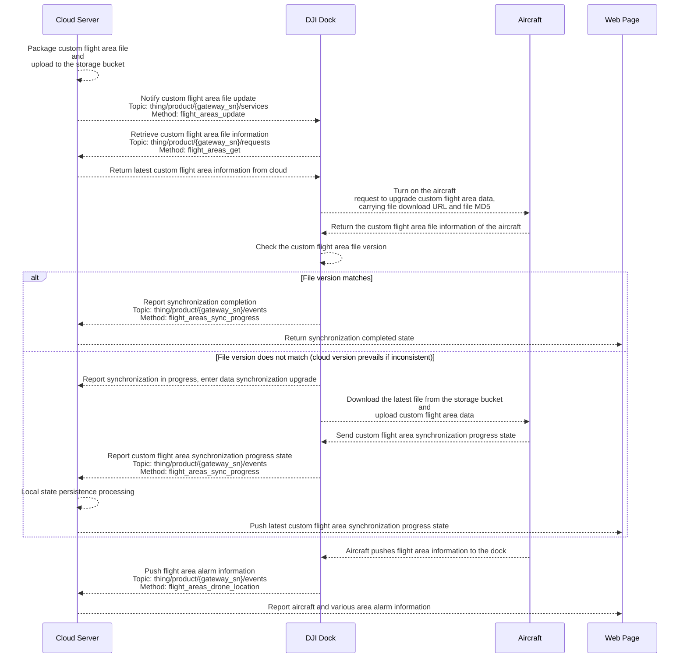
```mermaid
sequenceDiagram

participant geo_service as Cloud Server
participant Dock as DJI Dock
participant Drone as Aircraft
participant web as Web Page

geo_service -->> geo_service: Package custom flight area file<br/>and<br/> upload to the storage bucket
geo_service -->> Dock: Notify custom flight area file update <br/>Topic: thing/product/{gateway_sn}/services <br/>Method: flight_areas_update
Dock -->> geo_service: Retrieve custom flight area file information <br/>Topic: thing/product/{gateway_sn}/requests <br/>Method: flight_areas_get
geo_service -->> Dock: Return latest custom flight area information from cloud
Dock -->> Drone: Turn on the aircraft<br/>request to upgrade custom flight area data, <br/>carrying file download URL and file MD5
Drone -->> Dock: Return the custom flight area file information of the aircraft
Dock -->> Dock: Check the custom flight area file version
alt File version matches
   Dock -->> geo_service: Report synchronization completion <br/>Topic: thing/product/{gateway_sn}/events <br/>Method: flight_areas_sync_progress
   geo_service -->> web: Return synchronization completed state
else File version does not match (cloud version prevails if inconsistent)
   Dock -->> geo_service: Report synchronization in progress, enter data synchronization upgrade
   Dock -->> Drone: Download the latest file from the storage bucket <br/>and<br/> upload custom flight area data
   Drone -->> Dock: Send custom flight area synchronization progress state
   Dock -->> geo_service: Report custom flight area synchronization progress state <br/>Topic: thing/product/{gateway_sn}/events <br/>Method: flight_areas_sync_progress
   geo_service -->> geo_service: Local state persistence processing
   geo_service -->> web: Push latest custom flight area synchronization progress state
end
Drone -->> Dock: Aircraft pushes flight area information to the dock
Dock -->> geo_service: Push flight area alarm information <br/>Topic: thing/product/{gateway_sn}/events <br/>Method: flight_areas_drone_location
geo_service -->> web: Report aircraft and various area alarm information
```
## Detailed API Realization
[Custom Flight Area](https://developer.dji.com/doc/cloud-api-tutorial/en/api-reference/dock-to-cloud/mqtt/dock/dock2/custom-flight-area.html)

<a id="s0029"></a>
## S0029 — 120.multi dock
Path: `30.feature-set/20.dock-feature-set/120.multi-dock.md`

## Function Overview
DJI dock 2 supports multi-dock task. By configuring the docks for takeoff and landing via `flighttask_execute` command, the aircraft can takeoff from and land in different docks.
### Issue Multi-Dock Task
When following the sequence diagram to the task issuance period, if both the docks for takeoff and landing successfully respond, the `flighttask_execute` command is ready to be issued to start the multi-dock task. Key parameters of the `flighttask_execute` command are introduced as follows:

Adds the `multi_dock_task` field for configuring and verifying the parameters of the docks for takeoff and landing:
* The `dock_infos` field can be used to select docks for performing a multi-dock task.
  * For the dock for takeoff, set the `dock_type` field to "takeoff". The `sn` field is the serial number of this dock. The `index` field is a unique identification during the task. The settings of the other fields refer to the latest reported dock properties.
  * For dock for landing, set the `dock_type` field to "landing". The settings of the other fields refer to the latest reported dock properties. Make sure the `index` field is not the same.
* The `wireless_link_topo` field can be used to pair the aircraft and two docks. Fill in the `secret_code` and `center_node` fields with corresponding fields from the aircraft property `wireless_link_topo`. Fill in the `leaf_nodes` field with the pairing information for the two docks. The `sdr_id` and `sn` fields should be filled in separately with the pairing information for the docks for takeoff and landing. The `control_source_index` field should be opposite for the dock for takeoff and the dock for landing. For example, if the `control_source_index` field for the dock for takeoff is reported as 1, the field for the dock for landing should be 2. When the field for the dock for landing is reported as 1 and for the dock for takeoff should be 2.

Note:

* Docks that perform multi-dock tasks must use the same network RTK service source for calibration. [The `wayline_precision_type` is recommended to select "High-precision RTK mission"](https://developer.dji.com/doc/cloud-api-tutorial/cn/api-reference/dock-to-cloud/mqtt/dock/dock2/wayline.html) to avoid aircraft damage.

* Make sure that there is an aircraft in the dock for takeoff before performing a multi-dock task.

* If the aircraft triggers the Return-to-Home (RTH) logic or receives the RTH command issued by the user when performing a multi-dock task, it will automatically select the dock for landing based on the battery capacity and the location of the dock. The priority of the scheduled dock for landing is higher than the dock for takeoff. The aircraft will take the scheduled dock for landing as the RTH dock by default. When the aircraft is unable to land in the scheduled dock for landing, the dock for takeoff can be used as the RTH dock. When performing a flight route task, the new command `return_specific_home` can be used for designating the dock for landing.

* If the aircraft reaches the altitude zone when performing a multi-dock task, the default RTH logic and the relative altitude of the dock for takeoff will be used. Other Geo zone logic is consistent with a normal flight route task.

* When performing a multi-dock task, the {gateway_sn} of `live_start_push` topic should be in accordance with the `best_link_gateway` field reported by the aircraft. For the aircraft stream to remain continuous, when the aircraft property `best_link_gateway` changes, replace the {gateway_sn} of `live_start_push` topic with the latest gateway sn reported `best_link_gateway` property and re-issue the `live_start_push` command.

* For the downward command issuance of the aircraft when performing a multi-dock task, such as Pause, Resume and Return-to-Home commands, make sure they are consistent with the `gateway_sn` field of command topic and are in accordance with the `best_link_gateway` field reported by the aircraft.

* When a multi-dock task is being performed and the docks for takeoff and landing are set, the link for the controller B will be occupied. So the controller B will be disconnected.
## Interaction Sequence Diagram
IoT represents the IoT layer of the server for device access and device state maintenance. Task Service represents the upper business system of the server side for the device task management and task command issuance.

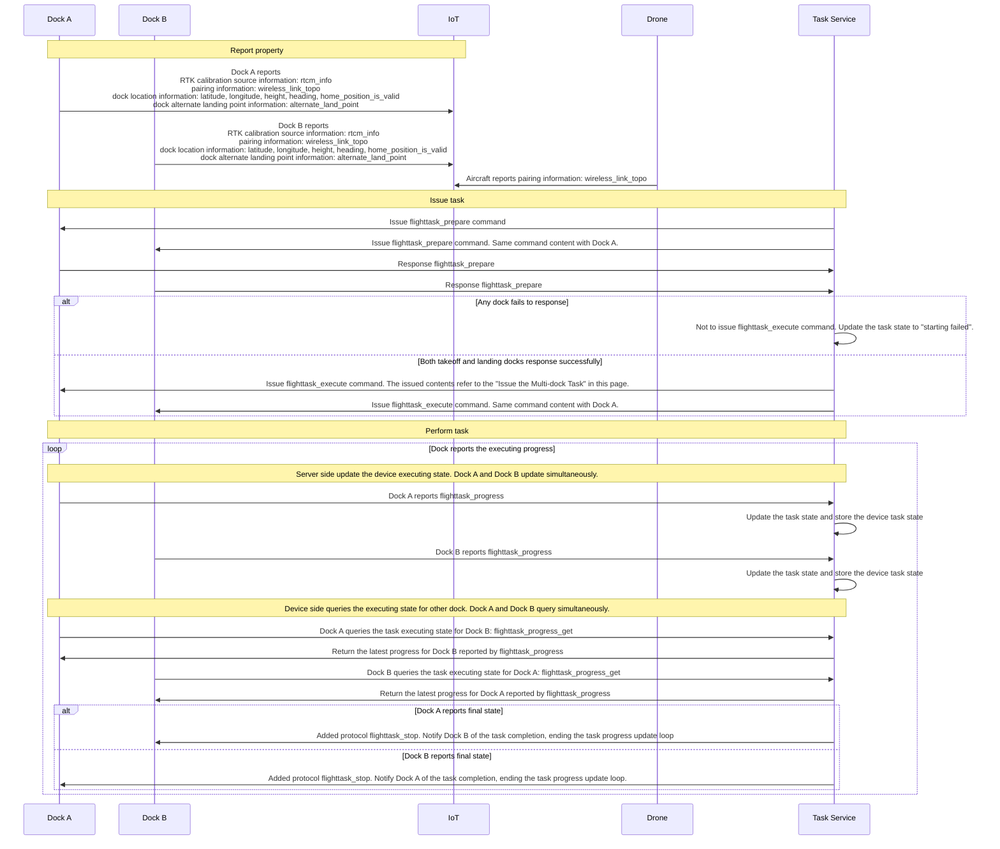
```mermaid
sequenceDiagram
participant d1 as Dock A
participant d2 as Dock B
participant i as IoT
participant u as Drone
participant t as Task Service

Note over d1,i: Report property
d1 ->> i: Dock A reports<br/>RTK calibration source information: rtcm_info<br/>pairing information: wireless_link_topo<br/>dock location information: latitude, longitude, height, heading, home_position_is_valid<br/>dock alternate landing point information: alternate_land_point
d2 ->> i: Dock B reports<br/>RTK calibration source information: rtcm_info<br/>pairing information: wireless_link_topo<br/>dock location information: latitude, longitude, height, heading, home_position_is_valid<br/>dock alternate landing point information: alternate_land_point
u ->> i: Aircraft reports pairing information: wireless_link_topo

Note over t,d1: Issue task
t ->> d1: Issue flighttask_prepare command
t ->> d2: Issue flighttask_prepare command. Same command content with Dock A.
d1 ->> t: Response flighttask_prepare
d2 ->> t: Response flighttask_prepare

alt Any dock fails to response
    t ->> t: Not to issue flighttask_execute command. Update the task state to "starting failed".
else Both takeoff and landing docks response successfully
    t ->> d1: Issue flighttask_execute command. The issued contents refer to the "Issue the Multi-dock Task" in this page.
    t ->> d2: Issue flighttask_execute command. Same command content with Dock A.
end

Note over t,d1: Perform task
loop Dock reports the executing progress

note over d1, t: Server side update the device executing state. Dock A and Dock B update simultaneously.
  d1 ->> t: Dock A reports flighttask_progress
  t ->> t: Update the task state and store the device task state
  d2 ->> t: Dock B reports flighttask_progress
  t ->> t: Update the task state and store the device task state

note over d1, t: Device side queries the executing state for other dock. Dock A and Dock B query simultaneously.
	d1 ->> t: Dock A queries the task executing state for Dock B: flighttask_progress_get
	t ->> d1: Return the latest progress for Dock B reported by flighttask_progress
	d2 ->> t: Dock B queries the task executing state for Dock A: flighttask_progress_get
	t ->> d2: Return the latest progress for Dock A reported by flighttask_progress

alt Dock A reports final state
	t ->> d2: Added protocol flighttask_stop. Notify Dock B of the task completion, ending the task progress update loop
else Dock B reports final state
	t ->> d1: Added protocol flighttask_stop. Notify Dock A of the task completion, ending the task progress update loop.
end

end
```
## Detailed API Realization
* [Dock Properties](https://developer.dji.com/doc/cloud-api-tutorial/cn/api-reference/dock-to-cloud/mqtt/dock/dock2/properties.html)
  * wireless_link_topo (Required)
  * rtcm_info (Required)
  * latitude (Required)
  * longitude (Required)
  * height (Required)
  * heading (Required)
  * home_position_is_valid (Required)
  * alternate_land_point (Required)
* [Aircraft Properties](https://developer.dji.com/doc/cloud-api-tutorial/cn/api-reference/dock-to-cloud/mqtt/aircraft/m3d-properties.html)
  * wireless_link_topo (Required)
  * best_link_gateway
* [Wayline Management](https://developer.dji.com/doc/cloud-api-tutorial/cn/api-reference/dock-to-cloud/mqtt/dock/dock2/wayline.html)
  * Service
    * flighttask_execute (Required)
    * flighttask_stop (Required)
    * return_specific_home
  * Requests
    * flighttask_progress_get (Required)
  * Events
    * return_home_info

<a id="s0030"></a>
## S0030 — 20.dock device management
Path: `30.feature-set/20.dock-feature-set/20.dock-device-management.md`

## Function Overview
Device management function supports reporting device topology information to the server, pushing device property to the server, and the server setting the device property. Users can check and modify the status of devices on server.
## Interaction Sequence Diagram
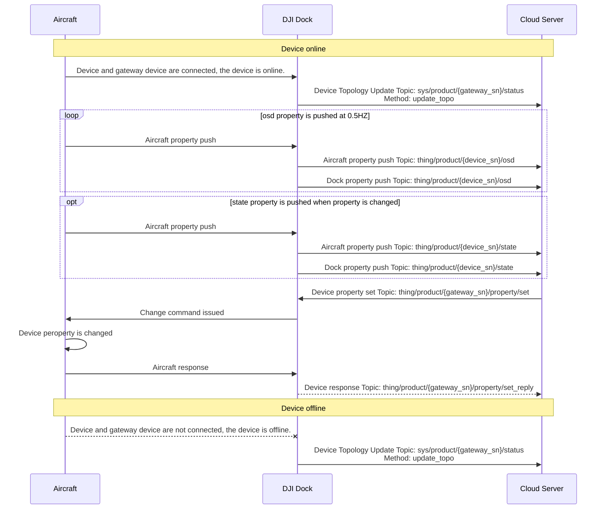
```mermaid
sequenceDiagram
participant object as Aircraft
participant client as DJI Dock
participant server as Cloud Server

note over object,server: Device online
object ->> client: Device and gateway device are connected, the device is online.
client ->> server: Device Topology Update Topic: sys/product/{gateway_sn}/status<br/>Method: update_topo

loop  osd property is pushed at 0.5HZ
object ->> client: Aircraft property push
client ->> server: Aircraft property push Topic: thing/product/{device_sn}/osd
client ->> server: Dock property push Topic: thing/product/{device_sn}/osd
end

opt state property is pushed when property is changed
object ->> client: Aircraft property push
client ->> server: Aircraft property push Topic: thing/product/{device_sn}/state
client ->> server: Dock property push Topic: thing/product/{device_sn}/state
end

server ->> client: Device property set Topic: thing/product/{gateway_sn}/property/set
client ->> object: Change command issued
object ->> object: Device peroperty is changed
object ->> client: Aircraft response
client -->> server: Device response Topic: thing/product/{gateway_sn}/property/set_reply

note over object,server: Device offline
object --x client: Device and gateway device are not connected, the device is offline.
client ->> server: Device Topology Update Topic: sys/product/{gateway_sn}/status<br/>Method: update_topo

```
## Detailed API Realization
* [Aircraft device property](https://developer.dji.com/doc/cloud-api-tutorial/en/api-reference/dock-to-cloud/mqtt/aircraft/properties.html)
* [DJI Dock device property](https://developer.dji.com/doc/cloud-api-tutorial/en/api-reference/dock-to-cloud/mqtt/dock/dock1/properties.html)
* Device Management (MQTT):
  * Device Topology Update<br/>
    When gateway device perceives the connection and disconnection with the sub-devices, gateway device will report the online and offline status of sub-devices. The `type` and `sub_type` value of API can be checkout from [Product Type](https://developer.dji.com/doc/cloud-api-tutorial/en/overview/product-support.html).

  * Device Property Push<br/>
    Device property is divided into osd property and state property. The osd property is pushed at 0.5HZ frequency. The state property is pushed when property changes. Different properties is pushed by different topic. The properties is introduced at the chapter: [Aircraft Properties](https://developer.dji.com/doc/cloud-api-tutorial/en/api-reference/dock-to-cloud/mqtt/aircraft/properties.html), [Dock Properties](https://developer.dji.com/doc/cloud-api-tutorial/en/api-reference/dock-to-cloud/mqtt/dock/dock1/properties.html) and [Remote Controller Properties](https://developer.dji.com/doc/cloud-api-tutorial/en/server-api-reference/mqtt/thing-model/gateway/rc-plus/properties.html).

  * Device Property Set<br/>
    * Not all the device properties can be set from the Server, we will implement that in the near future.
    * In the "Device Property" chapter, you can check the read and write status of device properties by the  symbol "accessMode". If the "accessMode" is "rw" means that the properites can be set.
    * Device property set only supports setting single peoperty field. For example, property `distance_limit_status` has two fields `state` and `distance-limit`. When setting the property `distance_limit_status`, the set command should be sent twice.

<a id="s0031"></a>
## S0031 — 30.dock livestream
Path: `30.feature-set/20.dock-feature-set/30.dock-livestream.md`

## Overview
The live stream function mainly sends the camera payload of the aircraft and the video stream of the DJI Dock to the tripartite cloud platform for broadcasting, and users can conveniently broadcast live on the remote web page. The live stream function supports the start, stop, resolution setting, and lens switching of the live stream.
### Supported Live Streaming Types
| Type    | Description                                                  |
| ------- | ------------------------------------------------------------ |
| Agora   | The DJI public cloud platform is also based on the "Interactive Live Streaming Standard" function of Agora. The overall live broadcast delay is relatively low and the effect is good. <br/>For the third-party cloud privatization deployment, Agora also provides a hybrid cloud deployment model. The data is in the customer's private server, and then a link is opened through the air gap to Agora's public cloud. This link channel is mainly used to upgrade and operate and maintain the privatized deployed servers. |
| RTMP    | Real-Time Messaging Protocol (RTMP) is a communication protocol for streaming audio, video and data over the Internet. This protocol is based on TCP and is a protocol family that includes the RTMP and RTMPT, RTMPS, RTMPE and many other variants. |
| GB28181 | GB/T 28181-2016 is a transmission control standard for the access of security video equipment to platforms in Mainland China. For some servers which already have 28181 downlink gateway, the data rate of DJI enterprise devices can be pushed to the server directly through this protocol. |
| WebRTC/WHIP   | WebRTC [(Web Real-Time Communication)](https://docs.dolby.io/streaming-apis/docs/webrtc-whip) is a technology that enables real-time communication of video and audio streams. It provides near real-time audio and video streams to ensure a smooth user experience. This technology is widely used in scenarios requiring high real-time communication, such as online meetings, online education, and telemedicine.<br>WHIP [(WebRTC-HTTP Ingestion Protocol)](https://millicast.medium.com/whip-the-magic-bullet-for-webrtc-media-ingest-57c2b98fb285)is an HTTP-based protocol designed to provide a standardized signaling protocol between WebRTC producers and streaming media servers, facilitating the delivery of WebRTC streams into streaming media servers. It allows WebRTC-based content to be delivered to streaming media servers or CDNs.|

[Live Streaming (MQTT)](https://developer.dji.com/doc/cloud-api-tutorial/en/api-reference/dock-to-cloud/mqtt/dock/dock1/live.html)
### Live Streaming Framework of DJI Dock
<div>
<div align=center>

</div></div>

As shown above, the aircraft flight platform is not directly connected to the tripartite cloud platform, it needs to be forwarded through the remote control or the DJI Dock. The communication between the remote control and the DJI Dock and the aircraft is still using DJI private AirLink.

The tripartite cloud platform requires pre-deployment of MQTT and streaming media server. DJI's streaming protocol supports Agora, RTMP, and GB28181. MQTT is mainly used for message communication, configuration information setting and reading.
## Interaction Sequence Diagram
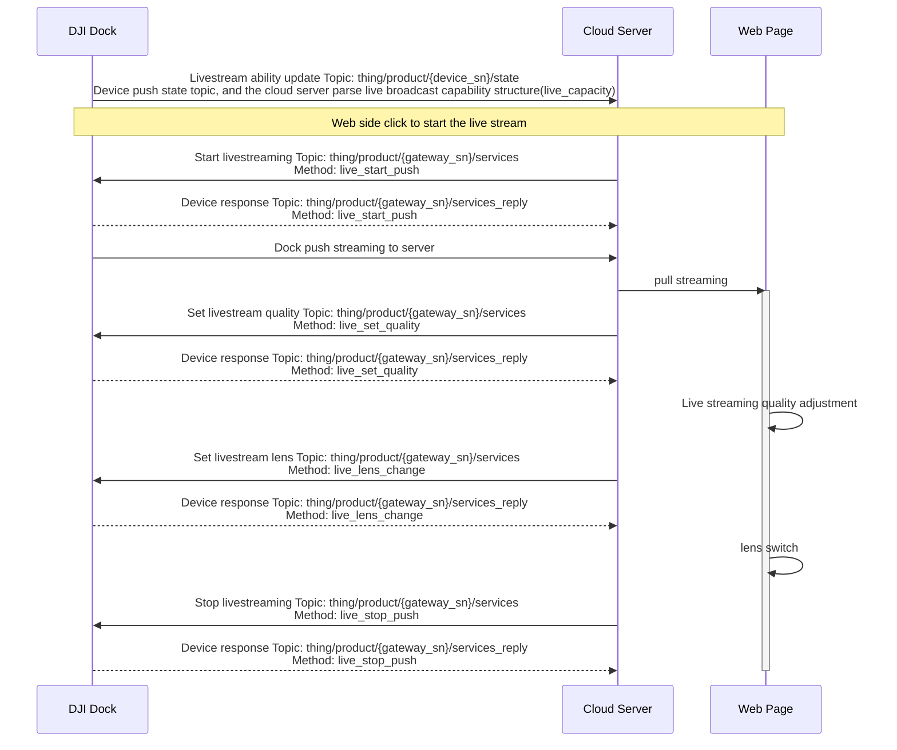
```mermaid
sequenceDiagram
participant client as DJI Dock
participant server as Cloud Server
participant h5 as Web Page

client ->> server: Livestream ability update Topic: thing/product/{device_sn}/state<br/> Device push state topic, and the cloud server parse live broadcast capability structure(live_capacity)

note over client,h5: Web side click to start the live stream

server ->> client: Start livestreaming Topic: thing/product/{gateway_sn}/services<br/>Method: live_start_push
client -->> server: Device response Topic: thing/product/{gateway_sn}/services_reply<br/>Method: live_start_push

client ->> server: Dock push streaming to server
server ->> h5: pull streaming
activate h5

server ->> client: Set livestream quality Topic: thing/product/{gateway_sn}/services<br/>Method: live_set_quality
client -->> server: Device response Topic: thing/product/{gateway_sn}/services_reply<br/>Method: live_set_quality
h5 ->> h5: Live streaming quality adjustment

server ->> client: Set livestream lens Topic: thing/product/{gateway_sn}/services<br/>Method: live_lens_change
client -->> server: Device response Topic: thing/product/{gateway_sn}/services_reply<br/>Method: live_lens_change
h5 ->> h5: lens switch

server ->> client: Stop livestreaming Topic: thing/product/{gateway_sn}/services<br/>Method: live_stop_push
client -->> server: Device response Topic: thing/product/{gateway_sn}/services_reply<br/>Method: live_stop_push

deactivate h5

```
## Detailed API Realization
[Live Streaming (MQTT)](https://developer.dji.com/doc/cloud-api-tutorial/en/api-reference/dock-to-cloud/mqtt/dock/dock1/live.html)
* Livestream ability update<br/>
  live_capacity field is in the thing model of the gateway device, which is only pushed when the status of device is changed. The field contains the total amount of streams for live streaming, the total amount of streams for live streaming at the same time, live streaming ability list of devices.
* Start livestreaming<br/>
  The server side sends `Start livestreaming` instruction, there are protocol type, live stream quality and other information contained in the instruction.
* Stop livestreaming
* Set livestream quality<br/>
  The quality can be set, and the enumeration value of quality can be checked in the "Server API" chapter.
* Set livestream lens<br/>
  The live stream function can change the lens without influencing the live stream progress. The enumeration value of lenses can be checked in the "Server API" chapter.

<a id="s0032"></a>
## S0032 — 40.dock media management
Path: `30.feature-set/20.dock-feature-set/40.dock-media-management.md`

## Function Overview
The media library is the function that helps Pilot2/DOCK to upload the photos/videos, downloaded from aircraft to the remote controller/dock, to the 3rd party server. Media upload function includes auto upload or manual upload. For the DOCK, it has auto upload only.

Using the latest version of DJI Dock 2 firmware:

* The generated video files (infrared, visible light, and split-screen video files) will contain information about the aircraft's position and altitude, as well as the gimbal's attitude. This information is consistent with what was previously included in the SRT subtitle files generated alongside the video files in the older firmware.
* After completing a flight mission, the PPK files (.obs, .rtk, .mrk and .nav) and RTCM data (.dat) created on the aircraft's SD card will also be uploaded to the cloud storage bucket along with the media files.

<center>        <br>     </center>
## Interaction Sequence Diagram of DJI Dock
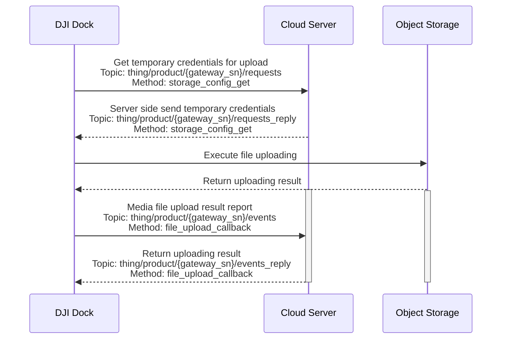
```mermaid
sequenceDiagram

participant client  as DJI Dock
participant server as Cloud Server
participant oss as Object Storage

client ->> server : Get temporary credentials for upload <br/>Topic: thing/product/{gateway_sn}/requests<br/>Method: storage_config_get
server -->> client : Server side send temporary credentials<br/>Topic: thing/product/{gateway_sn}/requests_reply<br/>Method: storage_config_get
client ->> oss : Execute file uploading
oss -->> client : Return uploading result

activate server
activate oss
client ->> server : Media file upload result report<br/>Topic: thing/product/{gateway_sn}/events<br/>Method: file_upload_callback
server -->> client : Return uploading result<br/>Topic: thing/product/{gateway_sn}/events_reply<br/>Method: file_upload_callback
deactivate server
deactivate oss

```
## Detailed API Realization
[Media Management (MQTT)](https://developer.dji.com/doc/cloud-api-tutorial/en/api-reference/dock-to-cloud/mqtt/dock/dock1/file.html)
* Obtain Temporary Credential<br/>
  For each media upload, you need to obtain temporary file upload credentials from the server, so that DJI Dock will bring the credentials to the object storage service for verification when uploading.

* Reports File Upload Result<br/>
  After the media file transfer is finished, DJI Dock will call this interface to inform the server of the corresponding media file upload result.

<a id="s0033"></a>
## S0033 — 50.dock wayline management
Path: `30.feature-set/20.dock-feature-set/50.dock-wayline-management.md`

## Function Overview
Wayline management is an important function of drone automatic operation, which can realize batch and intelligent operation in the industry. The cloud API provides relevant interfaces to implement the functions of issuing, executing, canceling, and progress reporting flight tasks.
Users need to follow the [Waypoint Markup Language (WPML)](https://developer.dji.com/doc/cloud-api-tutorial/en/api-reference/dji-wpml/overview.html) specification to write wayline file and define the wayline mission. Multiple waylines can be defined in one wayline mission.

For the wayline mission interface, the fields in the interface, and the explanation of the fields, please refer to the guide of "Detailed API Realization" on this page. If there is an error in the process of using the route management function, please check [Error Code](https://developer.dji.com/doc/cloud-api-tutorial/en/error-code.html) according to the returned error code.
### Simulated Debugging
Wayline management newly supports simulated wayline flights. Once the simulator is enabled, the aircraft will go through the preparatory steps for the wayline mission, such as opening the dock cover and starting up. The aircraft will follow the specified longitude and latitude fields of `simulate_mission` API as the starting point data for the wayline execution, but aircraft will not actually take off. The aircraft's data during the execution of the task will be reported as usual via the `osd`.

> Note: Simulated wayline mission will not enable RTK. After the simulated debugging, if outdoor wayline mission is going to execute, stable RTK signal should be obtained for normal and safe execution.
### Resume from Breakpoint
If wayline mission can not be completed in one flight because of some reasons, for example, too long wayline mission, bad weather and manual break, resuming from breakpoint allows the task to restart from the breakpoint but not from the start.

* Return from the breakpoint:<br/>

Once the wayline mission is not finished, the breakpoint information will be recorded. During the wayline execution, the progress of wayline mission (Method: flighttask_progress) will be uploaded continuously, and the breakpoint information will be uploaded through this API. After the drone returns to the dock, the breakpoint information will be uploaded by dock to the cloud server for storage. Detailed breakpoint information can be seen from [related breakpoint fields](https://developer.dji.com/doc/cloud-api-tutorial/en/api-reference/dock-to-cloud/mqtt/dock/dock1/wayline.html) of `Method: flighttask_progress` API.

* Resume from the breakpoint:<br/>

If cloud server sends the mission of resuming from breakpoint, the `issue wayline task API ` will contain related breakpoint fields. Dock provides the breakpoint information to the drone, then the drone flies to the breakpoint and continues the wayline mission. When resumes from the break point, the `Safe takeoff altitude field (wpml:takeOffSecurityHeight)`in KMZ file of wayline mission will be replaced by the `height for RTH field (rth_altitude)` in issue wayline mission API of MQTT protocol to  avoid the possibility of crushing obstacle.

<div>
<div align=center>

</div></div>
## Interaction Sequence Diagram
### Immediate Task and Timed Task
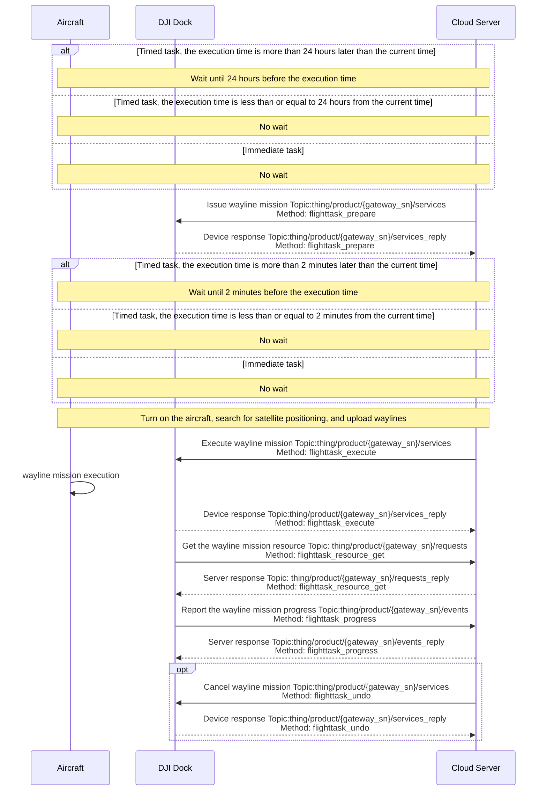
```mermaid
sequenceDiagram

participant object as Aircraft
participant client  as DJI Dock
participant server as Cloud Server

alt Timed task, the execution time is more than 24 hours later than the current time
note over object,server: Wait until 24 hours before the execution time
else Timed task, the execution time is less than or equal to 24 hours from the current time
note over object,server: No wait
else Immediate task
note over object,server: No wait
end

server ->> client: Issue wayline mission Topic:thing/product/{gateway_sn}/services<br/>Method: flighttask_prepare
client -->> server: Device response Topic:thing/product/{gateway_sn}/services_reply<br/>Method: flighttask_prepare

alt Timed task, the execution time is more than 2 minutes later than the current time
note over object,server: Wait until 2 minutes before the execution time
else Timed task, the execution time is less than or equal to 2 minutes from the current time
note over object,server: No wait
else Immediate task
note over object,server: No wait
end

note over object,server: Turn on the aircraft, search for satellite positioning, and upload waylines
server ->> client: Execute wayline mission Topic:thing/product/{gateway_sn}/services<br/>Method: flighttask_execute
object ->> object: wayline mission execution
client -->> server: Device response Topic:thing/product/{gateway_sn}/services_reply<br/>Method: flighttask_execute

client ->> server: Get the wayline mission resource Topic: thing/product/{gateway_sn}/requests<br/>Method: flighttask_resource_get
server -->> client: Server response Topic: thing/product/{gateway_sn}/requests_reply<br/>Method: flighttask_resource_get

client ->> server: Report the wayline mission progress Topic:thing/product/{gateway_sn}/events<br/>Method: flighttask_progress
server -->> client: Server response Topic:thing/product/{gateway_sn}/events_reply<br/>Method: flighttask_progress

opt
server ->> client: Cancel wayline mission Topic:thing/product/{gateway_sn}/services<br/>Method: flighttask_undo
client -->> server: Device response Topic:thing/product/{gateway_sn}/services_reply<br/>Method: flighttask_undo
end
```
### Conditional Task
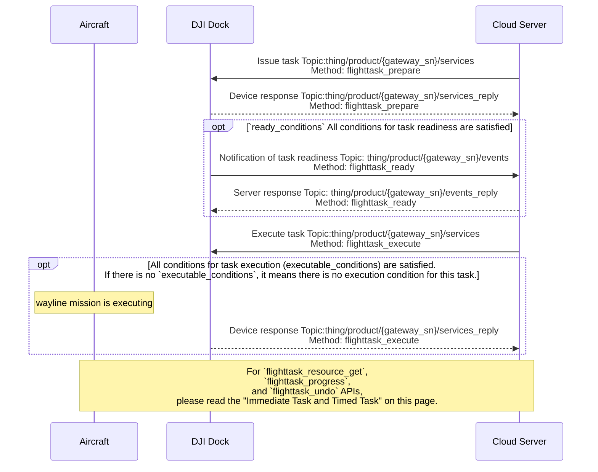
```mermaid
sequenceDiagram

participant object as Aircraft
participant client as DJI Dock
participant server as Cloud Server

server ->> client: Issue task Topic:thing/product/{gateway_sn}/services<br/>Method: flighttask_prepare
client -->> server: Device response Topic:thing/product/{gateway_sn}/services_reply<br/>Method: flighttask_prepare

opt `ready_conditions` All conditions for task readiness are satisfied
client ->> server: Notification of task readiness Topic: thing/product/{gateway_sn}/events<br/>Method: flighttask_ready
server -->> client: Server response Topic: thing/product/{gateway_sn}/events_reply<br/>Method: flighttask_ready
end

server ->> client: Execute task Topic:thing/product/{gateway_sn}/services<br/>Method: flighttask_execute
opt All conditions for task execution (executable_conditions) are satisfied. <br/> If there is no `executable_conditions`, it means there is no execution condition for this task.
note over object: wayline mission is executing
client -->> server: Device response Topic:thing/product/{gateway_sn}/services_reply<br/>Method: flighttask_execute
end

note over object, server: For `flighttask_resource_get`,<br/>`flighttask_progress`,<br/> and `flighttask_undo` APIs,<br/> please read the "Immediate Task and Timed Task" on this page.

```
## Detailed API Realization
> Notes:
>
> * We have deprecated the `Create wayline task` interface, please use the `Issue wayline task` interface with the `Execute wayline task` interface.
> * If the task type of `task_type` is specified as "execute immediately", the device side limits the time error of 30s. If the difference between the time when the device receives the command and the `execute_time` exceeds 30s, an error will be reported and the task cannot be executed normally.
> * If the device is in the process of executing the route task and receives the command to execute the route task again, the route task received again will not be executed and the device will report an error.

[Wayline Management (MQTT)](https://developer.dji.com/doc/cloud-api-tutorial/en/api-reference/dock-to-cloud/mqtt/dock/dock1/wayline.html)

* Notification of device exiting the RTH
  * Entering the "RTH exiting state" means that the aircraft exits the RTH process due to one of the reasons in the `reason` field of Cloud API. Exiting the "RTH exiting state" means the aircraft stop the exiting process.
  * It is used to notify the "RTH exiting state". If obstacle avoidance is triggered when device completes the task and returns, device will enter the "RTH exiting state". To avoid device destruction, users should be notified to send RTH command to bring the device out of the "RTH exiting state".
* Report the wayline mission progress<br/>
  Route task execution progress can be reported, and the reported information includes progress information and expansion information.
* Notification of task readiness<br/>
  After the conditional task is issued, the device will frequently check whether the `ready_conditions` is met. If all conditions are met, `flighttask_ready` will be sent.
* Create wayline mission (Deprecated)
* Issue wayline mission<br/>
  The concept of "pre-release" is currently added to the route management. The "pre-release" of wayline mission leaves more time for DJI Dock and aircraft to prepare. After the `Issue wayline task` interface is called, the `Execute wayline task` interface needs to be called to execute. In the `Issue wayline task` interface, assign a `flight_id` to the route task. With the `flight_id` field, you can execute, cancel, and obtain task resources for the specified route task.
* Execute wayline mission
* Cancel wayline mission<br/>
  Cancel wayline missions in a patch is supported. `Cancel wayline task` is used to cancel the assignment of wayline mission. The executing wayline mission can not be canceled by this interface.
* Get the wayline mission resource<br/>
  Get the wayline mission resource will return the wayline file information of the `flight_id` corresponding wayline mission.

<a id="s0034"></a>
## S0034 — 60.hms
Path: `30.feature-set/20.dock-feature-set/60.hms.md`

## Functional Overview
The purpose of opening the HMS function in the cloud API is to display device problems in the cloud, improve users' perception and processing capabilities of risks, and ensure job security.

> Note: HMS reports complete alarm information. If an alarm reported at the last HMS reporting disappears at current HMS reporting, it means this alarm is resolved.
### Alarm copy query
Users have to splice the `Copy Key` from the fields of HMS function API. According to the `Copy Key`, users can obtain the alarm copy by querying the Copy Key from the `alarm copy query json file`. Because of the different alarming devices, the rules of splicing are also different.

* Alarm copy query json file: [hms.json](https://terra-1-g.djicdn.com/fee90c2e03e04e8da67ea6f56365fc76/SDK%20%E6%96%87%E6%A1%A3/CloudAPI/hms.json)

* Splicing rules and examples:

  * The {code} represents alarm code. The {in_the_sky} represents whether the device is in flight. They are API fields of the HMS function. The API fields of HMS function and its explanation can be obtained from [Server API > HMS Function](https://developer.dji.com/doc/cloud-api-tutorial/en/api-reference/dock-to-cloud/mqtt/dock/dock1/hms.html).

  * If it is an alarm from DJI Dock, `dock_tip_` should be spliced before {code}, which means `dock_tip_{code}`. Take an example:<br/>
    * The error code is `0x16100083`, the `Copy Key` is `dock_tip_0x16100083`<br/>

  * If it is an alarm from the aircraft, the user needs to splice the `Copy Key` by themselves. <br/>
    Aircraft splicing logic: `fpv_tip_{code}_{in_the_sky}`. <br/>
    Take an example, the error code is `0x16100083`:
    * If the `in_the_sky` is 0, it means whether the aircraft is in flight or on the ground, the `Copy key` is the same: `fpv_tip_0x16100083`.
    * If the `in_the_sky` is 1, when the aircraft is in flight, the `Copy key` is `fpv_tip_0x16100083_in_the_sky`. when the aircraft is on the ground, the `Copy key` is `fpv_tip_0x16100083`.
### Alarm copy replacement
Based on the alarm copy query json file: [hms.json](https://terra-1-g.djicdn.com/fee90c2e03e04e8da67ea6f56365fc76/SDK%20%E6%96%87%E6%A1%A3/CloudAPI/hms.json), there are some words like "%alarmid", "%index" needs to be replaced.

The replacement rules and examples:

* The contents that are used to replace can be obtained from the API fields `args` of HMS Function. The explanation of the `args` field, the completed variables enumeration of the `args` field, and the explanation of variables can refer to [HMS Function](https://developer.dji.com/doc/cloud-api-tutorial/en/api-reference/dock-to-cloud/mqtt/dock/dock1/hms.html). For example, the variables have `alarmid`, `sensor_index`, `component_index` and so on.
* Aircraft warning copy rules:
  1. If the text has a "%alarmid", replace it with a specific hexadecimal alarmid, such as 0x16100001.
  2. If the text has a "%index", replace it with sensor_index + 1.
  3. If the text has a "%component_index", replace it with component_index + 1.
  4. If the text contains "%battery_index" and sensor_index is 0, use "left" to replace "%battery_index", otherwise, use "right" to replace.

* DJI Dock warning copy rules:
  1. If the text contains "%dock_cover_index" and sensor_index is 0, use "left" to replace "%dock_cover_index", otherwise, use "right" to replace.
  2. If the text contains "%charging_rod_index", when sensor_index is 0, replace "%charging_rod_index" with "front". When sensor_index is 1, use "back" instead. When sensor_index is 2, use "left" instead. When sensor_index is 3, use "right" instead.
## Interaction timing
The device uploads the alarm information of DJI Dock equipment and aircraft to the cloud through the `health alarm` protocol (Topic: thing/product/{gateway_sn}/events Method: hms). And the complete alarm copy is presented on the web interface.
## Detailed API Realization
[HMS Management](https://developer.dji.com/doc/cloud-api-tutorial/en/api-reference/dock-to-cloud/mqtt/dock/dock1/hms.html)

* Health Alarm

<a id="s0035"></a>
## S0035 — 70.remote debug
Path: `30.feature-set/20.dock-feature-set/70.remote-debug.md`

## Functional Overview
Remote debugging is to achieve unattended operation in the debugging process, that is, the operator can issue commands to the device on the cloud without going to the site to perform remote troubleshooting of the device. Remote debugging commands can be divided into commands (cmd) and tasks (job). Command (cmd) generally refers to the behavior that the device can reply to immediately after the command is issued, and the task (job) is the behavior that the device needs to continue to act on after the task is issued.
### Remote Debug Instruction
The command to be sent is specified by the "method" field in the 'Send Control Command' protocol transmitted between the cloud and the device. For the detailed protocol content, please view it in the 'Cloud API ' according to the 'Interface Detailed Implementation'.

|command(cmd)|task(job)|
|:---:|:---:|
|Debug mode on/off <br/> Fill light on/off <br/> 4G image transmission function on/off <br/> One key return|Dock restart <br/> Aircraft power on/off <br/> One Key Troubleshooting (One Key Takeoff Self-Check) <br/> Aircraft Data Format <br/> Dock Data Format <br/> Open/Close Canopy <br/> Pusher Expand/Close <br/> Charge Open /close <br/> |
### Task (job) Execution Process
After the task (job) is issued, the device will return to the execution state. The status is defined in the "status" field of the transport protocol.
The status is listed as follows:
* issued
* in progress
* Executed successfully
* pause
* rejected
* failure
* Cancellation or termination
* timeout

The execution flow is as follows:

<div align=center></div>
## Interaction Sequence Diagram
````mermaid
sequenceDiagram

participant client as DJI Dock
participant app_server as Cloud Server

app_server ->> client : issue command (cmd) <br/>Topic: thing/product/{gateway_sn}/services<br/>Method:{cmd_method}
client -->> app_server : Reply whether to start executing <br/>Topic: thing/product/{gateway_sn}/services_reply

app_server ->> client : send task (job)<br/>Topic: thing/product/{gateway_sn}/services<br/>Method:{cmd_method}
client -->> app_server : Reply whether to start executing <br/>Topic: thing/product/{gateway_sn}/services_reply

activate client

client ->> app_server : report task progress<br/>Topic: thing/product/{gateway_sn}/events<br/>Method:{cmd_method}

deactivate client

````
## Detailed API Realization
[Remote Debugging](https://developer.dji.com/doc/cloud-api-tutorial/en/api-reference/dock-to-cloud/mqtt/dock/dock1/cmd.html)

* Open the debug mode
* Close the debug mode
* Open the supplement light
* ...

<a id="s0036"></a>
## S0036 — 80.firmware upgrade
Path: `30.feature-set/20.dock-feature-set/80.firmware-upgrade.md`

## Functional Overview
In order to maintain the firmware version of the device, the cloud API allows users to upgrade the firmware of DJI Dock and aircraft through the cloud. Users can implement single upgrade as well as batch upgrade, upgrade prompt, upgrade progress display, etc.

In order to realize the firmware upgrade function, the user needs to download the required firmware installation package on the developer's official website in advance, such as [M30 series firmware version package](https://www.dji.com/downloads/products/matrice-30). Users need to maintain the firmware installation package, firmware version and other information in the cloud server by themselves. The firmware properties information reported by the device is compared with the firmware package information in the cloud to determine whether firmware upgrade is required. When issuing a `firmware upgrade` command on the cloud, you need to supplement the protocol with the serial number of the upgrade device, the firmware version number, the storage address of the firmware upgrade file, and the type of firmware upgrade. The device can get the firmware upgrade progress through the `percent` and `step_key` parameters in the `firmware upgrade progress` command. For details, please refer to the content in `Interface Detailed Implementation` for detailed review in the cloud API.

> Note:
> * By uploading the properties of the firmware upgrade object model, `firmware_version` can be compared with the version number of the latest firmware, which can be used to determine whether a general upgrade is required. `compatible_status` can be used to determine whether a consistent upgrade is required.
> * Priority order of upgrades: normal upgrades higher consistent upgrades. A normal upgrade can override a consistent upgrade. Because if the version of the device is consistent with the latest firmware version 1.x, but the firmware of the battery module is low, the device side will report the object model that needs to be upgraded consistently. However, if the latest firmware version is 2.x, which is inconsistent with the version of the device, the battery module with a lower version will be upgraded by the way, and the problem of firmware inconsistency will eventually be resolved.
## Interaction Sequence Diagram
````mermaid
sequenceDiagram

participant client as DJI Dock
participant app_server as Cloud Server

client ->> app_server : report device firmware properties

app_server ->> client : create firmware upgrade task<br/>Topic: thing/product/{gateway_sn}/services<br/>Method: ota_create
client -->> app_server : device response<br/>Topic: thing/product/{gateway_sn}/services_reply

loop device upload progress and cloud response

client ->> app_server : report upgrade task progress and status<br/>Topic: thing/product/{gateway_sn}/events<br/>Method: ota_progress
app_server -->> client : Cloud response<br/>Topic: thing/product/{gateway_sn}/events_reply

end
````
## Detailed API Realization
* [DJI Dock Property](https://developer.dji.com/doc/cloud-api-tutorial/en/api-reference/dock-to-cloud/mqtt/dock/dock1/properties.html)
* [Firmware Upgrade](https://developer.dji.com/doc/cloud-api-tutorial/en/api-reference/dock-to-cloud/mqtt/dock/dock1/firmware.html)
  * Firmware properties report<br/>
    The firmware upgrade function will report two properties fields, `Device firmware version number - firmware_version` and `Firmware consistency - compatible_status`. `firmware_version` is compared with the version number of the latest firmware, which can be used to determine whether a general upgrade is required. `compatible_status` can be used to determine whether a consistent upgrade is required.

  * Issue firmware upgrade task<br/>
    The firmware upgrade API delivered by the cloud needs to complete the filling of the device serial number, firmware upgrade package information, and firmware upgrade type.

  * Firmware upgrade progress<br/>
    The device reports the firmware upgrade progress to the cloud, and through the acquisition of fields, key information such as upgrade progress, upgrade progress percentage, and current upgrade steps can be displayed on the cloud visualization interface. Use the `ota_progress` field of the `firmware upgrade progress` API to determine whether the upgrade is in progress.

<a id="s0037"></a>
## S0037 — 90.remote log
Path: `30.feature-set/20.dock-feature-set/90.remote-log.md`

## Function Overview
Cloud API opens the remote log function, hoping to reduce the human input and improve the efficiency when resolving the Dock problems and aircraft problems. Remote log supports the upload of Dock log and aircraft log. The cloud server requests the log file list from the device, and the device responds and uploads the file list.

Take the Demo of remote log for example, Users can get the log file list through the `get the uploadable file list of the designated device` interface and display the list on the Web page. Users select the log files in need, the cloud server starts the upload mission through the `start the file upload` interface and the device uploads the corresponding files. The mission can be canceled by `file upload update` during the uploading process. The progress of file uploading can be displayed on Web page through the `file upload progress` interface.

Object storage is used for the log file storage. If users have problems, you can download the log of that period from the cloud server and contact our after-sales colleagues through `dev@dji.com`.

> Note: Currently after the log starts to upload, pause the upload mission, restart after the pause, and reject the upload mission are not supported.
## Interaction Sequence Diagram
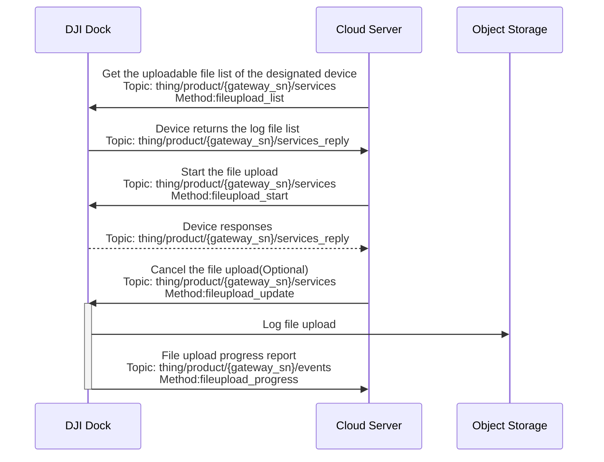
```mermaid
sequenceDiagram

participant client as DJI Dock
participant app_server as Cloud Server
participant storage as Object Storage

app_server ->> client : Get the uploadable file list of the designated device<br/>Topic: thing/product/{gateway_sn}/services<br/>Method:fileupload_list
client ->> app_server : Device returns the log file list<br/>Topic: thing/product/{gateway_sn}/services_reply

app_server ->> client : Start the file upload<br/>Topic: thing/product/{gateway_sn}/services<br/>Method:fileupload_start
client -->> app_server  : Device responses<br/>Topic: thing/product/{gateway_sn}/services_reply
app_server ->> client : Cancel the file upload(Optional)<br/>Topic: thing/product/{gateway_sn}/services<br/>Method:fileupload_update

activate client
client ->> storage : Log file upload
client ->> app_server : File upload progress report<br/>Topic: thing/product/{gateway_sn}/events<br/>Method:fileupload_progress
deactivate client

```
## Detailed API Realization
[Remote Log](https://developer.dji.com/doc/cloud-api-tutorial/en/api-reference/dock-to-cloud/mqtt/dock/dock1/log.html)
* Get the uploadable file list of the designated device
* Start the file upload
* Cancel the file upload
* File upload progress

<a id="s0038"></a>
## S0038 — 10.dji pilot2 webview debug
Path: `50.debug/10.dji-pilot2-webview-debug.md`

There are currently 2 ways to debug the webview pages embedded in PILOT.

1. Use the chrome devtools tool.
2. Use Tencent's open source vConsole plug-in, the plug-in is easy to install, you can install it directly with npm. The overall effect is similar to PC browser debugging. There is also a webpack plugin vConsole webpack-plugin which is encapsulated on the basis of Tencent vConsole. This plugin can automatically add the vConsole debugging function through webpack configuration, which is more convenient and practical.
## Computer Side Debug through Chrome Devtools
- After installing the chrome browser, enter `chrome://inspect/#devices` in the address bar, and you can see the device to be debugged on the Devices page. Then click "inspect" of the page to be debugged to see the debug page. If the page debugging tool does not display properly, you need to turn on your browser's developer mode first, go to the third-party Cloud page and click on the top title bar continuously.

<center>        <br>     </center>

<center>        <br>     </center>
## vConsole
The vconsole-webpack-plugin has reduced functionality compared to Tencent's native vConsole, so if you need all the features, you can download Tencent's native vConsole.

vConsole: [github](https://github.com/Tencent/vConsole)

- Features:

  1. View console log.
  2. View requests.
  3. View the element structure of the page.
  4. View cookies, local storage and session storage.
  5. Execute JS commands manually.

- Installation

  ```shell
  $ npm install vconsole-webpack-plugin --save-dev
  ```

  Then add the following plugin configuration in the webpack.conf.js or webpack.dev.conf.js file configuration.

  ```
  var vConsolePlugin = require('vconsole-webpack-plugin');

  module.exports = {
      ...

      plugins: [
          new vConsolePlugin({
              filter: [],  // Entry files to be filtered.
              enable: true // Remember to change back to false before the project goes live.
          }),
          ...
      ]
      ...
  }
  ```

  After recompiling the front-end code, you can see the vConsole button in the bottom right corner of the interface.

  ​	Note: vConsole is recommended to run in development and test environments. Deploying to a production environment requires that vConsole be turned off.

  <center>        <br>     </center>

  <center>        <br>     </center>

<a id="s0039"></a>
## S0039 — 20.log export
Path: `50.debug/20.log-export.md`

## Overview
When debugging the cloud API, you will inevitably encounter some tricky bugs that require technical support from DJI. In this case, you will usually need the developer's help to export logs of the drone, remote control, DJI Pilot 2 and DJI Dock so that DJI technical support students can quickly locate the problem.

> Note:
> DJI Pilot 2 logs are encrypted, so the developer needs to provide the public key information for log encryption through the JSBridge interface, and the pulled logs also need to be decrypted to view them. DJI provides a JAR library for decrypting logs that can be decrypted by developers running scripts. For details, you can refer to [Obtain Log via JSBridge](https://developer.dji.com/doc/cloud-api-tutorial/en/feature-set/pilot-feature-set/pull-pilot-log.html).
## Drone Log
You need to connect the drone to the DJI Assistant2 software, select Log Export and export the log file for the corresponding sortie, noting that the time marked on the reference is the end of the flight.
## Remote Control Log
You need to connect the remote control to the DJI Assistant2 software, select Log Export and export the log file for the corresponding sortie, noting that the time marked on the reference is the end of the flight.
## DJI Pilot 2 Log
You need to copy the folder in the remote control with the following path, compress it into a zip file and send it to DJI for analysis.

1. /Android/data/com.dji.industry.pilot/files/LOG/folder for the corresponding date
2. /Android/data/com.dji.industry.pilot/files/LOG/cmd_record/file for the corresponding date
3. /Android/data/com.dji.industry.pilot/files/LOG/Logs/file for the corresponding date
4. /dji_logs/folder for the corresponding date

If the DJI Pilot 2 crashes and stops running, export the following path file of the remote control along with it.

1. /dji_logs/anr/

2. /dji_logs/tombstones/
## Record or Take Screenshots
When the problem is reproducible, the remote control's recording and screenshot function allow you to quickly record the situation in order to locate the problem more easily and avoid the need to reproduce it again and again, especially when the problem is very occasional and difficult to reproduce, which makes it more difficult to solve.

<a id="s0040"></a>
## S0040 — 30.mqttx
Path: `50.debug/30.mqttx.md`

MQTTX is a cross-platform MQTT client that can be easily used on macOS / Linux / Windows. [Click to download.](https://mqttx.app/)

For detailed operational configuration and use, please see the [documentation](https://mqttx.app/docs).

<a id="s0041"></a>
## S0041 — 10.overview
Path: `60.api-reference/00.dji-wpml/10.overview.md`

## Introduction
Waypoint flight function, as an important technology of drone automation operation scenarios, is one of the core functions that users and developers attach to the most attention. With the popularity of drone automation, route data has quickly become an important digital asset for users and developers. However, for a long time in the past, routes could only be edited and executed on a single device, and it was difficult to apply across devices and models; the route file format was not open or shared, making it difficult for users to independently complete secondary editing and business tuning work. In line with the vision of liberating repetitive productivity for the industry and users, leading the drone industry to a new era of automation, and promoting the assetization of route data, we officially released the route file format standard-WPML.
## What's WPML
WPML is the abbreviation of WayPoint Markup Language, which is the Route File Format Standard. The WPML route file format standard is extended based on the definition of KML (Keyhole Markup Language). WPML route files follow KMZ filing requirements and all route files end with a “.kmz” suffix. WPML route file format standard, as the carrier of route digital assets, has the following advantages:

* Open: WPML's definitions are shared publicly. Route files are archived using file packages, and paths are described in markup language, which is highly scalable. Users and developers can continue to add business data based on the open principle without restriction.
* Easy to read: WPML uses the most basic XML markup language format and media file format to describe routes. Users and developers can read and write resources such as path definition and route media without relying on any parsing software.
* Inheritance: WPML will continue to iterate as a route file format standard and maintain intergenerational compatibility according to protocol rules. Route files in the hands of users and developers can become digital assets, which can be directly applied and continuously inherited between different devices and models.

Based on the open principle of WPML, users and developers are welcome to put forward suggestions and suggestions for improvement. Let's transcend the future of drone automation applications together!
## How to Use WPML
WPML route files all end with a ".kmz" suffix and are essentially archive files packed in ZIP format. After decompression of a standard WPML route file, its file structure is as follows:

<div align=center>

</div>

The `template.kml` file is referred to as the "template file". Predefined templates provide a convenient means for users to edit and plan routes. For example, when surveying and mapping users use the mapping aerial template, they do not need to carefully describe the path of each route, but only need to define the surveying and mapping area and overlap rate, which can be generated by DJI Pilot 2, DJI Flighthub 2 or other software and finally provided to the drone. The path and action to execute.

And the `waylines.wpml` file is called the "execution file". The executive file defines clear drone flight and payload action instructions. These commands are generated by DJI Pilot 2, DJI Flighthub 2 or other software. These softwares read the template parameters in `template.kml`, combined with the calculation of the path generation algorithm, and finally generates the `waylines.wpml` file for execution.

The `res` resource folder contains auxiliary resources required for the wayline. For example, the pre-prepared reference target photos for the AI Spot-Check.

The `template.kml`, `waylines.wpml` and `res` resource folders are all part of the route file format standard. `template.kml` defines business attributes, which are convenient for users to quickly adjust and edit; `waylines.wpml` defines execution details; `res` folder stores auxiliary resource files.

The fields of DJI WPML are introduced as follows:
* The fields used only in `template.kml` file are introduced in [Template.kml](https://developer.dji.com/doc/cloud-api-tutorial/en/api-reference/dji-wpml/template-kml.html).
* The fields used only in `waylines.wpml` file are introduced in [Waylines.wpml](https://developer.dji.com/doc/cloud-api-tutorial/en/api-reference/dji-wpml/waylines-wpml.html).
* Common fields for `template.kml` file and `waylines.wpml` file are introduced in [Common Elements](https://developer.dji.com/doc/cloud-api-tutorial/en/api-reference/dji-wpml/common-element.html).

Note:

1. Please follow this specification for the naming of each file or folder in the route file, otherwise the route file may fail to be read.
2. The route name is the file name of the route file. For example, the route name of `new_waypoints.kmz` is `new_waypoints`.
## Existing route change
For the existing route files of the M300 RTK, you can upgrade to WPML route files by importing them into the new version of DJI Pilot 2 and saving them again.

Note: The route format conversion library is not yet available. Developers who need it can convert it based on DJI Pilot 2, or generate it based on the WPML route file format standard.

<a id="s0042"></a>
## S0042 — 20.template kml
Path: `60.api-reference/00.dji-wpml/20.template-kml.md`

## File Introduction
The `template.kml` file consists of three parts:

1. Creation information: It mainly contains the information of the route file itself, such as the creation and update time of the file.
2. Mission information: mainly includes the `wpml:missionConfig` element, which defines the global parameters of the route mission, etc.
3. Template information: It mainly contains the `Folder` element, which defines the template information of the route (such as waypoint flight, mapping, oblique photography, and linear flight, etc.). Different route template types contain different elements.
### File Sample
The example file of `template.kml` is as follows (take the waypoint flight template as an example):

```xml
<?xml version="1.0" encoding="UTF-8"?>
<kml xmlns="http://www.opengis.net/kml/2.2" xmlns:wpml="http://www.dji.com/wpmz/1.0.2">
<Document>

  <wpml:author>Name</wpml:author>
  <wpml:createTime>1637600807044</wpml:createTime>
  <wpml:updateTime>1637600875837</wpml:updateTime>

  <wpml:missionConfig>
    <wpml:flyToWaylineMode>safely</wpml:flyToWaylineMode>
    <wpml:finishAction>goHome</wpml:finishAction>
    <wpml:exitOnRCLost>goContinue</wpml:exitOnRCLost>
    <wpml:executeRCLostAction>hover</wpml:executeRCLostAction>
    <wpml:takeOffSecurityHeight>20</wpml:takeOffSecurityHeight>
    <wpml:takeOffRefPoint>23.98057,115.987663,100</wpml:takeOffRefPoint>
    <wpml:takeOffRefPointAGLHeight>35</wpml:takeOffRefPointAGLHeight>
    <wpml:globalTransitionalSpeed>8</wpml:globalTransitionalSpeed>
    <wpml:droneInfo>

      <wpml:droneEnumValue>67</wpml:droneEnumValue>
      <wpml:droneSubEnumValue>0</wpml:droneSubEnumValue>
    </wpml:droneInfo>
    <wpml:payloadInfo>

      <wpml:payloadEnumValue>52</wpml:payloadEnumValue>
      <wpml:payloadPositionIndex>0</wpml:payloadPositionIndex>
    </wpml:payloadInfo>
  </wpml:missionConfig>

  <Folder>
    <wpml:templateType>waypoint</wpml:templateType>
    <wpml:templateId>0</wpml:templateId>
    <wpml:waylineCoordinateSysParam>
      <wpml:coordinateMode>WGS84</wpml:coordinateMode>
      <wpml:heightMode>EGM96</wpml:heightMode>
      <wpml:globalShootHeight>50</wpml:globalShootHeight>
      <wpml:positioningType>GPS</wpml:positioningType>
      <wpml:surfaceFollowModeEnable>1</wpml:surfaceFollowModeEnable>
      <wpml:surfaceRelativeHeight>100</wpml:surfaceRelativeHeight>
    </wpml:waylineCoordinateSysParam>
    <wpml:autoFlightSpeed>7</wpml:autoFlightSpeed>
    <wpml:gimbalPitchMode>usePointSetting</wpml:gimbalPitchMode>
    <wpml:globalWaypointHeadingParam>
      <wpml:waypointHeadingMode>followWayline</wpml:waypointHeadingMode>
      <wpml:waypointHeadingAngle>45</wpml:waypointHeadingAngle>
      <wpml:waypointPoiPoint>24.323345,116.324532,31.000000</wpml:waypointPoiPoint>
      <wpml:waypointHeadingPathMode>clockwise</wpml:waypointHeadingPathMode>
    </wpml:globalWaypointHeadingParam>
    <wpml:globalWaypointTurnMode>toPointAndStopWithDiscontinuityCurvature</wpml:globalWaypointTurnMode>
    <wpml:globalUseStraightLine>0</wpml:globalUseStraightLine>
    <Placemark>
      <Point>

        <coordinates>
          longitude,latitude
        </coordinates>
      </Point>
      <wpml:index>0</wpml:index>
      <wpml:ellipsoidHeight>90.2</wpml:ellipsoidHeight>
      <wpml:height>100</wpml:height>
      <wpml:useGlobalHeight>1</wpml:useGlobalHeight>
      <wpml:useGlobalSpeed>1</wpml:useGlobalSpeed>
      <wpml:useGlobalHeadingParam>1</wpml:useGlobalHeadingParam>
      <wpml:useGlobalTurnParam>1</wpml:useGlobalTurnParam>
      <wpml:gimbalPitchAngle>0</wpml:gimbalPitchAngle>
    </Placemark>
    <Placemark>
      <Point>

        <coordinates>
          longitude,latitude
        </coordinates>
      </Point>
      <wpml:index>1</wpml:index>
      <wpml:ellipsoidHeight>90.2</wpml:ellipsoidHeight>
      <wpml:height>100</wpml:height>
      <wpml:useGlobalHeight>1</wpml:useGlobalHeight>
      <wpml:useGlobalSpeed>1</wpml:useGlobalSpeed>
      <wpml:useGlobalHeadingParam>1</wpml:useGlobalHeadingParam>
      <wpml:useGlobalTurnParam>1</wpml:useGlobalTurnParam>
      <wpml:gimbalPitchAngle>0</wpml:gimbalPitchAngle>

      <wpml:actionGroup>
        <wpml:actionGroupId>0</wpml:actionGroupId>
        <wpml:actionGroupStartIndex>1</wpml:actionGroupStartIndex>
        <wpml:actionGroupEndIndex>1</wpml:actionGroupEndIndex>
        <wpml:actionGroupMode>sequence</wpml:actionGroupMode>
        <wpml:actionTrigger>
          <wpml:actionTriggerType>reachPoint</wpml:actionTriggerType>
        </wpml:actionTrigger>

        <wpml:action>
          <wpml:actionId>0</wpml:actionId>
          <wpml:actionActuatorFunc>gimbalRotate</wpml:actionActuatorFunc>
          <wpml:actionActuatorFuncParam>
            <wpml:gimbalRotateMode>absoluteAngle</wpml:gimbalRotateMode>
            <wpml:gimbalPitchRotateEnable>0</wpml:gimbalPitchRotateEnable>
            <wpml:gimbalPitchRotateAngle>0</wpml:gimbalPitchRotateAngle>
            <wpml:gimbalRollRotateEnable>0</wpml:gimbalRollRotateEnable>
            <wpml:gimbalRollRotateAngle>0</wpml:gimbalRollRotateAngle>
            <wpml:gimbalYawRotateEnable>1</wpml:gimbalYawRotateEnable>
            <wpml:gimbalYawRotateAngle>30</wpml:gimbalYawRotateAngle>
            <wpml:gimbalRotateTimeEnable>0</wpml:gimbalRotateTimeEnable>
            <wpml:gimbalRotateTime>0</wpml:gimbalRotateTime>
            <wpml:payloadPositionIndex>0</wpml:payloadPositionIndex>
          </wpml:actionActuatorFuncParam>
        </wpml:action>

        <wpml:action>
          <wpml:actionId>1</wpml:actionId>
          <wpml:actionActuatorFunc>takePhoto</wpml:actionActuatorFunc>
          <wpml:actionActuatorFuncParam>
            <wpml:fileSuffix>point1</wpml:fileSuffix>
            <wpml:payloadPositionIndex>0</wpml:payloadPositionIndex>
          </wpml:actionActuatorFuncParam>
        </wpml:action>
      </wpml:actionGroup>
    </Placemark>
  </Folder>
</Document>
</kml>
```
## Element Description
### Create information (parent element: `<Document>`)
| Element         | Description                         | Type    | Unit | Value | Is it required (default) | Product Support     |
| --------------- | ----------------------------------- | ------- | ---- | ----- | ------------------------ | ------------------- |
| wpml:author     | Author                              | String  | -    | -     | None, not required       | M300 RTK, M350 RTK, M30/M30T, M3E/M3T/M3M, M3D/M3TD |
| wpml:createTime | File creation time (Unix Timestamp) | Integer | ms   | -     | None, not required       | M300 RTK, M350 RTK, M30/M30T, M3E/M3T/M3M, M3D/M3TD |
| wpml:updateTime | File update time (Unix Timestamp)   | Integer | ms   | -     | None, not required       | M300 RTK, M350 RTK, M30/M30T, M3E/M3T/M3M, M3D/M3TD |
### Mission information (parent element: `<wpml:missionConfig>`)
| Element                       | Description                                             | Type             | Unit <div style="width: 50pt"/> | Value                                                        | Is it required (default) | Product Support     |
| ----------------------------- | ------------------------------------------------------- | ---------------- | ----- | ------------------------------------------------------------ | ------------------------ | ------------------- |
| wpml:flyToWaylineMode       | Fly to first waypoint mode                              | string enumerate | -     | `safely`: The aircraft in safe mode<br/> (M300) takes off, ascends to the altitude of the first waypoint, and then flies level to the first waypoint. If the first waypoint is lower than the take-off point, after takeoff, it will level fly to the top of the first waypoint and then descend. <br/> (M30) The aircraft takes off, rises to the altitude of the first waypoint, and then flies level to the first waypoint. If the first waypoint is lower than the "safe take-off altitude", after taking off to the "safe take-off altitude", level flight to the first waypoint and then descend. Note that the "safe takeoff altitude" only takes effect when the aircraft is not taking off. <br/><br/>`pointToPoint`: In tilt flight mode<br/> (M300), after the aircraft takes off, it tilts to the first waypoint. <br/> (M30) The aircraft takes off to the "safe take-off altitude", and then ramps to the first waypoint. If the altitude of the first waypoint is lower than the "safe take-off altitude", it will first level flight and then descend. | Yes                 | M300 RTK, M350 RTK, M30/M30T, M3E/M3T/M3M, M3D/M3TD |
| wpml:finishAction           | The action when finish mission                          | string enumerate | -     | `goHome`: After the aircraft completes the route task, exit the route mode and return to home. `noAction`: After the aircraft completes the route task, it exits the route mode. <br/>`autoLand`: After the aircraft completes the route task, it exits the route mode and lands on the spot. <br/>`gotoFirstWaypoint`: After the aircraft completes the route task, it will immediately fly to the starting point of the route, and exit route mode when it arrives. <br/>Note: During the execution of the above actions, if the aircraft exits the route mode and enters the runaway state, the runaway action will be executed first. | Yes                 | M300 RTK, M350 RTK, M30/M30T, M3E/M3T/M3M, M3D/M3TD |
| wpml:exitOnRCLost            | Whether to continue to execute the route out of control | string enumerate | -     | `goContinue`: Continue to execute the wayline<br/>`executeLostAction`: Exit the route and execute the runaway action | Yes                 | M300 RTK, M350 RTK, M30/M30T, M3E/M3T/M3M, M3D/M3TD |
| wpml:executeRCLostAction      | Type of disconnect action                               | string enumerate | -     | `goBack`: Go back. The aircraft is flying from the out-of-control position to the take-off point<br/>`landing`: landing. The aircraft landed in place from an out-of-control position<br/>`hover`: hover. The aircraft is hovering from an out-of-control position |    None. When the `wpml:exitOnRCLost` is `executeLostAction`, it is required.              | M300 RTK, M350 RTK, M30/M30T, M3E/M3T/M3M, M3D/M3TD |
| wpml:takeOffSecurityHeight    | Safe takeoff altitude                                   | Float            | m     | For the remote controller, the value range is [1.2,1500]. For the dock, the value range is [8,1500]. (Altitude mode: relative to takeoff point altitude)<br/> Note: After the aircraft takes off, climb to this altitude first, and then fly to the first waypoint according to the setting of "Fly to the first waypoint mode". This element only takes effect when the aircraft is not taking off. | Yes                      | M300 RTK, M350 RTK, M30/M30T, M3E/M3T/M3M, M3D/M3TD          |
| wpml:globalTransitionalSpeed  | Global route transition speed                           | Float            | m/s   | > 0<br/>Note: The speed at which the aircraft flies to the first waypoint of each route. When the route mission is interrupted, the speed of the aircraft recovering from the current position to the interruption point. | Yes                 | M300 RTK, M350 RTK, M30/M30T, M3E/M3T/M3M, M3D/M3TD |
| wpml:takeOffRefPoint<x,y,z>   | reference take-off point                                | Float            | °,  °,  m | [-90,90],[-180,180],unlimited<br/>Note: <x,y,z> refers to <latitude,longitude,altitude>. "Reference Takeoff Point" is only for reference of route planning. When the aircraft executes the route, the actual takeoff point of the aircraft shall prevail, and the height of the ellipsoid shall be used. | None, Not Required       | M30/M30T, M3E/M3T/M3M, M3D/M3TD          |
| wpml:takeOffRefPointAGLHeight | The altitude of the reference take-off point            | Float            | m     | Note: The altitude of "reference take-off point" corresponds to the ellipsoid height in "reference take-off point". | None, Not Required       | M30/M30T, M3E/M3T/M3M, M3D/M3TD         |
| wpml:droneInfo                | Aircraft type information                               | -                | -     | Note: Please read detailed information at [Common Elements](https://developer.dji.com/doc/cloud-api-tutorial/en/api-reference/dji-wpml/common-element.html)                                                            | -                        | M300 RTK, M350 RTK, M30/M30T, M3E/M3T/M3M, M3D/M3TD |
| wpml:payloadInfo              | Payload information                                     | -                | -     | Note: Please read detailed information at [Common Elements](https://developer.dji.com/doc/cloud-api-tutorial/en/api-reference/dji-wpml/common-element.html)                                                            | -                        | M300 RTK, M350 RTK, M30/M30T, M3E/M3T/M3M, M3D/M3TD |
| wpml:autoRerouteInfo          | Wayline reroute information            | -           | -     | -                                                            | -                  | M3D/M3TD |
### Template information (parent element: `<Folder>`)
#### Template common elements (parent element: `<Folder>`)
| Element                        | Description                                                  | Type             | Unit | Value                                                        | Is it required (default) | Product Support     |
| ------------------------------ | ------------------------------------------------------------ | ---------------- | ---- | ------------------------------------------------------------ | ------------------------ | ------------------- |
| wpml:templateType              | Predefined Template Type<br/>Note: Templates provide users with a solution for quickly generating routes. The user fills in the template Element and then imports the DJI support client (such as DJI Pilot) to quickly generate an executable mapping/inspection route. | string enumerate | -    | `waypoint`<br/>`mapping2d`<br/> `mapping3d`<br/>`mappingStrip` | Yes                 | M300 RTK, M350 RTK, M30/M30T, M3E/M3T/M3M, M3D/M3TD |
| wpml:templateId                | Template ID<br/>Note: This ID is unique within a kmz file. It is recommended to start monotonically and continuously increase from 0. In the template.kml and waylines.wpml files, this id will be used to associate the template with the generated executable routes. | Integer          | -    | [0, 65535]                                                   | Yes                 | M300 RTK, M350 RTK, M30/M30T, M3E/M3T/M3M, M3D/M3TD |
| wpml:autoFlightSpeed           | Global flight speed                                          | Float            | m/s  | (0, the maximum flight speed]<br/>Note: The maximum flight speed of different models is different. This Element defines the target flight speed of the aircraft in the entire route generated by this template. If an additional The Element of the waypoint, the local definition will override the global definition. | Yes                 | M300 RTK, M350 RTK, M30/M30T, M3E/M3T/M3M, M3D/M3TD |
| wpml:waylineCoordinateSysParam | Coordinate system parameters                                 | -                | -    | -                                                            | -                        | M300 RTK, M350 RTK, M30/M30T, M3E/M3T/M3M, M3D/M3TD |
| wpml:payloadParam              | Payload parameters                                           | -                | -    | -                                                            | -                        | M300 RTK, M350 RTK, M30/M30T, M3E/M3T/M3M, M3D/M3TD |
### `<wpml:payloadParam>`
| Element                   | Name             | Type                | unit | Value                                                   | Is it required (default)                                 | Product Support                   |
| ------------------------- | ---------------- | ------------------- | ---- | ------------------------------------------------------------ | -------------------------------------------------- | -------------------------- |
| wpml:payloadPositionIndex | payload position index     | int                | -    | 0: Mounting position 1 on aircraft. For M300 RTK and M350 RTK models, corresponds to the front left side of the fuselage. For other models, corresponds to the main gimbal.<br/>1: Mounting position 2 on aircraft. For M300 RTK and M350 RTK models, corresponds to the front right side of the fuselage.<br/>2: Mounting position 3 on aircraft. For M300 RTK and M350 RTK models, corresponds to the top of the aircraft. | Yes                                          | M300 RTK, M350 RTK, M30/M30T, M3E/M3T/M3M, M3D/M3TD |
| wpml:focusMode            | payload focus mode     | enum_string         | -    | firstPoint: Auto-focus on the first waypoint<br/>custom: Focus using calibrated focus value     | - | M300 RTK, M350 RTK           |
| wpml:meteringMode         | payload metering mode     | enum_string         | -    | average: Global metering<br/>spot: Spot metering                         | - | M300 RTK, M350 RTK           |
| wpml:dewarpingEnable      | dewarping enable | bool              | -    | 0: Disabled<br/>1: Enabled                                       | - | M300 RTK, M350 RTK           |
| wpml:returnMode           | LiDAR return mode | enum_string         | -    | singleReturnStrongest: Single return<br/>dualReturn: Dual return<br/>tripleReturn: Triple return | - | M300 RTK, M350 RTK           |
| wpml:samplingRate         | sampling rate       | int               | Hz   | 60000,<br/>80000,<br/>120000,<br/>160000,<br/>180000,<br/>240000 | - | M300 RTK, M350 RTK           |
| wpml:scanningMode         | scanning mode     | enum_string         | -    | repetitive: Repetitive scanning<br/>nonRepetitive: Non-repetitive scanning          | - | M300 RTK, M350 RTK           |
| wpml:modelColoringEnable  | model coloring enable       | bool              |      | 0: No coloring<br/>1: True color coloring                                   | - | M300 RTK, M350 RTK           |
| wpml:imageFormat          | image format list     | enum_string |      | wide: Stores wide-angle lens photos<br/>zoom: Stores zoom lens photos<br/>ir: Stores infrared lens photos<br/>narrow_band: Stores narrow-band lens photos<br/>visible: Visible light photos<br/>* Note: To store photos from multiple lenses, format as "<wpml:imageFormat>wide,ir</wpml:imageFormat>" | Yes                        | M300 RTK, M350 RTK, M30/M30T, M3E/M3T/M3M, M3D/M3TD |
#### Waypoint Flight Template Element (Parent Element: `<Folder>`)
| Element                         | Description                                                  | Type             | Unit | Value                                                        | Is it required (default)                                     | Product Support     |
| ------------------------------- | ------------------------------------------------------------ | ---------------- | ---- | ------------------------------------------------------------ | ------------------------------------------------------------ | ------------------- |
| wpml:globalWaypointTurnMode     | Global Waypoint Type (Global Waypoint Turn Mode)             | string enumerate | -    | `coordinateTurn`: Coordinate turn, but point, turn ahead<br/>`toPointAndStopWithDiscontinuityCurvature`: Fly in a straight line, the aircraft will stop at the point<br/>`toPointAndStopWithContinuityCurvature`: Curve flight, the aircraft will stop at the point<br/>`toPointAndPassWithContinuityCurvature`: Curve flight, the aircraft will not stop at the point | Yes                                                     | M300 RTK, M350 RTK, M30/M30T, M3E/M3T/M3M, M3D/M3TD |
| wpml:globalUseStraightLine      | Whether the global segment trajectory is as close to a straight line as possible | Boolean          |      | 0: The trajectory of the flight segment is a curve in the whole process<br/>1: The trajectory of the flight segment should be as close as possible to the line connecting the two points | Yes<br/>Note: Required if and only if "wpml:globalWaypointTurnMode" is set to "toPointAndStopWithContinuityCurvature" or "toPointAndPassWithContinuityCurvature". If the Element of a waypoint is additionally defined, the local definition will override the global definition. | M30/M30T, M3E/M3T/M3M, M3D/M3TD          |
| wpml:gimbalPitchMode            | Gimbal Pitch Control Mode                                    | string enumerate | -    | `manual`: Manual control. When the aircraft is flying from one waypoint to the next, the user can manually control the pitch angle of the gimbal; if there is no user control, the gimbal pitch angle when flying away from the waypoint is maintained. <br/>`usePointSetting`: Set according to each waypoint. When the aircraft flies from one waypoint to the next, the pitch angle of the gimbal transitions evenly to the pitch angle of the next waypoint. | Yes                                                     | M300 RTK, M350 RTK, M30/M30T, M3E/M3T/M3M, M3D/M3TD |
| wpml:globalHeight         | Global height of flight route(related to the height of takeoff point)<br/> | float      | m    | -                                                            | Yes                                                     | M300 RTK, M350 RTK, M30/M30T, M3E/M3T/M3M, M3D/M3TD |
| wpml:globalWaypointHeadingParam | Global yaw angle mode parameters                             | -                | -    | -                                                            | -                                                            | M300 RTK, M350 RTK, M30/M30T, M3E/M3T/M3M, M3D/M3TD |
| Placemark(Point)                | Waypoint information (including waypoint latitude, longitude and altitude, etc.) | -                | -    | -                                                            | -                                                            | M300 RTK, M350 RTK, M30/M30T, M3E/M3T/M3M, M3D/M3TD |
#### Mapping Aerial Template Element (Parent Element: `<Placemark>`)
| Element                      | Description                                                                                                                                                                                                                                                     | Type             | Unit | Value                                                        | Is it required (default) | Product Support     |
| ---------------------------- |-----------------------------------------------------------------------------------------------------------------------------------------------------------------------------------------------------------------------------------------------------------------| ---------------- | ---- | ------------------------------------------------------------ | ------------------------ | ------------------- |
| wpml:caliFlightEnable        | Whether to enable calibration flight<br/>* Note: only applicable to M300 RTK and M350 RTK models                                                                                                                                                                      | Boolean          | -    | 0: Disable<br/>1: Enable, the inertial navigation calibration is automatically performed on the route to ensure the accuracy of the model. At the end of the route, there will be three acceleration and deceleration flights, and the curve of the route will automatically expand outward for acceleration and deceleration flights. If the route is too long, the acceleration and deceleration will be evenly inserted, and the flight time will not exceed 100s after each calibration. | -                        | M300 RTK, M350 RTK             |
| wpml:elevationOptimizeEnable  | Whether to enable elevation optimization                                                                                                                                                                                                                        | Boolean          | -    | 0: Disable<br/>1: Enable, the aircraft will fly to the center of the survey area to collect a set of tilted photos after the flight route is completed to optimize the elevation accuracy. | Yes                 | M300 RTK, M350 RTK, M30/M30T, M3E/M3T/M3M, M3D/M3TD |
| wpml:smartObliqueEnable      | Whether to enable Smart Posing<br/>Note: M300 RTK and M350 RTK models only support P1 camera                                                                                                                                                                            | Boolean          | -    | 0: Disabled<br/>1: Enabled, the aircraft can take orthophoto and oblique photos by swinging the gimbal during a single aerial photography task. | -                        | M300 RTK, M350 RTK, M30/M30T, M3E/M3T/M3M, M3D/M3TD             |
| wpml:smartObliqueGimbalPitch | Smart Pose Capturing Pitch Angle<br/>Note: M300 RTK and M350 RTK models only support P1 camera                                                                                                        | Integer          | °    | Corresponding model gimbal swivel range                      | -                        | M300 RTK, M350 RTK, M30/M30T, M3E/M3T/M3M, M3D/M3TD             |
| wpml:shootType               | Photo mode (timed or fixed distance)                                                                                                                                                                                                                            | string enumerate | -    | time: take photos at equal time<br/>distance: take photos at equal intervals<br/>Note: It is recommended to use "time" to take photos at equal time. Define "photographing mode", "overlap rate" and "flying speed" in the template.kml file, and write the interval time or interval distance after calculation into wayslines.wpml. | Yes                 | M300 RTK, M350 RTK, M30/M30T, M3E/M3T/M3M, M3D/M3TD |
| wpml:direction               | route direction                                                                                                                                                                                                                                                 | Integer          | °    | [0, 360]                                                     | Yes                 | M300 RTK, M350 RTK, M30/M30T, M3E/M3T/M3M, M3D/M3TD |
| wpml:margin                  | Expansion distance outside the survey area                                                                                                                                                                                                                      | Integer          | m    | -                                                            | Yes                 | M300 RTK, M350 RTK, M30/M30T, M3E/M3T/M3M, M3D/M3TD |
| wpml:overlap                 | Overlap rate parameter                                                                                                                                                                                                                                          | -                | -    | -                                                            | -                        | M300 RTK, M350 RTK, M30/M30T, M3E/M3T/M3M, M3D/M3TD |
| wpml:ellipsoidHeight         | Global route height (ellipsoid height)<br/>Note: This Element is used in conjunction with "wpml:height", which are expressions of different elevation reference planes at the same location.                                                                 | Float            | m    | -                                                            | Yes                 | M300 RTK, M350 RTK, M30/M30T, M3E/M3T/M3M, M3D/M3TD |
| wpml:height                  | Global route height (EGM96 altitude/relative take-off point height/AGL relative ground height)<br/>Note: This Element is used in conjunction with "wpml:ellipsoidHeight", which are expressions of different elevation reference planes at the same location. | Float            | m    | -                                                            | Yes                 | M300 RTK, M350 RTK, M30/M30T, M3E/M3T/M3M, M3D/M3TD |
| wpml:facadeWaylineEnable | Whether to enable slope<br/>* Note: This parameter should be used with "LinearRing". After enabling, the height value will be read in ellipsoid. | Boolean | - | 0: Not enable<br/>1: Enable | - | M3E/M3T/M3M |
| Polygon                      | Measurement Polygon<br/>* Note: The format is `<Polygon> <outerBoundaryIs> <LinearRing> <coordinates> longitude,latitude,height longitude,latitude,height longitude,latitude,height </coordinates> </LinearRing> </outerBoundaryIs> </Polygon>`<br/>* Note: When wpml:facadeWaylineEnable is 1, measurement polygon supports aerial plane. For example, `<Polygon> <outerBoundaryIs> <LinearRing> <coordinates> longitude,latitude,300 longitude,latitude,200 longitude,latitude,50 </coordinates> </LinearRing> </outerBoundaryIs> </Polygon>`.  The generated direction of wayline is relative to the endpoint sequence. | -           | -    | -                                                            | -                  | M300 RTK, M350 RTK, M30/M30T, M3E/M3T/M3M, M3D/M3TD |
| wpml:mappingHeadingParam | Heading parameter of drone in mapping | - | - | - | - | M3E/M3T/M3M |
| wpml:gimbalPitchMode | Gimbal pitch angle mode | Enum-string | - | manual: manually control the gimbal pitch angle<br/>fixed: fixed as the pitch angle set by users | - | M3E/M3T/M3M |
| wpml:gimbalPitchAngle | Gimbal pitch angle | ° | - | [-90, -30] | *Note: when wpml:gimbalPitchMode is fixed, this value is required element. | M3E/M3T/M3M |
#### Oblique Photography Template Element (Parent Element: `<Placemark>`)
| Element                  | Description                                                  | Type             | Unit | Value                                                        | Is it required (default) | Product Support     |
| ------------------------ | ------------------------------------------------------------ | ---------------- | ---- | ------------------------------------------------------------ | ------------------------ | ------------------- |
| wpml:caliFlightEnable    | Whether to enable calibration flight<br/>Note: only applicable to M300 RTK and M350 RTK models | Boolean          | -    | 0: Disable<br/>1: Enable, the inertial navigation calibration is automatically performed on the route to ensure the accuracy of the model. At the end of the route, there will be three acceleration and deceleration flights, and the curve of the route will automatically expand outward for acceleration and deceleration flight. If the route is too long, the acceleration and deceleration will be evenly inserted, and the flight time will not exceed 100s after each calibration. | -                        | M300 RTK, M350 RTK             |
| wpml:inclinedGimbalPitch | Gimbal pitch angle (tilt)                                    | Integer          | °    | Note: The rotation range of different gimbal is different. The oblique photography template will be generated with five routes, one of which captures orthophoto images and four of which capture oblique images. This Element is used to set the tilt angle of the gimbal during oblique image capture. | Yes                 | M300 RTK, M350 RTK, M30/M30T, M3E/M3T/M3M, M3D/M3TD |
| wpml:inclinedFlightSpeed | route flight speed (tilt)                                    | Float            | m/s  | (0, the maximum flight speed of this aircraft ]<br/>Note: The maximum flight speed of different aircraft types is different. The oblique photography template will generate five routes, of which 1 captures orthophoto images and 4 capture oblique images. Element is used to set the flying target speed during oblique image acquisition. | Yes                 | M300 RTK, M350 RTK, M30/M30T, M3E/M3T/M3M, M3D/M3TD |
| wpml:shootType           | Photo mode (timed or fixed distance)                         | string enumerate | -    | time: take photos at equal time <br/>distance: take photos at equal intervals<br/>Note: It is recommended to use "time" to take photos at equal time. Define "photographing mode", "overlap rate" and "flying speed" in the template.kml file, and write the interval time or interval distance after calculation into wayslines.wpml. | Yes                 | M300 RTK, M350 RTK, M30/M30T, M3E/M3T/M3M, M3D/M3TD |
| wpml:direction           | route direction                                              | Integer          | °    | [0, 360]                                                     | Yes                 | M300 RTK, M350 RTK, M30/M30T, M3E/M3T/M3M, M3D/M3TD |
| wpml:margin              | Expansion distance outside the survey area                   | Integer          | m    | -                                                            | Yes                 | M300 RTK, M350 RTK, M30/M30T, M3E/M3T/M3M, M3D/M3TD |
| wpml:overlap             | Overlap rate parameter                                       | -                | -    | -                                                            | -                        | M300 RTK, M350 RTK, M30/M30T, M3E/M3T/M3M, M3D/M3TD |
| wpml:ellipsoidHeight     | Global route height (ellipsoid height)<br/>Note: This Element is used in conjunction with "wpml:height", which are expressions of different elevation reference planes at the same location. | Float            | m    | -                                                            | Yes                 | M300 RTK, M350 RTK, M30/M30T, M3E/M3T/M3M, M3D/M3TD |
| wpml:height              | Global route height (EGM96 altitude/relative take-off point height/AGL relative ground height)<br/>Note: This Element is used in conjunction with "wpml:ellipsoidHeight", which are expressions of different elevation reference planes at the same location. | Float            | m    | -                                                            | Yes                 | M300 RTK, M350 RTK, M30/M30T, M3E/M3T/M3M, M3D/M3TD |
| Polygon                  | Survey area polygon<br/>Note: The format here is "`<Polygon> <outerBoundaryIs> <LinearRing> <coordinates> longitude,latitude,0 longitude,latitude,0 longitude,latitude,0 </coordinates> </LinearRing> </outerBoundaryIs> </Polygon>`” | -                | -    | -                                                            | -                        | M300 RTK, M350 RTK, M30/M30T, M3E/M3T/M3M, M3D/M3TD |
#### Waypoint Segment Flight Template Element (Parent Element: `<Placemark>`)
| Element                  | Description                                                  | Type             | Unit | Value                                                        | Is it required (default) | Product Support     |
| ------------------------ | ------------------------------------------------------------ | ---------------- | ---- | ------------------------------------------------------------ | ------------------------ | ------------------- |
| wpml:caliFlightEnable    | Whether to enable calibration flight                         | Boolean          | -    | 0: Disable<br/>1: Enable                                    | Yes                 | M300 RTK, M350 RTK, M30/M30T, M3E/M3T/M3M, M3D/M3TD |
| wpml:shootType           | Photo mode (timed or fixed distance)                         | string enumerate | -    | `time`: take photos at equal time <br/>`distance`: take photos at equal intervals* Note: It is recommended to use "time" to take photos at equal time. Define "photographing mode", "overlap rate" and "flying speed" in the template.kml file, and write the interval time or interval distance after calculation into wayslines.wpml. | Yes                 | M300 RTK, M350 RTK, M30/M30T, M3E/M3T/M3M, M3D/M3TD |
| wpml:direction           | route direction                                              | Integer          | °    | [0, 360]                                                     | Yes                 | M300 RTK, M350 RTK, M30/M30T, M3E/M3T/M3M, M3D/M3TD |
| wpml:margin              | Expansion distance outside the survey area                   | Float            | m    | -                                                            | Yes                 | M300 RTK, M350 RTK, M30/M30T, M3E/M3T/M3M, M3D/M3TD |
| wpml:singleLineEnable    | Whether to enable single route flight                        | Boolean          | -    | 0: disable<br/>1: enable                                    | Yes                 | M300 RTK, M350 RTK, M30/M30T, M3E/M3T/M3M, M3D/M3TD |
| wpml:cuttingDistance     | Route length of each sub strip                               | Float            | m    | -                                                            | Yes                 | M300 RTK, M350 RTK, M30/M30T, M3E/M3T/M3M, M3D/M3TD |
| wpml:boundaryOptimEnable | Whether to enable edge optimization                          | Boolean          | -    | 0: disable<br/>1: enable                                    | Yes                 | M300 RTK, M350 RTK, M30/M30T, M3E/M3T/M3M, M3D/M3TD |
| wpml:leftExtend          | Extending distance on the left side of the waypoint segment flight      | Integer          | m    | -                                                            | Yes                 | M300 RTK, M350 RTK, M30/M30T, M3E/M3T/M3M, M3D/M3TD |
| wpml:rightExtend         | Extending distance on the right side of the waypoint segment flight     | Integer          | m    | -                                                            | Yes                 | M300 RTK, M350 RTK, M30/M30T, M3E/M3T/M3M, M3D/M3TD |
| wpml:includeCenterEnable | whether to include centerline                                | Boolean          | -    | 0: not include<br/>1: include                               | Yes                 | M300 RTK, M350 RTK, M30/M30T, M3E/M3T/M3M, M3D/M3TD |
| wpml:overlap             | Overlap rate parameter                                       | -                | -    | -                                                            | -                        | M300 RTK, M350 RTK, M30/M30T, M3E/M3T/M3M, M3D/M3TD |
| wpml:ellipsoidHeight     | Global route height (ellipsoid height)<br/>Note: This Element is used in conjunction with "wpml:height", which are expressions of different elevation reference planes at the same location. | Float            | m    | -                                                            | Yes                 | M300 RTK, M350 RTK, M30/M30T, M3E/M3T/M3M, M3D/M3TD |
| wpml:height              | Global route height (EGM96 altitude/relative take-off point height/AGL relative ground height)<br/>Note: This Element is used in conjunction with "wpml:ellipsoidHeight", which are expressions of different elevation reference planes at the same location. | Float            | m    | -                                                            | Yes                 | M300 RTK, M350 RTK, M30/M30T, M3E/M3T/M3M, M3D/M3TD |
| wpml:stripUseTemplateAltitude     | Whether to open linear flight<br/> *Note: This element should be used with "LineString". When it is opened, the value of height will be converted to ellipsoid height. | bool      | -    | 0: Not open<br/>1: Open                                                            | Yes           | M300 RTK, M350 RTK, M30/M30T, M3E/M3T/M3M, M3D/M3TD |
| LineString               | Waypoint information<br/> *Note: The format is "`<LineString> <coordinates> longitude, latitude, height  longitude, latitude, height  longitude, latitude, height</coordinates> </LineString>`". The value of height will only be read when “wpml:stripUseTemplateAltitude” is opened.| -                | -    | -                                                            | -                        | M300 RTK, M350 RTK, M30/M30T, M3E/M3T/M3M, M3D/M3TD |
### Waypoint Info (Parent Element: `<Placemark>`)
| Element                    | Name                                                         | Type  | unit | Value                                                        | Is it required (default)                                     | Product Support    |
| -------------------------- | ------------------------------------------------------------ | ----- | ---- | ------------------------------------------------------------ | ------------------------------------------------------------ | ------------------ |
| wpml:isRisky                      | Whether is risky point | bool | -  | 0: Normal point, 1: Risky point                                        | -                                                     | M30/M30T, M3D/M3TD |
| Point                      | The format is as follows.`<Point> <coordinates> Longitude, Latitude </coordinates> </Point>` | float | °,°  | [-180,180],[-90,90]                                          | Yes                                                          | M300 RTK, M350 RTK, M30/M30T, M3E/M3T/M3M, M3D/M3TD |
| wpml:index                 | Waypoint number.<br/>Note: This ID is unique within a route. The sequence number must be monotonously and continuously increasing from 0. | int   | -    | [0, 65535]                                                   | Yes                                                          | M300 RTK, M350 RTK, M30/M30T, M3E/M3T/M3M, M3D/M3TD |
| wpml:useGlobalHeight       | Whether to use global height                                 | bool  | -    | 0, 1                                                         | Yes                                                          | M300 RTK, M350 RTK, M30/M30T, M3E/M3T/M3M, M3D/M3TD |
| wpml:ellipsoidHeight       | Waypoint height (WGS84 ellipsoid height)<br/>Note: This element is used in conjunction with "WPML:height", which is an expression of the reference plane at the same position with different elevations. | float | m    | -                                                            | Yes<br/>Note: Required if and only if "wpml:useGlobalHeight" is 0. | M300 RTK, M350 RTK, M30/M30T, M3E/M3T/M3M, M3D/M3TD |
| wpml:height                | Waypoint height(EGM96 altitude/relative to take-off /AGL relative to ground)<br/>Note: This element is used in conjunction with "wpml:ellipsoidHeight", which is an expression of a different elevation reference plane at the same location. | float | m    | -                                                            | Yes<br/>Note: Required if and only if "wpml:useGlobalHeight" is 0. | M300 RTK, M350 RTK, M30/M30T, M3E/M3T/M3M, M3D/M3TD |
| wpml:useGlobalSpeed        | Whether to use global flight speed<br/>Note: The global flight speed is "wpml:autoFlightSpeed". | bool  | -    | `0`: Do not use <br/>`1`: use                               | Yes                                                          | M300 RTK, M350 RTK, M30/M30T, M3E/M3T/M3M, M3D/M3TD |
| wpml:waypointSpeed         | Waypoint flight speed                                        | float | m/s  | (0, Maximum flight speed of this drone]<br/>Note: Maximum flight speed varies between drones | Yes<br/>Note: Required if "wpml:useGlobalSpeed" is 0.     | M300 RTK, M350 RTK, M30/M30T, M3E/M3T/M3M, M3D/M3TD |
| wpml:useGlobalHeadingParam | Whether to use the global yaw mode parameter                 | bool  | -    | 0: do not use<br/>1: use                                    | Yes                                                          | M300 RTK, M350 RTK, M30/M30T, M3E/M3T/M3M, M3D/M3TD |
| wpml:waypointHeadingParam  | waypoint heading param                                       | -     | -    | -                                                            | Yes<br/>Note: Required if “wpml:useGlobalHeadingParam” is 0. | M300 RTK, M350 RTK, M30/M30T, M3E/M3T/M3M, M3D/M3TD |
| wpml:useGlobalTurnParam    | Whether to use global waypoint type (Global waypoint turn mode) | bool  | -    | 0: do not use<br/>1: use                                    | Yes                                                          | M300 RTK, M350 RTK, M30/M30T, M3E/M3T/M3M, M3D/M3TD |
| wpml:waypointTurnParam     | waypoint turn param                                          | -     | -    | -                                                            | Yes<br/>Note: Required if “wpml:useGlobalTurnParam” is 0. | M300 RTK, M350 RTK, M30/M30T, M3E/M3T/M3M, M3D/M3TD |
| wpml:useStraightLine       | Whether the segment fits a straight line                     | bool  | -    | 0: The whole trajectory of the segment is curved<br/>1: The segment trajectory is as close to the line of two points as possible. | Yes<br/>Note: Required if "waypointTurnMode" in "wpml:waypointTurnParam" is set to "toPointAndStopWithContinuityCurvature" or "toPointAndPassWithContinuityCurvature". If this element is set, local definitions override global definitions. | M30/M30T, M3E/M3T/M3M, M3D/M3TD         |
| wpml:gimbalPitchAngle      | gimbal pitch angle                                           | float | °    | The gimbal can be rotated to match the model.                | Yes<br/>Note: Required if “wpml:gimbalPitchMode” is “usePointSetting”. | M300 RTK, M350 RTK, M30/M30T, M3E/M3T/M3M, M3D/M3TD |
### Coordinate Parameter Info (Parent Element: `<wpml:waylineCoordinateSysParam>`)
| Element                      | Name                                                         | Type  | unit | Value                                                        | Is it required (default)                                     | Product Support    |
| ---------------------------- | ------------------------------------------------------------ | ----- | ---- | ------------------------------------------------------------ | ------------------------------------------------------------ | ------------------ |
| wpml:coordinateMode          | Latitude and longitude coordinate system                     | enum  | -    | WGS84:Current fixed use<br/>`WGS84`                         | Yes                                                          | M300 RTK, M350 RTK, M30/M30T, M3E/M3T/M3M, M3D/M3TD |
| wpml:heightMode              | Reference plane for waypoint elevation                       | enum  | -    | `EGM96`: Use the altitude editor.<br/>`relativeToStartPoint`: Editing with relative point heights.<br/>`aboveGroundLevel`: Using topographic data, editing under AGL. (Only supported by FlightHub 2) <br/>realTimeFollowSurface: Using real-time follow surface mode.(Only applies for mapping) Only supported by M3E/M3T/M3M.| Yes                                                          | M300 RTK, M350 RTK, M30/M30T, M3E/M3T/M3M, M3D/M3TD |
| wpml:positioningType         | Latitude and longitude and altitude data sources             | enum  | -    | `GPS`: Location data is collected from GPS/BDS/GLONASS/GALILEO etc.<br/>`RTKBaseStation`: When collecting location data, use RTK base station for differential positioning.<br/>`QianXun`: When collecting location data, use Qianxun Network RTK for differential positioning.<br/>`Custom` : When collecting location data, use custom RTK for differential positioning. | No<br/>Note:This element is only used to mark the source of the location data and does not affect the actual route execution. | M300 RTK, M350 RTK, M30/M30T, M3E/M3T/M3M, M3D/M3TD |
| wpml:globalShootHeight       | Height of the aircraft above the subject surface (relative to ground height)<br/>Note: Only available for template types mapping2d, mapping3d, mappingStrip. | float | m    | Used to calculate photo spacing and GSD                      | Yes                                                          | M300 RTK, M350 RTK, M30/M30T, M3E/M3T/M3M, M3D/M3TD |
| wpml:surfaceFollowModeEnable | Whether or not to start the surface following mode flight.<br/>Note: Only available for template types mapping2d, mapping3d, mappingStrip. | bool  | -    | `0`: disable<br>                                             | Yes                                                          | M300 RTK, M350 RTK, M30/M30T, M3E/M3T/M3M, M3D/M3TD |
| wpml:surfaceRelativeHeight   | Surface following mode flight height above the ground (high relative to the ground).<br/>Note: Only available for template types mapping2d, mapping3d, mappingStrip. | float | m    | -                                                            | Yes<br/>Note: Required if wpml:surfaceFollowModeEnable is 1. | M300 RTK, M350 RTK, M30/M30T, M3E/M3T/M3M, M3D/M3TD |
#### Overlap Rate Information (Parent Element: `<wpml:overlap>`)
| Element                      | Name                                                         | Type  | unit | Value                                                        | Is it required (default)                                     | Product Support    |
| --------------------------- | ------------------------ | ---- | ------ | ---------- | ------------------ | ----------------------------------------- |
| wpml:orthoLidarOverlapH     | Forward Overlap (LiDAR/Ortho)   | Integer | Percentage | [0, 100]   | -                  | M300 RTK, M350 RTK                        |
| wpml:orthoLidarOverlapW     | Side Overlap (LiDAR/Ortho)   | Integer | Percentage | [0, 100]   | -                  | M300 RTK, M350 RTK                        |
| wpml:orthoCameraOverlapH    | Forward Overlap (Visible/Ortho) | Integer | Percentage | [0, 100]   | -                  | M300 RTK, M350 RTK, M30/M30T, M3E/M3T/M3M, M3D/M3TD |
| wpml:orthoCameraOverlapW    | Side Overlap (Visible/Ortho) | Integer | Percentage | [0, 100]   | -                  | M300 RTK, M350 RTK, M30/M30T, M3E/M3T/M3M, M3D/M3TD |
| wpml:inclinedLidarOverlapH  | Forward Overlap (LiDAR/Oblique)   | Integer | Percentage | [0, 100]   | -                  | M300 RTK, M350 RTK                        |
| wpml:inclinedLidarOverlapW  | Side Overlap (LiDAR/Oblique)   | Integer | Percentage | [0, 100]   | -                  | M300 RTK, M350 RTK                        |
| wpml:inclinedCameraOverlapH | Forward Overlap (Visible/Oblique) | Integer | Percentage | [0, 100]   | -                  | M300 RTK, M350 RTK, M30/M30T, M3E/M3T/M3M, M3D/M3TD |
| wpml:inclinedCameraOverlapW | Side Overlap (Visible/Oblique) | Integer | Percentage | [0, 100]   | -                  | M300 RTK, M350 RTK, M30/M30T, M3E/M3T/M3M, M3D/M3TD |
#### Orientation Parameter of Drone in Mapping (Parent Element: `<wpml:mappingHeadingParam>`)
| Element                      | Name                                                         | Type  | unit | Value                                                        | Is it required (default)                                     | Product Support    |
| ------------------------ | ---------------- | ----------- | ---- | ------------------------------------------------------------ | ------------------------------------------------------- | ----------- |
| wpml:mappingHeadingMode  | Yaw angle mode of drone | Enum-string | -    | fixed: fixed as the yaw angle set by users<br/>followWayline: yaw angle follows the wayline | -                                                       | M3E/M3T/M3M, M3D/M3TD |
| wpml:mappingHeadingAngle | Yaw angle of drone     | Integer        | °    | [0, 360]                                                     | *Note: when wpml:mappingHeadingMode is fixed, this value is required. | M3E/M3T/M3M, M3D/M3TD |

<a id="s0043"></a>
## S0043 — 30.waylines wpml
Path: `60.api-reference/00.dji-wpml/30.waylines-wpml.md`

## File Introduction
The `waylines.wpml` file consists of two parts.

1. Mission information: Contains mainly the `wpml:missionConfig` element, which defines the global parameters of the waylines mission, etc.
2. Waylines information: Contains mainly `Folder` elements, which define detailed waylines information (path definition, action definition, etc.). Each `Folder` represents an executable route. In particular, when using the "mapping3d" template, 5 executable routes are generated, corresponding to the 5 `Folder` elements in `waylines.wpml`.
### File Sample
`waylines.wpml `The sample file is as follows.

```xml
<?xml version="1.0" encoding="UTF-8"?>
<kml xmlns="http://www.opengis.net/kml/2.2" xmlns:wpml="http://www.dji.com/wpmz/1.0.2">
  <Document>

    <wpml:missionConfig>
      <wpml:flyToWaylineMode>safely</wpml:flyToWaylineMode>
      <wpml:finishAction>goHome</wpml:finishAction>
      <wpml:exitOnRCLost>goContinue</wpml:exitOnRCLost>
      <wpml:executeRCLostAction>hover</wpml:executeRCLostAction>
      <wpml:takeOffSecurityHeight>20</wpml:takeOffSecurityHeight>
      <wpml:globalTransitionalSpeed>10</wpml:globalTransitionalSpeed>

      <wpml:droneInfo>
        <wpml:droneEnumValue>67</wpml:droneEnumValue>
        <wpml:droneSubEnumValue>0</wpml:droneSubEnumValue>
      </wpml:droneInfo>

      <wpml:payloadInfo>
        <wpml:payloadEnumValue>52</wpml:payloadEnumValue>
        <wpml:payloadPositionIndex>0</wpml:payloadPositionIndex>
      </wpml:payloadInfo>
    </wpml:missionConfig>

    <Folder>
      <wpml:templateId>0</wpml:templateId>
      <wpml:executeHeightMode>WGS84</wpml:executeHeightMode>
      <wpml:waylineId>0</wpml:waylineId>
      <wpml:autoFlightSpeed>10</wpml:autoFlightSpeed>
      <Placemark>
        <Point>
          <coordinates>
            longitude,latitude
          </coordinates>
        </Point>
        <wpml:index>0</wpml:index>
        <wpml:executeHeight>116.57</wpml:executeHeight>
        <wpml:waypointSpeed>10</wpml:waypointSpeed>
        <wpml:waypointHeadingParam>
          <wpml:waypointHeadingMode>followWayline</wpml:waypointHeadingMode>
        </wpml:waypointHeadingParam>
        <wpml:waypointTurnParam>
          <wpml:waypointTurnMode>toPointAndStopWithDiscontinuityCurvature</wpml:waypointTurnMode>
          <wpml:waypointTurnDampingDist>0</wpml:waypointTurnDampingDist>
        </wpml:waypointTurnParam>
      </Placemark>
      <Placemark>
        <Point>
          <coordinates>
            longitude,latitude
          </coordinates>
        </Point>
        <wpml:index>1</wpml:index>
        <wpml:executeHeight>116.57</wpml:executeHeight>
        <wpml:waypointSpeed>7</wpml:waypointSpeed>
        <wpml:waypointHeadingParam>
          <wpml:waypointHeadingMode>followWayline</wpml:waypointHeadingMode>
        </wpml:waypointHeadingParam>
        <wpml:waypointTurnParam>
          <wpml:waypointTurnMode>toPointAndStopWithDiscontinuityCurvature</wpml:waypointTurnMode>
          <wpml:waypointTurnDampingDist>0</wpml:waypointTurnDampingDist>
        </wpml:waypointTurnParam>

        <wpml:actionGroup>
          <wpml:actionGroupId>0</wpml:actionGroupId>
          <wpml:actionGroupStartIndex>1</wpml:actionGroupStartIndex>
          <wpml:actionGroupEndIndex>1</wpml:actionGroupEndIndex>
          <wpml:actionGroupMode>sequence</wpml:actionGroupMode>
          <wpml:actionTrigger>
            <wpml:actionTriggerType>reachPoint</wpml:actionTriggerType>
          </wpml:actionTrigger>

          <wpml:action>
            <wpml:actionId>0</wpml:actionId>
            <wpml:actionActuatorFunc>gimbalRotate</wpml:actionActuatorFunc>
            <wpml:actionActuatorFuncParam>
              <wpml:gimbalRotateMode>absoluteAngle</wpml:gimbalRotateMode>
              <wpml:gimbalPitchRotateEnable>0</wpml:gimbalPitchRotateEnable>
              <wpml:gimbalPitchRotateAngle>0</wpml:gimbalPitchRotateAngle>
              <wpml:gimbalRollRotateEnable>0</wpml:gimbalRollRotateEnable>
              <wpml:gimbalRollRotateAngle>0</wpml:gimbalRollRotateAngle>
              <wpml:gimbalYawRotateEnable>1</wpml:gimbalYawRotateEnable>
              <wpml:gimbalYawRotateAngle>30</wpml:gimbalYawRotateAngle>
              <wpml:gimbalRotateTimeEnable>0</wpml:gimbalRotateTimeEnable>
              <wpml:gimbalRotateTime>0</wpml:gimbalRotateTime>
              <wpml:payloadPositionIndex>0</wpml:payloadPositionIndex>
            </wpml:actionActuatorFuncParam>
          </wpml:action>

          <wpml:action>
            <wpml:actionId>1</wpml:actionId>
            <wpml:actionActuatorFunc>takePhoto</wpml:actionActuatorFunc>
            <wpml:actionActuatorFuncParam>
              <wpml:fileSuffix>point1</wpml:fileSuffix>
              <wpml:payloadPositionIndex>0</wpml:payloadPositionIndex>
            </wpml:actionActuatorFuncParam>
          </wpml:action>
        </wpml:actionGroup>
      </Placemark>
    </Folder>

  </Document>
</kml>
```
## Element Introduction
### Mission Information(Parent Element:`<wpml:missionConfig>`)
| Element                      | Name                                               | Type  | unit | Value                                                        | Is it required (default) | Product Support    |
| ---------------------------- | -------------------------------------------------- | ----- | ---- | ------------------------------------------------------------ | ------------------------ | ------------------ |
| wpml:flyToWaylineMode        | Fly to first point mode                            | enum  | -    | `safely`: (M300)The aircraft takes off, rises to the altitude of the first waypoint, and then flies level to the first waypoint. If the first waypoint is lower than the take-off point, after takeoff, it will level fly to the top of the first waypoint and then descend.<br/>(M30)The aircraft takes off, rises to the altitude of the first waypoint, and then flies level to the first waypoint. If the first waypoint is lower than the "safe take-off altitude", after taking off to the "safe take-off altitude", level flight to the first waypoint and then descend. Note that the "safe takeoff altitude" only takes effect when the aircraft is not taking off.<br/><br/>`pointToPoint`<br/>(M300)After the aircraft takes off, it tilts to the first waypoint.<br/>(M30)The aircraft takes off to the "safe takeoff altitude", and then tilts to the first waypoint. If the altitude of the first waypoint is lower than the "safe take-off altitude", it will first level flight and then descend. | Yes                      | M300 RTK, M350 RTK, M30/M30T, M3E/M3T/M3M, M3D/M3TD |
| wpml:finishAction            | finish action                                      | enum  | -    | `goHome`: After the aircraft completes the waylines mission, exit the waylines mode and go home.<br/>`noAction`: After the aircraft completes the waylines mission, exit the waylines mode.<br/>`autoLand`: After the aircraft completes the waylines mission, exit the waylines mode and land on the spot. <br/>`gotoFirstWaypoint`: After the aircraft completes the waylines mission, it immediately flies to the first point of the waylines, and exits the waylines mode when it arrives.<br>Note: During the above actions, if the aircraft exits the waylines mode and enters the runaway state, the runaway action will be executed first. | Yes                      | M300 RTK, M350 RTK, M30/M30T, M3E/M3T/M3M, M3D/M3TD |
| wpml:exitOnRCLost            | Whether to continue the waylines if out of control | enum  | -    | `goContinue`<br/>`executeLostAction`: Exit the waylines mode and execute a runaway action. | Yes                      | M300 RTK, M350 RTK, M30/M30T, M3E/M3T/M3M, M3D/M3TD |
| wpml:executeRCLostAction     | Type of runaway action                             | enum  | -    | `goBack`: The aircraft flies from the out-of-control position to the take-off point.<br/>`landing`: The aircraft landed on the spot in an out-of-control position.<br/>`hover`: The aircraft is hovering in an out-of-control position. | None. When the wpml:exitOnRCLost is executeLostAction, it is required.                   | M300 RTK, M350 RTK, M30/M30T, M3E/M3T/M3M, M3D/M3TD |
| wpml:takeOffSecurityHeight   | Safe take-off height                               | float | m    | For the remote controller, the value range is [1.2,1500]. For the dock, the value range is [8,1500]. (height mode: height relative to take-off point)<br/> Note: After take-off, the aircraft will ascend to this altitude and then fly to the first waypoint according to the "Fly to first waypoint mode" setting. This element is only valid when the aircraft is not taking off. | Yes                      | M300 RTK, M350 RTK, M30/M30T, M3E/M3T/M3M, M3D/M3TD         |
| wpml:globalTransitionalSpeed | global transitional speed                          | float | m/s  | [0,15]<br/>Note: The speed at which the drone flies to the first waypoint of each waylines. The speed at which the drone resumes from its current position to the break point when the waylines mission is interrupted. | Yes                      | M300 RTK, M350 RTK, M30/M30T, M3E/M3T/M3M, M3D/M3TD |
| wpml:globalRTHHeight | global RTH height | float | m | Note: When returning to home, the aircraft climbs to this height first. | Yes | M300 RTK, M350 RTK, M30/M30T, M3E/M3T/M3M, M3D/M3TD |
| wpml:droneInfo               | drone information                                  | -     | -    | Note: Please read detailed information at [Common Elements](https://developer.dji.com/doc/cloud-api-tutorial/en/api-reference/dji-wpml/common-element.html)                                                            | -                        | M300 RTK, M350 RTK, M30/M30T, M3E/M3T/M3M, M3D/M3TD |
| wpml:payloadInfo             | payload information                                | -     | -    | Note: Please read detailed information at [Common Elements](https://developer.dji.com/doc/cloud-api-tutorial/en/api-reference/dji-wpml/common-element.html)                                                            | -                        | M300 RTK, M350 RTK, M30/M30T, M3E/M3T/M3M, M3D/M3TD |
| wpml:autoRerouteInfo          | Wayline reroute information          | -           | -     | -                                                            | -                  | M3D/M3TD |

 ### Waylines Information(Parent Element:`<Folder>`)

| Element                | Name                                                         | Type  | unit | Value                                                        | Is it required (default) | Product Support    |
| ---------------------- | ------------------------------------------------------------ | ----- | ---- | ------------------------------------------------------------ | ------------------------ | ------------------ |
| wpml:templateId        | template id<br/>Note: The ID is unique within a kmz file. It is recommended to increment it monotonically and continuously from 0. This id will be used in the template.kml and waylines.wpml files to associate the template with the generated executable waylines. | int   | -    | [0, 65535]                                                   | Yes                      | M300 RTK, M350 RTK, M30/M30T, M3E/M3T/M3M, M3D/M3TD |
| wpml:waylineId         | waylines ID<br/>Note: The ID is unique within a kmz file. It is recommended to increment it monotonically and continuously from 0. | int   | -    | [0, 65535]                                                   | Yes                      | M300 RTK, M350 RTK, M30/M30T, M3E/M3T/M3M, M3D/M3TD |
| wpml:autoFlightSpeed   | Global waylines flight speed                                 | float | m/s  | (0, Maximum flight speed of the current drone]<br/>Note: The maximum flight speed of different drones is different. This element defines the target flight speed of the aircraft in the entire wayline generated by this template. If this element of a waypoint is additionally defined, the local definition overrides the global definition. | Yes                      | M300 RTK, M350 RTK, M30/M30T, M3E/M3T/M3M, M3D/M3TD |
| wpml:executeHeightMode | Execute height mode<br/>Note: This element is only used in waylines.wpml. | enum  | -    | `WGS84`: Ellipsoid height model.<br/>`relativeToStartPoint`: Relative take-off point altitude model. <br/>realTimeFollowSurface: Using real-time follow surface mode. Only supported by M3E/M3T/M3M.| Yes                      | M300 RTK, M350 RTK, M30/M30T, M3E/M3T/M3M, M3D/M3TD |
| Placemark(Point)       | Waypoint information (including waypoint latitude, longitude, altitude, etc.) | -     | -    | Please read the tutorial content, DJI WPML > Template.kml > Placemark(Point)                                      | -                        | M300 RTK, M350 RTK, M30/M30T, M3E/M3T/M3M, M3D/M3TD |
| wpml:startActionGroup  | Wayline initial action<br/>*Note: This element is used to plan a series of initial actions, which is executed before the wayline starts. When the interruption of wayline is recovered, the initial action is executed before the waypoint action.| -           | -    | For more information,please read `<wpml:actionGroup>` in [Common Elements](https://developer.dji.com/doc/cloud-api-tutorial/en/api-reference/dji-wpml/common-element.html)   | -                  | M30/M30T, M3E/M3T/M3M, M3D/M3TD         |
### Waypoint Info (`<Placemark>`)
| Element                    | Name                                                         | Type  | unit | Value                                                        | Is it required (default)                                     | Product Support    |
| -------------------------- | ------------------------------------------------------------ | ----- | ---- | ------------------------------------------------------------ | ------------------------------------------------------------ | ------------------ |
| wpml:isRisky                      | Whether is risky point | bool | -  | 0: Normal point, 1: Risky point                                        | -                                                     | M30/M30T, M3D/M3TD |
| Point                      | The format is as follows.`<Point> <coordinates> Longitude, Latitude </coordinates> </Point>` | float | °,°  | [-180,180],[-90,90]                                          | Yes                                                          | M300 RTK, M350 RTK, M30/M30T, M3E/M3T/M3M, M3D/M3TD |
| wpml:index                 | Waypoint number.<br/>Note: This ID is unique within a route. The sequence number must be monotonously and continuously increasing from 0. | int   | -    | [0, 65535]                                                   | Yes                                                          | M300 RTK, M350 RTK, M30/M30T, M3E/M3T/M3M, M3D/M3TD |
| wpml:executeHeight         | Execution altitude of waypoint.<br/>Note: This element is only used in waylines.wpml. The specific elevation reference plane is declared in "wpml:executeHeightMode". | float | m    | -                                                            | Yes                                                          | M300 RTK, M350 RTK, M30/M30T, M3E/M3T/M3M, M3D/M3TD |
| wpml:waypointSpeed         | Waypoint flight speed. Speed of drone flying from current waypoint to the next waypoint.                                | float | m/s  | (0, Maximum flight speed of this drone]<br/>Note: Maximum flight speed varies between drones | Yes<br/>Note: Required if "wpml:useGlobalSpeed" is 0.     | M300 RTK, M350 RTK, M30/M30T, M3E/M3T/M3M, M3D/M3TD |
| wpml:waypointHeadingParam  | waypoint heading param                                       | -     | -    | -                                                            | Yes<br/>Note: Required if “wpml:useGlobalHeadingParam” is 0. | M300 RTK, M350 RTK, M30/M30T, M3E/M3T/M3M, M3D/M3TD |
| wpml:waypointTurnParam     | waypoint turn param                                          | -     | -    | -                                                            | Yes | M300 RTK, M350 RTK, M30/M30T, M3E/M3T/M3M, M3D/M3TD |
| wpml:useStraightLine       | Whether the segment fits a straight line                     | bool  | -    | 0: The whole trajectory of the segment is curved<br/>1: The segment trajectory is as close to the line of two points as possible. | Yes<br/>Note: Required if "waypointTurnMode" in "wpml:waypointTurnParam" is set to "toPointAndStopWithContinuityCurvature" or "toPointAndPassWithContinuityCurvature". If this element is set, local definitions override global definitions. | M30/M30T, M3E/M3T/M3M, M3D/M3TD         |

<a id="s0044"></a>
## S0044 — 40.common element
Path: `60.api-reference/00.dji-wpml/40.common-element.md`

## Information Introduction
The fields of DJI WPML are introduced as follows:
* The fields used only in `template.kml` file are introduced in [Template.kml](https://developer.dji.com/doc/cloud-api-tutorial/en/api-reference/dji-wpml/template-kml.html).
* The fields used only in `waylines.wpml` file are introduced in [Waylines.wpml](https://developer.dji.com/doc/cloud-api-tutorial/en/api-reference/dji-wpml/waylines-wpml.html).
* Common fields for `template.kml` file and `waylines.wpml` file are introduced in [Common Elements](https://developer.dji.com/doc/cloud-api-tutorial/en/api-reference/dji-wpml/common-element.html).
## Common Element
###  `<wpml:droneInfo>`
| Element                | Name           | Type | unit | Value                                                        | Is it required (default)                                     | Product Support    |
| ---------------------- | -------------- | ---- | ---- | ------------------------------------------------------------ | ------------------------------------------------------------ | ------------------ |
| wpml:droneEnumValue    | drone type     | int  | -    | 89 (M350 RTK),<br/>60 (M300 RTK),<br/>67(M30/M30T) ,<br/>77 (M3E/M3T/M3M) ,<br/>91 (M3D/M3TD)                 | Yes                                                          | M300 RTK, M350 RTK, M30/M30T, M3E/M3T/M3M, M3D/M3TD |
| wpml:droneSubEnumValue | drone sub type | int  | -    | when droneEnumValue is 67(M30/M30T):<br/>0(M30),<br/>1(M30T)<br/>when droneEnumValue is 77(M3E/M3T/M3M):<br/>0(M3E)<br/>1(M3T)<br/>2(M3M)<br/>when droneEnumValue is 91(M3D/M3TD):<br/>0(M3D)<br/>1(M3TD)<br/>2(M3M)<br/> | Note: This element is required when droneEnumValue is 67(M30/M30T). | M300 RTK, M350 RTK, M30/M30T, M3E/M3T/M3M, M3D/M3TD |
###  `<wpml:payloadInfo>`
| Element                   | Name                                      | Type | unit | Value                                                        | Is it required (default) | Product Support    |
| ------------------------- | ----------------------------------------- | ---- | ---- | ------------------------------------------------------------ | ------------------------ | ------------------ |
| wpml:payloadEnumValue     | payload type                              | int  | -    | 42 (H20),<br/>43 (H20T)<br/>52 (M30),<br/>53 (M30T)<br/>61 (H20N)<br/>66 (Mavic 3E Camera)<br/>67 (Mavic 3T Camera)<br/>68 (Mavic 3M Camera)<br/>80 (Matrice 3D Camera)<br/> 81(Matrice 3TD Camera) <br/>65534 (PSDK Payload Device)<br/> 82 (H30)<br/>83 (H30T)| Yes                      | M300 RTK, M350 RTK, M30/M30T, M3E/M3T/M3M, M3D/M3TD |
| wpml:payloadPositionIndex | The position where the payload is mounted | int  | -    | `0`: Mount position of 1. The M300 RTK and M350 RTK models correspond to the front left of the drone. Other models correspond to the main gimbal. <br/>`1`: Mount position of 2. The M300 RTK and M350 RTK models correspond to the front right of the drone.<br/>`2`: Mount position of 3. The M300 RTK and M350 RTK models correspond to the top of the aircraft. | Yes                      | M300 RTK, M350 RTK, M30/M30T, M3E/M3T/M3M, M3D/M3TD |
### `<wpml:payloadParam>`
| Element                   | Name             | Type                | unit | Value                                                   | Is it required (default)                                 | Product Support                   |
| ------------------------- | ---------------- | ------------------- | ---- | ------------------------------------------------------------ | -------------------------------------------------- | -------------------------- |
| wpml:payloadPositionIndex | payload position index     | int                | -    | 0: Mounting position 1 on aircraft. For M300 RTK and M350 RTK models, corresponds to the front left side of the fuselage. For other models, corresponds to the main gimbal.<br/>1: Mounting position 2 on aircraft. For M300 RTK and M350 RTK models, corresponds to the front right side of the fuselage.<br/>2: Mounting position 3 on aircraft. For M300 RTK and M350 RTK models, corresponds to the top of the aircraft. | Yes                                          | M300 RTK, M350 RTK, M30/M30T, M3E/M3T/M3M, M3D/M3TD |
| wpml:focusMode            | payload focus mode     | enum_string         | -    | firstPoint: Auto-focus on the first waypoint<br/>custom: Focus using calibrated focus value     | - | M300 RTK, M350 RTK           |
| wpml:meteringMode         | payload metering mode     | enum_string         | -    | average: Global metering<br/>spot: Spot metering                         | - | M300 RTK, M350 RTK           |
| wpml:dewarpingEnable      | dewarping enable | bool              | -    | 0: Disabled<br/>1: Enabled                                       | - | M300 RTK, M350 RTK           |
| wpml:returnMode           | LiDAR return mode | enum_string         | -    | singleReturnStrongest: Single return<br/>dualReturn: Dual return<br/>tripleReturn: Triple return | - | M300 RTK, M350 RTK           |
| wpml:samplingRate         | sampling rate       | int               | Hz   | 60000,<br/>80000,<br/>120000,<br/>160000,<br/>180000,<br/>240000 | - | M300 RTK, M350 RTK           |
| wpml:scanningMode         | scanning mode     | enum_string         | -    | repetitive: Repetitive scanning<br/>nonRepetitive: Non-repetitive scanning          | - | M300 RTK, M350 RTK           |
| wpml:modelColoringEnable  | model coloring enable       | bool              |      | 0: No coloring<br/>1: True color coloring                                   | - | M300 RTK, M350 RTK           |
| wpml:imageFormat          | image format list     | enum_string |      | wide: Stores wide-angle lens photos<br/>zoom: Stores zoom lens photos<br/>ir: Stores infrared lens photos<br/>narrow_band: Stores narrow-band lens photos<br/>visible: Visible light photos<br/>* Note: To store photos from multiple lenses, format as "<wpml:imageFormat>wide,ir</wpml:imageFormat>" | Yes                        | M300 RTK, M350 RTK, M30/M30T, M3E/M3T/M3M, M3D/M3TD |
### `<wpml:waypointHeadingParam> & <wpml:globalWaypointHeadingParam>`
| Element                         | Name                                            | Type | unit | Value                                                        | Is it required (default)                                     | Product Support    |
| ------------------------------- | ----------------------------------------------- | ---- | ---- | ------------------------------------------------------------ | ------------------------------------------------------------ | ------------------ |
| wpml:waypointHeadingMode        | Heading mode                                    | enum | -    | `followWayline`:Along course direction. The nose of the aircraft follows the course direction to the next waypoint.<br/>`manually`: The user can manually control the nose orientation of the aircraft during the flight to the next waypoint.<br/>`fixed`: The nose of the aircraft maintains the yaw angle of the aircraft to the next waypoint after the waypoint action has been performed.<br/>`smoothTransition`: Customized. The target yaw angle for a waypoint is given by "wpml:waypointHeadingAngle" and transitions evenly to the target yaw angle of the next waypoint during the flight segment.<br/>`towardPOI`: The aircraft heading faces the point of interest. | Yes                                                          | M300 RTK, M350 RTK, M30/M30T, M3E/M3T/M3M, M3D/M3TD |
| wpml:waypointHeadingAngle       | Yaw Angle of aircraft                           | float  | °    | [-180, 180]<br/>The target yaw angle for a given waypoint and a uniform transition to the target yaw angle for the next waypoint over the course of the flight segment. | Yes<br/>Note: Required if  "wpml:waypointHeadingMode" is "smoothTransition". | M300 RTK, M350 RTK, M30/M30T, M3E/M3T/M3M, M3D/M3TD |
| wpml:waypointPoiPoint       | Point of interest                           | -  | -    | Data format: Latitude, Longitude, Altitude<br/>Note: This field is only effective when `wpml:waypointHeadingMode` is set to towardPOI. Currently, the Z-direction orientation towards the point of interest is not supported, so the altitude can be set to 0. <br/>When the `wpml:waypointHeadingMode` for a specific waypoint is set to towardPOI, the aircraft's heading will face the point of interest while flying from that waypoint to the next waypoint. | Yes<br/>Note: Required if  "wpml:waypointHeadingMode" is "towardPOI". | M300 RTK, M350 RTK, M30/M30T, M3E/M3T/M3M, M3D/M3TD |
| wpml:waypointHeadingPathMode | Direction of rotation of the aircraft yaw angle | enum | -    | `clockwise`<br/>`counterClockwise`<br/>`followBadArc`: Rotation of the aircraft yaw angle along the shortest path. | Yes                                                          | M300 RTK, M350 RTK, M30/M30T, M3E/M3T/M3M, M3D/M3TD |
### `<wpml:waypointTurnParam>`
| Element                      | Name                           | Type  | unit | Value                                                        | Is it required (default)                                     | Product Support    |
| ---------------------------- | ------------------------------ | ----- | ---- | ------------------------------------------------------------ | ------------------------------------------------------------ | ------------------ |
| wpml:waypointTurnMode        | waypoint turn mode             | enum  | -    | `coordinateTurn`: Coordinated turns, no dips, early turns.<br/>`toPointAndStopWithDiscontinuityCurvature`: Fly in a straight line and the aircraft stops at the point.<br/>`toPointAndStopWithContinuityCurvature`: Fly in a curve and the aircraft stops at the point.<br/>`toPointAndPassWithContinuityCurvature`: Fly in a curve and the aircraft will not stop at the point.<br/>Note: The setting method of "Turns before waypoint. Flies through." mode in DJI Pilot2/FlightHub 2 is <br/>1) Set the "wpml:waypointTurnMode" to "toPointAndPassWithContinuityCurvature".<br/>2) Set the "wpml:useStraightLine" to 1.  | Yes                                                          | M300 RTK, M350 RTK, M30/M30T, M3E/M3T/M3M, M3D/M3TD |
| wpml:waypointTurnDampingDist | waypoint turn damping distance | float | m    | (0, the maximum length of wayline segment]<br/>* Note: The wayline segment between two waypoints should be greater than the sum of the turn intercepts of two waypoints. This element defines how far to the waypoint that the aircraft should turn. | Yes<br/>Required if  "wpml:waypointTurnMode" is "coordinateTurn", "wpml:waypointTurnMode" is "toPointAndPassWithContinuityCurvature" and "wpml:useStraightLine" is 1 | M300 RTK, M350 RTK, M30/M30T, M3E/M3T/M3M, M3D/M3TD |
###  `<wpml:autoRerouteInfo>`
| Element                   | Name             | Type | unit | Value                                                   | Is it required (default)                                           | Product Support                   |
| ---------------------- | ---------------- | ---- | ---- | ------------------------------------------------------------ | ------------------------------------------------------------ | -------------------------- |
| wpml:missionAutoRerouteMode         | mission auto reroute mode | bool | - | 0: Disable 1: Enable   | Yes | M3D/M3TD |
| wpml:transitionalAutoRerouteMode    | transitional auto reroute mode | bool | - | 0: Disable 1: Enable   | Yes | M3D/M3TD |
### `<wpml:actionGroup>`
| Element                    | Name                                                         | Type | unit | Value                                                        | Is it required (default) | Product Support    |
| -------------------------- | ------------------------------------------------------------ | ---- | ---- | ------------------------------------------------------------ | ------------------------ | ------------------ |
| wpml:actionGroupId         | action group Id<br/>Note: The ID is unique within a kmz file. It is recommended that it be monotonically and continuously incremented from 0. | int  | -    | [0, 65535]                                                   | Yes                      | M300 RTK, M350 RTK, M30/M30T, M3E/M3T/M3M, M3D/M3TD |
| wpml:actionGroupStartIndex | Waypoints where the action group starts to take effect.      | int  | -    | [0, 65535]                                                   | Yes                      | M300 RTK, M350 RTK, M30/M30T, M3E/M3T/M3M, M3D/M3TD |
| wpml:actionGroupEndIndex   | Waypoints where the action group stops to take effect.<br/>* Note: When the actionGroupStartIndex is the same as the actionGroupEndIndex, it means that the action group is only valid at that waypoint. | int  | -    | [0, 65535]<br/>Note: This element must be larger than or equal to "actionGroupStartIndex". | Yes                      | M300 RTK, M350 RTK, M30/M30T, M3E/M3T/M3M, M3D/M3TD |
| wpml:actionGroupMode       | action group mode                                            | enum | -    | `sequence`: This means that the actions within the action group are executed sequentially. | Yes                      | M300 RTK, M350 RTK, M30/M30T, M3E/M3T/M3M, M3D/M3TD |
| wpml:actionTrigger         | action trigger                                               | -    | -    | -                                                            | -                        | M300 RTK, M350 RTK, M30/M30T, M3E/M3T/M3M, M3D/M3TD |
| wpml:action                | action list                                                  | -    | -    | -                                                            | -                        | M300 RTK, M350 RTK, M30/M30T, M3E/M3T/M3M, M3D/M3TD |
### `<wpml:actionTrigger>`
| Element                 | Name          | Type  | unit   | Value                                                        | Is it required (default) | Product Support    |
| ----------------------- | ------------- | ----- | ------ | ------------------------------------------------------------ | ------------------------ | ------------------ |
| wpml:actionTriggerType  | trigger type  | enum  | -      | `reachPoint`: Executed on arrival at the waypoint.<br/>`betweenAdjacentPoints`: Flight routine segment trigger. Rotate the gimbal evenly.<br/>`multipleTiming`: Same time trigger.<br/>`multipleDistance`: Same distance trigger.<br/>* Note: “betweenAdjacentPoints” should be used with "gimbalEvenlyRotate". "multipleTiming" combining with "takePhoto" can achieve equal-time interval capture. "multipleDistance" combining with "takePhoto" can achieve equal-distance interval capture. | Yes                      | M300 RTK, M350 RTK, M30/M30T, M3E/M3T/M3M, M3D/M3TD |
| wpml:actionTriggerParam | trigger param | float | s or m | > 0<br/>Note:When "actionTriggerType" is "multipleTiming", this element indicates the interval time in s. When "actionTriggerType" is "multipleDistance", this element indicates the interval distance in m. | -                        | M300 RTK, M350 RTK, M30/M30T, M3E/M3T/M3M, M3D/M3TD |
### `<wpml:action>`
| Element                      | Name                                                         | Type | unit | Value                                                        | Is it required (default) | Product Support    |
| ---------------------------- | ------------------------------------------------------------ | ---- | ---- | ------------------------------------------------------------ | ------------------------ | ------------------ |
| wpml:actionId                | action id<br/>Note:The ID is unique within an action group. It is recommended that it be monotonically and continuously incremented from 0. | int  | -    | [0, 65535]                                                   | Yes                      | M300 RTK, M350 RTK, M30/M30T, M3E/M3T/M3M, M3D/M3TD |
| wpml:actionActuatorFunc      | action type                                                  | enum | -    | `takePhoto`<br/> `startRecord`<br/>`stopRecord`<br/>`focus`<br/>`zoom`<br/>`customDirName`: Create new folder.<br/>`gimbalRotate`: Gimbal rotation.<br/>`rotateYaw`: Drone rotates around the yaw axis.<br/>`hover`: Hover and wait.<br/>gimbalEvenlyRotate: Rotate the gimbal pitch angle evenly during the wayline segment.<br/>accurateShoot: AI Spot-Check action.(Maintenance stop. orientedShoot is recommended.)<br/>orientedShoot: Take Photo (Fixed Angle) action.  <br/>panoShot: Panorama action (Supported by M30/30T, M3D/M3TD) | Yes                      | M300 RTK, M350 RTK, M30/M30T, M3E/M3T/M3M, M3D/M3TD |
| wpml:actionActuatorFuncParam | action param                                                 | -    | -    | -                                                            | -                        | M300 RTK, M350 RTK, M30/M30T, M3E/M3T/M3M, M3D/M3TD |
### `<wpml:actionActuatorFuncParam>`
#### takePhoto
| Element                   | Name                                      | Type   | unit | Value                                                        | Is it required (default) | Product Support    |
| ------------------------- | ----------------------------------------- | ------ | ---- | ------------------------------------------------------------ | ------------------------ | ------------------ |
| wpml:payloadPositionIndex | The position where the payload is mounted | int    | -    | `0`: Mount position of 1. The M300 RTK and M350 RTK models correspond to the front left of the drone. Other models correspond to the main gimbal. <br/>`1`: Mount position of 2. The M300 RTK and M350 RTK models correspond to the front right of the drone.<br/>`2`: Mount position of 3. The M300 RTK and M350 RTK models correspond to the top of the drone. | Yes                      | M300 RTK, M350 RTK, M30/M30T, M3E/M3T/M3M, M3D/M3TD |
| wpml:fileSuffix           | The file suffix                           | string | -    | This suffix is appended to the name of the generated media file. | Yes                      | M300 RTK and M350 RTK(H20/H20T/H20N/H30/H30T), M30/M30T, M3E/M3T/M3M, M3D/M3TD |
| wpml:payloadLensIndex          | Storage type of photo     | List of photo format | enum-string (list)| zoom: Storing the photo taken with zoom lens <br/>wide: Storing the photo taken with wide lens<br/>ir: Storing the photo taken with infrared lens<br/>narrow_band: Storing the photo taken with narrow-band lens<br/>visable: Visible Photos<br/>* Note: Storing photos taken by multi-lens, the format is like,"`<wpml:payloadLensIndex>wide,ir,narrow_band</wpml:payloadLensIndex>`". It means wide lens, infrared lens, and wide-band lens are used.* | Yes           | M30/M30T, M3D/M3TD |
| wpml:useGlobalPayloadLensIndex | Whether use the global storage type | bool       | -                   | 0: not use the global set<br/>1: use the global set                       | Yes           | M300 RTK, M350 RTK, M30/M30T, M3E/M3T/M3M, M3D/M3TD |
#### startRecord
| Element                   | Name                                      | Type   | unit | Value                                                        | Is it required (default) | Product Support    |
| ------------------------- | ----------------------------------------- | ------ | ---- | ------------------------------------------------------------ | ------------------------ | ------------------ |
| wpml:payloadPositionIndex | The position where the payload is mounted | int    | -    | `0`: Mount position of 1. The M300 RTK and M350 RTK models correspond to the front left of the drone. Other models correspond to the main gimbal. <br/>`1`: Mount position of 2. The M300 RTK and M350 RTK models correspond to the front right of the drone.<br/>`2`: Mount position of 3. The M300 RTK and M350 RTK models correspond to the top of the drone. | Yes                      | M300 RTK, M30/M30T, M3E/M3T/M3M, M3D/M3TD |
| wpml:fileSuffix           | The file suffix                           | string | -    | This suffix is appended to the name of the generated media file. | Yes                      | M300 RTK and M350 RTK (H20/H20T/H20N/H30/H30T), M30/M30T, M3E/M3T/M3M |
| wpml:payloadLensIndex          | Storage type of video         | List of video format | enum-string(list) | zoom: Storing the video taken with zoom lens<br/>wide: Storing the video taken with wide lens<br/>ir: Storing the video taken with infrared lens<br/>narrow_band: Storing the video taken with narrow-band lens<br/> * Note: Storing videos taken by multi-lens, the format is like "`<wpml:payloadLensIndex>wide,ir,narrow_band</wpml:payloadLensIndex>`". It means wide lens, infrared lens, and wide-band lens are used.* | Yes           | M30/M30T, M3D/M3TD |
| wpml:useGlobalPayloadLensIndex | Whether use the global storage type | bool       | -                   | 0: not use the global set<br/>1: use the global set                       | Yes           | M300 RTK, M350 RTK, M30/M30T, M3E/M3T/M3M, M3D/M3TD |
#### stopRecord
| Element                   | Name                                      | Type | unit | Value                                                        | Is it required (default) | Product Support    |
| ------------------------- | ----------------------------------------- | ---- | ---- | ------------------------------------------------------------ | ------------------------ | ------------------ |
| wpml:payloadPositionIndex | The position where the payload is mounted | int  | -    | `0`: Mount position of 1. The M300 RTK and M350 RTK models correspond to the front left of the drone. Other models correspond to the main gimbal. <br/>`1`: Mount position of 2. The M300 RTK and M350 RTK models correspond to the front right of the drone.<br/>`2`: Mount position of 3. The M300 RTK and M350 RTK models correspond to the top of the drone. | Yes                      | M300 RTK, M350 RTK, M30/M30T, M3E/M3T/M3M, M3D/M3TD |
| wpml:payloadLensIndex          | Storage type of video         | List of video format | enum-string(list) | zoom: Storing the video taken with zoom lens<br/>wide: Storing the video taken with wide lens<br/>ir: Storing the video taken with infrared lens<br/>narrow_band: Storing the video taken with narrow-band lens<br/> * Note: Storing videos taken by multi-lens, the format is like "`<wpml:payloadLensIndex>wide,ir,narrow_band</wpml:payloadLensIndex>`". It means wide lens, infrared lens, and wide-band lens are used.* | Yes           | M30/M30T |
#### focus
| Element                   | Name                                      | Type  | unit | Value                                                        | Is it required (default)                                     | Product Support    |
| ------------------------- | ----------------------------------------- | ----- | ---- | ------------------------------------------------------------ | ------------------------------------------------------------ | ------------------ |
| wpml:payloadPositionIndex | The position where the payload is mounted | int   | -    | `0`: Mount position of 1. The M300 RTK and M350 RTK models correspond to the front left of the drone. Other models correspond to the main gimbal. <br/>`1`: Mount position of 2. The M300 RTK and M350 RTK models correspond to the front right of the drone.<br/>`2`: Mount position of 3. The M300 RTK and M350 RTK models correspond to the top of the drone. | Yes                                                          | M300 RTK, M350 RTK, M30/M30T, M3E/M3T/M3M, M3D/M3TD |
| wpml:isPointFocus         | Whether to focus                          | bool  | -    | `0`: Area Focusing.  `1`: Point Focusing                                       | Yes                                                          | M300 RTK, M350 RTK, M30/M30T, M3E/M3T/M3M, M3D/M3TD |
| wpml:focusX               | Focal position                            | float | -    | [0, 1]<br/>Note: The upper left corner of the focus point or focus area is at the X-axis (width) coordinates of the screen. 0 is the leftmost and 1 is the rightmost. | Yes                                                          | M300 RTK, M350 RTK, M30/M30T, M3E/M3T/M3M, M3D/M3TD |
| wpml:focusY               | Focal position                            | float | -    | [0, 1]<br/>Note: The upper left corner of the focus point or focus area is at the X-axis (width) coordinates of the screen. 0 is the leftmost and 1 is the rightmost. | Yes                                                          | M300 RTK, M350 RTK, M30/M30T, M3E/M3T/M3M, M3D/M3TD |
| wpml:focusRegionWidth     | Focusing region width ratio               | float | -    | [0, 1]<br/>Note: The size of the focus area as a proportion of the overall picture, this is the width ratio. | Yes<br/>Note: Required if "isPointFocus" is "0" (area focus). | M300 RTK, M350 RTK, M30/M30T, M3E/M3T/M3M, M3D/M3TD |
| wpml:focusRegionHeight    | Focusing region height ratio              | float | -    | [0, 1]<br/>Note: The size of the focus area as a proportion of the overall picture, this is the height ratio. | Yes<br/>Note: Required if "isPointFocus" is "0" (area focus). | M300 RTK, M350 RTK, M30/M30T, M3E/M3T/M3M, M3D/M3TD |
| wpml:isInfiniteFocus      | Whether infinite focus | bool | -    | 0: Not infinite focus 1: infinite focus                                                | Yes                                                     | M3E/M3T/M3M, M3D/M3TD                 |
#### zoom
| Element                   | Name                                      | Type | unit | Value                                                        | Is it required (default) | Product Support    |
| ------------------------- | ----------------------------------------- | ---- | ---- | ------------------------------------------------------------ | ------------------------ | ------------------ |
| wpml:payloadPositionIndex | The position where the payload is mounted | int  | -    | `0`: Mount position of 1. The M300 RTK and M350 RTK models correspond to the front left of the drone. Other models correspond to the main gimbal. <br/>`1`: Mount position of 2. The M300 RTK and M350 RTK models correspond to the front right of the drone.<br/>`2`: Mount position of 3. The M300 RTK and M350 RTK models correspond to the top of the drone. | Yes                      | M300 RTK, M350 RTK, M30/M30T, M3E/M3T/M3M, M3D/M3TD |
| wpml:focalLength          | focal length                              | float  | mm   | > 0                                                          | Yes                      | M300 RTK, M350 RTK, M30/M30T, M3E/M3T/M3M, M3D/M3TD |
#### customDirName
| Element                   | Name                                      | Type   | unit | Value                                                        | Is it required (default) | Product Support    |
| ------------------------- | ----------------------------------------- | ------ | ---- | ------------------------------------------------------------ | ------------------------ | ------------------ |
| wpml:payloadPositionIndex | The position where the payload is mounted | int    | -    | `0`: Mount position of 1. The M300 RTK model corresponds to the front left of the drone. Other models correspond to the main gimbal. <br/>`1`: Mount position of 2. The M300 RTK model corresponds to the front right of the drone.<br/>`2`: Mount position of 3. The M300 RTK model corresponds to the top of the drone. | Yes                      | M300 RTK, M350 RTK, M30/M30T, M3E/M3T/M3M, M3D/M3TD |
| wpml:directoryName        | The name of the new folder                | string | -    | -                                                            | Yes                      | M300 RTK, M350 RTK, M30/M30T, M3E/M3T/M3M, M3D/M3TD |
#### gimbalRotate
| Element                      | Name                                            | Type  | unit | Value                                                        | Is it required (default) | Product Support    |
| ---------------------------- | ----------------------------------------------- | ----- | ---- | ------------------------------------------------------------ | ------------------------ | ------------------ |
| wpml:payloadPositionIndex    | The position where the payload is mounted       | int   | -    | `0`: Mount position of 1. The M300 RTK and M350 RTK models correspond to the front left of the drone. Other models correspond to the main gimbal. <br/>`1`: Mount position of 2. The M300 RTK and M350 RTK models correspond to the front right of the drone.<br/>`2`: Mount position of 3. The M300 RTK and M350 RTK models correspond to the top of the drone. | Yes                      | M300 RTK, M350 RTK, M30/M30T, M3E/M3T/M3M, M3D/M3TD |
| wpml:gimbalHeadingYawBase    | gimbal yaw angle rotation coordinate system     | enum  | -    | `north`: Relative geographic north. | Yes                      | M300 RTK, M350 RTK, M30/M30T, M3E/M3T/M3M, M3D/M3TD |
| wpml:gimbalRotateMode        | gimbal rotation mode                            | enum  | -    | `absoluteAngle`:The angle relative to the North.                         | Yes                      | M300 RTK, M350 RTK, M30/M30T, M3E/M3T/M3M, M3D/M3TD |
| wpml:gimbalPitchRotateEnable | Whether to enable pitch rotation of the gimbal. | bool  | -    | `0`: disable<br/>`1`: enable                                | Yes                      | M300 RTK, M350 RTK, M30/M30T, M3E/M3T/M3M, M3D/M3TD |
| wpml:gimbalPitchRotateAngle  | Pitch rotation angle                            | float | -    | Note: Different gimbals can be turned in different ranges. | Yes                      | M300 RTK, M350 RTK, M30/M30T, M3E/M3T/M3M, M3D/M3TD |
| wpml:gimbalRollRotateEnable  | Whether to enable roll rotation of the gimbal.  | bool  | -    | `0`: disable<br/>`1`: enable                                | Yes                      | M300 RTK, M350 RTK, M30/M30T, M3E/M3T/M3M, M3D/M3TD |
| wpml:gimbalRollRotateAngle   | roll rotation angle                             | float | -    | Note: Different gimbals can be turned in different ranges. | Yes                      | M300 RTK, M350 RTK, M30/M30T, M3E/M3T/M3M, M3D/M3TD |
| wpml:gimbalYawRotateEnable   | Whether to enable yaw rotation of the gimbal.   | bool  | -    | `0`: disable<br/>`1`: enable                                | Yes                      | M300 RTK, M350 RTK, M30/M30T, M3E/M3T/M3M, M3D/M3TD |
| wpml:gimbalYawRotateAngle    | yaw rotation angle                              | float | -    | Note: Different gimbals can be turned in different ranges. | Yes                      | M300 RTK, M350 RTK, M30/M30T, M3E/M3T/M3M, M3D/M3TD |
| wpml:gimbalRotateTimeEnable  | Whether to turn on the gimbal rotation time     | bool  | -    | `0`: disable<br/>`1`: enable                                | Yes                      | M300 RTK, M350 RTK, M30/M30T, M3E/M3T/M3M, M3D/M3TD |
| wpml:gimbalRotateTime        | Time to complete rotation of the gimbal.        | float | s    | -                                                            | Yes                      | M300 RTK, M350 RTK, M30/M30T, M3E/M3T/M3M, M3D/M3TD |
#### gimbalEvenlyRotate
| Element                      | Name                                            | Type  | unit | Value                                                        | Is it required (default) | Product Support    |
| ---------------------------- | ----------------------------------------------- | ----- | ---- | ------------------------------------------------------------ | ------------------------ | ------------------ |
| wpml:gimbalPitchRotateAngle  | Pitch rotation angle                            | float | -    | Note: Different gimbals can be turned in different ranges. | Yes                      | M300 RTK, M350 RTK, M30/M30T, M3E/M3T/M3M, M3D/M3TD |
| wpml:payloadPositionIndex    | The position where the payload is mounted       | int   | -    | `0`: Mount position of 1. The M300 RTK and M350 RTK models correspond to the front left of the drone. Other models correspond to the main gimbal. <br/>`1`: Mount position of 2. The M300 RTK and M350 RTK models correspond to the front right of the drone.<br/>`2`: Mount position of 3. The M300 RTK and M350 RTK models correspond to the top of the drone. | Yes                      | M300 RTK, M350 RTK, M30/M30T, M3E/M3T/M3M, M3D/M3TD |

Note: "gimbalEvenlyRotate" rotates the pitch angle of gimbal evenly during the segments of the flight route. The trigger must be "betweenAdjacentPoints".
#### rotateYaw
| Element               | Name                                                  | Type  | unit | Value                                                        | Is it required (default) | Product Support    |
| --------------------- | ----------------------------------------------------- | ----- | ---- | ------------------------------------------------------------ | ------------------------ | ------------------ |
| wpml:aircraftHeading  | Drone target yaw angle (relative to geographic north) | float | °    | [-180, 180]<br/>0° is due north. 90° is due east. -90° is due west. -180°/180° is due south. | Yes                      | M300 RTK, M350 RTK, M30/M30T, M3E/M3T/M3M, M3D/M3TD |
| wpml:aircraftPathMode | Yaw rotation mode of drone                            | enum  | -    | `clockwise`<br/>`counterClockwise`                          | Yes                      | M300 RTK, M350 RTK |
#### hover
| Element        | Name       | Type  | unit | Value | Is it required (default) | Product Support    |
| -------------- | ---------- | ----- | ---- | ----- | ------------------------ | ------------------ |
| wpml:hoverTime | hover time | float | s    | > 0   | Yes                      | M300 RTK, M350 RTK, M30/M30T, M3E/M3T/M3M, M3D/M3TD |
#### accurateShoot
Note: For M30/M30T models, the drone firmware version after V06.01.10.02 is no longer maintained and upgrades the accurateShoot. orientedShoot is recommended.

| Element        | Name       | Type  | unit | Value | Is it required (default) | Product Support    |
| ------------------------------ | -------------------------------- | ------ | ------------------- | ------------------------------------------------------------ | ------------------ | ---------------------- |
| wpml:gimbalPitchRotateAngle    | Pitch rotation angle               | float | °                   | [-120, 45]                                                   | Yes           | M300 RTK, M350 RTK, M30/M30T |
| wpml:gimbalYawRotateAngle      | yaw rotation angle                   | float | °                   | [-180, 180]                                                  | Yes           | M300 RTK, M350 RTK, M30/M30T |
| wpml:focusX                    | Horizontal coordinate of the target region center           | int   | px                  |  (0, 960) <br/>Note: The upper left corner of the picture is the coordinate origin. Horizontal direction is the x-axis. Vertical direction is the y-axis. | Yes           | M300 RTK, M350 RTK, M30/M30T |
| wpml:focusY                    | Vertical coordinate of the target region center           | int   | px                  |  (0, 720) <br/>Note: The upper left corner of the picture is the coordinate origin. Horizontal direction is the x-axis. Vertical direction is the y-axis. | Yes           | M300 RTK, M350 RTK, M30/M30T |
| wpml:focusRegionWidth          | Focusing region width ratio                     | int   | px                  | (0, 960)                                                     | Yes           | M300 RTK, M350 RTK, M30/M30T |
| wpml:focusRegionHeight         | Focusing region height ratio                     | int   | px                  | (0, 720)                                                     | Yes           | M300 RTK, M350 RTK, M30/M30T |
| wpml:focalLength               | Focal length                          | float   | mm                  | > 0                                                          | Yes           | M300 RTK, M350 RTK, M30/M30T |
| wpml:aircraftHeading           | Yaw angle of drone target (relative to the true north) | float | °                   | [-180, 180]<br/>Note: Drone will rotate to this target yaw angle. 0° is true north. 90° is true east. -90° is true west. -180°/180° is true south. | Yes           | M300 RTK, M350 RTK, M30/M30T |
| wpml:accurateFrameValid        | Whether select the target of AI Spot-Check             | bool | -                   | 1: Selected<br/>0: Not selected<br/>Note: This value sets to 1. Then the drone will automatically find the target and capture photos. This value sets to 0. Then the drone will repeat action according to the drone attitude and payload attitude. It will not automatically find the target. | Yes           | M300 RTK, M350 RTK, M30/M30T |
| wpml:payloadPositionIndex      | Payload mounting location                     | int   | -                   | `0`: Mount position of 1. The M300 RTK and M350 RTK models correspond to the front left of the drone. Other models correspond to the main gimbal. <br/>`1`: Mount position of 2. The M300 RTK and M350 RTK models correspond to the front right of the drone.<br/>`2`: Mount position of 3. The M300 RTK and M350 RTK models correspond to the top of the drone.                             | Yes           | M300 RTK, M350 RTK, M30/M30T |
| wpml:payloadLensIndex          | Image capturing storage type                 | -      | enum-string | zoom: Store the image shot by the zoom camera<br/>wide: Store the image shot by the wide camera<br/>ir: Store the image shot by the infrared camera<br/>*Note: Storing the image from more than one camera needs to use the format like “`<wpml:payloadLensIndex>wide,ir</wpml:payloadLensIndex>`”. It means storing images of wide and infrared cameras. | Yes           | M300 RTK, M350 RTK, M30/M30T |
| wpml:useGlobalPayloadLensIndex | Whether use the global storage type            | bool | -                   | 0: Not used<br/>1: Used                       | Yes           | M300 RTK, M350 RTK, M30/M30T |
| wpml:targetAngle               | Angle of target box                       | float | °                   | [0, 360]<br/>Note: The rotation angle. (Based on the y-axis and rotate clockwise.) | Yes           | M300 RTK, M350 RTK, M30/M30T |
| wpml:imageWidth                | Width of picture                         | int   | px                  | 960                                                          | Yes           | M300 RTK, M350 RTK, M30/M30T |
| wpml:imageHeight               | Height of picture                         | int   | px                  | 720                                                          | Yes           | M300 RTK, M350 RTK, M30/M30T |
| wpml:AFPos                     | AF motor location                       | int   | -                   | -                                                            | Yes           | M300 RTK, M350 RTK, M30/M30T |
| wpml:gimbalPort                | Gimbal port number                       | int   | -                   | Capturing camera installation position<br/>Note: This value of M30/M30T models are 0.     | Yes           | M300 RTK, M350 RTK, M30/M30T |
| wpml:accurateCameraType        | Camera type                         | int   | -                   | 52 (Model: M30 dual light camera),<br/>53 (Model: M30T tripple light camera),<br/>42 (Model: H20),<br/>43 (Model: H20T), <br/>82 (Model: H30),<br/>83 (Model: H30T) | Yes           | M300 RTK, M350 RTK, M30/M30T |
| wpml:accurateFilePath          | File path of picture                     | string | -                   | -                                                  | Yes           | M300 RTK, M350 RTK, M30/M30T |
| wpml:accurateFileMD5           | File MD5 of picture                      | string | -                   | -                                                | Yes           | M300 RTK, M350 RTK, M30/M30T |
| wpml:accurateFileSize          | File size of picture                     | int   | Byte                | Real image file size                                             | Yes           | M300 RTK, M350 RTK, M30/M30T |
| wpml:accurateFileSuffix        | File suffix of picture                     | string | -                   | File suffix is added when the generated media files are named.                       | Yes           | M300 RTK, M350 RTK, M30/M30T |
| wpml:accurateCameraApertue     | Aperture size                         | int   | -                   | Note: This value is the real aperture x 100                                      | Yes           | M30/M30T               |
| wpml:accurateCameraLuminance   | Environment luminance                         | int   | -                   | -                                                            | Yes           | M30/M30T               |
| wpml:accurateCameraShutterTime | Shutter time                         | float | second                  | -                                                            | Yes           | M30/M30T               |
| wpml:accurateCameraISO         | ISO                              | int   | -                   | -                                                            | Yes           | M30/M30T               |
#### orientedShoot
| Element        | Name       | Type  | unit | Value | Is it required (default) | Product Support    |
| ------------------------------ | -------------------------------- | ----------- | ------------------- | ------------------------------------------------------------ | ------------------ | -------- |
| wpml:gimbalPitchRotateAngle    | Pitch rotation angle                | float      | °                   | M30/M30T: [-120, 45]<br/>M3E/M3T: [-90, 35]<br/>M3D/M3TD: [-90, 30]<br/>                                                   | Yes           | M30/M30T, M3E/M3T, M3D/M3TD |
| wpml:gimbalYawRotateAngle      | yaw rotation angle                  | float      | °                   | [-180, 180]<br/>*Note: For M3E/M3T and M3D/M3TD, `wpml:gimbalYawRotateAngle` should align with `wpml:aircraftHeading`                                                   | Yes           | M30/M30T, M3E/M3T, M3D/M3TD |
| wpml:focusX                    | Horizontal coordinate of the target region center           | int        | px                  |  (0, 960) <br/>*Note: The upper left corner of the image is the coordinate origin. The horizontal direction is the x-axis. The vertical direction is the y-axis. | Yes           | M30/M30T, M3E/M3T, M3D/M3TD |
| wpml:focusY                    | Vertical coordinate of the target region center          | int        | px                  |  (0, 720) <br/>Note: The upper left corner of the image is the coordinate origin. The horizontal direction is the x-axis. The vertical direction is the y-axis. | Yes           | M30/M30T, M3E/M3T, M3D/M3TD |
| wpml:focusRegionWidth          | Width of the target width                     | int        | px                  | (0, 960)                                                     | Yes           | M30/M30T, M3E/M3T, M3D/M3TD |
| wpml:focusRegionHeight         | Height of the target region                     | int        | px                  | (0, 720)                                                     | Yes           | M30/M30T, M3E/M3T, M3D/M3TD |
| wpml:focalLength               | Zoom focal length                         | float        | mm                  | > 0                                                          | Yes           | M30/M30T, M3E/M3T, M3D/M3TD |
| wpml:aircraftHeading           | Yaw angle of drone target (relative to the true north) | float      | °                   | [-180, 180]<br/>Note: Drone will rotate to this target yaw angle. 0° is true north. 90° is true east. -90° is true west. -180°/180° is true south. <br/> Note: For M3E/M3T and M3D/M3TD, `wpml:gimbalYawRotateAngle` should align with `wpml:aircraftHeading` | Yes           | M30/M30T, M3E/M3T, M3D/M3TD |
| wpml:accurateFrameValid        | Whether select the target of AI Spot-Check             | bool      | -                   | 1: Selected<br/>0: Not selected<br/>*Note: This value sets to 1. Then the drone will automatically find the target and capture photos. This value sets to 0. Then the drone will repeat action according to the drone attitude and payload attitude. It will not automatically find the target.| Yes           | M30/M30T, M3E/M3T, M3D/M3TD |
| wpml:payloadPositionIndex      | The position where the payload is mounted                     | int        | -                   | 0: Mount position of 1, corresponding to the main gimbal.                             | Yes           | M30/M30T, M3E/M3T, M3D/M3TD |
| wpml:payloadLensIndex          | Image capturing storage type                 | -           | enum-string | zoom: Store the image shot by the zoom camera<br/>wide: Store the image shot by the wide camera<br/>ir: Store the image shot by the infrared camera<br/>*Note: Storing the image from more than one camera needs to use the format like “`<wpml:payloadLensIndex>wide,ir</wpml:payloadLensIndex>`”. It means storing images of wide and infrared cameras. | Yes           | M30/M30T, M3E/M3T, M3D/M3TD |
| wpml:useGlobalPayloadLensIndex | Whether use the global storage type             | bool      | -                   | 0: not ues<br/>1: use                       | Yes           | M30/M30T, M3E/M3T, M3D/M3TD |
| wpml:targetAngle               | Angle of target box                       | float      | °                   | [0, 360]<br/>Note: The rotation angle. (Based on the y-axis and rotate clockwise.) | Yes           | M30/M30T, M3E/M3T, M3D/M3TD |
| wpml:actionUUID                | Action UUID                     | -           | -                   | Note: This value will be written to the image file during the capturing to associate the action and image file. | Yes           | M30/M30T, M3E/M3T, M3D/M3TD |
| wpml:imageWidth                | Image width                         | int        | px                  | 960                                                          | Yes           | M30/M30T, M3E/M3T, M3D/M3TD |
| wpml:imageHeight               | Image height                         | int        | px                  | 720                                                          | Yes           | M30/M30T, M3E/M3T, M3D/M3TD |
| wpml:AFPos                     | AF motor location                       | int        | -                   | -                                                            | Yes           | M30/M30T, M3E/M3T, M3D/M3TD |
| wpml:gimbalPort                | Gimbal port number                       | int        | -                   | Capturing camera installation position<br/>Note: This value of M30/M30T, M3E/M3T, M3D/M3TD models are 0.     | Yes           | M30/M30T, M3E/M3T, M3D/M3TD |
| wpml:orientedCameraType        | Camera type                         | int        | -                   | 52 (Model: M30 dual light camera), <br/>53 (Model: M30T tripple light camera)       | Yes           | M30/M30T, M3E/M3T, M3D/M3TD |
| wpml:orientedFilePath          | Image file path                     | string      | -                   | -                                                   | Yes           | M30/M30T, M3E/M3T, M3D/M3TD |
| wpml:orientedFileMD5           | Image file MD5                      | string      | -                   | -                                                | Yes           | M30/M30T, M3E/M3T, M3D/M3TD |
| wpml:orientedFileSize          | Image file size                     | int        | Byte                | Real image file size                                             | Yes           | M30/M30T, M3E/M3T, M3D/M3TD |
| wpml:orientedFileSuffix        | Image file suffix                     | string      | -                   | File suffix is added when the generated media files are named.                       | Yes           | M30/M30T, M3E/M3T, M3D/M3TD |
| wpml:orientedCameraApertue     | Aperture size                         | int        | -                   | Note: This value is the real aperture x 100                                   | Yes           | M30/M30T, M3E/M3T, M3D/M3TD |
| wpml:orientedCameraLuminance   | Environment luminance                         | int        | -                   | -                                                            | Yes           | M30/M30T, M3E/M3T, M3D/M3TD |
| wpml:orientedCameraShutterTime | Shutter time                         | float      | second                  | -                                                            | Yes           | M30/M30T, M3E/M3T, M3D/M3TD |
| wpml:orientedCameraISO         | ISO                              | int        | -                   | -                                                            | Yes           | M30/M30T, M3E/M3T, M3D/M3TD |
| wpml:orientedPhotoMode         | Capturing mode                         | enum-string | -                   | normalPhoto: normal capturing<br/> lowLightSmartShooting: Smart Low-Light | Yes           | M30/M30T, M3E/M3T, M3D/M3TD |
#### panoShot
| Element        | Name       | Type  | unit | Value | Is it required (default) | Product Support    |
| ------------------------------ | -------------------- | ------------ | ------------------- | ------------------------------------------------------------ | ------------------ | -------------------------- |
| wpml:payloadPositionIndex      | Payload mounting location                     | int   | -                   | `0`: Mount position of 1. The M300 RTK and M350 RTK models correspond to the front left of the drone. Other models correspond to the main gimbal. <br/>`1`: Mount position of 2. The M300 RTK and M350 RTK models correspond to the front right of the drone.<br/>`2`: Mount position of 3. The M300 RTK and M350 RTK models correspond to the top of the drone.                             | Yes           | M30/M30T |
| wpml:payloadLensIndex          | Storage type of photo     | List of photo format | enum-string (list)| zoom: Storing the photo taken with zoom lens <br/>wide: Storing the photo taken with wide lens<br/>ir: Storing the photo taken with infrared lens<br/>narrow_band: Storing the photo taken with narrow-band lens<br/>visable: Visible Photos<br/>* Note: Storing photos taken by multi-lens, the format is like,"`<wpml:payloadLensIndex>wide,ir,narrow_band</wpml:payloadLensIndex>`". It means wide lens, infrared lens, and wide-band lens are used.* | Yes           | M30/M30T|
| wpml:useGlobalPayloadLensIndex | Whether use the global storage type             | bool      | -                   | 0: not ues<br/>1: use                       | Yes           | M30/M30T, M3E/M3T |
| wpml:panoShotSubMode                | Panorama photo mode     | string       | -                   | panoShot_360: Panorama mode                       | Yes          | M30/M30T, M3D/M3TD|
#### recordPointCloud
| Element        | Name       | Type  | unit | Value | Is it required (default) | Product Support    |
| ------------------------------ | -------------------- | ------------ | ------------------- | ------------------------------------------------------------ | ------------------ | -------------------------- |
| wpml:payloadPositionIndex      | Payload mounting location                     | int   | -                   | `0`: Mount position of 1. The M300 RTK and M350 RTK models correspond to the front left of the drone. Other models correspond to the main gimbal. <br/>`1`: Mount position of 2. The M300 RTK and M350 RTK models correspond to the front right of the drone.<br/>`2`: Mount position of 3. The M300 RTK and M350 RTK models correspond to the top of the drone.                             | Yes           | M300 RTK, M350 RTK |
| wpml:recordPointCloudOperate | Point Cloud Operation     | string | -    | startRecord: Start the point cloud recording.<br/>pauseRecord: Pause the point cloud recording.<br/>resumeRecord: Continue the point cloud recording.<br/>stopRecord: Stop the point cloud recording. | Yes                 | M300 RTK, M350 RTK |

<a id="s0045"></a>
## S0045 — 00.topic definition
Path: `60.api-reference/10.pilot-to-cloud/00.mqtt/00.topic-definition.md`

## Topic Overview
In order to distinguish the processing strategy of different properties, we divide the device properties into `osd` and `state`, and upload them through different topic.

* osd: The properties that are uploaded in frequency by device, which is corresponding to the properties of `pushmode = 0`.
* state: The properties that are uploaded by device when there are changes, which is corresponding to the properties of `pushmode = 1`.

> Note: The {gateway_sn} represents the serial number of gateway device. The {device_sn} represents the serial number of thing model belonged device.

| Topic Name | Sender -> Subscriber | Message | Illustration |
|--|--|--|--|
|  thing/product/{device_sn}/osd | Device > Cloud Server | [osd message struct](#osd-message-struct) |The properties that are uploaded in frequency by device(properties) ,<br/>For the specific content range, please refer to the content of the thing model.|
|  thing/product/{device_sn}/state | Device > Cloud Server | [state message struct](#state-message-struct) |The properties that are uploaded in need by device (properties) ,<br/>For the specific content range, please refer to the content of the thing model. |
| thing/product/{gateway_sn}/services |  Cloud Server > Device | [services message struct](#services-message-struct) | The services sent by device to cloud server. (For specific service identifier, please refer to the content of the thing model. ) |
|  thing/product/{gateway_sn}/services_reply | Device > Cloud Server | [services_reply message struct](#services_reply-message-struct) | The reply and processing result of service by device.|
|  thing/product/{gateway_sn}/events |  Device > Cloud Server | [events message struct](#events-message-struct) |  The events that need to be followed and processed, which is sent by device to cloud server.<br/>For example, the SD is full, the information of fly zone is unrestricted, and so on. (For the events range,please refer to the content of the thing model.) |
| thing/product/{gateway_sn}/events_reply |  Cloud Server > Device |[events_reply message struct](#events_reply-message-struct)  |The reply and processing result of device event by cloud server.|
|  thing/product/{gateway_sn}/requests |  Device > Cloud Server | [requests message struct](#requests-message-struct) |  Device send requests to cloud server for obtaining some information. For example, the temporary credentials.|
| thing/product/{gateway_sn}/requests_reply |  Cloud Server > Device |[requests_reply message struct](#requests_reply-message-struct)   |The reply to device requests by cloud server.|
|  sys/product/{gateway_sn}/status |  Device > Cloud Server | [status message struct](#status-message-struct) |  Device online, device offline, topology update.|
| sys/product/{gateway_sn}/status_reply |  Cloud Server > Device |[status_reply message struct](#status_reply-message-struct)   | Reply by platform.|
| thing/product/{gateway_sn}/property/set |  Cloud Server > Device | [property set message struct](#property-set-message-struct) | Device property setting.                                                    |
| thing/product/{gateway_sn}/property/set_reply |  Device > Cloud Server |[property set_reply message struct](#property-set-reply-message-struct)   | Response to the device property setting.                                                 |
| thing/product/{gateway_sn}/drc/up |  Device > Cloud Server |[DRC message struct](#drc-up-message-struct)   | DRC upward protocol                                                 |
| thing/product/{gateway_sn}/drc/down |  Cloud Server > Device |[DRC message struct](#drc-down-message-struct)   | DRC downward protocol                                                 |
## Common Fields Explanation
|Column|Name|Type|Description|
|---|---|---|---|
|tid|Transaction uuid|text|Transaction UUID: Characterize a simple message communication. For example, add, delete, modify, check, and gimbal control. It can be: <br/> 1. Data report request + data report response<br />2. Handshake authentication request + Response+ack<br /> 3.One-way notification of alarm events, etc., to solve the problem of multi-concurrency transactions and message matching.|
|bid|Business uuid|text|Business UUID: Some functions are not completed in one communication and include all interactions over a period of time. <br/>The business is usually composed of multiple atomic transactions and has a long duration; <br/>For example, on-demand/download/playback; solves the problem of multiple concurrent and repeated requests for business, and facilitates the state machine management of all modules|
|timestamp|millisecond timestamp|int|the time the message was sent|
|gateway|Serial number of the gateway device|text|The serial number of the gateway device that sent the message|
|data|Message content|object|Message content|
## <a id="osd-message-struct"> osd Struct Example </a>
topic:  thing/product/{device_sn}/osd

```json
{
    "tid": "65717bf1-aee7-4abb-8ea3-9b1908548d74",
    "bid": "cf5ad2e6-2f32-4b59-980e-d5c9ee412805",
    "timestamp": 1667220873846,
    "data": {
        "job_number": 492,
        "acc_time": 1859010,
        "activation_time": 0,
        "maintain_status": {
            "maintain_status_array": [
                {
                    "state": 0,
                    "last_maintain_type": 17,
                    "last_maintain_time": 0,
                    "last_maintain_work_sorties": 0
                }
            ]
        },
        "electric_supply_voltage": 231,
        "working_voltage": 25440,
        "working_current": 1120,
        "backup_battery": {
            "voltage": 26631,
            "temperature": 27.9,
            "switch": 1
        },
        "drone_battery_maintenance_info": {
            "maintenance_state": 0,
            "maintenance_time_left": 0
        }
    },
    "gateway": "dock_sn"
}
```

```json
{
    "bid": "d6cfcea4-c6ca-439b-948f-b17d88fc308f",
    "data": {
        "flighttask_step_code": 255,
        "media_file_detail": {
            "remain_upload": 0
        },
        "wireless_link": {
            "4g_freq_band": 2.4,
            "4g_gnd_quality": 0,
            "4g_link_state": 0,
            "4g_quality": 0,
            "4g_uav_quality": 0,
            "dongle_number": 0,
            "link_workmode": 0,
            "sdr_freq_band": 2.4,
            "sdr_link_state": 0,
            "sdr_quality": 0
        }
    },
    "tid": "e4c15182-776b-4c13-9973-3fc76848ca15",
    "timestamp": 1667220881576,
    "gateway": "dock_sn"
}
```

```json
{
    "tid": "43d2e632-1558-4c4e-83d2-eeb51b7a377a",
    "bid": "7578f2ac-1f12-4d47-9ab6-5de146ed7b8a",
    "timestamp": 1667220916697,
    "data": {
        "network_state": {
            "type": 2,
            "quality": 0,
            "rate": 5.0970001220703125
        },
        "drone_charge_state": {
            "state": 0,
            "capacity_percent": 100
        },
        "drone_in_dock": 1,
        "rainfall": 0,
        "wind_speed": 0,
        "environment_temperature": 24,
        "temperature": 24.9,
        "humidity": 62,
        "latitude": 22.907809968,
        "longitude": 113.703482143,
        "height": 34.174125671386719,
        "alternate_land_point": {
            "latitude": 22.907898319908661,
            "longitude": 113.70347329676635,
            "safe_land_height": 0,
            "is_configured": 1
        },
        "first_power_on": 1631945855969,
        "position_state": {
            "is_calibration": 1,
            "is_fixed": 2,
            "quality": 5,
            "gps_number": 6,
            "rtk_number": 25
        },
        "storage": {
            "total": 82045336,
            "used": 51772
        },
        "mode_code": 1,
        "cover_state": 0,
        "supplement_light_state": 0,
        "emergency_stop_state": 0,
        "air_conditioner_mode": 0,
        "battery_store_mode": 1,
        "alarm_state": 0,
        "putter_state": 0,
        "sub_device": {
            "device_sn": "1581F5BKD225D00BP891",
            "device_model_key": "0-67-0",
            "device_online_status": 0,
            "device_paired": 1
        }
    },
    "gateway": "dock_sn"
}
```
## <a id="state-message-struct"> state Struct Example </a>
topic:  thing/product/{device_sn}/state

```json
{
    "tid":"6a7bfe89-c386-4043-b600-b518e10096cc",
    "bid":"42a19f36-5117-4520-bd13-fd61d818d52e",
    "timestamp": 1598411295123,
    "gateway":"sn",
    "data":{}
}
```
## <a id="services-message-struct"> services Struct Example </a>
topic: thing/product/{gateway_sn}/services

```json
{
    "tid":"6a7bfe89-c386-4043-b600-b518e10096cc",
    "bid":"42a19f36-5117-4520-bd13-fd61d818d52e",
    "timestamp": 1598411295123,
    "gateway":"sn",
    "method": "some_method",
    "data": {}
}
```
## <a id="services_reply-message-struct"> services_reply Struct Example </a>
### Explanation of required fields in data
|Column|Name|Type|constraint|Description|
|---|---|---|---|---|
|result|The result code of the device's response|int|-|Non-zero represents an error|
|output|Device message content|struct|-|The content of the message that the device responds to the server command|

```json
{
    "tid":"6a7bfe89-c386-4043-b600-b518e10096cc",
    "bid":"42a19f36-5117-4520-bd13-fd61d818d52e",
    "timestamp": 1598411295123,
    "gateway":"sn",
    "method": "some_method",
    "data": {
        "result": 0,
    	"output": {}
    }
}
```
## <a id="events-message-struct"> events Struct Example </a>
topic: thing/product/{gateway_sn}/events
|Column|Name|Type|constraint|Description|
|---|---|---|---|---|
|need_reply|Does the server need a reply|int|-|After the server receives the device's events event report message, it follows need_reply to determine whether it has received a reply; 0 means no need, 1 means need.|

```json
{
    "tid":"6a7bfe89-c386-4043-b600-b518e10096cc",
    "bid":"42a19f36-5117-4520-bd13-fd61d818d52e",
    "timestamp": 1598411295123,
    "need_reply": 0,
    "gateway":"sn",
    "method": "some_method",
    "data": {}
}
```
## <a id="events_reply-message-struct"> events_reply Struct Example </a>
topic: thing/product/{gateway_sn}/events_reply
### Explanation of required fields in data
|Column|Name|Type|constraint|Description|
|---|---|---|---|---|
|result|Result code of server response|int|-|Non-zero represents an error|

```json
{
    "tid":"6a7bfe89-c386-4043-b600-b518e10096cc",
    "bid":"42a19f36-5117-4520-bd13-fd61d818d52e",
    "timestamp": 1598411295123,
    "gateway":"sn",
    "method": "some_method",
    "data": {
        "result": 0
    }
}
```
## <a id="requests-message-struct"> requests Struct Example </a>
topic: thing/product/{gateway_sn}/requests

```json
{
    "tid":"6a7bfe89-c386-4043-b600-b518e10096cc",
    "bid":"42a19f36-5117-4520-bd13-fd61d818d52e",
    "timestamp": 1598411295123,
    "gateway":"sn",
    "method": "some_method",
    "data": {}
}
```
## <a id="requests_reply-message-struct"> requests_reply Struct Example </a>
topic: thing/product/{gateway_sn}/requests_reply
### Explanation of required fields in data
|Column|Name|Type|constraint|Description|
|---|---|---|---|---|
|result|Result code of server response|int|-|Non-zero represents an error|
|output|Service message content|struct|-|The server responds to the message content of the device|

```json
{
    "tid":"6a7bfe89-c386-4043-b600-b518e10096cc",
    "bid":"42a19f36-5117-4520-bd13-fd61d818d52e",
    "timestamp": 1598411295123,
    "gateway":"sn",
    "method": "some_method",
    "data": {
        "result": 0,
        "output":{}
    }
}
```
## <a id="status-message-struct"> status Struct Example </a>
topic: sys/product/{gateway_sn}/status

```json
## Gateway device and sub-device online
{
	"tid": "xxxxxxxx-xxxx-xxxx-xxxx-xxxxxxxxxx",
	"bid": "xxxxxxxx-xxxx-xxxx-xxxx-xxxxxxxxxx",
	"method": "update_topo",
	"timestamp": 1234567890123,
	"data": {
		"type": 98,
		"sub_type": 0,
		"device_secret": "secret",
		"nonce": "nonce",
		"version": 1,
		"sub_devices": [
			{
				"sn": "drone001",
				"type": 116,
				"sub_type": 0,
				"index": "A",
				"device_secret": "secret",
				"nonce": "nonce",
				"version": 1
			}
		]
	}
}
## Sub-device offline
{
    "tid": "xxxxxxxx-xxxx-xxxx-xxxx-xxxxxxxxxx",
    "bid": "xxxxxxxx-xxxx-xxxx-xxxx-xxxxxxxxxx",
    "method": "update_topo",
    "timestamp": 1234567890123,
    "data": {
        "type": 98,
        "sub_type": 0,
        "device_secret":"secret",
        "nonce":"nonce",
        "version": 1,
        "sub_devices":[]
    }
}
```
## <a id="status_reply-message-struct"> status_reply Struct Example </a>
topic: sys/product/{gateway_sn}/status_reply
### Explanation of required fields in data
|Column|Name|Type|constraint|Description|
|---|---|---|---|---|
|result|Result code|int|-|Non-zero represents an error|

```json
{
    "tid":"6a7bfe89-c386-4043-b600-b518e10096cc",
    "bid":"42a19f36-5117-4520-bd13-fd61d818d52e",
    "timestamp": 1598411295123,
    "method": "update_topo",
    "data": {
        "result": 0
    }
}
```
## <a id="property-set-message-struct"> property set Struct Example </a>
topic: thing/product/{gateway_sn}/property/set

|Column|Name|Type| constraint    |Description|
|---|---|---|---------------|---|
|some_property|Property key that needs to be set|string|| Refer to [Device Management-Device Property Set](https://developer.dji.com/doc/cloud-api-tutorial/en/server-api-reference/mqtt/thing-model/gateway/dock/device.html)<br/> Whether a property can be set or not can be judged according to the "accessMode" identifier on the "Properties chapter". If accessMode = 2, this property can be set.     |
|some_value|Property value that needs to be set|string/int/float|| refer to the property that is set |

```json
{
    "tid":"6a7bfe89-c386-4043-b600-b518e10096cc",
    "bid":"42a19f36-5117-4520-bd13-fd61d818d52e",
    "timestamp": 1598411295123,
    "data": {
      "some_property": some_value
    }
}
```
## <a id="property-set-reply-message-struct"> property set_reply Struct Example </a>
topic: thing/product/{gateway_sn}/property/set_reply
### Explanation of required fields in data
| Column        | Name       | Type | constraint                            |Description|
|---------------|------------|------|---------------------------------------|---|
| some_property | Property key that needs to be set | string || Refer to [Device Management-Device Property Set](https://developer.dji.com/doc/cloud-api-tutorial/en/server-api-reference/mqtt/thing-model/gateway/dock/device.html)<br/> Whether a property can be set or not can be judged according to the "accessMode" identifier on the "Properties chapter". If accessMode = 2, this property can be set.|
| result        | Setting result  | int  || 0: success, 1: fail, 2: time exceed, other value: refer to the error code.  |

```json
{
    "tid":"6a7bfe89-c386-4043-b600-b518e10096cc",
    "bid":"42a19f36-5117-4520-bd13-fd61d818d52e",
    "timestamp": 1598411295123,
    "data": {
        "some_property": {
           "result": 0  // 0: success, 1: fail, 2: time exceed, other value: refer to the error code.
        }
    }
}
```
## <a id="drc-up-message-struct"> drc up Struct Example </a>
topic: thing/product/{gateway_sn}/drc/up
### Explanation of required fields in data
|Column|Name|Type|constraint|Description|
|---|---|---|---|---|
|result|Result code of server response|int|-|Non-zero represents an error|
|output|Service message content|struct|-|The server responds to the message content of the device|

```json
{
	"method": "drone_control",
	"data": {
		"result": 0,
		"output": {
			"seq": 1
		}
	}
}
```
## <a id="drc-down-message-struct"> drc down Struct Example </a>
topic: thing/product/{gateway_sn}/drc/down

```json
{
	"method": "drone_control",
	"data": {
		"seq": 1,
		"x": 2.34,
		"y": -2.45,
		"h": 2.76,
		"w": 2.86
	}
}
```

<a id="s0046"></a>
## S0046 — 00.properties
Path: `60.api-reference/10.pilot-to-cloud/00.mqtt/10.m3-series/00.properties.md`

### Device Property List
- pushMode:
  - 0: Stable frequency data. Device will report in the frequency of 0.5HZ. (Topic:thing/product/{sn}/osd)
  - 1: State data. It is reported when the state changes. (Topic:thing/product/{sn}/state)

- accessMode:
  - r: Property can only be read
  - rw: Property can be read and written (Topic:thing/product/{sn}/property/set)

|Column|Name|Type|constraint|Description|accessMode|pushMode|
|---|---|---|---|---|---|---|
|country|Country area code|text|  ||r|0|
|mode_code|Aircraft state|enum_int| {&#34;0&#34;:&#34;Standby&#34;,&#34;1&#34;:&#34;Takeoff preparation&#34;,&#34;2&#34;:&#34;Takeoff preparation completed&#34;,&#34;3&#34;:&#34;Manual flight&#34;,&#34;4&#34;:&#34;Automatic takeoff&#34;,&#34;5&#34;:&#34;Wayline flight&#34;,&#34;6&#34;:&#34;Panoramic photography&#34;,&#34;7&#34;:&#34;Intelligent tracking&#34;,&#34;8&#34;:&#34;ADS-B avoidance&#34;,&#34;9&#34;:&#34;Auto returning to home&#34;,&#34;10&#34;:&#34;Automatic landing&#34;,&#34;11&#34;:&#34;Forced landing&#34;,&#34;12&#34;:&#34;Three-blade landing&#34;,&#34;13&#34;:&#34;Upgrading&#34;,&#34;14&#34;:&#34;Not connected&#34;,&#34;15&#34;:&#34;APAS&#34;,&#34;16&#34;:&#34;Virtual stick state&#34;,&#34;17&#34;:&#34;Live flight Controls&#34;,&#34;18&#34;:&#34;Airborne RTK fixing mode&#34;} ||r|0|
|mode_code_reason|The reason the aircraft entered the current state|enum_int| {&#34;0&#34;:&#34;No meaning&#34;,&#34;1&#34;:&#34;Insufficient battery power (return, landing)&#34;,&#34;2&#34;:&#34;Insufficient battery voltage (return, landing)&#34;,&#34;3&#34;:&#34;Severely low voltage (return, landing)&#34;,&#34;4&#34;:&#34;Requested by remote controller buttons (takeoff, return, landing)&#34;,&#34;5&#34;:&#34;Requested by App (takeoff, return, landing)&#34;,&#34;6&#34;:&#34;Loss of remote controller signal (return, landing, hover)&#34;,&#34;7&#34;:&#34;Triggered by external devices such as navigation, SDK, etc. (takeoff, return, landing)&#34;,&#34;8&#34;:&#34;Entered the dock GEO Zone (landing)&#34;,&#34;9&#34;:&#34;Although a return was triggered, it was too close to the Home point (landing)&#34;,&#34;10&#34;:&#34;Although a return was triggered, it was too far from the Home point (landing)&#34;,&#34;11&#34;:&#34;Requested when executing waypoint missions (takeoff)&#34;,&#34;12&#34;:&#34;Requested after reaching above the Home point in the return phase (landing)&#34;,&#34;13&#34;:&#34;Continued descent after the aircraft&#39;s height dropped to 0.7m from the ground (second-stage descent limit) leading to (landing)&#34;,&#34;14&#34;:&#34;Forced breakthrough of low altitude protection by devices like App, SDK (landing)&#34;,&#34;15&#34;:&#34;Requested due to passing flights in the vicinity (returning, landing)&#34;,&#34;16&#34;:&#34;Requested due to height control failure (return, landing)&#34;,&#34;17&#34;:&#34;Entered after intelligent low battery return (landing)&#34;,&#34;18&#34;:&#34;AP controls the flight mode (manual flight)&#34;,&#34;19&#34;:&#34;Hardware abnormally (return, landing)&#34;,&#34;20&#34;:&#34;End of anti-collision protection (landing)&#34;,&#34;21&#34;:&#34;Return canceled (hover)&#34;,&#34;22&#34;:&#34;Encountered obstacles during the return (landing)&#34;} ||r|1|
|cameras|Aircraft camera information|array|  {"size": -, "item_type": struct}  ||r|0|
|»remain_photo_num|Remaining number of photos to take|int|  |Remaining number of photos to take||0|
|»remain_record_duration|Remaining recording time|int| {&#34;max&#34;:&#34;&#34;,&#34;min&#34;:&#34;&#34;,&#34;step&#34;:&#34;&#34;,&#34;unit_name&#34;:&#34;Seconds / s&#34;} |Remaining recording time||0|
|»record_time|Video recording duration|int| {&#34;max&#34;:&#34;&#34;,&#34;min&#34;:&#34;&#34;,&#34;step&#34;:&#34;&#34;,&#34;unit_name&#34;:&#34;Seconds / s&#34;} |Video recording duration||0|
|»payload_index|Payload index|text|  |Payload index. Camera enumeration values. Non-standard device_mode_key, formatted as {type-subtype-gimbalindex}. Please refer to [Product Supported](https://developer.dji.com/doc/cloud-api-tutorial/en/overview/product-support.html)||0|
|»camera_mode|Camera mode|enum_int| {&#34;0&#34;:&#34;Capturing&#34;,&#34;1&#34;:&#34;Recording&#34;,&#34;2&#34;:&#34;Smart Low-Light&#34;,&#34;3&#34;:&#34;Panoramic photography&#34;} |Camera mode||0|
|»photo_state|Photo capturing status|enum_int| {&#34;0&#34;:&#34;Idle&#34;,&#34;1&#34;:&#34;Capturing photo&#34;} |||0|
|»screen_split_enable|Is split screen enabled|bool| {&#34;0&#34;:&#34;Disable split screen&#34;,&#34;1&#34;:&#34;Enable split screen&#34;} |||0|
|»recording_state|Recording state|enum_int| {&#34;0&#34;:&#34;Idle&#34;,&#34;1&#34;:&#34;Recording&#34;} |Recording state||0|
|»zoom_factor|Zoom factor|float| {&#34;max&#34;:200,&#34;min&#34;:2,&#34;step&#34;:&#34;&#34;,&#34;unit_name&#34;:null} |||0|
|»ir_zoom_factor|Infrared zoom factor|float| {&#34;max&#34;:20,&#34;min&#34;:2,&#34;step&#34;:&#34;&#34;,&#34;unit_name&#34;:null} |Infrared zoom factor||0|
|»liveview_world_region|Field of view (FOV) region in liveview|struct|  |The field of view angle of the zoom camera relative to the wide-angle camera or infrared camera may differ in liveview. The coordinate origin is the upper-left corner of the lens.||0|
|»»left|X-axis starting point in the top-left corner|float|  |X-axis starting point in the top-left corner|r|0|
|»»top|Top-left corner&#39;s starting point on the y-axis|float|  |Top-left corner&#39;s starting point on the y-axis|r|0|
|»»right|Starting point of the x-axis in the bottom right corner|float|  |Starting point of the x-axis in the bottom right corner|r|0|
|»»bottom|Y-axis starting point in the lower right corner|float|  |Y-axis starting point in the lower right corner|r|0|
|»photo_storage_settings|Photo storage settings collection|array|  {"size": -, "item_type": enum_string}  |Value range {current, wide, zoom, ir}||0|
|»video_storage_settings|Collection of video storage settings|array|  {"size": -, "item_type": enum_string}  |Value range {current, wide, zoom, ir}||0|
|»wide_exposure_mode|Wide-angle lens exposure mode|enum_int| {"1":"Auto","2":"Shutter Priority","3":"Aperture Priority","4":"Manual"} |Current configuration of wide-angle lens exposure mode||0|
|»wide_iso|Wide-angle lens ISO|enum_int| {"0":"Auto","1":"Auto(High Sense)","2":"50","3":"100","4":"200","5":"400","6":"800","7":"1600","8":"3200","9":"6400","10":"12800","11":"25600","255":"FIXED"} |Current configuration of wide-angle lens ISO||0|
|»wide_shutter_speed|Wide-angle lens shutter speed|enum_int| {"0":"1/8000 s","1":"1/6400 s","2":"1/6000 s","3":"1/5000 s","4":"1/4000 s","5":"1/3200 s","6":"1/3000 s","7":"1/2500 s","8":"1/2000 s","9":"1/1600 s","10":"1/1500 s","11":"1/1250 s","12":"1/1000 s","13":"1/800 s","14":"1/725 s","15":"1/640 s","16":"1/500 s","17":"1/400 s","18":"1/350 s","19":"1/320 s","20":"1/250 s","21":"1/240 s","22":"1/200 s","23":"1/180 s","24":"1/160 s","25":"1/125 s","26":"1/120 s","27":"1/100 s","28":"1/90 s","29":"1/80 s","30":"1/60 s","31":"1/50 s","32":"1/40 s","33":"1/30 s","34":"1/25 s","35":"1/20 s","36":"1/15 s","37":"1/12.5 s","38":"1/10 s","39":"1/8 s","40":"1/6.25 s","41":"1/5 s","42":"1/4 s","43":"1/3 s","44":"1/2.5 s","45":"1/2 s","46":"1/1.67 s","47":"1/1.25 s","48":"1.0 s","49":"1.3 s","50":"1.6 s","51":"2.0 s","52":"2.5 s","53":"3.0 s","54":"3.2 s","55":"4.0 s","56":"5.0 s","57":"6.0 s","58":"7.0 s","59":"8.0 s","65534":"Auto"} |Current configuration of wide-angle lens shutter speed||0|
|»wide_exposure_value|Wide-angle lens exposure value|enum_int| {"1":"-5.0EV","2":"-4.7EV","3":"-4.3EV","4":"-4.0EV","5":"-3.7EV","6":"-3.3EV","7":"-3.0EV","8":"-2.7EV","9":"-2.3EV","10":"-2.0EV","11":"-1.7EV","12":"-1.3EV","13":"-1.0EV","14":"-0.7EV","15":"-0.3EV","16":"0EV","17":"0.3EV","18":"0.7EV","19":"1.0EV","20":"1.3EV","21":"1.7EV","22":"2.0EV","23":"2.3EV","24":"2.7EV","25":"3.0EV","26":"3.3EV","27":"3.7EV","28":"4.0EV","29":"4.3EV","30":"4.7EV","31":"5.0EV","255":"FIXED"} |Current configuration of wide-angle lens exposure value||0|
|»zoom_exposure_mode|Zoom lens exposure mode|enum_int| {"1":"Auto","2":"Shutter Priority","3":"Aperture Priority","4":"Manual"} |Current configuration of zoom lens exposure mode||0|
|»zoom_iso|Zoom lens ISO|enum_int| {"0":"Auto","1":"Auto(High Sense)","2":"50","3":"100","4":"200","5":"400","6":"800","7":"1600","8":"3200","9":"6400","10":"12800","11":"25600","255":"FIXED"} |Current configuration of zoom lens ISO||0|
|»zoom_shutter_speed|Zoom lens shutter speed|enum_int| {"0":"1/8000 s","1":"1/6400 s","2":"1/6000 s","3":"1/5000 s","4":"1/4000 s","5":"1/3200 s","6":"1/3000 s","7":"1/2500 s","8":"1/2000 s","9":"1/1600 s","10":"1/1500 s","11":"1/1250 s","12":"1/1000 s","13":"1/800 s","14":"1/725 s","15":"1/640 s","16":"1/500 s","17":"1/400 s","18":"1/350 s","19":"1/320 s","20":"1/250 s","21":"1/240 s","22":"1/200 s","23":"1/180 s","24":"1/160 s","25":"1/125 s","26":"1/120 s","27":"1/100 s","28":"1/90 s","29":"1/80 s","30":"1/60 s","31":"1/50 s","32":"1/40 s","33":"1/30 s","34":"1/25 s","35":"1/20 s","36":"1/15 s","37":"1/12.5 s","38":"1/10 s","39":"1/8 s","40":"1/6.25 s","41":"1/5 s","42":"1/4 s","43":"1/3 s","44":"1/2.5 s","45":"1/2 s","46":"1/1.67 s","47":"1/1.25 s","48":"1.0 s","49":"1.3 s","50":"1.6 s","51":"2.0 s","52":"2.5 s","53":"3.0 s","54":"3.2 s","55":"4.0 s","56":"5.0 s","57":"6.0 s","58":"7.0 s","59":"8.0 s","65534":"Auto"} |Current configuration of zoom lens shutter speed||0|
|»zoom_exposure_value|Zoom lens exposure value|enum_int| {"1":"-5.0EV","2":"-4.7EV","3":"-4.3EV","4":"-4.0EV","5":"-3.7EV","6":"-3.3EV","7":"-3.0EV","8":"-2.7EV","9":"-2.3EV","10":"-2.0EV","11":"-1.7EV","12":"-1.3EV","13":"-1.0EV","14":"-0.7EV","15":"-0.3EV","16":"0EV","17":"0.3EV","18":"0.7EV","19":"1.0EV","20":"1.3EV","21":"1.7EV","22":"2.0EV","23":"2.3EV","24":"2.7EV","25":"3.0EV","26":"3.3EV","27":"3.7EV","28":"4.0EV","29":"4.3EV","30":"4.7EV","31":"5.0EV","255":"FIXED"} |Current configuration of zoom lens exposure value||0|
|»zoom_focus_mode|Zoom lens focus mode|enum_int| {"0":"MF","1":"AFS","2":"AFC"} |||0|
|»zoom_focus_value|Zoom lens focus value|int|  |||0|
|»zoom_max_focus_value|Zoom lens maximum focus value|int|  |||0|
|»zoom_min_focus_value|Zoom lens minimum focus value|int|  |||0|
|»zoom_calibrate_farthest_focus_value|Zoom lens calibrated farthest focus value|int|  |Farthest position with the clearest focus||0|
|»zoom_calibrate_nearest_focus_value|Zoom lens calibrated nearest focus value|int|  |Nearest position with the clearest focus||0|
|»zoom_focus_state|Zoom lens focus state|enum_int| {"0":"Idle","1":"Focusing","2":"Focus successful","3":"Focus failed"} |||0|
|»ir_metering_mode|Infrared metering mode|enum_int| {"0":"Temperature measurement off","1":"Spot temperature measurement","2":"Area temperature measurement"} |||0|
|»ir_metering_point|Infrared metering point|struct|  |Information related to the infrared metering point||0|
|»»x|Metering point coordinate x|double| {"max":1,"min":0} |The horizontal coordinate x with the top left corner of the lens as the origin|r|0|
|»»y|Metering point coordinate y|double| {"max":1,"min":0} |The vertical coordinate y with the top left corner of the lens as the origin|r|0|
|»»temperature|Temperature of the metering point|double|  ||r|0|
|»ir_metering_area|Infrared metering area|struct|  |Information related to the infrared metering area||0|
|»»x|Top-left corner coordinate x of the metering area|double| {"max":1,"min":0} |The horizontal coordinate x with the top left corner of the lens as the origin|r|0|
|»»y|Top-left corner coordinate y of the metering area|double| {"max":1,"min":0} |The vertical coordinate y with the top left corner of the lens as the origin|r|0|
|»»width|Width of the metering area|double| {"max":1,"min":0} |Width of the metering area|r|0|
|»»height|Height of the metering area|double| {"max":1,"min":0} |Height of the metering area|r|0|
|»»aver_temperature|Average temperature of the metering area|double|  |Average temperature of the metering area|r|0|
|»»min_temperature_point|Lowest temperature point in the metering area|struct|  |Information related to the lowest temperature point in the metering area|r|0|
|»»»x|Coordinate x of the lowest temperature point|double| {"max":1,"min":0} |The horizontal coordinate x with the top left corner of the lens as the origin|r|0|
|»»»y|Coordinate y of the lowest temperature point|double| {"max":1,"min":0} |The vertical coordinate y with the top left corner of the lens as the origin|r|0|
|»»»temperature|Temperature of the lowest temperature point|double|  |Temperature of the lowest temperature point|r|0|
|»»max_temperature_point|Highest temperature point in the metering area|struct|  |Information related to the highest temperature point in the metering area|r|0|
|»»»x|Coordinate x of the highest temperature point|double| {"max":1,"min":0} |The horizontal coordinate x with the top left corner of the lens as the origin|r|0|
|»»»y|Coordinate y of the highest temperature point|double| {"max":1,"min":0} |The vertical coordinate y with the top left corner of the lens as the origin|r|0|
|»»»temperature|Temperature of the highest temperature point|double|  |Temperature of the highest temperature point|r|0|
|dongle_infos|4G Dongle information|array|  {"size": -, "item_type": struct}  ||r|1|
|»imei|dongle imei|text|  |Unique identifier for the Dongle|r|0|
|»dongle_type|Dongle type|enum_int| {&#34;6&#34;:&#34;Old Dongle&#34;,&#34;10&#34;:&#34;New Dongle with eSIM support&#34;} |Dongle type|r|0|
|»eid|dongle eid|text|  |Unique identifier for eSIM, used for public account query of plans and service purchase|r|0|
|»esim_activate_state|eSIM activation state|enum_int| {&#34;0&#34;:&#34;Not activated&#34;,&#34;1&#34;:&#34;Activated&#34;} |Requires activation to use|r|0|
|»sim_card_state|SIM card state|enum_int| {&#34;0&#34;:&#34;Not inserted&#34;,&#34;1&#34;:&#34;Inserted&#34;} |Insertion state of the physical SIM card in the dongle|r|0|
|»sim_slot|SIM card slot enable state|enum_int| {&#34;0&#34;:&#34;Unknown&#34;,&#34;1&#34;:&#34;Physical SIM card&#34;,&#34;2&#34;:&#34;eSIM&#34;} |Identifies the SIM card slot currently in use by the dongle|r|0|
|»esim_infos|eSIM information|array|  {"size": -, "item_type": struct}  ||r|0|
|»»telecom_operator|Supported operators|enum_int| {&#34;0&#34;:&#34;Unknown&#34;,&#34;1&#34;:&#34;Mobile&#34;,&#34;2&#34;:&#34;China Unicom&#34;,&#34;3&#34;:&#34;Telecommunications&#34;} |Telecom operators supported by eSIM|r|0|
|»»enabled|eSIM enable state|bool| {&#34;false&#34;:&#34;Not in use&#34;,&#34;true&#34;:&#34;In use&#34;} |Only one eSIM can be enabled at a time|r|0|
|»»iccid|sim iccid|text|  |Unique identifier for the SIM card, can be used for purchasing packages for physical SIM cards|r|0|
|»sim_info|SIM card information|struct|  |Information about the physical SIM card that can be inserted into the dongle|r|0|
|»»telecom_operator|Supported operators|enum_int| {&#34;0&#34;:&#34;Unknown&#34;,&#34;1&#34;:&#34;Mobile&#34;,&#34;2&#34;:&#34;China Unicom&#34;,&#34;3&#34;:&#34;Telecommunications&#34;} |Telecom operator supported by the SIM card|r|0|
|»»sim_type|SIM card type|enum_int| {&#34;0&#34;:&#34;Unknown&#34;,&#34;1&#34;:&#34;Other regular SIM card&#34;,&#34;2&#34;:&#34;Three-network card&#34;} |Type of physical SIM card|r|0|
|»»iccid|sim iccid|text|  |Unique identifier for the SIM card, can be used for purchasing packages for physical SIM cards|r|0|
|obstacle_avoidance|Aircraft obstacle sensing state|struct|  ||rw|0|
|»horizon|Horizontal obstacle sensing state|enum_int| {&#34;0&#34;:&#34;Disable&#34;,&#34;1&#34;:&#34;Enable&#34;} |||0|
|»upside|Upward obstacle sensing state|enum_int| {&#34;0&#34;:&#34;Disable&#34;,&#34;1&#34;:&#34;Enable&#34;} |||0|
|»downside|Downward obstacle sensing state|enum_int| {&#34;0&#34;:&#34;Disable&#34;,&#34;1&#34;:&#34;Enable&#34;} |||0|
|is_near_area_limit|Whether approaching the GEO Zone|enum_int| {&#34;0&#34;:&#34;Not reaching the GEO Zone&#34;,&#34;1&#34;:&#34;Approaching the GEO Zone&#34;} ||r|0|
|is_near_height_limit|Whether approaching the set height limit|enum_int| {&#34;0&#34;:&#34;Not reaching the set height limit&#34;,&#34;1&#34;:&#34;Approaching the set height limit&#34;} ||r|0|
|height_limit|Aircraft height limit|int| {&#34;max&#34;:&#34;1500&#34;,&#34;min&#34;:&#34;20&#34;,&#34;step&#34;:&#34;1&#34;,&#34;unit_name&#34;:&#34;Meters / m&#34;} ||rw|0|
|night_lights_state|Aircraft night lights state|enum_int| {&#34;0&#34;:&#34;Disable&#34;,&#34;1&#34;:&#34;On&#34;} ||rw|0|
|activation_time|Aircraft activation time (Unix timestamp)|int| {&#34;unit_name&#34;:&#34;Seconds / s&#34;} ||r|0|
|maintain_status|Maintenance information|struct|  ||r|0|
|»maintain_status_array|Maintenance information array|array|  {"size": -, "item_type": struct}  |||0|
|»»state|Maintenance state|enum_int| {&#34;0&#34;:&#34;No maintenance&#34;,&#34;1&#34;:&#34;With maintenance&#34;} |||0|
|»»last_maintain_type|Last maintenance type|enum_int| {&#34;1&#34;:&#34;Basic maintenance of the aircraft&#34;,&#34;2&#34;:&#34;Regular maintenance of the aircraft&#34;,&#34;3&#34;:&#34;Deep maintenance of the aircraft&#34;} |||0|
|»»last_maintain_time|Last maintenance time|date| {&#34;unit_name&#34;:&#34;Seconds / s&#34;} |||0|
|»»last_maintain_flight_time|Last maintenance flight hours|int| {&#34;unit_name&#34;:&#34;Hours / h&#34;} |||0|
|»»last_maintain_flight_sorties|Last maintenance flight sorties|int| {&#34;max&#34;:&#34;2147483647&#34;,&#34;min&#34;:&#34;0&#34;,&#34;step&#34;:&#34;1&#34;} |||0|
|total_flight_sorties|Accumulated total sorties of the aircraft|int| {&#34;max&#34;:&#34;2147483647&#34;,&#34;min&#34;:&#34;0&#34;,&#34;step&#34;:&#34;1&#34;} ||r|0|
|track_id|Track ID|text| {&#34;length&#34;:&#34;64&#34;} ||r|0|
|position_state|Satellite search state|struct|  ||r|0|
|»is_fixed|Whether is Fixed|enum_int| {&#34;0&#34;:&#34;Not started&#34;,&#34;1&#34;:&#34;Fixing&#34;,&#34;2&#34;:&#34;Fixing successful&#34;,&#34;3&#34;:&#34;Fixing failed&#34;} |||0|
|»quality|Satellite acquisition mode|enum_int| {&#34;1&#34;:&#34;Gear 1&#34;,&#34;2&#34;:&#34;Gear 2&#34;,&#34;3&#34;:&#34;Gear 3&#34;,&#34;4&#34;:&#34;Gear 4&#34;,&#34;5&#34;:&#34;Gear 5&#34;} |||0|
|»gps_number|Number of GPS satellites|int|  |||0|
|»rtk_number|Number of RTK satellite acquisitions|int|  |||0|
|storage|Storage capacity|struct|  |kb|r|0|
|»total|Total capacity|int| {&#34;unit_name&#34;:&#34;Kilobytes / KB&#34;} |||0|
|»used|Used capacity|int| {&#34;unit_name&#34;:&#34;Kilobytes / KB&#34;} |||0|
|battery|Aircraft battery information|struct|  ||r|0|
|»capacity_percent|Total remaining battery capacity|int| {&#34;max&#34;:100,&#34;min&#34;:0} |||0|
|»remain_flight_time|Remaining flight time|int| {&#34;unit_name&#34;:&#34;Seconds / s&#34;} |||0|
|»return_home_power|Percentage of power required for return home|int| {&#34;max&#34;:100,&#34;min&#34;:0} |||0|
|»landing_power|Forced landing battery percentage|int| {&#34;max&#34;:100,&#34;min&#34;:0} |||0|
|»batteries|Battery details|array|  {"size": -, "item_type": struct}  |||0|
|»»capacity_percent|Remaining battery capacity|int| {&#34;max&#34;:100,&#34;min&#34;:0} |||0|
|»»index|Battery serial number|int| {&#34;min&#34;:&#34;0&#34;} |||0|
|»»sn|Battery serial number (SN)|text|  |||0|
|»»type|Battery type|enum_int| {} |||0|
|»»sub_type|Battery subtype|enum_int| {} |||0|
|»»firmware_version|Firmware version|text|  |||0|
|»»loop_times|Battery cycle count|int|  |||0|
|»»voltage|Voltage|int| {&#34;unit_name&#34;:&#34;Millivolts / mV&#34;} |||0|
|»»temperature|Temperature|float| {&#34;unit_name&#34;:&#34;Celsius / °C&#34;} |Retain one decimal place||0|
|»»high_voltage_storage_days|High voltage storage days|int| {&#34;unit_name&#34;:&#34;Days / day&#34;} |||0|
|total_flight_distance|Accumulated total mileage of the aircraft|float| {&#34;unit_name&#34;:&#34;Meters / m&#34;} ||r|0|
|total_flight_time|Accumulated total flight time of the aircraft|int| {&#34;unit_name&#34;:&#34;Seconds / s&#34;} ||r|0|
|serious_low_battery_warning_threshold|Critical low battery warning|int|  |User-set battery critically low warning percentage|r|1|
|low_battery_warning_threshold|Low battery warning|int|  |User-set battery low battery warning percentage|r|1|
|control_source|Current control source|text|  |Can be a device or a browser. Devices use A/B to represent A control and B control, while browsers use a self-generated UUID as an identifier.|r|1|
|wind_direction|Current wind direction|enum_int| {&#34;1&#34;:&#34;True North&#34;,&#34;2&#34;:&#34;Northeast&#34;,&#34;3&#34;:&#34;East&#34;,&#34;4&#34;:&#34;Southeast&#34;,&#34;5&#34;:&#34;South&#34;,&#34;6&#34;:&#34;Southwest&#34;,&#34;7&#34;:&#34;West&#34;,&#34;8&#34;:&#34;Northwest&#34;} ||r|0|
|wind_speed|Wind speed|float|  |Estimated wind speed, calculated based on the aircraft&#39;s attitude with some margin of error. It is for reference only and should not be used as meteorological data.|r|0|
|home_distance|Distance from the Home point|float|  ||r|0|
|home_latitude|Home point latitude|float|  ||r|1|
|home_longitude|Home point longitude|float|  ||r|1|
|attitude_head|Yaw axis angle|int|  |Yaw axis angle with true north angle (longitude). Positive values from 0 to 6 o&#39;clock direction, negative values from 6 to 12 o&#39;clock direction.|r|0|
|attitude_roll|Roll axis angle|float|  ||r|0|
|attitude_pitch|Pitch axis angle|float|  ||r|0|
|elevation|Relative takeoff point altitude|float|  ||r|0|
|height|Absolute height|float|  |Relative to the Earth ellipsoid height. Calculation is height relative to takeoff point + ellipsoid height of takeoff point|r|0|
|latitude|Current latitude|float| {&#34;max&#34;:&#34;3.4028235E38&#34;,&#34;min&#34;:&#34;-1.4E-45&#34;,&#34;step&#34;:&#34;0.1&#34;} ||r|0|
|longitude|Longitude of the current position|float| {&#34;max&#34;:&#34;3.4028235E38&#34;,&#34;min&#34;:&#34;-1.4E-45&#34;,&#34;step&#34;:&#34;0.1&#34;} ||r|0|
|vertical_speed|Vertical speed|float| {&#34;unit_name&#34;:&#34;Meters per second / m/s&#34;} ||r|0|
|horizontal_speed|Horizontal speed|float|  ||r|0|
|firmware_upgrade_status|Firmware upgrade state|enum_int| {&#34;0&#34;:&#34;Not upgraded&#34;,&#34;1&#34;:&#34;Upgrading&#34;} ||r|1|
|compatible_status|Firmware consistency|enum_int| {&#34;0&#34;:&#34;No consistency upgrade required&#34;,&#34;1&#34;:&#34;Consistency upgrade required&#34;} |Consistent firmware update means a consistent firmware update is required when the firmware versions of some modules of the aircraft are inconsistent with the compatible version of the system. For example, the aircraft and RC have been updated to newest version, but the used batteries is not updated. Then the Consistent firmware update will be prompted. Normal firmware update means developers update all modules of aircraft to selected firmware version.|r|1|
|firmware_version|Firmware version|text| {&#34;length&#34;:&#34;64&#34;} ||r|1|
|gear|Gear|enum_int| {&#34;0&#34;:&#34;A&#34;,&#34;1&#34;:&#34;P&#34;,&#34;2&#34;:&#34;NAV&#34;,&#34;3&#34;:&#34;FPV&#34;,&#34;4&#34;:&#34;FARM&#34;,&#34;5&#34;:&#34;S&#34;,&#34;6&#34;:&#34;F&#34;,&#34;7&#34;:&#34;M&#34;,&#34;8&#34;:&#34;G&#34;,&#34;9&#34;:&#34;T&#34;} ||r|0|
|camera_watermark_settings|Camera watermark settings|struct|  |User configuration for watermarks on photos and video files taken by the camera. Currently, live stream watermarks are not supported.|rw|1|
|»global_enable|Watermark display global enable switch|enum_int| {&#34;0&#34;:&#34;Disable&#34;,&#34;1&#34;:&#34;Enable&#34;} |Watermark display requires global enable switch|rw|1|
|»drone_type_enable|Aircraft model display switch|enum_int| {&#34;0&#34;:&#34;Disable&#34;,&#34;1&#34;:&#34;Enable&#34;} ||rw|1|
|»drone_sn_enable|Aircraft serial number display switch|enum_int| {&#34;0&#34;:&#34;Disable&#34;,&#34;1&#34;:&#34;Enable&#34;} ||rw|1|
|»datetime_enable|Date and time display switch|enum_int| {&#34;0&#34;:&#34;Disable&#34;,&#34;1&#34;:&#34;Enable&#34;} |Time zone defaults to local time zone|rw|1|
|»gps_enable|Latitude, longitude and altitude display switch|enum_int| {&#34;0&#34;:&#34;Disable&#34;,&#34;1&#34;:&#34;Enable&#34;} ||rw|1|
|»user_custom_string_enable|Custom text display switch|enum_int| {&#34;0&#34;:&#34;Disable&#34;,&#34;1&#34;:&#34;Enable&#34;} ||rw|1|
|»user_custom_string|Custom text content|text|  |Up to 250 bytes can be displayed|rw|1|
|»layout|Position of the watermark in the frame|enum_int| {&#34;0&#34;:&#34;Top-left&#34;,&#34;1&#34;:&#34;Bottom-left&#34;,&#34;2&#34;:&#34;Top-right&#34;,&#34;3&#34;:&#34;Bottom-right&#34;} ||rw|1|

<a id="s0047"></a>
## S0047 — 00.properties
Path: `60.api-reference/10.pilot-to-cloud/00.mqtt/20.rc-pro/00.properties.md`

### Device Property List
- pushMode:
  - 0: Stable frequency data. Device will report in the frequency of 0.5HZ. (Topic:thing/product/{sn}/osd)
  - 1: State data. It is reported when the state changes. (Topic:thing/product/{sn}/state)

- accessMode:
  - r: Property can only be read
  - rw: Property can be read and written (Topic:thing/product/{sn}/property/set)

|Column|Name|Type|constraint|Description|accessMode|pushMode|
|---|---|---|---|---|---|---|
|live_capacity|Gateway device live streaming capability|struct|  ||r|1|
|»available_video_number|Number of selectable streaming bitrates|int|  |||0|
|»coexist_video_number_max|Maximum number of streams that can be simultaneously streamed|int|  |||0|
|»device_list|Selectable video device sources|array|  {"size": -, "item_type": struct}  |Selectable video device sources (device layer, such as aircraft)||0|
|»»sn|Aircraft and other video source device serial number (SN)|text|  |||0|
|»»available_video_number|Number of streaming bitrates that can be selected for the serial number device|int|  |||0|
|»»coexist_video_number_max|The maximum number of streams that can be simultaneously streamed by the device with this serial number|int|  |||0|
|»»camera_list|List of cameras on the device with the specified serial number|array|  {"size": -, "item_type": struct}  |||0|
|»»»camera_index|Camera index|text|  |Using the format {type-subtype-gimbalindex}||0|
|»»»available_video_number|Number of streaming bitrates that can be selected for the camera level video source|int|  |||0|
|»»»coexist_video_number_max|The maximum number of streams that can be simultaneously streamed for this camera level|int|  |||0|
|»»»video_list|List of streams that can be selected for this camera-level video source|array|  {"size": -, "item_type": struct}  |||0|
|»»»»video_index|Index of the stream that can be selected for this camera-level video source|text|  |||0|
|»»»»video_type|Types of streams that can be selected for this camera-level video source|text|  |||0|
|»»»»switchable_video_types|Supported video camera types that the video stream can switch to|array|  {"size": -, "item_type": text}  |||0|
|country|Country area code|text|  ||r|0|
|capacity_percent|Remaining capacity|int| {&#34;max&#34;:&#34;100&#34;,&#34;min&#34;:&#34;0&#34;,&#34;step&#34;:&#34;1&#34;,&#34;unit_name&#34;:&#34;Percentage / %&#34;} |Remaining battery level of the remote control|r|0|
|height|Ellipsoid height|double| {&#34;max&#34;:&#34;&#34;,&#34;min&#34;:&#34;&#34;,&#34;step&#34;:&#34;&#34;,&#34;unit_name&#34;:&#34;Meters / m&#34;} ||r|0|
|dongle_infos|4G Dongle information|array|  {"size": -, "item_type": struct}  ||r|1|
|»imei|dongle imei|text|  |Unique identifier for the Dongle|r|0|
|»dongle_type|Dongle type|enum_int| {&#34;6&#34;:&#34;Old Dongle&#34;,&#34;10&#34;:&#34;New Dongle with eSIM support&#34;} |Dongle type|r|0|
|»eid|dongle eid|text|  |Unique identifier for eSIM, used for public account query of plans and service purchase|r|0|
|»esim_activate_state|eSIM activation state|enum_int| {&#34;0&#34;:&#34;Not activated&#34;,&#34;1&#34;:&#34;Activated&#34;} |Requires activation to use|r|0|
|»sim_card_state|SIM card state|enum_int| {&#34;0&#34;:&#34;Not inserted&#34;,&#34;1&#34;:&#34;Inserted&#34;} |Insertion state of the physical SIM card in the dongle|r|0|
|»sim_slot|SIM card slot enable state|enum_int| {&#34;0&#34;:&#34;Unknown&#34;,&#34;1&#34;:&#34;Physical SIM card&#34;,&#34;2&#34;:&#34;eSIM&#34;} |Identifies the SIM card slot currently in use by the dongle|r|0|
|»esim_infos|eSIM information|array|  {"size": -, "item_type": struct}  ||r|0|
|»»telecom_operator|Supported operators|enum_int| {&#34;0&#34;:&#34;Unknown&#34;,&#34;1&#34;:&#34;Mobile&#34;,&#34;2&#34;:&#34;China Unicom&#34;,&#34;3&#34;:&#34;Telecommunications&#34;} |Telecom operators supported by eSIM|r|0|
|»»enabled|eSIM enable state|bool| {&#34;false&#34;:&#34;Not in use&#34;,&#34;true&#34;:&#34;In use&#34;} |Only one eSIM can be enabled at a time|r|0|
|»»iccid|sim iccid|text|  |Unique identifier for the SIM card, can be used for purchasing packages for physical SIM cards|r|0|
|»sim_info|SIM card information|struct|  |Information about the physical SIM card that can be inserted into the dongle|r|0|
|»»telecom_operator|Supported operators|enum_int| {&#34;0&#34;:&#34;Unknown&#34;,&#34;1&#34;:&#34;Mobile&#34;,&#34;2&#34;:&#34;China Unicom&#34;,&#34;3&#34;:&#34;Telecommunications&#34;} |Telecom operator supported by the SIM card|r|0|
|»»sim_type|SIM card type|enum_int| {&#34;0&#34;:&#34;Unknown&#34;,&#34;1&#34;:&#34;Other regular SIM card&#34;,&#34;2&#34;:&#34;Three-network card&#34;} |Type of physical SIM card|r|0|
|»»iccid|sim iccid|text|  |Unique identifier for the SIM card, can be used for purchasing packages for physical SIM cards|r|0|
|live_status|Gateway&#39;s current overall live streaming state push|array|  {"size": -, "item_type": struct}  ||r|1|
|»video_id|Live streaming identifier|text|  |Identifier for pushing video streams on a certain route, formatted as {sn}/{camera_index}/{video_index}. {sn} is the serial number of the video source device. {camera_index} is the camera index, using the format {type-subtype-gimbalindex}. {video_index} is the index of the video stream that can be selected at the camera level.||0|
|»video_type|Video type|text| {&#34;length&#34;:&#34;24&#34;} |Indicates the type of video lens, such as normal/wide/zoom/infrared, etc.||0|
|»video_quality|Quality of the live streaming|enum_int| {"0":"Adaptive","1":"Smooth","2":"Standard definition","3":"High definition","4":"Ultra-high definition"} |||0|
|»status|Live streaming state|enum_int| {&#34;0&#34;:&#34;Not live streaming&#34;,&#34;1&#34;:&#34;In live streaming&#34;} |||0|
|»error_status|Error code|int| {&#34;length&#34;:6} |||0|
|wireless_link|Image transmission link|struct|  ||r|0|
|»dongle_number|Number of Dongles on the aircraft|int|  |||0|
|»4g_link_state|4G link connection state|enum_int| {&#34;0&#34;:&#34;Disconnected&#34;,&#34;1&#34;:&#34;Connected&#34;} |||0|
|»sdr_link_state|SDR link connection state|enum_int| {&#34;0&#34;:&#34;Disconnected&#34;,&#34;1&#34;:&#34;Connected&#34;} |||0|
|»link_workmode|Dock&#39;s video transmission link mode|enum_int| {&#34;0&#34;:&#34;SDR Mode&#34;,&#34;1&#34;:&#34;4G Fusion Mode&#34;} |||0|
|»sdr_quality|SDR signal quality|int| {&#34;max&#34;:&#34;5&#34;,&#34;min&#34;:&#34;0&#34;,&#34;step&#34;:&#34;1&#34;} |||0|
|»4g_quality|Overall 4G signal quality|int| {&#34;max&#34;:&#34;5&#34;,&#34;min&#34;:&#34;0&#34;,&#34;step&#34;:&#34;1&#34;} |||0|
|»4g_uav_quality|Sky-side 4G signal quality|int| {&#34;max&#34;:&#34;5&#34;,&#34;min&#34;:&#34;0&#34;,&#34;step&#34;:&#34;1&#34;} |Signal quality between aircraft and 4G server||0|
|»4g_gnd_quality|Ground-side 4G signal quality|int| {&#34;max&#34;:&#34;5&#34;,&#34;min&#34;:&#34;0&#34;,&#34;step&#34;:&#34;1&#34;} |Signal quality between ground devices (for example, remote controller, DJI Dock, etc.) and 4G server||0|
|»sdr_freq_band|SDR frequency band|float|  |||0|
|»4g_freq_band|4G frequency band|float|  |||0|
|firmware_version|Firmware version|text| {&#34;length&#34;:&#34;64&#34;} ||r|1|
|latitude|Latitude|double| {&#34;max&#34;:&#34;90&#34;,&#34;min&#34;:&#34;-90&#34;,&#34;step&#34;:&#34;0.01&#34;} ||r|0|
|longitude|Longitude|double| {&#34;max&#34;:&#34;180&#34;,&#34;min&#34;:&#34;-180&#34;,&#34;step&#34;:&#34;0.01&#34;} |Longitude of the gateway device|r|0|

<a id="s0048"></a>
## S0048 — Event
Path: `60.api-reference/10.pilot-to-cloud/00.mqtt/20.rc-pro/10.device.md`

# Event
## Device topology update
Topic: thing/product/{gateway_sn}/status

Direction: up

Method: update_topo

Data:

|Column|Name|Type|constraint|Description|
|---|---|---|---|---|
|type|Gateway device product type|int|  |Reference to [Product Support](https://developer.dji.com/doc/cloud-api-tutorial/cn/overview/product-support.html)|
|sub_type|Gateway sub-device product subtype|int|  |Reference to [Product Support](https://developer.dji.com/doc/cloud-api-tutorial/cn/overview/product-support.html)|
|device_secret|Gateway device key|text|  ||
|nonce|nonce|text|  ||
|thing_version|Thing model version of gateway device|text|  ||
|sub_devices|Sub-device list|array|  {"size": 1, "item_type": struct}  ||
|»sn|Sub-device serial number (SN)|text|  ||
|»type|Sub-device product type|int|  |Reference to [Product Support](https://developer.dji.com/doc/cloud-api-tutorial/cn/overview/product-support.html)|
|»sub_type|Sub-device product subtype|int|  |Reference to [Product Support](https://developer.dji.com/doc/cloud-api-tutorial/cn/overview/product-support.html)|
|»device_secret|Sub-device key|text|  ||
|»nonce|nonce|text|  ||
|»thing_version|Thing model version of sub-device|text|  ||

 ```json

 //sub_devices online
{
	"tid": "xxxxxxxx-xxxx-xxxx-xxxx-xxxxxxxxxx",
	"bid": "xxxxxxxx-xxxx-xxxx-xxxx-xxxxxxxxxx",
	"method": "update_topo",
	"timestamp": 1234567890123,
	"data": {
		"domain": "3",
		"type": 119,
		"sub_type": 0,
		"device_secret": "secret",
		"nonce": "nonce",
		"thing_version": "1.1.2",
		"sub_devices": [
			{
				"sn": "drone001",
				"domain": "0",
				"type": 60,
				"sub_type": 0,
				"index": "A",
				"device_secret": "secret",
				"nonce": "nonce",
				"thing_version": "1.1.2"
			}
		]
	}
}

 //sub_devices offline
{
    "tid": "xxxxxxxx-xxxx-xxxx-xxxx-xxxxxxxxxx",
    "bid": "xxxxxxxx-xxxx-xxxx-xxxx-xxxxxxxxxx",
    "method": "update_topo",
    "timestamp": 1234567890123,
    "data": {
        "domain": "3",
        "type": 119,
        "sub_type": 0,
        "device_secret":"secret",
        "nonce":"nonce",
        "thing_version": "1.1.2",
        "sub_devices":[]
    }
}
```

Topic: sys/product/{gateway_sn}/status_reply

Direction: down

Method: update_topo

Data:

|Column|Name|Type|constraint|Description|
|---|---|---|---|---|
|result|Return code|int|  |Non-zero represents an error|

Example:
```json
{
	"bid": "xxxxxxxx-xxxx-xxxx-xxxx-xxxxxxxxxx",
	"data": {
		"result": 0
	},
	"tid": "xxxxxxxx-xxxx-xxxx-xxxx-xxxxxxxxxx",
	"timestamp": 1654070968655,
	"method": "update_topo"
}
```

<a id="s0049"></a>
## S0049 — Service
Path: `60.api-reference/10.pilot-to-cloud/00.mqtt/20.rc-pro/20.live.md`

# Service
## Set live streaming lens
Topic: thing/product/{gateway_sn}/services

Direction: down

Method: live_lens_change

Data:

|Column|Name|Type|constraint|Description|
|---|---|---|---|---|
|video_id|ID of the live streaming video stream|text|  |Identifier for pushing video streams on a certain route, formatted as {sn}/{camera_index}/{video_index}. {sn} is the serial number of the video source device. {camera_index} is the camera index, using the format {type-subtype-gimbalindex}. {video_index} is the index of the video stream that can be selected at the camera level.|
|video_type|Live streaming video lens type|enum_string| {&#34;normal&#34;:&#34;Default&#34;,&#34;thermal&#34;:&#34;Infrared&#34;,&#34;wide&#34;:&#34;Wide-angle&#34;,&#34;zoom&#34;:&#34;Zoom&#34;} ||

Example:
```json
{
	"bid": "xxxxxxxx-xxxx-xxxx-xxxx-xxxxxxxxxx",
	"data": {
		"video_id": "1581F5BMD228Q00A82XX/39-0-7/zoom-0",
		"video_type": "zoom"
	},
	"tid": "xxxxxxxx-xxxx-xxxx-xxxx-xxxxxxxxxx",
	"timestamp": 1654070968655
}
```

Topic: thing/product/{gateway_sn}/services_reply

Direction: up

Method: live_lens_change

Data: null

Example:
```json
{
	"bid": "xxxxxxxx-xxxx-xxxx-xxxx-xxxxxxxxxx",
	"data": {
		"result": 0
	},
	"tid": "xxxxxxxx-xxxx-xxxx-xxxx-xxxxxxxxxx",
	"timestamp": 1654070968655
}
```
## Set live streaming quality
Topic: thing/product/{gateway_sn}/services

Direction: down

Method: live_set_quality

Data:

|Column|Name|Type|constraint|Description|
|---|---|---|---|---|
|video_id|ID of the live streaming video stream|text|  |Identifier for pushing video streams on a certain route, formatted as {sn}/{camera_index}/{video_index}. {sn} is the serial number of the video source device. {camera_index} is the camera index, using the format {type-subtype-gimbalindex}. {video_index} is the index of the video stream that can be selected at the camera level.|
|video_quality|Live streaming quality|enum_int| {&#34;0&#34;:&#34;Adaptive&#34;,&#34;1&#34;:&#34;Smooth&#34;,&#34;2&#34;:&#34;Standard definition&#34;,&#34;3&#34;:&#34;High definition&#34;,&#34;4&#34;:&#34;Ultra-high definition&#34;} |The resolutions and bitrates for different video qualities are as follows: Fluent: 960 * 540, 512Kbps; Standard Definition (SD): 1280 * 720, 1Mbps; High Definition (HD): 1280 * 720, 1.5Mbps; Ultra High Definition (UHD): 1920 * 1080, 3Mbps.|

Example:
```json
{
	"bid": "xxxxxxxx-xxxx-xxxx-xxxx-xxxxxxxxxx",
	"data": {
		"video_id": "1ZNDH1D0010098/39-0-7/normal-0",
		"video_quality": 4
	},
	"tid": "xxxxxxxx-xxxx-xxxx-xxxx-xxxxxxxxxx",
	"timestamp": 1654070968655
}
```

Topic: thing/product/{gateway_sn}/services_reply

Direction: up

Method: live_set_quality

Data:

|Column|Name|Type|constraint|Description|
|---|---|---|---|---|
|result|Return code|int|  |Non-zero represents an error|

Example:
```json
{
	"bid": "xxxxxxxx-xxxx-xxxx-xxxx-xxxxxxxxxx",
	"data": {
		"result": 0
	},
	"tid": "xxxxxxxx-xxxx-xxxx-xxxx-xxxxxxxxxx",
	"timestamp": 1654070968655
}
```
## Stop live streaming
Topic: thing/product/{gateway_sn}/services

Direction: down

Method: live_stop_push

Data:

|Column|Name|Type|constraint|Description|
|---|---|---|---|---|
|video_id|ID of the live streaming video stream|text|  |Identifier for pushing video streams on a certain route, formatted as {sn}/{camera_index}/{video_index}. {sn} is the serial number of the video source device. {camera_index} is the camera index, using the format {type-subtype-gimbalindex}. {video_index} is the index of the video stream that can be selected at the camera level.|

Example:
```json
{
	"bid": "xxxxxxxx-xxxx-xxxx-xxxx-xxxxxxxxxx",
	"data": {
		"video_id": "1ZNDH1D0010098/42-0-0/zoom-0"
	},
	"tid": "xxxxxxxx-xxxx-xxxx-xxxx-xxxxxxxxxx",
	"timestamp": 1654070968655
}
```

Topic: thing/product/{gateway_sn}/services_reply

Direction: up

Method: live_stop_push

Data:

|Column|Name|Type|constraint|Description|
|---|---|---|---|---|
|result|Return code|int|  |Non-zero represents an error|

Example:
```json
{
	"bid": "xxxxxxxx-xxxx-xxxx-xxxx-xxxxxxxxxx",
	"data": {
		"result": 0
	},
	"tid": "xxxxxxxx-xxxx-xxxx-xxxx-xxxxxxxxxx",
	"timestamp": 1654070968655
}
```
## Start live streaming
Topic: thing/product/{gateway_sn}/services

Direction: down

Method: live_start_push

Data:

|Column|Name|Type|constraint|Description|
|---|---|---|---|---|
|url_type|Live streaming protocol type|enum_int| {&#34;0&#34;:&#34;Agora&#34;,&#34;1&#34;:&#34;RTMP&#34;,&#34;3&#34;:&#34;GB28181&#34;} |	|
|url|Live streaming parameters|text|  |RTMP: (rtmp://xxxxxxx, example: rtmp://192.168.1.1:8080/live). GB28181: (serverIP&serverPort&serverID&agentID&agentPassword&localPort&channel, example: serverIP=192.168.1.1&serverPort=8080&serverID=34000000000000000000&agentID=300000000010000000000&agentPassword=0000000&localPort=7060&channel=340000000000000000000). Agora: (channel&sn&token&uid, example: channel=1ZNDH360010162_39-0-7&sn=1ZNDH360010162&token=006dca67721582a48768ec4d817b7b25a86IAB4cw2JgN6iX8BpTPdc3e4S1Iendz94IFJ56aSXKvzAJei27MqF2zyCIgCLIIoBt41+YAQAAQC3jX5gAgC3jX5gAwC3jX5gBAC3jX5g&uid=50000). Note: Agora-generated tokens may contain special characters like '+', which need to be URL-encoded once. Otherwise, the Pilot side may encounter parsing errors. |
|video_id|ID of the live streaming video stream|text|  |Identifier for pushing video streams on a certain route, formatted as {sn}/{camera_index}/{video_index}. {sn} is the serial number of the video source device. {camera_index} is the camera index, using the format {type-subtype-gimbalindex}. {video_index} is the index of the video stream that can be selected at the camera level.|
|video_quality|Live streaming quality|enum_int| {&#34;0&#34;:&#34;Adaptive&#34;,&#34;1&#34;:&#34;Smooth&#34;,&#34;2&#34;:&#34;Standard definition&#34;,&#34;3&#34;:&#34;High definition&#34;,&#34;4&#34;:&#34;Ultra-high definition&#34;} |The resolutions and bitrates for different video qualities are as follows: Fluent: 960 * 540, 512Kbps; Standard Definition (SD): 1280 * 720, 1Mbps; High Definition (HD): 1280 * 720, 1.5Mbps; Ultra High Definition (UHD): 1920 * 1080, 3Mbps.|

Example:
```json
{
	"bid": "xxxxxxxx-xxxx-xxxx-xxxx-xxxxxxxxxx",
	"data": {
		"url": "channel=1ZNDH1D0010098_39-0-7&sn=1ZNDH1D0010098&token=006dca67721582a48768ec4d817b7b25a86IADk%2Fcm%2Fdv%2BHY6qT%2FAKM6y7TcUe4lXNvZpycH7vUMAlM6pFALUKF2zyCIgA82pQE8cCoYAQAAQDxwKhgAgDxwKhgAwDxwKhgBADxwKhg&uid=50000",
		"url_type": 0,
		"video_id": "1ZNDH1D0010098/39-0-7/normal-0",
		"video_quality": 0
	},
	"tid": "xxxxxxxx-xxxx-xxxx-xxxx-xxxxxxxxxx",
	"timestamp": 1654070968655
}
```

Topic: thing/product/{gateway_sn}/services_reply

Direction: up

Method: live_start_push

Data:

|Column|Name|Type|constraint|Description|
|---|---|---|---|---|
|result|Return code|int|  |Non-zero represents an error|

Example:
```json
{
	"bid": "xxxxxxxx-xxxx-xxxx-xxxx-xxxxxxxxxx",
	"data": {
		"result": 0
	},
	"tid": "xxxxxxxx-xxxx-xxxx-xxxx-xxxxxxxxxx",
	"timestamp": 1654070968655
}
```

<a id="s0050"></a>
## S0050 — Event
Path: `60.api-reference/10.pilot-to-cloud/00.mqtt/20.rc-pro/30.drc.md`

# Event
## Authorization result notification
Topic: thing/product/{gateway_sn}/events

Direction: up

Method: cloud_control_auth_notify

Data:

|Column|Name|Type|constraint|Description|
|---|---|---|---|---|
|result|Return code|int|  |Non-zero represents an error|
|output|Output|struct|  ||
|»status|Task state|enum_string| {&#34;canceled&#34;:&#34;Another user initiated an authorization request, this request was canceled.&#34;,&#34;failed&#34;:&#34;Error or user denied&#34;,&#34;ok&#34;:&#34;User agreed&#34;} ||

Example:
```json
{
	"bid": "xxxxxxxx-xxxx-xxxx-xxxx-xxxxxxxxxx",
	"data": {
		"output": {
			"status": "ok"
		},
		"result": 0
	},
	"method": "cloud_control_auth_notify",
	"need_reply": 0,
	"tid": "xxxxxxxx-xxxx-xxxx-xxxx-xxxxxxxxxx",
	"timestamp": 1704038400000
}
```
## DRC link state notification
Topic: thing/product/{gateway_sn}/events

Direction: up

Method: drc_status_notify

Data:

|Column|Name|Type|constraint|Description|
|---|---|---|---|---|
|result|Return code|int|  |Non-zero represents an error|
|drc_state|Live flight controls state|enum_int| {&#34;0&#34;:&#34;Not connected&#34;,&#34;1&#34;:&#34;Connecting&#34;,&#34;2&#34;:&#34;Connected&#34;} ||

Example:
```json
{
	"bid": "xxxxxxxx-xxxx-xxxx-xxxx-xxxxxxxxxx",
	"data": {
		"drc_state": 2,
		"result": 0
	},
	"need_reply": 1,
	"tid": "xxxxxxxx-xxxx-xxxx-xxxx-xxxxxxxxxx",
	"timestamp": 1654070968655
}
```
## Report photo capturing progress
Topic: thing/product/{gateway_sn}/events

Direction: up

Method: camera_photo_take_progress

Data:

|Column|Name|Type|constraint|Description|
|---|---|---|---|---|
|output|Output|struct|  ||
|»status|Photo capturing status|enum_string| {&#34;fail&#34;:&#34;Failed&#34;,&#34;in_progress&#34;:&#34;Executing&#34;,&#34;ok&#34;:&#34;Finished&#34;} ||
|»progress|Progress|struct|  ||
|»»current_step|Execution step|enum_int| {"3000":"Capturing panorama has not started or is finished","3002":"Panorama photo capturing in progress","3005":"Panorama photo stitching in progress"} ||
|»»percent|Progress value|int| {&#34;max&#34;:&#34;100&#34;,&#34;min&#34;:&#34;0&#34;,&#34;step&#34;:&#34;1&#34;} ||
|»ext|Extended content|struct|  ||
|»»camera_mode|Current camera mode|enum_int| {&#34;3&#34;:&#34;Panoramic photography&#34;} ||
|result|Return code|int|  |Non-zero represents an error|

Example:
```json
{
	"bid": "xxxxxxxx-xxxx-xxxx-xxxx-xxxxxxxxxx",
	"data": {
		"output": {
			"ext": {
				"camera_mode": 3
			},
			"progress": {
				"current_step": 0,
				"percent": 100
			},
			"status": "ok"
		},
		"result": 0
	},
	"need_reply": 1,
	"tid": "xxxxxxxx-xxxx-xxxx-xxxx-xxxxxxxxxx",
	"timestamp": 1654070968655
}
```

 # Service
## Release cloud control
Topic: thing/product/{gateway_sn}/services

Direction: down

Method: cloud_control_release

Data:

|Column|Name|Type|constraint|Description|
|---|---|---|---|---|
|control_keys|Control key list|array| {"size": 1, "item_type": text} |List of control keys to release. "flight" represents flight control authority. |

Topic: thing/product/{gateway_sn}/services_reply

Direction: up

Method: cloud_control_release

Data:

|Column|Name|Type|constraint|Description|
|---|---|---|---|---|
|result|Return code|int|  |Non-zero represents an error|

Example:
```json
{
	"bid": "xxxxxxxx-xxxx-xxxx-xxxx-xxxxxxxxxx",
	"data": {
		"output": {
			"status": "ok"
		},
		"result": 0
	},
	"method": "cloud_control_release",
	"tid": "xxxxxxxx-xxxx-xxxx-xxxx-xxxxxxxxxx",
	"timestamp": 1704038400000
}
```
## Request cloud control authorization
After the request, a "Request Authorization" pop-up will appear on the remote controller.

Topic: thing/product/{gateway_sn}/services

Direction: down

Method: cloud_control_auth_request

Data:

|Column|Name|Type|constraint|Description|
|---|---|---|---|---|
| user_id | User ID | text | { "length": "" } | The user ID of the cloud user requesting authorization. |
| user_callsign | User Callsign | text | { "length": "" } | The nickname of the cloud user requesting authorization. |
| control_keys | Control Keys | array | { "size": 1, "item_type": text } | To request flight control authorization, please fill in "flight". |

Topic: thing/product/{gateway_sn}/services_reply

Direction: up

Method: cloud_control_auth_request

Data:

|Column|Name|Type|constraint|Description|
|---|---|---|---|---|
|result|Return code|int|  |Non-zero represents an error|

Example:
```json
{
	"bid": "xxxxxxxx-xxxx-xxxx-xxxx-xxxxxxxxxx",
	"data": {
		"output": {
			"status": "ok"
		},
		"result": 0
	},
	"method": "cloud_control_auth_request",
	"tid": "xxxxxxxx-xxxx-xxxx-xxxx-xxxxxxxxxx",
	"timestamp": 1704038400000
}
```
## Enter live flight controls mode
Topic: thing/product/{gateway_sn}/services

Direction: down

Method: drc_mode_enter

Data:

|Column|Name|Type|constraint|Description|
|---|---|---|---|---|
|mqtt_broker|Broker connection information|struct|  |Get the address and authentication information of the MQTT relay service|
|»address|Server connection address|text|  |Server connection address, for example, 192.0.2.1:8883, mqtt.dji.com:8883|
|»client_id|Client ID|text|  |Customizable MQTT client ID. It is recommended to use the device&#39;s serial number (SN code). It can also be combined with a meaningful prefix, such as `drc-4J4R101`|
|»username|User name|text|  |Username used when establishing a connection|
|»password|Password|text|  |Password required for authentication when establishing a connection|
|»expire_time|Authentication information expiration time|int| {&#34;unit_name&#34;:&#34;Seconds / s&#34;} |Authentication information can be reused within the validity period. The expiration of authentication information does not affect devices that have already established a connection.|
|»enable_tls|Whether to enable TLS|bool|  |Enable TLS, i.e., encrypt the MQTT link|
|osd_frequency|OSD frequency|int| {&#34;max&#34;:30,&#34;min&#34;:1,&#34;step&#34;:&#34;&#34;,&#34;unit_name&#34;:&#34;Hertz / Hz&#34;} |Set OSD reporting frequency|
|hsi_frequency|HSI frequency|int| {&#34;max&#34;:30,&#34;min&#34;:1,&#34;step&#34;:&#34;&#34;,&#34;unit_name&#34;:&#34;Hertz / Hz&#34;} |Set HSI reporting frequency|

Example:
```json
{
	"bid": "xxxxxxxx-xxxx-xxxx-xxxx-xxxxxxxxxx",
	"data": {
		"hsi_frequency": 1,
		"mqtt_broker": {
			"address": "mqtt.dji.com:8883",
			"client_id": "sn_a",
			"enable_tls": true,
			"expire_time": 1672744922,
			"password": "jwt_token",
			"username": "sn_a_username"
		},
		"osd_frequency": 10
	},
	"tid": "xxxxxxxx-xxxx-xxxx-xxxx-xxxxxxxxxx",
	"timestamp": 1654070968655
}
```

Topic: thing/product/{gateway_sn}/services_reply

Direction: up

Method: drc_mode_enter

Data:

|Column|Name|Type|constraint|Description|
|---|---|---|---|---|
|result|Return code|int|  |Non-zero represents an error|

Example:
```json
{
	"bid": "xxxxxxxx-xxxx-xxxx-xxxx-xxxxxxxxxx",
	"data": {
		"result": 0
	},
	"tid": "xxxxxxxx-xxxx-xxxx-xxxx-xxxxxxxxxx",
	"timestamp": 1654070968655
}
```
## Payload control - Switch Camera Mode
Topic: thing/product/{gateway_sn}/services

Direction: down

Method: camera_mode_switch

Data:

|Column|Name|Type|constraint|Description|
|---|---|---|---|---|
|payload_index|Camera enumeration|text|  |Camera enumeration values. Non-standard device_mode_key, formatted as {type-subtype-gimbalindex}. Please refer to [Product Supported](https://developer.dji.com/doc/cloud-api-tutorial/en/overview/product-support.html)|
|camera_mode|Camera mode|enum_int| {&#34;0&#34;:&#34;Capturing&#34;,&#34;1&#34;:&#34;Recording&#34;,&#34;2&#34;:&#34;Smart Low-Light&#34;,&#34;3&#34;:&#34;Panoramic photography&#34;} ||

Example:
```json
{
	"bid": "xxxxxxxx-xxxx-xxxx-xxxx-xxxxxxxxxx",
	"data": {
		"camera_mode": 0,
		"payload_index": "39-0-7"
	},
	"tid": "xxxxxxxx-xxxx-xxxx-xxxx-xxxxxxxxxx",
	"timestamp": 1654070968655
}
```

Topic: thing/product/{gateway_sn}/services_reply

Direction: up

Method: camera_mode_switch

Data:

|Column|Name|Type|constraint|Description|
|---|---|---|---|---|
|result|Return code|int|  |Non-zero represents an error|

Example:
```json
{
	"bid": "xxxxxxxx-xxxx-xxxx-xxxx-xxxxxxxxxx",
	"data": {
		"result": 0
	},
	"tid": "xxxxxxxx-xxxx-xxxx-xxxx-xxxxxxxxxx",
	"timestamp": 1654070968655
}
```
## Payload control - Start Recording
Topic: thing/product/{gateway_sn}/services

Direction: down

Method: camera_recording_start

Data:

|Column|Name|Type|constraint|Description|
|---|---|---|---|---|
|payload_index|Camera enumeration|text|  |Camera enumeration values. Non-standard device_mode_key, formatted as {type-subtype-gimbalindex}. Please refer to [Product Supported](https://developer.dji.com/doc/cloud-api-tutorial/en/overview/product-support.html)|

Example:
```json
{
	"bid": "xxxxxxxx-xxxx-xxxx-xxxx-xxxxxxxxxx",
	"data": {
		"payload_index": "39-0-7"
	},
	"tid": "xxxxxxxx-xxxx-xxxx-xxxx-xxxxxxxxxx",
	"timestamp": 1654070968655
}
```

Topic: thing/product/{gateway_sn}/services_reply

Direction: up

Method: camera_recording_start

Data:

|Column|Name|Type|constraint|Description|
|---|---|---|---|---|
|result|Return code|int|  |Non-zero represents an error|

Example:
```json
{
	"bid": "xxxxxxxx-xxxx-xxxx-xxxx-xxxxxxxxxx",
	"data": {
		"result": 0
	},
	"tid": "xxxxxxxx-xxxx-xxxx-xxxx-xxxxxxxxxx",
	"timestamp": 1654070968655
}
```
## Payload control - Stop Recording
Topic: thing/product/{gateway_sn}/services

Direction: down

Method: camera_recording_stop

Data:

|Column|Name|Type|constraint|Description|
|---|---|---|---|---|
|payload_index|Camera enumeration|text|  |Camera enumeration values. Non-standard device_mode_key, formatted as {type-subtype-gimbalindex}. Please refer to [Product Supported](https://developer.dji.com/doc/cloud-api-tutorial/en/overview/product-support.html)|

Example:
```json
{
	"bid": "xxxxxxxx-xxxx-xxxx-xxxx-xxxxxxxxxx",
	"data": {
		"payload_index": "39-0-7"
	},
	"tid": "xxxxxxxx-xxxx-xxxx-xxxx-xxxxxxxxxx",
	"timestamp": 1654070968655
}
```

Topic: thing/product/{gateway_sn}/services_reply

Direction: up

Method: camera_recording_stop

Data:

|Column|Name|Type|constraint|Description|
|---|---|---|---|---|
|result|Return code|int|  |Non-zero represents an error|

Example:
```json
{
	"bid": "xxxxxxxx-xxxx-xxxx-xxxx-xxxxxxxxxx",
	"data": {
		"result": 0
	},
	"tid": "xxxxxxxx-xxxx-xxxx-xxxx-xxxxxxxxxx",
	"timestamp": 1654070968655
}
```
## Payload control - Screen Drag Control
Topic: thing/product/{gateway_sn}/services

Direction: down

Method: camera_screen_drag

Data:

|Column|Name|Type|constraint|Description|
|---|---|---|---|---|
|payload_index|Camera enumeration|text|  |Camera enumeration values. Non-standard device_mode_key, formatted as {type-subtype-gimbalindex}. Please refer to [Product Supported](https://developer.dji.com/doc/cloud-api-tutorial/en/overview/product-support.html)|
|locked|Whether the relative relationship between the aircraft&#39;s heading and the gimbal is locked|bool| {&#34;false&#34;:&#34;Only gimbal turns, the aircraft body does not turn&#34;,&#34;true&#34;:&#34;Lock the aircraft&#39;s heading. The gimbal and the aircraft body turn together&#34;} ||
|pitch_speed|Gimbal pitch speed|double| {&#34;unit_name&#34;:&#34;Radians per second / rad/s&#34;} |Gimbal pitch speed|
|yaw_speed|Gimbal yaw speed|double| {&#34;unit_name&#34;:&#34;Radians per second / rad/s&#34;} |Gimbal yaw speed, effective only when the aircraft head is not locked.|

Example:
```json
{
	"bid": "xxxxxxxx-xxxx-xxxx-xxxx-xxxxxxxxxx",
	"data": {
		"locked": true,
		"payload_index": "39-0-7",
		"pitch_speed": 0.1,
		"yaw_speed": 0.1
	},
	"tid": "xxxxxxxx-xxxx-xxxx-xxxx-xxxxxxxxxx",
	"timestamp": 1654070968655
}
```

Topic: thing/product/{gateway_sn}/services_reply

Direction: up

Method: camera_screen_drag

Data:

|Column|Name|Type|constraint|Description|
|---|---|---|---|---|
|result|Return code|int|  |Non-zero represents an error|

Example:
```json
{
	"bid": "xxxxxxxx-xxxx-xxxx-xxxx-xxxxxxxxxx",
	"data": {
		"result": 0
	},
	"tid": "xxxxxxxx-xxxx-xxxx-xxxx-xxxxxxxxxx",
	"timestamp": 1654070968655
}
```
## Payload control - Double Tap to AIM
The double-tap AIM function allows you to double-tap on a target point within the camera&#39;s field of view, making that point the center of the camera&#39;s field of view.

Topic: thing/product/{gateway_sn}/services

Direction: down

Method: camera_aim

Data:

|Column|Name|Type|constraint|Description|
|---|---|---|---|---|
|payload_index|Camera enumeration|text|  |Camera enumeration values. Non-standard device_mode_key, formatted as {type-subtype-gimbalindex}. Please refer to [Product Supported](https://developer.dji.com/doc/cloud-api-tutorial/en/overview/product-support.html)|
|camera_type|Camera type|enum_string| {&#34;ir&#34;:&#34;Infrared&#34;,&#34;wide&#34;:&#34;Wide-angle&#34;,&#34;zoom&#34;:&#34;Zoom&#34;} |Camera type enumeration|
|locked|Whether the relative relationship between the aircraft&#39;s heading and the gimbal is locked|bool| {&#34;false&#34;:&#34;Only gimbal turns, the aircraft body does not turn&#34;,&#34;true&#34;:&#34;Lock the aircraft&#39;s heading. The gimbal and the aircraft body turn together&#34;} ||
|x|Target coordinates x|double| {&#34;max&#34;:1,&#34;min&#34;:0} |Target coordinates x, with the upper-left corner of the lens as the coordinate center, and the horizontal direction as x.|
|y|Target coordinates y|double| {&#34;max&#34;:1,&#34;min&#34;:0} |Target coordinates y, with the upper-left corner of the lens as the coordinate center, and the vertical direction as y.|

Example:
```json
{
	"bid": "xxxxxxxx-xxxx-xxxx-xxxx-xxxxxxxxxx",
	"data": {
		"camera_type": "zoom",
		"locked": true,
		"payload_index": "39-0-7",
		"x": 0.5,
		"y": 0.5
	},
	"tid": "xxxxxxxx-xxxx-xxxx-xxxx-xxxxxxxxxx",
	"timestamp": 1654070968655
}
```

Topic: thing/product/{gateway_sn}/services_reply

Direction: up

Method: camera_aim

Data:

|Column|Name|Type|constraint|Description|
|---|---|---|---|---|
|result|Return code|int|  |Non-zero represents an error|

Example:
```json
{
	"bid": "xxxxxxxx-xxxx-xxxx-xxxx-xxxxxxxxxx",
	"data": {
		"result": 0
	},
	"tid": "xxxxxxxx-xxxx-xxxx-xxxx-xxxxxxxxxx",
	"timestamp": 1654070968655
}
```
## Payload control - Zoom
Topic: thing/product/{gateway_sn}/services

Direction: down

Method: camera_focal_length_set

Data:

|Column|Name|Type|constraint|Description|
|---|---|---|---|---|
|payload_index|Camera enumeration|text|  |Camera enumeration values. Non-standard device_mode_key, formatted as {type-subtype-gimbalindex}. Please refer to [Product Supported](https://developer.dji.com/doc/cloud-api-tutorial/en/overview/product-support.html)|
|camera_type|Camera type|enum_string| {&#34;ir&#34;:&#34;Infrared&#34;,&#34;wide&#34;:&#34;Wide-angle&#34;,&#34;zoom&#34;:&#34;Zoom&#34;} |Camera type enumeration|
|zoom_factor|Zoom factor|double| {&#34;max&#34;:200,&#34;min&#34;:2} |Zoom factor, 2-200 for visible light, 2-20 for infrared.|

Example:
```json
{
	"bid": "xxxxxxxx-xxxx-xxxx-xxxx-xxxxxxxxxx",
	"data": {
		"camera_type": "zoom",
		"payload_index": "39-0-7",
		"zoom_factor": 5
	},
	"tid": "xxxxxxxx-xxxx-xxxx-xxxx-xxxxxxxxxx",
	"timestamp": 1654070968655
}
```

Topic: thing/product/{gateway_sn}/services_reply

Direction: up

Method: camera_focal_length_set

Data:

|Column|Name|Type|constraint|Description|
|---|---|---|---|---|
|result|Return code|int|  |Non-zero represents an error|

Example:
```json
{
	"bid": "xxxxxxxx-xxxx-xxxx-xxxx-xxxxxxxxxx",
	"data": {
		"result": 0
	},
	"tid": "xxxxxxxx-xxxx-xxxx-xxxx-xxxxxxxxxx",
	"timestamp": 1654070968655
}
```
## Payload control - Reset gimbal
Topic: thing/product/{gateway_sn}/services

Direction: down

Method: gimbal_reset

Data:

|Column|Name|Type|constraint|Description|
|---|---|---|---|---|
|payload_index|Payload index|text|  |Payload index. Camera enumeration values. Non-standard device_mode_key, formatted as {type-subtype-gimbalindex}. Please refer to [Product Supported](https://developer.dji.com/doc/cloud-api-tutorial/en/overview/product-support.html)|
|reset_mode|Reset mode type|enum_int| {&#34;0&#34;:&#34;Reset&#34;,&#34;1&#34;:&#34;Downward&#34;,&#34;2&#34;:&#34;Gimbal pan recenter&#34;,&#34;3&#34;:&#34;Gimbal pitch downward&#34;} ||

Example:
```json
{
	"bid": "xxxxxxxx-xxxx-xxxx-xxxx-xxxxxxxxxx",
	"data": {
		"payload_index": "39-0-7",
		"reset_mode": 0
	},
	"tid": "xxxxxxxx-xxxx-xxxx-xxxx-xxxxxxxxxx",
	"timestamp": 1654070968655
}
```

Topic: thing/product/{gateway_sn}/services_reply

Direction: up

Method: gimbal_reset

Data:

|Column|Name|Type|constraint|Description|
|---|---|---|---|---|
|result|Return code|int|  |Non-zero represents an error|

Example:
```json
{
	"bid": "xxxxxxxx-xxxx-xxxx-xxxx-xxxxxxxxxx",
	"data": {
		"result": 0
	},
	"tid": "xxxxxxxx-xxxx-xxxx-xxxx-xxxxxxxxxx",
	"timestamp": 1654070968655
}
```
## Payload control - Look At
The Look At function instructs the aircraft to turn from its current orientation to a point specified by actual latitude, longitude, and altitude. For the M30/M30T model, it is recommended to use the method of locking the head. An exception may occur if the gimbal rotates only when the gimbal limit angle is reached.

Topic: thing/product/{gateway_sn}/services

Direction: down

Method: camera_look_at

Data:

|Column|Name|Type|constraint|Description|
|---|---|---|---|---|
|payload_index|Camera enumeration|text|  |Camera enumeration values. Non-standard device_mode_key, formatted as {type-subtype-gimbalindex}. Please refer to [Product Supported](https://developer.dji.com/doc/cloud-api-tutorial/en/overview/product-support.html)|
|locked|Whether the relative relationship between the aircraft&#39;s heading and the gimbal is locked|bool| {&#34;false&#34;:&#34;Only gimbal turns, the aircraft body does not turn&#34;,&#34;true&#34;:&#34;Lock the aircraft&#39;s heading. The gimbal and the aircraft body turn together&#34;} ||
|latitude|Target point latitude (in degree values)|double| {&#34;max&#34;:90,&#34;min&#34;:-90} |Angle value. Negative for south latitude, positive for north latitude, accurate to 6 decimal places.|
|longitude|Target point longitude (in degree values)|double| {&#34;max&#34;:180,&#34;min&#34;:-180} |Angle value. East longitude is positive, west longitude is negative, precision to 6 decimal places.|
|height|Target point height|float| {&#34;max&#34;:10000,&#34;min&#34;:2,&#34;step&#34;:0.1,&#34;unit_name&#34;:&#34;Meters / m&#34;} |Target point height (ellipsoid height)|

Example:
```json
{
	"bid": "xxxxxxxx-xxxx-xxxx-xxxx-xxxxxxxxxx",
	"data": {
		"height": 100,
		"latitude": 12.23,
		"locked": true,
		"longitude": 12.23,
		"payload_index": "39-0-7"
	},
	"tid": "xxxxxxxx-xxxx-xxxx-xxxx-xxxxxxxxxx",
	"timestamp": 1654070968655
}
```

Topic: thing/product/{gateway_sn}/services_reply

Direction: up

Method: camera_look_at

Data:

|Column|Name|Type|constraint|Description|
|---|---|---|---|---|
|result|Return code|int|  |Non-zero represents an error|

Example:
```json
{
	"bid": "xxxxxxxx-xxxx-xxxx-xxxx-xxxxxxxxxx",
	"data": {
		"result": 0
	},
	"tid": "xxxxxxxx-xxxx-xxxx-xxxx-xxxxxxxxxx",
	"timestamp": 1654070968655
}
```
## Payload control - Split Screen
Topic: thing/product/{gateway_sn}/services

Direction: down

Method: camera_screen_split

Data:

|Column|Name|Type|constraint|Description|
|---|---|---|---|---|
|payload_index|Camera enumeration|text|  |Camera enumeration values. Non-standard device_mode_key, formatted as {type-subtype-gimbalindex}. Please refer to [Product Supported](https://developer.dji.com/doc/cloud-api-tutorial/en/overview/product-support.html)|
|enable|Whether to enable split screen|bool|  |Enable or disable split screen|

Example:
```json
{
	"bid": "xxxxxxxx-xxxx-xxxx-xxxx-xxxxxxxxxx",
	"data": {
		"enable": true,
		"payload_index": "39-0-7"
	},
	"tid": "xxxxxxxx-xxxx-xxxx-xxxx-xxxxxxxxxx",
	"timestamp": 1654070968655
}
```

Topic: thing/product/{gateway_sn}/services_reply

Direction: up

Method: camera_screen_split

Data:

|Column|Name|Type|constraint|Description|
|---|---|---|---|---|
|result|Return code|int|  |Non-zero represents an error|

Example:
```json
{
	"bid": "xxxxxxxx-xxxx-xxxx-xxxx-xxxxxxxxxx",
	"data": {
		"result": 0
	},
	"tid": "xxxxxxxx-xxxx-xxxx-xxxx-xxxxxxxxxx",
	"timestamp": 1654070968655
}
```
## Payload control - Photo storage settings
Topic: thing/product/{gateway_sn}/services

Direction: down

Method: photo_storage_set

Data:

|Column|Name|Type|constraint|Description|
|---|---|---|---|---|
|payload_index|Camera enumeration|text|  |Camera enumeration values. Non-standard device_mode_key, formatted as {type-subtype-gimbalindex}. Please refer to [Product Supported](https://developer.dji.com/doc/cloud-api-tutorial/en/overview/product-support.html)|
|photo_storage_settings|Photo storage settings collection|array|  {"size": -, "item_type": enum_string}  |Photo storage types {current, vision, ir}, can be multiple|

Example:
```json
{
	"bid": "xxxxxxxx-xxxx-xxxx-xxxx-xxxxxxxxxx",
	"data": {
		"payload_index": "39-0-7",
		"photo_storage_settings": [
			"current",
			"vision",
			"ir"
		]
	},
	"tid": "xxxxxxxx-xxxx-xxxx-xxxx-xxxxxxxxxx",
	"timestamp": 1654070968655
}
```

Topic: thing/product/{gateway_sn}/services_reply

Direction: up

Method: photo_storage_set

Data:

|Column|Name|Type|constraint|Description|
|---|---|---|---|---|
|result|Return code|int|  |Non-zero represents an error|

Example:
```json
{
	"bid": "xxxxxxxx-xxxx-xxxx-xxxx-xxxxxxxxxx",
	"data": {
		"result": 0
	},
	"tid": "xxxxxxxx-xxxx-xxxx-xxxx-xxxxxxxxxx",
	"timestamp": 1654070968655
}
```
## Payload control - Video storage settings
Topic: thing/product/{gateway_sn}/services

Direction: down

Method: video_storage_set

Data:

|Column|Name|Type|constraint|Description|
|---|---|---|---|---|
|payload_index|Camera enumeration|text|  |Camera enumeration values. Non-standard device_mode_key, formatted as {type-subtype-gimbalindex}. Please refer to [Product Supported](https://developer.dji.com/doc/cloud-api-tutorial/en/overview/product-support.html)|
|video_storage_settings|Collection of video storage settings|array|  {"size": -, "item_type": enum_string}  |Video storage types {current, vision, ir}, can be selected multiple|

Example:
```json
{
	"bid": "xxxxxxxx-xxxx-xxxx-xxxx-xxxxxxxxxx",
	"data": {
		"payload_index": "39-0-7",
		"video_storage_settings": [
			"current",
			"vision",
			"ir"
		]
	},
	"tid": "xxxxxxxx-xxxx-xxxx-xxxx-xxxxxxxxxx",
	"timestamp": 1654070968655
}
```

Topic: thing/product/{gateway_sn}/services_reply

Direction: up

Method: video_storage_set

Data:

|Column|Name|Type|constraint|Description|
|---|---|---|---|---|
|result|Return code|int|  |Non-zero represents an error|

Example:
```json
{
	"bid": "xxxxxxxx-xxxx-xxxx-xxxx-xxxxxxxxxx",
	"data": {
		"result": 0
	},
	"tid": "xxxxxxxx-xxxx-xxxx-xxxx-xxxxxxxxxx",
	"timestamp": 1654070968655
}
```
## Payload control - subject zoom
The subject zoom function enables to select and frame a target area within the camera's field of view. When activated, the camera screen will automatically switch to the target frame, zoom in and adjust the gimbal to the center.

Topic: thing/product/{gateway_sn}/services

Direction: down

Method: camera_frame_zoom

Data:

|Column|Name|Type|constraint|Description|
|---|---|---|---|---|
|payload_index|Camera enumeration|text|  ||
|camera_type|Camera type|enum_string| {&#34;ir&#34;:&#34;Infrared&#34;,&#34;wide&#34;:&#34;Wide-angle&#34;,&#34;zoom&#34;:&#34;Zoom&#34;} ||
|locked|Whether the relative relationship between the aircraft&#39;s heading and the gimbal is locked|bool| {&#34;0&#34;:&#34;Only gimbal turns, the aircraft body does not turn&#34;,&#34;1&#34;:&#34;Lock the aircraft&#39;s heading. The gimbal and the aircraft body turn together&#34;} ||
|x|Upper-left coordinate x of the target frame|float| {&#34;max&#34;:&#34;1&#34;,&#34;min&#34;:&#34;0&#34;,&#34;step&#34;:&#34;0.000001&#34;,&#34;unit_name&#34;:&#34;None / &#34;} ||
|y|Upper-left coordinate y of the target frame|float| {&#34;max&#34;:&#34;1&#34;,&#34;min&#34;:&#34;0&#34;,&#34;step&#34;:&#34;0.000001&#34;,&#34;unit_name&#34;:&#34;None / &#34;} ||
|width|Width of the target frame|float| {&#34;max&#34;:&#34;1&#34;,&#34;min&#34;:&#34;0&#34;,&#34;step&#34;:&#34;0.000001&#34;,&#34;unit_name&#34;:&#34;None / &#34;} ||
|height|Height of target frame|float| {&#34;max&#34;:&#34;1&#34;,&#34;min&#34;:&#34;0&#34;,&#34;step&#34;:&#34;0.000001&#34;,&#34;unit_name&#34;:&#34;None / &#34;} ||

Example:
```json
{
	"bid": "xxxxxxxx-xxxx-xxxx-xxxx-xxxxxxxxxx",
	"data": {
		"camera_type": "zoom",
		"height": 0.2,
		"locked": true,
		"payload_index": "39-0-7",
		"width": 0.2,
		"x": 0.5,
		"y": 0.5
	},
	"tid": "xxxxxxxx-xxxx-xxxx-xxxx-xxxxxxxxxx",
	"timestamp": 1654070968655
}
```

Topic: thing/product/{gateway_sn}/services_reply

Direction: up

Method: camera_frame_zoom

Data:

|Column|Name|Type|constraint|Description|
|---|---|---|---|---|
|result|Return code|int|  ||

Example:
```json
{
	"bid": "xxxxxxxx-xxxx-xxxx-xxxx-xxxxxxxxxx",
	"data": {
		"result": 0
	},
	"tid": "xxxxxxxx-xxxx-xxxx-xxxx-xxxxxxxxxx",
	"timestamp": 1654070968655
}
```
## Payload control - infrared temperature area settings
Topic: thing/product/{gateway_sn}/services

Direction: down

Method: ir_metering_area_set

Data:

|Column|Name|Type|constraint|Description|
|---|---|---|---|---|
|payload_index|Camera enumeration|text|  |Camera enumeration values. Non-standard device_mode_key, formatted as {type-subtype-gimbalindex}. Please refer to [Product Supported](https://developer.dji.com/doc/cloud-api-tutorial/en/overview/product-support.html)|
|x|Temperature area coordinate x of the upper left corner|double| {"max":1,"min":"","step":"","unit_name"} |Horizontal direction x with the upper left corner of the lens as the coordinate center|
|y|Temperature area coordinate y of the upper left corner|double| {"max":1,"min":"","step":"","unit_name"} |Vertical direction y with the upper left corner of the lens as the coordinate center|
|width|Width of the temperature area|double| {"max":1,"min":"","step":"","unit_name"} ||
|height|Height of the temperature area|double| {"max":1,"min":"","step":"","unit_name"} ||

Example:
```json
{
	"bid": "xxxxxxxx-xxxx-xxxx-xxxx-xxxxxxxxxx",
	"data": {
		"height": 0.5,
		"payload_index": "39-0-7",
		"width": 0.5,
		"x": 0.5,
		"y": 0.5
	},
	"tid": "xxxxxxxx-xxxx-xxxx-xxxx-xxxxxxxxxx",
	"timestamp": 1654070968655
}
```

Topic: thing/product/{gateway_sn}/services_reply

Direction: up

Method: ir_metering_area_set

Data:

|Column|Name|Type|constraint|Description|
|---|---|---|---|---|
|result|Return code|int|  |Non-zero represents an error|

Example:
```json
{
	"bid": "xxxxxxxx-xxxx-xxxx-xxxx-xxxxxxxxxx",
	"data": {
		"result": 0
	},
	"tid": "xxxxxxxx-xxxx-xxxx-xxxx-xxxxxxxxxx",
	"timestamp": 1654070968655
}
```
## Payload control - infrared temperature point settings
Topic: thing/product/{gateway_sn}/services

Direction: down

Method: ir_metering_point_set

Data:

|Column|Name|Type|constraint|Description|
|---|---|---|---|---|
|payload_index|Camera enumeration|text|  |Camera enumeration values. Non-standard device_mode_key, formatted as {type-subtype-gimbalindex}. Please refer to [Product Supported](https://developer.dji.com/doc/cloud-api-tutorial/en/overview/product-support.html)|
|x|Temperature point coordinate x|double| {&#34;max&#34;:1,&#34;min&#34;:&#34;&#34;,&#34;step&#34;:&#34;&#34;,&#34;unit_name&#34;:null} |Coordinates x of temperature point with the upper left corner of the lens as the coordinate center, horizontal direction as x|
|y|Temperature point coordinate y|double| {&#34;max&#34;:1,&#34;min&#34;:&#34;&#34;,&#34;step&#34;:&#34;&#34;,&#34;unit_name&#34;:null} |Coordinates y of temperature point with the upper left corner of the lens as the coordinate center, vertical direction as y|

Example:
```json
{
	"bid": "xxxxxxxx-xxxx-xxxx-xxxx-xxxxxxxxxx",
	"data": {
		"payload_index": "39-0-7",
		"x": 0.5,
		"y": 0.5
	},
	"tid": "xxxxxxxx-xxxx-xxxx-xxxx-xxxxxxxxxx",
	"timestamp": 1654070968655
}
```

Topic: thing/product/{gateway_sn}/services_reply

Direction: up

Method: ir_metering_point_set

Data:

|Column|Name|Type|constraint|Description|
|---|---|---|---|---|
|result|Return code|int|  |Non-zero represents an error|

Example:
```json
{
	"bid": "xxxxxxxx-xxxx-xxxx-xxxx-xxxxxxxxxx",
	"data": {
		"result": 0
	},
	"tid": "xxxxxxxx-xxxx-xxxx-xxxx-xxxxxxxxxx",
	"timestamp": 1654070968655
}
```
## Payload control - infrared temperature mode settings
Topic: thing/product/{gateway_sn}/services

Direction: down

Method: ir_metering_mode_set

Data:

|Column|Name|Type|constraint|Description|
|---|---|---|---|---|
|payload_index|Camera enumeration|text|  |Camera enumeration values. Non-standard device_mode_key, formatted as {type-subtype-gimbalindex}. Please refer to [Product Supported](https://developer.dji.com/doc/cloud-api-tutorial/en/overview/product-support.html)|
|mode|Temperature mode|enum_int| {&#34;0&#34;:&#34;Turn off temperature measurement&#34;,&#34;1&#34;:&#34;Point temperature measurement&#34;,&#34;2&#34;:&#34;Area temperature measurement&#34;} ||

Example:
```json
{
	"bid": "xxxxxxxx-xxxx-xxxx-xxxx-xxxxxxxxxx",
	"data": {
		"mode": 1,
		"payload_index": "39-0-7"
	},
	"tid": "xxxxxxxx-xxxx-xxxx-xxxx-xxxxxxxxxx",
	"timestamp": 1654070968655
}
```

Topic: thing/product/{gateway_sn}/services_reply

Direction: up

Method: ir_metering_mode_set

Data:

|Column|Name|Type|constraint|Description|
|---|---|---|---|---|
|result|Return code|int|  |Non-zero represents an error|

Example:
```json
{
	"bid": "xxxxxxxx-xxxx-xxxx-xxxx-xxxxxxxxxx",
	"data": {
		"result": 0
	},
	"tid": "xxxxxxxx-xxxx-xxxx-xxxx-xxxxxxxxxx",
	"timestamp": 1654070968655
}
```
## Payload control - Spot AF
Topic: thing/product/{gateway_sn}/services

Direction: down

Method: camera_point_focus_action

Data:

|Column|Name|Type|constraint|Description|
|---|---|---|---|---|
|payload_index|Camera enumeration|text|  |Camera enumeration values. Non-standard device_mode_key, formatted as {type-subtype-gimbalindex}. Please refer to [Product Supported](https://developer.dji.com/doc/cloud-api-tutorial/en/overview/product-support.html)|
|camera_type|Camera type|enum_string| {&#34;wide&#34;:&#34;Wide-angle&#34;,&#34;zoom&#34;:&#34;Zoom&#34;} |Camera type enumeration. Note: This parameter is only supported under the zoom lens configuration for Matrice 30 series aircraft.|
|x|Focus point coordinate x|double| {&#34;max&#34;:1,&#34;min&#34;:&#34;&#34;,&#34;step&#34;:&#34;&#34;,&#34;unit_name&#34;:null} |Coordinate x with the upper left corner of the lens as the origin, horizontal direction.|
|y|Focus point coordinate y|double| {&#34;max&#34;:1,&#34;min&#34;:&#34;&#34;,&#34;step&#34;:&#34;&#34;,&#34;unit_name&#34;:null} |Coordinate y with the upper left corner of the lens as the origin, vertical direction.|

Example:
```json
{
	"bid": "xxxxxxxx-xxxx-xxxx-xxxx-xxxxxxxxxx",
	"data": {
		"camera_type": "zoom",
		"payload_index": "39-0-7",
		"x": 0.5,
		"y": 0.5
	},
	"tid": "xxxxxxxx-xxxx-xxxx-xxxx-xxxxxxxxxx",
	"timestamp": 1654070968655
}
```

Topic: thing/product/{gateway_sn}/services_reply

Direction: up

Method: camera_point_focus_action

Data:

|Column|Name|Type|constraint|Description|
|---|---|---|---|---|
|result|Return code|int|  |Non-zero represents an error|

Example:
```json
{
	"bid": "xxxxxxxx-xxxx-xxxx-xxxx-xxxxxxxxxx",
	"data": {
		"result": 0
	},
	"tid": "xxxxxxxx-xxxx-xxxx-xxxx-xxxxxxxxxx",
	"timestamp": 1654070968655
}
```
## Payload control - camera focus value settings
Topic: thing/product/{gateway_sn}/services

Direction: down

Method: camera_focus_value_set

Data:

|Column|Name|Type|constraint|Description|
|---|---|---|---|---|
|payload_index|Camera enumeration|text|  |Camera enumeration values. Non-standard device_mode_key, formatted as {type-subtype-gimbalindex}. Please refer to [Product Supported](https://developer.dji.com/doc/cloud-api-tutorial/en/overview/product-support.html)|
|camera_type|Camera type|enum_string| {&#34;wide&#34;:&#34;Wide-angle&#34;,&#34;zoom&#34;:&#34;Zoom&#34;} |Camera type enumeration. Note: This parameter is only supported under the zoom lens configuration for Matrice 30 series aircraft.|
|focus_value|Focus value|int|  |Focus value, range refer to aircraft model attributes zoom_max_focus_value and zoom_min_focus_value.|

Example:
```json
{
	"bid": "xxxxxxxx-xxxx-xxxx-xxxx-xxxxxxxxxx",
	"data": {
		"camera_type": "zoom",
		"focus_value": 5,
		"payload_index": "39-0-7"
	},
	"tid": "xxxxxxxx-xxxx-xxxx-xxxx-xxxxxxxxxx",
	"timestamp": 1654070968655
}
```

Topic: thing/product/{gateway_sn}/services_reply

Direction: up

Method: camera_focus_value_set

Data:

|Column|Name|Type|constraint|Description|
|---|---|---|---|---|
|result|Return code|int|  |Non-zero represents an error|

Example:
```json
{
	"bid": "xxxxxxxx-xxxx-xxxx-xxxx-xxxxxxxxxx",
	"data": {
		"result": 0
	},
	"tid": "xxxxxxxx-xxxx-xxxx-xxxx-xxxxxxxxxx",
	"timestamp": 1654070968655
}
```
## Payload control - camera focus mode settings
Topic: thing/product/{gateway_sn}/services

Direction: down

Method: camera_focus_mode_set

Data:

|Column|Name|Type|constraint|Description|
|---|---|---|---|---|
|payload_index|Camera enumeration|text|  |Camera enumeration values. Non-standard device_mode_key, formatted as {type-subtype-gimbalindex}. Please refer to [Product Supported](https://developer.dji.com/doc/cloud-api-tutorial/en/overview/product-support.html)|
|camera_type|Camera type|enum_string| {&#34;wide&#34;:&#34;Wide-angle&#34;,&#34;zoom&#34;:&#34;Zoom&#34;} |Camera type enumeration. Note: The Matrice 30 series aircraft only supports configuring this parameter under the zoom lens.|
|focus_mode|Focus mode|enum_int| {&#34;0&#34;:&#34;MF&#34;,&#34;1&#34;:&#34;AFS&#34;,&#34;2&#34;:&#34;AFC&#34;} ||

Example:
```json
{
	"bid": "xxxxxxxx-xxxx-xxxx-xxxx-xxxxxxxxxx",
	"data": {
		"camera_type": "zoom",
		"focus_mode": 1,
		"payload_index": "39-0-7"
	},
	"tid": "xxxxxxxx-xxxx-xxxx-xxxx-xxxxxxxxxx",
	"timestamp": 1654070968655
}
```

Topic: thing/product/{gateway_sn}/services_reply

Direction: up

Method: camera_focus_mode_set

Data:

|Column|Name|Type|constraint|Description|
|---|---|---|---|---|
|result|Return code|int|  |Non-zero represents an error|

Example:
```json
{
	"bid": "xxxxxxxx-xxxx-xxxx-xxxx-xxxxxxxxxx",
	"data": {
		"result": 0
	},
	"tid": "xxxxxxxx-xxxx-xxxx-xxxx-xxxxxxxxxx",
	"timestamp": 1654070968655
}
```
## Payload control - camera exposure value adjustment
Topic: thing/product/{gateway_sn}/services

Direction: down

Method: camera_exposure_set

Data:

|Column|Name|Type|constraint|Description|
|---|---|---|---|---|
|payload_index|Camera enumeration|text|  |Camera enumeration values. Non-standard device_mode_key, formatted as {type-subtype-gimbalindex}. Please refer to [Product Supported](https://developer.dji.com/doc/cloud-api-tutorial/en/overview/product-support.html)|
|camera_type|Camera type|enum_string| {&#34;wide&#34;:&#34;Wide-angle&#34;,&#34;zoom&#34;:&#34;Zoom&#34;} ||
|exposure_value|Exposure value|enum_string| {&#34;1&#34;:&#34;-5.0EV&#34;,&#34;2&#34;:&#34;-4.7EV&#34;,&#34;3&#34;:&#34;-4.3EV&#34;,&#34;4&#34;:&#34;-4.0EV&#34;,&#34;5&#34;:&#34;-3.7EV&#34;,&#34;6&#34;:&#34;-3.3EV&#34;,&#34;7&#34;:&#34;-3.0EV&#34;,&#34;8&#34;:&#34;-2.7EV&#34;,&#34;9&#34;:&#34;-2.3EV&#34;,&#34;10&#34;:&#34;-2.0EV&#34;,&#34;11&#34;:&#34;-1.7EV&#34;,&#34;12&#34;:&#34;-1.3EV&#34;,&#34;13&#34;:&#34;-1.0EV&#34;,&#34;14&#34;:&#34;-0.7EV&#34;,&#34;15&#34;:&#34;-0.3EV&#34;,&#34;16&#34;:&#34;0EV&#34;,&#34;17&#34;:&#34;0.3EV&#34;,&#34;18&#34;:&#34;0.7EV&#34;,&#34;19&#34;:&#34;1.0EV&#34;,&#34;20&#34;:&#34;1.3EV&#34;,&#34;21&#34;:&#34;1.7EV&#34;,&#34;22&#34;:&#34;2.0EV&#34;,&#34;23&#34;:&#34;2.3EV&#34;,&#34;24&#34;:&#34;2.7EV&#34;,&#34;25&#34;:&#34;3.0EV&#34;,&#34;26&#34;:&#34;3.3EV&#34;,&#34;27&#34;:&#34;3.7EV&#34;,&#34;28&#34;:&#34;4.0EV&#34;,&#34;29&#34;:&#34;4.3EV&#34;,&#34;30&#34;:&#34;4.7EV&#34;,&#34;31&#34;:&#34;5.0EV&#34;,&#34;255&#34;:&#34;FIXED&#34;} ||

Example:
```json
{
	"bid": "xxxxxxxx-xxxx-xxxx-xxxx-xxxxxxxxxx",
	"data": {
		"camera_type": "zoom",
		"exposure_value": 5,
		"payload_index": "39-0-7"
	},
	"tid": "xxxxxxxx-xxxx-xxxx-xxxx-xxxxxxxxxx",
	"timestamp": 1654070968655
}
```

Topic: thing/product/{gateway_sn}/services_reply

Direction: up

Method: camera_exposure_set

Data:

|Column|Name|Type|constraint|Description|
|---|---|---|---|---|
|result|Return code|int|  |Non-zero represents an error|

Example:
```json
{
	"bid": "xxxxxxxx-xxxx-xxxx-xxxx-xxxxxxxxxx",
	"data": {
		"result": 0
	},
	"tid": "xxxxxxxx-xxxx-xxxx-xxxx-xxxxxxxxxx",
	"timestamp": 1654070968655
}
```
## Payload control - camera exposure mode adjustment
Topic: thing/product/{gateway_sn}/services

Direction: down

Method: camera_exposure_mode_set

Data:

|Column|Name|Type|constraint|Description|
|---|---|---|---|---|
|payload_index|Camera enumeration|text|  |Camera enumeration values. Non-standard device_mode_key, formatted as {type-subtype-gimbalindex}. Please refer to [Product Supported](https://developer.dji.com/doc/cloud-api-tutorial/en/overview/product-support.html)|
|camera_type|Camera type|enum_string| {&#34;wide&#34;:&#34;Wide-angle&#34;,&#34;zoom&#34;:&#34;Zoom&#34;} |Camera type enumeration|
|exposure_mode|Exposure Mode|enum_int| {&#34;1&#34;:&#34;Auto&#34;,&#34;2&#34;:&#34;Shutter Priority&#34;,&#34;3&#34;:&#34;Aperture Priority&#34;,&#34;4&#34;:&#34;Manual&#34;} ||

Example:
```json
{
	"bid": "xxxxxxxx-xxxx-xxxx-xxxx-xxxxxxxxxx",
	"data": {
		"camera_type": "zoom",
		"exposure_mode": 1,
		"payload_index": "39-0-7"
	},
	"tid": "xxxxxxxx-xxxx-xxxx-xxxx-xxxxxxxxxx",
	"timestamp": 1654070968655
}
```

Topic: thing/product/{gateway_sn}/services_reply

Direction: up

Method: camera_exposure_mode_set

Data:

|Column|Name|Type|constraint|Description|
|---|---|---|---|---|
|result|Return code|int|  |Non-zero represents an error|

Example:
```json
{
	"bid": "xxxxxxxx-xxxx-xxxx-xxxx-xxxxxxxxxx",
	"data": {
		"result": 0
	},
	"tid": "xxxxxxxx-xxxx-xxxx-xxxx-xxxxxxxxxx",
	"timestamp": 1654070968655
}
```
## Payload control - stop capturing
Stop capturing command, currently only panorama capture mode is supported.

Topic: thing/product/{gateway_sn}/services

Direction: down

Method: camera_photo_stop

Data:

|Column|Name|Type|constraint|Description|
|---|---|---|---|---|
|payload_index|Camera enumeration|text|  |Camera enumeration values. Non-standard device_mode_key, formatted as {type-subtype-gimbalindex}. Please refer to [Product Supported](https://developer.dji.com/doc/cloud-api-tutorial/en/overview/product-support.html)|

Example:
```json
{
	"bid": "xxxxxxxx-xxxx-xxxx-xxxx-xxxxxxxxxx",
	"data": {
		"payload_index": "39-0-7"
	},
	"tid": "xxxxxxxx-xxxx-xxxx-xxxx-xxxxxxxxxx",
	"timestamp": 1654070968655
}
```

Topic: thing/product/{gateway_sn}/services_reply

Direction: up

Method: camera_photo_stop

Data:

|Column|Name|Type|constraint|Description|
|---|---|---|---|---|
|result|Return code|int|  |Non-zero represents an error|

Example:
```json
{
	"bid": "xxxxxxxx-xxxx-xxxx-xxxx-xxxxxxxxxx",
	"data": {
		"result": 0
	},
	"tid": "xxxxxxxx-xxxx-xxxx-xxxx-xxxxxxxxxx",
	"timestamp": 1654070968655
}
```
## Payload control - start capturing
Topic: thing/product/{gateway_sn}/services

Direction: down

Method: camera_photo_take

Data:

|Column|Name|Type|constraint|Description|
|---|---|---|---|---|
|payload_index|Camera enumeration|text|  |Non-standard device_mode_key, formatted as {type-subtype-gimbalindex}. Please refer to [Product Supported](https://developer.dji.com/doc/cloud-api-tutorial/en/overview/product-support.html)|

Example:
```json
{
	"bid": "xxxxxxxx-xxxx-xxxx-xxxx-xxxxxxxxxx",
	"data": {
		"payload_index": "39-0-7"
	},
	"tid": "xxxxxxxx-xxxx-xxxx-xxxx-xxxxxxxxxx",
	"timestamp": 1654070968655
}
```

Topic: thing/product/{gateway_sn}/services_reply

Direction: up

Method: camera_photo_take

Data:

|Column|Name|Type|constraint|Description|
|---|---|---|---|---|
|result|Return code|int|  |Non-zero represents an error|
|status|Task state|enum_string| {&#34;in_progress&#34;:&#34;Executing&#34;} |When capturing panoramas or other continuous photography actions, status information will be reported. Expect ongoing progress events to be reported. For detailed content, please refer to the `camera_photo_take_progress` event.|

Example:
```json
{
	"bid": "xxxxxxxx-xxxx-xxxx-xxxx-xxxxxxxxxx",
	"data": {
		"output": {
			"status": "in_progress"
		},
		"result": 0
	},
	"tid": "xxxxxxxx-xxxx-xxxx-xxxx-xxxxxxxxxx",
	"timestamp": 1654070968655
}
```

 # DRC
## DRC - Heartbeat
The `seq` at the same level as `data` is an incrementing sequence number that ensures the sequential execution of commands.

Topic: thing/product/{gateway_sn}/drc/down

Direction: down

Method: heart_beat

Data:

|Column|Name|Type|constraint|Description|
|---|---|---|---|---|
|seq|[Deprecated]Command sequence number|int|  |Incremental sequence number to ensure the sequential execution of commands|
|timestamp|Heartbeat transmission timestamp|int| {&#34;unit_name&#34;:&#34;Milliseconds / ms&#34;} |The `heart_beat` protocol can determine whether the DRC link is active or not. If no heartbeat response is received within a certain period, the DRC link can be considered abnormal, and a retry can be initiated. If no heartbeat protocol is received for more than one minute, the device will consider the DRC link idle and exit the DRC link.|

Example:
```json
{
	"data": {
		"timestamp": 1670415891013
	},
	"method": "heart_beat",
	"seq": 1
}
```

Topic: thing/product/{gateway_sn}/drc/up

Direction: up

Method: heart_beat

Data:

|Column|Name|Type|constraint|Description|
|---|---|---|---|---|
|seq|[Deprecated]Command sequence number|int|  |Incremental sequence number to ensure the sequential execution of commands|
|timestamp|Heartbeat transmission timestamp|int| {&#34;unit_name&#34;:&#34;Milliseconds / ms&#34;} |The `heart_beat` protocol can determine whether the DRC link is active or not. If no heartbeat response is received within a certain period, the DRC link can be considered abnormal, and a retry can be initiated. If no heartbeat protocol is received for more than one minute, the device will consider the DRC link idle and exit the DRC link.|

Example:
```json
{
	"data": {
		"timestamp": 1670415891013
	},
	"method": "heart_beat",
	"seq": 1
}
```
## DRC - Obstacle Information Report
Topic: thing/product/{gateway_sn}/drc/up

Direction: up

Method: hsi_info_push

Data:

|Column|Name|Type|constraint|Description|
|---|---|---|---|---|
|up_distance|Upward obstacle distance|int| {&#34;max&#34;:&#34;&#34;,&#34;min&#34;:&#34;&#34;,&#34;step&#34;:&#34;&#34;,&#34;unit_name&#34;:&#34;Millimeters / mm&#34;} |Upward obstacle distance|
|down_distance|Downward obstacle distance|int| {&#34;max&#34;:&#34;&#34;,&#34;min&#34;:&#34;&#34;,&#34;step&#34;:&#34;&#34;,&#34;unit_name&#34;:&#34;Millimeters / mm&#34;} |Downward obstacle distance|
|up_enable|Upward obstacle sensing switch state|bool| {&#34;0&#34;:&#34;Disable&#34;,&#34;1&#34;:&#34;Enable&#34;} |Upward obstacle sensing switch state|
|up_work|Upward obstacle sensing work state|bool| {&#34;0&#34;:&#34;Disable&#34;,&#34;1&#34;:&#34;Enable&#34;} |Upward obstacle sensing work state|
|down_enable|Downward obstacle sensing switch state|bool| {&#34;0&#34;:&#34;Disable&#34;,&#34;1&#34;:&#34;Enable&#34;} |Downward obstacle sensing switch state|
|down_work|Downward obstacle sensing work state|bool| {&#34;0&#34;:&#34;Disable&#34;,&#34;1&#34;:&#34;Enable&#34;} |Downward obstacle sensing work state|
|around_distances|Distances to surrounding obstacles|array|  {"size": -, "item_type": int}  |Distances to surrounding obstacles|
|left_enable|Left obstacle sensing switch state|bool| {&#34;0&#34;:&#34;Disable&#34;,&#34;1&#34;:&#34;Enable&#34;} ||
|left_work|Left obstacle sensing working state|bool| {&#34;0&#34;:&#34;Disable&#34;,&#34;1&#34;:&#34;Enable&#34;} ||
|right_enable|Right obstacle sensing switch state|bool| {&#34;0&#34;:&#34;Disable&#34;,&#34;1&#34;:&#34;Enable&#34;} ||
|right_work|Right obstacle sensing working state|bool| {&#34;0&#34;:&#34;Disable&#34;,&#34;1&#34;:&#34;Enable&#34;} ||
|front_enable|Forward obstacle sensing switch state|bool| {&#34;0&#34;:&#34;Disable&#34;,&#34;1&#34;:&#34;Enable&#34;} ||
|front_work|Forward obstacle sensing working state|bool| {&#34;0&#34;:&#34;Disable&#34;,&#34;1&#34;:&#34;Enable&#34;} ||
|back_enable|Backward obstacle sensing switch state|bool| {&#34;0&#34;:&#34;Disable&#34;,&#34;1&#34;:&#34;Enable&#34;} ||
|back_work|Backward obstacle sensing working state|bool| {&#34;0&#34;:&#34;Disable&#34;,&#34;1&#34;:&#34;Enable&#34;} ||
|vertical_enable|Vertical obstacle sensing switch state|bool| {&#34;0&#34;:&#34;Disable&#34;,&#34;1&#34;:&#34;Enable&#34;} ||
|vertical_work|Vertical obstacle sensing working state|bool| {&#34;0&#34;:&#34;Disable&#34;,&#34;1&#34;:&#34;Enable&#34;} ||
|horizontal_enable|Horizontal obstacle sensing switch state|bool| {&#34;0&#34;:&#34;Disable&#34;,&#34;1&#34;:&#34;Enable&#34;} ||
|horizontal_work|Horizontal obstacle sensing work state|bool| {&#34;0&#34;:&#34;Disable&#34;,&#34;1&#34;:&#34;Enable&#34;} ||

Example:
```json
{
	"data": {
		"around_distance": [
			10,
			8,
			9,
			16,
			2
		],
		"back_enable": true,
		"back_work": true,
		"down_distance": 10,
		"down_enable": true,
		"down_work": true,
		"front_enable": true,
		"front_work": true,
		"horizontal_enable": true,
		"horizontal_work": true,
		"left_enable": true,
		"left_work": true,
		"right_enable": true,
		"right_work": true,
		"up_distance": 10,
		"up_enable": true,
		"up_work": true,
		"vertical_enable": true,
		"vertical_work": true
	},
	"timestamp": 1670415891013
}
```
## DRC - Image transmission link delay information reported
Topic: thing/product/{gateway_sn}/drc/up

Direction: up

Method: delay_info_push

Data:

|Column|Name|Type|constraint|Description|
|---|---|---|---|---|
|sdr_cmd_delay|Delay in the transmission protocol command link|int| {&#34;unit_name&#34;:&#34;Milliseconds / ms&#34;} |Delay in the transmission protocol command link|
|liveview_delay_list|Video transmission video stream delay|array|  {"size": -, "item_type": struct}  |Video transmission video stream delay, multiple streams|
|»video_id|Stream number|text|  |Stream number|
|»liveview_delay_time|Stream delay|int| {&#34;unit_name&#34;:&#34;Milliseconds / ms&#34;} |Stream delay|

Example:
```json
{
	"data": {
		"liveview_delay_list": [
			{
				"liveview_delay_time": 60,
				"video_id": "1581BN210004555439234/52-0-0/normal-0"
			},
			{
				"liveview_delay_time": 80,
				"video_id": "1581BN210004555439234/53-0-0/normal-0"
			}
		],
		"sdr_cmd_delay": 10
	},
	"timestamp": 1670415891013
}
```

<a id="s0051"></a>
## S0051 — Event
Path: `60.api-reference/10.pilot-to-cloud/00.mqtt/20.rc-pro/40.remote-control.md`

# Event
## Aircraft state information reporting
"seq" is an incrementing sequence number ensuring that the instructions are executed in order. It is at the same level as "data".

Topic: thing/product/{gateway_sn}/drc/up

Direction: up

Method: drc_drone_state_push

Data:

|Column|Name|Type|constraint|Description|
|---|---|---|---|---|
|stealth_state|Stealth mode state|bool| {&#34;0&#34;:&#34;Disable&#34;,&#34;1&#34;:&#34;Enable&#34;} ||
|night_lights_state|Night flight lights state|bool| {&#34;0&#34;:&#34;Disable&#34;,&#34;1&#34;:&#34;Enable&#34;} ||
|mode_code|Aircraft state|enum_int| {&#34;0&#34;:&#34;Standby&#34;,&#34;1&#34;:&#34;Takeoff preparation&#34;,&#34;2&#34;:&#34;Takeoff preparation completed&#34;,&#34;3&#34;:&#34;Manual flight&#34;,&#34;4&#34;:&#34;Automatic takeoff&#34;,&#34;5&#34;:&#34;Wayline flight&#34;,&#34;6&#34;:&#34;Panorama&#34;,&#34;7&#34;:&#34;Intelligent tracking&#34;,&#34;8&#34;:&#34;ADS-B avoidance&#34;,&#34;9&#34;:&#34;Automatic returning to home&#34;,&#34;10&#34;:&#34;Automatic landing&#34;,&#34;11&#34;:&#34;Forced landing&#34;,&#34;12&#34;:&#34;Three-blade landing&#34;,&#34;13&#34;:&#34;Upgrading&#34;,&#34;14&#34;:&#34;Not connected&#34;,&#34;15&#34;:&#34;APAS&#34;,&#34;16&#34;:&#34;Virtual stick state&#34;,&#34;17&#34;:&#34;Live flight Controls&#34;} ||

Example:
```json
{
	"data": {
		"mode_code": 0,
		"night_lights_state": 0,
		"stealth_state": 0
	},
	"method": "drc_drone_state_push",
	"seq": 1
}
```
## Camera osd Push
Used for pushing camera related information. The "seq" is an incrementing sequence number ensuring that the instructions are executed in order. It is at the same level as "data".

Topic: thing/product/{gateway_sn}/drc/up

Direction: up

Method: drc_camera_osd_info_push

Data:

| Column            | Name       | Type    | Constraint            | Description     |
|-------------------|-------------------------|---------|-----------------------------------------------------------------------------------------------------------------------------------------------------------------------------------------------------------------------------------------|---------------------------------------------------------------------------------------------------------|
| payload_index     | Camera enumeration      | text    |          | Camera enumeration values. Non-standard device_mode_key, formatted as {type-subtype-gimbalindex}. Please refer to [Product Supported](https://developer.dji.com/doc/cloud-api-tutorial/en/overview/product-support.html) |
| wide_lense        | Wide-angle lens info    | struct  |  ||
| » wide_exposure_mode | Wide-angle lens exposure mode | enum_int | {"1":"Auto","2":"Shutter Priority","3":"Aperture Priority","4":"Manual"}      | Current configuration of the wide-angle lens exposure mode        |
| » wide_iso        | Wide-angle lens ISO     | enum_int | {"0":"Auto","1":"Auto (High Sense)","2":"50","3":"100","4":"200","5":"400","6":"800","7":"1600","8":"3200","9":"6400","10":"12800","11":"25600","255":"FIXED"}           | Current configuration of the wide-angle lens ISO      |
| » wide_shutter_speed | Wide-angle lens shutter speed | enum_int | {"0":"1/8000 s","1":"1/6400 s","2":"1/6000 s","3":"1/5000 s","4":"1/4000 s","5":"1/3200 s","6":"1/3000 s","7":"1/2500 s","8":"1/2000 s","9":"1/1600 s","10":"1/1500 s","11":"1/1250 s","12":"1/1000 s","13":"1/800 s","14":"1/725 s","15":"1/640 s","16":"1/500 s","17":"1/400 s","18":"1/350 s","19":"1/320 s","20":"1/250 s","21":"1/240 s","22":"1/200 s","23":"1/180 s","24":"1/160 s","25":"1/125 s","26":"1/120 s","27":"1/100 s","28":"1/90 s","29":"1/80 s","30":"1/60 s","31":"1/50 s","32":"1/40 s","33":"1/30 s","34":"1/25 s","35":"1/20 s","36":"1/15 s","37":"1/12.5 s","38":"1/10 s","39":"1/8 s","40":"1/6.25 s","41":"1/5 s","42":"1/4 s","43":"1/3 s","44":"1/2.5 s","45":"1/2 s","46":"1/1.67 s","47":"1/1.25 s","48":"1.0 s","49":"1.3 s","50":"1.6 s","51":"2.0 s","52":"2.5 s","53":"3.0 s","54":"3.2 s","55":"4.0 s","56":"5.0 s","57":"6.0 s","58":"7.0 s","59":"8.0 s","65534":"Auto"} | Current configuration of the wide-angle lens shutter speed|
| » wide_exposure_value | Wide-angle lens exposure value | enum_int | {"1":"-5.0EV","2":"-4.7EV","3":"-4.3EV","4":"-4.0EV","5":"-3.7EV","6":"-3.3EV","7":"-3.0EV","8":"-2.7EV","9":"-2.3EV","10":"-2.0EV","11":"-1.7EV","12":"-1.3EV","13":"-1.0EV","14":"-0.7EV","15":"-0.3EV","16":"0EV","17":"0.3EV","18":"0.7EV","19":"1.0EV","20":"1.3EV","21":"1.7EV","22":"2.0EV","23":"2.3EV","24":"2.7EV","25":"3.0EV","26":"3.3EV","27":"3.7EV","28":"4.0EV","29":"4.3EV","30":"4.7EV","31":"5.0EV","255":"FIXED"}  | Current configuration of the wide-angle lens exposure value       |
| » wide_aperture_value | Aperture value          | enum_int | {"280":"F2.8","320":"F3.2","350":"F3.5","400":"F4","450":"F4.5","500":"F5","560":"F5.6","630":"F6.3","710":"F7.1","800":"F8","900":"F9","1000":"F10","1100":"F11"}          ||
| zoom_lense        | Zoom lens info          | struct  |  ||
| » zoom_exposure_mode | Zoom lens exposure mode | enum_int | {"1":"Auto","2":"Shutter Priority","3":"Aperture Priority","4":"Manual"}      | Current configuration of the zoom lens exposure mode |
| » zoom_iso          | Zoom lens ISO| enum_int | {"0":"Auto","1":"Auto (High Sense)","2":"50","3":"100","4":"200","5":"400","6":"800","7":"1600","8":"3200","9":"6400","10":"12800","11":"25600","255":"FIXED"}| Current configuration of the zoom lens ISO          |
| » zoom_shutter_speed | Zoom lens shutter speed   | enum_int | {"0":"1/8000 s","1":"1/6400 s","2":"1/6000 s","3":"1/5000 s","4":"1/4000 s","5":"1/3200 s","6":"1/3000 s","7":"1/2500 s","8":"1/2000 s","9":"1/1600 s","10":"1/1500 s","11":"1/1250 s","12":"1/1000 s","13":"1/800 s","14":"1/725 s","15":"1/640 s","16":"1/500 s","17":"1/400 s","18":"1/350 s","19":"1/320 s","20":"1/250 s","21":"1/240 s","22":"1/200 s","23":"1/180 s","24":"1/160 s","25":"1/125 s","26":"1/120 s","27":"1/100 s","28":"1/90 s","29":"1/80 s","30":"1/60 s","31":"1/50 s","32":"1/40 s","33":"1/30 s","34":"1/25 s","35":"1/20 s","36":"1/15 s","37":"1/12.5 s","38":"1/10 s","39":"1/8 s","40":"1/6.25 s","41":"1/5 s","42":"1/4 s","43":"1/3 s","44":"1/2.5 s","45":"1/2 s","46":"1/1.67 s","47":"1/1.25 s","48":"1.0 s","49":"1.3 s","50":"1.6 s","51":"2.0 s","52":"2.5 s","53":"3.0 s","54":"3.2 s","55":"4.0 s","56":"5.0 s","57":"6.0 s","58":"7.0 s","59":"8.0 s","65534":"Auto"} | Current configuration of the zoom lens shutter speed  |
| » zoom_exposure_value | Zoom lens exposure value  | enum_int | {"1":"-5.0EV","2":"-4.7EV","3":"-4.3EV","4":"-4.0EV","5":"-3.7EV","6":"-3.3EV","7":"-3.0EV","8":"-2.7EV","9":"-2.3EV","10":"-2.0EV","11":"-1.7EV","12":"-1.3EV","13":"-1.0EV","14":"-0.7EV","15":"-0.3EV","16":"0EV","17":"0.3EV","18":"0.7EV","19":"1.0EV","20":"1.3EV","21":"1.7EV","22":"2.0EV","23":"2.3EV","24":"2.7EV","25":"3.0EV","26":"3.3EV","27":"3.7EV","28":"4.0EV","29":"4.3EV","30":"4.7EV","31":"5.0EV","255":"FIXED"}| Current configuration of the zoom lens exposure value |
| » zoom_focus_mode| Zoom lens focus mode      | enum_int  | {"0":"MF","1":"AFS","2":"AFC"}  | Current configuration of the zoom lens focus mode     |
| » zoom_focus_value       | Zoom lens focus value     | int       | ||
| » zoom_max_focus_value   | Zoom lens maximum focus value          | int       | ||
| » zoom_min_focus_value   | Zoom lens minimum focus value          | int       | ||
| » zoom_calibrate_farthest_focus_value | Zoom lens calibrated farthest focus value | int     | | Focused value at the farthest clear position  |
| » zoom_calibrate_nearest_focus_value  | Zoom lens calibrated nearest focus value | int      | | Focused value at the nearest clear position   |
| » zoom_focus_state       | Zoom lens focus state     | int       |    ||
| » zoom_factor    | Zoom factor       | int       |    ||
| » zoom_aperture_value    | Zoom lens aperture value  | enum_int  | {"440":"F4.4"}       ||
| measure_target   | Target ranging and height measurement  | struct    | ||
| » measure_target_longitude            | Laser ranging target longitude         | double    | {"max":"180","min":"-180","unit":"Degrees / °"}  ||
| » measure_target_latitude| Laser ranging target latitude          | double    | {"max":"90","min":"-90","unit":"Degrees / °"}     ||
| » measure_target_altitude| Laser ranging target altitude          | double    | {"unit":"Meters / m"}  ||
| » measure_target_distance| Laser ranging distance    | double    | {"unit":"Meters / m"}  ||
| ir_lense         | Infrared information      | struct    | ||
| » screen_split_enable    | Whether split screen is enabled    | bool      | {"false":"Disable split screen","true":"Enable split screen"}          ||
| » ir_zoom_factor | Infrared zoom factor      | float     | {"max":20,"min":2}   | Infrared zoom factor|
| » thermal_supported_palette_styles    | Collection of supported palette styles by the device | array | {"size": -,"item_type": enum_int}          | The capability of supported styles varies for different devices   |
| » thermal_gain_mode     | Gain Mode         | enum_int  | {"0":"Auto","1":"Low Gain. Temperature Range is from 0°C to 500°C","2":"High Gain. Temperature Range is from -20°C to 150°C"} | Low gain provides a larger temperature measurement range, while high gain offers higher temperature measurement accuracy. |
| » thermal_isotherm_state| Whether isotherm is enabled            | enum_int  | {"0":"Disable","1":"Enable"}    | Isotherm allows users to observe the content of temperature ranges of interest, making objects in the temperature range more prominent. |
| » thermal_isotherm_upper_limit       | Upper limit of the temperature range for isotherm | int  | {"unit":"Celsius / °C"}| Effective only when Isotherm is enabled       |
| » thermal_isotherm_lower_limit       | Lower limit of the temperature range for isotherm | int  | {"unit":"Celsius / °C"}| Effective only when Isotherm is enabled       |
| » thermal_global_temperature_min     | Minimum temperature measured in the overall view | float | {"unit":"Celsius / °C"}||
| » thermal_global_temperature_max     | Maximum temperature measured in the overall view | float | {"unit":"Celsius / °C"}||
| liveview   | Live view area information        | struct    |  |   |
| » liveview_world_region         | Field of view (FOV) region in liveview | struct | The field of view angle of the zoom camera relative to the wide-angle camera or infrared camera may differ in liveview. The coordinate origin is the upper-left corner of the lens. |   |
| »» left    | X-axis starting point in the top-left corner | float | X-axis starting point in the top-left corner      |   |
| »» top     | Y-axis starting point in the top-left corner | float | Top-left corner's starting point on the y-axis     |   |
| »» right   | Starting point of the x-axis in the bottom right corner | float | Starting point of the x-axis in the bottom right corner    |   |
| »» bottom  | Y-axis starting point in the lower right corner | float | Y-axis starting point in the lower right corner    |   |

Example:
```json
{
	"data": {
		"ir_lense": {
			"ir_zoom_factor": 2,
			"screen_split_enable": false,
			"thermal_current_palette_style": 11,
			"thermal_gain_mode": 2,
			"thermal_global_temperature_max": 40.0373764038086,
			"thermal_global_temperature_min": 31.65154457092285,
			"thermal_isotherm_lower_limit": -20,
			"thermal_isotherm_state": 0,
			"thermal_isotherm_upper_limit": 150
		},
		"liveview": {
			"liveview_world_region": {
				"bottom": 0.5609484910964966,
				"left": 0.43238765001297,
				"right": 0.5639060735702515,
				"top": 0.433199942111969
			}
		},
		"measure_target": {
			"measure_target_altitude": 34.60000228881836,
			"measure_target_distance": 0,
			"measure_target_error_state": 1,
			"measure_target_latitude": 22.907619920797877,
			"measure_target_longitude": 113.70345426744846
		},
		"payload_index": "81-0-0",
		"wide_lense": {
			"wide_aperture_value": 10,
			"wide_exposure_mode": 1,
			"wide_exposure_value": 16,
			"wide_iso": 8,
			"wide_shutter_speed": 45
		},
		"zoom_lense": {
			"zoom_aperture_value": 10,
			"zoom_calibrate_farthest_focus_value": 34,
			"zoom_calibrate_nearest_focus_value": 64,
			"zoom_exposure_mode": 1,
			"zoom_exposure_value": 16,
			"zoom_factor": 6.999994214380596,
			"zoom_focus_mode": 0,
			"zoom_focus_state": 0,
			"zoom_focus_value": 34,
			"zoom_iso": 8,
			"zoom_max_focus_value": 64,
			"zoom_min_focus_value": 33,
			"zoom_shutter_speed": 45
		}
	},
	"method": "drc_camera_osd_info_push",
	"seq": 1
}
```

 # Service
## Initial state subscription for DRC
"seq" is an incrementing sequence number ensuring that the instructions are executed in order. It is at the same level as "data".

Topic: thing/product/{gateway_sn}/drc/down

Direction: down

Method: drc_initial_state_subscribe

Data:

|Column|Name|Type|constraint|Description|
|---|---|---|---|---|
|null|null|double|  ||

Example:
```json
{
	"data": {},
	"method": "drc_initial_state_subscribe",
	"seq": 1
}
```

Topic: thing/product/{gateway_sn}/drc/up

Direction: up

Method: drc_initial_state_subscribe

Data:

|Column|Name|Type|constraint|Description|
|---|---|---|---|---|
|result|Return code|int|  |Non-zero represents an error|

Example:
```json
{
	"data": {
		"result": 0
	},
	"method": "drone_emergency_stop",
	"seq": 1
}
```

<a id="s0052"></a>
## S0052 — 00.properties
Path: `60.api-reference/10.pilot-to-cloud/00.mqtt/30.others/10.aircraft/00.properties.md`

### Device Property List
- pushMode:
  - 0: Stable frequency data. Device will report in the frequency of 0.5HZ. (Topic:thing/product/{sn}/osd)
  - 1: State data. It is reported when the state changes. (Topic:thing/product/{sn}/state)

- accessMode:
  - r: Property can only be read
  - rw: Property can be read and written (Topic:thing/product/{sn}/property/set)

|Column|Name|Type|constraint|Description|accessMode|pushMode|
|---|---|---|---|---|---|---|
|country|Country area code|text|  ||r|0|
|mode_code|Aircraft state|enum_int| {&#34;0&#34;:&#34;Standby&#34;,&#34;1&#34;:&#34;Takeoff preparation&#34;,&#34;2&#34;:&#34;Takeoff preparation completed&#34;,&#34;3&#34;:&#34;Manual flight&#34;,&#34;4&#34;:&#34;Automatic takeoff&#34;,&#34;5&#34;:&#34;Wayline flight&#34;,&#34;6&#34;:&#34;Panoramic photography&#34;,&#34;7&#34;:&#34;Intelligent tracking&#34;,&#34;8&#34;:&#34;ADS-B avoidance&#34;,&#34;9&#34;:&#34;Auto returning to home&#34;,&#34;10&#34;:&#34;Automatic landing&#34;,&#34;11&#34;:&#34;Forced landing&#34;,&#34;12&#34;:&#34;Three-blade landing&#34;,&#34;13&#34;:&#34;Upgrading&#34;,&#34;14&#34;:&#34;Not connected&#34;,&#34;15&#34;:&#34;APAS&#34;,&#34;16&#34;:&#34;Virtual stick state&#34;,&#34;17&#34;:&#34;Live flight Controls&#34;,&#34;18&#34;:&#34;Airborne RTK fixing mode&#34;} ||r|0|
|mode_code_reason|The reason the aircraft entered the current state|enum_int| {&#34;0&#34;:&#34;No meaning&#34;,&#34;1&#34;:&#34;Insufficient battery power (return, landing)&#34;,&#34;2&#34;:&#34;Insufficient battery voltage (return, landing)&#34;,&#34;3&#34;:&#34;Severely low voltage (return, landing)&#34;,&#34;4&#34;:&#34;Requested by remote controller buttons (takeoff, return, landing)&#34;,&#34;5&#34;:&#34;Requested by App (takeoff, return, landing)&#34;,&#34;6&#34;:&#34;Loss of remote controller signal (return, landing, hover)&#34;,&#34;7&#34;:&#34;Triggered by external devices such as navigation, SDK, etc. (takeoff, return, landing)&#34;,&#34;8&#34;:&#34;Entered the dock GEO Zone (landing)&#34;,&#34;9&#34;:&#34;Although a return was triggered, it was too close to the Home point (landing)&#34;,&#34;10&#34;:&#34;Although a return was triggered, it was too far from the Home point (landing)&#34;,&#34;11&#34;:&#34;Requested when executing waypoint missions (takeoff)&#34;,&#34;12&#34;:&#34;Requested after reaching above the Home point in the return phase (landing)&#34;,&#34;13&#34;:&#34;Continued descent after the aircraft&#39;s height dropped to 0.7m from the ground (second-stage descent limit) leading to (landing)&#34;,&#34;14&#34;:&#34;Forced breakthrough of low altitude protection by devices like App, SDK (landing)&#34;,&#34;15&#34;:&#34;Requested due to passing flights in the vicinity (returning, landing)&#34;,&#34;16&#34;:&#34;Requested due to height control failure (return, landing)&#34;,&#34;17&#34;:&#34;Entered after intelligent low battery return (landing)&#34;,&#34;18&#34;:&#34;AP controls the flight mode (manual flight)&#34;,&#34;19&#34;:&#34;Hardware abnormally (return, landing)&#34;,&#34;20&#34;:&#34;End of anti-collision protection (landing)&#34;,&#34;21&#34;:&#34;Return canceled (hover)&#34;,&#34;22&#34;:&#34;Encountered obstacles during the return (landing)&#34;} ||r|1|
|cameras|Aircraft camera information|array|  {"size": -, "item_type": struct}  ||r|0|
|»remain_photo_num|Remaining number of photos to take|int|  |Remaining number of photos to take||0|
|»remain_record_duration|Remaining recording time|int| {&#34;max&#34;:&#34;&#34;,&#34;min&#34;:&#34;&#34;,&#34;step&#34;:&#34;&#34;,&#34;unit_name&#34;:&#34;Seconds / s&#34;} |Remaining recording time||0|
|»record_time|Video recording duration|int| {&#34;max&#34;:&#34;&#34;,&#34;min&#34;:&#34;&#34;,&#34;step&#34;:&#34;&#34;,&#34;unit_name&#34;:&#34;Seconds / s&#34;} |Video recording duration||0|
|»payload_index|Payload index|text|  |Payload index. Camera enumeration values. Non-standard device_mode_key, formatted as {type-subtype-gimbalindex}. Please refer to [Product Supported](https://developer.dji.com/doc/cloud-api-tutorial/en/overview/product-support.html)||0|
|»camera_mode|Camera mode|enum_int| {&#34;0&#34;:&#34;Capturing&#34;,&#34;1&#34;:&#34;Recording&#34;,&#34;2&#34;:&#34;Smart Low-Light&#34;,&#34;3&#34;:&#34;Panoramic photography&#34;} |Camera mode||0|
|»photo_state|Photo capturing status|enum_int| {&#34;0&#34;:&#34;Idle&#34;,&#34;1&#34;:&#34;Capturing photo&#34;} |||0|
|»screen_split_enable|Is split screen enabled|bool| {&#34;0&#34;:&#34;Disable split screen&#34;,&#34;1&#34;:&#34;Enable split screen&#34;} |||0|
|»recording_state|Recording state|enum_int| {&#34;0&#34;:&#34;Idle&#34;,&#34;1&#34;:&#34;Recording&#34;} |Recording state||0|
|»zoom_factor|Zoom factor|int| {&#34;max&#34;:200,&#34;min&#34;:2,&#34;step&#34;:&#34;&#34;,&#34;unit_name&#34;:null} |||0|
|»ir_zoom_factor|Infrared zoom factor|float| {&#34;max&#34;:20,&#34;min&#34;:2,&#34;step&#34;:&#34;&#34;,&#34;unit_name&#34;:null} |Infrared zoom factor||0|
|»liveview_world_region|Field of view (FOV) region in liveview|struct|  |The field of view angle of the zoom camera relative to the wide-angle camera or infrared camera may differ in liveview. The coordinate origin is the upper-left corner of the lens.||0|
|»»left|X-axis starting point in the top-left corner|float|  |X-axis starting point in the top-left corner|r|0|
|»»top|Top-left corner&#39;s starting point on the y-axis|float|  |Top-left corner&#39;s starting point on the y-axis|r|0|
|»»right|Starting point of the x-axis in the bottom right corner|float|  |Starting point of the x-axis in the bottom right corner|r|0|
|»»bottom|Y-axis starting point in the lower right corner|float|  |Y-axis starting point in the lower right corner|r|0|
|»photo_storage_settings|Photo storage settings collection|array|  {"size": -, "item_type": enum_string}  |Value range {current, wide, zoom, ir}||0|
|»video_storage_settings|Collection of video storage settings|array|  {"size": -, "item_type": enum_string}  |Value range {current, wide, zoom, ir}||0|
|»wide_exposure_mode|Wide-angle lens exposure mode|enum_int| {"1":"Auto","2":"Shutter Priority","3":"Aperture Priority","4":"Manual"} |Current configuration of wide-angle lens exposure mode||0|
|»wide_iso|Wide-angle lens ISO|enum_int| {"0":"Auto","1":"Auto(High Sense)","2":"50","3":"100","4":"200","5":"400","6":"800","7":"1600","8":"3200","9":"6400","10":"12800","11":"25600","255":"FIXED"} |Current configuration of wide-angle lens ISO||0|
|»wide_shutter_speed|Wide-angle lens shutter speed|enum_int| {"0":"1/8000 s","1":"1/6400 s","2":"1/6000 s","3":"1/5000 s","4":"1/4000 s","5":"1/3200 s","6":"1/3000 s","7":"1/2500 s","8":"1/2000 s","9":"1/1600 s","10":"1/1500 s","11":"1/1250 s","12":"1/1000 s","13":"1/800 s","14":"1/725 s","15":"1/640 s","16":"1/500 s","17":"1/400 s","18":"1/350 s","19":"1/320 s","20":"1/250 s","21":"1/240 s","22":"1/200 s","23":"1/180 s","24":"1/160 s","25":"1/125 s","26":"1/120 s","27":"1/100 s","28":"1/90 s","29":"1/80 s","30":"1/60 s","31":"1/50 s","32":"1/40 s","33":"1/30 s","34":"1/25 s","35":"1/20 s","36":"1/15 s","37":"1/12.5 s","38":"1/10 s","39":"1/8 s","40":"1/6.25 s","41":"1/5 s","42":"1/4 s","43":"1/3 s","44":"1/2.5 s","45":"1/2 s","46":"1/1.67 s","47":"1/1.25 s","48":"1.0 s","49":"1.3 s","50":"1.6 s","51":"2.0 s","52":"2.5 s","53":"3.0 s","54":"3.2 s","55":"4.0 s","56":"5.0 s","57":"6.0 s","58":"7.0 s","59":"8.0 s","65534":"Auto"} |Current configuration of wide-angle lens shutter speed||0|
|»wide_exposure_value|Wide-angle lens exposure value|enum_int| {"1":"-5.0EV","2":"-4.7EV","3":"-4.3EV","4":"-4.0EV","5":"-3.7EV","6":"-3.3EV","7":"-3.0EV","8":"-2.7EV","9":"-2.3EV","10":"-2.0EV","11":"-1.7EV","12":"-1.3EV","13":"-1.0EV","14":"-0.7EV","15":"-0.3EV","16":"0EV","17":"0.3EV","18":"0.7EV","19":"1.0EV","20":"1.3EV","21":"1.7EV","22":"2.0EV","23":"2.3EV","24":"2.7EV","25":"3.0EV","26":"3.3EV","27":"3.7EV","28":"4.0EV","29":"4.3EV","30":"4.7EV","31":"5.0EV","255":"FIXED"} |Current configuration of wide-angle lens exposure value||0|
|»zoom_exposure_mode|Zoom lens exposure mode|enum_int| {"1":"Auto","2":"Shutter Priority","3":"Aperture Priority","4":"Manual"} |Current configuration of zoom lens exposure mode||0|
|»zoom_iso|Zoom lens ISO|enum_int| {"0":"Auto","1":"Auto(High Sense)","2":"50","3":"100","4":"200","5":"400","6":"800","7":"1600","8":"3200","9":"6400","10":"12800","11":"25600","255":"FIXED"} |Current configuration of zoom lens ISO||0|
|»zoom_shutter_speed|Zoom lens shutter speed|enum_int| {"0":"1/8000 s","1":"1/6400 s","2":"1/6000 s","3":"1/5000 s","4":"1/4000 s","5":"1/3200 s","6":"1/3000 s","7":"1/2500 s","8":"1/2000 s","9":"1/1600 s","10":"1/1500 s","11":"1/1250 s","12":"1/1000 s","13":"1/800 s","14":"1/725 s","15":"1/640 s","16":"1/500 s","17":"1/400 s","18":"1/350 s","19":"1/320 s","20":"1/250 s","21":"1/240 s","22":"1/200 s","23":"1/180 s","24":"1/160 s","25":"1/125 s","26":"1/120 s","27":"1/100 s","28":"1/90 s","29":"1/80 s","30":"1/60 s","31":"1/50 s","32":"1/40 s","33":"1/30 s","34":"1/25 s","35":"1/20 s","36":"1/15 s","37":"1/12.5 s","38":"1/10 s","39":"1/8 s","40":"1/6.25 s","41":"1/5 s","42":"1/4 s","43":"1/3 s","44":"1/2.5 s","45":"1/2 s","46":"1/1.67 s","47":"1/1.25 s","48":"1.0 s","49":"1.3 s","50":"1.6 s","51":"2.0 s","52":"2.5 s","53":"3.0 s","54":"3.2 s","55":"4.0 s","56":"5.0 s","57":"6.0 s","58":"7.0 s","59":"8.0 s","65534":"Auto"} |Current configuration of zoom lens shutter speed||0|
|»zoom_exposure_value|Zoom lens exposure value|enum_int| {"1":"-5.0EV","2":"-4.7EV","3":"-4.3EV","4":"-4.0EV","5":"-3.7EV","6":"-3.3EV","7":"-3.0EV","8":"-2.7EV","9":"-2.3EV","10":"-2.0EV","11":"-1.7EV","12":"-1.3EV","13":"-1.0EV","14":"-0.7EV","15":"-0.3EV","16":"0EV","17":"0.3EV","18":"0.7EV","19":"1.0EV","20":"1.3EV","21":"1.7EV","22":"2.0EV","23":"2.3EV","24":"2.7EV","25":"3.0EV","26":"3.3EV","27":"3.7EV","28":"4.0EV","29":"4.3EV","30":"4.7EV","31":"5.0EV","255":"FIXED"} |Current configuration of zoom lens exposure value||0|
|»zoom_focus_mode|Zoom lens focus mode|enum_int| {"0":"MF","1":"AFS","2":"AFC"} |||0|
|»zoom_focus_value|Zoom lens focus value|int|  |||0|
|»zoom_max_focus_value|Zoom lens maximum focus value|int|  |||0|
|»zoom_min_focus_value|Zoom lens minimum focus value|int|  |||0|
|»zoom_calibrate_farthest_focus_value|Zoom lens calibrated farthest focus value|int|  |Farthest position with the clearest focus||0|
|»zoom_calibrate_nearest_focus_value|Zoom lens calibrated nearest focus value|int|  |Nearest position with the clearest focus||0|
|»zoom_focus_state|Zoom lens focus state|enum_int| {"0":"Idle","1":"Focusing","2":"Focus successful","3":"Focus failed"} |||0|
|»ir_metering_mode|Infrared metering mode|enum_int| {"0":"Temperature measurement off","1":"Spot temperature measurement","2":"Area temperature measurement"} |||0|
|»ir_metering_point|Infrared metering point|struct|  |Information related to the infrared metering point||0|
|»»x|Metering point coordinate x|double| {"max":1,"min":0} |The horizontal coordinate x with the top left corner of the lens as the origin|r|0|
|»»y|Metering point coordinate y|double| {"max":1,"min":0} |The vertical coordinate y with the top left corner of the lens as the origin|r|0|
|»»temperature|Temperature of the metering point|double|  ||r|0|
|»ir_metering_area|Infrared metering area|struct|  |Information related to the infrared metering area||0|
|»»x|Top-left corner coordinate x of the metering area|double| {"max":1,"min":0} |The horizontal coordinate x with the top left corner of the lens as the origin|r|0|
|»»y|Top-left corner coordinate y of the metering area|double| {"max":1,"min":0} |The vertical coordinate y with the top left corner of the lens as the origin|r|0|
|»»width|Width of the metering area|double| {"max":1,"min":0} |Width of the metering area|r|0|
|»»height|Height of the metering area|double| {"max":1,"min":0} |Height of the metering area|r|0|
|»»aver_temperature|Average temperature of the metering area|double|  |Average temperature of the metering area|r|0|
|»»min_temperature_point|Lowest temperature point in the metering area|struct|  |Information related to the lowest temperature point in the metering area|r|0|
|»»»x|Coordinate x of the lowest temperature point|double| {"max":1,"min":0} |The horizontal coordinate x with the top left corner of the lens as the origin|r|0|
|»»»y|Coordinate y of the lowest temperature point|double| {"max":1,"min":0} |The vertical coordinate y with the top left corner of the lens as the origin|r|0|
|»»»temperature|Temperature of the lowest temperature point|double|  |Temperature of the lowest temperature point|r|0|
|»»max_temperature_point|Highest temperature point in the metering area|struct|  |Information related to the highest temperature point in the metering area|r|0|
|»»»x|Coordinate x of the highest temperature point|double| {"max":1,"min":0} |The horizontal coordinate x with the top left corner of the lens as the origin|r|0|
|»»»y|Coordinate y of the highest temperature point|double| {"max":1,"min":0} |The vertical coordinate y with the top left corner of the lens as the origin|r|0|
|»»»temperature|Temperature of the highest temperature point|double|  |Temperature of the highest temperature point|r|0|
|dongle_infos|4G Dongle information|array|  {"size": -, "item_type": struct}  ||r|1|
|»imei|dongle imei|text|  |Unique identifier for the Dongle|r|0|
|»dongle_type|Dongle type|enum_int| {&#34;6&#34;:&#34;Old Dongle&#34;,&#34;10&#34;:&#34;New Dongle with eSIM support&#34;} |Dongle type|r|0|
|»eid|dongle eid|text|  |Unique identifier for eSIM, used for public account query of plans and service purchase|r|0|
|»esim_activate_state|eSIM activation state|enum_int| {&#34;0&#34;:&#34;Not activated&#34;,&#34;1&#34;:&#34;Activated&#34;} |Requires activation to use|r|0|
|»sim_card_state|SIM card state|enum_int| {&#34;0&#34;:&#34;Not inserted&#34;,&#34;1&#34;:&#34;Inserted&#34;} |Insertion state of the physical SIM card in the dongle|r|0|
|»sim_slot|SIM card slot enable state|enum_int| {&#34;0&#34;:&#34;Unknown&#34;,&#34;1&#34;:&#34;Physical SIM card&#34;,&#34;2&#34;:&#34;eSIM&#34;} |Identifies the SIM card slot currently in use by the dongle|r|0|
|»esim_infos|eSIM information|array|  {"size": -, "item_type": struct}  ||r|0|
|»»telecom_operator|Supported operators|enum_int| {&#34;0&#34;:&#34;Unknown&#34;,&#34;1&#34;:&#34;Mobile&#34;,&#34;2&#34;:&#34;China Unicom&#34;,&#34;3&#34;:&#34;Telecommunications&#34;} |Telecom operators supported by eSIM|r|0|
|»»enabled|eSIM enable state|bool| {&#34;false&#34;:&#34;Not in use&#34;,&#34;true&#34;:&#34;In use&#34;} |Only one eSIM can be enabled at a time|r|0|
|»»iccid|sim iccid|text|  |Unique identifier for the SIM card, can be used for purchasing packages for physical SIM cards|r|0|
|»sim_info|SIM card information|struct|  |Information about the physical SIM card that can be inserted into the dongle|r|0|
|»»telecom_operator|Supported operators|enum_int| {&#34;0&#34;:&#34;Unknown&#34;,&#34;1&#34;:&#34;Mobile&#34;,&#34;2&#34;:&#34;China Unicom&#34;,&#34;3&#34;:&#34;Telecommunications&#34;} |Telecom operator supported by the SIM card|r|0|
|»»sim_type|SIM card type|enum_int| {&#34;0&#34;:&#34;Unknown&#34;,&#34;1&#34;:&#34;Other regular SIM card&#34;,&#34;2&#34;:&#34;Three-network card&#34;} |Type of physical SIM card|r|0|
|»»iccid|sim iccid|text|  |Unique identifier for the SIM card, can be used for purchasing packages for physical SIM cards|r|0|
|obstacle_avoidance|Aircraft obstacle sensing state|struct|  ||rw|0|
|»horizon|Horizontal obstacle sensing state|enum_int| {&#34;0&#34;:&#34;Disable&#34;,&#34;1&#34;:&#34;Enable&#34;} |||0|
|»upside|Upward obstacle sensing state|enum_int| {&#34;0&#34;:&#34;Disable&#34;,&#34;1&#34;:&#34;Enable&#34;} |||0|
|»downside|Downward obstacle sensing state|enum_int| {&#34;0&#34;:&#34;Disable&#34;,&#34;1&#34;:&#34;Enable&#34;} |||0|
|is_near_area_limit|Whether approaching the GEO Zone|enum_int| {&#34;0&#34;:&#34;Not reaching the GEO Zone&#34;,&#34;1&#34;:&#34;Approaching the GEO Zone&#34;} ||r|0|
|is_near_height_limit|Whether approaching the set height limit|enum_int| {&#34;0&#34;:&#34;Not reaching the set height limit&#34;,&#34;1&#34;:&#34;Approaching the set height limit&#34;} ||r|0|
|height_limit|Aircraft height limit|int| {&#34;max&#34;:&#34;1500&#34;,&#34;min&#34;:&#34;20&#34;,&#34;step&#34;:&#34;1&#34;,&#34;unit_name&#34;:&#34;Meters / m&#34;} ||rw|0|
|night_lights_state|Aircraft night lights state|enum_int| {&#34;0&#34;:&#34;Disable&#34;,&#34;1&#34;:&#34;On&#34;} ||rw|0|
|activation_time|Aircraft activation time (Unix timestamp)|int| {&#34;unit_name&#34;:&#34;Seconds / s&#34;} ||r|0|
|maintain_status|Maintenance information|struct|  ||r|0|
|»maintain_status_array|Maintenance information array|array|  {"size": -, "item_type": struct}  |||0|
|»»state|Maintenance state|enum_int| {&#34;0&#34;:&#34;No maintenance&#34;,&#34;1&#34;:&#34;With maintenance&#34;} |||0|
|»»last_maintain_type|Last maintenance type|enum_int| {&#34;1&#34;:&#34;Basic maintenance of the aircraft&#34;,&#34;2&#34;:&#34;Regular maintenance of the aircraft&#34;,&#34;3&#34;:&#34;Deep maintenance of the aircraft&#34;} |||0|
|»»last_maintain_time|Last maintenance time|date| {&#34;unit_name&#34;:&#34;Seconds / s&#34;} |||0|
|»»last_maintain_flight_time|Last maintenance flight hours|int| {&#34;unit_name&#34;:&#34;Hours / h&#34;} |||0|
|»»last_maintain_flight_sorties|Last maintenance flight sorties|int| {&#34;max&#34;:&#34;2147483647&#34;,&#34;min&#34;:&#34;0&#34;,&#34;step&#34;:&#34;1&#34;} |||0|
|total_flight_sorties|Accumulated total sorties of the aircraft|int| {&#34;max&#34;:&#34;2147483647&#34;,&#34;min&#34;:&#34;0&#34;,&#34;step&#34;:&#34;1&#34;} ||r|0|
|track_id|Track ID|text| {&#34;length&#34;:&#34;64&#34;} ||r|0|
|position_state|Satellite search state|struct|  ||r|0|
|»is_fixed|Whether is Fixed|enum_int| {&#34;0&#34;:&#34;Not started&#34;,&#34;1&#34;:&#34;Fixing&#34;,&#34;2&#34;:&#34;Fixing successful&#34;,&#34;3&#34;:&#34;Fixing failed&#34;} |||0|
|»quality|Satellite acquisition mode|enum_int| {&#34;1&#34;:&#34;Gear 1&#34;,&#34;2&#34;:&#34;Gear 2&#34;,&#34;3&#34;:&#34;Gear 3&#34;,&#34;4&#34;:&#34;Gear 4&#34;,&#34;5&#34;:&#34;Gear 5&#34;} |||0|
|»gps_number|Number of GPS satellites|int|  |||0|
|»rtk_number|Number of RTK satellite acquisitions|int|  |||0|
|storage|Storage capacity|struct|  |kb|r|0|
|»total|Total capacity|int| {&#34;unit_name&#34;:&#34;Kilobytes / KB&#34;} |||0|
|»used|Used capacity|int| {&#34;unit_name&#34;:&#34;Kilobytes / KB&#34;} |||0|
|battery|Aircraft battery information|struct|  ||r|0|
|»capacity_percent|Total remaining battery capacity|int| {&#34;max&#34;:100,&#34;min&#34;:0} |||0|
|»remain_flight_time|Remaining flight time|int| {&#34;unit_name&#34;:&#34;Seconds / s&#34;} |||0|
|»return_home_power|Percentage of power required for return home|int| {&#34;max&#34;:100,&#34;min&#34;:0} |||0|
|»landing_power|Forced landing battery percentage|int| {&#34;max&#34;:100,&#34;min&#34;:0} |||0|
|»batteries|Battery details|array|  {"size": -, "item_type": struct}  |||0|
|»»capacity_percent|Remaining battery capacity|int| {&#34;max&#34;:100,&#34;min&#34;:0} |||0|
|»»index|Battery serial number|int| {&#34;min&#34;:&#34;0&#34;} |||0|
|»»sn|Battery serial number (SN)|text|  |||0|
|»»type|Battery type|enum_int| {} |||0|
|»»sub_type|Battery subtype|enum_int| {} |||0|
|»»firmware_version|Firmware version|text|  |||0|
|»»loop_times|Battery cycle count|int|  |||0|
|»»voltage|Voltage|int| {&#34;unit_name&#34;:&#34;Millivolts / mV&#34;} |||0|
|»»temperature|Temperature|float| {&#34;unit_name&#34;:&#34;Celsius / °C&#34;} |Retain one decimal place||0|
|»»high_voltage_storage_days|High voltage storage days|int| {&#34;unit_name&#34;:&#34;Days / day&#34;} |||0|
|total_flight_distance|Accumulated total mileage of the aircraft|float| {&#34;unit_name&#34;:&#34;Meters / m&#34;} ||r|0|
|total_flight_time|Accumulated total flight time of the aircraft|int| {&#34;unit_name&#34;:&#34;Seconds / s&#34;} ||r|0|
|serious_low_battery_warning_threshold|Critical low battery warning|int|  |User-set battery critically low warning percentage|r|1|
|low_battery_warning_threshold|Low battery warning|int|  |User-set battery low battery warning percentage|r|1|
|control_source|Current control source|text|  |Can be a device or a browser. Devices use A/B to represent A control and B control, while browsers use a self-generated UUID as an identifier.|r|1|
|wind_direction|Current wind direction|enum_int| {&#34;1&#34;:&#34;True North&#34;,&#34;2&#34;:&#34;Northeast&#34;,&#34;3&#34;:&#34;East&#34;,&#34;4&#34;:&#34;Southeast&#34;,&#34;5&#34;:&#34;South&#34;,&#34;6&#34;:&#34;Southwest&#34;,&#34;7&#34;:&#34;West&#34;,&#34;8&#34;:&#34;Northwest&#34;} ||r|0|
|wind_speed|Wind speed|float|  |Estimated wind speed, calculated based on the aircraft&#39;s attitude with some margin of error. It is for reference only and should not be used as meteorological data.|r|0|
|home_distance|Distance from the Home point|float|  ||r|0|
|home_latitude|Home point latitude|float|  ||r|1|
|home_longitude|Home point longitude|float|  ||r|1|
|attitude_head|Yaw axis angle|int|  |Yaw axis angle with true north angle (longitude). Positive values from 0 to 6 o&#39;clock direction, negative values from 6 to 12 o&#39;clock direction.|r|0|
|attitude_roll|Roll axis angle|float|  ||r|0|
|attitude_pitch|Pitch axis angle|float|  ||r|0|
|elevation|Relative takeoff point altitude|float|  ||r|0|
|height|Absolute height|float|  |Relative to the Earth ellipsoid height. Calculation is height relative to takeoff point + ellipsoid height of takeoff point|r|0|
|latitude|Current latitude|float| {&#34;max&#34;:&#34;3.4028235E38&#34;,&#34;min&#34;:&#34;-1.4E-45&#34;,&#34;step&#34;:&#34;0.1&#34;} ||r|0|
|longitude|Longitude of the current position|float| {&#34;max&#34;:&#34;3.4028235E38&#34;,&#34;min&#34;:&#34;-1.4E-45&#34;,&#34;step&#34;:&#34;0.1&#34;} ||r|0|
|vertical_speed|Vertical speed|float| {&#34;unit_name&#34;:&#34;Meters per second / m/s&#34;} ||r|0|
|horizontal_speed|Horizontal speed|float|  ||r|0|
|firmware_upgrade_status|Firmware upgrade state|enum_int| {&#34;0&#34;:&#34;Not upgraded&#34;,&#34;1&#34;:&#34;Upgrading&#34;} ||r|1|
|compatible_status|Firmware consistency|enum_int| {&#34;0&#34;:&#34;No consistency upgrade required&#34;,&#34;1&#34;:&#34;Consistency upgrade required&#34;} |Consistent firmware update means a consistent firmware update is required when the firmware versions of some modules of the aircraft are inconsistent with the compatible version of the system. For example, the aircraft and RC have been updated to newest version, but the used batteries is not updated. Then the Consistent firmware update will be prompted. Normal firmware update means developers update all modules of aircraft to selected firmware version.|r|1|
|firmware_version|Firmware version|text| {&#34;length&#34;:&#34;64&#34;} ||r|1|
|gear|Gear|enum_int| {&#34;0&#34;:&#34;A&#34;,&#34;1&#34;:&#34;P&#34;,&#34;2&#34;:&#34;NAV&#34;,&#34;3&#34;:&#34;FPV&#34;,&#34;4&#34;:&#34;FARM&#34;,&#34;5&#34;:&#34;S&#34;,&#34;6&#34;:&#34;F&#34;,&#34;7&#34;:&#34;M&#34;,&#34;8&#34;:&#34;G&#34;,&#34;9&#34;:&#34;T&#34;} ||r|0|
|camera_watermark_settings|Camera watermark settings|struct|  |User configuration for watermarks on photos and video files taken by the camera. Currently, live stream watermarks are not supported.|rw|1|
|»global_enable|Watermark display global enable switch|enum_int| {&#34;0&#34;:&#34;Disable&#34;,&#34;1&#34;:&#34;Enable&#34;} |Watermark display requires global enable switch|rw|1|
|»drone_type_enable|Aircraft model display switch|enum_int| {&#34;0&#34;:&#34;Disable&#34;,&#34;1&#34;:&#34;Enable&#34;} ||rw|1|
|»drone_sn_enable|Aircraft serial number display switch|enum_int| {&#34;0&#34;:&#34;Disable&#34;,&#34;1&#34;:&#34;Enable&#34;} ||rw|1|
|»datetime_enable|Date and time display switch|enum_int| {&#34;0&#34;:&#34;Disable&#34;,&#34;1&#34;:&#34;Enable&#34;} |Time zone defaults to local time zone|rw|1|
|»gps_enable|Latitude, longitude and altitude display switch|enum_int| {&#34;0&#34;:&#34;Disable&#34;,&#34;1&#34;:&#34;Enable&#34;} ||rw|1|
|»user_custom_string_enable|Custom text display switch|enum_int| {&#34;0&#34;:&#34;Disable&#34;,&#34;1&#34;:&#34;Enable&#34;} ||rw|1|
|»user_custom_string|Custom text content|text|  |Up to 250 bytes can be displayed|rw|1|
|»layout|Position of the watermark in the frame|enum_int| {&#34;0&#34;:&#34;Top-left&#34;,&#34;1&#34;:&#34;Bottom-left&#34;,&#34;2&#34;:&#34;Top-right&#34;,&#34;3&#34;:&#34;Bottom-right&#34;} ||rw|1|
|{type-subtype-gimbalindex}|Payload index|struct|  |Consistent with the numerical value of the &#39;payload_index&#39; field.|r|0|
|»gimbal_pitch|Gimbal pitch axis angle|double| {&#34;max&#34;:&#34;180&#34;,&#34;min&#34;:&#34;-180&#34;,&#34;step&#34;:0.1,&#34;unit_name&#34;:&#34;Degrees / °&#34;} ||r|0|
|»gimbal_roll|Gimbal roll axis angle|double| {&#34;max&#34;:&#34;180&#34;,&#34;min&#34;:&#34;-180&#34;,&#34;step&#34;:0.1,&#34;unit_name&#34;:&#34;Degrees / °&#34;} ||r|0|
|»gimbal_yaw|Gimbal yaw axis angle|double| {&#34;max&#34;:&#34;180&#34;,&#34;min&#34;:&#34;-180&#34;,&#34;step&#34;:0.1,&#34;unit_name&#34;:&#34;Degrees / °&#34;} ||r|0|
|»measure_target_longitude|Laser ranging target longitude|double| {&#34;max&#34;:&#34;180&#34;,&#34;min&#34;:&#34;-180&#34;,&#34;unit_name&#34;:&#34;Degrees / °&#34;} ||r|0|
|»measure_target_latitude|Laser ranging target latitude|double| {&#34;max&#34;:&#34;90&#34;,&#34;min&#34;:&#34;-90&#34;,&#34;unit_name&#34;:&#34;Degrees / °&#34;} ||r|0|
|»measure_target_altitude|Laser ranging target altitude|double| {&#34;unit_name&#34;:&#34;Meters / m&#34;} ||r|0|
|»measure_target_distance|Laser ranging distance|double| {&#34;unit_name&#34;:&#34;Meters / m&#34;} ||r|0|
|»measure_target_error_state|Laser ranging state|enum_int| {&#34;0&#34;:&#34;NORMAL&#34;,&#34;1&#34;:&#34;TOO_CLOSE&#34;,&#34;2&#34;:&#34;TOO_FAR&#34;,&#34;3&#34;:&#34;NO_SIGNAL&#34;} ||r|0|
|»payload_index|Payload index. The format is {type-subtype-gimbalindex}|text|  ||r|1|
|»zoom_factor|Zoom factor|double|  ||r|0|
|»thermal_current_palette_style|Palette style|enum_int| {&#34;0&#34;:&#34;WHITE_HOT&#34;,&#34;1&#34;:&#34;BLACK_HOT&#34;,&#34;2&#34;:&#34;RED_HOT&#34;,&#34;3&#34;:&#34;GREEN_HOT&#34;,&#34;5&#34;:&#34;RAINBOW&#34;,&#34;6&#34;:&#34;IRONBOW1&#34;,&#34;8&#34;:&#34;ICE_FIRE&#34;,&#34;11&#34;:&#34;COLOR1&#34;,&#34;12&#34;:&#34;COLOR2&#34;,&#34;13&#34;:&#34;RAIN&#34;} |The infrared camera offers various color styles, allowing users to choose different color palettes based on different scenes for clearer visibility of targets|rw|0|
|»thermal_supported_palette_styles|Collection of supported palette styles by the device|array|  {"size": -, "item_type": enum_int}  |The capability of supported styles varies for different devices|r|1|
|»thermal_gain_mode|Gain Mode|enum_int| {&#34;0&#34;:&#34;Auto&#34;,&#34;1&#34;:&#34;Low Gain. Temperature Range is from 0°C to 500°C&#34;,&#34;2&#34;:&#34;High Gain. Temperature Range is from -20°C to 150°C&#34;} |Low gain provides a larger temperature measurement range, while high gain offers higher temperature measurement accuracy.|rw|0|
|»thermal_isotherm_state|Whether isotherm is enabled|enum_int| {&#34;0&#34;:&#34;Disable&#34;,&#34;1&#34;:&#34;Enable&#34;} |Isotherm allows users to observe the content of temperature ranges of interest, making objects in the temperature range more prominent.|rw|0|
|»thermal_isotherm_upper_limit|Upper limit of the temperature range for isotherm|int| {&#34;unit_name&#34;:&#34;Celsius / °C&#34;} |Effective only when Isotherm is enabled|rw|0|
|»thermal_isotherm_lower_limit|Lower limit of the temperature range for isotherm|int| {&#34;unit_name&#34;:&#34;Celsius / °C&#34;} |Effective only when Isotherm is enabled|rw|0|
|»thermal_global_temperature_min|Minimum temperature measured in the overall view|float| {&#34;unit_name&#34;:&#34;Celsius / °C&#34;} ||r|0|
|»thermal_global_temperature_max|Maximum temperature measured in the overall view|float| {&#34;unit_name&#34;:&#34;Celsius / °C&#34;} ||r|0|

<a id="s0053"></a>
## S0053 — 00.properties
Path: `60.api-reference/10.pilot-to-cloud/00.mqtt/30.others/20.rc/00.properties.md`

### Device Property List
- pushMode:
  - 0: Stable frequency data. Device will report in the frequency of 0.5HZ. (Topic:thing/product/{sn}/osd)
  - 1: State data. It is reported when the state changes. (Topic:thing/product/{sn}/state)

- accessMode:
  - r: Property can only be read
  - rw: Property can be read and written (Topic:thing/product/{sn}/property/set)

|Column|Name|Type|constraint|Description|accessMode|pushMode|
|---|---|---|---|---|---|---|
|live_capacity|Gateway device live streaming capability|struct|  ||r|1|
|»available_video_number|Number of selectable streaming bitrates|int|  |||0|
|»coexist_video_number_max|Maximum number of streams that can be simultaneously streamed|int|  |||0|
|»device_list|Selectable video device sources|array|  {"size": -, "item_type": struct}  |Selectable video device sources (device layer, such as aircraft)||0|
|»»sn|Aircraft and other video source device serial number (SN)|text|  |||0|
|»»available_video_number|Number of streaming bitrates that can be selected for the serial number device|int|  |||0|
|»»coexist_video_number_max|The maximum number of streams that can be simultaneously streamed by the device with this serial number|int|  |||0|
|»»camera_list|List of cameras on the device with the specified serial number|array|  {"size": -, "item_type": struct}  |||0|
|»»»camera_index|Camera index|text|  |Using the format {type-subtype-gimbalindex}||0|
|»»»available_video_number|Number of streaming bitrates that can be selected for the camera level video source|int|  |||0|
|»»»coexist_video_number_max|The maximum number of streams that can be simultaneously streamed for this camera level|int|  |||0|
|»»»video_list|List of streams that can be selected for this camera-level video source|array|  {"size": -, "item_type": struct}  |||0|
|»»»»video_index|Index of the stream that can be selected for this camera-level video source|text|  |||0|
|»»»»video_type|Types of streams that can be selected for this camera-level video source|text|  |||0|
|»»»»switchable_video_types|Supported video camera types that the video stream can switch to|array|  {"size": -, "item_type": text}  |||0|
|country|Country area code|text|  ||r|0|
|capacity_percent|Remaining capacity|int| {&#34;max&#34;:&#34;100&#34;,&#34;min&#34;:&#34;0&#34;,&#34;step&#34;:&#34;1&#34;,&#34;unit_name&#34;:&#34;Percentage / %&#34;} |Remaining battery level of the remote control|r|0|
|height|Ellipsoid height|double| {&#34;max&#34;:&#34;&#34;,&#34;min&#34;:&#34;&#34;,&#34;step&#34;:&#34;&#34;,&#34;unit_name&#34;:&#34;Meters / m&#34;} ||r|0|
|dongle_infos|4G Dongle information|array|  {"size": -, "item_type": struct}  ||r|1|
|»imei|dongle imei|text|  |Unique identifier for the Dongle|r|0|
|»dongle_type|Dongle type|enum_int| {&#34;6&#34;:&#34;Old Dongle&#34;,&#34;10&#34;:&#34;New Dongle with eSIM support&#34;} |Dongle type|r|0|
|»eid|dongle eid|text|  |Unique identifier for eSIM, used for public account query of plans and service purchase|r|0|
|»esim_activate_state|eSIM activation state|enum_int| {&#34;0&#34;:&#34;Not activated&#34;,&#34;1&#34;:&#34;Activated&#34;} |Requires activation to use|r|0|
|»sim_card_state|SIM card state|enum_int| {&#34;0&#34;:&#34;Not inserted&#34;,&#34;1&#34;:&#34;Inserted&#34;} |Insertion state of the physical SIM card in the dongle|r|0|
|»sim_slot|SIM card slot enable state|enum_int| {&#34;0&#34;:&#34;Unknown&#34;,&#34;1&#34;:&#34;Physical SIM card&#34;,&#34;2&#34;:&#34;eSIM&#34;} |Identifies the SIM card slot currently in use by the dongle|r|0|
|»esim_infos|eSIM information|array|  {"size": -, "item_type": struct}  ||r|0|
|»»telecom_operator|Supported operators|enum_int| {&#34;0&#34;:&#34;Unknown&#34;,&#34;1&#34;:&#34;Mobile&#34;,&#34;2&#34;:&#34;China Unicom&#34;,&#34;3&#34;:&#34;Telecommunications&#34;} |Telecom operators supported by eSIM|r|0|
|»»enabled|eSIM enable state|bool| {&#34;false&#34;:&#34;Not in use&#34;,&#34;true&#34;:&#34;In use&#34;} |Only one eSIM can be enabled at a time|r|0|
|»»iccid|sim iccid|text|  |Unique identifier for the SIM card, can be used for purchasing packages for physical SIM cards|r|0|
|»sim_info|SIM card information|struct|  |Information about the physical SIM card that can be inserted into the dongle|r|0|
|»»telecom_operator|Supported operators|enum_int| {&#34;0&#34;:&#34;Unknown&#34;,&#34;1&#34;:&#34;Mobile&#34;,&#34;2&#34;:&#34;China Unicom&#34;,&#34;3&#34;:&#34;Telecommunications&#34;} |Telecom operator supported by the SIM card|r|0|
|»»sim_type|SIM card type|enum_int| {&#34;0&#34;:&#34;Unknown&#34;,&#34;1&#34;:&#34;Other regular SIM card&#34;,&#34;2&#34;:&#34;Three-network card&#34;} |Type of physical SIM card|r|0|
|»»iccid|sim iccid|text|  |Unique identifier for the SIM card, can be used for purchasing packages for physical SIM cards|r|0|
|live_status|Gateway&#39;s current overall live streaming state push|array|  {"size": -, "item_type": struct}  ||r|1|
|»video_id|Live streaming identifier|text|  |Identifier for pushing video streams on a certain route, formatted as {sn}/{camera_index}/{video_index}. {sn} is the serial number of the video source device. {camera_index} is the camera index, using the format {type-subtype-gimbalindex}. {video_index} is the index of the video stream that can be selected at the camera level.||0|
|»video_type|Video type|text| {&#34;length&#34;:&#34;24&#34;} |Indicates the type of video lens, such as normal/wide/zoom/infrared, etc.||0|
|»video_quality|Quality of the live streaming|enum_int| {"0":"Adaptive","1":"Smooth","2":"Standard definition","3":"High definition","4":"Ultra-high definition"} |||0|
|»status|Live streaming state|enum_int| {&#34;0&#34;:&#34;Not live streaming&#34;,&#34;1&#34;:&#34;In live streaming&#34;} |||0|
|»error_status|Error code|int| {&#34;length&#34;:6} |||0|
|wireless_link|Image transmission link|struct|  ||r|0|
|»dongle_number|Number of Dongles on the aircraft|int|  |||0|
|»4g_link_state|4G link connection state|enum_int| {&#34;0&#34;:&#34;Disconnected&#34;,&#34;1&#34;:&#34;Connected&#34;} |||0|
|»sdr_link_state|SDR link connection state|enum_int| {&#34;0&#34;:&#34;Disconnected&#34;,&#34;1&#34;:&#34;Connected&#34;} |||0|
|»link_workmode|Dock&#39;s video transmission link mode|enum_int| {&#34;0&#34;:&#34;SDR Mode&#34;,&#34;1&#34;:&#34;4G Fusion Mode&#34;} |||0|
|»sdr_quality|SDR signal quality|int| {&#34;max&#34;:&#34;5&#34;,&#34;min&#34;:&#34;0&#34;,&#34;step&#34;:&#34;1&#34;} |||0|
|»4g_quality|Overall 4G signal quality|int| {&#34;max&#34;:&#34;5&#34;,&#34;min&#34;:&#34;0&#34;,&#34;step&#34;:&#34;1&#34;} |||0|
|»4g_uav_quality|Sky-side 4G signal quality|int| {&#34;max&#34;:&#34;5&#34;,&#34;min&#34;:&#34;0&#34;,&#34;step&#34;:&#34;1&#34;} |Signal quality between aircraft and 4G server||0|
|»4g_gnd_quality|Ground-side 4G signal quality|int| {&#34;max&#34;:&#34;5&#34;,&#34;min&#34;:&#34;0&#34;,&#34;step&#34;:&#34;1&#34;} |Signal quality between ground devices (for example, remote controller, DJI Dock, etc.) and 4G server||0|
|»sdr_freq_band|SDR frequency band|float|  |||0|
|»4g_freq_band|4G frequency band|float|  |||0|
|firmware_version|Firmware version|text| {&#34;length&#34;:&#34;64&#34;} ||r|1|
|latitude|Latitude|double| {&#34;max&#34;:&#34;90&#34;,&#34;min&#34;:&#34;-90&#34;,&#34;step&#34;:&#34;0.01&#34;} ||r|0|
|longitude|Longitude|double| {&#34;max&#34;:&#34;180&#34;,&#34;min&#34;:&#34;-180&#34;,&#34;step&#34;:&#34;0.01&#34;} |Longitude of the gateway device|r|0|

<a id="s0054"></a>
## S0054 — Event
Path: `60.api-reference/10.pilot-to-cloud/00.mqtt/30.others/20.rc/10.device.md`

# Event
## Device topology update
Topic: thing/product/{gateway_sn}/status

Direction: up

Method: update_topo

Data:

|Column|Name|Type|constraint|Description|
|---|---|---|---|---|
|type|Gateway device product type|int|  |Reference to [Product Support](https://developer.dji.com/doc/cloud-api-tutorial/cn/overview/product-support.html)|
|sub_type|Gateway sub-device product subtype|int|  |Reference to [Product Support](https://developer.dji.com/doc/cloud-api-tutorial/cn/overview/product-support.html)|
|device_secret|Gateway device key|text|  ||
|nonce|nonce|text|  ||
|thing_version|Thing model version of gateway device|text|  ||
|sub_devices|Sub-device list|array|  {"size": 1, "item_type": struct}  ||
|»sn|Sub-device serial number (SN)|text|  ||
|»type|Sub-device product type|int|  |Reference to [Product Support](https://developer.dji.com/doc/cloud-api-tutorial/cn/overview/product-support.html)|
|»sub_type|Sub-device product subtype|int|  |Reference to [Product Support](https://developer.dji.com/doc/cloud-api-tutorial/cn/overview/product-support.html)|
|»device_secret|Sub-device key|text|  ||
|»nonce|nonce|text|  ||
|»thing_version|Thing model version of sub-device|text|  ||

 ```json

 //sub_devices online
{
	"tid": "xxxxxxxx-xxxx-xxxx-xxxx-xxxxxxxxxx",
	"bid": "xxxxxxxx-xxxx-xxxx-xxxx-xxxxxxxxxx",
	"method": "update_topo",
	"timestamp": 1234567890123,
	"data": {
		"domain": "3",
		"type": 119,
		"sub_type": 0,
		"device_secret": "secret",
		"nonce": "nonce",
		"thing_version": "1.1.2",
		"sub_devices": [
			{
				"sn": "drone001",
				"domain": "0",
				"type": 60,
				"sub_type": 0,
				"index": "A",
				"device_secret": "secret",
				"nonce": "nonce",
				"thing_version": "1.1.2"
			}
		]
	}
}

 //sub_devices offline
{
    "tid": "xxxxxxxx-xxxx-xxxx-xxxx-xxxxxxxxxx",
    "bid": "xxxxxxxx-xxxx-xxxx-xxxx-xxxxxxxxxx",
    "method": "update_topo",
    "timestamp": 1234567890123,
    "data": {
        "domain": "3",
        "type": 119,
        "sub_type": 0,
        "device_secret":"secret",
        "nonce":"nonce",
        "thing_version": "1.1.2",
        "sub_devices":[]
    }
}
```

Topic: sys/product/{gateway_sn}/status_reply

Direction: down

Method: update_topo

Data:

|Column|Name|Type|constraint|Description|
|---|---|---|---|---|
|result|Return code|int|  |Non-zero represents an error|

Example:
```json
{
	"bid": "xxxxxxxx-xxxx-xxxx-xxxx-xxxxxxxxxx",
	"data": {
		"result": 0
	},
	"tid": "xxxxxxxx-xxxx-xxxx-xxxx-xxxxxxxxxx",
	"timestamp": 1654070968655,
	"method": "update_topo"
}
```

<a id="s0055"></a>
## S0055 — Service
Path: `60.api-reference/10.pilot-to-cloud/00.mqtt/30.others/20.rc/20.live.md`

# Service
## Set live streaming lens
Topic: thing/product/{gateway_sn}/services

Direction: down

Method: live_lens_change

Data:

|Column|Name|Type|constraint|Description|
|---|---|---|---|---|
|video_id|ID of the live streaming video stream|text|  |Identifier for pushing video streams on a certain route, formatted as {sn}/{camera_index}/{video_index}. {sn} is the serial number of the video source device. {camera_index} is the camera index, using the format {type-subtype-gimbalindex}. {video_index} is the index of the video stream that can be selected at the camera level.|
|video_type|Live streaming video lens type|enum_string| {&#34;normal&#34;:&#34;Default&#34;,&#34;thermal&#34;:&#34;Infrared&#34;,&#34;wide&#34;:&#34;Wide-angle&#34;,&#34;zoom&#34;:&#34;Zoom&#34;} ||

Example:
```json
{
	"bid": "xxxxxxxx-xxxx-xxxx-xxxx-xxxxxxxxxx",
	"data": {
		"video_id": "1581F5BMD228Q00A82XX/39-0-7/zoom-0",
		"video_type": "zoom"
	},
	"tid": "xxxxxxxx-xxxx-xxxx-xxxx-xxxxxxxxxx",
	"timestamp": 1654070968655
}
```

Topic: thing/product/{gateway_sn}/services_reply

Direction: up

Method: live_lens_change

Data: null

Example:
```json
{
	"bid": "xxxxxxxx-xxxx-xxxx-xxxx-xxxxxxxxxx",
	"data": {
		"result": 0
	},
	"tid": "xxxxxxxx-xxxx-xxxx-xxxx-xxxxxxxxxx",
	"timestamp": 1654070968655
}
```
## Set live streaming quality
Topic: thing/product/{gateway_sn}/services

Direction: down

Method: live_set_quality

Data:

|Column|Name|Type|constraint|Description|
|---|---|---|---|---|
|video_id|ID of the live streaming video stream|text|  |Identifier for pushing video streams on a certain route, formatted as {sn}/{camera_index}/{video_index}. {sn} is the serial number of the video source device. {camera_index} is the camera index, using the format {type-subtype-gimbalindex}. {video_index} is the index of the video stream that can be selected at the camera level.|
|video_quality|Live streaming quality|enum_int| {&#34;0&#34;:&#34;Adaptive&#34;,&#34;1&#34;:&#34;Smooth&#34;,&#34;2&#34;:&#34;Standard definition&#34;,&#34;3&#34;:&#34;High definition&#34;,&#34;4&#34;:&#34;Ultra-high definition&#34;} |The resolutions and bitrates for different video qualities are as follows: Fluent: 960 * 540, 512Kbps; Standard Definition (SD): 1280 * 720, 1Mbps; High Definition (HD): 1280 * 720, 1.5Mbps; Ultra High Definition (UHD): 1920 * 1080, 3Mbps.|

Example:
```json
{
	"bid": "xxxxxxxx-xxxx-xxxx-xxxx-xxxxxxxxxx",
	"data": {
		"video_id": "1ZNDH1D0010098/39-0-7/normal-0",
		"video_quality": 4
	},
	"tid": "xxxxxxxx-xxxx-xxxx-xxxx-xxxxxxxxxx",
	"timestamp": 1654070968655
}
```

Topic: thing/product/{gateway_sn}/services_reply

Direction: up

Method: live_set_quality

Data:

|Column|Name|Type|constraint|Description|
|---|---|---|---|---|
|result|Return code|int|  |Non-zero represents an error|

Example:
```json
{
	"bid": "xxxxxxxx-xxxx-xxxx-xxxx-xxxxxxxxxx",
	"data": {
		"result": 0
	},
	"tid": "xxxxxxxx-xxxx-xxxx-xxxx-xxxxxxxxxx",
	"timestamp": 1654070968655
}
```
## Stop live streaming
Topic: thing/product/{gateway_sn}/services

Direction: down

Method: live_stop_push

Data:

|Column|Name|Type|constraint|Description|
|---|---|---|---|---|
|video_id|ID of the live streaming video stream|text|  |Identifier for pushing video streams on a certain route, formatted as {sn}/{camera_index}/{video_index}. {sn} is the serial number of the video source device. {camera_index} is the camera index, using the format {type-subtype-gimbalindex}. {video_index} is the index of the video stream that can be selected at the camera level.|

Example:
```json
{
	"bid": "xxxxxxxx-xxxx-xxxx-xxxx-xxxxxxxxxx",
	"data": {
		"video_id": "1ZNDH1D0010098/42-0-0/zoom-0"
	},
	"tid": "xxxxxxxx-xxxx-xxxx-xxxx-xxxxxxxxxx",
	"timestamp": 1654070968655
}
```

Topic: thing/product/{gateway_sn}/services_reply

Direction: up

Method: live_stop_push

Data:

|Column|Name|Type|constraint|Description|
|---|---|---|---|---|
|result|Return code|int|  |Non-zero represents an error|

Example:
```json
{
	"bid": "xxxxxxxx-xxxx-xxxx-xxxx-xxxxxxxxxx",
	"data": {
		"result": 0
	},
	"tid": "xxxxxxxx-xxxx-xxxx-xxxx-xxxxxxxxxx",
	"timestamp": 1654070968655
}
```
## Start live streaming
Topic: thing/product/{gateway_sn}/services

Direction: down

Method: live_start_push

Data:

|Column|Name|Type|constraint|Description|
|---|---|---|---|---|
|url_type|Live streaming protocol type|enum_int| {&#34;0&#34;:&#34;Agora&#34;,&#34;1&#34;:&#34;RTMP&#34;,&#34;3&#34;:&#34;GB28181&#34;}|	|
|url|Live streaming parameters|text|  |RTMP: (rtmp://xxxxxxx, example: rtmp://192.168.1.1:8080/live). GB28181: (serverIP&serverPort&serverID&agentID&agentPassword&localPort&channel, example: serverIP=192.168.1.1&serverPort=8080&serverID=34000000000000000000&agentID=300000000010000000000&agentPassword=0000000&localPort=7060&channel=340000000000000000000). Agora: (channel&sn&token&uid, example: channel=1ZNDH360010162_39-0-7&sn=1ZNDH360010162&token=006dca67721582a48768ec4d817b7b25a86IAB4cw2JgN6iX8BpTPdc3e4S1Iendz94IFJ56aSXKvzAJei27MqF2zyCIgCLIIoBt41+YAQAAQC3jX5gAgC3jX5gAwC3jX5gBAC3jX5g&uid=50000). Note: Agora-generated tokens may contain special characters like '+', which need to be URL-encoded once. Otherwise, the Pilot side may encounter parsing errors. |
|video_id|ID of the live streaming video stream|text|  |Identifier for pushing video streams on a certain route, formatted as {sn}/{camera_index}/{video_index}. {sn} is the serial number of the video source device. {camera_index} is the camera index, using the format {type-subtype-gimbalindex}. {video_index} is the index of the video stream that can be selected at the camera level.|
|video_quality|Live streaming quality|enum_int| {&#34;0&#34;:&#34;Adaptive&#34;,&#34;1&#34;:&#34;Smooth&#34;,&#34;2&#34;:&#34;Standard definition&#34;,&#34;3&#34;:&#34;High definition&#34;,&#34;4&#34;:&#34;Ultra-high definition&#34;} |The resolutions and bitrates for different video qualities are as follows: Fluent: 960 * 540, 512Kbps; Standard Definition (SD): 1280 * 720, 1Mbps; High Definition (HD): 1280 * 720, 1.5Mbps; Ultra High Definition (UHD): 1920 * 1080, 3Mbps.|

Example:
```json
{
	"bid": "xxxxxxxx-xxxx-xxxx-xxxx-xxxxxxxxxx",
	"data": {
		"url": "channel=1ZNDH1D0010098_39-0-7&sn=1ZNDH1D0010098&token=006dca67721582a48768ec4d817b7b25a86IADk%2Fcm%2Fdv%2BHY6qT%2FAKM6y7TcUe4lXNvZpycH7vUMAlM6pFALUKF2zyCIgA82pQE8cCoYAQAAQDxwKhgAgDxwKhgAwDxwKhgBADxwKhg&uid=50000",
		"url_type": 0,
		"video_id": "1ZNDH1D0010098/39-0-7/normal-0",
		"video_quality": 0
	},
	"tid": "xxxxxxxx-xxxx-xxxx-xxxx-xxxxxxxxxx",
	"timestamp": 1654070968655
}
```

Topic: thing/product/{gateway_sn}/services_reply

Direction: up

Method: live_start_push

Data:

|Column|Name|Type|constraint|Description|
|---|---|---|---|---|
|result|Return code|int|  |Non-zero represents an error|

Example:
```json
{
	"bid": "xxxxxxxx-xxxx-xxxx-xxxx-xxxxxxxxxx",
	"data": {
		"result": 0
	},
	"tid": "xxxxxxxx-xxxx-xxxx-xxxx-xxxxxxxxxx",
	"timestamp": 1654070968655
}
```

<a id="s0056"></a>
## S0056 — Schemas
Path: `60.api-reference/10.pilot-to-cloud/10.https/10.map-elements/10.create.md`

## Create Map Elements
`POST /map/api/v1/workspaces/{workspace_id}/element-groups/{group_id}/elements`

<h3 id="创建元素-parameters">Parameters</h3>

| Name         | In     | Type                                                    | Required | Description      |
| ------------ | ------ | ------------------------------------------------------- | -------- | ---------------- |
| group_id     | path   | string                                                  | true     | element group id |
| workspace_id | path   | string                                                  | true     | workspace id     |
| x-auth-token | header | string                                                  | true     | access token     |
| body param   | body   | [map.ElementCreateInput](#schemamap.elementcreateinput) | true     | body param       |

<h3 id="创建元素-responses">Responses</h3>

| Status | Meaning                                                 | Description | Schema                                      |
| ------ | ------------------------------------------------------- | ----------- | ------------------------------------------- |
| 200    | [OK](https://tools.ietf.org/html/rfc7231#section-6.3.1) | OK          | [map.SwagUUIDResp](#schemamap.swaguuidresp) |

> Example responses

```json
{
	"code":0
   	"data":{
    	"id":"94c51c50-f111-45e8-ac8c-4f96c93ced44"
    },
    "message": "success"
}

```
# Schemas
<h2 id="tocS_map.ElementCreateInput">map.ElementCreateInput</h2>

<a id="schemamap.elementcreateinput"></a>
<a id="schema_map.ElementCreateInput"></a>
<a id="tocSmap.elementcreateinput"></a>
<a id="tocsmap.elementcreateinput"></a>

```json
{
  "id": "string",
  "name": "string",
  "resource": {
    "content": {
      "geometry": {
        "coordinates": [
          null
        ],
        "type": "text"
      },
      "properties": {
        "clampToGround": true,
        "color": "string"
      },
      "type": "text"
    },
    "type": 0
  }
}

```

Properties
| Name     | Type                                        | Required | Restrictions | Description     |
| -------- | ------------------------------------------- | -------- | ------------ | --------------- |
| id       | string                                      | true     | none         | element id      |
| name     | string                                      | true     | none         | element name    |
| resource | [map.ResourceItem](#schemamap.resourceitem) | true     | none         | resource object |

<h2 id="tocS_map.ResourceItem">map.ResourceItem</h2>

<a id="schemamap.resourceitem"></a>
<a id="schema_map.ResourceItem"></a>
<a id="tocSmap.resourceitem"></a>
<a id="tocsmap.resourceitem"></a>

```json
{
  "content": {
    "geometry": {
      "coordinates": [
        null
      ],
      "type": "text"
    },
    "properties": {
      "clampToGround": true,
      "color": "string"
    },
    "type": "text"
  },
  "type": 0
}

```

Properties
| Name    | Type                              | Required | Restrictions | Description                                                  |
| ------- | --------------------------------- | -------- | ------------ | ------------------------------------------------------------ |
| content | [map.Content](#schemamap.content) | false    | none         | resource content object                                      |
| type    | integer                           | false    | none         | resource type<br>* 0 - pin point<br>* 1 - line<br>* 2 - polygon |

<h2 id="tocS_map.Content">map.Content</h2>

<a id="schemamap.content"></a>
<a id="schema_map.Content"></a>
<a id="tocSmap.content"></a>
<a id="tocsmap.content"></a>

```json
{
  "geometry": {
    "coordinates": [
      null
    ],
    "type": "text"
  },
  "properties": {
    "clampToGround": true,
    "color": "string"
  },
  "type": "text"
}

```

Properties
| Name            | Type    | Required | Restrictions | Description                                                  |
| --------------- | ------- | -------- | ------------ | ------------------------------------------------------------ |
| geometry        | object  | false    | none         | geojson attribute                                            |
| » coordinates   | [any]   | false    | none         | geojson attribute                                            |
| » type          | string  | false    | none         | geojson attribute                                            |
| properties      | object  | false    | none         | geojson attribute                                            |
| » clampToGround | boolean | false    | none         | whether it is on the ground                                  |
| » color         | string  | false    | none         | supported  colors<br>* BLUE: 0x2D8CF0<br>* GREEN - 0x19BE6B<br><br>* YELLOW - 0xFFBB00<br><br>* ORANGE - 0xB620E0<br><br>* RED - 0xE23C39<br>* PURPLE - 0x212121 |
| type            | string  | false    | none         | geojson attribute                                            |

<h2 id="tocS_map.SwagUUIDResp">map.SwagUUIDResp</h2>

<a id="schemamap.swaguuidresp"></a>
<a id="schema_map.SwagUUIDResp"></a>
<a id="tocSmap.swaguuidresp"></a>
<a id="tocsmap.swaguuidresp"></a>

```json
{
  "code": 0,
  "data": {
    "id": "string"
  },
  "message": "string"
}

```

Properties
| Name    | Type                                | Required | Restrictions | Description       |
| ------- | ----------------------------------- | -------- | ------------ | ----------------- |
| code    | integer                             | true     | none         | error code        |
| data    | [map.UUIDResp](#schemamap.uuidresp) | true     | none         | none              |
| message | string                              | true     | none         | error description |

<h2 id="tocS_map.UUIDResp">map.UUIDResp</h2>

<a id="schemamap.uuidresp"></a>
<a id="schema_map.UUIDResp"></a>
<a id="tocSmap.uuidresp"></a>
<a id="tocsmap.uuidresp"></a>

```json
{
  "id": "string"
}

```

Properties
| Name | Type   | Required | Restrictions | Description |
| ---- | ------ | -------- | ------------ | ----------- |
| id   | string | true     | none         | element id  |

<a id="s0057"></a>
## S0057 — Schemas
Path: `60.api-reference/10.pilot-to-cloud/10.https/10.map-elements/20.update.md`

<a id="opIdgeo-resource-openAPI-update"></a>
`PUT /map/api/v1/workspaces/{workspace_id}/elements/{id}`
<h3 id="更新元素-parameters">Parameters</h3>

|Name|In|Type|Required|Description|
|---|---|---|---|---|
|workspace_id|path|string|true|workspace id|
|id|path|string|true|element id|
|x-auth-token|header|string|true|access token|
|body|body|[map.ElementUpdateInput](#schemamap.elementupdateinput)|true|body|

<h3 id="更新元素-responses">Responses</h3>

|Status|Meaning|Description|Schema|
|---|---|---|---|
|200|[OK](https://tools.ietf.org/html/rfc7231#section-6.3.1)|OK|[map.SwagUUIDResp](#schemamap.swaguuidresp)|
> Example responses
```json
{
	"code":0
   	"data":{
    	"id":"94c51c50-f111-45e8-ac8c-4f96c93ced44"
    },
    "message": "success"
}

```
# Schemas
<h2 id="tocS_map.ElementUpdateInput">map.ElementUpdateInput</h2>

<a id="schemamap.elementupdateinput"></a>
<a id="schema_map.ElementUpdateInput"></a>
<a id="tocSmap.elementupdateinput"></a>
<a id="tocsmap.elementupdateinput"></a>

```json
{
  "content": {
    "geometry": {
      "coordinates": [
        null
      ],
      "type": "text"
    },
    "properties": {
      "clampToGround": true,
      "color": "string"
    },
    "type": "text"
  },
  "name": "string"
}

```

Properties
|Name|Type|Required|Restrictions|Description|
|---|---|---|---|---|
|content|[map.Content](#schemamap.content)|false|none|resource content object|
|name|string|false|none|element name|

<h2 id="tocS_map.Content">map.Content</h2>

<a id="schemamap.content"></a>
<a id="schema_map.Content"></a>
<a id="tocSmap.content"></a>
<a id="tocsmap.content"></a>

```json
{
  "geometry": {
    "coordinates": [
      null
    ],
    "type": "text"
  },
  "properties": {
    "clampToGround": true,
    "color": "string"
  },
  "type": "text"
}

```

Properties
|Name|Type|Required|Restrictions|Description|
|---|---|---|---|---|
|geometry|object|false|none|geojson attribute|
|» coordinates|[any]|false|none|geojson attribute|
|» type|string|false|none|geojson attribute|
|properties|object|false|none|geojson attribute|
|» clampToGround|boolean|false|none|whether it is on the ground|
|» color|string|false|supported  colors<br>* BLUE: 0x2D8CF0<br>* GREEN - 0x19BE6B<br><br>* YELLOW - 0xFFBB00<br><br>* ORANGE - 0xB620E0<br><br>* RED - 0xE23C39<br>* PURPLE - 0x212121||
|type|string|false|none|geojson attribute|

<h2 id="tocS_map.SwagUUIDResp">map.SwagUUIDResp</h2>

<a id="schemamap.swaguuidresp"></a>
<a id="schema_map.SwagUUIDResp"></a>
<a id="tocSmap.swaguuidresp"></a>
<a id="tocsmap.swaguuidresp"></a>

```json
{
  "code": 0,
  "data": {
    "id": "string"
  },
  "message": "string"
}
```

Properties

|Name|Type|Required|Restrictions|Description|
|---|---|---|---|---|
|code|integer|true|none|error code|
|data|[map.UUIDResp](#schemamap.uuidresp)|true|none|none|
|message|string|true|none|error description|

<h2 id="tocS_map.UUIDResp">map.UUIDResp</h2>

<a id="schemamap.uuidresp"></a>
<a id="schema_map.UUIDResp"></a>
<a id="tocSmap.uuidresp"></a>
<a id="tocsmap.uuidresp"></a>

```json
{
  "id": "string"
}

```
Properties
|Name|Type|Required|Restrictions|Description|
|---|---|---|---|---|
|id|string|true|none|element id|

<a id="s0058"></a>
## S0058 — Schemas
Path: `60.api-reference/10.pilot-to-cloud/10.https/10.map-elements/30.obtain.md`

## Get Map Elements
<a id="opIdgeo-resource-element-list"></a>
`GET /map/api/v1/workspaces/{workspace_id}/element-groups`

<h3 id="元素组列表-parameters">Parameters</h3>

|Name|In|Type|Required|Description|
|---|---|---|---|---|
|group_id|query|string|false|element group id
|is_distributed|query|boolean|false|element group distributed status (default value: true)|
|workspace_id|path|string|true|workspace id|
|x-auth-token|header|string|true|access token|

<h3 id="元素组列表-responses">Responses</h3>

|Status|Meaning|Description|Schema|
|---|---|---|---|
|200|[OK](https://tools.ietf.org/html/rfc7231#section-6.3.1)|OK|[map.SwagTree](#schemamap.swagtree)|

> Example responses
```json
{
    "code":0,
    "message":"success",
    "data":[
        {
            "id":"d275c4e1-d864-4736-8b5d-5f5882ee9bdd",
            "type":1,
            "name":"string",
            "is_lock":false,
            "create_time":1637158501230,
            "elements":[
                {
                    "id":"6d5da7b4-ac39-42bf-9580-4c8a94c11989",
                    "name":"string",
                    "create_time":1637158501230,
                    "update_time":1637158501230,
                    "resource":{
                        "type":0,
                        "user_name":"name",
                        "content":{
                            "type":"Feature",
                            "properties":{
                                "color":"#0091FF",
                                "clampToGround":false
                            },
                            "geometry":{
                                "type":"Point",
                                "coordinates":[
                                    -112.49344909640939,
                                    48.18734850103778,
                                    40.2
                                ]
                            }
                        }
                    }
                },
                {
                    "id":"6d5da7b4-ac39-42bf-9580-4c8a94c11988",
                    "name":"string",
                    "create_time":1637158501230,
                    "update_time":1637158501230,
                    "resource":{
                        "type":0,
                        "user_name":"string",
                        "content":{
                            "type":"Feature",
                            "properties":{
                                "color":"#0091FF",
                                "clampToGround":false
                            },
                            "geometry":{
                                "type":"LineString",
                                "coordinates":[
                                    [
                                        -112.49344909640939,
                                        48.18734850103778
                                    ],
                                    [
                                        -104.47267952618783,
                                        46.60029335386577
                                    ],
                                    [
                                        -109.20285386177949,
                                        42.63945392538244
                                    ],
                                    [
                                        -113.51847222524307,
                                        43.059268439796575
                                    ]
                                ]
                            }
                        }
                    }
                },
                {
                    "id":"6d5da7b4-ac39-42bf-9580-4c8a94c11987",
                    "name":"string",
                    "create_time":1637158501230,
                    "update_time":1637158501230,
                    "resource":{
                        "type":0,
                        "user_name":"string",
                        "content":{
                            "type":"Feature",
                            "properties":{
                                "color":"#0091FF",
                                "clampToGround":false
                            },
                            "geometry":{
                                "type":"Polygon",
                                "coordinates":[
                                    [
                                        [
                                            -112.49344909640939,
                                            48.18734850103778
                                        ],
                                        [
                                            -104.47267952618783,
                                            46.60029335386577
                                        ],
                                        [
                                            -109.20285386177949,
                                            42.63945392538244
                                        ],
                                        [
                                            -113.51847222524307,
                                            43.059268439796575
                                        ]
                                    ]
                                ]
                            }
                        }
                    }
                }
            ]
        }
    ]
}
```
# Schemas
<h2 id="tocS_map.SwagTree">map.SwagTree</h2>

<a id="schemamap.swagtree"></a>
<a id="schema_map.SwagTree"></a>
<a id="tocSmap.swagtree"></a>
<a id="tocsmap.swagtree"></a>

```json
{
  "code": 0,
  "data": [
    {
      "create_time": 0,
      "elements": [
        {
          "create_time": 0,
          "id": "string",
          "name": "string",
          "resource": {
            "content": {
              "geometry": {
                "coordinates": [
                  null
                ],
                "type": "text"
              },
              "properties": {
                "clampToGround": true,
                "color": "string"
              },
              "type": "text"
            },
            "type": 0
          },
          "update_time": 0
        }
      ],
      "id": "string",
      "is_lock": true,
      "name": "string",
      "type": 0
    }
  ],
  "message": "string"
}

```

Properties
|Name|Type|Required|Restrictions|Description|
|---|---|---|---|---|
|code|integer|false|none|error code|
|data|[[map.ElementGroupOutput](#schemamap.elementgroupoutput)]|false|none|none|
|message|string|false|none|error description|

<h2 id="tocS_map.ElementGroupOutput">map.ElementGroupOutput</h2>

<a id="schemamap.elementgroupoutput"></a>
<a id="schema_map.ElementGroupOutput"></a>
<a id="tocSmap.elementgroupoutput"></a>
<a id="tocsmap.elementgroupoutput"></a>

```json
{
  "create_time": 0,
  "elements": [
    {
      "create_time": 0,
      "id": "string",
      "name": "string",
      "resource": {
        "content": {
          "geometry": {
            "coordinates": [
              null
            ],
            "type": "text"
          },
          "properties": {
            "clampToGround": true,
            "color": "string"
          },
          "type": "text"
        },
        "type": 0
      },
      "update_time": 0
    }
  ],
  "id": "string",
  "is_lock": true,
  "name": "string",
  "type": 0
}

```

Properties
|Name|Type|Required|Restrictions|Description|
|---|---|---|---|---|
|create_time|integer|false|none|element group create time (millisecond) |
|elements|[[map.ElementItem](#schemamap.elementitem)]|false|none|collection of elements|
|id|string|false|none|element group id|
|is_lock|boolean|false|none|Whether to lock (if locked, the elements under this element group cannot be deleted and modified)|
|name|string|false|none|element group name|
|type|integer|false|none|Element Group Types:<br/> * 0 - Custom Element Group<br/> * 1 - Default Element Group<br/> *  2 - App Shared Element Group (when type=2, it refers to the App Shared Element Group. By default, Pilot will add maps to this element group)|

<h2 id="tocS_map.ElementItem">map.ElementItem</h2>

<a id="schemamap.elementitem"></a>
<a id="schema_map.ElementItem"></a>
<a id="tocSmap.elementitem"></a>
<a id="tocsmap.elementitem"></a>

```json
{
  "create_time": 0,
  "id": "string",
  "name": "string",
  "resource": {
    "content": {
      "geometry": {
        "coordinates": [
          null
        ],
        "type": "text"
      },
      "properties": {
        "clampToGround": true,
        "color": "string"
      },
      "type": "text"
    },
    "type": 0
  },
  "update_time": 0
}

```

Properties
|Name|Type|Required|Restrictions|Description|
|---|---|---|---|---|
|create_time|integer|false|none|element create time (millisecond) |
|id|string|false|none|element id|
|name|string|false|none|element name|
|resource|[map.ResourceItem](#schemamap.resourceitem)|false|none|resource object|
|update_time|integer|false|none|element update time (millisecond) |

<h2 id="tocS_map.ResourceItem">map.ResourceItem</h2>

<a id="schemamap.resourceitem"></a>
<a id="schema_map.ResourceItem"></a>
<a id="tocSmap.resourceitem"></a>
<a id="tocsmap.resourceitem"></a>

```json
{
  "content": {
    "geometry": {
      "coordinates": [
        null
      ],
      "type": "text"
    },
    "properties": {
      "clampToGround": true,
      "color": "string"
    },
    "type": "text"
  },
  "type": 0
}

```

Properties
|Name|Type|Required|Restrictions|Description|
|---|---|---|---|---|
|content|[map.Content](#schemamap.content)|false|none|resource content object|
|type|integer|false|none|resource type<br>* 0 - pin point<br>* 1 - line<br>* 2 - polygon|

<h2 id="tocS_map.Content">map.Content</h2>

<a id="schemamap.content"></a>
<a id="schema_map.Content"></a>
<a id="tocSmap.content"></a>
<a id="tocsmap.content"></a>

```json
{
  "geometry": {
    "coordinates": [
      null
    ],
    "type": "text"
  },
  "properties": {
    "clampToGround": true,
    "color": "string"
  },
  "type": "text"
}

```

Properties
|Name|Type|Required|Restrictions|Description|
|---|---|---|---|---|
|geometry|object|false|none|geojson attribute|
|» coordinates|[any]|false|none|geojson attribute|
|» type|string|false|none|geojson attribute|
|properties|object|false|none|geojson attribute|
|» clampToGround|boolean|false|none|whether it is on the ground|
|» color|string|false|none|supported  colors<br>* BLUE: 0x2D8CF0<br>* GREEN - 0x19BE6B<br><br>* YELLOW - 0xFFBB00<br><br>* ORANGE - 0xB620E0<br><br>* RED - 0xE23C39<br>* PURPLE - 0x212121|
|type|string|false|none|geojson attribute|

<a id="s0059"></a>
## S0059 — Schemas
Path: `60.api-reference/10.pilot-to-cloud/10.https/10.map-elements/40.delete.md`

## Delete Map Elements
`DELETE /map/api/v1/workspaces/{workspace_id}/elements/{id}`

<h3 id="删除元素-parameters">Parameters</h3>

|Name|In|Type|Required|Description|
|---|---|---|---|---|
|id|path|integer|true|element id|
|workspace_id|path|string|true|workspace id|
|x-auth-token|header|string|true|access token|

<h3 id="删除元素-responses">Responses</h3>

|Status|Meaning|Description|Schema|
|---|---|---|---|
|200|[OK](https://tools.ietf.org/html/rfc7231#section-6.3.1)|OK|[map.SwagUUIDResp](#schemamap.swaguuidresp)|

> Example responses
```json
{
	"code":0
   	"data":{
    	"id":"94c51c50-f111-45e8-ac8c-4f96c93ced44"
    },
    "message": "success"
}

```
# Schemas
<h2 id="tocS_map.SwagUUIDResp">map.SwagUUIDResp</h2>

<a id="schemamap.swaguuidresp"></a>
<a id="schema_map.SwagUUIDResp"></a>
<a id="tocSmap.swaguuidresp"></a>
<a id="tocsmap.swaguuidresp"></a>

```json
{
  "code": 0,
  "data": {
    "id": "string"
  },
  "message": "string"
}
```

Properties

|Name|Type|Required|Restrictions|Description|
|---|---|---|---|---|
|code|integer|true|none|error code|
|data|[map.UUIDResp](#schemamap.uuidresp)|true|none|none|
|message|string|true|none|error description|

<h2 id="tocS_map.UUIDResp">map.UUIDResp</h2>

<a id="schemamap.uuidresp"></a>
<a id="schema_map.UUIDResp"></a>
<a id="tocSmap.uuidresp"></a>
<a id="tocsmap.uuidresp"></a>

```json
{
  "id": "string"
}

```
Properties
|Name|Type|Required|Restrictions|Description|
|---|---|---|---|---|
|id|string|true|none|element id|

<a id="s0060"></a>
## S0060 — Schemas
Path: `60.api-reference/10.pilot-to-cloud/10.https/20.waypoint-management/10.obtain-waypointfile-list.md`

<a id="opIdwayline-get-waylines"></a>

`GET /wayline/api/v1/workspaces/{workspace_id}/waylines`

<h3 id="获取航线列表-parameters">Parameters</h3>

| Name          | In     | Type           | Required | Description                              |
| ------------- | ------ | -------------- | -------- | ---------------------------------------- |
| workspace_id  | path   | string         | true     | workspace id                             |
| favorited     | query  | boolean        | false    | whether to favorite                      |
| order_by      | query  | string         | false    | order (xxx_column desc or xxx_column asc |
| page          | query  | integer        | false    | current page                             |
| page_size     | query  | integer        | false    | page size                                |
| template_type | query  | array[integer] | false    | waypoints template type collection       |
| x-auth-token  | header | string         | true     | access token                             |
| action_type       | query | integer       | false    | 1: Enable AI Spot-Check wayline. Without this field means all waylines.|
| drone_model_keys  | query | array[string] | false    | Selected aircraft models     |
| payload_model_key | query | array[string] | false    | Selected payload models     |

<h3 id="获取航线列表-responses">Responses</h3>

| Status | Meaning                                                 | Description | Schema                                                       |
| ------ | ------------------------------------------------------- | ----------- | ------------------------------------------------------------ |
| 200    | [OK](https://tools.ietf.org/html/rfc7231#section-6.3.1) | OK          | [wayline.GetWaylinesOutput](#schemawayline.getwaylinesoutput) |

> Example responses

```json
{
    "code":0,
    "message":"success",
    "data":{
        "list":[
            {
                "id":"uuid",
                "drone_model_key":"0-67-0",
                "favorited":false,
                "name":"New wayline 1",
                "payload_model_keys":[
                    "1-53-0"
                ],
                "template_types":[
                    0
                ],
                "action_type": 0,
                "update_time":1637158501230,
                "user_name":"string",
                "start_wayline_point": {
                  "start_latitude": 22.5799601837589,
                  "start_lontitude": 113.942744030171
                  }
            }
        ],
        "pagination":{
            "page":1,
            "page_size":9,
            "total":10
        }
    }
}
```
# Schemas
<h2 id="tocS_wayline.GetWaylinesOutput">wayline.GetWaylinesOutput</h2>

<a id="schemawayline.getwaylinesoutput"></a>
<a id="schema_wayline.GetWaylinesOutput"></a>
<a id="tocSwayline.getwaylinesoutput"></a>
<a id="tocswayline.getwaylinesoutput"></a>

```json
{
  "code": 0,
  "data": {
    "list": [
      {
        "drone_model_key": "string",
        "favorited": true,
        "id": "string",
        "name": "string",
        "payload_model_keys": [
          "string"
        ],
        "template_types": [
          0
        ],
        "action_type": 0,
        "update_time": 0,
        "user_name": "string",
        "start_wayline_point": {
          "start_latitude": 22.5799601837589,
          "start_lontitude": 113.942744030171
          }
      }
    ],
    "pagination": {
      "page": 0,
      "page_size": 0,
      "total": 0
    }
  },
  "message": "string"
}

```

Properties
| Name    | Type                                                         | Required | Restrictions | Description |
| ------- | ------------------------------------------------------------ | -------- | ------------ | ----------- |
| code    | integer                                                      | false    | none         | error code  |
| data    | [wayline.GetWaylinesOutputData](#schemawayline.getwaylinesoutputdata) | false    | none         | none        |
| message | string                                                       | false    | none         | description |

<h2 id="tocS_wayline.GetWaylinesOutputData">wayline.GetWaylinesOutputData</h2>

<a id="schemawayline.getwaylinesoutputdata"></a>
<a id="schema_wayline.GetWaylinesOutputData"></a>
<a id="tocSwayline.getwaylinesoutputdata"></a>
<a id="tocswayline.getwaylinesoutputdata"></a>

```json
{
  "list": [
    {
      "drone_model_key": "string",
      "favorited": true,
      "id": "string",
      "name": "string",
      "payload_model_keys": [
        "string"
      ],
      "template_types": [
        0
      ],
      "action_type": 0,
      "update_time": 0,
      "user_name": "string",
      "start_wayline_point": {
          "start_latitude": 22.5799601837589,
          "start_lontitude": 113.942744030171
          }
    }
  ],
  "pagination": {
    "page": 0,
    "page_size": 0,
    "total": 0
  }
}

```

Properties
| Name       | Type                                                | Required | Restrictions | Description |
| ---------- | --------------------------------------------------- | -------- | ------------ | ----------- |
| list       | [[wayline.AppFileItem](#schemawayline.appfileitem)] | false    | none         | none        |
| pagination | [api_render.PagyInfo](#schemaapi_render.pagyinfo)   | false    | none         | none        |

<h2 id="tocS_wayline.AppFileItem">wayline.AppFileItem</h2>

<a id="schemawayline.appfileitem"></a>
<a id="schema_wayline.AppFileItem"></a>
<a id="tocSwayline.appfileitem"></a>
<a id="tocswayline.appfileitem"></a>

```json
{
  "drone_model_key": "string",
  "favorited": true,
  "id": "string",
  "name": "string",
  "payload_model_keys": [
    "string"
  ],
  "template_types": [
    0
  ],
  "action_type": 0,
  "update_time": 0,
  "user_name": "string",
  "start_wayline_point": {
    "start_latitude": 22.5799601837589,
    "start_lontitude": 113.942744030171
    }
}

```

Properties
| Name               | Type      | Required | Restrictions | Description                   |
| ------------------ | --------- | -------- | ------------ | ----------------------------- |
| drone_model_key    | string    | false    | none         | drone device product enum     |
| favorited          | boolean   | false    | none         | whether to favorite           |
| id                 | string    | false    | none         | waypoints file id             |
| name               | string    | false    | none         | waypoints file name           |
| payload_model_keys | [string]  | false    | none         | payload device product enum   |
| template_types     | [integer] | false    | none         | waypoints template collection |
| update_time        | integer   | false    | none         | update time (millisecond)     |
| user_name          | string    | false    | none         | uploader                      |
|start_wayline_point|array[float]|false|none|Start point of wayline|
|start_latitude|float|false|none| Latitude of wayline start point|
|start_lontitude|float|false|none|Longitude of wayline start point|

<h2 id="tocS_api_render.PagyInfo">api_render.PagyInfo</h2>

<a id="schemaapi_render.pagyinfo"></a>
<a id="schema_api_render.PagyInfo"></a>
<a id="tocSapi_render.pagyinfo"></a>
<a id="tocsapi_render.pagyinfo"></a>

```json
{
  "page": 0,
  "page_size": 0,
  "total": 0
}

```

Properties
| Name      | Type    | Required | Restrictions | Description  |
| --------- | ------- | -------- | ------------ | ------------ |
| page      | integer | false    | none         | current page |
| page_size | integer | false    | none         | page size    |
| total     | integer | false    | none         | total        |

<a id="s0061"></a>
## S0061 — Schemas
Path: `60.api-reference/10.pilot-to-cloud/10.https/20.waypoint-management/20.obtain-temporary-credential.md`

## Get STS Token
<a id="opIdstorage-service-get-sts"></a>
`POST /storage/api/v1/workspaces/{workspace_id}/sts`

<h3 id="获取上传临时凭证-parameters">Parameters</h3>

| Name         | In     | Type   | Required | Description  |
| ------------ | ------ | ------ | -------- | ------------ |
| workspace_id | path   | string | true     | workspace id |
| x-auth-token | header | string | true     | access token |

<h3 id="获取上传临时凭证-responses">Responses</h3>

| Status | Meaning                                                 | Description | Schema                                          |
| ------ | ------------------------------------------------------- | ----------- | ----------------------------------------------- |
| 200    | [OK](https://tools.ietf.org/html/rfc7231#section-6.3.1) | OK          | [storage.GetStsOutput](#schemastorage.getstsoutput) |

> Example responses

```json
{
    "code":0,
    "data":{
        "bucket":"string",
        "credentials":{
            "access_key_id":"STS.NUBdKtVadL1U8aBJ2TH6PWoYo",
            "access_key_secret":"9NG2P2yJaUrck576CkdRoRbchKssJiZygi5D93CBsduY",
            "expire":3600,
         	 "security_token":"CAIS8AN1q6Ft5B2yfSjIr5b3L/HAu75F+/O+OkfzrjIBRLl8uKryjTz2IHhOenBhB+Actfk+lWhV6v0Tlrt+UMQcHQnKbM99q49L9hmobIeZWV4pagxD2vOfAmG2J0PRH6WwCryLq7q/F96pb1fb7FgRpZLxaTSlWXG8LJSNkuQJR98LXw6+H1UkadBNPVkg0sJ4U0HcLvGwKBXnr3PNBU5zwGpGhHh49L60z7+9iDXXh0aozfQO9cajYMqkfYxiPZNyFsyp2/Z/eaeEzCNL918X/fl43aAY83Kdt4rNRgVbvx/DY7Tao5g0JVEmNqQzQ6RK8PG714+D046+voDzzAk3fIMxei/DRYem7dLZEeeyTLgQfqr6PHK/q7LoMYLu4Sclem48PgFHcMY6UCUSbyYhUTbHMKSq1UnXawO4Mci/3boxzIB+wieWn6aDLEPdRK6Cg2RKeM05flsoMAIRxhaiEM09bxZNdVxDBrWYN+d0dwsMkbnlswzCJFQCqXFeufLsZ/TL/fpHMNi4HLA+iNpCPcQa6zd6Fg+rEunw1n15LjI1Hexkt4D2IoK65bO/x+GeXPXLEPhvuC8BKWqP9nvTGSkLcHygvoB/MguCjt/N1+nM4dZuEQ8jo8tDChuMftsos1F9/+6o6BCe4DNU548fW6tTGoABfvC8lAYwapu2ryxHRLeBodm278eCTa57hXytE/f/l9neR9Zg9tLoIJzFOdjs2gLfVc+BhjQ0GkZDP9ie332XnhH5nOugICpYlv5++p2Ap6WZIKTVEkFetdVKjkxal2zhXoCN9Aq4YeLn5bfQiTHrA3pjjhuE7sMSFsMVdxVvftI="
        },
        "endpoint":"https://oss-cn-hangzhou.aliyuncs.com",
        "object_key_prefix":"5a6f9d4b-2a38-4b4b-86f9-3a678da0bf4a",
        "provider":"ali"
    },
    "message":"success"
}

```
# Schemas
<h2 id="tocS_storage.GetStsOutput">storage.GetStsOutput</h2>

<a id="schemastorage.getstsoutput"></a>
<a id="schema_storage.GetStsOutput"></a>
<a id="tocSstorage.getstsoutput"></a>
<a id="tocsstorage.getstsoutput"></a>

```json
{
    "code":0,
    "message":"string",
    "data":{
        "bucket":"string",
        "credentials":{
            "access_key_id":"string",
            "access_key_secret":"string",
            "expire":0,
            "security_token":"string"
        },
        "endpoint":"string",
        "object_key_prefix":"string",
        "provider":"ali",
        "region":"string"
    }
}

```

Properties
| Name                | Type                                          | Required | Restrictions | Description                                                  |
| ------------------- | --------------------------------------------- | -------- | ------------ | ------------------------------------------------------------ |
| code                | string                                        | false    | none         | error code                                                   |
| message             | string                                        | false    | none         | description                                                  |
| data                | string                                        | false    | none         |                                                              |
| » bucket            | string                                        | false    | none         | bucket name                                                  |
| » credentials       | [storage.Credentials](#schemastorage.credentials) |          | none         | credentials info                                             |
| » endpoint          | string                                        | false    | none         | access domain name for external services                     |
| » object_key_prefix | string                                        | false    | none         | The prefix of the key of the file in the object storage bucket |
| » provider          | string                                        | false    | none         | enum:<br>* ali <br>* aws                                     |
| » region            | string                                        | false    | none         | The region where the data center is located                  |

<h2 id="tocS_storage.Credentials">storage.Credentials</h2>

<a id="schemastorage.credentials"></a>
<a id="schema_storage.Credentials"></a>
<a id="tocSstorage.credentials"></a>
<a id="tocsstorage.credentials"></a>

```json
{
  "access_key_id": "string",
  "access_key_secret": "string",
  "expire": 0,
  "security_token": "string"
}

```

Properties
| Name              | Type    | Required | Restrictions | Description                |
| ----------------- | ------- | -------- | ------------ | -------------------------- |
| access_key_id     | string  | false    | none         | access key id              |
| access_key_secret | string  | false    | none         | access key                 |
| expire            | integer | false    | none         | access key expiration time |
| security_token    | string  | false    | none         | session token              |

<a id="s0062"></a>
## S0062 — 30.get waypointfile download location
Path: `60.api-reference/10.pilot-to-cloud/10.https/20.waypoint-management/30.get-waypointfile-download-location.md`

## Get Waypoints Download URL Link
<a id="opIdgeo-resource-openAPI-update"></a>
`GET /wayline/api/v1/workspaces/{workspace_id}/waylines/{id}/url`

<h3 id="更新要素-parameters">Parameters</h3>

| Name         | In     | Type   | Required | Description       |
| ------------ | ------ | ------ | -------- | ----------------- |
| workspace_id | path   | string | true     | workspace id      |
| id           | path   | string | true     | waypoints file id |
| x-auth-token | header | string | true     | access token      |

<h3 id="获取重复的航线文件名称-responses">Responses</h3>

| Status | Meaning                                                 | Description | Schema |
| ------ | ------------------------------------------------------- | ----------- | ------ |
| 200    | [OK](https://tools.ietf.org/html/rfc7231#section-6.3.1) | OK          | /      |

<a id="s0063"></a>
## S0063 — Schemas
Path: `60.api-reference/10.pilot-to-cloud/10.https/20.waypoint-management/40.get-duplicated-waypointfile-name.md`

## Get Duplicated Waypoints Name
<a id="opIdwayline-get-duplicate-names"></a>

`GET /wayline/api/v1/workspaces/:workspace_id/waylines/duplicate-names`

<h3 id="获取重复的航线文件名称-parameters">Parameters</h3>

| Name         | In     | Type          | Required | Description                    |
| ------------ | ------ | ------------- | -------- | ------------------------------ |
| workspace_id | path   | string        | true     | workspace id                   |
| name         | query  | array[string] | true     | waypoints file name collection |
| x-auth-token | header | string        | true     | access token                   |

<h3 id="获取重复的航线文件名称-responses">Responses</h3>

| Status | Meaning                                                 | Description | Schema                                                       |
| ------ | ------------------------------------------------------- | ----------- | ------------------------------------------------------------ |
| 200    | [OK](https://tools.ietf.org/html/rfc7231#section-6.3.1) | OK          | [wayline.GetDuplicateNamesOutput](#schemawayline.getduplicatenamesoutput) |

> Example

```json
{
    "code": 0,
    "message": "string",
    "data": ["name1", "name2"]
}
```
# Schemas
<h2 id="tocS_wayline.GetDuplicateNamesOutput">wayline.GetDuplicateNamesOutput</h2>

<a id="schemawayline.getduplicatenamesoutput"></a>
<a id="schema_wayline.GetDuplicateNamesOutput"></a>
<a id="tocSwayline.getduplicatenamesoutput"></a>
<a id="tocswayline.getduplicatenamesoutput"></a>

```json
{
  "code": 0,
  "data": [
    "string"
  ],
  "message": "string"
}

```

Properties
| Name    | Type          | Required | Restrictions | Description                    |
| ------- | ------------- | -------- | ------------ | ------------------------------ |
| code    | integer       | false    | none         | error code                     |
| data    | array[string] | false    | none         | duplicate file name collection |
| message | string        | false    | none         | description                    |

<a id="s0064"></a>
## S0064 — Schemas
Path: `60.api-reference/10.pilot-to-cloud/10.https/20.waypoint-management/50.waypointfile-upload-result-report.md`

## Report Waypoints Upload Result
<a id="opIdwayline-upload-callback"></a>

`POST /wayline/api/v1/workspaces/{workspace_id}/upload-callback`

<h3 id="上报航线文件上传结果-parameters">Parameters</h3>

| Name         | In     | Type                                                         | Required | Description  |
| ------------ | ------ | ------------------------------------------------------------ | -------- | ------------ |
| workspace_id | path   | string                                                       | true     | workspace id |
| x-auth-token | header | string                                                       | true     | access token |
| body         | body   | [wayline.UploadCallbackInput](#schemawayline.uploadcallbackinput) | true     | body param   |

<h3 id="上报航线文件上传结果-responses">Responses</h3>

| Status | Meaning                                                 | Description | Schema                                              |
| ------ | ------------------------------------------------------- | ----------- | --------------------------------------------------- |
| 200    | [OK](https://tools.ietf.org/html/rfc7231#section-6.3.1) | OK          | [wayline.BaseResponse](#schemawayline.baseresponse) |

> Example responses

```json
{
	"code":0
   	"data": {},
    "message": "success"
}
```
# Schemas
<h2 id="tocS_wayline.UploadCallbackInput">wayline.UploadCallbackInput</h2>

<a id="schemawayline.uploadcallbackinput"></a>
<a id="schema_wayline.UploadCallbackInput"></a>
<a id="tocSwayline.uploadcallbackinput"></a>
<a id="tocswayline.uploadcallbackinput"></a>

```json
{
  "metadata": {
    "drone_model_key": "string",
    "payload_model_keys": [
      "string"
    ],
    "template_types": [
      0
    ]
  },
  "name": "string",
  "object_key": "string",
}

```

Properties
| Name       | Type                                        | Required | Restrictions | Description             |
| ---------- | ------------------------------------------- | -------- | ------------ | ----------------------- |
| metadata   | [wayline.Metadata](#schemawayline.metadata) | false    | none         | waypoints file metadata |
| name       | string                                      | false    | none         | waypoints file name     |
| object_key | string                                      | true     | none         | object key              |

<h2 id="tocS_wayline.Metadata">wayline.Metadata</h2>

<a id="schemawayline.metadata"></a>
<a id="schema_wayline.Metadata"></a>
<a id="tocSwayline.metadata"></a>
<a id="tocswayline.metadata"></a>

```json
{
  "drone_model_key": "string",
  "payload_model_keys": [
    "string"
  ],
  "template_types": [
    0
  ]
}

```

Properties
| Name               | Type      | Required | Restrictions | Description                   |
| ------------------ | --------- | -------- | ------------ | ----------------------------- |
| drone_model_key    | string    | false    | none         | device product enum           |
| payload_model_keys | [string]  | false    | none         | payload product enum          |
| template_types     | [integer] | false    | none         | waypoints template collection |

<a id="s0065"></a>
## S0065 — Schemas
Path: `60.api-reference/10.pilot-to-cloud/10.https/20.waypoint-management/60.collect-waypointfile-in-batch.md`

## Batch Favorites Waypoints
<a id="opIdwayline-create-favorite"></a>

`POST /wayline/api/v1/workspaces/{workspace_id}/favorites`

<h3 id="创建航线文件收藏-parameters">Parameters</h3>

| Name         | In     | Type                                                         | Required | Description  |
| ------------ | ------ | ------------------------------------------------------------ | -------- | ------------ |
| workspace_id | path   | string                                                       | true     | workspace id |
| x-auth-token | header | string                                                       | true     | access token |
| id         | path   | Array | true     | wayline file ID  |

<h3 id="创建航线文件收藏-responses">Responses</h3>

| Status | Meaning                                                 | Description | Schema                                                       |
| ------ | ------------------------------------------------------- | ----------- | ------------------------------------------------------------ |
| 200    | [OK](https://tools.ietf.org/html/rfc7231#section-6.3.1) | OK          | [wayline_service.CreateFavoriteOutput](#schemawayline_service.createfavoriteoutput) |

> Example responses

```json
{
	"code":0,
   	"data":{},
    "message": "success"
}
```
# Schemas
<h2 id="tocS_wayline_service.CreateFavoriteOutput">wayline_service.CreateFavoriteOutput</h2>

<a id="schemawayline_service.createfavoriteoutput"></a>
<a id="schema_wayline_service.CreateFavoriteOutput"></a>
<a id="tocSwayline_service.createfavoriteoutput"></a>
<a id="tocswayline_service.createfavoriteoutput"></a>

```json
{
  "code": 0,
  "data": {
    "id": [
      "string"
    ]
  },
  "message": "string"
}

```

Properties
| Name    | Type                                                         | Required | Restrictions | Description |
| ------- | ------------------------------------------------------------ | -------- | ------------ | ----------- |
| code    | integer                                                      | false    | none         | error code  |
| data    | [wayline_service.CreateFavoriteInput](#schemawayline_service.createfavoriteinput) | false    | none         | none        |
| message | string                                                       | false    | none         | description |

<a id="s0066"></a>
## S0066 — Schemas
Path: `60.api-reference/10.pilot-to-cloud/10.https/20.waypoint-management/70.cancel-collect.md`

## Batch Unfavorites Waypoints
<a id="opIdwayline-delete-favorite-batch"></a>

`DELETE /wayline/api/v1/workspaces/{workspace_id}/favorites`

<h3 id="批量删除航线文件收藏-parameters">Parameters</h3>

| Name         | In     | Type          | Required | Description                  |
| ------------ | ------ | ------------- | -------- | ---------------------------- |
| workspace_id | path   | string        | true     | workspace id                 |
| id           | query  | array[string] | false    | waypoints file id collection |
| x-auth-token | header | string        | true     | access token                 |

<h3 id="批量删除航线文件收藏-responses">Responses</h3>

| Status | Meaning                                                 | Description | Schema                                              |
| ------ | ------------------------------------------------------- | ----------- | --------------------------------------------------- |
| 200    | [OK](https://tools.ietf.org/html/rfc7231#section-6.3.1) | OK          | [wayline.BaseResponse](#schemawayline.baseresponse) |

> Example responses

```json
{
	"code":0
   	"data":{},
    "message": "success"
}
```
# Schemas
<h2 id="tocS_wayline.BaseResponse">wayline.BaseResponse</h2>

<a id="schemawayline.baseresponse"></a>
<a id="schema_wayline.BaseResponse"></a>
<a id="tocSwayline.baseresponse"></a>
<a id="tocswayline.baseresponse"></a>

```json
{
  "code": 0,
  "data": null,
  "message": "string"
}

```

Properties
| Name    | Type    | Required | Restrictions | Description |
| ------- | ------- | -------- | ------------ | ----------- |
| code    | integer | false    | none         | error code  |
| data    | any     | false    | none         | none        |
| message | string  | false    | none         | description |

<a id="s0067"></a>
## S0067 — Schemas
Path: `60.api-reference/10.pilot-to-cloud/10.https/30.media-management/10.fast-upload.md`

## Media Quick Upload
<a id="opIdmedia-service-fast-upload"></a>

`POST /media/api/v1/workspaces/{workspace_id}/fast-upload`

<h3 id="文件快传-parameters">Parameters</h3>

| Name         | In     | Type                                                  | Required | Description  |
| ------------ | ------ | ----------------------------------------------------- | -------- | ------------ |
| workspace_id | path   | string                                                | true     | workspace id |
| x-auth-token | header | string                                                | true     | access token |
| body         | body   | [media.FastUploadInput](#schemamedia.fastuploadinput) | true     | body         |

<h3 id="文件快传-responses">Responses</h3>

| Status | Meaning                                                 | Description | Schema                                                  |
| ------ | ------------------------------------------------------- | ----------- | ------------------------------------------------------- |
| 200    | [OK](https://tools.ietf.org/html/rfc7231#section-6.3.1) | OK          | [media.FastUploadOutput](#tocS_media.FastUploadOutput) |

> Example responses

```json
{
	"code":0,
    "message":"success",
   	"data":{}
}
```
# Schemas
<h2 id="tocS_media.FastUploadInput">media.FastUploadInput</h2>

<a id="schemamedia.fastuploadinput"></a>
<a id="schema_media.FastUploadInput"></a>
<a id="tocSmedia.fastuploadinput"></a>
<a id="tocsmedia.fastuploadinput"></a>

```json
{
  "ext": {
    "drone_model_key": "string",
    "is_original": true,
    "payload_model_key": "string",
    "tinny_fingerprint": "string",
    "sn": "string"
  },
  "fingerprint": "string",
  "name": "string",
  "path": "string"
}

```

Properties
| Name        | Type                                      | Required | Restrictions | Description                               |
| ----------- | ----------------------------------------- | -------- | ------------ | ----------------------------------------- |
| ext         | [media.MediaFile](#schemamedia.mediafile) | false    | none         | extended attributes for file associations |
| fingerprint | string                                    | true     | none         | file fingerprint                          |
| name        | string                                    | false    | none         | filename                                  |
| path        | string                                    | false    | none         | the business path of the file             |

<h2 id="tocS_media.MediaFile">media.MediaFile</h2>

<a id="schemamedia.mediafile"></a>
<a id="schema_media.MediaFile"></a>
<a id="tocSmedia.mediafile"></a>
<a id="tocsmedia.mediafile"></a>

```json
{
  "drone_model_key": "string",
  "is_original": true,
  "payload_model_key": "string",
  "tinny_fingerprint": "string",
  "sn": "string"
}

```

Properties
| Name              | Type    | Required | Restrictions | Description                    |
| ----------------- | ------- | -------- | ------------ | ------------------------------ |
| drone_model_key   | string  | false    | none         | device product enum            |
| is_original       | boolean | false    | none         | whether is  the original image |
| payload_model_key | string  | false    | none         | payload product enum           |
| tinny_fingerprint | string  | false    | none         | tiny fingerprint               |
| sn                | string  | false    | none         | serial number                  |

<h2 id="tocS_media.FastUploadOutput">media.FastUploadOutput</h2>

<a id="schemamedia.FastUploadOutput"></a>
<a id="schema_media.FastUploadOutput"></a>
<a id="tocSmedia.FastUploadOutput"></a>
<a id="tocsmedia.FastUploadOutput"></a>

```json
{
    "code":0,
    "message":"success",
    "data":{}
}
```
### Properties
| Name                | Type     | Required | Restrictions | Description                          |
| ------------------- | -------- | -------- | ------------ | ------------------------------------ |
| code                | string   | false    | none         | error code                           |
| message             | string   | false    | none         | description                          |
| data                | string   | false    | none         |           returned content                           |

<a id="s0068"></a>
## S0068 — Schemas
Path: `60.api-reference/10.pilot-to-cloud/10.https/30.media-management/20.obtain-exited-tiny-fingerprint.md`

## Get File Tiny Fingerprint
<a id="opIdmedia=service-get-tiny-fingerprints"></a>

`POST /media/api/v1/workspaces/{workspace_id}/files/tiny-fingerprints`

<h3 id="获取已经存在的文件夹tiny fingerprint-parameters">Parameters</h3>

| Name             | In     | Type          | Required | Description                 |
| ---------------- | ------ | ------------- | -------- | --------------------------- |
| tiny_fingerprints | body  | array[string] | true     | tiny fingerprint collection |
| workspace_id     | path   | string        | true     | workspace id                |
| x-auth-token     | header | string        | true     | access token                |

<h3 id="获取已经存在的文件夹tiny fingerprint-responses">Responses</h3>

| Status | Meaning                                                 | Description | Schema                                                       |
| ------ | ------------------------------------------------------- | ----------- | ------------------------------------------------------------ |
| 200    | [OK](https://tools.ietf.org/html/rfc7231#section-6.3.1) | OK          | [media.GetTinyFingerprintsOutput](#schemamedia.gettinyfingerprintsoutput) |

> Example responses

```json
{
    "code":0,
    "message":"success",
    "data":{
        "tiny_fingerprints":[
            "5aec4c6e78052bf38fab901bcd1a2319_2021_12_8_22_13_10"
        ]
    }
}
```
# Schemas
<h2 id="tocS_media.GetTinyFingerprintsOutput">media.GetTinyFingerprintsOutput</h2>

<a id="schemamedia.gettinyfingerprintsoutput"></a>
<a id="schema_media.GetTinyFingerprintsOutput"></a>
<a id="tocSmedia.gettinyfingerprintsoutput"></a>
<a id="tocsmedia.gettinyfingerprintsoutput"></a>

```json
{
    "code":0,
    "message":"success",
    "data":{
        "tiny_fingerprints":[
            "string"
        ]
    }
}
```

Properties
| Name                | Type     | Required | Restrictions | Description                          |
| ------------------- | -------- | -------- | ------------ | ------------------------------------ |
| code                | string   | false    | none         | error code                           |
| message             | string   | false    | none         | description                          |
| data                | string   | false    | none         |                                      |
| » tiny_fingerprints | [string] | false    | none         | existing tiny fingerprint collection |

<a id="s0069"></a>
## S0069 — Schemas
Path: `60.api-reference/10.pilot-to-cloud/10.https/30.media-management/30.obtain-temporary-credential.md`

## Get STS Token
<a id="opIdmedia-service-get-sts"></a>
`POST /storage/api/v1/workspaces/{workspace_id}/sts`

<h3 id="获取上传临时凭证-parameters">Parameters</h3>

| Name         | In     | Type   | Required | Description  |
| ------------ | ------ | ------ | -------- | ------------ |
| workspace_id | path   | string | true     | workspace id |
| x-auth-token | header | string | true     | access token |

<h3 id="获取上传临时凭证-responses">Responses</h3>

| Status | Meaning                                                 | Description | Schema                                          |
| ------ | ------------------------------------------------------- | ----------- | ----------------------------------------------- |
| 200    | [OK](https://tools.ietf.org/html/rfc7231#section-6.3.1) | OK          | [media.GetStsOutput](#schemamedia.getstsoutput) |

> Example responses

```json
{
    "code":0,
    "data":{
        "bucket":"string",
        "credentials":{
            "access_key_id":"STS.NUBdKtVadL1U8aBJ2TH6PWoYo",
            "access_key_secret":"9NG2P2yJaUrck576CkdRoRbchKssJiZygi5D93CBsduY",
            "expire":3600,
         	 "security_token":"CAIS8AN1q6Ft5B2yfSjIr5b3L/HAu75F+/O+OkfzrjIBRLl8uKryjTz2IHhOenBhB+Actfk+lWhV6v0Tlrt+UMQcHQnKbM99q49L9hmobIeZWV4pagxD2vOfAmG2J0PRH6WwCryLq7q/F96pb1fb7FgRpZLxaTSlWXG8LJSNkuQJR98LXw6+H1UkadBNPVkg0sJ4U0HcLvGwKBXnr3PNBU5zwGpGhHh49L60z7+9iDXXh0aozfQO9cajYMqkfYxiPZNyFsyp2/Z/eaeEzCNL918X/fl43aAY83Kdt4rNRgVbvx/DY7Tao5g0JVEmNqQzQ6RK8PG714+D046+voDzzAk3fIMxei/DRYem7dLZEeeyTLgQfqr6PHK/q7LoMYLu4Sclem48PgFHcMY6UCUSbyYhUTbHMKSq1UnXawO4Mci/3boxzIB+wieWn6aDLEPdRK6Cg2RKeM05flsoMAIRxhaiEM09bxZNdVxDBrWYN+d0dwsMkbnlswzCJFQCqXFeufLsZ/TL/fpHMNi4HLA+iNpCPcQa6zd6Fg+rEunw1n15LjI1Hexkt4D2IoK65bO/x+GeXPXLEPhvuC8BKWqP9nvTGSkLcHygvoB/MguCjt/N1+nM4dZuEQ8jo8tDChuMftsos1F9/+6o6BCe4DNU548fW6tTGoABfvC8lAYwapu2ryxHRLeBodm278eCTa57hXytE/f/l9neR9Zg9tLoIJzFOdjs2gLfVc+BhjQ0GkZDP9ie332XnhH5nOugICpYlv5++p2Ap6WZIKTVEkFetdVKjkxal2zhXoCN9Aq4YeLn5bfQiTHrA3pjjhuE7sMSFsMVdxVvftI="
        },
        "endpoint":"https://oss-cn-hangzhou.aliyuncs.com",
        "object_key_prefix":"5a6f9d4b-2a38-4b4b-86f9-3a678da0bf4a",
        "provider":"ali",
        "region": "cn-hangzhou"
    },
    "message":"success"
}

```
# Schemas
<h2 id="tocS_media.GetStsOutput">media.GetStsOutput</h2>

<a id="schemamedia.getstsoutput"></a>
<a id="schema_media.GetStsOutput"></a>
<a id="tocSmedia.getstsoutput"></a>
<a id="tocsmedia.getstsoutput"></a>

```json
{
    "code":0,
    "message":"string",
    "data":{
        "bucket":"string",
        "credentials":{
            "access_key_id":"string",
            "access_key_secret":"string",
            "expire":0,
            "security_token":"string"
        },
        "endpoint":"string",
        "object_key_prefix":"string",
        "provider":"ali",
        "region":"string"
    }
}

```

Properties
| Name                | Type                                          | Required | Restrictions | Description                                                  |
| ------------------- | --------------------------------------------- | -------- | ------------ | ------------------------------------------------------------ |
| code                | string                                        | false    | none         | error code                                                   |
| message             | string                                        | false    | none         | description                                                  |
| data                | string                                        | false    | none         |                                                              |
| » bucket            | string                                        | false    | none         | bucket name                                                  |
| » credentials       | [media.Credentials](#schemamedia.credentials) |          | none         | credentials info                                             |
| » endpoint          | string                                        | false    | none         | access domain name for external services                     |
| » object_key_prefix | string                                        | false    | none         | The prefix of the key of the file in the object storage bucket |
| » provider          | string                                        | false    | none         | enum:<br>* ali <br>* aws <br>* minio                                     |
| » region            | string                                        | false    | none         | The region where the data center is located                  |

<h2 id="tocS_media.Credentials">media.Credentials</h2>

<a id="schemamedia.credentials"></a>
<a id="schema_media.Credentials"></a>
<a id="tocSmedia.credentials"></a>
<a id="tocsmedia.credentials"></a>

```json
{
  "access_key_id": "string",
  "access_key_secret": "string",
  "expire": 0,
  "security_token": "string"
}

```

Properties
| Name              | Type    | Required | Restrictions | Description                |
| ----------------- | ------- | -------- | ------------ | -------------------------- |
| access_key_id     | string  | false    | none         | access key id              |
| access_key_secret | string  | false    | none         | access key                 |
| expire            | integer | false    | none         | access key expiration time |
| security_token    | string  | false    | none         | session token              |

<a id="s0070"></a>
## S0070 — Schemas
Path: `60.api-reference/10.pilot-to-cloud/10.https/30.media-management/40.mediafile-upload-result-report.md`

## Report Media Upload Result
<a id="opIdmedia-service-upload-callback"></a>
`POST /media/api/v1/workspaces/{workspace_id}/upload-callback`

<h3 id="上报文件上传结果-parameters">Parameters</h3>

| Name         | In     | Type                                                         | Required | Description  |
| ------------ | ------ | ------------------------------------------------------------ | -------- | ------------ |
| workspace_id | path   | string                                                       | true     | workspace id |
| x-auth-token | header | string                                                       | true     | access token |
| body         | body   | [media.UploadCallbackInput](#schemamedia.uploadcallbackinput) | true     |              |

<h3 id="上报文件上传结果-responses">Responses</h3>

| Status | Meaning                                                 | Description | Schema                                                       |
| ------ | ------------------------------------------------------- | ----------- | ------------------------------------------------------------ |
| 200    | [OK](https://tools.ietf.org/html/rfc7231#section-6.3.1) | OK          | [media.UploadCallbackOutput](#schemamedia.uploadcallbackoutput) |

> Example responses

```json
{
    "code":0,
    "message":"success",
   	"data":{
      "object_key":"5asjwu24-2a18-4b4b-86f9-3a678da0bf4d/example.jpg"
    }
}
```
# Schemas
<h2 id="tocS_media.UploadCallbackInput">media.UploadCallbackInput</h2>

<a id="schemamedia.uploadcallbackinput"></a>
<a id="schema_media.UploadCallbackInput"></a>
<a id="tocSmedia.uploadcallbackinput"></a>
<a id="tocsmedia.uploadcallbackinput"></a>

```json
{
  "result": 0,
  "ext": {
    "file_group_id": "string",
    "drone_model_key": "string",
    "is_original": true,
    "payload_model_key": "string",
    "tinny_fingerprint": "string",
    "sn": "string"
  },
  "fingerprint": "string",
  "metadata": {
    "absolute_altitude": 0,
    "created_time": "string",
    "gimbal_yaw_degree": 0,
    "relative_altitude": 0,
    "shoot_position": {
      "lat": 0,
      "lng": 0
    }
  },
  "name": "string",
  "object_key": "string",
  "path": "string",
  "sub_file_type": 0
}

```

Properties
| Name          | Type                                      | Required | Restrictions | Description                                                  |
| ------------- | ----------------------------------------- | -------- | ------------ | ------------------------------------------------------------ |
|result|int|true|none|Whether the file is successfully uploaded to the storage bucket. Non-zero means failure. |
| ext           | [media.MediaFile](#schemamedia.mediafile) | false    | none         | extended attributes for file associations                    |
| fingerprint   | string                                    | false    | none         | file fingerprint                                             |
| metadata      | [media.MetaData](#schemamedia.metadata)   | false    | none         | media metadata                                               |
| name          | string                                    | true     | none         | filename                                                     |
| object_key    | string                                    | true     | none         | the key of the file in the object storage bucket             |
| path          | string                                    | false    | none         | the business path of the file                                |
| sub_file_type | integer                                   | false    | none         | valid when the file is a picture<br>* 0 - normal picture<br>* 1 - panorama |

<h2 id="tocS_media.MediaFile">media.MediaFile</h2>

<a id="schemamedia.mediafile"></a>
<a id="schema_media.MediaFile"></a>
<a id="tocSmedia.mediafile"></a>
<a id="tocsmedia.mediafile"></a>

```json
{
  "file_group_id": "string",
  "drone_model_key": "string",
  "is_original": true,
  "payload_model_key": "string",
  "tinny_fingerprint": "string",
  "sn": "string"
}

```

Properties
| Name              | Type    | Required | Restrictions | Description                    |
| ----------------- | ------- | -------- | ------------ | ------------------------------ |
|file_group_id|string|false|none|file group id|
| drone_model_key   | string  | false    | none         | device product enum            |
| is_original       | boolean | false    | none         | whether is  the original image |
| payload_model_key | string  | false    | none         | payload product enum           |
| tinny_fingerprint | string  | false    | none         | tiny fingerprint               |
| sn                | string  | false    | none         | serial number                  |

<h2 id="tocS_media.MetaData">media.MetaData</h2>

<a id="schemamedia.metadata"></a>
<a id="schema_media.MetaData"></a>
<a id="tocSmedia.metadata"></a>
<a id="tocsmedia.metadata"></a>

```json
{
  "absolute_altitude": 0,
  "created_time": "string",
  "gimbal_yaw_degree": 0,
  "relative_altitude": 0,
  "shoot_position": {
    "lat": 0,
    "lng": 0
  }
}

```

Properties
| Name              | Type    | Required | Restrictions | Description                              |
| ----------------- | ------- | -------- | ------------ | ---------------------------------------- |
| absolute_altitude | number  | false    | none         | absolute height                          |
| created_time      | string  | false    | none         | media created time                       |
| gimbal_yaw_degree | number  | false    | none         | gimbal yaw degree                        |
| relative_altitude | integer | false    | none         | relative height                          |
| shoot_position    | object  | false    | none         | capturing position                           |
| » lat             | integer | false    | none         | latitude of capturing location            |
| » lng             | integer | false    | none         | longitude of capturing location           |

<h2 id="tocS_media.UploadCallbackOutput">media.UploadCallbackOutput</h2>

<a id="schemamedia.uploadcallbackoutput"></a>
<a id="schema_media.UploadCallbackOutput"></a>
<a id="tocSmedia.uploadcallbackoutput"></a>
<a id="tocsmedia.uploadcallbackoutput"></a>

```json
{
  "code": 0,
  "data": {
    "object_key": "string"
  },
  "message": "string"
}

```

Properties
| Name    | Type                                                         | Required | Restrictions | Description |
| ------- | ------------------------------------------------------------ | -------- | ------------ | ----------- |
| code    | integer                                                      | false    | none         | error code  |
| data    | [media.UploadCallbackOutputData](#schemamedia.uploadcallbackoutputdata) | false    | none         | none        |
| message | string                                                       | false    | none         | description |

<h2 id="tocS_media.UploadCallbackOutputData">media.UploadCallbackOutputData</h2>

<a id="schemamedia.uploadcallbackoutputdata"></a>
<a id="schema_media.UploadCallbackOutputData"></a>
<a id="tocSmedia.uploadcallbackoutputdata"></a>
<a id="tocsmedia.uploadcallbackoutputdata"></a>

```json
{
  "object_key": "string"
}

```

Properties
| Name       | Type   | Required | Restrictions | Description                                      |
| ---------- | ------ | -------- | ------------ | ------------------------------------------------ |
| object_key | string | false    | none         | the key of the file in the object storage bucket |

<a id="s0071"></a>
## S0071 — Schemas
Path: `60.api-reference/10.pilot-to-cloud/10.https/30.media-management/50.group-upload-callback.md`

## Callback after the File Group Upload Complete
<a id="opIdstorage-create-favorite"></a>

`POST /media/api/v1/workspaces/{workspace_id}/group-upload-callback`

<h3 id="航线任务执行结束回调-parameters">Parameters</h3>

|Name|In|Type|Required|Description|
|---|---|---|---|--|
|workspace_id|path|string|true|Workspace ID|
|x-auth-token|header|string|true|Access Token|
|body|body|[storage.FolderUploadCallbackInput](#schemastorage.folderuploadcallbackinput)|true| Body parameter|

<h3 id="航线任务执行结束回调-responses">Responses</h3>

|Status|Meaning|Description|Schema|
|---|---|---|---|
|200|[OK](https://tools.ietf.org/html/rfc7231#section-6.3.1)|OK|[storage.FolderUploadCallbackOutput](#schema_storage.FolderUploadCallbackOutput)|

> Example responses
```json
{
	"code":0,
   	"data":{},
    "message": "success"
}
```
# Schemas
<h2 id="tocS_storage.FolderUploadCallbackInput">storage.MissionFinishCallBackInput</h2>

<a id="schemastorage.folderuploadcallbackinput"></a>
<a id="schema_storage.FolderUploadCallbackInput"></a>
<a id="tocSstorage.missionfinishcallback"></a>
<a id="tocsstorage.missionfinishcallback"></a>

```json
{
  "file_group_id": "xxx",
  "file_count": 0,
  "file_uploaded_count": 0
}

```

Properties
|Name|Type|Required|Restrictions|Description|
|---|---|---|---|---|
|file_group_id|string|false|none|File Group ID. The file group IDs created in one wayline task are the same.|
|file_count|int|true|none|Total media file number of file group.|
|file_uploaded_count|int|true|none|Total successfully uploded media file number of file group.|

<h2 id="tocS_storage.CreateFavoriteOutput">storage.FolderUploadCallbackOutput</h2>

<a id="schemastorage.folderuploadcallbackoutput"></a>
<a id="schema_storage.FolderUploadCallbackOutput"></a>
<a id="tocSstorage.folderuploadcallbackoutput"></a>
<a id="tocsstorage.folderuploadcallbackoutput"></a>

```json
{
  "code": 0,
  "data": {},
  "message": "string"
}
```

Properties
|Name|Type|Required|Restrictions|Description|
|---|---|---|---|---|
|code|integer|false|none|Error code|
|data|[storage.CreateFavoriteInput](#schemastorage.folderuploadcallbackinput)|false|none|None|
|message|string|false|none|Error description|

<a id="s0072"></a>
## S0072 — Schemas
Path: `60.api-reference/10.pilot-to-cloud/10.https/40.situation-awareness/10.obtain-device-topology-list.md`

## Obtain Device Topology List
In the first connection, DJI Pilot 2 will send out a http request to obtain all devices list and topology list. On the server end, it needs to synchronize the device list to the DJI Pilot 2. Also, if it receives a instruction of device online/offline/update from WebSocket, it needs the same interface to request the update of device topology list.
`GET /manage/api/v1/workspaces/{workspace_id}/devices/topologies`

<h3 id="获取设备拓扑列表-parameters">Parameters</h3>

| Name         | In     | Type   | Required | Description  |
| ------------ | ------ | ------ | -------- | ------------ |
| workspace_id | path   | string | true     | workspace id |
| x-auth-token | header | string | true     | access token |

<h3 id="获取设备拓扑列表-responses">Responses</h3>

| Status | Meaning                                                 | Description | Schema                                                       |
| ------ | ------------------------------------------------------- | ----------- | ------------------------------------------------------------ |
| 200    | [OK](https://tools.ietf.org/html/rfc7231#section-6.3.1) | OK          | [tsa.GetWebPrjDeviceForOpenPlatformRsp](#schematsa.getwebprjdeviceforopenplatformrsp) |

> Example responses

```json
{
	"code": 0,
	"message": "success",
	"data": {
		"list": [{
			"hosts": [{
				"sn": "drone01",
				"device_model": {
					"key": "0-60-0",
					"domain": "0",
					"type": "60",
					"sub_type": "0"
				},
				"online_status": true,
				"device_callsign": "Rescue aircraft",
				"user_id": "string",
				"user_callsign": "string",
				"icon_urls": {
					"normal_icon_url": "resource://pilot/drawable/tsa_aircraft_others_normal",
					"selected_icon_url": "resource://pilot/drawable/tsa_aircraft_others_pressed"
				}
			}],
			"parents": [{
				"sn": "rc02",
				"online_status": true,
				"device_model": {
					"key": "2-56-0",
					"domain": "2",
					"type": "56",
					"sub_type": "0"
				},
				"device_callsign": "Remote controller",
				"user_id": "string",
				"user_callsign": "string",
				"icon_urls": {
					"normal_icon_url": "resource://pilot/drawable/tsa_aircraft_others_normal",
					"selected_icon_url": "resource://pilot/drawable/tsa_aircraft_others_pressed"
				}
			}]
		}]
	}
}
```
# Schemas
<h2 id="tocS_tsa.GetWebPrjDeviceForOpenPlatformRsp">tsa.GetWebPrjDeviceForOpenPlatformRsp</h2>

<a id="schematsa.getwebprjdeviceforopenplatformrsp"></a>
<a id="schema_tsa.GetWebPrjDeviceForOpenPlatformRsp"></a>
<a id="tocStsa.getwebprjdeviceforopenplatformrsp"></a>
<a id="tocstsa.getwebprjdeviceforopenplatformrsp"></a>

```json
{
    "code":0,
    "message":"success",
    "data":{
        "list":[
            {
                "hosts":[
                    {
                        "device_callsign":"string",
                        "device_model":{
                            "key":"string",
                            "domain":"string",
                            "type":"string",
                            "sub_type":"string"
                        },
                        "icon_urls":{
                            "normal_icon_url":"string",
                            "selected_icon_url":"string"
                        },
                        "online_status":true,
                        "sn":"string",
                        "user_callsign":"string",
                        "user_id":"string"
                    }
                ],
                "parents":[
                    {
                        "device_callsign":"string",
                        "device_model":{
                            "key":"string",
                            "domain":"string",
                            "type":"string",
                            "sub_type":"string"
                        },
                        "icon_urls":{
                            "normal_icon_url":"string",
                            "selected_icon_url":"string"
                        },
                        "online_status":true,
                        "sn":"string",
                        "user_callsign":"string",
                        "user_id":"string"
                    }
                ]
            }
        ]
    }
}
```

Properties
| Name | Type                                            | Required | Restrictions | Description |
| ---- | ----------------------------------------------- | -------- | ------------ | ----------- |
| list | [[tsa.DeviceTopoRsp](#schematsa.devicetoporsp)] | false    | none         | none        |

<h2 id="tocS_tsa.DeviceTopoRsp">tsa.DeviceTopoRsp</h2>

<a id="schematsa.devicetoporsp"></a>
<a id="schema_tsa.DeviceTopoRsp"></a>
<a id="tocStsa.devicetoporsp"></a>
<a id="tocstsa.devicetoporsp"></a>

```json
{
  "hosts": [
    {
      "device_callsign": "string",
      "device_model": {
        "key":"string",
        "domain":"string",
        "type":"string",
        "sub_type":"string"
      },
      "icon_urls": {
        "normal_icon_url": "string",
        "selected_icon_url": "string"
      },
      "online_status": true,
      "sn": "string",
      "user_callsign": "string",
      "user_id": "string"
    }
  ],
  "parents": [
    {
      "device_callsign": "string",
       "device_model": {
         "key":"string",
         "domain":"string",
         "type":"string",
         "sub_type":"string"
       },
      "icon_urls": {
        "normal_icon_url": "string",
        "selected_icon_url": "string"
      },
      "online_status": true,
      "sn": "string",
      "user_callsign": "string",
      "user_id": "string"
    }
  ]
}
```

Properties
| Name    | Type                                                         | Required | Restrictions | Description                        |
| ------- | ------------------------------------------------------------ | -------- | ------------ | ---------------------------------- |
| hosts   | [[tsa.TopoHostDeviceRsp](#schematsa.topohostdevicersp)]      | false    | none         | drone device topology collection   |
| parents | [[tsa.TopoGatewayDeviceRsp](#schematsa.topogatewaydevicersp)] | false    | none         | gateway device topology collection |

<h2 id="tocS_tsa.TopoGatewayDeviceRsp">tsa.TopoGatewayDeviceRsp</h2>

<a id="schematsa.topogatewaydevicersp"></a>
<a id="schema_tsa.TopoGatewayDeviceRsp"></a>
<a id="tocStsa.topogatewaydevicersp"></a>
<a id="tocstsa.topogatewaydevicersp"></a>

```json
{
  "device_callsign": "string",
  "device_model": {
    "key":"string",
    "domain":"string",
    "type":"string",
    "sub_type":"string"
  },
   "icon_urls": {
    "normal_icon_url": "string",
    "selected_icon_url": "string"
  },
  "online_status": true,
  "sn": "string",
  "user_callsign": "string",
  "user_id": "string"
}

```

Properties
| Name                | Type                                              | Required | Restrictions | Description                                                  |
| ------------------- | ------------------------------------------------- | -------- | ------------ | ------------------------------------------------------------ |
| device_callsign     | string                                            | false    | none         | device callsign                                              |
| device_model        | [tsa.DeviceModelEnum](#schematsa.devicemodelenum) | false    | none         | device enum  object                                          |
| icon_urls           | object                                            | false    | none         | Custom icon; if empty, it will be automatically loaded by device_model type. If not empty, display the picture according to this configuration |
| » normal_icon_url   | string                                            | false    | none         | icon in normal state                                         |
| » selected_icon_url | string                                            | false    | none         | icon in the selected state                                   |
| online_status       | boolean                                           | false    | none         | device online status                                         |
| sn                  | string                                            | false    | none         | serial number                                                |
| user_callsign       | string                                            | false    | none         | user callsign                                                |
| user_id             | string                                            | false    | none         | user id                                                      |

<h2 id="tocS_tsa.TopoHostDeviceRsp">tsa.TopoHostDeviceRsp</h2>

<a id="schematsa.topohostdevicersp"></a>
<a id="schema_tsa.TopoHostDeviceRsp"></a>
<a id="tocStsa.topohostdevicersp"></a>
<a id="tocstsa.topohostdevicersp"></a>

```json
{
  "device_callsign": "string",
  "device_model": {
    "key":"string",
    "domain":"string",
    "type":"string",
    "sub_type":"string"
  },
  "icon_urls": {
    "normal_icon_url": "string",
    "selected_icon_url": "string"
  },
  "online_status": true,
  "sn": "string",
  "user_callsign": "string",
  "user_id": "string"
}

```

Properties
| Name                | Type                                              | Required | Restrictions | Description                                                  |
| ------------------- | ------------------------------------------------- | -------- | ------------ | ------------------------------------------------------------ |
| device_callsign     | string                                            | false    | none         | device callsign                                              |
| device_model        | [tsa.DeviceModelEnum](#schematsa.devicemodelenum) | false    | none         | device enum  object                                          |
| icon_urls           | object                                            | false    | none         | custom icon; if empty, it will be automatically loaded by device_model type. If not empty, display the picture according to this configuration |
| » normal_icon_url   | string                                            | false    | none         | icon in normal state                                         |
| » selected_icon_url | string                                            | false    | none         | icon in the selected state                                   |
| online_status       | boolean                                           | false    | none         | device online status                                         |
| sn                  | string                                            | false    | none         | serial number                                                |
| user_callsign       | string                                            | false    | none         | user callsign                                                |
| user_id             | string                                            | false    | none         | user id                                                      |

<h2 id="tocS_tsa.DeviceModelEnum">tsa.DeviceModelEnum</h2>

<a id="schematsa.devicemodelenum"></a>
<a id="schema_tsa.DeviceModelEnum"></a>
<a id="tocStsa.devicemodelenum"></a>
<a id="tocstsa.devicemodelenum"></a>

```json
{
  "domain": "string",
  "key": "string",
  "sub_type": "string",
  "type": "text"
}

```

Properties
| Name     | Type   | Required | Restrictions | Description          |
| -------- | ------ | -------- | ------------ | -------------------- |
| domain   | string | false    | none         | product enum         |
| key      | string | false    | none         | product enum id      |
| sub_type | string | false    | none         | product enum subtype |
| type     | string | false    | none         | product enum type    |

<a id="s0073"></a>
## S0073 — 10.message push
Path: `60.api-reference/10.pilot-to-cloud/20.websocket/10.map-elements/10.message-push.md`

## Message `mapElementCreate`
`Create Map Elements`
### Payload
| Name | Type | Description | Value | Constraints | Notes |
|---|---|---|---|---|---|
| (root) | object | - | - | - | additional properties are allowed |
| biz_code | string |              | - | - | - |
| version | string |              | - | - | - |
| timestamp | integer | unit: ms     | - | - | - |
| data | object | - | - | - | additional properties are allowed |
| data.id | string | element id | - | - | - |
| data.group_id | string |  | - | - | - |
| data.name | string | element name | - | - | - |
| data.resource | object | - | - | - | additional properties are allowed |
| data.resource.user_name | string |              | - | - | - |
| data.resource.content | object |              | - | - | additional properties are allowed |
| data.resource.type | integer |  | - | - | - |

> Examples of payload (generated)

```json
{
    "biz_code":"map_element_create",
    "version":"1.0",
    "timestamp":146052438362,
    "data":{
        "group_id":"string",
        "id":"string",
        "name":"",
        "resource":{
            "user_name":"string",
            "content":{
                "type":"Feature",
                "properties":{
                    "color":"#0091FF"
                },
                "geometry":{
                    "type":"LineString",
                    "coordinates":[
                        [
                            -114.59526255248164,
                            44.52039593722584
                        ],
                        [
                            -96.91234166804537,
                            47.39200791922252
                        ],
                        [
                            -101.53652432009943,
                            39.10142503321269
                        ]
                    ]
                }
            },
            "type":0
        }
    }
}
```
## Message `mapElementDelete`
`Delete Map Elements`
### Payload
| Name | Type | Description | Value | Constraints | Notes |
|---|---|---|---|---|---|
| (root) | object | - | - | - | additional properties are allowed |
| biz_code | string |             | - | - | - |
| version | string |             | - | - | - |
| timestamp | integer | unit: ms    | - | - | - |
| data | object | - | - | - | additional properties are allowed |
| data.id | string | element id  | - | - | - |
| data.group_id | string |  | - | - | - |

> Examples of payload (generated)

```json
{
    "biz_code":"map_element_delete",
    "version":"1.0",
    "timestamp":146052438362,
    "data":{
        "id":"string",
        "group_id":"string"
    }
}
```
## Message `mapElementUpdate`
`Update Map Elements`
### Payload
| Name | Type | Description | Value | Constraints | Notes |
|---|---|---|---|---|---|
| (root) | object | - | - | - | additional properties are allowed |
| biz_code | string |              | - | - | - |
| version | string |              | - | - | - |
| timestamp | integer | unit: ms     | - | - | - |
| data | object | - | - | - | additional properties are allowed |
| data.id | string | element id   | - | - | - |
| data.group_id | string |  | - | - | - |
| data.name | string | element name | - | - | - |
| data.resource | object |  | - | - | additional properties are allowed |
| data.resource.user_name | string |  | - | - | - |
| data.resource.content | object |  | - | - | additional properties are allowed |
| data.resource.type | integer |  | - | - | - |

> Examples of payload (generated)

```json
{
    "biz_code":"map_element_update",
    "version":"1.0",
    "timestamp":146052438362,
    "data":{
        "id":"string",
        "name":"string",
        "group_id":"string",
        "resource":{
            "content":{
                "type":"Feature",
                "properties":{
                    "color":"#0091FF"
                },
                "geometry":{
                    "type":"LineString",
                    "coordinates":[
                        [
                            -114.59526255248164,
                            44.52039593722584
                        ],
                        [
                            -96.91234166804537,
                            47.39200791922252
                        ],
                        [
                            -101.53652432009943,
                            39.10142503321269
                        ]
                    ]
                }
            },
            "type":0,
            "user_name":"string"
        }
    }
}
```
## Message `mapGroupRefresh`
`Refresh Map Element List`
### Payload
| Name | Type | Description | Value | Constraints | Notes |
|---|---|---|---|---|---|
| (root) | object | - | - | - | additional properties are allowed |
| biz_code | string |             | - | - | - |
| version | string |  | - | - | - |
| timestamp | integer | unit: ms    | - | - | - |
| data | object | - | - | - | additional properties are allowed |
| data.ids | array[string] | - | - | - | - |
| data.ids (single item) | string | element id  | - | - | - |

> Examples of payload (generated)

```json
{
  "biz_code": "map_group_refresh",
  "version": "1.0",
  "timestamp": 146052438362,
  "data": {
    "ids": [
      "string"
    ]
  }
}
```

<a id="s0074"></a>
## S0074 — 10.message push
Path: `60.api-reference/10.pilot-to-cloud/20.websocket/20.situation-awareness/10.message-push.md`

## Message `deviceOsd`
`Situation Awarness`

The server side pushes the telemetry information of all devices in the same workspace to the DJI Pilot 2 side at a fixed frequency, and DJI Pilot 2 will update the device status and location in the map in real time according to the received data.
### Payload
| Name | Type | Description | Value | Constraints | Notes |
|---|---|---|---|---|---|
| (root) | object | - | - | - | additional properties are allowed |
| biz_code | string |  | - | - | - |
| version | string |  | - | - | - |
| timestamp | integer | unit: ms | - | - | - |
| data | object | - | - | - | additional properties are allowed |
| data.host | object | - | - | - | additional properties are allowed |
| data.sn| string| device sn | - | - | additional properties are allowed |
| data.host.latitude | number |  | - | - | - |
| data.host.longitude | number |  | - | - | - |
| data.host.height | integer |  | - | - | - |
| data.host.attitude_head | number |  | - | - | - |
| data.host.elevation | number | Relative take-off altitude | - | - | - |
| data.host.horizontal_speed | number |  | - | - | - |
| data.host.vertical_speed | number |  | - | - | - |

> Examples of payload

```json
{
  "biz_code": "device_osd",
  "version": "1.0",
  "timestamp": 146052438362,
  "data": {
    "host": {
      "latitude": 113.44444,
      "longitude": 23.45656,
      "height": 44.35,
      "attitude_head": 90,
      "elevation": 40,
      "horizontal_speed": 0,
      "vertical_speed": 2.3
    },
    "sn": "string"
  }
}
```
## Message `deviceOnline`
`device online`

When the server receives a request for any device in the same workspace to come online, it also broadcasts a push to DJI Pilot 2 via WebSocket, and when DJI Pilot 2 receives the push, it will trigger the "Obtain Device Topology List".
### Payload
| Name | Type | Description | Value | Constraints | Notes |
|---|---|---|---|---|---|
| (root) | object | - | - | - | additional properties are allowed |
| biz_code | string |  | - | - | - |
| version | string |  | - | - | - |
| timestamp | integer | unit: ms | - | - | - |
| data | object | - | - | - | additional properties are allowed |

> Examples of payload

```json
{
  "biz_code": "device_online",
  "version": "1.0",
  "timestamp": 146052438362,
  "data": {}
}
```
## Message `deviceOffline`
`device offline`

When the server receives a request to take any device offline in the same workspace, it also broadcasts a device offline push to DJI Pilot 2 via WebSocket, and when DJI Pilot 2 receives the push, it will trigger the "Obtain Device Topology List".
### Payload
| Name | Type | Description | Value | Constraints | Notes |
|---|---|---|---|---|---|
| (root) | object | - | - | - | additional properties are allowed |
| biz_code | string |             | - | - | - |
| version | string |             | - | - | - |
| timestamp | integer | unit: ms    | - | - | - |
| data | object | - | - | - | additional properties are allowed |

> Examples of payload

```json
{
  "biz_code": "device_offline",
  "version": "1.0",
  "timestamp": 146052438362,
  "data": {}
}
```
## Message `deviceUpdateTopo`
`update device topology `

When the Server receivesa request for updating the device topology of any device in the same workspace, a push of updating the device topology is also broadcast by WebSocket to the Pilot. After the Pilot receives the push, Obtain Device Topology List API will be triggered.
### Payload
| Name | Type | Description | Value | Constraints | Notes |
|---|---|---|---|---|---|
| (root) | object | - | - | - | additional properties are allowed |
| biz_code | string |             | - | - | - |
| version | string |             | - | - | - |
| timestamp | integer | unit: ms    | - | - | - |
| data | object | - | - | - | additional properties are allowed |
> Examples of payload

```json
{
  "biz_code":"device_update_topo",
  "version":"1.0",
  "timestamp":146052438362,
  "data":{}
}
```

<a id="s0075"></a>
## S0075 — 30.jsbridge
Path: `60.api-reference/10.pilot-to-cloud/30.jsbridge.md`

## Overview
The custom platform page embedded in DJI Pilot 2 is actually using Web H5 page, and the page content needs to be designed by developers themselves. Then the data and information of the page are communicated with DJI Pilot 2 through JSBridge, the specificJSBridge interfaces that can be communicated are as follows.

| Interface Name                                               | <div style="width: 120pt">JS interface</div>                           | Description                                                  |
| ------------------------------------------------------------ | --------------------------------------- | ------------------------------------------------------------ |
| `window.djiBridge.platformSetWorkspaceId(String uuid)`       | Set workspace Id                        | uuid: the identifier of the workspace Identifier, the id must be uuid grid format.<br/>Example: e3dea0f5-37f2- 4d79-ae58- 490af3228069 |
| `window.djiBridge.platformSetInformation(String platformName, String workspaceName, String desc)` | Set platform name                       | platformName: platform name<br/>workspaceName: the name displayed on the Pilot cloud portal<br/>workspaceDesc: the description displayed on the Pilot cloud portal |
| `window.djiBridge.platformGetRemoteControllerSN() : String ` | Get the sn of the remote control        | Return to the sn of the remote control                       |
| `window.djiBridge.platformGetAircraftSN() : String`          | Get the sn of the aircraft              | Return to the sn of the aircraft                             |
| `window.djiBridge.platformStopSelf()`                        | Close and exit the platform             |                                                              |
| `window.djiBridge.apiSetToken(String token)`                 | Set token                               | The API module needs to be loaded before it can be used.     |
| `window.djiBridge.apiGetToken()`                             | Get token                               |                                                              |
| ` window.djiBridge.onBackClick()`                            | Return key callback                     | When you click the return key in the upper left corner of the webView page, the interface callback will be triggered. If the return value is true, PILOT will not be processed. if it is false or this function is not implemented, PILOT will exit the WebView page, and the effect will be the same as the return key of the remote control entity. Note: The remote controller back button cannot trigger this callback. |
| `window.djiBridge.onStopPlatform()`                            | Exit cloud platform callback         |Before clicking to exit the cloud platform, the js method will be called, and then the APP will continue to perform the action of exiting the platform|
| `window.djiBridge.platformSetLogEncryptKey(String key) `     | Set the log  encryption key             | Set the public key of the pilot log.                         |
| `window.djiBridge.platformClearLogEncryptKey()`              | Clear the log encryption key            | Clear the log encryption key.                                |
| `window.djiBridge.platformGetLogPath()`                      | Obtain the  log path                    | Obtain the path for saving pilot logs.                       |
| `window.open('scheme://host...', arg); `                     | Launch the third-party App            | Using Scheme format                                          |
| `window.djiBridge.platformGetVersion()`                      | Get version                             | Rreturn modelVersion and appVersion                          |
| `window.djiBridge.platformIsVerified()`                      | Check if the interface is authenticated | Check whether the certificate has been authenticated before initiating js communication, if there is no authentication case, the communication will fail. |
| `window.djiBridge.platformVerifyLicense(String appId,String appKey,String license)` | Verify license                          | The appId and appKey and license need to be requested on the developer website.<br/>Note: Authentication is required before the JSBridge-related interfaces can be called. |
| `window.djiBridge.platformLoadComponent(String name, String param)` | Load Function Module                    | name: function module param: a json character. See below for details of the function modules:<br/>[Cloud Module](#cloud-module)<br/>[Live Stream Module](#live-streaming-module)<br/>[API Module](#api-module)<br/>[WS Module](#ws-module)<br/>[Map Module](#map-module)<br/>[TSA Module](#tsa-module)<br/>[Media Module](#media-module)<br/>[Mission Module](#mission-module)|
| `window.djiBridge.platformUnloadComponent(String name)`      | Remove  function module                 |  -              | |
| `window.djiBridge.platformIsComponentLoaded(String name)`    | Determine if the module is | -|loaded       |
| `window.djiBridge.platformIsAppInstalled(String pkgName)`    | Check if the APP is installed | pkgName: App package name|

<font size=4>Structure of the Response </font>

All of the interfaces used by JSBridge for setup have return structures with the following structure template.

```json
// Note: The JSBridge interface return value is of type string and needs to be converted by the JSON.parse(res) method.
{
    code: 0, // 0: success, other: fail
    message: error message,
    data: { // Data in normal conditions. Type: boolean, String, Int, Object
    }
}
```
## Cloud Module
- name: thing

- param:

  ```json
  {
  	host: url,						// mqtt address, example: tcp://xx.xx.xx.xx:xxx
  	connectCallback: js_callback,	// js interface for connection status callbacks
  	username: xxxxx,
  	password: xxxx
  }
  ```

  Note: Because there is a difference between mqtt connection based on tcp or WebSocket, so the mqtt url address in DJI Pilot 2 needs to use tcp:// or ws://.

- Current js interface of the module.

  1. Get the status of the connection: ```window.djiBridge.thingGetConnectState() : Boolean```

  2. Start the connection: ```window.djiBridge.thingConnect(String userName, String passwd, String callback)```

  3. Close the connection: ```window.djiBridge.thingDisconnect()```

  4. Set the callback function: ```window.djiBridge.thingSetConnectCallback(String callback)```

  5. Return the set parameters: ```window.djiBridge.thingGetConfigs(): String```
## Live Streaming Module
- name: liveshare

- param:

  ```json
  {
  	videoPublishType: video-on-demand, // Live streaming method. Server on demand. Manually. Mixed.
      statusCallback: js_callback,
  }
  ```

- JS interface of the module.

  1. Set live mode: ```window.liveshare.setVideoPublishType(String type)```

    parameters:

    - `video-on-demand`: server on-demand, depends on the thing module, see the on-demand command of the device thing model Live streaming service.
    - `video-by-manual`: Manual. After configuring the parameters of the live streaming type, you can modify the live streaming parameters on the Airlink page and stop the live streaming.
    - `video-demand-aux-manual`: Support server on demand, and modify live parameters, stop live on the Airlink page.

  2. Obtain parameter: `window.djiBridge.liveshareGetConfig(): String`

     ```json
     {
         type: Int, //Type 0: Unknow, 1: Agora, 2: RTMP, 3: RTSP, 4: GB28181
         params: {
         }
     }
     ```

  3. Manual in App side: `window.djiBridge.liveshareSetConfig(type: Int, params: String)`

     parameters:

     ```json
     //type:1   agora
     {
         uid: xxxxx,
         token: xxxxx,
         channelId: xxxxx
     }
     //type:2   RTMP
     {
         url: xxxxxx.xxxxx.xxxxxx.xxx
     }
     //type:3   RTSP
     {
         userName: xxx,
         password: xxx,
         port: xxxx
     }
     //type:4  GB28181
     {
         serverIp: xxx,
         serverPort: xxx,
         serverId: xxxx,
         agentId: xxxx,
         password: xxx,
         agentPort: xxx,
         agentChannel: xxx,
     }
     ```

  4. Live status monitoring: `window.djiBridge.liveshareSetStatusCallback(jsCallback)`

     ```json
     {
         type:Int,
         status: Int,
         fps: Int,
         videoBitRate: Int,
         rtt:Int,
         quality:Int,
         jitter:Int,
         dropRate:Int,
     }
     ```

  5. Get live status: `window.djiBridge.liveshareGetStatus()`

  6. Manually enable live streaming in App side: `window.djiBridge.liveshareStartLive()`

  7. Manually disable live streaming in App side: `window.djiBridge.liveshareStopLive()`
## API Module
Function modules that is realized by the HTTPS are map module, wayline management module and TSA module. They depend on API module. When the API module is reloaded, these functions should also be reloaded.

- name: api

- param:

  ```
  {
  		host: url,		// {URI-scheme}://{Endpoint}
  		token: token	// The header will carry the X-Auth-Token.
  }
  ```

- JS interface

  1. Get the token: `window.djiBridge.apiGetToken()`
  2. Reset the token: `window.djiBridge.apiSetToken(String token)`
  3. Get the host: `window.djiBridge.apiGetHost()`
## WS Module
Example: wss://xxx.xxxx.xxx:8883?x-auth-token=msikdixkFksikflaol

- name: ws

- param:

  ```
  {
  		host: url, // wss://xxx.xxxx.xxx:8883
  		token: token, //Tokens will be encoded and spliced into x-Auth-token.
  		connectCallback: js_callback
  }
  ```

- JS interface

  1. Get connection status: `window.djiBridge.wsGetConnectState()`
  2. Reconnect: `window.djiBridge.wsConnect(String host, String token, String callback)`
  3. Disconnect: `window.djiBridge.wsDisconnect()`
  4. Send message: `window.djiBridge.wsSend(String msg)`  // Refer to the WS interface description for message format.
## Map Module
- name: map

- param:

  ```json
  {
  	userName:name,  // The name of the creator when the map element is created.
  	elementPreName:newName   // Prefix of map element name.
  }
  ```

Note: Before loading the map module, you need to load the cloud module and the ws module.

- JS interface

1. Set username: `window.djiBridge.mapSetUserName()`
2. Set prefix: `window.djiBridge.mapSetElementPreName()`
## TSA Module
- name: tsa

- param:

  ```json
  {}
  ```

  Note: Before loading the TSA module, you need to load the cloud module and the ws module. The parameter also needs to be passed with empty curly braces.
## Media Module
- name: media

- param:

  ```
  {
  		autoUploadPhoto: boolean, // required: false
  		autoUploadPhotoType: int, // 0: original. 1: thumbnail. required: false
  		autoUploadVideo: boolean // required: false
  }
  ```

  Note: Before loading the media module, you need to load the cloud module. Meanwhile, the internal logic of the media module depends on the workspace parameters, which need to be configured first.

- JS interface

  1. Set the status of automatically uploading photos: `window.djiBridge.mediaSetAutoUploadPhoto(boolean auto)`

  2. Get the status of automatically uploaded photos: `window.djiBridge.mediaGetAutoUploadPhoto() : boolean`

  3. Set the type of automatically uploading photos: `window.djiBridge.mediaSetUploadPhotoType(int type)`

  4. Get the type of automatically uploading photos: `window.djiBridge.mediaGetUploadPhotoType()`

  5. Set the status of automatically uploading videos: `window.djiBridge.mediaSetAutoUploadVideo(boolean auto)`

  6. Get the status of automatically uploading: `window.djiBridge.mediaGetAutoUploadVideo() : boolean`

  7. Set the remote control that downloads automatically in the background: `window.djiBridge.mediaSetDownloadOwner(int rc)` 0: mine, 1: other

  8. Get the remote control that downloads automatically in the background: `window.djiBridge.mediaGetDownloadOwner(): int`  0: mime, 1: another.
## Mission Module
- name: mission

- param:

  ```json
  {}
  ```

  Note: Before loading the mission module, you need to load the cloud module and the ws module. The parameter also needs to be passed with empty curly braces.

<a id="s0076"></a>
## S0076 — 00.topic definition
Path: `60.api-reference/20.dock-to-cloud/00.mqtt/00.topic-definition.md`

## Topic Overview
In order to distinguish the processing strategy of different properties, we divide the device properties into `osd` and `state`, and upload them through different topic.

* osd: The properties that are uploaded in frequency by device, which is corresponding to the properties of `pushmode = 0`.
* state: The properties that are uploaded by device when there are changes, which is corresponding to the properties of `pushmode = 1`.

> Note: The {gateway_sn} represents the serial number of gateway device. The {device_sn} represents the serial number of thing model belonged device.

| Topic Name | Sender -> Subscriber | Message | Illustration |
|--|--|--|--|
|  thing/product/{device_sn}/osd | Device > Cloud Server | [osd message struct](#osd-message-struct) |The properties that are uploaded in frequency by device(properties) ,<br/>For the specific content range, please refer to the content of the thing model.|
|  thing/product/{device_sn}/state | Device > Cloud Server | [state message struct](#state-message-struct) |The properties that are uploaded in need by device (properties) ,<br/>For the specific content range, please refer to the content of the thing model. |
| thing/product/{gateway_sn}/services |  Cloud Server > Device | [services message struct](#services-message-struct) | The services sent by device to cloud server. (For specific service identifier, please refer to the content of the thing model. ) |
|  thing/product/{gateway_sn}/services_reply | Device > Cloud Server | [services_reply message struct](#services_reply-message-struct) | The reply and processing result of service by device.|
|  thing/product/{gateway_sn}/events |  Device > Cloud Server | [events message struct](#events-message-struct) |  The events that need to be followed and processed, which is sent by device to cloud server.<br/>For example, the SD is full, the information of fly zone is unrestricted, and so on. (For the events range,please refer to the content of the thing model.) |
| thing/product/{gateway_sn}/events_reply |  Cloud Server > Device |[events_reply message struct](#events_reply-message-struct)  |The reply and processing result of device event by cloud server.|
|  thing/product/{gateway_sn}/requests |  Device > Cloud Server | [requests message struct](#requests-message-struct) |  Device send requests to cloud server for obtaining some information. For example, the temporary credentials.|
| thing/product/{gateway_sn}/requests_reply |  Cloud Server > Device |[requests_reply message struct](#requests_reply-message-struct)   |The reply to device requests by cloud server.|
|  sys/product/{gateway_sn}/status |  Device > Cloud Server | [status message struct](#status-message-struct) |  Device online, device offline, topology update.|
| sys/product/{gateway_sn}/status_reply |  Cloud Server > Device |[status_reply message struct](#status_reply-message-struct)   | Reply by platform.|
| thing/product/{gateway_sn}/property/set |  Cloud Server > Device | [property set message struct](#property-set-message-struct) | Device property setting.                                                    |
| thing/product/{gateway_sn}/property/set_reply |  Device > Cloud Server |[property set_reply message struct](#property-set-reply-message-struct)   | Response to the device property setting.                                                 |
| thing/product/{gateway_sn}/drc/up |  Device > Cloud Server |[DRC message struct](#drc-up-message-struct)   | DRC upward protocol                                                 |
| thing/product/{gateway_sn}/drc/down |  Cloud Server > Device |[DRC message struct](#drc-down-message-struct)   | DRC downward protocol                                                 |
## Common Fields Explanation
|Column|Name|Type|Description|
|---|---|---|---|
|tid|Transaction uuid|text|Transaction UUID: Characterize a simple message communication. For example, add, delete, modify, check, and gimbal control. It can be: <br/> 1. Data report request + data report response<br />2. Handshake authentication request + Response+ack<br /> 3.One-way notification of alarm events, etc., to solve the problem of multi-concurrency transactions and message matching.|
|bid|Business uuid|text|Business UUID: Some functions are not completed in one communication and include all interactions over a period of time. <br/>The business is usually composed of multiple atomic transactions and has a long duration; <br/>For example, on-demand/download/playback; solves the problem of multiple concurrent and repeated requests for business, and facilitates the state machine management of all modules|
|timestamp|millisecond timestamp|int|the time the message was sent|
|gateway|Serial number of the gateway device|text|The serial number of the gateway device that sent the message|
|data|Message content|object|Message content|
## <a id="osd-message-struct"> osd Struct Example </a>
topic:  thing/product/{device_sn}/osd

```json
{
    "tid": "65717bf1-aee7-4abb-8ea3-9b1908548d74",
    "bid": "cf5ad2e6-2f32-4b59-980e-d5c9ee412805",
    "timestamp": 1667220873846,
    "data": {
        "job_number": 492,
        "acc_time": 1859010,
        "activation_time": 0,
        "maintain_status": {
            "maintain_status_array": [
                {
                    "state": 0,
                    "last_maintain_type": 17,
                    "last_maintain_time": 0,
                    "last_maintain_work_sorties": 0
                }
            ]
        },
        "electric_supply_voltage": 231,
        "working_voltage": 25440,
        "working_current": 1120,
        "backup_battery": {
            "voltage": 26631,
            "temperature": 27.9,
            "switch": 1
        },
        "drone_battery_maintenance_info": {
            "maintenance_state": 0,
            "maintenance_time_left": 0
        }
    },
    "gateway": "dock_sn"
}
```

```json
{
    "bid": "d6cfcea4-c6ca-439b-948f-b17d88fc308f",
    "data": {
        "flighttask_step_code": 255,
        "media_file_detail": {
            "remain_upload": 0
        },
        "wireless_link": {
            "4g_freq_band": 2.4,
            "4g_gnd_quality": 0,
            "4g_link_state": 0,
            "4g_quality": 0,
            "4g_uav_quality": 0,
            "dongle_number": 0,
            "link_workmode": 0,
            "sdr_freq_band": 2.4,
            "sdr_link_state": 0,
            "sdr_quality": 0
        }
    },
    "tid": "e4c15182-776b-4c13-9973-3fc76848ca15",
    "timestamp": 1667220881576,
    "gateway": "dock_sn"
}
```

```json
{
    "tid": "43d2e632-1558-4c4e-83d2-eeb51b7a377a",
    "bid": "7578f2ac-1f12-4d47-9ab6-5de146ed7b8a",
    "timestamp": 1667220916697,
    "data": {
        "network_state": {
            "type": 2,
            "quality": 0,
            "rate": 5.0970001220703125
        },
        "drone_charge_state": {
            "state": 0,
            "capacity_percent": 100
        },
        "drone_in_dock": 1,
        "rainfall": 0,
        "wind_speed": 0,
        "environment_temperature": 24,
        "temperature": 24.9,
        "humidity": 62,
        "latitude": 22.907809968,
        "longitude": 113.703482143,
        "height": 34.174125671386719,
        "alternate_land_point": {
            "latitude": 22.907898319908661,
            "longitude": 113.70347329676635,
            "safe_land_height": 0,
            "is_configured": 1
        },
        "first_power_on": 1631945855969,
        "position_state": {
            "is_calibration": 1,
            "is_fixed": 2,
            "quality": 5,
            "gps_number": 6,
            "rtk_number": 25
        },
        "storage": {
            "total": 82045336,
            "used": 51772
        },
        "mode_code": 1,
        "cover_state": 0,
        "supplement_light_state": 0,
        "emergency_stop_state": 0,
        "air_conditioner_mode": 0,
        "battery_store_mode": 1,
        "alarm_state": 0,
        "putter_state": 0,
        "sub_device": {
            "device_sn": "1581F5BKD225D00BP891",
            "device_model_key": "0-67-0",
            "device_online_status": 0,
            "device_paired": 1
        }
    },
    "gateway": "dock_sn"
}
```
## <a id="state-message-struct"> state Struct Example </a>
topic:  thing/product/{device_sn}/state

```json
{
    "tid":"6a7bfe89-c386-4043-b600-b518e10096cc",
    "bid":"42a19f36-5117-4520-bd13-fd61d818d52e",
    "timestamp": 1598411295123,
    "gateway":"sn",
    "data":{}
}
```
## <a id="services-message-struct"> services Struct Example </a>
topic: thing/product/{gateway_sn}/services

```json
{
    "tid":"6a7bfe89-c386-4043-b600-b518e10096cc",
    "bid":"42a19f36-5117-4520-bd13-fd61d818d52e",
    "timestamp": 1598411295123,
    "gateway":"sn",
    "method": "some_method",
    "data": {}
}
```
## <a id="services_reply-message-struct"> services_reply Struct Example </a>
### Explanation of required fields in data
|Column|Name|Type|constraint|Description|
|---|---|---|---|---|
|result|The result code of the device's response|int|-|Non-zero represents an error|
|output|Device message content|struct|-|The content of the message that the device responds to the server command|

```json
{
    "tid":"6a7bfe89-c386-4043-b600-b518e10096cc",
    "bid":"42a19f36-5117-4520-bd13-fd61d818d52e",
    "timestamp": 1598411295123,
    "gateway":"sn",
    "method": "some_method",
    "data": {
        "result": 0,
    	"output": {}
    }
}
```
## <a id="events-message-struct"> events Struct Example </a>
topic: thing/product/{gateway_sn}/events
|Column|Name|Type|constraint|Description|
|---|---|---|---|---|
|need_reply|Does the server need a reply|int|-|After the server receives the device's events event report message, it follows need_reply to determine whether it has received a reply; 0 means no need, 1 means need.|

```json
{
    "tid":"6a7bfe89-c386-4043-b600-b518e10096cc",
    "bid":"42a19f36-5117-4520-bd13-fd61d818d52e",
    "timestamp": 1598411295123,
    "need_reply": 0,
    "gateway":"sn",
    "method": "some_method",
    "data": {}
}
```
## <a id="events_reply-message-struct"> events_reply Struct Example </a>
topic: thing/product/{gateway_sn}/events_reply
### Explanation of required fields in data
|Column|Name|Type|constraint|Description|
|---|---|---|---|---|
|result|Result code of server response|int|-|Non-zero represents an error|

```json
{
    "tid":"6a7bfe89-c386-4043-b600-b518e10096cc",
    "bid":"42a19f36-5117-4520-bd13-fd61d818d52e",
    "timestamp": 1598411295123,
    "gateway":"sn",
    "method": "some_method",
    "data": {
        "result": 0
    }
}
```
## <a id="requests-message-struct"> requests Struct Example </a>
topic: thing/product/{gateway_sn}/requests

```json
{
    "tid":"6a7bfe89-c386-4043-b600-b518e10096cc",
    "bid":"42a19f36-5117-4520-bd13-fd61d818d52e",
    "timestamp": 1598411295123,
    "gateway":"sn",
    "method": "some_method",
    "data": {}
}
```
## <a id="requests_reply-message-struct"> requests_reply Struct Example </a>
topic: thing/product/{gateway_sn}/requests_reply
### Explanation of required fields in data
|Column|Name|Type|constraint|Description|
|---|---|---|---|---|
|result|Result code of server response|int|-|Non-zero represents an error|
|output|Service message content|struct|-|The server responds to the message content of the device|

```json
{
    "tid":"6a7bfe89-c386-4043-b600-b518e10096cc",
    "bid":"42a19f36-5117-4520-bd13-fd61d818d52e",
    "timestamp": 1598411295123,
    "gateway":"sn",
    "method": "some_method",
    "data": {
        "result": 0,
        "output":{}
    }
}
```
## <a id="status-message-struct"> status Struct Example </a>
topic: sys/product/{gateway_sn}/status

```json
## Gateway device and sub-device online
{
	"tid": "xxxxxxxx-xxxx-xxxx-xxxx-xxxxxxxxxx",
	"bid": "xxxxxxxx-xxxx-xxxx-xxxx-xxxxxxxxxx",
	"method": "update_topo",
	"timestamp": 1234567890123,
	"data": {
		"type": 98,
		"sub_type": 0,
		"device_secret": "secret",
		"nonce": "nonce",
		"version": 1,
		"sub_devices": [
			{
				"sn": "drone001",
				"type": 116,
				"sub_type": 0,
				"index": "A",
				"device_secret": "secret",
				"nonce": "nonce",
				"version": 1
			}
		]
	}
}
## Sub-device offline
{
    "tid": "xxxxxxxx-xxxx-xxxx-xxxx-xxxxxxxxxx",
    "bid": "xxxxxxxx-xxxx-xxxx-xxxx-xxxxxxxxxx",
    "method": "update_topo",
    "timestamp": 1234567890123,
    "data": {
        "type": 98,
        "sub_type": 0,
        "device_secret":"secret",
        "nonce":"nonce",
        "version": 1,
        "sub_devices":[]
    }
}
```
## <a id="status_reply-message-struct"> status_reply Struct Example </a>
topic: sys/product/{gateway_sn}/status_reply
### Explanation of required fields in data
|Column|Name|Type|constraint|Description|
|---|---|---|---|---|
|result|Result code|int|-|Non-zero represents an error|

```json
{
    "tid":"6a7bfe89-c386-4043-b600-b518e10096cc",
    "bid":"42a19f36-5117-4520-bd13-fd61d818d52e",
    "timestamp": 1598411295123,
    "method": "update_topo",
    "data": {
        "result": 0
    }
}
```
## <a id="property-set-message-struct"> property set Struct Example </a>
topic: thing/product/{gateway_sn}/property/set

|Column|Name|Type| constraint    |Description|
|---|---|---|---------------|---|
|some_property|Property key that needs to be set|string|| Refer to [Device Management-Device Property Set](https://developer.dji.com/doc/cloud-api-tutorial/en/server-api-reference/mqtt/thing-model/gateway/dock/device.html)<br/> Whether a property can be set or not can be judged according to the "accessMode" identifier on the "Properties chapter". If accessMode = 2, this property can be set.     |
|some_value|Property value that needs to be set|string/int/float|| refer to the property that is set |

```json
{
    "tid":"6a7bfe89-c386-4043-b600-b518e10096cc",
    "bid":"42a19f36-5117-4520-bd13-fd61d818d52e",
    "timestamp": 1598411295123,
    "data": {
      "some_property": some_value
    }
}
```
## <a id="property-set-reply-message-struct"> property set_reply Struct Example </a>
topic: thing/product/{gateway_sn}/property/set_reply
### Explanation of required fields in data
| Column        | Name       | Type | constraint                            |Description|
|---------------|------------|------|---------------------------------------|---|
| some_property | Property key that needs to be set | string || Refer to [Device Management-Device Property Set](https://developer.dji.com/doc/cloud-api-tutorial/en/server-api-reference/mqtt/thing-model/gateway/dock/device.html)<br/> Whether a property can be set or not can be judged according to the "accessMode" identifier on the "Properties chapter". If accessMode = 2, this property can be set.|
| result        | Setting result  | int  || 0: success, 1: fail, 2: time exceed, other value: refer to the error code.  |

```json
{
    "tid":"6a7bfe89-c386-4043-b600-b518e10096cc",
    "bid":"42a19f36-5117-4520-bd13-fd61d818d52e",
    "timestamp": 1598411295123,
    "data": {
        "some_property": {
           "result": 0  // 0: success, 1: fail, 2: time exceed, other value: refer to the error code.
        }
    }
}
```
## <a id="drc-up-message-struct"> drc up Struct Example </a>
topic: thing/product/{gateway_sn}/drc/up
### Explanation of required fields in data
|Column|Name|Type|constraint|Description|
|---|---|---|---|---|
|result|Result code of server response|int|-|Non-zero represents an error|
|output|Service message content|struct|-|The server responds to the message content of the device|

```json
{
	"method": "drone_control",
	"data": {
		"result": 0,
		"output": {
			"seq": 1
		}
	}
}
```
## <a id="drc-down-message-struct"> drc down Struct Example </a>
topic: thing/product/{gateway_sn}/drc/down

```json
{
	"method": "drone_control",
	"data": {
		"seq": 1,
		"x": 2.34,
		"y": -2.45,
		"h": 2.76,
		"w": 2.86
	}
}
```

<a id="s0077"></a>
## S0077 — 00.m30 properties
Path: `60.api-reference/20.dock-to-cloud/00.mqtt/10.aircraft/00.m30-properties.md`

### Device Property List
- pushMode:
  - 0: Stable frequency data. Device will report in the frequency of 0.5HZ. (Topic:thing/product/{sn}/osd)
  - 1: State data. It is reported when the state changes. (Topic:thing/product/{sn}/state)

- accessMode:
  - r: Property can only be read
  - rw: Property can be read and written (Topic:thing/product/{sn}/property/set)

|Column|Name|Type|constraint|Description|accessMode|pushMode|
|---|---|---|---|---|---|---|
|payloads|Payload state|array|  {"size": -, "item_type": struct}  ||r|1|
|»control_source|Payload control authority|text|  ||r|1|
|»payload_index|Payload index|text|  |Payload index. The format is {type-subtype-gimbalindex}|r|1|
|»firmware_version|Firmware version|text|  ||r|1|
|»sn|Payload serial number (SN)|text|  ||r|1|
|mode_code|Aircraft state|enum_int| {&#34;0&#34;:&#34;Standby&#34;,&#34;1&#34;:&#34;Takeoff preparation&#34;,&#34;2&#34;:&#34;Takeoff preparation completed&#34;,&#34;3&#34;:&#34;Manual flight&#34;,&#34;4&#34;:&#34;Automatic takeoff&#34;,&#34;5&#34;:&#34;Wayline flight&#34;,&#34;6&#34;:&#34;Panorama&#34;,&#34;7&#34;:&#34;Intelligent tracking&#34;,&#34;8&#34;:&#34;ADS-B avoidance&#34;,&#34;9&#34;:&#34;Auto returning to home&#34;,&#34;10&#34;:&#34;Automatic landing&#34;,&#34;11&#34;:&#34;Forced landing&#34;,&#34;12&#34;:&#34;Three-blade landing&#34;,&#34;13&#34;:&#34;Upgrading&#34;,&#34;14&#34;:&#34;Not connected&#34;,&#34;15&#34;:&#34;APAS&#34;,&#34;16&#34;:&#34;Virtual stick state&#34;,&#34;17&#34;:&#34;Live Flight Controls&#34;,&#34;18&#34;:&#34;Airborne RTK fixing mode&#34;,&#34;19&#34;:&#34;Dock address selecting&#34;,&#34;20&#34;:&#34;POI&#34;} ||r|0|
|distance_limit_status|Aircraft distance limit state|struct|  ||rw|0|
|»state|Whether to enable the limit distance|enum_int| {&#34;0&#34;:&#34;Not set&#34;,&#34;1&#34;:&#34;Already set&#34;} |||0|
|»distance_limit|Limited distance|int| {&#34;max&#34;:&#34;8000&#34;,&#34;min&#34;:&#34;15&#34;,&#34;step&#34;:&#34;1&#34;,&#34;unit_name&#34;:&#34;Meters / m&#34;} |||0|
|»is_near_distance_limit|Whether approaching the set distance limit|enum_int| {&#34;0&#34;:&#34;Not reaching the set distance limit&#34;,&#34;1&#34;:&#34;Approaching the set distance limit&#34;} ||r|0|
|wpmz_version|Aircraft&#39;s Wayline Mission Library (WPMZ) version|text|  |If the aircraft&#39;s firmware version is too low, querying may result in an exception. The dock will push version 1.0.2 of WPMZ to the cloud.|r|1|
|rth_altitude|Return home altitude|int| {&#34;max&#34;:500,&#34;min&#34;:20,&#34;unit_name&#34;:&#34;Meters / m&#34;} |Return home altitude|rw|0|
|rc_lost_action|Remote controller lost control action|enum_int| {&#34;0&#34;:&#34;Hovering&#34;,&#34;1&#34;:&#34;Landing&#34;,&#34;2&#34;:&#34;Returning to home&#34;} |Remote controller lost control action|rw|0|
|exit_wayline_when_rc_lost|[Deprecated] Wayline lost control action|enum_int| {&#34;0&#34;:&#34;Continue executing the wayline mission&#34;,&#34;1&#34;:&#34;Exit wayline mission, execute remote controller lost control action&#34;} |Lost control during wayline execution, choose to continue the wayline or execute the remote control lost controller action|rw|0|
|cameras|Aircraft camera information|array|  {"size": -, "item_type": struct}  ||r|0|
|»remain_photo_num|Remaining number of photos to take|int|  |Remaining number of photos to take|r|0|
|»remain_record_duration|Remaining recording time|int| {&#34;unit_name&#34;:&#34;Seconds / s&#34;} |Remaining recording time|r|0|
|»record_time|Video recording duration|int| {&#34;unit_name&#34;:&#34;Seconds / s&#34;} |Video recording duration|r|0|
|»payload_index|Payload index|text|  |Payload index. Camera enumeration values. Non-standard device_mode_key, formatted as {type-subtype-gimbalindex}. Please refer to [Product Supported](https://developer.dji.com/doc/cloud-api-tutorial/en/overview/product-support.html)||0|
|»camera_mode|Camera mode|enum_int| {&#34;0&#34;:&#34;Capturing&#34;,&#34;1&#34;:&#34;Recording&#34;,&#34;2&#34;:&#34;Smart Low-Light&#34;,&#34;3&#34;:&#34;Panorama&#34;,&#34;-1&#34;:&#34;Unsupported mode&#34;} |Camera mode||0|
|»photo_state|Capturing state|enum_int| {&#34;0&#34;:&#34;Idle&#34;,&#34;1&#34;:&#34;Capturing photo&#34;} |Capturing state||0|
|»screen_split_enable|Is split screen enabled|bool| {&#34;false&#34;:&#34;Disable split screen&#34;,&#34;true&#34;:&#34;Enable split screen&#34;} |||0|
|»recording_state|Recording state|enum_int| {&#34;0&#34;:&#34;Idle&#34;,&#34;1&#34;:&#34;Recording&#34;} |Recording state||0|
|»zoom_factor|Zoom factor|float| {&#34;max&#34;:200,&#34;min&#34;:2} |||0|
|»ir_zoom_factor|Infrared zoom factor|float| {&#34;max&#34;:20,&#34;min&#34;:2} |Infrared zoom factor||0|
|»liveview_world_region|Field of view (FOV) region in liveview|struct|  |The field of view angle of the zoom camera relative to the wide-angle camera or infrared camera may differ in liveview. The coordinate origin is the upper-left corner of the lens.||0|
|»»left|X-axis starting point in the top-left corner|float|  |X-axis starting point in the top-left corner|r|0|
|»»top|Top-left corner&#39;s starting point on the y-axis|float|  |Top-left corner&#39;s starting point on the y-axis|r|0|
|»»right|Starting point of the x-axis in the bottom right corner|float|  |Starting point of the x-axis in the bottom right corner|r|0|
|»»bottom|Y-axis starting point in the lower right corner|float|  |Y-axis starting point in the lower right corner|r|0|
|»photo_storage_settings|Photo storage settings collection|array|  {"size": -, "item_type": enum_string}  |Value range {current, wide, zoom, ir}|r|0|
|»video_storage_settings|Collection of video storage settings|array|  {"size": -, "item_type": enum_string}  |Value range {current, wide, zoom, ir}|r|0|
|»wide_exposure_mode|Exposure mode of wide lens|enum_int| {&#34;1&#34;:&#34;Auto&#34;,&#34;2&#34;:&#34;Shutter priority&#34;,&#34;3&#34;:&#34;Aperture priority&#34;,&#34;4&#34;:&#34;Manual exposure&#34;} |Currently configured exposure mode of wide lens|r|0|
|»wide_iso|ISO of wide lens|enum_int| {&#34;0&#34;:&#34;Auto&#34;,&#34;1&#34;:&#34;Auto(High Sense)&#34;,&#34;2&#34;:&#34;50&#34;,&#34;3&#34;:&#34;100&#34;,&#34;4&#34;:&#34;200&#34;,&#34;5&#34;:&#34;400&#34;,&#34;6&#34;:&#34;800&#34;,&#34;7&#34;:&#34;1600&#34;,&#34;8&#34;:&#34;3200&#34;,&#34;9&#34;:&#34;6400&#34;,&#34;10&#34;:&#34;12800&#34;,&#34;11&#34;:&#34;25600&#34;,&#34;255&#34;:&#34;FIXED&#34;} |Currently configured ISO of wide lens|r|0|
|»wide_shutter_speed|Shutter wpeed of wide lens|enum_int| {&#34;0&#34;:&#34;1/8000 s&#34;,&#34;1&#34;:&#34;1/6400 s&#34;,&#34;2&#34;:&#34;1/6000 s&#34;,&#34;3&#34;:&#34;1/5000 s&#34;,&#34;4&#34;:&#34;1/4000 s&#34;,&#34;5&#34;:&#34;1/3200 s&#34;,&#34;6&#34;:&#34;1/3000 s&#34;,&#34;7&#34;:&#34;1/2500 s&#34;,&#34;8&#34;:&#34;1/2000 s&#34;,&#34;9&#34;:&#34;1/1600 s&#34;,&#34;10&#34;:&#34;1/1500 s&#34;,&#34;11&#34;:&#34;1/1250 s&#34;,&#34;12&#34;:&#34;1/1000 s&#34;,&#34;13&#34;:&#34;1/800 s&#34;,&#34;14&#34;:&#34;1/725 s&#34;,&#34;15&#34;:&#34;1/640 s&#34;,&#34;16&#34;:&#34;1/500 s&#34;,&#34;17&#34;:&#34;1/400 s&#34;,&#34;18&#34;:&#34;1/350 s&#34;,&#34;19&#34;:&#34;1/320 s&#34;,&#34;20&#34;:&#34;1/250 s&#34;,&#34;21&#34;:&#34;1/240 s&#34;,&#34;22&#34;:&#34;1/200 s&#34;,&#34;23&#34;:&#34;1/180 s&#34;,&#34;24&#34;:&#34;1/160 s&#34;,&#34;25&#34;:&#34;1/125 s&#34;,&#34;26&#34;:&#34;1/120 s&#34;,&#34;27&#34;:&#34;1/100 s&#34;,&#34;28&#34;:&#34;1/90 s&#34;,&#34;29&#34;:&#34;1/80 s&#34;,&#34;30&#34;:&#34;1/60 s&#34;,&#34;31&#34;:&#34;1/50 s&#34;,&#34;32&#34;:&#34;1/40 s&#34;,&#34;33&#34;:&#34;1/30 s&#34;,&#34;34&#34;:&#34;1/25 s&#34;,&#34;35&#34;:&#34;1/20 s&#34;,&#34;36&#34;:&#34;1/15 s&#34;,&#34;37&#34;:&#34;1/12.5 s&#34;,&#34;38&#34;:&#34;1/10 s&#34;,&#34;39&#34;:&#34;1/8 s&#34;,&#34;40&#34;:&#34;1/6.25 s&#34;,&#34;41&#34;:&#34;1/5 s&#34;,&#34;42&#34;:&#34;1/4 s&#34;,&#34;43&#34;:&#34;1/3 s&#34;,&#34;44&#34;:&#34;1/2.5 s&#34;,&#34;45&#34;:&#34;1/2 s&#34;,&#34;46&#34;:&#34;1/1.67 s&#34;,&#34;47&#34;:&#34;1/1.25 s&#34;,&#34;48&#34;:&#34;1.0 s&#34;,&#34;49&#34;:&#34;1.3 s&#34;,&#34;50&#34;:&#34;1.6 s&#34;,&#34;51&#34;:&#34;2.0 s&#34;,&#34;52&#34;:&#34;2.5 s&#34;,&#34;53&#34;:&#34;3.0 s&#34;,&#34;54&#34;:&#34;3.2 s&#34;,&#34;55&#34;:&#34;4.0 s&#34;,&#34;56&#34;:&#34;5.0 s&#34;,&#34;57&#34;:&#34;6.0 s&#34;,&#34;58&#34;:&#34;7.0 s&#34;,&#34;59&#34;:&#34;8.0 s&#34;,&#34;65534&#34;:&#34;Auto&#34;} |Currently configured shutter speed of wide lens|r|0|
|»wide_exposure_value|Exposure value of wide lens|enum_int| {&#34;1&#34;:&#34;-5.0EV&#34;,&#34;2&#34;:&#34;-4.7EV&#34;,&#34;3&#34;:&#34;-4.3EV&#34;,&#34;4&#34;:&#34;-4.0EV&#34;,&#34;5&#34;:&#34;-3.7EV&#34;,&#34;6&#34;:&#34;-3.3EV&#34;,&#34;7&#34;:&#34;-3.0EV&#34;,&#34;8&#34;:&#34;-2.7EV&#34;,&#34;9&#34;:&#34;-2.3EV&#34;,&#34;10&#34;:&#34;-2.0EV&#34;,&#34;11&#34;:&#34;-1.7EV&#34;,&#34;12&#34;:&#34;-1.3EV&#34;,&#34;13&#34;:&#34;-1.0EV&#34;,&#34;14&#34;:&#34;-0.7EV&#34;,&#34;15&#34;:&#34;-0.3EV&#34;,&#34;16&#34;:&#34;0EV&#34;,&#34;17&#34;:&#34;0.3EV&#34;,&#34;18&#34;:&#34;0.7EV&#34;,&#34;19&#34;:&#34;1.0EV&#34;,&#34;20&#34;:&#34;1.3EV&#34;,&#34;21&#34;:&#34;1.7EV&#34;,&#34;22&#34;:&#34;2.0EV&#34;,&#34;23&#34;:&#34;2.3EV&#34;,&#34;24&#34;:&#34;2.7EV&#34;,&#34;25&#34;:&#34;3.0EV&#34;,&#34;26&#34;:&#34;3.3EV&#34;,&#34;27&#34;:&#34;3.7EV&#34;,&#34;28&#34;:&#34;4.0EV&#34;,&#34;29&#34;:&#34;4.3EV&#34;,&#34;30&#34;:&#34;4.7EV&#34;,&#34;31&#34;:&#34;5.0EV&#34;,&#34;255&#34;:&#34;FIXED&#34;} |Currently configured exposure value of wide lens|r|0|
|»zoom_exposure_mode|Exposure mode of zoom lens|enum_int| {&#34;1&#34;:&#34;Auto&#34;,&#34;2&#34;:&#34;Shutter priority&#34;,&#34;3&#34;:&#34;Aperture priority&#34;,&#34;4&#34;:&#34;Manual exposure&#34;} |Currently configured exposure mode of zoom lens|r|0|
|»zoom_iso|ISO of zoom lens|enum_int| {&#34;0&#34;:&#34;Auto&#34;,&#34;1&#34;:&#34;Auto(High Sense)&#34;,&#34;2&#34;:&#34;50&#34;,&#34;3&#34;:&#34;100&#34;,&#34;4&#34;:&#34;200&#34;,&#34;5&#34;:&#34;400&#34;,&#34;6&#34;:&#34;800&#34;,&#34;7&#34;:&#34;1600&#34;,&#34;8&#34;:&#34;3200&#34;,&#34;9&#34;:&#34;6400&#34;,&#34;10&#34;:&#34;12800&#34;,&#34;11&#34;:&#34;25600&#34;,&#34;255&#34;:&#34;FIXED&#34;} |Currently configured ISO of zoom lens|r|0|
|»zoom_shutter_speed|Shutter speed of zoom lens|enum_int| {&#34;0&#34;:&#34;1/8000 s&#34;,&#34;1&#34;:&#34;1/6400 s&#34;,&#34;2&#34;:&#34;1/6000 s&#34;,&#34;3&#34;:&#34;1/5000 s&#34;,&#34;4&#34;:&#34;1/4000 s&#34;,&#34;5&#34;:&#34;1/3200 s&#34;,&#34;6&#34;:&#34;1/3000 s&#34;,&#34;7&#34;:&#34;1/2500 s&#34;,&#34;8&#34;:&#34;1/2000 s&#34;,&#34;9&#34;:&#34;1/1600 s&#34;,&#34;10&#34;:&#34;1/1500 s&#34;,&#34;11&#34;:&#34;1/1250 s&#34;,&#34;12&#34;:&#34;1/1000 s&#34;,&#34;13&#34;:&#34;1/800 s&#34;,&#34;14&#34;:&#34;1/725 s&#34;,&#34;15&#34;:&#34;1/640 s&#34;,&#34;16&#34;:&#34;1/500 s&#34;,&#34;17&#34;:&#34;1/400 s&#34;,&#34;18&#34;:&#34;1/350 s&#34;,&#34;19&#34;:&#34;1/320 s&#34;,&#34;20&#34;:&#34;1/250 s&#34;,&#34;21&#34;:&#34;1/240 s&#34;,&#34;22&#34;:&#34;1/200 s&#34;,&#34;23&#34;:&#34;1/180 s&#34;,&#34;24&#34;:&#34;1/160 s&#34;,&#34;25&#34;:&#34;1/125 s&#34;,&#34;26&#34;:&#34;1/120 s&#34;,&#34;27&#34;:&#34;1/100 s&#34;,&#34;28&#34;:&#34;1/90 s&#34;,&#34;29&#34;:&#34;1/80 s&#34;,&#34;30&#34;:&#34;1/60 s&#34;,&#34;31&#34;:&#34;1/50 s&#34;,&#34;32&#34;:&#34;1/40 s&#34;,&#34;33&#34;:&#34;1/30 s&#34;,&#34;34&#34;:&#34;1/25 s&#34;,&#34;35&#34;:&#34;1/20 s&#34;,&#34;36&#34;:&#34;1/15 s&#34;,&#34;37&#34;:&#34;1/12.5 s&#34;,&#34;38&#34;:&#34;1/10 s&#34;,&#34;39&#34;:&#34;1/8 s&#34;,&#34;40&#34;:&#34;1/6.25 s&#34;,&#34;41&#34;:&#34;1/5 s&#34;,&#34;42&#34;:&#34;1/4 s&#34;,&#34;43&#34;:&#34;1/3 s&#34;,&#34;44&#34;:&#34;1/2.5 s&#34;,&#34;45&#34;:&#34;1/2 s&#34;,&#34;46&#34;:&#34;1/1.67 s&#34;,&#34;47&#34;:&#34;1/1.25 s&#34;,&#34;48&#34;:&#34;1.0 s&#34;,&#34;49&#34;:&#34;1.3 s&#34;,&#34;50&#34;:&#34;1.6 s&#34;,&#34;51&#34;:&#34;2.0 s&#34;,&#34;52&#34;:&#34;2.5 s&#34;,&#34;53&#34;:&#34;3.0 s&#34;,&#34;54&#34;:&#34;3.2 s&#34;,&#34;55&#34;:&#34;4.0 s&#34;,&#34;56&#34;:&#34;5.0 s&#34;,&#34;57&#34;:&#34;6.0 s&#34;,&#34;58&#34;:&#34;7.0 s&#34;,&#34;59&#34;:&#34;8.0 s&#34;,&#34;65534&#34;:&#34;Auto&#34;} |Currently configured shutter speed of zoom lens|r|0|
|»zoom_exposure_value|Exposure value of zoom lens|enum_int| {&#34;1&#34;:&#34;-5.0EV&#34;,&#34;2&#34;:&#34;-4.7EV&#34;,&#34;3&#34;:&#34;-4.3EV&#34;,&#34;4&#34;:&#34;-4.0EV&#34;,&#34;5&#34;:&#34;-3.7EV&#34;,&#34;6&#34;:&#34;-3.3EV&#34;,&#34;7&#34;:&#34;-3.0EV&#34;,&#34;8&#34;:&#34;-2.7EV&#34;,&#34;9&#34;:&#34;-2.3EV&#34;,&#34;10&#34;:&#34;-2.0EV&#34;,&#34;11&#34;:&#34;-1.7EV&#34;,&#34;12&#34;:&#34;-1.3EV&#34;,&#34;13&#34;:&#34;-1.0EV&#34;,&#34;14&#34;:&#34;-0.7EV&#34;,&#34;15&#34;:&#34;-0.3EV&#34;,&#34;16&#34;:&#34;0EV&#34;,&#34;17&#34;:&#34;0.3EV&#34;,&#34;18&#34;:&#34;0.7EV&#34;,&#34;19&#34;:&#34;1.0EV&#34;,&#34;20&#34;:&#34;1.3EV&#34;,&#34;21&#34;:&#34;1.7EV&#34;,&#34;22&#34;:&#34;2.0EV&#34;,&#34;23&#34;:&#34;2.3EV&#34;,&#34;24&#34;:&#34;2.7EV&#34;,&#34;25&#34;:&#34;3.0EV&#34;,&#34;26&#34;:&#34;3.3EV&#34;,&#34;27&#34;:&#34;3.7EV&#34;,&#34;28&#34;:&#34;4.0EV&#34;,&#34;29&#34;:&#34;4.3EV&#34;,&#34;30&#34;:&#34;4.7EV&#34;,&#34;31&#34;:&#34;5.0EV&#34;,&#34;255&#34;:&#34;FIXED&#34;} |Currently configured exposure value of zoom lens|r|0|
|»zoom_focus_mode|Focus mode of zoom lens|enum_int| {&#34;0&#34;:&#34;MF&#34;,&#34;1&#34;:&#34;AFS&#34;,&#34;2&#34;:&#34;AFC&#34;} ||r|0|
|»zoom_focus_value|Focus value of zoom lens|int|  ||r|0|
|»zoom_max_focus_value|Maximum focus value of zoom lens|int|  ||r|0|
|»zoom_min_focus_value|Minimum focus value of zoom lens|int|  ||r|0|
|»zoom_calibrate_farthest_focus_value|The farthest focusing value calibrated by zoom lens|int|  |The clearest and farthest focusing value|r|0|
|»zoom_calibrate_nearest_focus_value|The closest focusing value calibrated by zoom lens|int|  |The clearest and closest focusing value|r|0|
|»zoom_focus_state|Zoom lens focusing state|enum_int| {&#34;0&#34;:&#34;Idle&#34;,&#34;1&#34;:&#34;Focusing&#34;,&#34;2&#34;:&#34;Focus successful&#34;,&#34;3&#34;:&#34;Focus failed&#34;} ||r|0|
|»ir_metering_mode|Infrared temperature measurement mode|enum_int| {&#34;0&#34;:&#34;Close temperature measurement&#34;,&#34;1&#34;:&#34;Point temperature measurement&#34;,&#34;2&#34;:&#34;Area temperature measurement&#34;} ||r|0|
|»ir_metering_point|Infrared temperature menasurement point|struct|  |Related information of the infrared temperature menasurement point||0|
|»»x|Temperature measurement point coordinate x|double| {&#34;max&#34;:1,&#34;min&#34;:0} |The left and upper corner of the lens is the coordinate center. The horizontal direction is x.|r|0|
|»»y|Temperature measurement point coordinate y|double| {&#34;max&#34;:1,&#34;min&#34;:0} |The left and upper corner of the lens is the coordinate center. The vertical direction is y.|r|0|
|»»temperature|Temperature of the measurement point|double|  ||r|0|
|»ir_metering_area|Infrared temperature menasurement area|struct|  |Related information of the infrared temperature menasurement area||0|
|»»x|Coordinate x of the left and upper corner of the temperature measurement area|double| {&#34;max&#34;:1,&#34;min&#34;:0} |The left and upper corner of the lens is the coordinate center. The horizontal direction is x.|r|0|
|»»y|Coordinate y of the left and upper corner of the temperature measurement area|double| {&#34;max&#34;:1,&#34;min&#34;:0} |The left and upper corner of the lens is the coordinate center. The vertical direction is y.|r|0|
|»»width|Width of the temperature measurement area|double| {&#34;max&#34;:1,&#34;min&#34;:0} |Width of the temperature measurement area|r|0|
|»»height|Height of the temperature measurement area|double| {&#34;max&#34;:1,&#34;min&#34;:0} |Height of the temperature measurement area|r|0|
|»»aver_temperature|Average temperature of the measurement area|double|  |Average temperature of the measurement area|r|0|
|»»min_temperature_point|The lowest temperature point in the measurement area|struct|  |Related information of the lowest temperature point in the measurement area|r|0|
|»»»x|Coordinate x of the lowest temperature point|double| {&#34;max&#34;:1,&#34;min&#34;:0} |The left and upper corner of the lens is the coordinate center. The horizontal direction is x.|r|0|
|»»»y|Coordinate y of the lowest temperature point|double| {&#34;max&#34;:1,&#34;min&#34;:0} |The left and upper corner of the lens is the coordinate center. The vertical direction is y.|r|0|
|»»»temperature|Temperature of the lowest temperature point|double|  |Temperature of the lowest temperature point|r|0|
|»»max_temperature_point|Hightest temperature point in the measurement area|struct|  |Related information of the hightest temperature point in the measurement area|r|0|
|»»»x|Coordinate x of the highest temperature point|double| {&#34;max&#34;:1,&#34;min&#34;:0} |The left and upper corner of the lens is the coordinate center. The horizontal direction is x.|r|0|
|»»»y|Coordinate y of the highest temperature point|double| {&#34;max&#34;:1,&#34;min&#34;:0} |The left and upper corner of the lens is the coordinate center. The vertical direction is y.|r|0|
|»»»temperature|Temperature of the highest temperature point|double|  |Temperature of the highest temperature point|r|0|
|country|Country area code|text|  ||r|0|
|rid_state|RID operational state|bool| {&#34;false&#34;:&#34;Abnormal&#34;,&#34;true&#34;:&#34;Normal&#34;} ||r|0|
|commander_mode_lost_action|To-point flight loss of control action|enum_int| {&#34;0&#34;:&#34;Continue with the to-point flight mission&#34;,&#34;1&#34;:&#34;Exit the to-point flight mission and perform normal loss of control behavior&#34;} |Loss of control during to-point flight, choose to continue and complete mission or perform normal loss of control behavior|rw|1|
|current_commander_flight_mode|Current value of the to-point flight mode|enum| {&#34;0&#34;:&#34;Optimal height flight&#34;,&#34;1&#34;:&#34;Preset height flight&#34;} |Current value of the to-point flight mode|r|1|
|commander_flight_height|To-point height|float| {&#34;max&#34;:3000,&#34;min&#34;:2,&#34;step&#34;:0.1,&#34;unit_name&#34;:&#34;Meters / m&#34;} |Height relative to the (dock) takeoff point, relative high ALT|rw|1|
|mode_code_reason|The reason the aircraft entered the current state|enum_int| {&#34;0&#34;:&#34;No meaning&#34;,&#34;1&#34;:&#34;Insufficient battery power (return, landing)&#34;,&#34;2&#34;:&#34;Insufficient battery voltage (return, landing)&#34;,&#34;3&#34;:&#34;Severely low voltage (return, landing)&#34;,&#34;4&#34;:&#34;Requested by remote controller buttons (takeoff, return, landing)&#34;,&#34;5&#34;:&#34;Requested by App (takeoff, return, landing)&#34;,&#34;6&#34;:&#34;Loss of remote controller signal (return, landing, hover)&#34;,&#34;7&#34;:&#34;Triggered by external devices such as navigation, SDK, etc. (takeoff, return, landing)&#34;,&#34;8&#34;:&#34;Entered the dock GEO Zone (landing)&#34;,&#34;9&#34;:&#34;Although a return was triggered, it was too close to the Home point (landing)&#34;,&#34;10&#34;:&#34;Although a return was triggered, it was too far from the Home point (landing)&#34;,&#34;11&#34;:&#34;Requested when executing waypoint missions (takeoff)&#34;,&#34;12&#34;:&#34;Requested after reaching above the Home point in the return phase (landing)&#34;,&#34;13&#34;:&#34;Continued descent after the aircraft&#39;s height dropped to 0.7m from the ground (second-stage descent limit) leading to (landing)&#34;,&#34;14&#34;:&#34;Forced breakthrough of low altitude protection by devices like App, SDK (landing)&#34;,&#34;15&#34;:&#34;Requested due to passing flights in the vicinity (returning, landing)&#34;,&#34;16&#34;:&#34;Requested due to height control failure (return, landing)&#34;,&#34;17&#34;:&#34;Entered after intelligent low battery return (landing)&#34;,&#34;18&#34;:&#34;AP controls the flight mode (manual flight)&#34;,&#34;19&#34;:&#34;Hardware abnormally (return, landing)&#34;,&#34;20&#34;:&#34;End of anti-collision protection (landing)&#34;,&#34;21&#34;:&#34;Return canceled (hover)&#34;,&#34;22&#34;:&#34;Encountered obstacles during the return (landing)&#34;,&#34;23&#34;:&#34;Triggered by strong winds in the dock scene (return)&#34;} ||r|1|
|gear|Gear|enum_int| {&#34;0&#34;:&#34;A&#34;,&#34;1&#34;:&#34;P&#34;,&#34;2&#34;:&#34;NAV&#34;,&#34;3&#34;:&#34;FPV&#34;,&#34;4&#34;:&#34;FARM&#34;,&#34;5&#34;:&#34;S&#34;,&#34;6&#34;:&#34;F&#34;,&#34;7&#34;:&#34;M&#34;,&#34;8&#34;:&#34;G&#34;,&#34;9&#34;:&#34;T&#34;} ||r|0|
|firmware_version|Firmware version|text| {&#34;length&#34;:&#34;64&#34;} ||r|1|
|compatible_status|Firmware consistency|enum_int| {&#34;0&#34;:&#34;No consistency upgrade required&#34;,&#34;1&#34;:&#34;Consistency upgrade required&#34;} |Consistent firmware update means a consistent firmware update is required when the firmware versions of some modules of the aircraft are inconsistent with the compatible version of the system. For example, the aircraft and RC have been updated to newest version, but the used batteries is not updated. Then the Consistent firmware update will be prompted. Normal firmware update means developers update all modules of aircraft to selected firmware version.|r|1|
|firmware_upgrade_status|Firmware upgrade state|enum_int| {&#34;0&#34;:&#34;Not upgraded&#34;,&#34;1&#34;:&#34;Upgrading&#34;} ||r|1|
|horizontal_speed|Horizontal speed|float| {&#34;unit_name&#34;:&#34;Meters per second / m/s&#34;} ||r|0|
|vertical_speed|Vertical speed|float| {&#34;unit_name&#34;:&#34;Meters per second / m/s&#34;} ||r|0|
|longitude|Longitude of the current position|float|  ||r|0|
|latitude|Current latitude|float|  ||r|0|
|height|Absolute height|float|  |Relative to the Earth ellipsoid height. Calculation is height relative to takeoff point + ellipsoid height of takeoff point|r|0|
|elevation|Relative takeoff point altitude|float|  ||r|0|
|attitude_pitch|Pitch axis angle|float|  ||r|0|
|attitude_roll|Roll axis angle|float|  ||r|0|
|attitude_head|Yaw axis angle|int|  |Yaw axis angle with true north angle (longitude). Positive values from 0 to 6 o&#39;clock direction, negative values from 6 to 12 o&#39;clock direction.|r|0|
|home_longitude|Home point longitude|float|  ||r|1|
|home_latitude|Home point latitude|float|  ||r|1|
|home_distance|Distance from the Home point|float|  ||r|0|
|wind_speed|Wind speed|float|  |Estimated wind speed, calculated based on the aircraft&#39;s attitude with some margin of error. It is for reference only and should not be used as meteorological data.|r|0|
|wind_direction|Current wind direction|enum_int| {&#34;1&#34;:&#34;True North&#34;,&#34;2&#34;:&#34;Northeast&#34;,&#34;3&#34;:&#34;East&#34;,&#34;4&#34;:&#34;Southeast&#34;,&#34;5&#34;:&#34;South&#34;,&#34;6&#34;:&#34;Southwest&#34;,&#34;7&#34;:&#34;West&#34;,&#34;8&#34;:&#34;Northwest&#34;} ||r|0|
|control_source|Current control source|text|  |Can be a device or a browser. Devices use A/B to represent A control and B control, while browsers use a self-generated UUID as an identifier.|r|1|
|low_battery_warning_threshold|Low battery warning|int|  |User-set battery low battery warning percentage|r|1|
|serious_low_battery_warning_threshold|Critical low battery warning|int|  |User-set battery critically low warning percentage|r|1|
|total_flight_time|Accumulated total flight time of the aircraft|float| {&#34;unit_name&#34;:&#34;Seconds / s&#34;} ||r|0|
|total_flight_distance|Accumulated total mileage of the aircraft|float| {&#34;unit_name&#34;:&#34;Meters / m&#34;} ||r|0|
|battery|Aircraft battery information|struct|  ||r|0|
|»capacity_percent|Total remaining battery capacity|int| {&#34;max&#34;:100,&#34;min&#34;:0} |||0|
|»remain_flight_time|Remaining flight time|int| {&#34;unit_name&#34;:&#34;Seconds / s&#34;} |||0|
|»return_home_power|Percentage of power required for return home|int| {&#34;max&#34;:100,&#34;min&#34;:0} |||0|
|»landing_power|Forced landing battery percentage|int| {&#34;max&#34;:100,&#34;min&#34;:0} |||0|
|»batteries|Battery details|array|  {"size": -, "item_type": struct}  |||0|
|»»capacity_percent|Remaining battery capacity|int| {&#34;max&#34;:100,&#34;min&#34;:0} |||0|
|»»index|Battery serial number|int| {&#34;min&#34;:&#34;0&#34;} |||0|
|»»sn|Battery serial number (SN)|text|  |||0|
|»»type|Battery type|enum_int| {} |||0|
|»»sub_type|Battery subtype|enum_int| {} |||0|
|»»firmware_version|Firmware version|text|  |||0|
|»»loop_times|Battery cycle count|int|  |||0|
|»»voltage|Voltage|int| {&#34;unit_name&#34;:&#34;Millivolts / mV&#34;} |||0|
|»»temperature|Temperature|float| {&#34;unit_name&#34;:&#34;Celsius / °C&#34;} |Retain one decimal place||0|
|»»high_voltage_storage_days|High voltage storage days|int| {&#34;unit_name&#34;:&#34;Days / day&#34;} |||0|
|storage|Storage capacity|struct|  |kb|r|0|
|»total|Total capacity|int| {&#34;unit_name&#34;:&#34;Kilobytes / KB&#34;} |||0|
|»used|Used capacity|int| {&#34;unit_name&#34;:&#34;Kilobytes / KB&#34;} |||0|
|position_state|Satellite search state|struct|  ||r|0|
|»is_fixed|Whether is Fixed|enum_int| {&#34;0&#34;:&#34;Not started&#34;,&#34;1&#34;:&#34;Fixing&#34;,&#34;2&#34;:&#34;Fixing successful&#34;,&#34;3&#34;:&#34;Fixing failed&#34;} |||0|
|»quality|Satellite acquisition mode|enum_int| {&#34;1&#34;:&#34;Gear 1&#34;,&#34;2&#34;:&#34;Gear 2&#34;,&#34;3&#34;:&#34;Gear 3&#34;,&#34;4&#34;:&#34;Gear 4&#34;,&#34;5&#34;:&#34;Gear 5&#34;,&#34;10&#34;:&#34;RTK fixed&#34;} |||0|
|»gps_number|Number of GPS satellites|int|  |||0|
|»rtk_number|Number of RTK satellite acquisitions|int|  |||0|
|track_id|Track ID|text| {&#34;length&#34;:&#34;64&#34;} ||r|0|
|{type-subtype-gimbalindex}|Payload index|struct|  |Consistent with the numerical value of the &#39;payload_index&#39; field.|r|0|
|»gimbal_pitch|Gimbal pitch axis angle|double| {&#34;max&#34;:&#34;180&#34;,&#34;min&#34;:&#34;-180&#34;,&#34;step&#34;:0.1,&#34;unit_name&#34;:&#34;Degrees / °&#34;} ||r|0|
|»gimbal_roll|Gimbal roll axis angle|double| {&#34;max&#34;:&#34;180&#34;,&#34;min&#34;:&#34;-180&#34;,&#34;step&#34;:0.1,&#34;unit_name&#34;:&#34;Degrees / °&#34;} ||r|0|
|»gimbal_yaw|Gimbal yaw axis angle|double| {&#34;max&#34;:&#34;180&#34;,&#34;min&#34;:&#34;-180&#34;,&#34;step&#34;:0.1,&#34;unit_name&#34;:&#34;Degrees / °&#34;} ||r|0|
|»measure_target_longitude|Laser ranging target longitude|double| {&#34;max&#34;:&#34;180&#34;,&#34;min&#34;:&#34;-180&#34;,&#34;unit_name&#34;:&#34;Degrees / °&#34;} ||r|0|
|»measure_target_latitude|Laser ranging target latitude|double| {&#34;max&#34;:&#34;90&#34;,&#34;min&#34;:&#34;-90&#34;,&#34;unit_name&#34;:&#34;Degrees / °&#34;} ||r|0|
|»measure_target_altitude|Laser ranging target altitude|double| {&#34;unit_name&#34;:&#34;Meters / m&#34;} ||r|0|
|»measure_target_distance|Laser ranging distance|double| {&#34;unit_name&#34;:&#34;Meters / m&#34;} ||r|0|
|»measure_target_error_state|Laser ranging state|enum_int| {&#34;0&#34;:&#34;NORMAL&#34;,&#34;1&#34;:&#34;TOO_CLOSE&#34;,&#34;2&#34;:&#34;TOO_FAR&#34;,&#34;3&#34;:&#34;NO_SIGNAL&#34;} ||r|0|
|»payload_index|Payload index. The format is {type-subtype-gimbalindex}|text|  ||r|1|
|»zoom_factor|Zoom factor|double|  ||r|0|
|»thermal_current_palette_style|Palette style|enum_int| {&#34;0&#34;:&#34;WHITE_HOT&#34;,&#34;1&#34;:&#34;BLACK_HOT&#34;,&#34;2&#34;:&#34;RED_HOT&#34;,&#34;3&#34;:&#34;GREEN_HOT&#34;,&#34;5&#34;:&#34;RAINBOW&#34;,&#34;6&#34;:&#34;IRONBOW1&#34;,&#34;8&#34;:&#34;ICE_FIRE&#34;,&#34;11&#34;:&#34;COLOR1&#34;,&#34;12&#34;:&#34;COLOR2&#34;,&#34;13&#34;:&#34;RAIN&#34;} |The infrared camera offers various color styles, allowing users to choose different color palettes based on different scenes for clearer visibility of targets|rw|0|
|»thermal_supported_palette_styles|Collection of supported palette styles by the device|array|  {"size": -, "item_type": enum_int}  |The capability of supported styles varies for different devices|r|1|
|»thermal_gain_mode|Gain Mode|enum_int| {&#34;0&#34;:&#34;Auto&#34;,&#34;1&#34;:&#34;Low Gain. Temperature Range is from 0°C to 500°C&#34;,&#34;2&#34;:&#34;High Gain. Temperature Range is from -20°C to 150°C&#34;} |Low gain provides a larger temperature measurement range, while high gain offers higher temperature measurement accuracy.|rw|0|
|»thermal_isotherm_state|Whether isotherm is enabled|enum_int| {&#34;0&#34;:&#34;Disable&#34;,&#34;1&#34;:&#34;Enable&#34;} |Isotherm allows users to observe the content of temperature ranges of interest, making objects in the temperature range more prominent.|rw|0|
|»thermal_isotherm_upper_limit|Upper limit of the temperature range for isotherm|int| {&#34;unit_name&#34;:&#34;Celsius / °C&#34;} |Effective only when Isotherm is enabled|rw|0|
|»thermal_isotherm_lower_limit|Lower limit of the temperature range for isotherm|int| {&#34;unit_name&#34;:&#34;Celsius / °C&#34;} |Effective only when Isotherm is enabled|rw|0|
|»thermal_global_temperature_min|Minimum temperature measured in the overall view|float| {&#34;unit_name&#34;:&#34;Celsius / °C&#34;} ||r|0|
|»thermal_global_temperature_max|Maximum temperature measured in the overall view|float| {&#34;unit_name&#34;:&#34;Celsius / °C&#34;} ||r|0|
|total_flight_sorties|Accumulated total sorties of the aircraft|int|  ||r|0|
|maintain_status|Maintenance information|struct|  ||r|0|
|»maintain_status_array|Maintenance information array|array|  {"size": -, "item_type": struct}  |||0|
|»»state|Maintenance state|enum_int| {&#34;0&#34;:&#34;No maintenance&#34;,&#34;1&#34;:&#34;With maintenance&#34;} |||0|
|»»last_maintain_type|Last maintenance type|enum_int| {&#34;1&#34;:&#34;Basic maintenance of the aircraft&#34;,&#34;2&#34;:&#34;Regular maintenance of the aircraft&#34;,&#34;3&#34;:&#34;Deep maintenance of the aircraft&#34;} |||0|
|»»last_maintain_time|Last maintenance time|date| {&#34;unit_name&#34;:&#34;Seconds / s&#34;} |||0|
|»»last_maintain_flight_time|Last maintenance flight hours|int| {&#34;unit_name&#34;:&#34;Hours / h&#34;} |||0|
|»»last_maintain_flight_sorties|Last maintenance flight sorties|int| {&#34;max&#34;:&#34;2147483647&#34;,&#34;min&#34;:&#34;0&#34;,&#34;step&#34;:&#34;1&#34;} |||0|
|activation_time|Aircraft activation time (Unix timestamp)|int| {&#34;unit_name&#34;:&#34;Seconds / s&#34;} ||r|0|
|night_lights_state|Aircraft night lights state|enum_int| {&#34;0&#34;:&#34;Disable&#34;,&#34;1&#34;:&#34;On&#34;} ||rw|0|
|height_limit|Aircraft height limit|int| {&#34;max&#34;:&#34;1500&#34;,&#34;min&#34;:&#34;20&#34;,&#34;step&#34;:&#34;1&#34;,&#34;unit_name&#34;:&#34;Meters / m&#34;} ||rw|0|
|is_near_height_limit|Whether approaching the set height limit|enum_int| {&#34;0&#34;:&#34;Not reaching the set height limit&#34;,&#34;1&#34;:&#34;Approaching the set height limit&#34;} ||r|0|
|is_near_area_limit|Whether approaching the GEO Zone|enum_int| {&#34;0&#34;:&#34;Not reaching the GEO Zone&#34;,&#34;1&#34;:&#34;Approaching the GEO Zone&#34;} ||r|0|
|obstacle_avoidance|Aircraft obstacle sensing state|struct|  ||rw|0|
|»horizon|Horizontal obstacle sensing state|enum_int| {&#34;0&#34;:&#34;Disable&#34;,&#34;1&#34;:&#34;Enable&#34;} |||0|
|»upside|Upward obstacle sensing state|enum_int| {&#34;0&#34;:&#34;Disable&#34;,&#34;1&#34;:&#34;Enable&#34;} |||0|
|»downside|Downward obstacle sensing state|enum_int| {&#34;0&#34;:&#34;Disable&#34;,&#34;1&#34;:&#34;Enable&#34;} |||0|
|current_rth_mode|Current value of the return-to-home altitude mode|enum_int| {&#34;0&#34;:&#34;Intelligent altitude&#34;,&#34;1&#34;:&#34;Preset altitude&#34;} |DJI Dock currently only uses the &#39;Preset height&#39; mode|r|1|
|psdk_ui_resource|PSDK UI resource package|array|  {"size": -, "item_type": struct}  ||r|1|
|»psdk_index|PSDK payload device index|int| {&#34;min&#34;:0} ||r|1|
|»psdk_ready|PSDK readiness state|enum_int| {&#34;0&#34;:&#34;Not ready&#34;,&#34;1&#34;:&#34;Ready&#34;} ||r|1|
|»object_key|OSS object|text|  ||r|1|
|psdk_widget_values|PSDK payload device attribute values|array|  {"size": -, "item_type": struct}  ||r|1|
|»psdk_index|PSDK payload device index|int| {&#34;min&#34;:0} ||r|1|
|»psdk_name|Device name|text|  ||r|1|
|»psdk_sn|Device serial number|text|  ||r|1|
|»psdk_version|Device firmware version|text|  ||r|1|
|»psdk_lib_version|PSDK lib version|text|  ||r|1|
|»speaker|Speaker state|struct|  ||r|1|
|»»work_mode|Speaker working mode|enum_int| {&#34;0&#34;:&#34;TTS payload mode&#34;,&#34;1&#34;:&#34;Recording and speaking&#34;} ||r|1|
|»»play_mode|Speaker playback mode|enum_int| {&#34;0&#34;:&#34;Single play&#34;,&#34;1&#34;:&#34;Loop play (single track)&#34;} ||r|1|
|»»play_volume|Speaker volume|int| {&#34;max&#34;:100,&#34;min&#34;:0,&#34;step&#34;:1} ||r|1|
|»»system_state|Speaker state|enum_int| {&#34;0&#34;:&#34;Idle&#34;,&#34;1&#34;:&#34;Transmitting (from dock to aircraft)&#34;,&#34;2&#34;:&#34;Playing&#34;,&#34;3&#34;:&#34;Abnormal&#34;,&#34;4&#34;:&#34;TTS text conversion in progress&#34;,&#34;99&#34;:&#34;Downloading (from dock to cloud)&#34;} ||r|1|
|»»play_file_name|The file name of the last played file by the speaker|text| {&#34;length&#34;:128,&#34;unit_name&#34;:&#34;Bytes / B&#34;} ||r|1|
|»»play_file_md5|MD5 checksum of the file recently played by the speaker|text|  ||r|1|
|»values|PSDK widget value list|array|  {"size": -, "item_type": struct}  ||r|1|
|»»index|Control number|int| {&#34;min&#34;:0,&#34;step&#34;:1} ||r|1|
|»»value|Widget value|int| {} ||r|1|

<a id="s0078"></a>
## S0078 — 10.m3d properties
Path: `60.api-reference/20.dock-to-cloud/00.mqtt/10.aircraft/10.m3d-properties.md`

### Device Property List
- pushMode:
  - 0: Stable frequency data. Device will report in the frequency of 0.5HZ.(Topic:thing/product/{sn}/osd
  - 1: State data. It is reported when the state changes.(Topic:thing/product/{sn}/state)

- accessMode:
  - r: Property can only be read
  - rw: Property can be read and written (Topic:thing/product/{sn}/property/set)

|Column|Name|Type|constraint|Description|accessMode|pushMode|
|---|---|---|---|---|---|---|
|best_link_gateway|The gateway with the best aircraft image transmission connection quality SN|text| |In the multi-dock scenario, after the aircraft frequency matches with two docks, the SN of the best connected dock is pushed|r|1|
|wireless_link_topo|Image transmission connection topology|struct| ||r|1|
|»secret_code|Encryption code|array| {"size": 28, "item_type": int} |||0|
|»center_node|Aircraft frequency matching information|struct| |||0|
|»»sdr_id|Scrambling code information|int| |||0|
|»»sn|Device SN|text| |||0|
|»leaf_nodes|Current connection dock or remote controller frequency matching information|array| {"size": -, "item_type": struct} |||0|
|»»sdr_id|Scrambling code information|int| |||0|
|»»sn|Device SN|text| |||0|
|»»control_source_index|Control source index|int| {"max":"2","min":"1","step":"1","unit_name":"None / "} |||0|
|cameras|Aircraft camera information|array|  {"size": -, "item_type": struct}  ||r|0|
|»remain_photo_num|Remaining number of photos to take|int|  |Remaining number of photos to take||0|
|»remain_record_duration|Remaining recording time|int| {&#34;unit_name&#34;:&#34;Seconds / s&#34;} |Remaining recording time||0|
|»record_time|Video recording duration|int| {&#34;unit_name&#34;:&#34;Seconds / s&#34;} |Video recording duration||0|
|»payload_index|Payload index|text|  |Payload index. Camera enumeration values. Non-standard device_mode_key, formatted as {type-subtype-gimbalindex}. Please refer to [Product Supported](https://developer.dji.com/doc/cloud-api-tutorial/cn/overview/product-support.html)||0|
|»camera_mode|Camera mode|enum_int| {&#34;0&#34;:&#34;Capturing&#34;,&#34;1&#34;:&#34;Recording&#34;,&#34;2&#34;:&#34;Smart Low-Light&#34;,&#34;3&#34;:&#34;Panoramic photography&#34;} |Camera mode||0|
|»photo_state|Capturing state|enum_int| {&#34;0&#34;:&#34;Idle&#34;,&#34;1&#34;:&#34;Capturing photo&#34;} |Capturing state||0|
|»screen_split_enable|Is split screen enabled|bool| {&#34;0&#34;:&#34;Disable split screen&#34;,&#34;1&#34;:&#34;Enable split screen&#34;} |||0|
|»recording_state|Recording state|enum_int| {&#34;0&#34;:&#34;Idle&#34;,&#34;1&#34;:&#34;Recording&#34;} |Recording state||0|
|»zoom_factor|Zoom factor|float| {&#34;max&#34;:200,&#34;min&#34;:2,&#34;step&#34;:&#34;&#34;,&#34;unit_name&#34;:null} |||0|
|»ir_zoom_factor|Infrared zoom factor|float| {&#34;max&#34;:20,&#34;min&#34;:2,&#34;step&#34;:&#34;&#34;,&#34;unit_name&#34;:null} |Infrared zoom factor||0|
|»liveview_world_region|Field of view (FOV) region in liveview|struct|  |The field of view angle of the zoom camera relative to the wide-angle camera or infrared camera may differ in liveview. The coordinate origin is the upper-left corner of the lens.||0|
|»»left|X-axis starting point in the top-left corner|float|  |X-axis starting point in the top-left corner|r|0|
|»»top|Top-left corner&#39;s starting point on the y-axis|float|  |Top-left corner&#39;s starting point on the y-axis|r|0|
|»»right|Starting point of the x-axis in the bottom right corner|float|  |Starting point of the x-axis in the bottom right corner|r|0|
|»»bottom|Y-axis starting point in the lower right corner|float|  |Y-axis starting point in the lower right corner|r|0|
|»photo_storage_settings|Photo storage settings collection|array|  {"size": -, "item_type": enum_string}  |Value range {current, wide, zoom, ir}||0|
|»video_storage_settings|Collection of video storage settings|array|  {"size": -, "item_type": enum_string}  |Value range {current, wide, zoom, ir}||0|
|»wide_exposure_mode|Wide lens exposure mode|enum_int| {"1":"Auto","2":"Shutter priority exposure","3":"Aperture priority exposure","4":"Manual exposure"} |Current wide lens exposure mode||0|
|»wide_iso|Wide lens sensitivity|enum_int| {"0":"Auto","1":"Auto(high sense)","2":"50","3":"100","4":"200","5":"400","6":"800","7":"1600","8":"3200","9":"6400","10":"12800","11":"25600","255":"Fixed"} |Current wide lens sensitivity||0|
|»wide_shutter_speed|Wide lens shutter speed|enum_int| {&#34;0&#34;:&#34;1/8000 s&#34;,&#34;1&#34;:&#34;1/6400 s&#34;,&#34;2&#34;:&#34;1/6000 s&#34;,&#34;3&#34;:&#34;1/5000 s&#34;,&#34;4&#34;:&#34;1/4000 s&#34;,&#34;5&#34;:&#34;1/3200 s&#34;,&#34;6&#34;:&#34;1/3000 s&#34;,&#34;7&#34;:&#34;1/2500 s&#34;,&#34;8&#34;:&#34;1/2000 s&#34;,&#34;9&#34;:&#34;1/1600 s&#34;,&#34;10&#34;:&#34;1/1500 s&#34;,&#34;11&#34;:&#34;1/1250 s&#34;,&#34;12&#34;:&#34;1/1000 s&#34;,&#34;13&#34;:&#34;1/800 s&#34;,&#34;14&#34;:&#34;1/725 s&#34;,&#34;15&#34;:&#34;1/640 s&#34;,&#34;16&#34;:&#34;1/500 s&#34;,&#34;17&#34;:&#34;1/400 s&#34;,&#34;18&#34;:&#34;1/350 s&#34;,&#34;19&#34;:&#34;1/320 s&#34;,&#34;20&#34;:&#34;1/250 s&#34;,&#34;21&#34;:&#34;1/240 s&#34;,&#34;22&#34;:&#34;1/200 s&#34;,&#34;23&#34;:&#34;1/180 s&#34;,&#34;24&#34;:&#34;1/160 s&#34;,&#34;25&#34;:&#34;1/125 s&#34;,&#34;26&#34;:&#34;1/120 s&#34;,&#34;27&#34;:&#34;1/100 s&#34;,&#34;28&#34;:&#34;1/90 s&#34;,&#34;29&#34;:&#34;1/80 s&#34;,&#34;30&#34;:&#34;1/60 s&#34;,&#34;31&#34;:&#34;1/50 s&#34;,&#34;32&#34;:&#34;1/40 s&#34;,&#34;33&#34;:&#34;1/30 s&#34;,&#34;34&#34;:&#34;1/25 s&#34;,&#34;35&#34;:&#34;1/20 s&#34;,&#34;36&#34;:&#34;1/15 s&#34;,&#34;37&#34;:&#34;1/12.5 s&#34;,&#34;38&#34;:&#34;1/10 s&#34;,&#34;39&#34;:&#34;1/8 s&#34;,&#34;40&#34;:&#34;1/6.25 s&#34;,&#34;41&#34;:&#34;1/5 s&#34;,&#34;42&#34;:&#34;1/4 s&#34;,&#34;43&#34;:&#34;1/3 s&#34;,&#34;44&#34;:&#34;1/2.5 s&#34;,&#34;45&#34;:&#34;1/2 s&#34;,&#34;46&#34;:&#34;1/1.67 s&#34;,&#34;47&#34;:&#34;1/1.25 s&#34;,&#34;48&#34;:&#34;1.0 s&#34;,&#34;49&#34;:&#34;1.3 s&#34;,&#34;50&#34;:&#34;1.6 s&#34;,&#34;51&#34;:&#34;2.0 s&#34;,&#34;52&#34;:&#34;2.5 s&#34;,&#34;53&#34;:&#34;3.0 s&#34;,&#34;54&#34;:&#34;3.2 s&#34;,&#34;55&#34;:&#34;4.0 s&#34;,&#34;56&#34;:&#34;5.0 s&#34;,&#34;57&#34;:&#34;6.0 s&#34;,&#34;58&#34;:&#34;7.0 s&#34;,&#34;59&#34;:&#34;8.0 s&#34;,&#34;65534&#34;:&#34;Auto&#34;} |Current wide lens shutter speed||0|
|»wide_exposure_value|Wide lens exposure value|enum_int| {&#34;1&#34;:&#34;-5.0ev&#34;,&#34;2&#34;:&#34;-4.7ev&#34;,&#34;3&#34;:&#34;-4.3ev&#34;,&#34;4&#34;:&#34;-4.0ev&#34;,&#34;5&#34;:&#34;-3.7ev&#34;,&#34;6&#34;:&#34;-3.3ev&#34;,&#34;7&#34;:&#34;-3.0ev&#34;,&#34;8&#34;:&#34;-2.7ev&#34;,&#34;9&#34;:&#34;-2.3ev&#34;,&#34;10&#34;:&#34;-2.0ev&#34;,&#34;11&#34;:&#34;-1.7ev&#34;,&#34;12&#34;:&#34;-1.3ev&#34;,&#34;13&#34;:&#34;-1.0ev&#34;,&#34;14&#34;:&#34;-0.7ev&#34;,&#34;15&#34;:&#34;-0.3ev&#34;,&#34;16&#34;:&#34;0ev&#34;,&#34;17&#34;:&#34;0.3ev&#34;,&#34;18&#34;:&#34;0.7ev&#34;,&#34;19&#34;:&#34;1.0ev&#34;,&#34;20&#34;:&#34;1.3ev&#34;,&#34;21&#34;:&#34;1.7ev&#34;,&#34;22&#34;:&#34;2.0ev&#34;,&#34;23&#34;:&#34;2.3ev&#34;,&#34;24&#34;:&#34;2.7ev&#34;,&#34;25&#34;:&#34;3.0ev&#34;,&#34;26&#34;:&#34;3.3ev&#34;,&#34;27&#34;:&#34;3.7ev&#34;,&#34;28&#34;:&#34;4.0ev&#34;,&#34;29&#34;:&#34;4.3ev&#34;,&#34;30&#34;:&#34;4.7ev&#34;,&#34;31&#34;:&#34;5.0ev&#34;,&#34;255&#34;:&#34;Fixed&#34;} |Current wide lens exposure value||0|
|»zoom_exposure_mode|Zoom lens exposure mode|enum_int| {&#34;1&#34;:&#34;Auto&#34;,&#34;2&#34;:&#34;Shutter priority exposure&#34;,&#34;3&#34;:&#34;Aperture priority exposure&#34;,&#34;4&#34;:&#34;Manual exposure&#34;} |Current zoom lens exposure mode||0|
|»zoom_iso|Zoom lens sensitivity|enum_int| {&#34;0&#34;:&#34;Auto&#34;,&#34;1&#34;:&#34;Auto(high sense)&#34;,&#34;2&#34;:&#34;50&#34;,&#34;3&#34;:&#34;100&#34;,&#34;4&#34;:&#34;200&#34;,&#34;5&#34;:&#34;400&#34;,&#34;6&#34;:&#34;800&#34;,&#34;7&#34;:&#34;1600&#34;,&#34;8&#34;:&#34;3200&#34;,&#34;9&#34;:&#34;6400&#34;,&#34;10&#34;:&#34;12800&#34;,&#34;11&#34;:&#34;25600&#34;,&#34;255&#34;:&#34;Fixed&#34;} |Current zoom lens sensitivity||0|
|»zoom_shutter_speed|Zoom lens shutter speed|enum_int| {&#34;0&#34;:&#34;1/8000 s&#34;,&#34;1&#34;:&#34;1/6400 s&#34;,&#34;2&#34;:&#34;1/6000 s&#34;,&#34;3&#34;:&#34;1/5000 s&#34;,&#34;4&#34;:&#34;1/4000 s&#34;,&#34;5&#34;:&#34;1/3200 s&#34;,&#34;6&#34;:&#34;1/3000 s&#34;,&#34;7&#34;:&#34;1/2500 s&#34;,&#34;8&#34;:&#34;1/2000 s&#34;,&#34;9&#34;:&#34;1/1600 s&#34;,&#34;10&#34;:&#34;1/1500 s&#34;,&#34;11&#34;:&#34;1/1250 s&#34;,&#34;12&#34;:&#34;1/1000 s&#34;,&#34;13&#34;:&#34;1/800 s&#34;,&#34;14&#34;:&#34;1/725 s&#34;,&#34;15&#34;:&#34;1/640 s&#34;,&#34;16&#34;:&#34;1/500 s&#34;,&#34;17&#34;:&#34;1/400 s&#34;,&#34;18&#34;:&#34;1/350 s&#34;,&#34;19&#34;:&#34;1/320 s&#34;,&#34;20&#34;:&#34;1/250 s&#34;,&#34;21&#34;:&#34;1/240 s&#34;,&#34;22&#34;:&#34;1/200 s&#34;,&#34;23&#34;:&#34;1/180 s&#34;,&#34;24&#34;:&#34;1/160 s&#34;,&#34;25&#34;:&#34;1/125 s&#34;,&#34;26&#34;:&#34;1/120 s&#34;,&#34;27&#34;:&#34;1/100 s&#34;,&#34;28&#34;:&#34;1/90 s&#34;,&#34;29&#34;:&#34;1/80 s&#34;,&#34;30&#34;:&#34;1/60 s&#34;,&#34;31&#34;:&#34;1/50 s&#34;,&#34;32&#34;:&#34;1/40 s&#34;,&#34;33&#34;:&#34;1/30 s&#34;,&#34;34&#34;:&#34;1/25 s&#34;,&#34;35&#34;:&#34;1/20 s&#34;,&#34;36&#34;:&#34;1/15 s&#34;,&#34;37&#34;:&#34;1/12.5 s&#34;,&#34;38&#34;:&#34;1/10 s&#34;,&#34;39&#34;:&#34;1/8 s&#34;,&#34;40&#34;:&#34;1/6.25 s&#34;,&#34;41&#34;:&#34;1/5 s&#34;,&#34;42&#34;:&#34;1/4 s&#34;,&#34;43&#34;:&#34;1/3 s&#34;,&#34;44&#34;:&#34;1/2.5 s&#34;,&#34;45&#34;:&#34;1/2 s&#34;,&#34;46&#34;:&#34;1/1.67 s&#34;,&#34;47&#34;:&#34;1/1.25 s&#34;,&#34;48&#34;:&#34;1.0 s&#34;,&#34;49&#34;:&#34;1.3 s&#34;,&#34;50&#34;:&#34;1.6 s&#34;,&#34;51&#34;:&#34;2.0 s&#34;,&#34;52&#34;:&#34;2.5 s&#34;,&#34;53&#34;:&#34;3.0 s&#34;,&#34;54&#34;:&#34;3.2 s&#34;,&#34;55&#34;:&#34;4.0 s&#34;,&#34;56&#34;:&#34;5.0 s&#34;,&#34;57&#34;:&#34;6.0 s&#34;,&#34;58&#34;:&#34;7.0 s&#34;,&#34;59&#34;:&#34;8.0 s&#34;,&#34;65534&#34;:&#34;auto&#34;} |Current zoom lens shutter speed||0|
|»zoom_exposure_value|Zoom lens exposure value|enum_int| {&#34;1&#34;:&#34;-5.0ev&#34;,&#34;2&#34;:&#34;-4.7ev&#34;,&#34;3&#34;:&#34;-4.3ev&#34;,&#34;4&#34;:&#34;-4.0ev&#34;,&#34;5&#34;:&#34;-3.7ev&#34;,&#34;6&#34;:&#34;-3.3ev&#34;,&#34;7&#34;:&#34;-3.0ev&#34;,&#34;8&#34;:&#34;-2.7ev&#34;,&#34;9&#34;:&#34;-2.3ev&#34;,&#34;10&#34;:&#34;-2.0ev&#34;,&#34;11&#34;:&#34;-1.7ev&#34;,&#34;12&#34;:&#34;-1.3ev&#34;,&#34;13&#34;:&#34;-1.0ev&#34;,&#34;14&#34;:&#34;-0.7ev&#34;,&#34;15&#34;:&#34;-0.3ev&#34;,&#34;16&#34;:&#34;0ev&#34;,&#34;17&#34;:&#34;0.3ev&#34;,&#34;18&#34;:&#34;0.7ev&#34;,&#34;19&#34;:&#34;1.0ev&#34;,&#34;20&#34;:&#34;1.3ev&#34;,&#34;21&#34;:&#34;1.7ev&#34;,&#34;22&#34;:&#34;2.0ev&#34;,&#34;23&#34;:&#34;2.3ev&#34;,&#34;24&#34;:&#34;2.7ev&#34;,&#34;25&#34;:&#34;3.0ev&#34;,&#34;26&#34;:&#34;3.3ev&#34;,&#34;27&#34;:&#34;3.7ev&#34;,&#34;28&#34;:&#34;4.0ev&#34;,&#34;29&#34;:&#34;4.3ev&#34;,&#34;30&#34;:&#34;4.7ev&#34;,&#34;31&#34;:&#34;5.0ev&#34;,&#34;255&#34;:&#34;Fixed&#34;} |Current zoom lens exposure value||0|
|»zoom_focus_mode|Zoom lens focus mode|enum_int| {&#34;0&#34;:&#34;MF&#34;,&#34;1&#34;:&#34;AFS&#34;,&#34;2&#34;:&#34;AFC&#34;} |||0|
|»zoom_focus_value|Zoom lens focus value|int|  |||0|
|»zoom_max_focus_value|Zoom lens max focus value|int|  |||0|
|»zoom_min_focus_value|Zoom lens min focus value|int|  |||0|
|»zoom_calibrate_farthest_focus_value|Zoom lens calibrate farthest focus value|int|  |Most clear farthest focus value||0|
|»zoom_calibrate_nearest_focus_value|Zoom lens calibrate nearest focus value|int|  |Most clear nearest focus value||0|
|»zoom_focus_state|Zoom lens focus state|enum_int| {&#34;0&#34;:&#34;Idle&#34;,&#34;1&#34;:&#34;Focusing&#34;,&#34;2&#34;:&#34;Focus succeeded&#34;,&#34;3&#34;:&#34;Focus failed&#34;} |||0|
|»ir_metering_mode|Ir metering mode|enum_int| {&#34;0&#34;:&#34;Ir metering off&#34;,&#34;1&#34;:&#34;Spot metering&#34;,&#34;2&#34;:&#34;Area metering&#34;} |||0|
|»ir_metering_point|Ir metering point|struct|  |Ir metering point information||0|
|»»x|Metering point coordinate x|double| {&#34;max&#34;:1,&#34;min&#34;:0} |With the upper left corner of the lens as the coordinate center, horizontal direction is x|r|0|
|»»y|Metering point coordinate y|double| {&#34;max&#34;:1,&#34;min&#34;:0} |With the upper left corner of the lens as the coordinate center, vertical direction is y|r|0|
|»»temperature|Metering point temperature|double|  ||r|0|
|»ir_metering_area|Ir metering area|struct|  |Ir metering area information||0|
|»»x|Metering area upper left corner coordinate x|double| {&#34;max&#34;:1,&#34;min&#34;:0} |With the upper left corner of the lens as the coordinate center, horizontal direction is x|r|0|
|»»y|Metering area upper left corner coordinate y|double| {&#34;max&#34;:1,&#34;min&#34;:0} |With the upper left corner of the lens as the coordinate center, vertical direction is y|r|0|
|»»width|Metering area width|double| {&#34;max&#34;:1,&#34;min&#34;:0} |Metering area width|r|0|
|»»height|Metering area height|double| {&#34;max&#34;:1,&#34;min&#34;:0} |Metering area height|r|0|
|»»aver_temperature|Metering area average temperature|double|  |Metering area average temperature|r|0|
|»»min_temperature_point|Metering area lowest temperature point|struct|  |Metering area lowest temperature point information|r|0|
|»»»x|Lowest temperature point coordinate x|double| {&#34;max&#34;:1,&#34;min&#34;:0} |With the upper left corner of the lens as the coordinate center, horizontal direction is x|r|0|
|»»»y|Lowest temperature point coordinate y|double| {&#34;max&#34;:1,&#34;min&#34;:0} |With the upper left corner of the lens as the coordinate center, vertical direction is y|r|0|
|»»»temperature|Temperature of the lowest temperature point|double|  |Temperature of the lowest temperature point|r|0|
|»»max_temperature_point|Metering area highest temperature point|struct|  |Metering area highest temperature point information|r|0|
|»»»x|Highest temperature point coordinate x|double| {&#34;max&#34;:1,&#34;min&#34;:0} |With the upper left corner of the lens as the coordinate center, horizontal direction is x|r|0|
|»»»y|Highest temperature point coordinate y|double| {&#34;max&#34;:1,&#34;min&#34;:0} |With the upper left corner of the lens as the coordinate center, vertical direction is y|r|0|
|»»»temperature|Temperature of the highest temperature point|double|  |Temperature of the highest temperature point|r|0|
|flysafe_database_version|Flysafe database version|text| {&#34;length&#34;:&#34;64&#34;} ||r|1|
|offline_map_enable|Offline map switch|bool| {&#34;0&#34;:&#34;Disable&#34;,&#34;1&#34;:&#34;Enable&#34;} |When the offline map is turned off, offline map synchronization will no longer be automatically performed|r|1|
|dongle_infos|4G Dongle information|array|  {"size": -, "item_type": struct}  ||r|1|
|»imei|dongle imei|text|  |Unique identifier for the Dongle|r|0|
|»dongle_type|Dongle type|enum_int| {&#34;6&#34;:&#34;Old Dongle&#34;,&#34;10&#34;:&#34;New Dongle with eSIM support&#34;} |Dongle type|r|0|
|»eid|dongle eid|text|  |Unique identifier for eSIM, used for public account query of plans and service purchase|r|0|
|»esim_activate_state|eSIM activation state|enum_int| {&#34;0&#34;:&#34;Not activated&#34;,&#34;1&#34;:&#34;Activated&#34;} |Requires activation to use|r|0|
|»sim_card_state|SIM card state|enum_int| {&#34;0&#34;:&#34;Not inserted&#34;,&#34;1&#34;:&#34;Inserted&#34;} |Insertion state of the physical SIM card in the dongle|r|0|
|»sim_slot|SIM card slot enable state|enum_int| {&#34;0&#34;:&#34;Unknown&#34;,&#34;1&#34;:&#34;Physical SIM card&#34;,&#34;2&#34;:&#34;eSIM&#34;} |Identifies the SIM card slot currently in use by the dongle|r|0|
|»esim_infos|eSIM information|array|  {"size": -, "item_type": struct}  ||r|0|
|»»telecom_operator|Supported operators|enum_int| {&#34;0&#34;:&#34;Unknown&#34;,&#34;1&#34;:&#34;Mobile&#34;,&#34;2&#34;:&#34;China Unicom&#34;,&#34;3&#34;:&#34;Telecommunications&#34;} |Telecom operators supported by eSIM|r|0|
|»»enabled|eSIM enable state|bool| {&#34;false&#34;:&#34;Not in use&#34;,&#34;true&#34;:&#34;In use&#34;} |Only one eSIM can be enabled at a time|r|0|
|»»iccid|sim iccid|text|  |Unique identifier for the SIM card, can be used for purchasing packages for physical SIM cards|r|0|
|»sim_info|SIM card information|struct|  |Information about the physical SIM card that can be inserted into the dongle|r|0|
|»»telecom_operator|Supported operators|enum_int| {&#34;0&#34;:&#34;Unknown&#34;,&#34;1&#34;:&#34;Mobile&#34;,&#34;2&#34;:&#34;China Unicom&#34;,&#34;3&#34;:&#34;Telecommunications&#34;} |Telecom operator supported by the SIM card|r|0|
|»»sim_type|SIM card type|enum_int| {&#34;0&#34;:&#34;Unknown&#34;,&#34;1&#34;:&#34;Other regular SIM card&#34;,&#34;2&#34;:&#34;Three-network card&#34;} |Type of physical SIM card|r|0|
|»»iccid|sim iccid|text|  |Unique identifier for the SIM card, can be used for purchasing packages for physical SIM cards|r|0|
|current_rth_mode|Current value of the return-to-home altitude mode|enum_int| {&#34;0&#34;:&#34;Intelligent altitude&#34;,&#34;1&#34;:&#34;Preset altitude&#34;} |Actual return-to-home altitude mode currently used by DJI Dock|r|1|
|rth_mode|Return home altitude mode setting value|enum_int| {&#34;0&#34;:&#34;Intelligent altitude&#34;,&#34;1&#34;:&#34;Preset altitude&#34;} |In intelligent return home mode, the aircraft will automatically plan the optimal return home altitude. The DJI dock currently does not support setting the return home altitude mode and can only choose the &#39;Preset Altitude&#39; mode. When the environment or lighting does not meet the requirements of the visual system (such as direct sunlight in the evening, weak or no light at night), the aircraft will use the return home altitude you set for straight-line return home.|r|1|
|obstacle_avoidance|Aircraft obstacle sensing state|struct|  ||rw|0|
|»horizon|Horizontal obstacle sensing state|enum_int| {&#34;0&#34;:&#34;Disable&#34;,&#34;1&#34;:&#34;Enable&#34;} |||0|
|»upside|Upward obstacle sensing state|enum_int| {&#34;0&#34;:&#34;Disable&#34;,&#34;1&#34;:&#34;Enable&#34;} |||0|
|»downside|Downward obstacle sensing state|enum_int| {&#34;0&#34;:&#34;Disable&#34;,&#34;1&#34;:&#34;Enable&#34;} |||0|
|is_near_area_limit|Whether approaching the GEO Zone|enum_int| {&#34;0&#34;:&#34;Not reaching the GEO Zone&#34;,&#34;1&#34;:&#34;Approaching the GEO Zone&#34;} ||r|0|
|is_near_height_limit|Whether approaching the set height limit|enum_int| {&#34;0&#34;:&#34;Not reaching the set height limit&#34;,&#34;1&#34;:&#34;Approaching the set height limit&#34;} ||r|0|
|height_limit|Aircraft height limit|int| {&#34;max&#34;:&#34;1500&#34;,&#34;min&#34;:&#34;20&#34;,&#34;step&#34;:&#34;1&#34;,&#34;unit_name&#34;:&#34;Meters / m&#34;} ||rw|0|
|night_lights_state|Aircraft night lights state|enum_int| {&#34;0&#34;:&#34;Disable&#34;,&#34;1&#34;:&#34;On&#34;} ||rw|0|
|activation_time|Aircraft activation time (Unix timestamp)|int| {&#34;unit_name&#34;:&#34;Seconds / s&#34;} ||r|0|
|maintain_status|Maintenance information|struct|  ||r|0|
|»maintain_status_array|Maintenance information array|array|  {"size": -, "item_type": struct}  |||0|
|»»state|Maintenance state|enum_int| {&#34;0&#34;:&#34;No maintenance&#34;,&#34;1&#34;:&#34;With maintenance&#34;} |||0|
|»»last_maintain_type|Last maintenance type|enum_int| {&#34;1&#34;:&#34;Basic maintenance of the aircraft&#34;,&#34;2&#34;:&#34;Regular maintenance of the aircraft&#34;,&#34;3&#34;:&#34;Deep maintenance of the aircraft&#34;} |||0|
|»»last_maintain_time|Last maintenance time|date| {&#34;unit_name&#34;:&#34;Seconds / s&#34;} |||0|
|»»last_maintain_flight_time|Last maintenance flight hours|int| {&#34;unit_name&#34;:&#34;Hours / h&#34;} |||0|
|»»last_maintain_flight_sorties|Last maintenance flight sorties|int| {&#34;max&#34;:&#34;2147483647&#34;,&#34;min&#34;:&#34;0&#34;,&#34;step&#34;:&#34;1&#34;} |||0|
|total_flight_sorties|Accumulated total sorties of the aircraft|int| {&#34;max&#34;:&#34;2147483647&#34;,&#34;min&#34;:&#34;0&#34;,&#34;step&#34;:&#34;1&#34;} ||r|0|
|type_subtype_gimbalindex|Payload index|struct|  |Consistent with the `payload_index` field|r|0|
|»gimbal_pitch|Gimbal pitch axis angle|double| {&#34;max&#34;:&#34;180&#34;,&#34;min&#34;:&#34;-180&#34;,&#34;step&#34;:0.1,&#34;unit_name&#34;:&#34;Degrees / °&#34;} |||0|
|»gimbal_roll|Gimbal roll axis angle|double| {&#34;max&#34;:&#34;180&#34;,&#34;min&#34;:&#34;-180&#34;,&#34;step&#34;:0.1,&#34;unit_name&#34;:&#34;Degrees / °&#34;} |||0|
|»gimbal_yaw|Gimbal yaw axis angle|double| {&#34;max&#34;:&#34;180&#34;,&#34;min&#34;:&#34;-180&#34;,&#34;step&#34;:0.1,&#34;unit_name&#34;:&#34;Degrees / °&#34;} |||0|
|»payload_index|Payload index. The format is {type-subtype-gimbalindex}|text|  |||0|
|»zoom_factor|Zoom factor|double|  |||0|
|track_id|Track ID|text| {&#34;length&#34;:&#34;64&#34;} ||r|0|
|position_state|Satellite search state|struct|  ||r|0|
|»is_fixed|Whether is fixed|enum_int| {&#34;0&#34;:&#34;Not started&#34;,&#34;1&#34;:&#34;Fixing&#34;,&#34;2&#34;:&#34;Fixing successful&#34;,&#34;3&#34;:&#34;Fixing failed&#34;} |||0|
|»quality|Satellite acquisition mode|enum_int| {&#34;1&#34;:&#34;Gear 1&#34;,&#34;2&#34;:&#34;Gear 2&#34;,&#34;3&#34;:&#34;Gear 3&#34;,&#34;4&#34;:&#34;Gear 4&#34;,&#34;5&#34;:&#34;Gear 5&#34;,&#34;10&#34;:&#34;RTK fixed&#34;} |||0|
|»gps_number|Number of GPS satellites|int|  |||0|
|»rtk_number|Number of RTK satellite acquisitions|int|  |||0|
|storage|Storage capacity|struct|  |kb|r|0|
|»total|Total capacity|int| {&#34;unit_name&#34;:&#34;Kilobytes / KB&#34;} |||0|
|»used|Used capacity|int| {&#34;unit_name&#34;:&#34;Kilobytes / KB&#34;} |||0|
|battery|Aircraft battery information|struct|  ||r|0|
|»capacity_percent|Total remaining battery capacity|int| {&#34;max&#34;:100,&#34;min&#34;:0} |||0|
|»remain_flight_time|Remaining flight time|int| {&#34;unit_name&#34;:&#34;Seconds / s&#34;} |||0|
|»return_home_power|Percentage of power required for return home|int| {&#34;max&#34;:100,&#34;min&#34;:0} |||0|
|»landing_power|Forced landing battery percentage|int| {&#34;max&#34;:100,&#34;min&#34;:0} |||0|
|»batteries|Battery details|array|  {"size": -, "item_type": struct}  |||0|
|»»capacity_percent|Remaining battery capacity|int| {&#34;max&#34;:100,&#34;min&#34;:0} |||0|
|»»index|Battery serial number|int| {&#34;min&#34;:&#34;0&#34;} |||0|
|»»sn|Battery serial number (SN)|text|  |||0|
|»»type|Battery type|enum_int| {} |||0|
|»»sub_type|Battery subtype|enum_int| {} |||0|
|»»firmware_version|Firmware version|text|  |||0|
|»»loop_times|Battery cycle count|int|  |||0|
|»»voltage|Voltage|int| {&#34;unit_name&#34;:&#34;Millivolts / mV&#34;} |||0|
|»»temperature|Temperature|float| {&#34;unit_name&#34;:&#34;Celsius / °C&#34;} |Retain one decimal place||0|
|»»high_voltage_storage_days|High voltage storage days|int| {&#34;unit_name&#34;:&#34;Days / day&#34;} |||0|
|total_flight_distance|Accumulated total mileage of the aircraft|float| {&#34;unit_name&#34;:&#34;Meters / m&#34;} ||r|0|
|total_flight_time|Accumulated total flight time of the aircraft|int| {&#34;unit_name&#34;:&#34;Seconds / s&#34;} ||r|0|
|serious_low_battery_warning_threshold|Critical low battery warning|int|  |User-set battery critically low warning percentage|r|1|
|low_battery_warning_threshold|Low battery warning|int|  |User-set battery low battery warning percentage|r|1|
|control_source|Current control source|text|  |Can be a device or a browser. Devices use A/B to represent A control and B control, while browsers use a self-generated UUID as an identifier.|r|1|
|wind_direction|Current wind direction|enum_int| {&#34;1&#34;:&#34;True North&#34;,&#34;2&#34;:&#34;Northeast&#34;,&#34;3&#34;:&#34;East&#34;,&#34;4&#34;:&#34;Southeast&#34;,&#34;5&#34;:&#34;South&#34;,&#34;6&#34;:&#34;Southwest&#34;,&#34;7&#34;:&#34;West&#34;,&#34;8&#34;:&#34;Northwest&#34;} ||r|0|
|wind_speed|Wind speed|float|  |Estimated wind speed, calculated based on the aircraft&#39;s attitude with some margin of error. It is for reference only and should not be used as meteorological data.|r|0|
|home_distance|Distance from the Home point|float|  ||r|0|
|home_latitude|Home point latitude|float|  ||r|1|
|home_longitude|Home point longitude|float|  ||r|1|
|attitude_head|Yaw axis angle|int|  |Yaw axis angle with true north angle (longitude). Positive values from 0 to 6 o&#39;clock direction, negative values from 6 to 12 o&#39;clock direction.|r|0|
|attitude_roll|Roll axis angle|float|  ||r|0|
|attitude_pitch|Pitch axis angle|float|  ||r|0|
|elevation|Relative takeoff point altitude|float|  ||r|0|
|height|Absolute height|float|  |Relative to the Earth ellipsoid height. Calculation is height relative to takeoff point + ellipsoid height of takeoff point|r|0|
|latitude|Current latitude|float| {&#34;max&#34;:&#34;3.4028235E38&#34;,&#34;min&#34;:&#34;-1.4E-45&#34;,&#34;step&#34;:&#34;0.1&#34;} ||r|0|
|longitude|Longitude of the current position|float| {&#34;max&#34;:&#34;3.4028235E38&#34;,&#34;min&#34;:&#34;-1.4E-45&#34;,&#34;step&#34;:&#34;0.1&#34;} ||r|0|
|vertical_speed|Vertical speed|float| {&#34;unit_name&#34;:&#34;Meters per second / m/s&#34;} ||r|0|
|horizontal_speed|Horizontal speed|float|  ||r|0|
|firmware_upgrade_status|Firmware upgrade state|enum_int| {&#34;0&#34;:&#34;Not upgraded&#34;,&#34;1&#34;:&#34;Upgrading&#34;} ||r|1|
|compatible_status|Firmware consistency|enum_int| {&#34;0&#34;:&#34;No consistency upgrade required&#34;,&#34;1&#34;:&#34;Consistency upgrade required&#34;} |Consistent firmware update means a consistent firmware update is required when the firmware versions of some modules of the aircraft are inconsistent with the compatible version of the system. For example, the aircraft and RC have been updated to newest version, but the used batteries is not updated. Then the Consistent firmware update will be prompted. Normal firmware update means developers update all modules of aircraft to selected firmware version.|r|1|
|firmware_version|Firmware version|text| {&#34;length&#34;:&#34;64&#34;} ||r|1|
|gear|Gear|enum_int| {&#34;0&#34;:&#34;A&#34;,&#34;1&#34;:&#34;P&#34;,&#34;2&#34;:&#34;NAV&#34;,&#34;3&#34;:&#34;FPV&#34;,&#34;4&#34;:&#34;FARM&#34;,&#34;5&#34;:&#34;S&#34;,&#34;6&#34;:&#34;F&#34;,&#34;7&#34;:&#34;M&#34;,&#34;8&#34;:&#34;G&#34;,&#34;9&#34;:&#34;T&#34;} ||r|0|
|mode_code_reason|The reason the aircraft entered the current state|enum_int| {&#34;0&#34;:&#34;No meaning&#34;,&#34;1&#34;:&#34;Insufficient battery power (return, landing)&#34;,&#34;2&#34;:&#34;Insufficient battery voltage (return, landing)&#34;,&#34;3&#34;:&#34;Severely low voltage (return, landing)&#34;,&#34;4&#34;:&#34;Requested by remote controller buttons (takeoff, return, landing)&#34;,&#34;5&#34;:&#34;Requested by App (takeoff, return, landing)&#34;,&#34;6&#34;:&#34;Loss of remote controller signal (return, landing, hover)&#34;,&#34;7&#34;:&#34;Triggered by external devices such as navigation, SDK, etc. (takeoff, return, landing)&#34;,&#34;8&#34;:&#34;Entered the dock GEO Zone (landing)&#34;,&#34;9&#34;:&#34;Although a return was triggered, it was too close to the Home point (landing)&#34;,&#34;10&#34;:&#34;Although a return was triggered, it was too far from the Home point (landing)&#34;,&#34;11&#34;:&#34;Requested when executing waypoint missions (takeoff)&#34;,&#34;12&#34;:&#34;Requested after reaching above the Home point in the return phase (landing)&#34;,&#34;13&#34;:&#34;Continued descent after the aircraft&#39;s height dropped to 0.7m from the ground (second-stage descent limit) leading to (landing)&#34;,&#34;14&#34;:&#34;Forced breakthrough of low altitude protection by devices like App, SDK (landing)&#34;,&#34;15&#34;:&#34;Requested due to passing flights in the vicinity (returning, landing)&#34;,&#34;16&#34;:&#34;Requested due to height control failure (return, landing)&#34;,&#34;17&#34;:&#34;Entered after intelligent low battery return (landing)&#34;,&#34;18&#34;:&#34;AP controls the flight mode (manual flight)&#34;,&#34;19&#34;:&#34;Hardware abnormally (return, landing)&#34;,&#34;20&#34;:&#34;End of anti-collision protection (landing)&#34;,&#34;21&#34;:&#34;Return canceled (hover)&#34;,&#34;22&#34;:&#34;Encountered obstacles during the return (landing)&#34;,&#34;23&#34;:&#34;Triggered by strong winds in the dock scene (return)&#34;} ||r|1|
|commander_flight_height|Flyto task height|float| {&#34;max&#34;:3000,&#34;min&#34;:2,&#34;step&#34;:0.1,&#34;unit_name&#34;:&#34;Meters / m&#34;} |Height relative to the (dock) takeoff point, relative high ALT|rw|1|
|commander_flight_mode|Setting value of the flyto task mode|enum_int| {&#34;0&#34;:&#34;Optimal height flight&#34;,&#34;1&#34;:&#34;Preset height flight&#34;} |Setting value of the flyto task mode|rw|1|
|commander_mode_lost_action|Lost action of flyto task|enum_int| {&#34;0&#34;:&#34;Continue with the to-point flight mission&#34;,&#34;1&#34;:&#34;Exit the to-point flight mission and perform normal loss of control behavior&#34;} |Loss of control during to-point flight, choose to continue and complete mission or perform normal loss of control behavior|rw|1|
|camera_watermark_settings|Camera watermark settings|struct|  |User configuration for watermarks on photos and video files taken by the camera. Currently, live stream watermarks are not supported.|rw|1|
|»global_enable|Watermark display global enable switch|enum_int| {&#34;0&#34;:&#34;Disable&#34;,&#34;1&#34;:&#34;Enable&#34;} |Watermark display requires global enable switch|rw|1|
|»drone_type_enable|Aircraft model display switch|enum_int| {&#34;0&#34;:&#34;Disable&#34;,&#34;1&#34;:&#34;Enable&#34;} ||rw|1|
|»drone_sn_enable|Aircraft serial number display switch|enum_int| {&#34;0&#34;:&#34;Disable&#34;,&#34;1&#34;:&#34;Enable&#34;} ||rw|1|
|»datetime_enable|Date and time display switch|enum_int| {&#34;0&#34;:&#34;Disable&#34;,&#34;1&#34;:&#34;Enable&#34;} |Time zone defaults to local time zone|rw|1|
|»gps_enable|Latitude, longitude and altitude display switch|enum_int| {&#34;0&#34;:&#34;Disable&#34;,&#34;1&#34;:&#34;Enable&#34;} ||rw|1|
|»user_custom_string_enable|Custom text display switch|enum_int| {&#34;0&#34;:&#34;Disable&#34;,&#34;1&#34;:&#34;Enable&#34;} ||rw|1|
|»user_custom_string|Custom text content|text|  |Up to 250 bytes can be displayed|rw|1|
|»layout|Position of the watermark in the frame|enum_int| {&#34;0&#34;:&#34;Top-left&#34;,&#34;1&#34;:&#34;Bottom-left&#34;,&#34;2&#34;:&#34;Top-right&#34;,&#34;3&#34;:&#34;Bottom-right&#34;} ||rw|1|
|mode_code|Aircraft state|enum_int| {&#34;0&#34;:&#34;Standby&#34;,&#34;1&#34;:&#34;Takeoff preparation&#34;,&#34;2&#34;:&#34;Takeoff preparation completed&#34;,&#34;3&#34;:&#34;Manual flight&#34;,&#34;4&#34;:&#34;Automatic takeoff&#34;,&#34;5&#34;:&#34;Wayline flight&#34;,&#34;6&#34;:&#34;Panoramic photography&#34;,&#34;7&#34;:&#34;Intelligent tracking&#34;,&#34;8&#34;:&#34;ADS-B avoidance&#34;,&#34;9&#34;:&#34;Auto returning to home&#34;,&#34;10&#34;:&#34;Automatic landing&#34;,&#34;11&#34;:&#34;Forced landing&#34;,&#34;12&#34;:&#34;Three-blade landing&#34;,&#34;13&#34;:&#34;Upgrading&#34;,&#34;14&#34;:&#34;Not connected&#34;,&#34;15&#34;:&#34;APAS&#34;,&#34;16&#34;:&#34;Virtual stick state&#34;,&#34;17&#34;:&#34;Live flight Controls&#34;,&#34;18&#34;:&#34;Airborne RTK fixing mode&#34;,&#34;19&#34;:&#34;Dock address selecting&#34;} |Dock address selection, indicating the aircraft hovers in the air for dock address selection and checking RTK signal quality|r|0|

<a id="s0079"></a>
## S0079 — 00.properties
Path: `60.api-reference/20.dock-to-cloud/00.mqtt/20.dock/00.dock1/00.properties.md`

### Device Property List
- pushMode:
  - 0: Stable frequency data. Device will report in the frequency of 0.5HZ. (Topic:thing/product/{sn}/osd)
  - 1: State data. It is reported when the state changes. (Topic:thing/product/{sn}/state)

- accessMode:
  - r: Property can only be read
  - rw: Property can be read and written (Topic:thing/product/{sn}/property/set)

|Column|Name|Type|constraint|Description|accessMode|pushMode|
|---|---|---|---|---|---|---|
|longitude|Longitude|double| {&#34;max&#34;:&#34;180&#34;,&#34;min&#34;:&#34;-180&#34;,&#34;step&#34;:&#34;0.01&#34;} |Longitude of the gateway device|r|0|
|latitude|Latitude|double| {&#34;max&#34;:&#34;90&#34;,&#34;min&#34;:&#34;-90&#34;,&#34;step&#34;:&#34;0.01&#34;} ||r|0|
|firmware_version|Firmware version|text| {&#34;length&#34;:&#34;64&#34;} ||r|1|
|firmware_upgrade_status|Firmware upgrade state|enum_int| {&#34;0&#34;:&#34;Not upgraded&#34;,&#34;1&#34;:&#34;Upgrading&#34;} ||r|1|
|mode_code|Dock state|enum_int| {&#34;0&#34;:&#34;Idle&#34;,&#34;1&#34;:&#34;On-site debugging&#34;,&#34;2&#34;:&#34;Remote debugging&#34;,&#34;3&#34;:&#34;Firmware upgrade in progress&#34;,&#34;4&#34;:&#34;In operation&#34;} ||r|0|
|flighttask_step_code|Dock mission state|enum_int| {&#34;0&#34;:&#34;Operation preparation&#34;,&#34;1&#34;:&#34;In-flight operation&#34;,&#34;2&#34;:&#34;Post-operation state recovery&#34;,&#34;3&#34;:&#34;Custom flight area updating&#34;,&#34;4&#34;:&#34;Terrain obstacle updating&#34;,&#34;5&#34;:&#34;Mission idle&#34;,&#34;255&#34;:&#34;Aircraft is abnormal&#34;,&#34;256&#34;:&#34;Unknown state&#34;} ||r|0|
|sub_device|Sub-device state|struct|  ||r|0|
|»device_sn|Sub-device serial number (SN)|text|  |||0|
|»product_type|Sub-device enumeration values|text|  |Format as {domain-type-subtype}||0|
|»device_online_status|Aircraft power-on state on the dock|enum_int| {&#34;0&#34;:&#34;Power off&#34;,&#34;1&#34;:&#34;Power on&#34;} |||0|
|»device_paired|Aircraft on the dock whether is paired with the dock|enum_int| {&#34;0&#34;:&#34;Not paired&#34;,&#34;1&#34;:&#34;Paired&#34;} |||0|
|cover_state|Cover state|enum_int| {&#34;0&#34;:&#34;Disable&#34;,&#34;1&#34;:&#34;On&#34;,&#34;2&#34;:&#34;Half open&#34;,&#34;3&#34;:&#34;Cover state abnormal&#34;} ||r|0|
|supplement_light_state|Supplementary light state|enum_int| {&#34;0&#34;:&#34;Disable&#34;,&#34;1&#34;:&#34;On&#34;} ||r|0|
|network_state|Network state|struct|  ||r|0|
|»type|Network type|enum_int| {&#34;1&#34;:&#34;4G&#34;,&#34;2&#34;:&#34;Ethernet&#34;} |||0|
|»quality|Network quality|enum_int| {&#34;0&#34;:&#34;No signal&#34;,&#34;1&#34;:&#34;Poor&#34;,&#34;2&#34;:&#34;Poor&#34;,&#34;3&#34;:&#34;Moderate&#34;,&#34;4&#34;:&#34;Better&#34;,&#34;5&#34;:&#34;Good&#34;} |||0|
|»rate|Network rate|float| {&#34;unit_name&#34;:&#34;Kilobytes per second / KB/s&#34;} |||0|
|drone_in_dock|Is the aircraft in the dock|enum_int| {&#34;0&#34;:&#34;Outside the dock&#34;,&#34;1&#34;:&#34;Inside the dock&#34;} ||r|0|
|job_number|Cumulative number of dock operations|int| {&#34;unit_name&#34;:&#34;Times / count&#34;} ||r|0|
|media_file_detail|Media file upload details|struct|  ||r|0|
|»remain_upload|Pending upload quantity|int|  |||0|
|wireless_link|Image transmission link|struct|  ||r|0|
|»dongle_number|Number of Dongles on the aircraft|int|  |||0|
|»4g_link_state|4G link connection state|enum_int| {&#34;0&#34;:&#34;Not connected&#34;,&#34;1&#34;:&#34;Connected&#34;} |||0|
|»sdr_link_state|SDR link connection state|enum_int| {&#34;0&#34;:&#34;Not connected&#34;,&#34;1&#34;:&#34;Connected&#34;} |||0|
|»link_workmode|Dock&#39;s video transmission link mode|enum_int| {&#34;0&#34;:&#34;SDR Mode&#34;,&#34;1&#34;:&#34;4G Fusion Mode&#34;} |||0|
|»sdr_quality|SDR signal quality|int| {&#34;max&#34;:&#34;5&#34;,&#34;min&#34;:&#34;0&#34;,&#34;step&#34;:&#34;1&#34;} |||0|
|»4g_quality|Overall 4G signal quality|int| {&#34;max&#34;:&#34;5&#34;,&#34;min&#34;:&#34;0&#34;,&#34;step&#34;:&#34;1&#34;} |||0|
|»4g_uav_quality|Sky-side 4G signal quality|int| {&#34;max&#34;:&#34;5&#34;,&#34;min&#34;:&#34;0&#34;,&#34;step&#34;:&#34;1&#34;} |Signal quality between aircraft and 4G server||0|
|»4g_gnd_quality|Ground-side 4G signal quality|int| {&#34;max&#34;:&#34;5&#34;,&#34;min&#34;:&#34;0&#34;,&#34;step&#34;:&#34;1&#34;} |Signal quality between ground devices (for example, remote controller, DJI Dock, etc.) and 4G server||0|
|»sdr_freq_band|SDR frequency band|float|  |||0|
|»4g_freq_band|4G frequency band|float|  |||0|
|live_status|Gateway&#39;s current overall live streaming state push|array|  {"size": -, "item_type": struct}  ||r|1|
|»video_id|Live streaming identifier|text|  |Identifier for pushing video streams on a certain route, formatted as {sn}/{camera_index}/{video_index}. {sn} is the serial number of the video source device. {camera_index} is the camera index, using the format {type-subtype-gimbalindex}. {video_index} is the index of the video stream that can be selected at the camera level.||0|
|»video_type|Video type|text| {&#34;length&#34;:&#34;24&#34;} |Indicates the type of video lens, such as normal/wide/zoom/infrared, etc.||0|
|»video_quality|Quality of the live streaming|enum_int| {"0":"Adaptive","1":"Smooth","2":"Standard definition","3":"High definition","4":"Ultra-high definition"} |||0|
|»status|Live streaming state|enum_int| {&#34;0&#34;:&#34;Not live streaming&#34;,&#34;1&#34;:&#34;In live streaming&#34;} |||0|
|»error_status|Error code|int| {&#34;length&#34;:6} |||0|
|live_capacity|Gateway device live streaming capability|struct|  ||r|1|
|»available_video_number|Number of selectable streaming bitrates|int|  |||0|
|»coexist_video_number_max|Maximum number of streams that can be simultaneously streamed|int|  |||0|
|»device_list|Selectable video device sources|array|  {"size": -, "item_type": struct}  |Selectable video device sources (device layer, such as aircraft)||0|
|»»sn|Aircraft and other video source device serial number (SN)|text|  |||0|
|»»available_video_number|Number of streaming bitrates that can be selected for the serial number device|int|  |||0|
|»»coexist_video_number_max|The maximum number of streams that can be simultaneously streamed by the device with this serial number|int|  |||0|
|»»camera_list|List of cameras on the device with the specified serial number|array|  {"size": -, "item_type": struct}  |||0|
|»»»camera_index|Camera index|text|  |Using the format {type-subtype-gimbalindex}||0|
|»»»available_video_number|Number of streaming bitrates that can be selected for the camera level video source|int|  |||0|
|»»»coexist_video_number_max|The maximum number of streams that can be simultaneously streamed for this camera level|int|  |||0|
|»»»video_list|List of streams that can be selected for this camera-level video source|array|  {"size": -, "item_type": struct}  |||0|
|»»»»video_index|Index of the stream that can be selected for this camera-level video source|text|  |||0|
|»»»»video_type|Types of streams that can be selected for this camera-level video source|text|  |||0|
|»»»»switchable_video_types|Supported video camera types that the video stream can switch to|array|  {"size": -, "item_type": text}  |||0|
|rainfall|Rainfall|enum_int| {&#34;0&#34;:&#34;No rain&#34;,&#34;1&#34;:&#34;Light rain&#34;,&#34;2&#34;:&#34;Moderate rain&#34;,&#34;3&#34;:&#34;Heavy rain&#34;} ||r|0|
|wind_speed|Wind speed|float| {&#34;unit_name&#34;:&#34;Meters per second / m/s&#34;} ||r|0|
|environment_temperature|Environment temperature|float| {&#34;unit_name&#34;:&#34;Celsius / °C&#34;} ||r|0|
|temperature|Inside dock temperature|float| {&#34;unit_name&#34;:&#34;Celsius / °C&#34;} ||r|0|
|humidity|Humidity inside the dock|float| {&#34;unit_name&#34;:&#34;Relative humidity / %RH&#34;} ||r|0|
|electric_supply_voltage|Mains voltage|int| {&#34;unit_name&#34;:&#34;Volts / V&#34;} ||r|0|
|working_voltage|Working voltage|int| {&#34;unit_name&#34;:&#34;Millivolts / mV&#34;} ||r|0|
|working_current|Working current|float| {&#34;unit_name&#34;:&#34;Milliamps / mA&#34;} ||r|0|
|storage|Storage capacity|struct|  ||r|0|
|»total|Total capacity|int| {&#34;unit_name&#34;:&#34;Kilobytes / KB&#34;} |||0|
|»used|Used capacity|int| {&#34;unit_name&#34;:&#34;Kilobytes / KB&#34;} |||0|
|first_power_on|First power-on time|int| {&#34;unit_name&#34;:&#34;Milliseconds / ms&#34;} ||r|0|
|acc_time|Cumulative operating time of the aircraft|int| {&#34;unit_name&#34;:&#34;Seconds / s&#34;} ||r|1|
|compatible_status|Firmware consistency|enum_int| {&#34;0&#34;:&#34;No consistency upgrade required&#34;,&#34;1&#34;:&#34;Consistency upgrade required&#34;} |Consistent firmware update means a consistent firmware update is required when the firmware versions of some modules of the aircraft are inconsistent with the compatible version of the system. For example, the aircraft and RC have been updated to newest version, but the used batteries is not updated. Then the Consistent firmware update will be prompted. Normal firmware update means developers update all modules of aircraft to selected firmware version.|r|1|
|alternate_land_point|Alternate landing point|struct|  ||r|0|
|»longitude|Longitude|float| {} |||0|
|»latitude|Latitude|float| {} |||0|
|»safe_land_height|Safe landing height (backup landing transfer height)|float| {} |||0|
|»is_configured|Whether the alternate landing point is set|enum_int| {&#34;0&#34;:&#34;Not set&#34;,&#34;1&#34;:&#34;Already set&#34;} |||0|
|»height|Ellipsoid height|float|  |||0|
|height|Ellipsoid height|double| {&#34;unit_name&#34;:&#34;Meters / m&#34;} ||r|0|
|activation_time|Dock activation time (Unix timestamp)|int| {&#34;unit_name&#34;:&#34;Seconds / s&#34;} ||r|0|
|battery_store_mode|Battery operating mode|enum_int| {&#34;1&#34;:&#34;Schedule mode&#34;,&#34;2&#34;:&#34;Standby mode&#34;} |Schedule mode is suitable for regular operation scenes, where the battery level is maintained between 55% to 60% when there is no mission, leading to a longer battery life. Standby mode is suitable for emergency operation scenes, where the battery level is maintained between 90% to 95% when there is no mission, but the battery life is shorter.|r|0|
|alarm_state|Dock sound and light alarm state|enum_int| {&#34;0&#34;:&#34;Disable&#34;,&#34;1&#34;:&#34;Enable&#34;} ||r|0|
|backup_battery|Dock backup battery information|struct|  ||r|0|
|»switch|Backup battery switch|enum_int| {&#34;0&#34;:&#34;Disable&#34;,&#34;1&#34;:&#34;Enable&#34;} |||0|
|»voltage|Voltage of the backup battery|int| {&#34;desc&#34;:&#34;Voltage is 0 when the backup battery is turned off&#34;,&#34;max&#34;:&#34;30000&#34;,&#34;min&#34;:&#34;0&#34;,&#34;step&#34;:&#34;1&#34;,&#34;unit_name&#34;:&#34;Millivolts / mV&#34;} |||0|
|»temperature|Backup battery temperature|float| {&#34;step&#34;:&#34;0.1&#34;,&#34;unit_name&#34;:&#34;Celsius / °C&#34;} |Retain one decimal place||0|
|drone_charge_state|Aircraft charging state|struct|  |Aircraft charging state|r|0|
|»capacity_percent|Battery percentage|int| {&#34;max&#34;:&#34;100&#34;,&#34;min&#34;:&#34;0&#34;} |||0|
|»state|Charging state|enum_int| {&#34;0&#34;:&#34;Idle&#34;,&#34;1&#34;:&#34;Charging&#34;} |||0|
|emergency_stop_state|Emergency stop button state|enum_int| {&#34;0&#34;:&#34;Disable&#34;,&#34;1&#34;:&#34;Enable&#34;} ||r|0|
|position_state|Satellite search state|struct|  ||r|0|
|»is_calibration|Whether calibrated|enum_int| {&#34;0&#34;:&#34;Not calibrated&#34;,&#34;1&#34;:&#34;Calibrated&#34;} |||0|
|»is_fixed|Whether is Fixed|enum_int| {&#34;0&#34;:&#34;Not started&#34;,&#34;1&#34;:&#34;Fixing&#34;,&#34;2&#34;:&#34;Fixing successful&#34;,&#34;3&#34;:&#34;Fixing failed&#34;} |||0|
|»quality|Satellite acquisition mode|enum_int| {&#34;1&#34;:&#34;Gear 1&#34;,&#34;2&#34;:&#34;Gear 2&#34;,&#34;3&#34;:&#34;Gear 3&#34;,&#34;4&#34;:&#34;Gear 4&#34;,&#34;5&#34;:&#34;Gear 5&#34;,&#34;10&#34;:&#34;RTK fixed&#34;} |||0|
|»gps_number|Number of GPS satellites|int|  |||0|
|»rtk_number|Number of RTK satellite acquisitions|int|  |||0|
|maintain_status|Maintenance information|struct|  ||r|0|
|»maintain_status_array|Maintenance information array|array|  {"size": -, "item_type": struct}  |||0|
|»»state|Maintenance state|enum_int| {&#34;0&#34;:&#34;No maintenance&#34;,&#34;1&#34;:&#34;With maintenance&#34;} |||0|
|»»last_maintain_type|Last maintenance type|enum_int| {&#34;0&#34;:&#34;No maintenance&#34;,&#34;17&#34;:&#34;Regular maintenance of the dock&#34;,&#34;18&#34;:&#34;Deep maintenance of the dock&#34;} |||0|
|»»last_maintain_time|Last maintenance time|date| {&#34;unit_name&#34;:&#34;Seconds / s&#34;} |||0|
|»»last_maintain_work_sorties|Last maintenance work sorties|int| {&#34;max&#34;:&#34;2147483647&#34;,&#34;min&#34;:&#34;0&#34;,&#34;step&#34;:&#34;1&#34;} |||0|
|putter_state|Putter state|enum_int| {&#34;0&#34;:&#34;Disable&#34;,&#34;1&#34;:&#34;On&#34;,&#34;2&#34;:&#34;Half open&#34;,&#34;3&#34;:&#34;Putter state abnormal&#34;} ||r|0|
|air_conditioner|Dock air conditioner working state information|struct|  ||r|0|
|»air_conditioner_state|Dock air conditioner state|enum_int| {&#34;0&#34;:&#34;Idle mode (no cooling, heating, or dehumidification)&#34;,&#34;1&#34;:&#34;Cooling mode&#34;,&#34;2&#34;:&#34;Heating mode&#34;,&#34;3&#34;:&#34;Dehumidification mode&#34;,&#34;4&#34;:&#34;Cooling exit mode&#34;,&#34;5&#34;:&#34;Heating exit mode&#34;,&#34;6&#34;:&#34;Dehumidification exit mode&#34;,&#34;7&#34;:&#34;Cooling ready mode&#34;,&#34;8&#34;:&#34;Heating ready mode&#34;,&#34;9&#34;:&#34;Dehumidification ready mode&#34;} |Dock air conditioner working state information, only one working mode exists for the air conditioner||0|
|»switch_time|Remaining waiting time for switching.|int| {&#34;unit_name&#34;:&#34;Seconds / s&#34;} |The mode switching sequence includes the preparation mode, working mode (cooling, heating, dehumidification), exit mode, and idle mode. This property reports the time remaining for the next mode switch command. For example, if the dock air conditioner is in cooling mode, it must be in cooling for 5 minutes before it can exit the cooling mode. This property reports how long it takes to exit the cooling mode, and 0 indicates that it can exit at any time.||0|
|drone_battery_maintenance_info|Aircraft battery maintenance information|struct|  |||0|
|»maintenance_state|Maintenance state|enum_int| {&#34;0&#34;:&#34;No maintenance required&#34;,&#34;1&#34;:&#34;Waiting for maintenance&#34;,&#34;2&#34;:&#34;In maintenance&#34;} |||0|
|»maintenance_time_left|Remaining maintenance time for the battery|int| {&#34;unit_name&#34;:&#34;Hours / h&#34;} |||0|
|»heat_state|Battery heating and preservation state|enum_int| {&#34;0&#34;:&#34;Battery not heating or preserving&#34;,&#34;1&#34;:&#34;Battery in heating&#34;,&#34;2&#34;:&#34;Battery in heat preservation&#34;} |Battery heating and preservation information reported when the aircraft is off on the dock||0|
|»batteries|Battery details|array|  {"size": -, "item_type": struct}  |When the aircraft is powered off in the dock, the property will report the aircraft battery information. The basic data is consistent with the battery information in the aircraft thing model.||0|
|»»capacity_percent|Remaining battery capacity|int| {&#34;max&#34;:100,&#34;min&#34;:0} |||0|
|»»index|Battery serial number|enum_int| {&#34;0&#34;:&#34;Left battery&#34;,&#34;1&#34;:&#34;Right battery&#34;} |||0|
|»»voltage|Voltage|int| {&#34;unit_name&#34;:&#34;Millivolts / mV&#34;} |||0|
|»»temperature|Temperature|float| {&#34;unit_name&#34;:&#34;Celsius / °C&#34;} |Retain one decimal place. Normal range -40-150°C. Abnormal value when the device cannot retrieve data is 32767||0|
|wpmz_version|Dock&#39;s Wayline Mission Library (WPMZ) version|text|  ||r|1|
|drc_state|DRC link state|enum_int| {&#34;0&#34;:&#34;Not connected&#34;,&#34;1&#34;:&#34;Connecting&#34;,&#34;2&#34;:&#34;Connected&#34;} ||r|0|
|drone_authority_info|Aircraft control authority state update|struct|  |||0|
|»control_source|Flight control authority|enum_string| {&#34;&#34;:&#34;Not acquired&#34;,&#34;A&#34;:&#34;A control&#34;,&#34;B&#34;:&#34;B control&#34;} |||0|
|»locked|Whether flight control is locked (payload control cannot be locked)|bool|  |||0|
|»payloads|Payloads|array|  {"size": -, "item_type": struct}  |||1|
|»»control_source|Payload control authority|enum_string| {&#34;&#34;:&#34;Not acquired&#34;,&#34;A&#34;:&#34;A control&#34;,&#34;B&#34;:&#34;B control&#34;} |||0|
|»»payload_index|Payload index|text|  |Payload index. Camera enumeration values. Non-standard device_mode_key, formatted as {type-subtype-gimbalindex}. Please refer to [Product Supported](https://developer.dji.com/doc/cloud-api-tutorial/en/overview/product-support.html)||0|
|»»sn|Payload serial number (SN)|text|  |||0|
|user_experience_improvement|User experience improvement plan|enum_int| {&#34;0&#34;:&#34;Initial state&#34;,&#34;1&#34;:&#34;Refuse to join the user experience improvement plan&#34;,&#34;2&#34;:&#34;Agree to join the user experience improvement plan&#34;} ||rw|1|
|silent_mode|Dock quiet mode|enum_int| {&#34;0&#34;:&#34;Not in quiet mode&#34;,&#34;1&#34;:&#34;In quiet mode&#34;} |Opening the quiet mode, you will get some changes. 1. The fan speed decreases, the cooling performance of the air conditioner drops, and the operation interval becomes longer on hot days. 2. The buzzer sound will be turned off. Please be cautious of the surroundings when opening or closing the dock cover. 3. The white indicator light for standby mode at the dock is turned off, while other operation state indicators remain normal.|rw|1|

 ### Device Property Push
Topic: thing/product/{device_sn}/state `Status data: report when the status changes`

Topic: thing/product/{device_sn}/osd  `Stable frequency data: Device will report in the frequency of  0.5HZ`

Direction: up

API Explanation:<br/>
The payload property reporting refers to the property reporting of the payload mounted on the aircraft. For example, the property reporting of the camera. One payload is identified by payload index: {type-subtype-gimbalIndex}. The "type” and "subtype" can be referred to [Product Type](https://developer.dji.com/doc/cloud-api-tutorial/en/overview/product-support.html). The "gimbalindex"
can be referred to the `wpml:payloadPositionIndex` of [DJI WPML](https://developer.dji.com/doc/cloud-api-tutorial/en/api-reference/dji-wpml/common-element.html).

Currently, the protocols that involve the reporting of payload property are the `Device Property Push` of the gateway device and the `Livestream ability update` of the live streaming function. For `Device Property Push`, the property reported is mainly about the camera itself. For example, the pitch angle, roll angle, and yaw angle. For `Livestream ability update`, the property reported is mainly about the live stream ability of the camera. For example, the maximum code stream number of pushing streams at the same time. Please refer to the example below for the specific structure of the payload property. The payload property of the remote controller is sent in one message, but the payload property of the dock is sent by multiple messages.

Data:
|Column|Name|Type|constraint|Description|
|---|---|---|---|---|
|data|Data content|text|{}|The contant can refer to the property of device|
|»camera_index|type-subtype-gimbalIndex|text|{}|gimbalIndex is camera location. For type, sub_type, please refer to [Product Supported](https://developer.dji.com/doc/cloud-api-tutorial/en/overview/product-support.html)|

Example:

<b>Topic: thing/product/{dock_sn}/state</b>

<b>Topic: thing/product/{dock_sn}/osd</b>

```json
{
    "tid": "xxxxxxxx-xxxx-xxxx-xxxx-xxxxxxxxxx",
    "bid": "xxxxxxxx-xxxx-xxxx-xxxx-xxxxxxxxxx",
    "timestamp": 1667220873846,
    "data": {
        "job_number": 492,
        "acc_time": 1859010,
        "activation_time": 0,
        "maintain_status": {
            "maintain_status_array": [
                {
                    "state": 0,
                    "last_maintain_type": 17,
                    "last_maintain_time": 0,
                    "last_maintain_work_sorties": 0
                }
            ]
        },
        "electric_supply_voltage": 231,
        "working_voltage": 25440,
        "working_current": 1120,
        "backup_battery": {
            "voltage": 26631,
            "temperature": 27.9,
            "switch": 1
        },
        "drone_battery_maintenance_info": {
            "maintenance_state": 0,
            "maintenance_time_left": 0
        }
    },
    "gateway": "dock_sn"
}
```

```json
{
    "bid": "xxxxxxxx-xxxx-xxxx-xxxx-xxxxxxxxxx",
    "data": {
        "flighttask_step_code": 255,
        "media_file_detail": {
            "remain_upload": 0
        },
        "wireless_link": {
            "4g_freq_band": 2.4,
            "4g_gnd_quality": 0,
            "4g_link_state": 0,
            "4g_quality": 0,
            "4g_uav_quality": 0,
            "dongle_number": 0,
            "link_workmode": 0,
            "sdr_freq_band": 2.4,
            "sdr_link_state": 0,
            "sdr_quality": 0
        }
    },
    "tid": "xxxxxxxx-xxxx-xxxx-xxxx-xxxxxxxxxx",
    "timestamp": 1667220881576,
    "gateway": "dock_sn"
}
```

```json
{
    "tid": "xxxxxxxx-xxxx-xxxx-xxxx-xxxxxxxxxx",
    "bid": "xxxxxxxx-xxxx-xxxx-xxxx-xxxxxxxxxx",
    "timestamp": 1667220916697,
    "data": {
        "network_state": {
            "type": 2,
            "quality": 0,
            "rate": 5.0970001220703125
        },
        "drone_charge_state": {
            "state": 0,
            "capacity_percent": 100
        },
        "drone_in_dock": 1,
        "rainfall": 0,
        "wind_speed": 0,
        "environment_temperature": 24,
        "temperature": 24.9,
        "humidity": 62,
        "latitude": 22.907809968,
        "longitude": 113.703482143,
        "height": 34.174125671386719,
        "alternate_land_point": {
            "latitude": 22.907898319908661,
            "longitude": 113.70347329676635,
            "safe_land_height": 0,
            "is_configured": 1
        },
        "first_power_on": 1631945855969,
        "position_state": {
            "is_calibration": 1,
            "is_fixed": 2,
            "quality": 5,
            "gps_number": 6,
            "rtk_number": 25
        },
        "storage": {
            "total": 82045336,
            "used": 51772
        },
        "mode_code": 1,
        "cover_state": 0,
        "supplement_light_state": 0,
        "emergency_stop_state": 0,
        "air_conditioner_mode": 0,
        "battery_store_mode": 1,
        "alarm_state": 0,
        "putter_state": 0,
        "sub_device": {
            "device_sn": "1581F5BKD225D00BP891",
            "device_model_key": "0-67-0",
            "device_online_status": 0,
            "device_paired": 1
        }
    },
    "gateway": "dock_sn"
}
```

<b>Topic: thing/product/{aircraft_sn}/state</b>

<b>Topic: thing/product/{aircraft_sn}/osd</b>

```json
{
    "bid": "xxxxxxxx-xxxx-xxxx-xxxx-xxxxxxxxxx",
    "data": {
        "52-0-0": {
            "measure_target_altitude": 0,
            "measure_target_distance": 591.70001220703125,
            "measure_target_error_state": 1,
            "measure_target_latitude": 0,
            "measure_target_longitude": 0,
            "payload_index": "52-0-0",
            "version": 1
        },
        "activation_time": 1667935211,
        "attitude_head": 41.7,
        "attitude_pitch": 2.7,
        "attitude_roll": 0,
        "battery": {
            "batteries": [
                {
                    "capacity_percent": 95,
                    "firmware_version": "02.00.20.44",
                    "high_voltage_storage_days": 16,
                    "index": 0,
                    "loop_times": 137,
                    "sn": "4BUPJ99DAD009W",
                    "sub_type": 0,
                    "temperature": 33.3,
                    "type": 0,
                    "voltage": 24303
                },
                {
                    "capacity_percent": 85,
                    "firmware_version": "02.00.20.44",
                    "high_voltage_storage_days": 5,
                    "index": 1,
                    "loop_times": 82,
                    "sn": "4BUPJ9EDAD01CE",
                    "sub_type": 0,
                    "temperature": 32,
                    "type": 0,
                    "voltage": 24311
                }
            ],
            "capacity_percent": 90,
            "landing_power": 0,
            "remain_flight_time": 0,
            "return_home_power": 0
        },
        "distance_limit_status": {
            "distance_limit": 5000,
            "state": 0
        },
        "elevation": 0,
        "firmware_version": "05.01.0214",
        "gear": 1,
        "height": 38.417465209960938,
        "height_limit": 120,
        "home_distance": 0,
        "horizontal_speed": 0,
        "latitude": 0,
        "longitude": 0,
        "maintain_status": {
            "maintain_status_array": [
                {
                    "last_maintain_flight_time": 0,
                    "last_maintain_time": 0,
                    "last_maintain_type": 1,
                    "state": 0
                },
                {
                    "last_maintain_flight_time": 0,
                    "last_maintain_time": 0,
                    "last_maintain_type": 2,
                    "state": 0
                },
                {
                    "last_maintain_flight_time": 0,
                    "last_maintain_time": 0,
                    "last_maintain_type": 3,
                    "state": 0
                }
            ]
        },
        "mode_code": 0,
        "night_lights_state": 0,
        "obstacle_avoidance": {
            "downside": 1,
            "horizon": 1,
            "upside": 1
        },
        "position_state": {
            "gps_number": 0,
            "is_fixed": 0,
            "quality": 0,
            "rtk_number": 0
        },
        "storage": {
            "total": 0,
            "used": 0
        },
        "total_flight_distance": 0,
        "total_flight_sorties": 0,
        "total_flight_time": 0,
        "track_id": "",
        "vertical_speed": 0,
        "wind_direction": 0,
        "wind_speed": 0
    },
    "tid": "xxxxxxxx-xxxx-xxxx-xxxx-xxxxxxxxxx",
    "timestamp": 1670422793916,
    "gateway": "dock_sn"
}
```
### Device Property Set
Topic: thing/product/{gateway_sn}/property/set

Direction: down

Data:
|Column|Name|Type|constraint|Description|
|---|---|---|---|---|
|data|Data content|text|{}|The contant can refer to the property of device|

Example:
```json
{
    "bid":"xxxxxxxx-xxxx-xxxx-xxxx-xxxxxxxxxx",
    "data":{
        "distance_limit_status": {"state": 1}
    },
    "tid":"xxxxxxxx-xxxx-xxxx-xxxx-xxxxxxxxxx",
    "timestamp":1643268212187
}
```

Topic: thing/product/{gateway_sn}/property/set_reply

Direction: up

Data:
|Column|Name|Type|constraint|Description|
|---|---|---|---|---|
|data|Data content|text|{}|The contant can refer to the property of device|

Example:
```json
{
    "bid":"xxxxxxxx-xxxx-xxxx-xxxx-xxxxxxxxxx",
    "data":{
        "distance_limit_status": {
            "state": {
                "result": 0  // 0: Success, 1: Fail, 2: Time Out, 0x123456 Precise error code
                }
       }
    },
    "tid":"xxxxxxxx-xxxx-xxxx-xxxx-xxxxxxxxxx",
    "timestamp":1643268212187
}
```

<a id="s0080"></a>
## S0080 — Status
Path: `60.api-reference/20.dock-to-cloud/00.mqtt/20.dock/00.dock1/10.device.md`

# Status
## Device topology update
Topic: sys/product/{gateway_sn}/status

Direction: up

Method: update_topo

Data:

|Column|Name|Type|constraint|Description|
|---|---|---|---|---|
|domain|Gateway device namespace|string|  |Reference to [Product Support](https://developer.dji.com/doc/cloud-api-tutorial/cn/overview/product-support.html)|
|type|Gateway device product type|int|  |Reference to [Product Support](https://developer.dji.com/doc/cloud-api-tutorial/cn/overview/product-support.html)|
|sub_type|Gateway sub-device product subtype|int|  |Reference to [Product Support](https://developer.dji.com/doc/cloud-api-tutorial/cn/overview/product-support.html)|
|device_secret|Gateway device key|text|  ||
|nonce|nonce|text|  ||
|thing_version|Thing model version of gateway device|text|  ||
|sub_devices|Sub-device list|array|  {"size": 1, "item_type": struct}  ||
|»sn|Sub-device serial number (SN)|text|  ||
|»domain|Sub-device namespace|string|  |Reference to [Product Support](https://developer.dji.com/doc/cloud-api-tutorial/cn/overview/product-support.html)|
|»type|Sub-device product type|int|  |Reference to [Product Support](https://developer.dji.com/doc/cloud-api-tutorial/cn/overview/product-support.html)|
|»sub_type|Sub-device product subtype|int|  |Reference to [Product Support](https://developer.dji.com/doc/cloud-api-tutorial/cn/overview/product-support.html)|
|»index|Channel index connecting to the gateway device|string|  ||
|»device_secret|Sub-device key|text|  ||
|»nonce|nonce|text|  ||
|»thing_version|Thing model version of sub-device|text|  ||

Example:
```json

 //sub_devices online
{
	"tid": "xxxxxxxx-xxxx-xxxx-xxxx-xxxxxxxxxx",
	"bid": "xxxxxxxx-xxxx-xxxx-xxxx-xxxxxxxxxx",
	"method": "update_topo",
	"timestamp": 1234567890123,
	"data": {
		"domain": "3",
		"type": 119,
		"sub_type": 0,
		"device_secret": "secret",
		"nonce": "nonce",
		"thing_version": "1.1.2",
		"sub_devices": [
			{
				"sn": "drone001",
				"domain": "0",
				"type": 60,
				"sub_type": 0,
				"index": "A",
				"device_secret": "secret",
				"nonce": "nonce",
				"thing_version": "1.1.2"
			}
		]
	}
}

 //sub_devices offline
{
    "tid": "xxxxxxxx-xxxx-xxxx-xxxx-xxxxxxxxxx",
    "bid": "xxxxxxxx-xxxx-xxxx-xxxx-xxxxxxxxxx",
    "method": "update_topo",
    "timestamp": 1234567890123,
    "data": {
        "domain": "3",
        "type": 119,
        "sub_type": 0,
        "device_secret":"secret",
        "nonce":"nonce",
        "thing_version": "1.1.2",
        "sub_devices":[]
    }
}
```

Topic: sys/product/{gateway_sn}/status_reply

Direction: down

Method: update_topo

Data:

|Column|Name|Type|constraint|Description|
|---|---|---|---|---|
|result|Return code|int|  |Non-zero represents an error|

Example:
```json
{
	"bid": "xxxxxxxx-xxxx-xxxx-xxxx-xxxxxxxxxx",
	"data": {
		"result": 0
	},
	"tid": "xxxxxxxx-xxxx-xxxx-xxxx-xxxxxxxxxx",
	"timestamp": 1654070968655,
	"method": "update_topo"
}
```

<a id="s0081"></a>
## S0081 — Requests
Path: `60.api-reference/20.dock-to-cloud/00.mqtt/20.dock/00.dock1/100.config.md`

# Requests
## Get configuration
Topic: thing/product/{gateway_sn}/requests

Direction: up

Method: config

Data:

|Column|Name|Type|constraint|Description|
|---|---|---|---|---|
|config_type|Configuration type|enum_string| {&#34;json&#34;:&#34;JSON format&#34;} ||
|config_scope|Configuration scope|enum_string| {&#34;product&#34;:&#34;Product dimension&#34;} ||

Example:
```json
{
	"bid": "42a19f36-5117-4520-bd13-fd61d818d52e",
	"data": {
		"config_scope": "product",
		"config_type": "json"
	},
	"gateway": "sn",
	"tid": "6a7bfe89-c386-4043-b600-b518e10096cc",
	"timestamp": 1667803298000,
	"method": "config"
}
```

Topic: thing/product/{gateway_sn}/requests_reply

Direction: down

Method: config

Data:

|Column|Name|Type|constraint|Description|
|---|---|---|---|---|
|ntp_server_host|NTP service host|text|  ||
|app_id|App ID created at [Developer Website](https://developer.dji.com/user/apps/#all)|text|  ||
|app_key|App Key created at [Developer Website](https://developer.dji.com/user/apps/#all)|text|  ||
|app_license|App License created at [Developer Website](https://developer.dji.com/user/apps/#all)|text|  ||
|ntp_server_port|NTP server port number|int|  |If this field is not included in the request, the default NTP port number is 123|

Example:
```json
{
	"bid": "42a19f36-5117-4520-bd13-fd61d818d52e",
	"data": {
		"app_id": 123456,
		"app_key": "app_key",
		"app_license": "app_license",
		"ntp_server_host": "host_url",
		"ntp_server_port": 456
	},
	"gateway": "sn",
	"tid": "6a7bfe89-c386-4043-b600-b518e10096cc",
	"timestamp": 1667803298000,
	"method": "config"
}
```

<a id="s0082"></a>
## S0082 — Event
Path: `60.api-reference/20.dock-to-cloud/00.mqtt/20.dock/00.dock1/110.drc.md`

# Event
## Flyto execution result event notification
Topic: thing/product/{gateway_sn}/events

Direction: up

Method: fly_to_point_progress

Data:

|Column|Name|Type|constraint|Description|
|---|---|---|---|---|
|fly_to_id|Flyto target point ID|text|  ||
|status|State|enum_string| {&#34;wayline_cancel&#34;:&#34;Cancel flying to target point&#34;,&#34;wayline_failed&#34;:&#34;Execution failed&#34;,&#34;wayline_ok&#34;:&#34;Executed successfully, flown to target point&#34;,&#34;wayline_progress&#34;:&#34;Executing&#34;} ||
|result|Return code|int|  |Non-zero represents an error|
|way_point_index|Currently executing the nth waypoint|int|  ||
|remaining_distance|Remaining mission distance|float| {&#34;step&#34;:0.1,&#34;unit_name&#34;:&#34;Meters / m&#34;} ||
|remaining_time|Remaining mission time|float| {&#34;step&#34;:0.1,&#34;unit_name&#34;:&#34;Seconds / s&#34;} ||
|planned_path_points|List of planned trajectory points|array|  {"size": -, "item_type": struct}  ||
|»latitude|Latitude of the trajectory point|double| {&#34;max&#34;:90,&#34;min&#34;:-90} |Latitude of the trajectory point, angle value, negative for south latitude, positive for north latitude, accurate to 6 decimal places.|
|»longitude|Longitude of the trajectory point|double| {&#34;max&#34;:180,&#34;min&#34;:-180} |Longitude of the trajectory point, angle value, east longitude is positive, west longitude is negative, precision to 6 decimal places.|
|»height|Trajectory point height|float| {&#34;step&#34;:0.1,&#34;unit_name&#34;:&#34;Meters / m&#34;} |Trajectory point height, ellipsoid height|

Example:
```json
{
	"bid": "xxxxxxxx-xxxx-xxxx-xxxx-xxxxxxxxxx",
	"data": {
		"fly_to_id": "xxxxxxxx-xxxx-xxxx-xxxx-xxxxxxxxxx",
		"planned_path_points": [
			{
				"height": 123.234,
				"latitude": 13.23,
				"longitude": 123.234
			}
		],
		"remaining_distance": 0,
		"remaining_time": 0,
		"result": 0,
		"status": "wayline_progress",
		"way_point_index": 0
	},
	"need_reply": 1,
	"tid": "xxxxxxxx-xxxx-xxxx-xxxx-xxxxxxxxxx",
	"timestamp": 16540709686556
}
```
## One-key takeoff result event notification
Topic: thing/product/{gateway_sn}/events

Direction: up

Method: takeoff_to_point_progress

Data:

|Column|Name|Type|constraint|Description|
|---|---|---|---|---|
|status|Task state|enum_string| {&#34;task_finish&#34;:&#34;One-key takeoff mission completed&#34;,&#34;task_ready&#34;:&#34;Ready for takeoff&#34;,&#34;wayline_cancel&#34;:&#34;Cancel flying to target point&#34;,&#34;wayline_failed&#34;:&#34;Execution failed&#34;,&#34;wayline_ok&#34;:&#34;Executed successfully, flown to target point&#34;,&#34;wayline_progress&#34;:&#34;Executing&#34;} ||
|result|Return code|int|  |Non-zero represents an error|
|flight_id|One-key takeoff mission UUID|text|  ||
|track_id|Track ID|text|  ||
|way_point_index|Currently executing the nth waypoint|int|  ||
|remaining_distance|Remaining mission distance|float| {&#34;step&#34;:0.1,&#34;unit_name&#34;:&#34;Meters / m&#34;} ||
|remaining_time|Remaining mission time|float| {&#34;step&#34;:0.1,&#34;unit_name&#34;:&#34;Seconds / s&#34;} ||
|planned_path_points|List of planned trajectory points|array|  {"size": -, "item_type": struct}  ||
|»latitude|Latitude of the trajectory point|double| {&#34;max&#34;:90,&#34;min&#34;:-90} |Latitude of the trajectory point, angle value, negative for south latitude, positive for north latitude, accurate to 6 decimal places.|
|»longitude|Longitude of the trajectory point|double| {&#34;max&#34;:180,&#34;min&#34;:-180} |Longitude of the trajectory point, angle value, east longitude is positive, west longitude is negative, precision to 6 decimal places.|
|»height|Trajectory point height|float| {&#34;step&#34;:0.1,&#34;unit_name&#34;:&#34;Meters / m&#34;} |Trajectory point height, ellipsoid height|

Example:
```json
{
	"bid": "xxxxxxxx-xxxx-xxxx-xxxx-xxxxxxxxxx",
	"data": {
		"flight_id": "xxxxxxxx-xxxx-xxxx-xxxx-xxxxxxxxxx",
		"planned_path_points": [
			{
				"height": 123.234,
				"latitude": 13.23,
				"longitude": 123.234
			}
		],
		"remaining_distance": 0,
		"remaining_time": 0,
		"result": 0,
		"status": "wayline_ok",
		"track_id": "xxxxxxxx-xxxx-xxxx-xxxx-xxxxxxxxxx",
		"way_point_index": 1
	},
	"need_reply": 1,
	"tid": "xxxxxxxx-xxxx-xxxx-xxxx-xxxxxxxxxx",
	"timestamp": 16540709686556
}
```
## DRC link state notification
Topic: thing/product/{gateway_sn}/events

Direction: up

Method: drc_status_notify

Data:

|Column|Name|Type|constraint|Description|
|---|---|---|---|---|
|result|Return code|int|  |Non-zero represents an error|
|drc_state|Live flight controls state|enum_int| {&#34;0&#34;:&#34;Not connected&#34;,&#34;1&#34;:&#34;Connecting&#34;,&#34;2&#34;:&#34;Connected&#34;} ||

Example:
```json
{
	"bid": "xxxxxxxx-xxxx-xxxx-xxxx-xxxxxxxxxx",
	"data": {
		"drc_state": 2,
		"result": 0
	},
	"need_reply": 1,
	"tid": "xxxxxxxx-xxxx-xxxx-xxxx-xxxxxxxxxx",
	"timestamp": 1654070968655
}
```
## Notification of joystick control invalidity reasons
Topic: thing/product/{gateway_sn}/events

Direction: up

Method: joystick_invalid_notify

Data:

|Column|Name|Type|constraint|Description|
|---|---|---|---|---|
|reason|Task state|int| {&#34;0&#34;:&#34;Remote controller lost connection&#34;,&#34;1&#34;:&#34;Low battery return&#34;,&#34;2&#34;:&#34;Low battery landing&#34;,&#34;3&#34;:&#34;Close to the flight restriction zone&#34;,&#34;4&#34;:&#34;Remote controller takeover control authority (for example, triggered return, B control takeover)&#34;} ||

Example:
```json
{
	"bid": "xxxxxxxx-xxxx-xxxx-xxxx-xxxxxxxxxx",
	"data": {
		"reason": 0
	},
	"need_reply": 1,
	"tid": "xxxxxxxx-xxxx-xxxx-xxxx-xxxxxxxxxx",
	"timestamp": 1654070968655
}
```
## Flight control - POI state notification
Topic: thing/product/{gateway_sn}/events

Direction: up

Method: poi_status_notify

Data:

|Column|Name|Type|constraint|Description|
|---|---|---|---|---|
|status|State|enum_string| {&#34;failed&#34;:&#34;Execution failed&#34;,&#34;in_progress&#34;:&#34;Executing&#34;,&#34;ok&#34;:&#34;Executed successfully&#34;} ||
|reason|Return code|int| {&#34;0&#34;:&#34;Normal&#34;,&#34;1&#34;:&#34;No payload adaptation&#34;,&#34;2&#34;:&#34;Not support this camera mode&#34;,&#34;3&#34;:&#34;Illegal command&#34;,&#34;4&#34;:&#34;Positioning failure&#34;,&#34;5&#34;:&#34;Aircraft is not taking off&#34;,&#34;6&#34;:&#34;Flight mode error&#34;,&#34;7&#34;:&#34;Unable to be used (returning mode, landing mode, Attitude mode) &#34;,&#34;8&#34;:&#34;Lost remote controller signal or transmission signal&#34;} ||
|circle_radius|POI radius|float| {&#34;unit_name&#34;:&#34;Meters / m&#34;} ||
|circle_speed|POI speed|float| {&#34;unit_name&#34;:&#34;Meters per second / m/s&#34;} ||
|max_circle_speed|Maximum POI speed|float| {&#34;unit_name&#34;:&#34;Meters per second / m/s&#34;} ||

Example:
```json
{
	"bid": "xxxxxxxx-xxxx-xxxx-xxxx-xxxxxxxxxx",
	"data": {
		"circle_radius": 10.1,
		"circle_speed": 100.1,
		"max_circle_speed": 200.2,
		"reason": 0,
		"status": "in_progress"
	},
	"need_reply": 1,
	"tid": "xxxxxxxx-xxxx-xxxx-xxxx-xxxxxxxxxx",
	"timestamp": 16540709686556
}
```
## Upload capture progress
Topic: thing/product/{gateway_sn}/events

Direction: up

Method: camera_photo_take_progress

Data:

|Column|Name|Type|constraint|Description|
|---|---|---|---|---|
|output|Output|struct|  ||
|»status|Capturing state|enum_string| {&#34;fail&#34;:&#34;Failed&#34;,&#34;in_progress&#34;:&#34;Executing&#34;,&#34;ok&#34;:&#34;Cpmpleted&#34;} ||
|»progress|Progress|struct|  ||
|»»current_step|Execution step|enum_int| {&#34;3000&#34;:&#34;Panorama photo capturing is not start or is finished&#34;,&#34;3002&#34;:&#34;Panorama photo is capturing&#34;,&#34;3005&#34;:&#34;Panorama photo is synthesizing&#34;} ||
|»»percent|Progress value|int| {&#34;max&#34;:&#34;100&#34;,&#34;min&#34;:&#34;0&#34;,&#34;step&#34;:&#34;1&#34;} ||
|»ext|Extended content|struct|  ||
|»»camera_mode|Current camera mode|enum_int| {&#34;3&#34;:&#34;Panorama&#34;} ||
|result|Return code|int|  |Non-zero represents an error|

Example:
```json
{
	"bid": "xxxxxxxx-xxxx-xxxx-xxxx-xxxxxxxxxx",
	"data": {
		"output": {
			"ext": {
				"camera_mode": 3
			},
			"progress": {
				"current_step": 0,
				"percent": 100
			},
			"status": "ok"
		},
		"result": 0
	},
	"need_reply": 1,
	"tid": "xxxxxxxx-xxxx-xxxx-xxxx-xxxxxxxxxx",
	"timestamp": 1654070968655
}
```

 # Service
## Grabbing flight control authority
Topic: thing/product/{gateway_sn}/services

Direction: down

Method: flight_authority_grab

Data: null

Example:
```json
{
	"bid": "xxxxxxxx-xxxx-xxxx-xxxx-xxxxxxxxxx",
	"data": {},
	"tid": "xxxxxxxx-xxxx-xxxx-xxxx-xxxxxxxxxx",
	"timestamp": 1654070968655
}
```

Topic: thing/product/{gateway_sn}/services_reply

Direction: up

Method: flight_authority_grab

Data:

|Column|Name|Type|constraint|Description|
|---|---|---|---|---|
|result|Return code|int|  |Non-zero represents an error|

Example:
```json
{
	"bid": "xxxxxxxx-xxxx-xxxx-xxxx-xxxxxxxxxx",
	"data": {
		"result": 0
	},
	"tid": "xxxxxxxx-xxxx-xxxx-xxxx-xxxxxxxxxx",
	"timestamp": 1654070968655
}
```
## Payload control authority grab
Topic: thing/product/{gateway_sn}/services

Direction: down

Method: payload_authority_grab

Data:

|Column|Name|Type|constraint|Description|
|---|---|---|---|---|
|payload_index|Payload enumeration value|text|  |Enumeration of camera payload and mounted location. Non-standard device_mode_key, formatted as {type-subtype-gimbalindex}. Please refer to [Product Supported](https://developer.dji.com/doc/cloud-api-tutorial/en/overview/product-support.html)|

Example:
```json
{
	"bid": "xxxxxxxx-xxxx-xxxx-xxxx-xxxxxxxxxx",
	"data": {
		"payload_index": "39-0-7"
	},
	"tid": "xxxxxxxx-xxxx-xxxx-xxxx-xxxxxxxxxx",
	"timestamp": 1654070968655
}
```

Topic: thing/product/{gateway_sn}/services_reply

Direction: up

Method: payload_authority_grab

Data:

|Column|Name|Type|constraint|Description|
|---|---|---|---|---|
|result|Return code|int|  |Non-zero represents an error|

Example:
```json
{
	"bid": "xxxxxxxx-xxxx-xxxx-xxxx-xxxxxxxxxx",
	"data": {
		"result": 0
	},
	"tid": "xxxxxxxx-xxxx-xxxx-xxxx-xxxxxxxxxx",
	"timestamp": 1654070968655
}
```
## Enter live flight controls mode
Topic: thing/product/{gateway_sn}/services

Direction: down

Method: drc_mode_enter

Data:

|Column|Name|Type|constraint|Description|
|---|---|---|---|---|
|mqtt_broker|Broker connection information|struct|  |Get the address and authentication information of the MQTT relay service|
|»address|Server connection address|text|  |Server connection address, for example, 192.0.2.1:8883, mqtt.dji.com:8883|
|»client_id|Client ID|text|  |Customizable MQTT client ID. It is recommended to use the device&#39;s serial number (SN code). It can also be combined with a meaningful prefix, such as `drc-4J4R101`|
|»username|User name|text|  |Username used when establishing a connection|
|»password|Password|text|  |Password required for authentication when establishing a connection|
|»expire_time|Authentication information expiration time|int| {&#34;unit_name&#34;:&#34;Seconds / s&#34;} |Authentication information can be reused within the validity period. The expiration of authentication information does not affect devices that have already established a connection.|
|»enable_tls|Whether to enable TLS|bool|  |Enable TLS, i.e., encrypt the MQTT link|
|osd_frequency|OSD frequency|int| {&#34;max&#34;:30,&#34;min&#34;:1,&#34;unit_name&#34;:&#34;Hertz / Hz&#34;} |Set OSD reporting frequency|
|hsi_frequency|HSI frequency|int| {&#34;max&#34;:30,&#34;min&#34;:1,&#34;unit_name&#34;:&#34;Hertz / Hz&#34;} |Set HSI reporting frequency|

Example:
```json
{
	"bid": "xxxxxxxx-xxxx-xxxx-xxxx-xxxxxxxxxx",
	"data": {
		"hsi_frequency": 1,
		"mqtt_broker": {
			"address": "mqtt.dji.com:8883",
			"client_id": "sn_a",
			"enable_tls": true,
			"expire_time": 1672744922,
			"password": "jwt_token",
			"username": "sn_a_username"
		},
		"osd_frequency": 10
	},
	"tid": "xxxxxxxx-xxxx-xxxx-xxxx-xxxxxxxxxx",
	"timestamp": 1654070968655
}
```

Topic: thing/product/{gateway_sn}/services_reply

Direction: up

Method: drc_mode_enter

Data:

|Column|Name|Type|constraint|Description|
|---|---|---|---|---|
|result|Return code|int|  |Non-zero represents an error|

Example:
```json
{
	"bid": "xxxxxxxx-xxxx-xxxx-xxxx-xxxxxxxxxx",
	"data": {
		"result": 0
	},
	"tid": "xxxxxxxx-xxxx-xxxx-xxxx-xxxxxxxxxx",
	"timestamp": 1654070968655
}
```
## Exit live flight controls mode
Topic: thing/product/{gateway_sn}/services

Direction: down

Method: drc_mode_exit

Data: null

Example:
```json
{
	"bid": "xxxxxxxx-xxxx-xxxx-xxxx-xxxxxxxxxx",
	"data": {},
	"tid": "xxxxxxxx-xxxx-xxxx-xxxx-xxxxxxxxxx",
	"timestamp": 1654070968655
}
```

Topic: thing/product/{gateway_sn}/services_reply

Direction: up

Method: drc_mode_exit

Data:

|Column|Name|Type|constraint|Description|
|---|---|---|---|---|
|result|Return code|int|  |Non-zero represents an error|

Example:
```json
{
	"bid": "xxxxxxxx-xxxx-xxxx-xxxx-xxxxxxxxxx",
	"data": {
		"result": 0
	},
	"tid": "xxxxxxxx-xxxx-xxxx-xxxx-xxxxxxxxxx",
	"timestamp": 1654070968655
}
```
## One-key takeoff
Topic: thing/product/{gateway_sn}/services

Direction: down

Method: takeoff_to_point

Data:

|Column|Name|Type|constraint|Description|
|---|---|---|---|---|
|target_latitude|Target point latitude|double| {&#34;max&#34;:90,&#34;min&#34;:-90} |Target point latitude, in degree values. Negative for south, positive for north. Precision up to 6 decimal places|
|target_longitude|Target point longitude|double| {&#34;max&#34;:180,&#34;min&#34;:-180} |Target point longitude, in degree values. Positive for east, negative for west. Precision up to 6 decimal places|
|target_height|Target point height|float| {&#34;max&#34;:1500,&#34;min&#34;:2,&#34;step&#34;:0.1,&#34;unit_name&#34;:&#34;Meters / m&#34;} |Target point height (ellipsoidal height), using the WGS84 model. Default behavior after reaching the point is hovering|
|security_takeoff_height|Safe takeoff height|float| {&#34;max&#34;:1500,&#34;min&#34;:2,&#34;step&#34;:0.1,&#34;unit_name&#34;:&#34;Meters / m&#34;} |Relative altitude to the takeoff point (dock) - ALT. The aircraft ascends to a specific height before flying to the target point.|
|rth_altitude|Return home altitude|int| {&#34;max&#34;:1500,&#34;min&#34;:2,&#34;step&#34;:1,&#34;unit_name&#34;:&#34;Meters / m&#34;} |Height relative to the (dock) takeoff point, relative high ALT|
|rc_lost_action|Remote controller lost control action|enum_int| {&#34;0&#34;:&#34;Hovering&#34;,&#34;1&#34;:&#34;Landing&#34;,&#34;2&#34;:&#34;Returning to home&#34;} |Remote controller lost control action|
|exit_wayline_when_rc_lost|[Deprecated] Wayline lost control action|enum_int| {&#34;0&#34;:&#34;Continue executing the wayline mission&#34;,&#34;1&#34;:&#34;Exit wayline mission, execute remote controller lost control action&#34;} ||
|commander_mode_lost_action|To-point flight loss of control action|enum_int| {&#34;0&#34;:&#34;Continue with the to-point flight mission&#34;,&#34;1&#34;:&#34;Exit the to-point flight mission and perform normal loss of control behavior&#34;} ||
|commander_flight_height|To-point height|float| {&#34;max&#34;:3000,&#34;min&#34;:2,&#34;step&#34;:0.1,&#34;unit_name&#34;:&#34;Meters / m&#34;} |Height relative to the (dock) takeoff point, relative high ALT|
|flight_id|One-key takeoff mission UUID|text|  |Wayline UUID, globally unique, used for coloring, distinguishing between a regular planned mission and a one-key takeoff mission on the cloud|
|max_speed|Achievable maximum speed during one-key takeoff|int| {&#34;max&#34;:15,&#34;min&#34;:1,&#34;unit_name&#34;:&#34;Meters per second / m/s&#34;} ||
|simulate_mission|Whether to execute the mission in the simulator|struct|  |Optional field for simulating mission debugging indoors.|
|»is_enable|Whether to enable the simulator mission|enum_int| {&#34;0&#34;:&#34;Do not enable&#34;,&#34;1&#34;:&#34;Enable&#34;} |Open or close the simulator for this mission|
|»latitude|Latitude|double| {&#34;max&#34;:&#34;90.0&#34;,&#34;min&#34;:&#34;-90.0&#34;} ||
|»longitude|Longitude|double| {&#34;max&#34;:&#34;180.0&#34;,&#34;min&#34;:&#34;-180.0&#34;} ||

Example:
```json
{
	"bid": "xxxxxxxx-xxxx-xxxx-xxxx-xxxxxxxxxx",
	"data": {
		"commander_flight_height": 80,
		"commander_mode_lost_action": 1,
		"flight_id": "ABDEAC21DCADDA",
		"max_speed": 12,
		"rc_lost_action": 0,
		"rth_altitude": 100,
		"security_takeoff_height": 100,
		"target_height": 100,
		"target_latitude": 12.23,
		"target_longitude": 12.32
	},
	"tid": "xxxxxxxx-xxxx-xxxx-xxxx-xxxxxxxxxx",
	"timestamp": 1654070968655
}
```

Topic: thing/product/{gateway_sn}/services_reply

Direction: up

Method: takeoff_to_point

Data:

|Column|Name|Type|constraint|Description|
|---|---|---|---|---|
|result|Return code|int|  |Non-zero represents an error|

Example:
```json
{
	"bid": "xxxxxxxx-xxxx-xxxx-xxxx-xxxxxxxxxx",
	"data": {
		"result": 0
	},
	"tid": "xxxxxxxx-xxxx-xxxx-xxxx-xxxxxxxxxx",
	"timestamp": 1654070968655
}
```
## Fly to target point
Topic: thing/product/{gateway_sn}/services

Direction: down

Method: fly_to_point

Data:

|Column|Name|Type|constraint|Description|
|---|---|---|---|---|
|fly_to_id|Flyto target point ID|text|  ||
|max_speed|Achievable maximum speed during flyto|int| {&#34;max&#34;:15,&#34;min&#34;:0,&#34;unit_name&#34;:&#34;Meters per second / m/s&#34;} ||
|points|List of flyto target points|array|  {"size": -, "item_type": struct}  |Only supports 1 target point|
|»latitude|Target point latitude|double| {&#34;max&#34;:90,&#34;min&#34;:-90} |Target point latitude, in degree values. Negative for south, positive for north. Precision up to 6 decimal places|
|»longitude|Target point longitude|double| {&#34;max&#34;:180,&#34;min&#34;:-180} |Target point longitude, in degree values. Positive for east, negative for west. Precision up to 6 decimal places|
|»height|Target point height|float| {&#34;max&#34;:10000,&#34;min&#34;:2,&#34;step&#34;:0.1,&#34;unit_name&#34;:&#34;Meters / m&#34;} |Target point height (ellipsoid height), using the WGS84 model|

Example:
```json
{
	"bid": "xxxxxxxx-xxxx-xxxx-xxxx-xxxxxxxxxx",
	"data": {
		"fly_to_id": "xxxxxxxx-xxxx-xxxx-xxxx-xxxxxxxxxx",
		"max_speed": 12,
		"points": [
			{
				"height": 100,
				"latitude": 12.23,
				"longitude": 12.23
			}
		]
	},
	"tid": "xxxxxxxx-xxxx-xxxx-xxxx-xxxxxxxxxx",
	"timestamp": 1654070968655
}
```

Topic: thing/product/{gateway_sn}/services_reply

Direction: up

Method: fly_to_point

Data:

|Column|Name|Type|constraint|Description|
|---|---|---|---|---|
|result|Return code|int|  |Non-zero represents an error|

Example:
```json
{
	"bid": "xxxxxxxx-xxxx-xxxx-xxxx-xxxxxxxxxx",
	"data": {
		"result": 0
	},
	"tid": "xxxxxxxx-xxxx-xxxx-xxxx-xxxxxxxxxx",
	"timestamp": 1654070968655
}
```
## End Flyto task to target point
Topic: thing/product/{gateway_sn}/services

Direction: down

Method: fly_to_point_stop

Data: null

Example:
```json
{
	"bid": "xxxxxxxx-xxxx-xxxx-xxxx-xxxxxxxxxx",
	"data": {},
	"tid": "xxxxxxxx-xxxx-xxxx-xxxx-xxxxxxxxxx",
	"timestamp": 1654070968655
}
```

Topic: thing/product/{gateway_sn}/services_reply

Direction: up

Method: fly_to_point_stop

Data:

|Column|Name|Type|constraint|Description|
|---|---|---|---|---|
|result|Return code|int|  |Non-zero represents an error|

Example:
```json
{
	"bid": "xxxxxxxx-xxxx-xxxx-xxxx-xxxxxxxxxx",
	"data": {
		"result": 0
	},
	"tid": "xxxxxxxx-xxxx-xxxx-xxxx-xxxxxxxxxx",
	"timestamp": 1654070968655
}
```
## Update the target point of flyto
During the process of `one-key takeoff` or `flyto target point`, the target point can be quickly updated through this command

Topic: thing/product/{gateway_sn}/services

Direction: down

Method: fly_to_point_update

Data:

|Column|Name|Type|constraint|Description|
|---|---|---|---|---|
|max_speed|Achievable maximum speed during the live flight controls|int| {&#34;max&#34;:15,&#34;min&#34;:1,&#34;unit_name&#34;:&#34;Meters per second / m/s&#34;} ||
|points|Updated target points list|array|  {"size": -, "item_type": struct}  |Only supports 1 target point|
|»latitude|Target point latitude|double| {&#34;max&#34;:90,&#34;min&#34;:-90} |Target point latitude, in degree values. Negative for south, positive for north. Precision up to 6 decimal places|
|»longitude|Target point longitude|double| {&#34;max&#34;:180,&#34;min&#34;:-180} |Target point longitude, in degree values. Positive for east, negative for west. Precision up to 6 decimal places|
|»height|Target point height|float| {&#34;max&#34;:10000,&#34;min&#34;:2,&#34;step&#34;:0.1,&#34;unit_name&#34;:&#34;Meters / m&#34;} |Target point height (ellipsoid height), using the WGS84 model|

Example:
```json
{
	"bid": "xxxxxxxx-xxxx-xxxx-xxxx-xxxxxxxxxx",
	"data": {
		"max_speed": 12,
		"points": [
			{
				"height": 100,
				"latitude": 12.23,
				"longitude": 12.23
			}
		]
	},
	"tid": "xxxxxxxx-xxxx-xxxx-xxxx-xxxxxxxxxx",
	"timestamp": 1654070968655
}
```

Topic: thing/product/{gateway_sn}/services_reply

Direction: up

Method: fly_to_point_update

Data:

|Column|Name|Type|constraint|Description|
|---|---|---|---|---|
|result|Return code|int|  |Non-zero represents an error|

Example:
```json
{
	"bid": "xxxxxxxx-xxxx-xxxx-xxxx-xxxxxxxxxx",
	"data": {
		"result": 0
	},
	"tid": "xxxxxxxx-xxxx-xxxx-xxxx-xxxxxxxxxx",
	"timestamp": 1654070968655
}
```
## Payload control - Switch Camera Mode
Topic: thing/product/{gateway_sn}/services

Direction: down

Method: camera_mode_switch

Data:

|Column|Name|Type|constraint|Description|
|---|---|---|---|---|
|payload_index|Camera enumeration|text|  |Camera enumeration values. Non-standard device_mode_key, formatted as {type-subtype-gimbalindex}. Please refer to [Product Supported](https://developer.dji.com/doc/cloud-api-tutorial/en/overview/product-support.html)|
|camera_mode|Camera mode|enum_int| {&#34;0&#34;:&#34;Capturing&#34;,&#34;1&#34;:&#34;Recording&#34;,&#34;2&#34;:&#34;Smart Low-Light&#34;,&#34;3&#34;:&#34;Panorama&#34;} ||

Example:
```json
{
	"bid": "xxxxxxxx-xxxx-xxxx-xxxx-xxxxxxxxxx",
	"data": {
		"camera_mode": 0,
		"payload_index": "39-0-7"
	},
	"tid": "xxxxxxxx-xxxx-xxxx-xxxx-xxxxxxxxxx",
	"timestamp": 1654070968655
}
```

Topic: thing/product/{gateway_sn}/services_reply

Direction: up

Method: camera_mode_switch

Data:

|Column|Name|Type|constraint|Description|
|---|---|---|---|---|
|result|Return code|int|  |Non-zero represents an error|

Example:
```json
{
	"bid": "xxxxxxxx-xxxx-xxxx-xxxx-xxxxxxxxxx",
	"data": {
		"result": 0
	},
	"tid": "xxxxxxxx-xxxx-xxxx-xxxx-xxxxxxxxxx",
	"timestamp": 1654070968655
}
```
## Payload control - Start capturing
Topic: thing/product/{gateway_sn}/services

Direction: down

Method: camera_photo_take

Data:

|Column|Name|Type|constraint|Description|
|---|---|---|---|---|
|payload_index|Camera enumeration|text|  |Camera enumeration values. Non-standard device_mode_key, formatted as {type-subtype-gimbalindex}. Please refer to [Product Supported](https://developer.dji.com/doc/cloud-api-tutorial/en/overview/product-support.html)|

Example:
```json
{
	"bid": "xxxxxxxx-xxxx-xxxx-xxxx-xxxxxxxxxx",
	"data": {
		"payload_index": "39-0-7"
	},
	"tid": "xxxxxxxx-xxxx-xxxx-xxxx-xxxxxxxxxx",
	"timestamp": 1654070968655
}
```

Topic: thing/product/{gateway_sn}/services_reply

Direction: up

Method: camera_photo_take

Data:

|Column|Name|Type|constraint|Description|
|---|---|---|---|---|
|result|Return code|int|  |Non-zero represents an error|
|output|Output|struct|  ||
|»status|Task state|enum_string| {&#34;in_progress&#34;:&#34;Executing&#34;} |When panorama photo capturing or other persistent photo capturing is in progress, state information will be uploaded. It represents there are further persistent progress event uploading. For details, please refer to `camera_photo_take_progress` event.|

Example:
```json
{
	"bid": "xxxxxxxx-xxxx-xxxx-xxxx-xxxxxxxxxx",
	"data": {
		"result": 0
	},
	"tid": "xxxxxxxx-xxxx-xxxx-xxxx-xxxxxxxxxx",
	"timestamp": 1654070968655
}
```
## Payload control - Stop capturing
Command to stop capturing. Currently, only panorama mode is supported.

Topic: thing/product/{gateway_sn}/services

Direction: down

Method: camera_photo_stop

Data:

|Column|Name|Type|constraint|Description|
|---|---|---|---|---|
|payload_index|Camera enumeration|text|  |Camera enumeration values. Non-standard device_mode_key, formatted as {type-subtype-gimbalindex}. Please refer to [Product Supported](https://developer.dji.com/doc/cloud-api-tutorial/en/overview/product-support.html)|

Example:
```json
{
	"bid": "xxxxxxxx-xxxx-xxxx-xxxx-xxxxxxxxxx",
	"data": {
		"payload_index": "39-0-7"
	},
	"tid": "xxxxxxxx-xxxx-xxxx-xxxx-xxxxxxxxxx",
	"timestamp": 1654070968655
}
```

Topic: thing/product/{gateway_sn}/services_reply

Direction: up

Method: camera_photo_stop

Data:

|Column|Name|Type|constraint|Description|
|---|---|---|---|---|
|result|Return code|int|  |Non-zero represents an error|

Example:
```json
{
	"bid": "xxxxxxxx-xxxx-xxxx-xxxx-xxxxxxxxxx",
	"data": {
		"result": 0
	},
	"tid": "xxxxxxxx-xxxx-xxxx-xxxx-xxxxxxxxxx",
	"timestamp": 1654070968655
}
```
## Payload control - Start Recording
Topic: thing/product/{gateway_sn}/services

Direction: down

Method: camera_recording_start

Data:

|Column|Name|Type|constraint|Description|
|---|---|---|---|---|
|payload_index|Camera enumeration|text|  |Camera enumeration values. Non-standard device_mode_key, formatted as {type-subtype-gimbalindex}. Please refer to [Product Supported](https://developer.dji.com/doc/cloud-api-tutorial/en/overview/product-support.html)|

Example:
```json
{
	"bid": "xxxxxxxx-xxxx-xxxx-xxxx-xxxxxxxxxx",
	"data": {
		"payload_index": "39-0-7"
	},
	"tid": "xxxxxxxx-xxxx-xxxx-xxxx-xxxxxxxxxx",
	"timestamp": 1654070968655
}
```

Topic: thing/product/{gateway_sn}/services_reply

Direction: up

Method: camera_recording_start

Data:

|Column|Name|Type|constraint|Description|
|---|---|---|---|---|
|result|Return code|int|  |Non-zero represents an error|

Example:
```json
{
	"bid": "xxxxxxxx-xxxx-xxxx-xxxx-xxxxxxxxxx",
	"data": {
		"result": 0
	},
	"tid": "xxxxxxxx-xxxx-xxxx-xxxx-xxxxxxxxxx",
	"timestamp": 1654070968655
}
```
## Payload control - Stop Recording
Topic: thing/product/{gateway_sn}/services

Direction: down

Method: camera_recording_stop

Data:

|Column|Name|Type|constraint|Description|
|---|---|---|---|---|
|payload_index|Camera enumeration|text|  |Camera enumeration values. Non-standard device_mode_key, formatted as {type-subtype-gimbalindex}. Please refer to [Product Supported](https://developer.dji.com/doc/cloud-api-tutorial/en/overview/product-support.html)|

Example:
```json
{
	"bid": "xxxxxxxx-xxxx-xxxx-xxxx-xxxxxxxxxx",
	"data": {
		"payload_index": "39-0-7"
	},
	"tid": "xxxxxxxx-xxxx-xxxx-xxxx-xxxxxxxxxx",
	"timestamp": 1654070968655
}
```

Topic: thing/product/{gateway_sn}/services_reply

Direction: up

Method: camera_recording_stop

Data:

|Column|Name|Type|constraint|Description|
|---|---|---|---|---|
|result|Return code|int|  |Non-zero represents an error|

Example:
```json
{
	"bid": "xxxxxxxx-xxxx-xxxx-xxxx-xxxxxxxxxx",
	"data": {
		"result": 0
	},
	"tid": "xxxxxxxx-xxxx-xxxx-xxxx-xxxxxxxxxx",
	"timestamp": 1654070968655
}
```
## Payload control - Screen Drag Control
Topic: thing/product/{gateway_sn}/services

Direction: down

Method: camera_screen_drag

Data:

|Column|Name|Type|constraint|Description|
|---|---|---|---|---|
|payload_index|Camera enumeration|text|  |Camera enumeration values. Non-standard device_mode_key, formatted as {type-subtype-gimbalindex}. Please refer to [Product Supported](https://developer.dji.com/doc/cloud-api-tutorial/en/overview/product-support.html)|
|locked|Whether the relative relationship between the aircraft&#39;s heading and the gimbal is locked|bool| {&#34;false&#34;:&#34;Only gimbal turns, the aircraft body does not turn&#34;,&#34;true&#34;:&#34;Lock the aircraft&#39;s heading. The gimbal and the aircraft body turn together&#34;} ||
|pitch_speed|Gimbal pitch speed|double| {&#34;unit_name&#34;:&#34;Radians per second / rad/s&#34;} |Gimbal pitch speed|
|yaw_speed|Gimbal yaw speed|double| {&#34;unit_name&#34;:&#34;Radians per second / rad/s&#34;} |Gimbal yaw speed, effective only when the aircraft head is not locked.|

Example:
```json
{
	"bid": "xxxxxxxx-xxxx-xxxx-xxxx-xxxxxxxxxx",
	"data": {
		"locked": true,
		"payload_index": "39-0-7",
		"pitch_speed": 0.1,
		"yaw_speed": 0.1
	},
	"tid": "xxxxxxxx-xxxx-xxxx-xxxx-xxxxxxxxxx",
	"timestamp": 1654070968655
}
```

Topic: thing/product/{gateway_sn}/services_reply

Direction: up

Method: camera_screen_drag

Data:

|Column|Name|Type|constraint|Description|
|---|---|---|---|---|
|result|Return code|int|  |Non-zero represents an error|

Example:
```json
{
	"bid": "xxxxxxxx-xxxx-xxxx-xxxx-xxxxxxxxxx",
	"data": {
		"result": 0
	},
	"tid": "xxxxxxxx-xxxx-xxxx-xxxx-xxxxxxxxxx",
	"timestamp": 1654070968655
}
```
## Payload control - Double tap to AIM
The double-tap AIM function allows you to double-tap on a target point within the camera&#39;s field of view, making that point the center of the camera&#39;s field of view.

Topic: thing/product/{gateway_sn}/services

Direction: down

Method: camera_aim

Data:

|Column|Name|Type|constraint|Description|
|---|---|---|---|---|
|payload_index|Camera enumeration|text|  |Camera enumeration values. Non-standard device_mode_key, formatted as {type-subtype-gimbalindex}. Please refer to [Product Supported](https://developer.dji.com/doc/cloud-api-tutorial/en/overview/product-support.html)|
|camera_type|Camera type|enum_string| {&#34;ir&#34;:&#34;Infrared&#34;,&#34;wide&#34;:&#34;Wide-angle&#34;,&#34;zoom&#34;:&#34;Zoom&#34;} ||
|locked|Whether the relative relationship between the aircraft&#39;s heading and the gimbal is locked|bool| {&#34;false&#34;:&#34;Only gimbal turns, the aircraft body does not turn&#34;,&#34;true&#34;:&#34;Lock the aircraft&#39;s heading. The gimbal and the aircraft body turn together&#34;} ||
|x|Target coordinate x|double| {&#34;max&#34;:1,&#34;min&#34;:0} |Target coordinate x, with the upper-left corner of the lens as the coordinate center, and the horizontal direction as x.|
|y|Target coordinate y|double| {&#34;max&#34;:1,&#34;min&#34;:0} |Target coordinates y, with the upper-left corner of the lens as the coordinate center, and the vertical direction as y.|

Example:
```json
{
	"bid": "xxxxxxxx-xxxx-xxxx-xxxx-xxxxxxxxxx",
	"data": {
		"camera_type": "zoom",
		"locked": true,
		"payload_index": "39-0-7",
		"x": 0.5,
		"y": 0.5
	},
	"tid": "xxxxxxxx-xxxx-xxxx-xxxx-xxxxxxxxxx",
	"timestamp": 1654070968655
}
```

Topic: thing/product/{gateway_sn}/services_reply

Direction: up

Method: camera_aim

Data:

|Column|Name|Type|constraint|Description|
|---|---|---|---|---|
|result|Return code|int|  |Non-zero represents an error|

Example:
```json
{
	"bid": "xxxxxxxx-xxxx-xxxx-xxxx-xxxxxxxxxx",
	"data": {
		"result": 0
	},
	"tid": "xxxxxxxx-xxxx-xxxx-xxxx-xxxxxxxxxx",
	"timestamp": 1654070968655
}
```
## Payload control - Zoom
Topic: thing/product/{gateway_sn}/services

Direction: down

Method: camera_focal_length_set

Data:

|Column|Name|Type|constraint|Description|
|---|---|---|---|---|
|payload_index|Camera enumeration|text|  |Camera enumeration values. Non-standard device_mode_key, formatted as {type-subtype-gimbalindex}. Please refer to [Product Supported](https://developer.dji.com/doc/cloud-api-tutorial/en/overview/product-support.html)|
|camera_type|Camera type|enum_string| {&#34;ir&#34;:&#34;Infrared&#34;,&#34;wide&#34;:&#34;Wide-angle&#34;,&#34;zoom&#34;:&#34;Zoom&#34;} |Camera type enumeration|
|zoom_factor|Zoom factor|double| {&#34;max&#34;:200,&#34;min&#34;:2} |Zoom factor, 2-200 for visible light, 2-20 for infrared.|

Example:
```json
{
	"bid": "xxxxxxxx-xxxx-xxxx-xxxx-xxxxxxxxxx",
	"data": {
		"camera_type": "zoom",
		"payload_index": "39-0-7",
		"zoom_factor": 5
	},
	"tid": "xxxxxxxx-xxxx-xxxx-xxxx-xxxxxxxxxx",
	"timestamp": 1654070968655
}
```

Topic: thing/product/{gateway_sn}/services_reply

Direction: up

Method: camera_focal_length_set

Data:

|Column|Name|Type|constraint|Description|
|---|---|---|---|---|
|result|Return code|int|  |Non-zero represents an error|

Example:
```json
{
	"bid": "xxxxxxxx-xxxx-xxxx-xxxx-xxxxxxxxxx",
	"data": {
		"result": 0
	},
	"tid": "xxxxxxxx-xxxx-xxxx-xxxx-xxxxxxxxxx",
	"timestamp": 1654070968655
}
```
## Payload control - Reset gimbal
Topic: thing/product/{gateway_sn}/services

Direction: down

Method: gimbal_reset

Data:

|Column|Name|Type|constraint|Description|
|---|---|---|---|---|
|payload_index|Payload index|text|  |Payload index. Camera enumeration values. Non-standard device_mode_key, formatted as {type-subtype-gimbalindex}. Please refer to [Product Supported](https://developer.dji.com/doc/cloud-api-tutorial/en/overview/product-support.html)|
|reset_mode|Reset mode type|enum_int| {&#34;0&#34;:&#34;Reset&#34;,&#34;1&#34;:&#34;Downward&#34;,&#34;2&#34;:&#34;Gimbal pan recenter&#34;,&#34;3&#34;:&#34;Gimbal pitch downward&#34;} ||

Example:
```json
{
	"bid": "xxxxxxxx-xxxx-xxxx-xxxx-xxxxxxxxxx",
	"data": {
		"payload_index": "39-0-7",
		"reset_mode": 0
	},
	"tid": "xxxxxxxx-xxxx-xxxx-xxxx-xxxxxxxxxx",
	"timestamp": 1654070968655
}
```

Topic: thing/product/{gateway_sn}/services_reply

Direction: up

Method: gimbal_reset

Data:

|Column|Name|Type|constraint|Description|
|---|---|---|---|---|
|result|Return code|int|  |Non-zero represents an error|

Example:
```json
{
	"bid": "xxxxxxxx-xxxx-xxxx-xxxx-xxxxxxxxxx",
	"data": {
		"result": 0
	},
	"tid": "xxxxxxxx-xxxx-xxxx-xxxx-xxxxxxxxxx",
	"timestamp": 1654070968655
}
```
## Payload control - Look At
The Look At function instructs the aircraft to turn from its current orientation to a point specified by actual latitude, longitude, and altitude. For the M30/M30T model, it is recommended to use the method of locking the head. An exception may occur if the gimbal rotates only when the gimbal limit angle is reached.

Topic: thing/product/{gateway_sn}/services

Direction: down

Method: camera_look_at

Data:

|Column|Name|Type|constraint|Description|
|---|---|---|---|---|
|payload_index|Camera enumeration|text|  |Camera enumeration values. Non-standard device_mode_key, formatted as {type-subtype-gimbalindex}. Please refer to [Product Supported](https://developer.dji.com/doc/cloud-api-tutorial/en/overview/product-support.html)|
|locked|Whether the relative relationship between the aircraft&#39;s heading and the gimbal is locked|bool| {&#34;false&#34;:&#34;Only gimbal turns, the aircraft body does not turn&#34;,&#34;true&#34;:&#34;Lock the aircraft&#39;s heading. The gimbal and the aircraft body turn together&#34;} ||
|latitude|Target point latitude|double| {&#34;max&#34;:90,&#34;min&#34;:-90} |Angle value. Negative for south latitude, positive for north latitude, accurate to 6 decimal places.|
|longitude|Target point longitude|double| {&#34;max&#34;:180,&#34;min&#34;:-180} |Angle value. East longitude is positive, west longitude is negative, precision to 6 decimal places.|
|height|Target point height|float| {&#34;max&#34;:10000,&#34;min&#34;:2,&#34;step&#34;:0.1,&#34;unit_name&#34;:&#34;Meters / m&#34;} |Target point height (ellipsoid height)|

Example:
```json
{
	"bid": "xxxxxxxx-xxxx-xxxx-xxxx-xxxxxxxxxx",
	"data": {
		"height": 100,
		"latitude": 12.23,
		"locked": true,
		"longitude": 12.23,
		"payload_index": "39-0-7"
	},
	"tid": "xxxxxxxx-xxxx-xxxx-xxxx-xxxxxxxxxx",
	"timestamp": 1654070968655
}
```

Topic: thing/product/{gateway_sn}/services_reply

Direction: up

Method: camera_look_at

Data:

|Column|Name|Type|constraint|Description|
|---|---|---|---|---|
|result|Return code|int|  |Non-zero represents an error|

Example:
```json
{
	"bid": "xxxxxxxx-xxxx-xxxx-xxxx-xxxxxxxxxx",
	"data": {
		"result": 0
	},
	"tid": "xxxxxxxx-xxxx-xxxx-xxxx-xxxxxxxxxx",
	"timestamp": 1654070968655
}
```
## Payload control - Split Screen
Topic: thing/product/{gateway_sn}/services

Direction: down

Method: camera_screen_split

Data:

|Column|Name|Type|constraint|Description|
|---|---|---|---|---|
|payload_index|Camera enumeration|text|  |Camera enumeration values. Non-standard device_mode_key, formatted as {type-subtype-gimbalindex}. Please refer to [Product Supported](https://developer.dji.com/doc/cloud-api-tutorial/en/overview/product-support.html)|
|enable|Whether to enable split screen|bool|  |Enable or disable split screen|

Example:
```json
{
	"bid": "xxxxxxxx-xxxx-xxxx-xxxx-xxxxxxxxxx",
	"data": {
		"enable": true,
		"payload_index": "39-0-7"
	},
	"tid": "xxxxxxxx-xxxx-xxxx-xxxx-xxxxxxxxxx",
	"timestamp": 1654070968655
}
```

Topic: thing/product/{gateway_sn}/services_reply

Direction: up

Method: camera_screen_split

Data:

|Column|Name|Type|constraint|Description|
|---|---|---|---|---|
|result|Return code|int|  |Non-zero represents an error|

Example:
```json
{
	"bid": "xxxxxxxx-xxxx-xxxx-xxxx-xxxxxxxxxx",
	"data": {
		"result": 0
	},
	"tid": "xxxxxxxx-xxxx-xxxx-xxxx-xxxxxxxxxx",
	"timestamp": 1654070968655
}
```
## Payload control - Photo storage settings
Topic: thing/product/{gateway_sn}/services

Direction: down

Method: photo_storage_set

Data:

|Column|Name|Type|constraint|Description|
|---|---|---|---|---|
|payload_index|Camera enumeration|text|  |Camera enumeration values. Non-standard device_mode_key, formatted as {type-subtype-gimbalindex}. Please refer to [Product Supported](https://developer.dji.com/doc/cloud-api-tutorial/en/overview/product-support.html)|
|photo_storage_settings|Photo storage settings collection|array|  {"size": -, "item_type": enum_string}  |Photo storage types {current, wide, zoom, ir}, can be multiple|

Example:
```json
{
	"bid": "xxxxxxxx-xxxx-xxxx-xxxx-xxxxxxxxxx",
	"data": {
		"payload_index": "39-0-7",
		"photo_storage_settings": [
			"current",
			"wide",
			"zoom",
			"ir"
		]
	},
	"tid": "xxxxxxxx-xxxx-xxxx-xxxx-xxxxxxxxxx",
	"timestamp": 1654070968655
}
```

Topic: thing/product/{gateway_sn}/services_reply

Direction: up

Method: photo_storage_set

Data:

|Column|Name|Type|constraint|Description|
|---|---|---|---|---|
|result|Return code|int|  |Non-zero represents an error|

Example:
```json
{
	"bid": "xxxxxxxx-xxxx-xxxx-xxxx-xxxxxxxxxx",
	"data": {
		"result": 0
	},
	"tid": "xxxxxxxx-xxxx-xxxx-xxxx-xxxxxxxxxx",
	"timestamp": 1654070968655
}
```
## Payload control - Video storage settings
Topic: thing/product/{gateway_sn}/services

Direction: down

Method: video_storage_set

Data:

|Column|Name|Type|constraint|Description|
|---|---|---|---|---|
|payload_index|Camera enumeration|text|  |Camera enumeration values. Non-standard device_mode_key, formatted as {type-subtype-gimbalindex}. Please refer to [Product Supported](https://developer.dji.com/doc/cloud-api-tutorial/en/overview/product-support.html)|
|video_storage_settings|Collection of video storage settings|array|  {"size": -, "item_type": enum_string}  |Video storage types {current, wide, zoom, ir}, can be selected multiple|

Example:
```json
{
	"bid": "xxxxxxxx-xxxx-xxxx-xxxx-xxxxxxxxxx",
	"data": {
		"payload_index": "39-0-7",
		"video_storage_settings": [
			"current",
			"wide",
			"zoom",
			"ir"
		]
	},
	"tid": "xxxxxxxx-xxxx-xxxx-xxxx-xxxxxxxxxx",
	"timestamp": 1654070968655
}
```

Topic: thing/product/{gateway_sn}/services_reply

Direction: up

Method: video_storage_set

Data:

|Column|Name|Type|constraint|Description|
|---|---|---|---|---|
|result|Return code|int|  |Non-zero represents an error|

Example:
```json
{
	"bid": "xxxxxxxx-xxxx-xxxx-xxxx-xxxxxxxxxx",
	"data": {
		"result": 0
	},
	"tid": "xxxxxxxx-xxxx-xxxx-xxxx-xxxxxxxxxx",
	"timestamp": 1654070968655
}
```
## Payload control - Camera exposure mode setting
Topic: thing/product/{gateway_sn}/services

Direction: down

Method: camera_exposure_mode_set

Data:

|Column|Name|Type|constraint|Description|
|---|---|---|---|---|
|payload_index|Camera enumeration|text|  |Camera enumeration values. Non-standard device_mode_key, formatted as {type-subtype-gimbalindex}. Please refer to [Product Supported](https://developer.dji.com/doc/cloud-api-tutorial/en/overview/product-support.html)|
|camera_type|Camera type|enum_string| {&#34;wide&#34;:&#34;Wide-angle&#34;,&#34;zoom&#34;:&#34;Zoom&#34;} |Camera type enumeration|
|exposure_mode|Exposure mode|enum_int| {&#34;1&#34;:&#34;Auto&#34;,&#34;2&#34;:&#34;Shutter priority&#34;,&#34;3&#34;:&#34;Aperture priority&#34;,&#34;4&#34;:&#34;Manual exposure&#34;} ||

Example:
```json
{
	"bid": "xxxxxxxx-xxxx-xxxx-xxxx-xxxxxxxxxx",
	"data": {
		"camera_type": "zoom",
		"exposure_mode": 1,
		"payload_index": "39-0-7"
	},
	"tid": "xxxxxxxx-xxxx-xxxx-xxxx-xxxxxxxxxx",
	"timestamp": 1654070968655
}
```

Topic: thing/product/{gateway_sn}/services_reply

Direction: up

Method: camera_exposure_mode_set

Data:

|Column|Name|Type|constraint|Description|
|---|---|---|---|---|
|result|Return code|int|  |Non-zero represents an error|

Example:
```json
{
	"bid": "xxxxxxxx-xxxx-xxxx-xxxx-xxxxxxxxxx",
	"data": {
		"result": 0
	},
	"tid": "xxxxxxxx-xxxx-xxxx-xxxx-xxxxxxxxxx",
	"timestamp": 1654070968655
}
```
## Payload control - Camera exposure value adjustment
Topic: thing/product/{gateway_sn}/services

Direction: down

Method: camera_exposure_set

Data:

|Column|Name|Type|constraint|Description|
|---|---|---|---|---|
|payload_index|Camera enumeration|text|  |Camera enumeration values. Non-standard device_mode_key, formatted as {type-subtype-gimbalindex}. Please refer to [Product Supported](https://developer.dji.com/doc/cloud-api-tutorial/en/overview/product-support.html)|
|camera_type|Camera type|enum_string| {&#34;wide&#34;:&#34;Wide-angle&#34;,&#34;zoom&#34;:&#34;Zoom&#34;} ||
|exposure_value|Exposure value|enum_string| {&#34;1&#34;:&#34;-5.0EV&#34;,&#34;2&#34;:&#34;-4.7EV&#34;,&#34;3&#34;:&#34;-4.3EV&#34;,&#34;4&#34;:&#34;-4.0EV&#34;,&#34;5&#34;:&#34;-3.7EV&#34;,&#34;6&#34;:&#34;-3.3EV&#34;,&#34;7&#34;:&#34;-3.0EV&#34;,&#34;8&#34;:&#34;-2.7EV&#34;,&#34;9&#34;:&#34;-2.3EV&#34;,&#34;10&#34;:&#34;-2.0EV&#34;,&#34;11&#34;:&#34;-1.7EV&#34;,&#34;12&#34;:&#34;-1.3EV&#34;,&#34;13&#34;:&#34;-1.0EV&#34;,&#34;14&#34;:&#34;-0.7EV&#34;,&#34;15&#34;:&#34;-0.3EV&#34;,&#34;16&#34;:&#34;0EV&#34;,&#34;17&#34;:&#34;0.3EV&#34;,&#34;18&#34;:&#34;0.7EV&#34;,&#34;19&#34;:&#34;1.0EV&#34;,&#34;20&#34;:&#34;1.3EV&#34;,&#34;21&#34;:&#34;1.7EV&#34;,&#34;22&#34;:&#34;2.0EV&#34;,&#34;23&#34;:&#34;2.3EV&#34;,&#34;24&#34;:&#34;2.7EV&#34;,&#34;25&#34;:&#34;3.0EV&#34;,&#34;26&#34;:&#34;3.3EV&#34;,&#34;27&#34;:&#34;3.7EV&#34;,&#34;28&#34;:&#34;4.0EV&#34;,&#34;29&#34;:&#34;4.3EV&#34;,&#34;30&#34;:&#34;4.7EV&#34;,&#34;31&#34;:&#34;5.0EV&#34;,&#34;255&#34;:&#34;FIXED&#34;} ||

Example:
```json
{
	"bid": "xxxxxxxx-xxxx-xxxx-xxxx-xxxxxxxxxx",
	"data": {
		"camera_type": "zoom",
		"exposure_value": 5,
		"payload_index": "39-0-7"
	},
	"tid": "xxxxxxxx-xxxx-xxxx-xxxx-xxxxxxxxxx",
	"timestamp": 1654070968655
}
```

Topic: thing/product/{gateway_sn}/services_reply

Direction: up

Method: camera_exposure_set

Data:

|Column|Name|Type|constraint|Description|
|---|---|---|---|---|
|result|Return code|int|  |Non-zero represents an error|

Example:
```json
{
	"bid": "xxxxxxxx-xxxx-xxxx-xxxx-xxxxxxxxxx",
	"data": {
		"result": 0
	},
	"tid": "xxxxxxxx-xxxx-xxxx-xxxx-xxxxxxxxxx",
	"timestamp": 1654070968655
}
```
## Payload control - Camera focus mode setting
Topic: thing/product/{gateway_sn}/services

Direction: down

Method: camera_focus_mode_set

Data:

|Column|Name|Type|constraint|Description|
|---|---|---|---|---|
|payload_index|Camera enumeration|text|  |Camera enumeration values. Non-standard device_mode_key, formatted as {type-subtype-gimbalindex}. Please refer to [Product Supported](https://developer.dji.com/doc/cloud-api-tutorial/en/overview/product-support.html)|
|camera_type|Camera type|enum_string| {&#34;wide&#34;:&#34;Wide-angle&#34;,&#34;zoom&#34;:&#34;Zoom&#34;} |Camera type enumeration. Note, this parameter only supports to be set on zoom lens when using Matrice 30 series aircraft|
|focus_mode|Focus mode|enum_int| {&#34;0&#34;:&#34;MF&#34;,&#34;1&#34;:&#34;AFS&#34;,&#34;2&#34;:&#34;AFC&#34;} ||

Example:
```json
{
	"bid": "xxxxxxxx-xxxx-xxxx-xxxx-xxxxxxxxxx",
	"data": {
		"camera_type": "zoom",
		"focus_mode": 1,
		"payload_index": "39-0-7"
	},
	"tid": "xxxxxxxx-xxxx-xxxx-xxxx-xxxxxxxxxx",
	"timestamp": 1654070968655
}
```

Topic: thing/product/{gateway_sn}/services_reply

Direction: up

Method: camera_focus_mode_set

Data:

|Column|Name|Type|constraint|Description|
|---|---|---|---|---|
|result|Return code|int|  |Non-zero represents an error|

Example:
```json
{
	"bid": "xxxxxxxx-xxxx-xxxx-xxxx-xxxxxxxxxx",
	"data": {
		"result": 0
	},
	"tid": "xxxxxxxx-xxxx-xxxx-xxxx-xxxxxxxxxx",
	"timestamp": 1654070968655
}
```
## Payload control - Camera focus value setting
Topic: thing/product/{gateway_sn}/services

Direction: down

Method: camera_focus_value_set

Data:

|Column|Name|Type|constraint|Description|
|---|---|---|---|---|
|payload_index|Camera enumeration|text|  |Camera enumeration values. Non-standard device_mode_key, formatted as {type-subtype-gimbalindex}. Please refer to [Product Supported](https://developer.dji.com/doc/cloud-api-tutorial/en/overview/product-support.html)|
|camera_type|Camera type|enum_string| {&#34;wide&#34;:&#34;Wide-angle&#34;,&#34;zoom&#34;:&#34;Zoom&#34;} |Camera type enumeration. Note, this parameter only supports to be set on zoom lens when using Matrice 30 series aircraft|
|focus_value|Focus value|int|  |Focus value. The range can be get from the aircraft properties, zoom_max_focus_value and zoom_min_focus_value.|

Example:
```json
{
	"bid": "xxxxxxxx-xxxx-xxxx-xxxx-xxxxxxxxxx",
	"data": {
		"camera_type": "zoom",
		"focus_value": 5,
		"payload_index": "39-0-7"
	},
	"tid": "xxxxxxxx-xxxx-xxxx-xxxx-xxxxxxxxxx",
	"timestamp": 1654070968655
}
```

Topic: thing/product/{gateway_sn}/services_reply

Direction: up

Method: camera_focus_value_set

Data:

|Column|Name|Type|constraint|Description|
|---|---|---|---|---|
|result|Return code|int|  |Non-zero represents an error|

Example:
```json
{
	"bid": "xxxxxxxx-xxxx-xxxx-xxxx-xxxxxxxxxx",
	"data": {
		"result": 0
	},
	"tid": "xxxxxxxx-xxxx-xxxx-xxxx-xxxxxxxxxx",
	"timestamp": 1654070968655
}
```
## Payload control - Spot AF
Topic: thing/product/{gateway_sn}/services

Direction: down

Method: camera_point_focus_action

Data:

|Column|Name|Type|constraint|Description|
|---|---|---|---|---|
|payload_index|Camera enumeration|text|  |Camera enumeration values. Non-standard device_mode_key, formatted as {type-subtype-gimbalindex}. Please refer to [Product Supported](https://developer.dji.com/doc/cloud-api-tutorial/en/overview/product-support.html)|
|camera_type|Camera type|enum_string| {&#34;wide&#34;:&#34;Wide-angle&#34;,&#34;zoom&#34;:&#34;Zoom&#34;} |Camera type enumeration. Note, this parameter only supports to be set on zoom lens when using Matrice 30 series aircraft|
|x|Focusing point coordinate x|double| {&#34;max&#34;:1,&#34;min&#34;:0} |The left and upper corner of the lens is the coordinate center. The horizontal direction is x.|
|y|Focusing point coordinates y|double| {&#34;max&#34;:1,&#34;min&#34;:0} |The left and upper corner of the lens is the coordinate center. The vertical direction is y.|

Example:
```json
{
	"bid": "xxxxxxxx-xxxx-xxxx-xxxx-xxxxxxxxxx",
	"data": {
		"camera_type": "zoom",
		"payload_index": "39-0-7",
		"x": 0.5,
		"y": 0.5
	},
	"tid": "xxxxxxxx-xxxx-xxxx-xxxx-xxxxxxxxxx",
	"timestamp": 1654070968655
}
```

Topic: thing/product/{gateway_sn}/services_reply

Direction: up

Method: camera_point_focus_action

Data:

|Column|Name|Type|constraint|Description|
|---|---|---|---|---|
|result|Return code|int|  |Non-zero represents an error|

Example:
```json
{
	"bid": "xxxxxxxx-xxxx-xxxx-xxxx-xxxxxxxxxx",
	"data": {
		"result": 0
	},
	"tid": "xxxxxxxx-xxxx-xxxx-xxxx-xxxxxxxxxx",
	"timestamp": 1654070968655
}
```
## Payload control - Infrared temperature measurement mode setting
Topic: thing/product/{gateway_sn}/services

Direction: down

Method: ir_metering_mode_set

Data:

|Column|Name|Type|constraint|Description|
|---|---|---|---|---|
|payload_index|Camera enumeration|text|  |Camera enumeration values. Non-standard device_mode_key, formatted as {type-subtype-gimbalindex}. Please refer to [Product Supported](https://developer.dji.com/doc/cloud-api-tutorial/en/overview/product-support.html)|
|mode|Measurement mode|enum_int| {&#34;0&#34;:&#34;Close temperature measurement&#34;,&#34;1&#34;:&#34;Point temperature measurement&#34;,&#34;2&#34;:&#34;Area temperature measurement&#34;} ||

Example:
```json
{
	"bid": "xxxxxxxx-xxxx-xxxx-xxxx-xxxxxxxxxx",
	"data": {
		"mode": 1,
		"payload_index": "39-0-7"
	},
	"tid": "xxxxxxxx-xxxx-xxxx-xxxx-xxxxxxxxxx",
	"timestamp": 1654070968655
}
```

Topic: thing/product/{gateway_sn}/services_reply

Direction: up

Method: ir_metering_mode_set

Data:

|Column|Name|Type|constraint|Description|
|---|---|---|---|---|
|result|Return code|int|  |Non-zero represents an error|

Example:
```json
{
	"bid": "xxxxxxxx-xxxx-xxxx-xxxx-xxxxxxxxxx",
	"data": {
		"result": 0
	},
	"tid": "xxxxxxxx-xxxx-xxxx-xxxx-xxxxxxxxxx",
	"timestamp": 1654070968655
}
```
## Payload control - Infrared temperature measurement point setting
Topic: thing/product/{gateway_sn}/services

Direction: down

Method: ir_metering_point_set

Data:

|Column|Name|Type|constraint|Description|
|---|---|---|---|---|
|payload_index|Camera enumeration|text|  |Camera enumeration values. Non-standard device_mode_key, formatted as {type-subtype-gimbalindex}. Please refer to [Product Supported](https://developer.dji.com/doc/cloud-api-tutorial/en/overview/product-support.html)|
|x|Temperature measurement point coordinate x|double| {&#34;max&#34;:1,&#34;min&#34;:0} |The left and upper corner of the lens is the coordinate center. The horizontal direction is x.|
|y|Temperature measurement point coordinate y|double| {&#34;max&#34;:1,&#34;min&#34;:0} |The left and upper corner of the lens is the coordinate center. The vertical direction is y.|

Example:
```json
{
	"bid": "xxxxxxxx-xxxx-xxxx-xxxx-xxxxxxxxxx",
	"data": {
		"payload_index": "39-0-7",
		"x": 0.5,
		"y": 0.5
	},
	"tid": "xxxxxxxx-xxxx-xxxx-xxxx-xxxxxxxxxx",
	"timestamp": 1654070968655
}
```

Topic: thing/product/{gateway_sn}/services_reply

Direction: up

Method: ir_metering_point_set

Data:

|Column|Name|Type|constraint|Description|
|---|---|---|---|---|
|result|Return code|int|  |Non-zero represents an error|

Example:
```json
{
	"bid": "xxxxxxxx-xxxx-xxxx-xxxx-xxxxxxxxxx",
	"data": {
		"result": 0
	},
	"tid": "xxxxxxxx-xxxx-xxxx-xxxx-xxxxxxxxxx",
	"timestamp": 1654070968655
}
```
## Payload control - Infrared temperature measurement area setting
Topic: thing/product/{gateway_sn}/services

Direction: down

Method: ir_metering_area_set

Data:

|Column|Name|Type|constraint|Description|
|---|---|---|---|---|
|payload_index|Camera enumeration|text|  |Camera enumeration values. Non-standard device_mode_key, formatted as {type-subtype-gimbalindex}. Please refer to [Product Supported](https://developer.dji.com/doc/cloud-api-tutorial/en/overview/product-support.html)|
|x|Coordinate x of the left and upper corner of the temperature measurement area|double| {&#34;max&#34;:1,&#34;min&#34;:0} |The left and upper corner of the lens is the coordinate center. The horizontal direction is x.|
|y|Coordinate y of the left and upper corner of the temperature measurement area|double| {&#34;max&#34;:1,&#34;min&#34;:0} |The left and upper corner of the lens is the coordinate center. The vertical direction is y.|
|width|Width of the temperature measurement area|double| {&#34;max&#34;:1,&#34;min&#34;:0} ||
|height|Height of the temperature measurement area|double| {&#34;max&#34;:1,&#34;min&#34;:0} ||

Example:
```json
{
	"bid": "xxxxxxxx-xxxx-xxxx-xxxx-xxxxxxxxxx",
	"data": {
		"height": 0.5,
		"payload_index": "39-0-7",
		"width": 0.5,
		"x": 0.5,
		"y": 0.5
	},
	"tid": "xxxxxxxx-xxxx-xxxx-xxxx-xxxxxxxxxx",
	"timestamp": 1654070968655
}
```

Topic: thing/product/{gateway_sn}/services_reply

Direction: up

Method: ir_metering_area_set

Data:

|Column|Name|Type|constraint|Description|
|---|---|---|---|---|
|result|Return code|int|  |Non-zero represents an error|

Example:
```json
{
	"bid": "xxxxxxxx-xxxx-xxxx-xxxx-xxxxxxxxxx",
	"data": {
		"result": 0
	},
	"tid": "xxxxxxxx-xxxx-xxxx-xxxx-xxxxxxxxxx",
	"timestamp": 1654070968655
}
```
## Flight control - Enter POI mode
Topic: thing/product/{gateway_sn}/services

Direction: down

Method: poi_mode_enter

Data:

|Column|Name|Type|constraint|Description|
|---|---|---|---|---|
|latitude|Target point latitude|double| {&#34;max&#34;:90,&#34;min&#34;:-90} |Angle value. Negative for south latitude, positive for north latitude, accurate to 6 decimal places.|
|longitude|Target point longitude|double| {&#34;max&#34;:180,&#34;min&#34;:-180} |Angle value. East longitude is positive, west longitude is negative, precision to 6 decimal places.|
|height|Target point height|float| {&#34;max&#34;:10000,&#34;min&#34;:2,&#34;step&#34;:0.1,&#34;unit_name&#34;:&#34;Meters / m&#34;} |Target point altitude (ellipsoidal height), relative to the takeoff point.|

Example:
```json
{
	"bid": "xxxxxxxx-xxxx-xxxx-xxxx-xxxxxxxxxx",
	"data": {
		"height": 100,
		"latitude": 12.23,
		"longitude": 12.23
	},
	"tid": "xxxxxxxx-xxxx-xxxx-xxxx-xxxxxxxxxx",
	"timestamp": 1654070968655
}
```

Topic: thing/product/{gateway_sn}/services_reply

Direction: up

Method: poi_mode_enter

Data:

|Column|Name|Type|constraint|Description|
|---|---|---|---|---|
|result|Return code|int|  |Non-zero represents an error|

Example:
```json
{
	"bid": "xxxxxxxx-xxxx-xxxx-xxxx-xxxxxxxxxx",
	"data": {
		"result": 0
	},
	"tid": "xxxxxxxx-xxxx-xxxx-xxxx-xxxxxxxxxx",
	"timestamp": 1654070968655
}
```
## Flight control - Exit POI mode
Topic: thing/product/{gateway_sn}/services

Direction: down

Method: poi_mode_exit

Data: null

Example:
```json
{
	"bid": "xxxxxxxx-xxxx-xxxx-xxxx-xxxxxxxxxx",
	"data": {},
	"tid": "xxxxxxxx-xxxx-xxxx-xxxx-xxxxxxxxxx",
	"timestamp": 1654070968655
}
```

Topic: thing/product/{gateway_sn}/services_reply

Direction: up

Method: poi_mode_exit

Data:

|Column|Name|Type|constraint|Description|
|---|---|---|---|---|
|result|Return code|int|  |Non-zero represents an error|

Example:
```json
{
	"bid": "xxxxxxxx-xxxx-xxxx-xxxx-xxxxxxxxxx",
	"data": {
		"result": 0
	},
	"tid": "xxxxxxxx-xxxx-xxxx-xxxx-xxxxxxxxxx",
	"timestamp": 1654070968655
}
```
## Flight control - POI speed setting
Topic: thing/product/{gateway_sn}/services

Direction: down

Method: poi_circle_speed_set

Data:

|Column|Name|Type|constraint|Description|
|---|---|---|---|---|
|circle_speed|POI speed value|float| {&#34;max&#34;:&#34;Subject to the maximum POI speed reported by poi_status_notify.&#34;,&#34;unit_name&#34;:&#34;Meters per second / m/s&#34;} |POI speed value. Negative values represent clockwise rotation, and positive values represent counterclockwise rotation.|

Example:
```json
{
	"bid": "xxxxxxxx-xxxx-xxxx-xxxx-xxxxxxxxxx",
	"data": {
		"circle_speed": 5.2
	},
	"tid": "xxxxxxxx-xxxx-xxxx-xxxx-xxxxxxxxxx",
	"timestamp": 1654070968655
}
```

Topic: thing/product/{gateway_sn}/services_reply

Direction: up

Method: poi_circle_speed_set

Data:

|Column|Name|Type|constraint|Description|
|---|---|---|---|---|
|result|Return code|int|  |Non-zero represents an error|

Example:
```json
{
	"bid": "xxxxxxxx-xxxx-xxxx-xxxx-xxxxxxxxxx",
	"data": {
		"result": 0
	},
	"tid": "xxxxxxxx-xxxx-xxxx-xxxx-xxxxxxxxxx",
	"timestamp": 1654070968655
}
```

 # DRC
## DRC-flight control
After the live flight controls mode is entered, this command is allowed to control the drrone flight direction and speed. The sending frequency should be maintained from 5 to 10 HZ. Therefore the speed and direction can be controlled precisely.

Topic: thing/product/{gateway_sn}/drc/down

Direction: down

Method: drone_control

Data:
 |Column|Name|Type|constraint|Description|
|---|---|---|---|---|
|seq|Command sequence number|int||Increasing sequence number ensures that the commands are executed in order. If the value of x, y, h, w change, seq should start from 0.|
|x|Speed of left and right direction|double|{&#34;min&#34;:-17,&#34;max&#34;:17,&#34;unitName&#34;:&#34;m/s&#34;}|When see the aircraft from top and the aircraft is heading forward, positive value represents aircraft going left, and negative value represents aircraft going right. Unit: m/s|
|y|Speed of forward and backward direction|double|{&#34;min&#34;:-17,&#34;max&#34;:17,&#34;unitName&#34;:&#34;m/s&#34;}|When see the aircraft from top and the aircraft is heading forward, positive value represents aircraft going forward, and negative value represents aircraft going backwarrrd. Unit: m/s|
|h|Height of upward and downward direction|double|{&#34;min&#34;:5,&#34;max&#34;:-4,&#34;unitName&#34;:&#34;m/s&#34;}|Positive value represents aircraft going upward. Negative value represents aircraft going downward. Unit: m.|
|w|Degree speed of drone body|double|{&#34;max&#34;:90,&#34;min&#34;:-90,&#34;unitName&#34;:&#34;degree/s&#34;}|Positive value is clockwise. Negative value is counterclockwise. Unit: degree/s.|

Example:
```json
{
	"method": "drone_control",
	"data": {
		"seq": 1,
		"x": 2.34,
		"y": -2.45,
		"h": 2.76,
		"w": 2.86
	}
}
```

Topic: thing/product/{gateway_sn}/drc/up

Direction: up

Method: drone_control

Data:
|Column|Name|Type|constraint|Description|
|---|---|---|---|---|
|result|Return Code|int||Non-zero represents an error. Abnormal case: No flight control authority. No virtual stick (Joystick) authority. Wrong data package sequence number.|
|output|Output|struct|||
|»seq|Command sequence|int||Increasing sequence number ensures that the commands are executed in order|

Example:
```json
{
	"method": "drone_control",
	"data": {
		"result": 0,
		"output": {
			"seq": 1
		}
	}
}
```
## DRC-drone emergency stop
Topic: thing/product/{gateway_sn}/drc/down

Direction: down

Method: drone_emergency_stop

Data: null

Example:
```json
{
	"method": "drone_emergency_stop",
	"data": {}
}
```

Topic: thing/product/{gateway_sn}/drc/up

Direction: up

Method: drone_emergency_stop

Data:
|Column|Name|Type|constraint|Description|
|---|---|---|---|---|
|result|Return Code|int||Non-zero represents an error|

Example:
```json
{
	"method": "drone_emergency_stop",
	"data": {
		"result": 0
	}
}
```
## DRC-heart beat
Topic: thing/product/{gateway_sn}/drc/down

Direction: down

Method: heart_beat

Data:
 |Column|Name|Type|constraint|Description|
|---|---|---|---|---|
|seq|Command sequence|int||Increasing sequence number ensures that the commands are executed in order|
|timestamp|Heart beat sending timestamp|int||The `heart_beat` protocol can determine whether the DRC link is active or not. If no heartbeat response is received within a certain period, the DRC link can be considered abnormal, and a retry can be initiated. If no heartbeat protocol is received for more than five minutes, the device will consider the DRC link idle and exit the DRC link.|

Example:
```json
{
	"method": "heart_beat",
	"data": {
		"seq": 10,
		"timestamp": 1670415891013
	}
}
```

Topic: thing/product/{gateway_sn}/drc/up

Direction: up

Method: heart_beat

Data:
|Column|Name|Type|constraint|Description|
|---|---|---|---|---|
|seq|Command sequence|int||Increasing sequence number ensures that the commands are executed in order|
|timestamp|Heart beat sending timestamp|int||The sending timestampe of the received heartbeat. It&#39;s not the time of device and used for the cloud to calculate the delay according to the interval between sending and receiving. Unit: millisecond.|

Example:
```json
{
	"method": "heart_beat",
	"data": {
		"seq": 10,
		"timestamp": 1670415891013
	}
}
```
## DRC-obstacle avoidance information pushing
Topic: thing/product/{gateway_sn}/drc/up

Direction: up

Method: hsi_info_push

Data:
|Column|Name|Type|constraint|Description|
|---|---|---|---|---|
|up_distance|Distance of upward obstacle|int|{&#34;unit&#34;:&#34;mm&#34;}||
|down_distance|Distance of downward obstacle|int|{&#34;unit&#34;:&#34;mm&#34;}||
|up_enable|State of upward obstacle sensing switch|bool|||
|up_work|Working state of upward obstacle sensing|bool|||
|down_enable|State of downward obstacle sensing switch|bool|||
|down_work|Working state of downward obstacle sensing|bool|||
  |around_distances|Surrounding obstacle distance|array|{&#34;item&#34;:{&#34;size&#34;:360,&#34;type&#34;:&#34;int&#34;,&#34;specs&#34;:[{&#34;identifier&#34;:&#34;around_distance&#34;,&#34;name&#34;:&#34;Obstacle distance&#34;,&#34;desc&#34;:&#34;Horizontal observation points distribute in range of [0,360). It means the distance between obstacle and drone. It destributes clockwise. For example, 0 degree represents the heading direction of drone, and 90 degree represents the right direction of drone.&#34;,&#34;dataType&#34;:{&#34;type&#34;:&#34;int&#34;,&#34;unit&#34;:&#34;mm&#34;}}]}}||

Example:
```json
{
	"method": "hsi_info_push",
	"timestamp": 1670415891013,
	"data": {
		"up_distance": 10,
		"down_distance": 10,
		"around_distance": [
			10,
			8,
			9,
			16,
			2
		],
		"up_enable": true,
		"up_work": true,
		"down_enable": true,
		"down_work": true,
		"left_enable": true,
		"left_work": true,
		"right_enable": true,
		"right_work": true,
		"front_enable": true,
		"front_work": true,
		"back_enable": true,
		"back_work": true,
		"vertical_enable": true,
		"vertical_work": true,
		"horizontal_enable": true,
		"horizontal_work": true
	}
}
```
## DRC-delay information pushing of image transmission link
Topic: thing/product/{gateway_sn}/drc/up

Direction: up

Method: delay_info_push

Data:
|Column|Name|Type|constraint|Description|
|---|---|---|---|---|
|sdr_cmd_delay|Delay of the image transmission command link|int|{&#34;unit&#34;:&#34;ms&#34;}||
  |liveview_delay_list|Delay of image transmission video code stream|array|{}|Multi-channel code stream|
|»[array_item]|Elements in array|struct|{}|{"size": ""}|
|»»video_id|Code stream index|text|||
|»»liveview_delay_time|Dealy of the code stream|int|{&#34;unit&#34;:&#34;ms&#34;}||

Example:
```json
{
	"method": "delay_info_push",
	"timestamp": 1670415891013,
	"data": {
		"sdr_cmd_delay": 10,
		"liveview_delay_list": [
			{
				"video_id": "1581BN210004555439234/52-0-0/normal-0",
				"liveview_delay_time": 60
			},
			{
				"video_id": "1581BN210004555439234/53-0-0/normal-0",
				"liveview_delay_time": 80
			}
		]
	}
}
```
## DRC-high frequency osd information pushing
Topic: thing/product/{gateway_sn}/drc/up

Direction: up

Method: osd_info_push

Data:
|Column|Name|Type|constraint|Description|
|---|---|---|---|---|
|attitude_head|Head angle of flight attitude|double|{&#34;unit&#34;:&#34;degree&#34;}||
|latitude|Flight latitude|double|{&#34;unit&#34;:&#34;degree&#34;}||
|longitude|Flight longitude|double|{&#34;unit&#34;:&#34;degree&#34;}||
|height|Flight altitude|double|{&#34;unit&#34;:&#34;degree&#34;}||
|speed_x|Drone speed of X coordinate direction|double|{&#34;unit&#34;:&#34;m/s&#34;}||
|speed_y|Drone speed of Y coordinate direction|double|{&#34;unit&#34;:&#34;m/s&#34;}||
|speed_z|Drone speed of Z coordinate direction|double|{&#34;unit&#34;:&#34;m/s&#34;}||
|gimbal_pitch|Pitch angle of gimbal|double|{&#34;unit&#34;:&#34;degree&#34;}||
|gimbal_roll|Roll angle of pitch|double|{&#34;unit&#34;:&#34;degree&#34;}||
|gimbal_yaw|Yaw angle of gimbal|double|{&#34;unit&#34;:&#34;degree&#34;}||

Example:
```json
{
	"method": "osd_info_push",
	"timestamp": 1670415891013,
	"data": {
		"attitude_head": 60,
		"latitude": 10,
		"longitude": 10,
		"height": 10,
		"speed_x": 10,
		"speed_y": 10,
		"speed_z": 10,
		"gimbal_pitch": 60,
		"gimbal_roll": 60,
		"gimbal_yaw": 60
	}
}
```

Topic: thing/product/{gateway_sn}/drc/up

Direction: up

Method: hsi_info_push

Data:
|Column|Name|Type|constraint|Description|
|---|---|---|---|---|
|up_distance|Distance of upward obstacle|int|{&#34;unit&#34;:&#34;mm&#34;}||
|down_distance|Distance of downward obstacle|int|{&#34;unit&#34;:&#34;mm&#34;}||
|up_enable|State of upward obstacle sensing switch|bool|||
|up_work|Working state of upward obstacle sensing|bool|||
|down_enable|State of downward obstacle sensing switch|bool|||
|down_work|Working state of downward obstacle sensing|bool|||
  |around_distances|Surrounding obstacle distance|array|{&#34;item&#34;:{&#34;size&#34;:360,&#34;type&#34;:&#34;int&#34;,&#34;specs&#34;:[{&#34;identifier&#34;:&#34;around_distance&#34;,&#34;name&#34;:&#34;Obstacle distance&#34;,&#34;desc&#34;:&#34;Horizontal observation points distribute in range of [0,360). It means the distance between obstacle and drone. It destributes clockwise. For example, 0 degree represents the heading direction of drone, and 90 degree represents the right direction of drone.&#34;,&#34;dataType&#34;:{&#34;type&#34;:&#34;int&#34;,&#34;unit&#34;:&#34;mm&#34;}}]}}||

Example:
```json
{
	"method": "hsi_info_push",
	"timestamp": 1670415891013,
	"data": {
		"up_distance": 10,
		"down_distance": 10,
		"around_distance": [
			10,
			8,
			9,
			16,
			2
		],
		"up_enable": true,
		"up_work": true,
		"down_enable": true,
		"down_work": true,
		"left_enable": true,
		"left_work": true,
		"right_enable": true,
		"right_work": true,
		"front_enable": true,
		"front_work": true,
		"back_enable": true,
		"back_work": true,
		"vertical_enable": true,
		"vertical_work": true,
		"horizontal_enable": true,
		"horizontal_work": true
	}
}
```

<a id="s0083"></a>
## S0083 — Event
Path: `60.api-reference/20.dock-to-cloud/00.mqtt/20.dock/00.dock1/120.airsense.md`

# Event
## AirSense warning notification
Topic: thing/product/{gateway_sn}/events

Direction: up

Method: airsense_warning

Data:

|Column|Name|Type|constraint|Description|
|---|---|---|---|---|
|icao|ICAO flight address|text|  |ICAO civil aviation flight address|
|warning_level|Alarm level|enum_int| {&#34;0&#34;:&#34;No danger&#34;,&#34;1&#34;:&#34;Level One&#34;,&#34;2&#34;:&#34;Level Two&#34;,&#34;3&#34;:&#34;Level Three&#34;,&#34;4&#34;:&#34;Level Four&#34;} |The higher the danger level, the more dangerous it is. For levels greater than or equal to 3, it is recommended for the aircraft to avoid|
|latitude|Latitude|float| {&#34;max&#34;:90,&#34;min&#34;:-90} |Latitude of the aircraft location point, angle value, negative for south latitude, positive for north latitude, accurate to 6 decimal places.|
|longitude|Longitude|float| {&#34;max&#34;:180,&#34;min&#34;:-180} |Longitude of the aircraft&#39;s current position, angle value, east longitude is positive, west longitude is negative, precision to 6 decimal places.|
|altitude|Absolute height|int|  |Flight absolute altitude, measured in meters|
|altitude_type|Absolute altitude type|enum_int| {&#34;0&#34;:&#34;Ellipsoidal altitude&#34;,&#34;1&#34;:&#34;Altitude above sea level&#34;} ||
|heading|Heading|float|  |Heading angle in degrees, 0 for true north, 90 for true east, precision to one decimal place|
|relative_altitude|Flight relative aircraft altitude|int|  |Flight relative aircraft altitude in meters|
|vert_trend|Trend of relative altitude change|enum_int| {&#34;0&#34;:&#34;Relative altitude unchanged&#34;,&#34;1&#34;:&#34;Relative altitude increasing&#34;,&#34;2&#34;:&#34;Relative altitude decreasing&#34;} ||
|distance|Horizontal distance between the flight and the aircraft|int| {&#34;unit_name&#34;:&#34;Meters / m&#34;} ||

Example:
```json
{
	"bid": "xxxxxxxx-xxxx-xxxx-xxxx-xxxxxxxxxx",
	"data": [
		{
			"altitude": 100,
			"altitude_type": 1,
			"distance": 100,
			"heading": 89.1,
			"icao": "B-5931",
			"latitude": 12.23,
			"longitude": 12.23,
			"relative_altitude": 80,
			"vert_trend": 0,
			"warning_level": 3
		}
	],
	"need_reply": 1,
	"tid": "xxxxxxxx-xxxx-xxxx-xxxx-xxxxxxxxxx",
	"timestamp": 16540709686556
}
```

<a id="s0084"></a>
## S0084 — 130.custom flight area
Path: `60.api-reference/20.dock-to-cloud/00.mqtt/20.dock/00.dock1/130.custom-flight-area.md`

Click to download the template file: [Custom Flight Area File Template](https://terra-1-g.djicdn.com/fee90c2e03e04e8da67ea6f56365fc76/SDK%20%E6%96%87%E6%A1%A3/CloudAPI/custom-flight-area-file-template.json)

 # Event
## Sync state of custom flight area files
Topic: thing/product/{gateway_sn}/events

Direction: up

Method: flight_areas_sync_progress

Data:

|Column|Name|Type|constraint|Description|
|---|---|---|---|---|
|status|Synchronization state|enum_string| {&#34;fail&#34;:&#34;Failed&#34;,&#34;switch_fail&#34;:&#34;Enable switch failed&#34;,&#34;synchronized&#34;:&#34;Synchronized&#34;,&#34;synchronizing&#34;:&#34;Synchronizing&#34;,&#34;wait_sync&#34;:&#34;To be synchronized&#34;} ||
|reason|Return code|int| {&#34;1&#34;:&#34;Failed to parse file information returned from the cloud&#34;,&#34;2&#34;:&#34;Failed to get file information on the aircraft side&#34;,&#34;3&#34;:&#34;Failed to download file from the cloud&#34;,&#34;4&#34;:&#34;Link flip failed&#34;,&#34;5&#34;:&#34;File transfer failed&#34;,&#34;6&#34;:&#34;Disable failed&#34;,&#34;7&#34;:&#34;Failed to delete custom flight area&#34;,&#34;8&#34;:&#34;Failed to load job area data on the aircraft side&#34;,&#34;9&#34;:&#34;Enable failed&#34;,&#34;10&#34;:&#34;Dock enhanced image transmission cannot be turned off, job area data synchronization failed&#34;,&#34;11&#34;:&#34;Aircraft startup failed, unable to synchronize job area data&#34;,&#34;12&#34;:&#34;Checksum verification failed&#34;,&#34;13&#34;:&#34;Synchronization exception timeout&#34;} ||
|file|Custom flight area file|struct|  ||
|»name|Customized flight area file name|text|  ||
|»checksum|File signature digest|text| {} |File SHA256 signature|

Example:
```json
{
	"bid": "xxxxxxxx-xxxx-xxxx-xxxx-xxxxxxxxxx",
	"data": {
		"file": {
			"checksum": "sha256",
			"name": "geofence_xxx.json"
		},
		"reason": 0,
		"status": "synchronized"
	},
	"method": "flight_areas_sync_progress",
	"need_reply": 1,
	"tid": "xxxxxxxx-xxxx-xxxx-xxxx-xxxxxxxxxx",
	"timestamp": 16540709686556
}
```
## Custom flight area alarm information push
Topic: thing/product/{gateway_sn}/events

Direction: up

Method: flight_areas_drone_location

Data:

|Column|Name|Type|constraint|Description|
|---|---|---|---|---|
|drone_locations|Aircraft custom flight area distance information|struct|  ||
|»area_id|Unique ID of the area|string|  ||
|»area_distance|Distance to flight boundary|float|  ||
|»is_in_area|Whether in the custom flight area|bool|  ||

Example:
```json
{
	"bid": "xxxxxxxx-xxxx-xxxx-xxxx-xxxxxxxxxx",
	"data": {
		"drone_locations": [
			{
				"area_distance": 100.11,
				"area_id": "d275c4e1-d864-4736-8b5d-5f5882ee9bdd",
				"is_in_area": true
			}
		]
	},
	"method": "flight_areas_drone_location",
	"need_reply": 0,
	"tid": "xxxxxxxx-xxxx-xxxx-xxxx-xxxxxxxxxx",
	"timestamp": 16540709686556
}
```

 # Service
## Instruction to update custom flight areas
Topic: thing/product/{gateway_sn}/services

Direction: down

Method: flight_areas_update

Data: null

Example:
```json
{
	"bid": "xxxxxxxx-xxxx-xxxx-xxxx-xxxxxxxxxx",
	"data": null,
	"method": "flight_areas_update",
	"tid": "xxxxxxxx-xxxx-xxxx-xxxx-xxxxxxxxxx",
	"timestamp": 1654070968655
}
```

Topic: thing/product/{gateway_sn}/services_reply

Direction: up

Method: flight_areas_update

Data:

|Column|Name|Type|constraint|Description|
|---|---|---|---|---|
|result|Return code|int|  |Non-zero represents an error|

Example:
```json
{
	"bid": "xxxxxxxx-xxxx-xxxx-xxxx-xxxxxxxxxx",
	"data": {
		"result": 0
	},
	"method": "flight_areas_update",
	"tid": "xxxxxxxx-xxxx-xxxx-xxxx-xxxxxxxxxx",
	"timestamp": 1654070968655
}
```

 # Requests
## Retrieve custom flight area files
Topic: thing/product/{gateway_sn}/requests

Direction: up

Method: flight_areas_get

Data: null

Example:
```json
{
	"bid": "xxxxxxxx-xxxx-xxxx-xxxx-xxxxxxxxxx",
	"data": null,
	"method": "flight_areas_get",
	"tid": "xxxxxxxx-xxxx-xxxx-xxxx-xxxxxxxxxx",
	"timestamp": 1654070968655
}
```

Topic: thing/product/{gateway_sn}/requests_reply

Direction: down

Method: flight_areas_get

Data:

|Column|Name|Type|constraint|Description|
|---|---|---|---|---|
|result|Return code|int|  |Non-zero represents an error|
|output|Output|struct|  ||
|»files|Custom flight area file list|array|  {"size": -, "item_type": struct}  |Empty array if there is no custom flight area|
|»»name|File name|text| {} ||
|»»url|File URL|text| {} ||
|»»checksum|File signature digest|text| {} |File SHA256 signature|
|»»size|File size|int| {} ||

Example:
```json
{
	"bid": "xxxxxxxx-xxxx-xxxx-xxxx-xxxxxxxxxx",
	"data": {
		"output": {
			"files": [
				{
					"checksum": "sha256",
					"name": "geofence_xxx.json",
					"size": 500,
					"url": "https://xx.oss-cn-hangzhou.aliyuncs.com/xx.json?Expires=xx&OSSAccessKeyId=xxx&Signature=xxx"
				}
			]
		},
		"result": 0
	},
	"method": "flight_areas_get",
	"tid": "xxxxxxxx-xxxx-xxxx-xxxx-xxxxxxxxxx",
	"timestamp": 1654070968655
}
```

<a id="s0085"></a>
## S0085 — Event
Path: `60.api-reference/20.dock-to-cloud/00.mqtt/20.dock/00.dock1/140.psdk.md`

# Event
## PSDK UI resource package upload result report
Topic: thing/product/{gateway_sn}/events

Direction: up

Method: psdk_ui_resource_upload_result

Data:

|Column|Name|Type|constraint|Description|
|---|---|---|---|---|
|psdk_index|PSDK payload device index|int| {&#34;max&#34;:3,&#34;min&#34;:0,&#34;step&#34;:1} ||
|object_key|OSS object|text|  ||
|size|File size|int| {&#34;unit_name&#34;:&#34;Bytes / B&#34;} ||
|result|Error code|int|  ||

Example:
```json
{
	"bid": "xxxxxxxx-xxxx-xxxx-xxxx-xxxxxxxxxxxx",
	"data": {
		"object_key": "f4a4a171-bb33-45d6-bd3d-b10034f66734/1581F5BLD22BE00A090U_2023_07_21_11_48_33_widget",
		"psdk_index": 2,
		"result": 0,
		"size": 43488
	},
	"gateway": "4TADKAQ000002J",
	"method": "psdk_ui_resource_upload_result",
	"tid": "xxxxxxxx-xxxx-xxxx-xxxx-xxxxxxxxxxxx",
	"timestamp": 1689911315621
}
```
## PSDK - floating window text push
Topic: thing/product/{gateway_sn}/events

Direction: up

Method: psdk_floating_window_text

Data:

|Column|Name|Type|constraint|Description|
|---|---|---|---|---|
|psdk_index|PSDK payload device index|int| {&#34;max&#34;:3,&#34;min&#34;:0,&#34;step&#34;:1} ||
|value|Floating window content|text|  ||

Example:
```json
{
	"bid": "xxxxxxxx-xxxx-xxxx-xxxx-xxxxxxxxxxxx",
	"data": {
		"psdk_index": 2,
		"value": "System time : 1193683 ms"
	},
	"gateway": "4TADKAQ000002J",
	"method": "psdk_floating_window_text",
	"tid": "xxxxxxxx-xxxx-xxxx-xxxx-xxxxxxxxxxxx",
	"timestamp": 1689911744380
}
```
## Speaker - Audio playback progress notification
Topic: thing/product/{gateway_sn}/events

Direction: up

Method: speaker_audio_play_start_progress

Data:

|Column|Name|Type|constraint|Description|
|---|---|---|---|---|
|result|Return code|int|  ||
|output|Output|struct|  ||
|»psdk_index|PSDK payload device index|int| {&#34;min&#34;:0} ||
|»status|Current stage|enum_string| {&#34;in_progress&#34;:&#34;In progress&#34;,&#34;ok&#34;:&#34;Playback successful&#34;} ||
|»md5|MD5 checksum of the file content, used as a unique identifier for the dock|text|  ||
|»progress|Progress|struct|  ||
|»»percent|Progress percentage|int| {&#34;max&#34;:&#34;100&#34;,&#34;min&#34;:&#34;0&#34;,&#34;step&#34;:&#34;1&#34;,&#34;unit_name&#34;:&#34;Percentage / %&#34;} ||
|»»step_key|Current step|enum_string| {&#34;change_work_mode&#34;:&#34;Switch working mode&#34;,&#34;download&#34;:&#34;Download audio files from the cloud to the dock&#34;,&#34;encoding&#34;:&#34;Encode PCM to Opus&#34;,&#34;play&#34;:&#34;Start playback&#34;,&#34;upload&#34;:&#34;Dock uploads audio to psdk&#34;} ||

Example:
```json
{
	"bid": "xxxxxxxx-xxxx-xxxx-xxxx-xxxxxxxxxxxx",
	"data": {
		"output": {
			"md5": "e0ecd29bb44d9e08107aaccecdc6cae2",
			"progress": {
				"percent": 89,
				"step_key": "upload"
			},
			"psdk_index": 2,
			"status": "in_progress"
		},
		"result": 0
	},
	"gateway": "4TADKAQ000002J",
	"method": "speaker_audio_play_start_progress",
	"tid": "xxxxxxxx-xxxx-xxxx-xxxx-xxxxxxxxxxxx",
	"timestamp": 1689868551258
}
```
## Speaker - TTS playback progress notification
Topic: thing/product/{gateway_sn}/events

Direction: up

Method: speaker_tts_play_start_progress

Data:

|Column|Name|Type|constraint|Description|
|---|---|---|---|---|
|result|Return code|int|  ||
|output|Output|struct|  ||
|»psdk_index|PSDK payload device index|int| {&#34;min&#34;:0} ||
|»status|Current stage|enum_string| {&#34;in_progress&#34;:&#34;In progress&#34;,&#34;ok&#34;:&#34;Playback successful&#34;} ||
|»md5|MD5 checksum of the file content, used as a unique identifier for the dock|text|  ||
|»progress|Progress|struct|  ||
|»»percent|Progress percentage|int| {&#34;max&#34;:&#34;100&#34;,&#34;min&#34;:&#34;0&#34;,&#34;step&#34;:&#34;1&#34;,&#34;unit_name&#34;:&#34;Percentage / %&#34;} ||
|»»step_key|Current step|enum_string| {&#34;change_work_mode&#34;:&#34;Switch working mode&#34;,&#34;play&#34;:&#34;Start playback&#34;,&#34;upload&#34;:&#34;Dock uploads audio to psdk&#34;} ||

Example:
```json
{
	"bid": "xxxxxxxx-xxxx-xxxx-xxxx-xxxxxxxxxxxx",
	"data": {
		"output": {
			"md5": "bacee8ed225fa346f6da87f67c914728",
			"progress": {
				"percent": 100,
				"step_key": "play"
			},
			"psdk_index": 2,
			"status": "success"
		},
		"result": 0
	},
	"gateway": "4TADKAQ000002J",
	"method": "speaker_tts_play_start_progress",
	"tid": "xxxxxxxx-xxxx-xxxx-xxxx-xxxxxxxxxxxx",
	"timestamp": 1689911352309
}
```

 # Service
## PSDK - set control value
Topic: thing/product/{gateway_sn}/services

Direction: down

Method: psdk_widget_value_set

Data:

|Column|Name|Type|constraint|Description|
|---|---|---|---|---|
|psdk_index|PSDK payload device index|int| {&#34;min&#34;:0} ||
|index|Control number|int| {&#34;min&#34;:0,&#34;step&#34;:1} ||
|value|Widget value|int| {} |Switches, progress, and other widget values are defined by the developer|

Example:
```json
{
	"bid": "xxxxxxxx-xxxx-xxxx-xxxx-xxxxxxxxxxxx",
	"data": {
		"index": 1,
		"psdk_index": 2,
		"value": 60
	},
	"method": "psdk_widget_value_set",
	"tid": "xxxxxxxx-xxxx-xxxx-xxxx-xxxxxxxxxxxx",
	"timestamp": 1689740550047
}
```

Topic: thing/product/{gateway_sn}/services_reply

Direction: up

Method: psdk_widget_value_set

Data:

|Column|Name|Type|constraint|Description|
|---|---|---|---|---|
|result|Return code|int|  ||

Example:
```json
{
	"bid": "xxxxxxxx-xxxx-xxxx-xxxx-xxxxxxxxxx",
	"data": {
		"result": 0
	},
	"tid": "xxxxxxxx-xxxx-xxxx-xxxx-xxxxxxxxxx",
	"timestamp": 1654070968655
}
```
## PSDK - send text box content
Topic: thing/product/{gateway_sn}/services

Direction: down

Method: psdk_input_box_text_set

Data:

|Column|Name|Type|constraint|Description|
|---|---|---|---|---|
|psdk_index|PSDK payload device index|int| {&#34;min&#34;:0} ||
|value|Text content|text| {&#34;length&#34;:128,&#34;unit_name&#34;:&#34;Bytes / B&#34;} ||

Example:
```json
{
	"bid": "xxxxxxxx-xxxx-xxxx-xxxx-xxxxxxxxxxxx",
	"data": {
		"psdk_index": 2,
		"value": "hello world"
	},
	"method": "psdk_input_box_text_set",
	"tid": "xxxxxxxx-xxxx-xxxx-xxxx-xxxxxxxxxxxx",
	"timestamp": 1689740550047
}
```

Topic: thing/product/{gateway_sn}/services_reply

Direction: up

Method: psdk_input_box_text_set

Data:

|Column|Name|Type|constraint|Description|
|---|---|---|---|---|
|result|Return code|int|  ||

Example:
```json
{
	"bid": "xxxxxxxx-xxxx-xxxx-xxxx-xxxxxxxxxx",
	"data": {
		"result": 0
	},
	"tid": "xxxxxxxx-xxxx-xxxx-xxxx-xxxxxxxxxx",
	"timestamp": 1654070968655
}
```
## Speaker - Start playing audio
Topic: thing/product/{gateway_sn}/services

Direction: down

Method: speaker_audio_play_start

Data:

|Column|Name|Type|constraint|Description|
|---|---|---|---|---|
|psdk_index|PSDK payload device index|int| {&#34;min&#34;:0} ||
|file|Audio file|struct|  ||
|»name|File name|text| {} ||
|»url|File download link|text| {} ||
|»md5|MD5 checksum of the audio file, used as a unique identifier for the dock|text|  ||
|»format|Speaker input file format|enum_string| {&#34;pcm&#34;:&#34;PCM format&#34;} ||

Example:
```json
{
	"bid": "xxxxxxxx-xxxx-xxxx-xxxx-xxxxxxxxxxxx",
	"data": {
		"file": {
			"format": "pcm",
			"md5": "b38257017001f45ec064b5157b2e4416",
			"name": "20230720162718",
			"url": "https://example.com/5a6f9d4b-2a38-4b4b-86f9-3a678da0bf4a/3dd27366-bf21-41a7-9f07-62b74f2e93a7/fe2f2474-720a-4122-a552-010e1ed08920/20230720162718.webm.pcm"
		},
		"psdk_index": 2
	},
	"method": "speaker_audio_play_start",
	"tid": "xxxxxxxx-xxxx-xxxx-xxxx-xxxxxxxxxxxx",
	"timestamp": 1689912303287
}
```

Topic: thing/product/{gateway_sn}/services_reply

Direction: up

Method: speaker_audio_play_start

Data:

|Column|Name|Type|constraint|Description|
|---|---|---|---|---|
|result|Return code|int|  ||

Example:
```json
{
	"bid": "xxxxxxxx-xxxx-xxxx-xxxx-xxxxxxxxxx",
	"data": {
		"result": 0
	},
	"tid": "xxxxxxxx-xxxx-xxxx-xxxx-xxxxxxxxxx",
	"timestamp": 1654070968655
}
```
## Speaker - Start playing TTS text
Topic: thing/product/{gateway_sn}/services

Direction: down

Method: speaker_tts_play_start

Data:

|Column|Name|Type|constraint|Description|
|---|---|---|---|---|
|psdk_index|PSDK payload device index|int| {&#34;min&#34;:0} ||
|tts|TTS text|struct|  ||
|»name|File name|text| {} ||
|»text|Text content|text| {} ||
|»md5|MD5 checksum of the file content, used as a unique identifier for the dock|text|  ||

Example:
```json
{
	"bid": "xxxxxxxx-xxxx-xxxx-xxxx-xxxxxxxxxxxx",
	"data": {
		"psdk_index": 2,
		"tts": {
			"md5": "0bfb9bceee974f41a6ddfd81521bd795",
			"name": "1111",
			"text": "1111"
		}
	},
	"method": "speaker_tts_play_start",
	"tid": "xxxxxxxx-xxxx-xxxx-xxxx-xxxxxxxxxxxx",
	"timestamp": 1689860575397
}
```

Topic: thing/product/{gateway_sn}/services_reply

Direction: up

Method: speaker_tts_play_start

Data:

|Column|Name|Type|constraint|Description|
|---|---|---|---|---|
|result|Return code|int|  ||

Example:
```json
{
	"bid": "xxxxxxxx-xxxx-xxxx-xxxx-xxxxxxxxxx",
	"data": {
		"result": 0
	},
	"tid": "xxxxxxxx-xxxx-xxxx-xxxx-xxxxxxxxxx",
	"timestamp": 1654070968655
}
```
## Speaker - Replay
Topic: thing/product/{gateway_sn}/services

Direction: down

Method: speaker_replay

Data:

|Column|Name|Type|constraint|Description|
|---|---|---|---|---|
|psdk_index|PSDK payload device index|int| {&#34;min&#34;:0} ||

Example:
```json
{
	"bid": "xxxxxxxx-xxxx-xxxx-xxxx-xxxxxxxxxxxx",
	"data": {
		"psdk_index": 2
	},
	"method": "speaker_replay",
	"tid": "xxxxxxxx-xxxx-xxxx-xxxx-xxxxxxxxxxxx",
	"timestamp": 1689748764875
}
```

Topic: thing/product/{gateway_sn}/services_reply

Direction: up

Method: speaker_replay

Data:

|Column|Name|Type|constraint|Description|
|---|---|---|---|---|
|result|Return code|int|  ||

Example:
```json
{
	"bid": "xxxxxxxx-xxxx-xxxx-xxxx-xxxxxxxxxx",
	"data": {
		"result": 0
	},
	"tid": "xxxxxxxx-xxxx-xxxx-xxxx-xxxxxxxxxx",
	"timestamp": 1654070968655
}
```
## Speaker - Stop playback
Topic: thing/product/{gateway_sn}/services

Direction: down

Method: speaker_play_stop

Data:

|Column|Name|Type|constraint|Description|
|---|---|---|---|---|
|psdk_index|PSDK payload device index|int| {&#34;min&#34;:0} ||

Example:
```json
{
	"bid": "xxxxxxxx-xxxx-xxxx-xxxx-xxxxxxxxxxxx",
	"data": {
		"psdk_index": 2
	},
	"method": "speaker_play_stop",
	"tid": "xxxxxxxx-xxxx-xxxx-xxxx-xxxxxxxxxxxx",
	"timestamp": 1689748815503
}
```

Topic: thing/product/{gateway_sn}/services_reply

Direction: up

Method: speaker_play_stop

Data:

|Column|Name|Type|constraint|Description|
|---|---|---|---|---|
|result|Return code|int|  ||

Example:
```json
{
	"bid": "xxxxxxxx-xxxx-xxxx-xxxx-xxxxxxxxxx",
	"data": {
		"result": 0
	},
	"tid": "xxxxxxxx-xxxx-xxxx-xxxx-xxxxxxxxxx",
	"timestamp": 1654070968655
}
```
## Speaker - Set playback mode
Topic: thing/product/{gateway_sn}/services

Direction: down

Method: speaker_play_mode_set

Data:

|Column|Name|Type|constraint|Description|
|---|---|---|---|---|
|psdk_index|PSDK payload device index|int| {&#34;max&#34;:3,&#34;min&#34;:0,&#34;step&#34;:1} ||
|play_mode|Speaker playback mode|enum_int| {&#34;0&#34;:&#34;Single play&#34;,&#34;1&#34;:&#34;Loop play (single track)&#34;} ||

Example:
```json
{
	"bid": "xxxxxxxx-xxxx-xxxx-xxxx-xxxxxxxxxxxx",
	"data": {
		"play_mode": 1,
		"psdk_index": 2
	},
	"method": "speaker_play_mode_set",
	"tid": "xxxxxxxx-xxxx-xxxx-xxxx-xxxxxxxxxxxx",
	"timestamp": 1689842974113
}
```

Topic: thing/product/{gateway_sn}/services_reply

Direction: up

Method: speaker_play_mode_set

Data:

|Column|Name|Type|constraint|Description|
|---|---|---|---|---|
|result|Return code|int|  ||

Example:
```json
{
	"bid": "xxxxxxxx-xxxx-xxxx-xxxx-xxxxxxxxxx",
	"data": {
		"result": 0
	},
	"tid": "xxxxxxxx-xxxx-xxxx-xxxx-xxxxxxxxxx",
	"timestamp": 1654070968655
}
```
## Speaker - Set volume
Topic: thing/product/{gateway_sn}/services

Direction: down

Method: speaker_play_volume_set

Data:

|Column|Name|Type|constraint|Description|
|---|---|---|---|---|
|psdk_index|PSDK payload device index|int| {&#34;max&#34;:3,&#34;min&#34;:0,&#34;step&#34;:1} ||
|play_volume|Speaker volume|int| {&#34;max&#34;:100,&#34;min&#34;:0,&#34;step&#34;:1} ||

Example:
```json
{
	"bid": "xxxxxxxx-xxxx-xxxx-xxxx-xxxxxxxxxxxx",
	"data": {
		"play_volume": 13,
		"psdk_index": 2
	},
	"method": "speaker_play_volume_set",
	"tid": "xxxxxxxx-xxxx-xxxx-xxxx-xxxxxxxxxxxx",
	"timestamp": 1689842989237
}
```

Topic: thing/product/{gateway_sn}/services_reply

Direction: up

Method: speaker_play_volume_set

Data:

|Column|Name|Type|constraint|Description|
|---|---|---|---|---|
|result|Return code|int|  ||

Example:
```json
{
	"bid": "xxxxxxxx-xxxx-xxxx-xxxx-xxxxxxxxxx",
	"data": {
		"result": 0
	},
	"tid": "xxxxxxxx-xxxx-xxxx-xxxx-xxxxxxxxxx",
	"timestamp": 1654070968655
}
```

 # Requests
## Get temporary credentials for upload
Topic: thing/product/{gateway_sn}/requests

Direction: up

Method: storage_config_get

Data:

|Column|Name|Type|constraint|Description|
|---|---|---|---|---|
|module|Module enumeration value|enum_int| {&#34;0&#34;:&#34;Media&#34;,&#34;1&#34;:&#34;PSDK UI resources&#34;} ||

Example:
```json
{
	"bid": "xxxxxxxx-xxxx-xxxx-xxxx-xxxxxxxxxxxx",
	"data": {
		"module": 1
	},
	"gateway": "4TADKAQ000002J",
	"method": "storage_config_get",
	"tid": "xxxxxxxx-xxxx-xxxx-xxxx-xxxxxxxxxxxx",
	"timestamp": 1689911314560
}
```

Topic: thing/product/{gateway_sn}/requests_reply

Direction: down

Method: storage_config_get

Data:

|Column|Name|Type|constraint|Description|
|---|---|---|---|---|
|bucket|Object storage bucket name|text|  ||
|credentials|Credential information|struct|  ||
|»access_key_id|Access key ID|text|  ||
|»access_key_secret|Secret access key|text|  ||
|»expire|Access key expiration time|int| {&#34;step&#34;:&#34;1&#34;,&#34;unit_name&#34;:&#34;Seconds / s&#34;} ||
|»security_token|Session token|text|  ||
|endpoint|Access domain for external services|text|  ||
|provider|Cloud provider enumeration values|enum_string| {&#34;ali&#34;:&#34;Alibaba Cloud&#34;,&#34;aws&#34;:&#34;Amazon Cloud&#34;,&#34;minio&#34;:&#34;minio&#34;} ||
|region|Region where the data center is located|text|  ||
|object_key_prefix|Prefix of the key in the object storage bucket|text|  ||

Example:
```json
{
	"bid": "xxxxxxxx-xxxx-xxxx-xxxx-xxxxxxxxxxxx",
	"data": {
		"output": {
			"bucket": "bucket_name",
			"credentials": {
				"access_key_id": "access_key_id",
				"access_key_secret": "access_key_secret",
				"expire": 3600,
				"security_token": "security_token"
			},
			"endpoint": "https://oss-cn-hangzhou.aliyuncs.com",
			"object_key_prefix": "b4cfaae6-bd9d-4cd0-8472-63b608c3c581",
			"provider": "ali",
			"region": "hz"
		},
		"result": 0
	},
	"tid": "xxxxxxxx-xxxx-xxxx-xxxx-xxxxxxxxxxxx",
	"timestamp": 1654070968655
}
```

<a id="s0086"></a>
## S0086 — Event
Path: `60.api-reference/20.dock-to-cloud/00.mqtt/20.dock/00.dock1/150.psdk-transmit-custom-data.md`

# Event
## Push Custom Message to Cloud
Topic: thing/product/{gateway_sn}/events

Direction: up

Method: custom_data_transmission_from_psdk

Data:

|Column|Name|Type|constraint|Description|
|---|---|---|---|---|
|value|Data content|text| {&#34;length&#34;:&#34;Less than 256&#34;} ||

Example:
```json
{
	"bid": "xxxxxxxx-xxxx-xxxx-xxxx-xxxxxxxxxxxx",
	"data": {
		"value": "hello world"
	},
	"gateway": "4TADKAQ000002J",
	"method": "custom_data_transmission_from_psdk",
	"tid": "xxxxxxxx-xxxx-xxxx-xxxx-xxxxxxxxxxxx",
	"timestamp": 1689911315621
}
```

 # Service
## Cloud - Push Custom Message to PSDK
Topic: thing/product/{gateway_sn}/services

Direction: down

Method: custom_data_transmission_to_psdk

Data:

|Column|Name|Type|constraint|Description|
|---|---|---|---|---|
|value|Data content|text| {&#34;length&#34;:&#34;Less than 256&#34;} ||

Example:
```json
{
	"bid": "xxxxxxxx-xxxx-xxxx-xxxx-xxxxxxxxxxxx",
	"data": {
		"value": "hello world"
	},
	"method": "custom_data_transmission_to_psdk",
	"tid": "xxxxxxxx-xxxx-xxxx-xxxx-xxxxxxxxxxxx",
	"timestamp": 1689740550047
}
```

Topic: thing/product/{gateway_sn}/services_reply

Direction: up

Method: custom_data_transmission_to_psdk

Data:

|Column|Name|Type|constraint|Description|
|---|---|---|---|---|
|result|Return code|int|  |Non-zero represents an error|

Example:
```json
{
	"bid": "xxxxxxxx-xxxx-xxxx-xxxx-xxxxxxxxxxxx",
	"data": {
		"result": 0
	},
	"method": "custom_data_transmission_to_psdk",
	"tid": "xxxxxxxx-xxxx-xxxx-xxxx-xxxxxxxxxxxx",
	"timestamp": 1689740550047
}
```

<a id="s0087"></a>
## S0087 — Event
Path: `60.api-reference/20.dock-to-cloud/00.mqtt/20.dock/00.dock1/160.esdk-transmit-custom-data.md`

# Event
## Custom message push to cloud
Topic: thing/product/{gateway_sn}/events

Direction: up

Method: custom_data_transmission_from_esdk

Data:

|Column|Name|Type|constraint|Description|
|---|---|---|---|---|
|value|Data content|text| {&#34;length&#34;:&#34;Less than 256&#34;} ||

Example:
```json
{
	"bid": "xxxxxxxx-xxxx-xxxx-xxxx-xxxxxxxxxxxx",
	"data": {
		"value": "hello world"
	},
	"gateway": "4TADKAQ000002J",
	"method": "custom_data_transmission_from_esdk",
	"tid": "xxxxxxxx-xxxx-xxxx-xxxx-xxxxxxxxxxxx",
	"timestamp": 1689911315621
}
```

 # Service
## Cloud - Custom message push to ESDK
Topic: thing/product/{gateway_sn}/services

Direction: down

Method: custom_data_transmission_to_esdk

Data:

|Column|Name|Type|constraint|Description|
|---|---|---|---|---|
|value|Data content|text| {&#34;length&#34;:&#34;Less than 256&#34;} ||

Example:
```json
{
	"bid": "xxxxxxxx-xxxx-xxxx-xxxx-xxxxxxxxxxxx",
	"data": {
		"value": "hello world"
	},
	"method": "custom_data_transmission_to_esdk",
	"tid": "xxxxxxxx-xxxx-xxxx-xxxx-xxxxxxxxxxxx",
	"timestamp": 1689740550047
}
```

Topic: thing/product/{gateway_sn}/services_reply

Direction: up

Method: custom_data_transmission_to_esdk

Data:

|Column|Name|Type|constraint|Description|
|---|---|---|---|---|
|result|Return code|int|  |Non-zero represents an error|

Example:
```json
{
	"bid": "xxxxxxxx-xxxx-xxxx-xxxx-xxxxxxxxxxxx",
	"data": {
		"result": 0
	},
	"method": "custom_data_transmission_to_esdk",
	"tid": "xxxxxxxx-xxxx-xxxx-xxxx-xxxxxxxxxxxx",
	"timestamp": 1689740550047
}
```

<a id="s0088"></a>
## S0088 — Service
Path: `60.api-reference/20.dock-to-cloud/00.mqtt/20.dock/00.dock1/170.flysafe.md`

# Service
## Enable/disable the device's individual unlocking license
Topic: thing/product/{gateway_sn}/services

Direction: down

Method: unlock_license_switch

Data:

|Column|Name|Type|constraint|Description|
|---|---|---|---|---|
|license_id|Unique identifier of the unlocking license|int|  ||
|enable|Whether to enable or not|bool|  ||

Example:
```json
{
	"bid": "xxxxxxxx-xxxx-xxxx-xxxx-xxxxxxxxxx",
	"data": {
		"enable": true,
		"license_id": 240330
	},
	"tid": "xxxxxxxx-xxxx-xxxx-xxxx-xxxxxxxxxx",
	"timestamp": 1654070968655
}
```

Topic: thing/product/{gateway_sn}/services_reply

Direction: up

Method: unlock_license_switch

Data:

|Column|Name|Type|constraint|Description|
|---|---|---|---|---|
|result|Return code|int|  |Non-zero represents an error|
|license_id|Unique identifier of the unlocking license|int|  ||

Example:
```json
{
	"bid": "xxxxxxxx-xxxx-xxxx-xxxx-xxxxxxxxxx",
	"data": {
		"license_id": 240330,
		"result": 0
	},
	"tid": "xxxxxxxx-xxxx-xxxx-xxxx-xxxxxxxxxx",
	"timestamp": 1234567890123
}
```
## Update the device's unlocking license
Topic: thing/product/{gateway_sn}/services

Direction: down

Method: unlock_license_update

Data:

|Column|Name|Type|constraint|Description|
|---|---|---|---|---|
|file|Offline license file|struct|  |Optional. Update with the latest license from the Flysafe server.|
|»url|File URL|text|  ||
|»fingerprint|File signature|text|  |File MD5 signature|

Example:
```json
{
	"bid": "xxxxxxxx-xxxx-xxxx-xxxx-xxxxxxxxxx",
	"data": {
		"file": {
			"fingerprint": "xxxx",
			"url": "https://xx.oss-cn-hangzhou.aliyuncs.com/xx.kmz?Expires=xx&OSSAccessKeyId=xxx&Signature=xxx"
		}
	},
	"tid": "xxxxxxxx-xxxx-xxxx-xxxx-xxxxxxxxxx",
	"timestamp": 1654070968655
}
```

Topic: thing/product/{gateway_sn}/services_reply

Direction: up

Method: unlock_license_update

Data:

|Column|Name|Type|constraint|Description|
|---|---|---|---|---|
|result|Return code|int|  |Non-zero represents an error|

Example:
```json
{
	"bid": "xxxxxxxx-xxxx-xxxx-xxxx-xxxxxxxxxx",
	"data": {
		"result": 0
	},
	"tid": "xxxxxxxx-xxxx-xxxx-xxxx-xxxxxxxxxx",
	"timestamp": 1234567890123
}
```
## Get the device's unlocking license list
Topic: thing/product/{gateway_sn}/services

Direction: down

Method: unlock_license_list

Data:

|Column|Name|Type|constraint|Description|
|---|---|---|---|---|
|device_model_domain|Designated license retrieval location|enum_int| {&#34;0&#34;:&#34;Aircraft&#34;,&#34;3&#34;:&#34;Dock&#34;} |Retrieval from the aircraft refers to the successfully imported unlocking licenses on the aircraft; retrieval from the dock refers to the unlocking licenses approved on the Flysafe website.|

Example:
```json
{
	"bid": "xxxxxxxx-xxxx-xxxx-xxxx-xxxxxxxxxx",
	"data": {
		"device_model_domain": 0
	},
	"tid": "xxxxxxxx-xxxx-xxxx-xxxx-xxxxxxxxxx",
	"timestamp": 1654070968655
}
```

Topic: thing/product/{gateway_sn}/services_reply

Direction: up

Method: unlock_license_list

Data:

| Column | Name | Type | Constraint | Description |
|---|---|---|---|---|
| result | Return code | int |  | Non-zero represents an error |
| device_model_domain | Unlocking license location | enum_int | {"0":"Aircraft","3":"Dock"} |  |
| consistence | License consistency | bool |  | Whether the currently imported licenses on the aircraft match the licenses approved by the server |
| licenses | License list | array | {"size": -, "item_type": struct} |  |
| »common_fields | Common information | struct |  |  |
| »»license_id | Unique identifier of the unlocking license | int |  |  |
| »»name | Unlocking license name | text |  |  |
| »»type | Unlocking license type | enum_int | {"0":"Authorization zone unlocking","1":"Custom circular area unlocking","2":"Country/region unlocking","3":"Altitude limit unlocking","4":"Custom polygon area unlocking","5":"Power unlocking","6":"RID unlocking"} |  |
| »»group_id | Unique identifier of the group where the license is located | int |  | All licenses applied for by a user account for a device belong to one group |
| »»user_id | Account of the user to whom the license belongs | text |  | Applying for an unlocking license on the Flysafe website requires providing a DJI account or dock SN. The dock is also considered a type of user, and the Flysafe website assigns a unique ID to each dock |
| »»device_sn | Device serial number (SN) bound to the license | text |  |  |
| »»begin_time | Start timestamp of validity period | int |  | Second-level UNIX timestamp |
| »»end_time | Expiration timestamp | int |  | Second-level UNIX timestamp |
| »»user_only | Whether to verificate the user account | bool |  |  |
| »»enabled | Whether to enable or not | bool |  |  |
| »area_unlock | Authorization zone unlocking license information | struct |  |  |
| »»area_ids | Collection of area identifiers | array | {"size": -, "item_type": enum_int} |  |
| »circle_unlock | Custom circular area unlocking license information | struct |  |  |
| »»radius | Area radius | int | {"unit":"Meters / m"} |  |
| »»latitude | Center latitude | double | {"max":90,"min":-90} | Angle value, negative for south latitude, positive for north latitude, precision to six decimal places |
| »»longitude | Center longitude | double | {"max":180,"min":-180} | Angle value, positive for east longitude, negative for west longitude, precision to six decimal places |
| »»height | Altitude limit | int | {"max":65535,"min":0,"unit":"Meters / m"} |  |
| »country_unlock | Country/region unlocking license information | struct |  |  |
| »»country_number | Country/region numeric code | enum_int | {} | See ISO_3166-1 international standard (https://en.wikipedia.org/wiki/ISO_3166-1) |
| »»height | Altitude limit | int | {"max":65535,"min":0,"unit":"Meters / m"} |  |
| »height_unlock | Altitude limit unlocking license information | struct |  |  |
| »»height | Altitude limit | int | {"max":65535,"min":0,"unit":"Meters / m"} |  |
| »polygon_unlock | Custom polygon area unlocking license information | struct |  |  |
| »»points | Collection of polygon vertex GPS coordinates | array | {"size": -, "item_type": struct} |  |
| »»»latitude | Latitude | double | {"max":90,"min":-90} | Angle value, negative for south latitude, positive for north latitude, precision to six decimal places |
| »»»longitude | Longitude | double | {"max":180,"min":-180} | Angle value, positive for east longitude, negative for west longitude, precision to six decimal places |
| »power_unlock | Power unlocking license information | struct |  |  |
| »rid_unlock | RID unlocking license information | struct |  |  |
| »»level | RID type | enum_int | {"1":"EU RID unlocking","2":"China RID unlocking"} |  |

Example:
```json
{
	"bid": "xxxxxxxx-xxxx-xxxx-xxxx-xxxxxxxxxx",
	"data": {
		"consistence": false,
		"device_model_domain": 0,
		"licenses": [
			{
				"area_unlock": {
					"area_ids": [
						115001769,
						8724
					]
				},
				"common_fields": {
					"begin_time": 1696948115,
					"device_sn": "xxxxxxxxx",
					"enabled": true,
					"end_time": 2145916800,
					"group_id": 2896,
					"license_id": 240330,
					"name": "Unlocking for XXX Area",
					"type": 0,
					"user_id": "xxxxxxxxx",
					"user_only": false
				}
			},
			{
				"circle_unlock": {
					"height": 500,
					"latitude": 22.60309,
					"longitude": 113.947815,
					"radius": 1581
				},
				"common_fields": {
					"begin_time": 1696948115,
					"device_sn": "xxxxxxxxx",
					"enabled": false,
					"end_time": 2145916800,
					"group_id": 2896,
					"license_id": 240331,
					"name": "Unlocking for XXX Circular Area",
					"type": 1,
					"user_id": "xxxxxxxxx",
					"user_only": false
				}
			},
			{
				"common_fields": {
					"begin_time": 1696948115,
					"device_sn": "xxxxxxxxx",
					"enabled": false,
					"end_time": 2145916800,
					"group_id": 2896,
					"license_id": 240332,
					"name": "Unlocking for China Country/Region",
					"type": 2,
					"user_id": "xxxxxxxxx",
					"user_only": false
				},
				"country_unlock": {
					"country_number": 156,
					"height": 500
				}
			},
			{
				"common_fields": {
					"begin_time": 1696948115,
					"device_sn": "xxxxxxxxx",
					"enabled": false,
					"end_time": 2145916800,
					"group_id": 2896,
					"license_id": 240333,
					"name": "Unlocking for XXX Altitude",
					"type": 3,
					"user_id": "xxxxxxxxx",
					"user_only": false
				},
				"height_unlock": {
					"height": 500
				}
			},
			{
				"common_fields": {
					"begin_time": 1696948115,
					"device_sn": "xxxxxxxxx",
					"enabled": false,
					"end_time": 2145916800,
					"group_id": 2896,
					"license_id": 240334,
					"name": "Unlocking for XXX Polygon Area",
					"type": 4,
					"user_id": "xxxxxxxxx",
					"user_only": false
				},
				"polygon_unlock": {
					"points": [
						{
							"latitude": 22.55403932,
							"longitude": 113.90488828
						},
						{
							"latitude": 22.55520018,
							"longitude": 113.92180215
						},
						{
							"latitude": 22.54656858,
							"longitude": 113.92051272
						}
					]
				}
			},
			{
				"common_fields": {
					"begin_time": 1696948115,
					"device_sn": "xxxxxxxxx",
					"enabled": false,
					"end_time": 2145916800,
					"group_id": 2896,
					"license_id": 240335,
					"name": "Unlocking for XXX Power",
					"type": 5,
					"user_id": "xxxxxxxxx",
					"user_only": false
				},
				"power_unlock": {}
			},
			{
				"common_fields": {
					"begin_time": 1696948115,
					"device_sn": "xxxxxxxxx",
					"enabled": false,
					"end_time": 2145916800,
					"group_id": 2896,
					"license_id": 240336,
					"name": "Unlocking for XXX RID",
					"type": 6,
					"user_id": "xxxxxxxxx",
					"user_only": false
				},
				"rid_unlock": {
					"level": 1
				}
			}
		],
		"result": 0
	},
	"gateway": "",
	"tid": "xxxxxxxx-xxxx-xxxx-xxxx-xxxxxxxxxx",
	"timestamp": 1654070968655
}
```

<a id="s0089"></a>
## S0089 — Requests
Path: `60.api-reference/20.dock-to-cloud/00.mqtt/20.dock/00.dock1/20.organization.md`

# Requests
## Get device binding information
Topic: thing/product/{gateway_sn}/requests

Direction: up

Method: airport_bind_status

Data:

|Column|Name|Type|constraint|Description|
|---|---|---|---|---|
|devices|Device object collection|array|  {"size": 2, "item_type": struct}  ||
|»sn|Device serial number (SN)|text|  ||

Example:
```json
{
	"bid": "xxxxxxxx-xxxx-xxxx-xxxx-xxxxxxxxxx",
	"data": {
		"devices": [
			{
				"sn": "drone-sn"
			},
			{
				"sn": "dock-sn"
			}
		]
	},
	"tid": "xxxxxxxx-xxxx-xxxx-xxxx-xxxxxxxxxx",
	"timestamp": 1654070968655
}
```

Topic: thing/product/{gateway_sn}/requests_reply

Direction: down

Method: airport_bind_status

Data:

|Column|Name|Type|constraint|Description|
|---|---|---|---|---|
|result|Return code|int|  |Non-zero represents an error|
|output|Output|struct|  ||
|»bind_status|Binding information|array|  {"size": 2, "item_type": struct}  ||
|»»sn|Device serial number (SN)|text|  ||
|»»is_device_bind_organization|Whether the device is bound to the organization|bool| {&#34;false&#34;:&#34;No&#34;,&#34;true&#34;:&#34;Yes&#34;} ||
|»»organization_id|Organization ID|text|  ||
|»»organization_name|Organization name|text|  ||
|»»device_callsign|Device name in the organization|text|  ||

Example:
```json
{
	"bid": "xxxxxxxx-xxxx-xxxx-xxxx-xxxxxxxxxx",
	"data": {
		"output": {
			"bind_status": [
				{
					"device_callsign": "Device organization callsign",
					"is_device_bind_organization": true,
					"organization_id": "12345678",
					"organization_name": "12345",
					"sn": "12345"
				},
				{
					"device_callsign": "Device organization callsign",
					"is_device_bind_organization": true,
					"organization_id": "12345678",
					"organization_name": "12345",
					"sn": "12345"
				}
			]
		},
		"result": 0
	},
	"tid": "xxxxxxxx-xxxx-xxxx-xxxx-xxxxxxxxxx",
	"timestamp": 1654070968655
}
```
## Query organization information corresponding to device binding
Topic: thing/product/{gateway_sn}/requests

Direction: up

Method: airport_organization_get

Data:

|Column|Name|Type|constraint|Description|
|---|---|---|---|---|
|device_binding_code|Device binding code|text|  ||
|organization_id|Organization ID|text|  ||

Example:
```json
{
	"bid": "xxxxxxxx-xxxx-xxxx-xxxx-xxxxxxxxxx",
	"data": {
		"device_binding_code": "device_binding_code",
		"organization_id": "organization_id"
	},
	"tid": "xxxxxxxx-xxxx-xxxx-xxxx-xxxxxxxxxx",
	"timestamp": 1654070968655
}
```

Topic: thing/product/{gateway_sn}/requests_reply

Direction: down

Method: airport_organization_get

Data:

|Column|Name|Type|constraint|Description|
|---|---|---|---|---|
|result|Return code|int|  |Non-zero represents an error|
|output|Output|struct|  ||
|»organization_name|Organization name|text|  ||

Example:
```json
{
	"bid": "xxxxxxxx-xxxx-xxxx-xxxx-xxxxxxxxxx",
	"data": {
		"output": {
			"organization_name": "organization_name"
		},
		"result": 0
	},
	"tid": "xxxxxxxx-xxxx-xxxx-xxxx-xxxxxxxxxx",
	"timestamp": 1654070968655
}
```
## Bind device to organization
Topic: thing/product/{gateway_sn}/requests

Direction: up

Method: airport_organization_bind

Data:

|Column|Name|Type|constraint|Description|
|---|---|---|---|---|
|bind_devices|Binding parameter list|array|  {"size": 2, "item_type": struct}  ||
|»device_binding_code|Device binding code|text|  ||
|»organization_id|Organization ID|text|  ||
|»device_callsign|Device name in the organization|text|  ||
|»sn|Device serial number (SN)|text|  ||
|»device_model_key|Product enumeration value|text|  |Reference to [Product Support](https://developer.dji.com/doc/cloud-api-tutorial/cn/overview/product-support.html)|

Example:
```json
{
	"bid": "xxxxxxxx-xxxx-xxxx-xxxx-xxxxxxxxxx",
	"data": {
		"bind_devices": [
			{
				"device_binding_code": "device_binding_code",
				"device_callsign": "dock-device-callsign",
				"device_model_key": "3-1-0",
				"organization_id": "organization_id",
				"sn": "dock-sn"
			},
			{
				"device_binding_code": "device_binding_code",
				"device_callsign": "drone-device-callsign",
				"device_model_key": "0-67-0",
				"organization_id": "organization_id",
				"sn": "drone-sn"
			}
		]
	},
	"tid": "xxxxxxxx-xxxx-xxxx-xxxx-xxxxxxxxxx",
	"timestamp": 1654070968655
}
```

Topic: thing/product/{gateway_sn}/requests_reply

Direction: down

Method: airport_organization_bind

Data:

|Column|Name|Type|constraint|Description|
|---|---|---|---|---|
|result|Return code|int|  |Non-zero represents an error|
|output|Output|struct|  ||
|»err_infos|Error information|array|  {"size": 2, "item_type": struct}  ||
|»»sn|Device serial number (SN)|text|  ||
|»»err_code|Error code|int|  ||

Example:
```json
{
	"bid": "xxxxxxxx-xxxx-xxxx-xxxx-xxxxxxxxxx",
	"data": {
		"output": {
			"err_infos": [
				{
					"err_code": 210231,
					"sn": "dock-sn"
				},
				{
					"err_code": 210231,
					"sn": "drone-sn"
				}
			]
		},
		"result": 0
	},
	"tid": "xxxxxxxx-xxxx-xxxx-xxxx-xxxxxxxxxx",
	"timestamp": 1654070968655
}
```

<a id="s0090"></a>
## S0090 — Service
Path: `60.api-reference/20.dock-to-cloud/00.mqtt/20.dock/00.dock1/30.live.md`

# Service
## Start live streaming
Topic: thing/product/{gateway_sn}/services

Direction: down

Method: live_start_push

Data:

|Column|Name|Type|constraint|Description|
|---|---|---|---|---|
|url_type|Live streaming protocol type|enum_int| {&#34;0&#34;:&#34;Agora&#34;,&#34;1&#34;:&#34;RTMP&#34;,&#34;3&#34;:&#34;GB28181&#34;,&#34;4&#34;:&#34;WebRTC&#34;} |WebRTC only supports WHIP protocol exchange|
|url|Live streaming parameters|text|  |RTMP: (rtmp://xxxxxxx, example: rtmp://192.168.1.1:8080/live). GB28181: (serverIP&#38;serverPort&#38;serverID&#38;agentID&#38;agentPassword&#38;localPort&#38;channel, example: serverIP=192.168.1.1&#38;serverPort=8080&#38;serverID=34000000000000000000&#38;agentID=300000000010000000000&#38;agentPassword=0000000&#38;localPort=7060&#38;channel=340000000000000000000). Agora: (channel&#38;sn&#38;token&#38;uid, example: channel=1ZNDH360010162_39-0-7&#38;sn=1ZNDH360010162&#38;token=006dca67721582a48768ec4d817b7b25a86IAB4cw2JgN6iX8BpTPdc3e4S1Iendz94IFJ56aSXKvzAJei27MqF2zyCIgCLIIoBt41+YAQAAQC3jX5gAgC3jX5gAwC3jX5gBAC3jX5g&#38;uid=50000). Note: Agora-generated tokens may contain special characters like &#39;+&#39;, which need to be URL-encoded once. Otherwise, the Pilot side may encounter parsing errors. WebRTC: (example: http://192.168.1.1:8080/rtc/v1/whip/?app=live&#38;stream=livestream)|
|video_id|ID of the live streaming video stream|text|  |Identifier for pushing video streams on a certain route, formatted as {sn}/{camera_index}/{video_index}. {sn} is the serial number of the video source device. {camera_index} is the camera index, using the format {type-subtype-gimbalindex}. {video_index} is the index of the video stream that can be selected at the camera level.|
|video_quality|Live streaming quality|enum_int| {&#34;0&#34;:&#34;Adaptive&#34;,&#34;1&#34;:&#34;Smooth&#34;,&#34;2&#34;:&#34;Standard definition&#34;,&#34;3&#34;:&#34;High definition&#34;,&#34;4&#34;:&#34;Ultra-high definition&#34;} |The resolutions and bitrates for different video qualities are as follows: Fluent: 960 * 540, 512Kbps. Standard Definition (SD): 1280 * 720, 1Mbps. High Definition (HD): 1280 * 720, 1.5Mbps. Ultra High Definition (UHD): 1920 * 1080, 3Mbps.|

Example:
```json
{
	"bid": "xxxxxxxx-xxxx-xxxx-xxxx-xxxxxxxxxx",
	"data": {
		"url": "channel=1ZNDH1D0010098_39-0-7&sn=1ZNDH1D0010098&token=006dca67721582a48768ec4d817b7b25a86IADk%2Fcm%2Fdv%2BHY6qT%2FAKM6y7TcUe4lXNvZpycH7vUMAlM6pFALUKF2zyCIgA82pQE8cCoYAQAAQDxwKhgAgDxwKhgAwDxwKhgBADxwKhg&uid=50000",
		"url_type": 0,
		"video_id": "1ZNDH1D0010098/39-0-7/normal-0",
		"video_quality": 0
	},
	"tid": "xxxxxxxx-xxxx-xxxx-xxxx-xxxxxxxxxx",
	"timestamp": 1654070968655
}
```

Topic: thing/product/{gateway_sn}/services_reply

Direction: up

Method: live_start_push

Data:

|Column|Name|Type|constraint|Description|
|---|---|---|---|---|
|result|Return code|int|  |Non-zero represents an error|

Example:
```json
{
	"bid": "xxxxxxxx-xxxx-xxxx-xxxx-xxxxxxxxxx",
	"data": {
		"result": 0
	},
	"tid": "xxxxxxxx-xxxx-xxxx-xxxx-xxxxxxxxxx",
	"timestamp": 1654070968655
}
```
## Stop live streaming
Topic: thing/product/{gateway_sn}/services

Direction: down

Method: live_stop_push

Data:

|Column|Name|Type|constraint|Description|
|---|---|---|---|---|
|video_id|ID of the live streaming video stream|text|  |Identifier for pushing video streams on a certain route, formatted as {sn}/{camera_index}/{video_index}. {sn} is the serial number of the video source device. {camera_index} is the camera index, using the format {type-subtype-gimbalindex}. {video_index} is the index of the video stream that can be selected at the camera level.|

Example:
```json
{
	"bid": "xxxxxxxx-xxxx-xxxx-xxxx-xxxxxxxxxx",
	"data": {
		"video_id": "1ZNDH1D0010098/42-0-0/zoom-0"
	},
	"tid": "xxxxxxxx-xxxx-xxxx-xxxx-xxxxxxxxxx",
	"timestamp": 1654070968655
}
```

Topic: thing/product/{gateway_sn}/services_reply

Direction: up

Method: live_stop_push

Data:

|Column|Name|Type|constraint|Description|
|---|---|---|---|---|
|result|Return code|int|  |Non-zero represents an error|

Example:
```json
{
	"bid": "xxxxxxxx-xxxx-xxxx-xxxx-xxxxxxxxxx",
	"data": {
		"result": 0
	},
	"tid": "xxxxxxxx-xxxx-xxxx-xxxx-xxxxxxxxxx",
	"timestamp": 1654070968655
}
```
## Set live streaming quality
Topic: thing/product/{gateway_sn}/services

Direction: down

Method: live_set_quality

Data:

|Column|Name|Type|constraint|Description|
|---|---|---|---|---|
|video_id|ID of the live streaming video stream|text|  |Identifier for pushing video streams on a certain route, formatted as {sn}/{camera_index}/{video_index}. {sn} is the serial number of the video source device. {camera_index} is the camera index, using the format {type-subtype-gimbalindex}. {video_index} is the index of the video stream that can be selected at the camera level.|
|video_quality|Live streaming quality|enum_int| {&#34;0&#34;:&#34;Adaptive&#34;,&#34;1&#34;:&#34;Smooth&#34;,&#34;2&#34;:&#34;Standard definition&#34;,&#34;3&#34;:&#34;High definition&#34;,&#34;4&#34;:&#34;Ultra-high definition&#34;} |The resolutions and bitrates for different video qualities are as follows: Fluent: 960 * 540, 512Kbps. Standard Definition (SD): 1280 * 720, 1Mbps. High Definition (HD): 1280 * 720, 1.5Mbps. Ultra High Definition (UHD): 1920 * 1080, 3Mbps.|

Example:
```json
{
	"bid": "xxxxxxxx-xxxx-xxxx-xxxx-xxxxxxxxxx",
	"data": {
		"video_id": "1ZNDH1D0010098/39-0-7/normal-0",
		"video_quality": 4
	},
	"tid": "xxxxxxxx-xxxx-xxxx-xxxx-xxxxxxxxxx",
	"timestamp": 1654070968655
}
```

Topic: thing/product/{gateway_sn}/services_reply

Direction: up

Method: live_set_quality

Data:

|Column|Name|Type|constraint|Description|
|---|---|---|---|---|
|result|Return code|int|  |Non-zero represents an error|

Example:
```json
{
	"bid": "xxxxxxxx-xxxx-xxxx-xxxx-xxxxxxxxxx",
	"data": {
		"result": 0
	},
	"tid": "xxxxxxxx-xxxx-xxxx-xxxx-xxxxxxxxxx",
	"timestamp": 1654070968655
}
```
## Set live streaming lens
Topic: thing/product/{gateway_sn}/services

Direction: down

Method: live_lens_change

Data:

|Column|Name|Type|constraint|Description|
|---|---|---|---|---|
|video_id|ID of the live streaming video stream|text|  |Identifier for pushing video streams on a certain route, formatted as {sn}/{camera_index}/{video_index}. {sn} is the serial number of the video source device. {camera_index} is the camera index, using the format {type-subtype-gimbalindex}. {video_index} is the index of the video stream that can be selected at the camera level.|
|video_type|Live streaming video lens type|enum_string| {&#34;ir&#34;:&#34;Infrared&#34;,&#34;normal&#34;:&#34;Default&#34;,&#34;wide&#34;:&#34;Wide-angle&#34;,&#34;zoom&#34;:&#34;Zoom&#34;} ||

Example:
```json
{
	"bid": "xxxxxxxx-xxxx-xxxx-xxxx-xxxxxxxxxx",
	"data": {
		"video_id": "1581F5BMD228Q00A82XX/39-0-7/zoom-0",
		"video_type": "zoom"
	},
	"tid": "xxxxxxxx-xxxx-xxxx-xxxx-xxxxxxxxxx",
	"timestamp": 1654070968655
}
```

Topic: thing/product/{gateway_sn}/services_reply

Direction: up

Method: live_lens_change

Data: null

Example:
```json
{
	"bid": "xxxxxxxx-xxxx-xxxx-xxxx-xxxxxxxxxx",
	"data": {
		"result": 0
	},
	"tid": "xxxxxxxx-xxxx-xxxx-xxxx-xxxxxxxxxx",
	"timestamp": 1654070968655
}
```

<a id="s0091"></a>
## S0091 — Event
Path: `60.api-reference/20.dock-to-cloud/00.mqtt/20.dock/00.dock1/40.file.md`

# Event
## Media file upload result report
Topic: thing/product/{gateway_sn}/events

Direction: up

Method: file_upload_callback

Data:

|Column|Name|Type|constraint|Description|
|---|---|---|---|---|
|file|File information|struct|  ||
|»object_key|Key of the file in the object storage bucket|text|  ||
|»path|Business path of the file|text|  ||
|»name|File name|text|  ||
|»ext|File extension content|struct|  ||
|»»flight_id|Mission ID|text|  ||
|»»drone_model_key|Aircraft product enumeration value|text|  ||
|»»payload_model_key|Payload product enumeration value|text|  ||
|»»is_original|Whether it is an original image|bool| {&#34;0&#34;:&#34;No&#34;,&#34;1&#34;:&#34;Yes&#34;} ||
|»metadata|Media metadata|struct|  ||
|»»gimbal_yaw_degree|Gimbal yaw angle|float|  ||
|»»absolute_altitude|Absolute capturing altitude|float|  ||
|»»relative_altitude|Relative altitude of the shot|float|  ||
|»»create_time|Media capture time|date| {&#34;format&#34;:&#34;iso8601&#34;} ||
|»»shoot_position|Capturing position|struct|  ||
|»»»lat|Latitude of the capturing position|float|  ||
|»»»lng|Longitude of the capturing position|float|  ||
|»cloud_to_cloud_id|Cloud-to-cloud bucket ID|text|  |The ID of the bucket to which the media is uploaded. If not uploaded to a cloud-to-cloud bucket, the value of this field is 'DEFAULT'|
|flight_task|Flight task information|struct|  ||
|»uploaded_file_count|Number of media files uploaded for this flight|int|  ||
|»expected_file_count|Total number of media files for this flight|int|  ||
|»flight_type|Flight type enum value|enum_int| {&#34;0&#34;:&#34;Route mission&#34;,&#34;1&#34;:&#34;One-click takeoff mission&#34;} ||

Example:
```json
{
    "bid": "xxxxxxxx-xxxx-xxxx-xxxx-xxxxxxxxxx",
    "data": {
        "file": {
            "cloud_to_cloud_id": "DEFAULT",
            "ext": {
                "drone_model_key": "0-67-0",
                "flight_id": "xxx",
                "is_original": true,
                "payload_model_key": "0-67-0"
            },
            "metadata": {
                "absolute_altitude": 56.311,
                "create_time": "2021-05-10 16:04:20",
                "gimbal_yaw_degree": "-91.40",
                "relative_altitude": 41.124,
                "shoot_position": {
                    "lat": 22.1,
                    "lng": 122.5
                }
            },
            "name": "dog.jpeg",
            "object_key": "object_key",
            "path": "xxx"
        },
        "flight_task": {
            "expected_file_count": 14,
            "flight_type": 0,
            "uploaded_file_count": 12
        }
    },
    "gateway": "xxx",
    "method": "file_upload_callback",
    "need_reply": 1,
    "tid": "xxxxxxxx-xxxx-xxxx-xxxx-xxxxxxxxxx",
    "timestamp": 1654070968655
}
```
## Priority report for uploading media files
Topic: thing/product/{gateway_sn}/events

Direction: up

Method: highest_priority_upload_flighttask_media

Data:

|Column|Name|Type|constraint|Description|
|---|---|---|---|---|
|flight_id|Mission ID|text|  |ID of the mission with the highest priority|

Example:
```json
{
	"bid": "xxxxxxxx-xxxx-xxxx-xxxx-xxxxxxxxxx",
	"data": {
		"flight_id": "xxx"
	},
	"gateway": "xxx",
	"need_reply": 1,
	"tid": "xxxxxxxx-xxxx-xxxx-xxxx-xxxxxxxxxx",
	"timestamp": 1654070968655
}
```

 # Service
## Adjust uploaded files to the highest priority
Topic: thing/product/{gateway_sn}/services

Direction: down

Method: upload_flighttask_media_prioritize

Data:

|Column|Name|Type|constraint|Description|
|---|---|---|---|---|
|flight_id|Mission ID|text|  |Mission with the highest priority to upload|

Example:
```json
{
	"bid": "xxxxxxxx-xxxx-xxxx-xxxx-xxxxxxxxxx",
	"data": {
		"flight_id": "xxx"
	},
	"tid": "xxxxxxxx-xxxx-xxxx-xxxx-xxxxxxxxxx",
	"timestamp": 1654070968655
}
```

Topic: thing/product/{gateway_sn}/services_reply

Direction: up

Method: upload_flighttask_media_prioritize

Data:

|Column|Name|Type|constraint|Description|
|---|---|---|---|---|
|result|Return code|int|  |Non-zero represents an error|

Example:
```json
{
	"bid": "xxxxxxxx-xxxx-xxxx-xxxx-xxxxxxxxxx",
	"data": {
		"result": 0
	},
	"tid": "xxxxxxxx-xxxx-xxxx-xxxx-xxxxxxxxxx",
	"timestamp": 1654070968655
}
```

 # Requests
## Get temporary credentials for upload
Topic: thing/product/{gateway_sn}/requests

Direction: up

Method: storage_config_get

Data:

|Column|Name|Type|constraint|Description|
|---|---|---|---|---|
|module|Module enumeration value|enum_int| {&#34;0&#34;:&#34;Media&#34;} ||

Example:
```json
{
	"bid": "xxxxxxxx-xxxx-xxxx-xxxx-xxxxxxxxxx",
	"data": {
		"module": 0
	},
	"tid": "xxxxxxxx-xxxx-xxxx-xxxx-xxxxxxxxxx",
	"timestamp": 1654070968655
}
```

Topic: thing/product/{gateway_sn}/requests_reply

Direction: down

Method: storage_config_get

Data:

|Column|Name|Type|constraint|Description|
|---|---|---|---|---|
|result|Return code|int|  |Non-zero represents an error|
|output|Output|struct|  ||
|»bucket|Object storage bucket name|text|  ||
|»credentials|Credential information|struct|  ||
|»»access_key_id|Access key ID|text|  ||
|»»access_key_secret|Secret access key|text|  ||
|»»expire|Access key expiration time|int| {&#34;step&#34;:&#34;1&#34;,&#34;unit_name&#34;:&#34;Seconds / s&#34;} ||
|»»security_token|Session token|text|  ||
|»endpoint|Access domain for external services|text|  ||
|»provider|Cloud provider enumeration values|enum_string| {&#34;ali&#34;:&#34;Alibaba Cloud&#34;,&#34;aws&#34;:&#34;Amazon Cloud&#34;,&#34;minio&#34;:&#34;minio&#34;} ||
|»region|Region where the data center is located|text|  ||
|»object_key_prefix|Prefix of the key in the object storage bucket|text|  ||

Example:
```json
{
	"bid": "xxxxxxxx-xxxx-xxxx-xxxx-xxxxxxxxxx",
	"data": {
		"output": {
			"bucket": "bucket_name",
			"credentials": {
				"access_key_id": "access_key_id",
				"access_key_secret": "access_key_secret",
				"expire": 3600,
				"security_token": "security_token"
			},
			"endpoint": "https://oss-cn-hangzhou.aliyuncs.com",
			"object_key_prefix": "b4cfaae6-bd9d-4cd0-8472-63b608c3c581",
			"provider": "ali",
			"region": "hz"
		},
		"result": 0
	},
	"tid": "xxxxxxxx-xxxx-xxxx-xxxx-xxxxxxxxxx",
	"timestamp": 1654070968655
}
```

<a id="s0092"></a>
## S0092 — Event
Path: `60.api-reference/20.dock-to-cloud/00.mqtt/20.dock/00.dock1/50.wayline.md`

# Event
## Dock Task Preparation Exception Notification
This interface supports reporting during the preparation phase of both flight route tasks and live flight controls.

Topic: thing/product/{gateway_sn}/events

Direction: up

Method: flight_setup_exception_notify

Data:

|Column|Name|Type|constraint|Description|
|---|---|---|---|---|
|sn|Dock SN|text| {&#34;length&#34;:&#34;&#34;} ||
|timeout_time|Time for the exception timeout|int| {&#34;max&#34;:&#34;10&#34;,&#34;min&#34;:&#34;2&#34;,&#34;step&#34;:&#34;2&#34;,&#34;unit_name&#34;:&#34;Minute / min&#34;} ||
|timestamp|Current UTC time|double|  ||
|flight_type|Task type|int| {&#34;max&#34;:&#34;2&#34;,&#34;min&#34;:&#34;1&#34;,&#34;step&#34;:&#34;&#34;,&#34;unit_name&#34;:null} |1 represents the flight route task. 2 represents the live flight controls task.|

Example:
```json
{
	"bid": "34bb18e0-ecbc-45c5-89a8-0d4b1689f499",
	"data": {
		"flight_id": "c7f17df6-e7cc-4465-a252-d9587c6bbb37",
		"flight_type": 1,
		"sn": "xxxxxxxx",
		"timeout_time": 6,
		"timestamp": 1724126480015
	},
	"gateway": "xxxxxxxx",
	"method": "flight_setup_exception_notify",
	"need_reply": 1,
	"tid": "d6503c74-65ad-448a-b9f5-916dc1b00acb",
	"timestamp": 1724126480015
}
```

Topic: thing/product/{gateway_sn}/events_reply

Direction: down

Method:flight_setup_exception_notify

Data:

| Column | Name   | Type | constraint | Description   |
| ------ | ------ | ---- | ---------- | ------------- |
| result | Return code | int  |            | Non-zero represents an error |

Example:

```json
{
	"bid": "xxxxxxxx-xxxx-xxxx-xxxx-xxxxxxxxxx",
	"data": {
		"result": 0
	},
	"tid": "xxxxxxxx-xxxx-xxxx-xxxx-xxxxxxxxxx",
	"timestamp": 1234567890123,
	"method": "flight_setup_exception_notify"
}
```
## Device notification of `Return to Home Exit State`
Topic: thing/product/{gateway_sn}/events

Direction: up

Method: device_exit_homing_notify

Data:

|Column|Name|Type|constraint|Description|
|---|---|---|---|---|
|sn|Dock SN|text| {} ||
|action|Exit return notification message type|enum_int| {&#34;0&#34;:&#34;Exit `Return to Home Exit State`&#34;,&#34;1&#34;:&#34;Enter `Return to Home Exit State`&#34;} |Enter `Return to Home Exit State` indicating that the dock exits the return to home process due to the reason displayed in the reason field. Similarly, exiting the `Return to Home Exit State` refers to the dock stopping the exit from the return to home process.|
|reason|Exit return reason|enum_int| {&#34;0&#34;:&#34;Throttle added to the joystick&#34;,&#34;1&#34;:&#34;Joystick interval added&#34;,&#34;2&#34;:&#34;Behavior tree initialization failed&#34;,&#34;3&#34;:&#34;Surrounded by obstacles&#34;,&#34;4&#34;:&#34;Triggered flight restriction&#34;,&#34;5&#34;:&#34;Obstacle too close&#34;,&#34;6&#34;:&#34;No GPS signal&#34;,&#34;7&#34;:&#34;GPS and VIO position output flags are false&#34;,&#34;8&#34;:&#34;Large position error between GPS and VIO fusion&#34;,&#34;9&#34;:&#34;Short-distance backtracking&#34;,&#34;10&#34;:&#34;Return triggered at close range&#34;} ||

Example:
```json
{
	"bid": "xxxxxxxx-xxxx-xxxx-xxxx-xxxxxxxxxx",
	"data": {
		"action": 1,
		"reason": "0",
		"sn": "Dock SN"
	},
	"need_reply": 1,
	"tid": "xxxxxxxx-xxxx-xxxx-xxxx-xxxxxxxxxx",
	"timestamp": 1654070968655
}
```
## Report mission progress
Topic: thing/product/{gateway_sn}/events

Direction: up

Method: flighttask_progress

Data:

|Column|Name|Type|constraint|Description|
|---|---|---|---|---|
|ext|Extended content|struct|  ||
|»current_waypoint_index|Number of waypoints currently executed|int|  ||
|»wayline_mission_state|Wayline mission state|enum_int| {&#34;0&#34;:&#34;Disconnected&#34;,&#34;1&#34;:&#34;This waypoint is not supported&#34;,&#34;2&#34;:&#34;Wayline preparation state. It can upload files and execute existing files&#34;,&#34;3&#34;:&#34;Wayline file uploading&#34;,&#34;4&#34;:&#34;Trigger start command. The aircraft triggers logic such as reading the wayline. The mission has not started yet and it&#39;s in a preparation state&#34;,&#34;5&#34;:&#34;Entering the wayline, heading to the first waypoint&#34;,&#34;6&#34;:&#34;Wayline execution&#34;,&#34;7&#34;:&#34;Wayline interrupted. Triggered conditions are 1 for `User actively pauses` and 2 for `Flight control abnormality`&#34;,&#34;8&#34;:&#34;Wayline recovery&#34;,&#34;9&#34;:&#34;Wayline completed&#34;} ||
|»media_count|Number of media files generated during the current flight mission|int|  ||
|»track_id|Track ID|text|  ||
|»flight_id|Mission ID|text|  ||
|»break_point|Wayline breakpoint information|struct|  |Optional field to inform the cloud of the breakpoint information for this wayline mission.|
|»»index|Breakpoint number|int|  ||
|»»state|Breakpoint state|enum_int| {&#34;0&#34;:&#34;On segment&#34;,&#34;1&#34;:&#34;On waypoint&#34;} ||
|»»progress|Current segment progress|float| {&#34;max&#34;:&#34;1.0&#34;,&#34;min&#34;:&#34;0&#34;} ||
|»»wayline_id|Wayline ID|int|  ||
|»»break_reason|Break reason|enum_int| {&#34;0&#34;:&#34;No abnormalities&#34;,&#34;1&#34;:&#34;Mission ID does not exist. The wayline mission has not been executed.&#34;,&#34;2&#34;:&#34;Uncommon error, please contact technical support&#34;,&#34;4&#34;:&#34;Error loading wayline file when requesting to start/resume the wayline mission, please try uploading the file again or contact technical support&#34;,&#34;5&#34;:&#34;Failed to query breakpoint file when requesting breakpoint information. Failed to parse breakpoint type when requesting to resume the wayline mission&#34;,&#34;6&#34;:&#34;Incorrect cmd parameter when requesting to start/end the wayline mission, incorrect protocol command in the request. Failed to parse breakpoint type when requesting to resume the wayline mission&#34;,&#34;7&#34;:&#34;Timeout parsing the WPMZ file when requesting to start/resume the wayline mission, please retry&#34;,&#34;257&#34;:&#34;Wayline has already started, cannot start again&#34;,&#34;258&#34;:&#34;Unable to interrupt the wayline in this state, only allowed to pause the wayline in the executing state&#34;,&#34;259&#34;:&#34;Wayline has not started, cannot end the wayline&#34;,&#34;261&#34;:&#34;Flight mission conflict, unable to obtain control of the aircraft, not allowed to start the wayline during landing and return&#34;,&#34;262&#34;:&#34;Unable to resume wayline in this state, only allowed when the wayline is paused&#34;,&#34;513&#34;:&#34;Aircraft exceeded the maximum altitude limit&#34;,&#34;514&#34;:&#34;Aircraft exceeded the maximum distance limit&#34;,&#34;516&#34;:&#34;Aircraft triggered altitude limit&#34;,&#34;517&#34;:&#34;Aircraft triggered obstacle sensing&#34;,&#34;518&#34;:&#34;Poor RTK signal&#34;,&#34;519&#34;:&#34;Approaching the boundary of Restricted Zone&#34;,&#34;521&#34;:&#34;Exceeded the dock&#39;s GEO zone altitude limit&#34;,&#34;522&#34;:&#34;Failed to request takeoff for the wayline&#34;,&#34;523&#34;:&#34;Takeoff mission execution failed&#34;,&#34;524&#34;:&#34;Failed to request wayline mission&#34;,&#34;526&#34;:&#34;Failed to request wayline RTK fixing mission&#34;,&#34;527&#34;:&#34;Wayline RTK fixing mission failed to run&#34;,&#34;528&#34;:&#34;Approach the boundary of custom flight area&#34;,&#34;769&#34;:&#34;Weak GPS signal&#34;,&#34;770&#34;:&#34;Remote controller not in N mode, unable to start the task&#34;,&#34;771&#34;:&#34;Home point not refreshed&#34;,&#34;772&#34;:&#34;Unable to start the mission due to low current battery level&#34;,&#34;773&#34;:&#34;Wayline interrupted due to low battery causing return to home&#34;,&#34;775&#34;:&#34;Disconnection between the remote controller and the aircraft&#34;,&#34;778&#34;:&#34;Aircraft is on the ground with propellers spinning, not allowed to start the wayline&#34;,&#34;779&#34;:&#34;Abnormal visual status (for example, too bright, too dark, inconsistent brightness on both sides) during real-time terrain follow&#34;,&#34;780&#34;:&#34;Real-time terrain-following altitude set by the user is invalid (greater than 200m or less than 30m)&#34;,&#34;781&#34;:&#34;Global map calculation error during real-time terrain follow&#34;,&#34;784&#34;:&#34;Wayline interrupted due to strong winds causing return to home&#34;,&#34;1281&#34;:&#34;User exit&#34;,&#34;1282&#34;:&#34;User interruption&#34;,&#34;1283&#34;:&#34;User triggered return to home&#34;,&#34;1539&#34;:&#34;Incorrect start information (waypoint index or progress)&#34;,&#34;1540&#34;:&#34;Using an unsupported coordinate system&#34;,&#34;1541&#34;:&#34;Using an unsupported altitude mode&#34;,&#34;1542&#34;:&#34;Using an unsupported transitional wayline mode&#34;,&#34;1543&#34;:&#34;Using an unsupported yaw mode&#34;,&#34;1544&#34;:&#34;Using an unsupported yaw direction reversal mode&#34;,&#34;1545&#34;:&#34;Using an unsupported waypoint type&#34;,&#34;1546&#34;:&#34;Coordinated turning type cannot be used for the start and end points&#34;,&#34;1547&#34;:&#34;Wayline global speed exceeds a reasonable range&#34;,&#34;1548&#34;:&#34;Waypoint number abnormal&#34;,&#34;1549&#34;:&#34;Abnormal latitude and longitude data&#34;,&#34;1550&#34;:&#34;Abnormal turning intercept&#34;,&#34;1551&#34;:&#34;Maximum speed of wayline segment exceeds a reasonable range&#34;,&#34;1552&#34;:&#34;Wayline segment target speed exceeds a reasonable range&#34;,&#34;1553&#34;:&#34;Waypoint yaw angle exceeds a reasonable range&#34;,&#34;1555&#34;:&#34;Input mission_id of resuming from breakpoint is wrong&#34;,&#34;1556&#34;:&#34;Progress information of resuming from breakpoint input error&#34;,&#34;1557&#34;:&#34;Mission state of resuming from breakpoint is abnormal&#34;,&#34;1558&#34;:&#34;Waypoint index information of resuming from breakpoint input error&#34;,&#34;1559&#34;:&#34;Incorrect latitude and longitude information for resuming from breakpoint&#34;,&#34;1560&#34;:&#34;Yaw input error for waypoints during resuming from breakpoint&#34;,&#34;1561&#34;:&#34;Incorrect flag setting for resuming from breakpoint&#34;,&#34;1563&#34;:&#34;Wayline generation failed&#34;,&#34;1564&#34;:&#34;Wayline execution failed&#34;,&#34;1565&#34;:&#34;Emergency stop due to wayline obstacle sensing&#34;,&#34;1588&#34;:&#34;Unrecognized action type&#34;,&#34;1595&#34;:&#34;Action ID of same action group can not be the same&#34;,&#34;1598&#34;:&#34;Action ID value cannot be 65535&#34;,&#34;1602&#34;:&#34;Number of action groups exceeds a reasonable range&#34;,&#34;1603&#34;:&#34;Error in action group effective range&#34;,&#34;1606&#34;:&#34;Action index exceeds a reasonable range during resuming from breakpoint&#34;,&#34;1608&#34;:&#34;Trigger running result of breakpoint information is abnormal&#34;,&#34;1609&#34;:&#34;Action group ID information can not be duplicated during resume from breakpoint&#34;,&#34;1610&#34;:&#34;Action group positions cannot be repeated during resuming from breakpoint&#34;,&#34;1611&#34;:&#34;Action group positions exceed a reasonable range during resuming from breakpoint&#34;,&#34;1612&#34;:&#34;Action ID is not in the breakpoint information during resuming&#34;,&#34;1613&#34;:&#34;Cannot modify the action state to interrupt during resuming&#34;,&#34;1614&#34;:&#34;Resume failure due to incorrect breakpoint information&#34;,&#34;1634&#34;:&#34;Unrecognized action type&#34;,&#34;1649&#34;:&#34;Unrecognized trigger type&#34;,&#34;65534&#34;:&#34;Unknown error&#34;,&#34;65535&#34;:&#34;Unknown error&#34;} ||
|»»latitude|Latitude of the breakpoint|float| {&#34;max&#34;:&#34;90&#34;,&#34;min&#34;:&#34;-90&#34;,&#34;unit_name&#34;:&#34;Degrees / °&#34;} ||
|»»longitude|Longitude of the breakpoint|float| {&#34;max&#34;:&#34;180&#34;,&#34;min&#34;:&#34;-180&#34;,&#34;unit_name&#34;:&#34;Degrees / °&#34;} ||
|»»height|Breakpoint relative to the Earth ellipsoid height|float| {&#34;unit_name&#34;:&#34;Meters / m&#34;} ||
|»»attitude_head|Breakpoint yaw axis angle|float|  |Yaw axis angle with true north angle (longitude). Positive values from 0 to 6 o&#39;clock direction, negative values from 6 to 12 o&#39;clock direction.|
|»wayline_id|Current working Wayline ID|int|  |Including the transition phase of entering the wayline, for example, 0 means the aircraft is entering or has executed the first wayline|
|status|Task state|enum_string| {&#34;canceled&#34;:&#34;Cancelled or terminated&#34;,&#34;failed&#34;:&#34;Failed&#34;,&#34;in_progress&#34;:&#34;Executing&#34;,&#34;ok&#34;:&#34;Executed successfully&#34;,&#34;partially_done&#34;:&#34;Partially completed&#34;,&#34;paused&#34;:&#34;Paused&#34;,&#34;rejected&#34;:&#34;Rejected&#34;,&#34;sent&#34;:&#34;Issued&#34;,&#34;timeout&#34;:&#34;Timeout&#34;} ||
|progress|Progress|struct|  ||
| »current_step | Execution Step | enum_int | {"0":"Initial State","1":"Pre-start Check: Is the Aircraft Executing the Route","2":"Pre-start Check: Has the Dock Exited Work Mode","3":"Pre-start Check: Route Execution in Progress","4":"Pre-start Check: Returning Home","5":"Route Execution Entering Preparation State, Waiting for Task Assignment","6":"Dock Entering Work Mode","7":"Entering Pre-flight Check and Cover Opening Preparation","8":"Waiting for Flight System to be Ready, Establishing Push Connection","9":"Waiting for RTK Source to Report Values","10":"Check if RTK Source is Dock Source, Reset if Not","11":"Waiting for Flight Control Notification","12":"Dock Lacks Control, Seizing Aircraft Control","13":"Custom Flight Zone Consistency Check","14":"Offline Map Consistency Check","15":"Fetching Latest KMZ URL","16":"Downloading KMZ","17":"KMZ Upload in Progress","18":"Color Configuration","19":"Setting Aircraft Takeoff Parameters, Alternate Landing Point, Takeoff Height, and Color","20":"Setting Aircraft Flyto Takeoff Parameters","21":"Setting Home Point","22":"Triggering Route Execution","23":"Route Execution in Progress","24":"Entering Return Home Check Preparation","25":"Aircraft Landing at Dock","26":"Post-landing Cover Closing","27":"Dock Exiting Work Mode","28":"Dock Exception Recovery","29":"Dock Uploading Flight System Logs","30":"Camera Recording Status Check","31":"Fetching Media File Count","32":"Dock Takeoff Cover Opening Exception Recovery","33":"Notifying Task Result","34":"Task Execution Complete, Configured for Active Log Retrieval","35":"Log List Retrieval - Aircraft List","36":"Log List Retrieval - Dock List","37":"Log List Retrieval - Uploading Log List Result","38":"Log Retrieval - Fetching Aircraft Logs","39":"Log Retrieval - Fetching Dock Logs","40":"Log Retrieval - Compressing Aircraft Logs","41":"Log Retrieval - Compressing Dock Logs","42":"Log Retrieval - Uploading Aircraft Logs","43":"Log Retrieval - Uploading Dock Logs","44":"Log Retrieval - Notifying Result","45":"Custom Flight Zone File Update Preparation","46":"Custom Flight Zone Updating","47":"Offline Map Update Preparation","48":"Offline Map Updating","65533":"Waiting for Service Response After Completion","65534":"No Specific State","65535":"UNKNOWN"} ||
|»percent|Progress value|int| {&#34;max&#34;:&#34;100&#34;,&#34;min&#34;:&#34;0&#34;,&#34;step&#34;:&#34;1&#34;} ||

Example:
```json
{
	"bid": "xxxxxxxx-xxxx-xxxx-xxxx-xxxxxxxxxx",
	"data": {
		"output": {
			"ext": {
				"break_point": {
					"attitude_head": 30,
					"break_reason": 1,
					"height": 100.23,
					"index": 1,
					"latitude": 23.4,
					"longitude": 113.99,
					"progress": 0.34,
					"state": 0,
					"wayline_id": 0
				},
				"current_waypoint_index": 3,
				"flight_id": "flight_id",
				"media_count": 6,
				"track_id": "track_id",
				"wayline_id": 0,
				"wayline_mission_state": 9
			},
			"progress": {
				"current_step": 19,
				"percent": 100
			},
			"status": "ok"
		},
		"result": 0
	},
	"tid": "xxxxxxxx-xxxx-xxxx-xxxx-xxxxxxxxxx",
	"timestamp": 1654070968655
}
```
## Mission readiness notification
Topic: thing/product/{gateway_sn}/events

Direction: up

Method: flighttask_ready

Data:

|Column|Name|Type|constraint|Description|
|---|---|---|---|---|
|flight_ids|Plan ID|array|  {"size": -, "item_type": text}  |Collection of task IDs currently meeting the conditions for mission readiness|

Example:
```json
{
	"bid": "xxxxxxxx-xxxx-xxxx-xxxx-xxxxxxxxxx",
	"data": {
		"flight_ids": [
			"aaaaaaa",
			"bbbbbbb"
		]
	},
	"tid": "xxxxxxxx-xxxx-xxxx-xxxx-xxxxxxxxxx",
	"timestamp": 1654070968655
}
```
## Return home information
Topic: thing/product/{gateway_sn}/events

Direction: up

Method: return_home_info

Data:

|Column|Name|Type|constraint|Description|
|---|---|---|---|---|
|planned_path_points|List of planned trajectory points|array|  {"size": -, "item_type": struct}  |Real-time planned return wayline of the aircraft, each array represents a complete return wayline, and each push is a full update|
|»latitude|Latitude of the trajectory point (angle value)|double| {&#34;max&#34;:90,&#34;min&#34;:-90} |Latitude of the trajectory point, angle value, negative for south latitude, positive for north latitude, accurate to 6 decimal places.|
|»longitude|Longitude of the trajectory point (angle value)|double| {&#34;max&#34;:180,&#34;min&#34;:-180} |Longitude of the trajectory point, angle value, east longitude is positive, west longitude is negative, precision to 6 decimal places.|
|»height|Trajectory point height|float| {&#34;step&#34;:0.1,&#34;unit_name&#34;:&#34;Meters / m&#34;} |Trajectory point height, ellipsoid height|
|last_point_type|The type of the last point in the return path.|enum_int| {&#34;0&#34;:&#34;The last point of the trajectory is above the return point.&#34;,&#34;1&#34;:&#34;The last point of the trajectory is not above the return point.&#34;} |The type of the last point in the planned_path_points trajectory. This field can be used to determine the display method of the last point in the trajectory. 0 means the last point of the trajectory is above the ground at the return point. The terminal can display a line from the last point of the trajectory to the return point. 1 means the last point of the trajectory is not the return point. The terminal should not display a line from the last point of the trajectory to the return point. The reason for not reaching the return point might be the return point is in Restricted Zones or within obstacles.|
|flight_id|Mission ID|text|  |ID of the currently executing mission|

Example:
```json
{
	"bid": "xxxxxxxx-xxxx-xxxx-xxxx-xxxxxxxxxx",
	"data": {
		"flight_id": "abc",
		"last_point_type": 0,
		"planned_path_points": [
			{
				"height": 123.234,
				"latitude": 13.23,
				"longitude": 123.234
			}
		]
	},
	"tid": "xxxxxxxx-xxxx-xxxx-xxxx-xxxxxxxxxx",
	"timestamp": 1654070968655
}
```

 # Service
## Cancel Tasks in Preparation
This function only supports the cancellation of flight route tasks and live flight controls tasks during the preparation phase when the Home point is set (current_step is 21). This is called when the RTK data has not yet converged after the takeoff command is issued. The difference from flighttask_undo is that flighttask_undo only cancels tasks that have not started.

Topic: thing/product/{gateway_sn}/services

Direction: down

Method: flight_setup_abort

Data: null

Topic: thing/product/{gateway_sn}/services_reply

Direction: up

Method: flight_setup_abort

Data:

| Column | Name         | Type | constraint                                     | Description                                                                           |
| ------ | ------------ | ---- | ---------------------------------------------- | ------------------------------------------------------------------------------------- |
| result | Return code | int  | {"max":"","min":"","step":"","unit_name":null} | 0: Success. 326108: The current status does not support this action. 326109: Cancellation is not supported because the aircraft has already taken off. You can cancel through the return button. |

Example:

```json
{
	"bid": "xxxxxxxx-xxxx-xxxx-xxxx-xxxxxxxxxx",
	"data": {
		"result": 0
	},
	"tid": "xxxxxxxx-xxxx-xxxx-xxxx-xxxxxxxxxx",
	"timestamp": 1234567890123,
	"method": "flight_setup_abort"
}
```
## Create a mission (deprecated)
Topic: thing/product/{gateway_sn}/services

Direction: down

Method: flighttask_create

Data:

|Column|Name|Type|constraint|Description|
|---|---|---|---|---|
|flight_id|Plan ID|text|  ||
|type|Mission type|text|  ||
|file|Wayline file object|struct|  ||
|»url|File URL|text|  ||
|»sign|File MD5 signature|text|  ||

Example:
```json
{
	"bid": "xxxxxxxx-xxxx-xxxx-xxxx-xxxxxxxxxx",
	"data": {
		"file": {
			"sign": "xxxx",
			"url": "https://xxx.com/xxxx"
		},
		"flight_id": "xxxxxxx",
		"type": "wayline"
	},
	"tid": "xxxxxxxx-xxxx-xxxx-xxxx-xxxxxxxxxx",
	"timestamp": 1654070968655
}
```

Topic: thing/product/{gateway_sn}/services_reply

Direction: up

Method: flighttask_create

Data:

|Column|Name|Type|constraint|Description|
|---|---|---|---|---|
|result|Return code|int|  |Non-zero represents an error|

Example:
```json
{
	"bid": "xxxxxxxx-xxxx-xxxx-xxxx-xxxxxxxxxx",
	"data": {
		"result": 0
	},
	"tid": "xxxxxxxx-xxxx-xxxx-xxxx-xxxxxxxxxx",
	"timestamp": 1654070968655
}
```
## Issue a mission
If user&#39;s cloud service can not connect to the Internet (that is, the WAN), it is necessary to implement the update configuration function to send the URL of the NTP service which can be accessed by the cloud service to synchronize the clock. Otherwise, the wayline mission can not work properly.

Topic: thing/product/{gateway_sn}/services

Direction: down

Method: flighttask_prepare

Data:

|Column|Name|Type|constraint|Description|
|---|---|---|---|---|
|flight_id|Plan ID|text|  ||
|execute_time|Start execution time|int| {&#34;length&#34;:13} |Start time of the mission execution in milliseconds timestamp. Optional field. Required when `task_type` is 0 or 1, optional for 2.|
|task_type|Mission type|enum_int| {&#34;0&#34;:&#34;Immediate mission&#34;,&#34;1&#34;:&#34;Timed mission&#34;,&#34;2&#34;:&#34;Conditional mission&#34;} |Immediate missions and timed missions are both specified by `execute_time` for execution. Conditional missions support the `ready_conditions` field to specify mission readiness conditions. Missions can be executed when the device satisfies certain conditions within a specified time period. Immediate mission media upload has the highest priority, while timed missions and conditional mission media uploads have the same priority.|
|file|Wayline file object|struct|  ||
|»url|File URL|text|  ||
|»fingerprint|File MD5 signature|text|  ||
|ready_conditions|Mission readiness conditions|struct|  |Optional field. Required for conditional missions (`task_type` is 2). Ignored for other types of missions. After sending a conditional mission, the device will periodically check whether all `ready_conditions` are met. If all conditions are met, a `flighttask_ready` event notification will be sent. Also, when the device receives the `flighttask_execute` command, it will check whether all `ready_conditions` for the mission are met.|
|»battery_capacity|Battery capacity|int|  |The percentage threshold of aircraft battery power for executable missions. The aircraft battery power must be greater than battery_capacity when the mission starts.|
|»begin_time|Start time of the mission&#39;s executable period|int| {&#34;length&#34;:13} |Start time of the mission&#39;s executable period in milliseconds; the mission must start execution after the time specified in `begin_time`.|
|»end_time|End time of the mission execution period|int| {&#34;length&#34;:13} |Deadline in milliseconds for the mission execution period, the execution time must be less than `end_time`.|
|executable_conditions|Mission execution conditions|struct|  |Optional field for adding pre-execution check conditions on the device side. The mission will fail if any of the conditions are not met.|
|»storage_capacity|Storage capacity|int|  |The minimum storage capacity of the dock or aircraft that can execute tasks. If the storage capacity of the dock or aircraft does not meet `storage_capacity`, the task execution fails.|
|break_point|Wayline breakpoint information|struct|  |Optional field for resuming from breakpoint. If specified, the wayline mission will resume from the specified breakpoint.|
|»index|Breakpoint number|int|  ||
|»state|Breakpoint state|enum_int| {&#34;0&#34;:&#34;On segment&#34;,&#34;1&#34;:&#34;On waypoint&#34;} ||
|»progress|Current segment progress|float| {&#34;max&#34;:&#34;1.0&#34;,&#34;min&#34;:&#34;0&#34;} ||
|»wayline_id|Wayline ID|int|  ||
|rth_altitude|Return home altitude|int| {&#34;max&#34;:1500,&#34;min&#34;:20,&#34;unit_name&#34;:&#34;Meters / m&#34;} ||
|out_of_control_action|Remote controller lost control action|enum_int| {&#34;0&#34;:&#34;Returning to home&#34;,&#34;1&#34;:&#34;Hovering&#34;,&#34;2&#34;:&#34;Landing&#34;} |Out-of-control action, the current fixed value is 0, which means return to home. Note that the enumeration definition is inconsistent between the flight control and the dock, and the dock side will perform conversion.|
|exit_wayline_when_rc_lost|Wayline lost control action|enum_int| {&#34;0&#34;:&#34;Continue executing the wayline mission&#34;,&#34;1&#34;:&#34;Exit wayline mission, execute remote controller lost control action&#34;} |Keep consistent with the KMZ file|
|simulate_mission|Whether to execute the mission in the simulator|struct|  |Optional field for simulating mission debugging indoors.|
|»is_enable|Whether to enable the simulator mission|enum_int| {&#34;0&#34;:&#34;Do not enable&#34;,&#34;1&#34;:&#34;Enable&#34;} |Open or close the simulator for this mission|
|»latitude|Latitude|double| {&#34;max&#34;:&#34;90.0&#34;,&#34;min&#34;:&#34;-90.0&#34;} ||
|»longitude|Longitude|double| {&#34;max&#34;:&#34;180.0&#34;,&#34;min&#34;:&#34;-180.0&#34;} ||

Example:
```json
{
	"bid": "xxxxxxxx-xxxx-xxxx-xxxx-xxxxxxxxxx",
	"data": {
		"break_point": {
			"index": 1,
			"progress": 0.34,
			"state": 0,
			"wayline_id": 0
		},
		"executable_conditions": {
			"storage_capacity": 1000
		},
		"execute_time": 1234567890123,
		"exit_wayline_when_rc_lost": 0,
		"file": {
			"fingerprint": "xxxx",
			"url": "https://xxx.com/xxxx"
		},
		"flight_id": "xxxxxxx",
		"out_of_control_action": 0,
		"ready_conditions": {
			"battery_capacity": 90,
			"begin_time": 1234567890123,
			"end_time": 1234567890123
		},
		"rth_altitude": 100,
		"simulate_mission": {
			"is_enable": 1,
			"latitude": 22.1223,
			"longitude": 113.2222
		},
		"task_type": 2
	},
	"tid": "xxxxxxxx-xxxx-xxxx-xxxx-xxxxxxxxxx",
	"timestamp": 1234567890123
}
```

Topic: thing/product/{gateway_sn}/services_reply

Direction: up

Method: flighttask_prepare

Data:

|Column|Name|Type|constraint|Description|
|---|---|---|---|---|
|result|Return code|int|  |Non-zero represents an error|

Example:
```json
{
	"bid": "xxxxxxxx-xxxx-xxxx-xxxx-xxxxxxxxxx",
	"data": {
		"result": 0
	},
	"tid": "xxxxxxxx-xxxx-xxxx-xxxx-xxxxxxxxxx",
	"timestamp": 1234567890123
}
```
## Execute a mission
Topic: thing/product/{gateway_sn}/services

Direction: down

Method: flighttask_execute

Data:

|Column|Name|Type|constraint|Description|
|---|---|---|---|---|
|flight_id|Plan ID|text|  ||

Example:
```json
{
	"bid": "xxxxxxxx-xxxx-xxxx-xxxx-xxxxxxxxxx",
	"data": {
		"flight_id": "xxxxxxx"
	},
	"tid": "xxxxxxxx-xxxx-xxxx-xxxx-xxxxxxxxxx",
	"timestamp": 1234567890123
}
```

Topic: thing/product/{gateway_sn}/services_reply

Direction: up

Method: flighttask_execute

Data:

|Column|Name|Type|constraint|Description|
|---|---|---|---|---|
|result|Return code|int|  |Non-zero represents an error|

Example:
```json
{
	"bid": "xxxxxxxx-xxxx-xxxx-xxxx-xxxxxxxxxx",
	"data": {
		"result": 0
	},
	"tid": "xxxxxxxx-xxxx-xxxx-xxxx-xxxxxxxxxx",
	"timestamp": 1234567890123
}
```
## Cancel mission
Topic: thing/product/{gateway_sn}/services

Direction: down

Method: flighttask_undo

Data:

|Column|Name|Type|constraint|Description|
|---|---|---|---|---|
|flight_ids|Plan ID|array|  {"size": -, "item_type": text}  ||

Example:
```json
{
	"bid": "xxxxxxxx-xxxx-xxxx-xxxx-xxxxxxxxxx",
	"data": {
		"flight_ids": [
			"aaaaaaa",
			"bbbbbbb"
		]
	},
	"tid": "xxxxxxxx-xxxx-xxxx-xxxx-xxxxxxxxxx",
	"timestamp": 1234567890123
}
```

Topic: thing/product/{gateway_sn}/services_reply

Direction: up

Method: flighttask_undo

Data:

|Column|Name|Type|constraint|Description|
|---|---|---|---|---|
|result|Return code|int|  |Non-zero represents an error|

Example:
```json
{
	"bid": "xxxxxxxx-xxxx-xxxx-xxxx-xxxxxxxxxx",
	"data": {
		"result": 0
	},
	"tid": "xxxxxxxx-xxxx-xxxx-xxxx-xxxxxxxxxx",
	"timestamp": 1234567890123
}
```
## Pause the wayline
Topic: thing/product/{gateway_sn}/services

Direction: down

Method: flighttask_pause

Data: null

Example:
```json
{
	"bid": "xxxxxxxx-xxxx-xxxx-xxxx-xxxxxxxxxx",
	"data": {},
	"tid": "xxxxxxxx-xxxx-xxxx-xxxx-xxxxxxxxxx",
	"timestamp": 1654070968655
}
```

Topic: thing/product/{gateway_sn}/services_reply

Direction: up

Method: flighttask_pause

Data:

|Column|Name|Type|constraint|Description|
|---|---|---|---|---|
|result|Return code|int|  |Non-zero represents an error|

Example:
```json
{
	"bid": "xxxxxxxx-xxxx-xxxx-xxxx-xxxxxxxxxx",
	"data": {
		"result": 0
	},
	"need_reply": 1,
	"tid": "xxxxxxxx-xxxx-xxxx-xxxx-xxxxxxxxxx",
	"timestamp": 1654070968655
}
```
## Wayline recovery
Topic: thing/product/{gateway_sn}/services

Direction: down

Method: flighttask_recovery

Data: null

Example:
```json
{
	"bid": "xxxxxxxx-xxxx-xxxx-xxxx-xxxxxxxxxx",
	"data": {},
	"tid": "xxxxxxxx-xxxx-xxxx-xxxx-xxxxxxxxxx",
	"timestamp": 1654070968655
}
```

Topic: thing/product/{gateway_sn}/services_reply

Direction: up

Method: flighttask_recovery

Data:

|Column|Name|Type|constraint|Description|
|---|---|---|---|---|
|result|Return code|int|  |Non-zero represents an error|

Example:
```json
{
	"bid": "xxxxxxxx-xxxx-xxxx-xxxx-xxxxxxxxxx",
	"data": {
		"result": 0
	},
	"need_reply": 1,
	"tid": "xxxxxxxx-xxxx-xxxx-xxxx-xxxxxxxxxx",
	"timestamp": 1654070968655
}
```
## One-key return
Topic: thing/product/{gateway_sn}/services

Direction: down

Method: return_home

Data: null

Topic: thing/product/{gateway_sn}/services_reply

Direction: up

Method: return_home

Data:

|Column|Name|Type|constraint|Description|
|---|---|---|---|---|
|result|Return code|int|  |Non-zero represents an error|
|output|Output|struct|  ||
|»status|Task state|enum_string| {&#34;canceled&#34;:&#34;Cancelled or terminated&#34;,&#34;failed&#34;:&#34;Failed&#34;,&#34;in_progress&#34;:&#34;Executing&#34;,&#34;ok&#34;:&#34;Executed successfully&#34;,&#34;paused&#34;:&#34;Paused&#34;,&#34;rejected&#34;:&#34;Rejected&#34;,&#34;sent&#34;:&#34;Issued&#34;,&#34;timeout&#34;:&#34;Timeout&#34;} ||
## Cancel return
After returning home, the aircraft will exit the wayline mode. If return is canceled at this point, the aircraft will hover.

Topic: thing/product/{gateway_sn}/services

Direction: down

Method: return_home_cancel

Data: null

Example:
```json
{
	"bid": "xxxxxxxx-xxxx-xxxx-xxxx-xxxxxxxxxx",
	"data": {},
	"tid": "xxxxxxxx-xxxx-xxxx-xxxx-xxxxxxxxxx",
	"timestamp": 1654070968655
}
```

Topic: thing/product/{gateway_sn}/services_reply

Direction: up

Method: return_home_cancel

Data:

|Column|Name|Type|constraint|Description|
|---|---|---|---|---|
|result|Return code|int|  |Non-zero represents an error|

Example:
```json
{
	"bid": "xxxxxxxx-xxxx-xxxx-xxxx-xxxxxxxxxx",
	"data": {
		"result": 0
	},
	"need_reply": 1,
	"tid": "xxxxxxxx-xxxx-xxxx-xxxx-xxxxxxxxxx",
	"timestamp": 1654070968655
}
```

 # Requests
## Obtain mission resources
Topic: thing/product/{gateway_sn}/requests

Direction: up

Method: flighttask_resource_get

Data:

|Column|Name|Type|constraint|Description|
|---|---|---|---|---|
|flight_id|Plan ID|text|  ||

Example:
```json
{
	"bid": "xxxxxxxx-xxxx-xxxx-xxxx-xxxxxxxxxx",
	"data": {
		"flight_id": "xxxxxxx"
	},
	"tid": "xxxxxxxx-xxxx-xxxx-xxxx-xxxxxxxxxx",
	"timestamp": 1234567890123
}
```

Topic: thing/product/{gateway_sn}/requests_reply

Direction: down

Method: flighttask_resource_get

Data:

|Column|Name|Type|constraint|Description|
|---|---|---|---|---|
|result|Return code|int|  |Non-zero represents an error|
|output|Output|struct|  ||
|»file|Wayline file object|struct|  ||
|»»url|File URL|text|  ||
|»»fingerprint|File MD5 signature|text|  ||

Example:
```json
{
	"bid": "xxxxxxxx-xxxx-xxxx-xxxx-xxxxxxxxxx",
	"data": {
		"output": {
			"file": {
				"fingerprint": "signxxxx",
				"url": "https://xx.oss-cn-hangzhou.aliyuncs.com/xx.kmz?Expires=xx&OSSAccessKeyId=xxx&Signature=xxx"
			}
		},
		"result": 0
	},
	"tid": "xxxxxxxx-xxxx-xxxx-xxxx-xxxxxxxxxx",
	"timestamp": 1234567890123
}
```

<a id="s0093"></a>
## S0093 — Event
Path: `60.api-reference/20.dock-to-cloud/00.mqtt/20.dock/00.dock1/60.hms.md`

# Event
## Health warning
Topic: thing/product/{gateway_sn}/events

Direction: up

Method: hms

Data:

|Column|Name|Type|constraint|Description|
|---|---|---|---|---|
|list|Health alert list|array|  {"size": 20, "item_type": struct}  ||
|»level|Alarm level|enum_int| {&#34;0&#34;:&#34;Notification&#34;,&#34;1&#34;:&#34;Reminder&#34;,&#34;2&#34;:&#34;Warning&#34;} ||
|»module|Event module|enum_int| {&#34;0&#34;:&#34;Flight mission&#34;,&#34;1&#34;:&#34;Device management&#34;,&#34;2&#34;:&#34;Media&#34;,&#34;3&#34;:&#34;hms&#34;} ||
|»in_the_sky|In flight|enum_int| {&#34;0&#34;:&#34;On the ground&#34;,&#34;1&#34;:&#34;In the sky&#34;} ||
|»code|Alarm code|text| {&#34;length&#34;:&#34;10240&#34;} ||
|»device_type|Device type|text|  |Format is {domain-type-subtype}, can be check at [Product Support](https://developer.dji.com/doc/cloud-api-tutorial/cn/overview/product-support.html).|
|»imminent|Whether it is imminent|enum_int| {&#34;0&#34;:&#34;No&#34;,&#34;1&#34;:&#34;Yes&#34;} |Represents whether it is an imminent alarm code. For example, if the wind is too strong, it will automatically disappear as the wind decreases.|
|»args|Parameters|struct|  ||
|»»component_index|Copywariting variable|int| {&#34;length&#34;:&#34;10240&#34;} |Parameters need to be filled in the [hms.json](https://developer.dji.com/doc/cloud-api-tutorial/cn/feature-set/dock-feature-set/hms.html).|
|»»sensor_index|Copywariting variable|int| {&#34;length&#34;:&#34;10240&#34;} |Parameters need to be filled in the [hms.json](https://developer.dji.com/doc/cloud-api-tutorial/cn/feature-set/dock-feature-set/hms.html).|

Example:
```json
{
	"bid": "xxxxxxxx-xxxx-xxxx-xxxx-xxxxxxxxxx",
	"data": {
		"list": [
			{
				"args": {
					"component_index": 0,
					"sensor_index": 0
				},
				"code": "0x16100083",
				"device_type": "0-67-0",
				"imminent": 1,
				"in_the_sky": 0,
				"level": 2,
				"module": 3
			}
		]
	},
	"tid": "xxxxxxxx-xxxx-xxxx-xxxx-xxxxxxxxxx",
	"timestamp": 1654070968655
}
```

<a id="s0094"></a>
## S0094 — Event
Path: `60.api-reference/20.dock-to-cloud/00.mqtt/20.dock/00.dock1/70.cmd.md`

# Event
## Force Close Progress
Topic: thing/product/{gateway_sn}/events

Direction: up

Method: cover_force_close

Data:

|Column|Name|Type|constraint|Description|
|---|---|---|---|---|
|result|Return code|int|  |Non-zero represents an error|
|output|Output|struct|  ||
|»status|Task state|enum_string| {&#34;canceled&#34;:&#34;Cancelled or terminated&#34;,&#34;failed&#34;:&#34;Failed&#34;,&#34;in_progress&#34;:&#34;Executing&#34;,&#34;ok&#34;:&#34;Executed successfully&#34;,&#34;paused&#34;:&#34;Paused&#34;,&#34;rejected&#34;:&#34;Rejected&#34;,&#34;sent&#34;:&#34;Issued&#34;,&#34;timeout&#34;:&#34;Timeout&#34;} ||
|»progress|Progress|struct|  ||
|»»percent|Progress percentage|int| {&#34;max&#34;:&#34;100&#34;,&#34;min&#34;:&#34;0&#34;,&#34;step&#34;:&#34;1&#34;,&#34;unit_name&#34;:&#34;Percentage / %&#34;} ||

Example:
```json
{
	"bid": "xxxxxxxx-xxxx-xxxx-xxxx-xxxxxxxxxx",
	"data": {
		"output": {
			"progress": {
				"percent": 6
			},
			"status": "in_progress"
		},
		"result": 0
	},
	"method": "cover_force_close",
	"tid": "xxxxxxxx-xxxx-xxxx-xxxx-xxxxxxxxxx",
	"timestamp": 1654070968655
}
```
## Aircraft Power-On Progress
Topic: thing/product/{gateway_sn}/events

Direction: up

Method: drone_open

Data:

|Column|Name|Type|constraint|Description|
|---|---|---|---|---|
|result|Return code|int|  |Non-zero represents an error|
|output|Output|struct|  ||
|»status|Task state|enum_string| {&#34;canceled&#34;:&#34;Cancelled or terminated&#34;,&#34;failed&#34;:&#34;Failed&#34;,&#34;in_progress&#34;:&#34;Executing&#34;,&#34;ok&#34;:&#34;Executed successfully&#34;,&#34;paused&#34;:&#34;Paused&#34;,&#34;rejected&#34;:&#34;Rejected&#34;,&#34;sent&#34;:&#34;Issued&#34;,&#34;timeout&#34;:&#34;Timeout&#34;} ||

Example:
```json
{
	"bid": "xxxxxxxx-xxxx-xxxx-xxxx-xxxxxxxxxx",
	"data": {
		"output": {
			"status": "in_progress"
		},
		"result": 0
	},
	"tid": "xxxxxxxx-xxxx-xxxx-xxxx-xxxxxxxxxx",
	"timestamp": 1654070968655
}
```

Topic: thing/product/{gateway_sn}/events_reply

Direction: down

Method: drone_open

Data:
|Column|Name|Type|constraint|Description|
|---|---|---|---|---|
|result|Return code|int||Non-zero represents an error|

Example:
```json
{
	"method": "drone_open",
	"tid": "6a7bfe89-c386-4043-b600-b518e10096cc",
	"bid": "42a19f36-5117-4520-bd13-fd61d818d52e",
	"timestamp": "1234567890123",
	"data": {
		"result": 0
	}
}
```
## Shutdown Aircraft Progress
Topic: thing/product/{gateway_sn}/events

Direction: up

Method: drone_close

Data:

|Column|Name|Type|constraint|Description|
|---|---|---|---|---|
|result|Return code|int|  |Non-zero represents an error|
|output|Output|struct|  ||
|»status|Task state|enum_string| {&#34;canceled&#34;:&#34;Cancelled or terminated&#34;,&#34;failed&#34;:&#34;Failed&#34;,&#34;in_progress&#34;:&#34;Executing&#34;,&#34;ok&#34;:&#34;Executed successfully&#34;,&#34;paused&#34;:&#34;Paused&#34;,&#34;rejected&#34;:&#34;Rejected&#34;,&#34;sent&#34;:&#34;Issued&#34;,&#34;timeout&#34;:&#34;Timeout&#34;} ||
|»progress|Progress|struct|  ||
|»»percent|Progress percentage|int| {&#34;max&#34;:&#34;100&#34;,&#34;min&#34;:&#34;0&#34;,&#34;step&#34;:&#34;1&#34;,&#34;unit_name&#34;:&#34;Percentage / %&#34;} ||
|»»step_key|Current step|enum_string| {&#34;download_firmware&#34;:&#34;Download firmware&#34;,&#34;upgrade_firmware&#34;:&#34;Firmware update&#34;} ||

Example:
```json
{
	"bid": "xxxxxxxx-xxxx-xxxx-xxxx-xxxxxxxxxx",
	"data": {
		"output": {
			"progress": {
				"percent": 20,
				"step_key": "check_work_mode"
			},
			"status": "in_progress"
		},
		"result": 0
	},
	"tid": "xxxxxxxx-xxxx-xxxx-xxxx-xxxxxxxxxx",
	"timestamp": 1654070968655
}
```

Topic: thing/product/{gateway_sn}/events_reply

Direction: down

Method: drone_close

Data:
|Column|Name|Type|constraint|Description|
|---|---|---|---|---|
|result|Return code|int||Non-zero represents an error|

Example:
```json
{
	"method": "drone_close",
	"tid": "6a7bfe89-c386-4043-b600-b518e10096cc",
	"bid": "42a19f36-5117-4520-bd13-fd61d818d52e",
	"timestamp": "1234567890123",
	"data": {
		"result": 0
	}
}
```
## Dock Reboot Progress
Topic: thing/product/{gateway_sn}/events

Direction: up

Method: device_reboot

Data:

|Column|Name|Type|constraint|Description|
|---|---|---|---|---|
|result|Return code|int|  |Non-zero represents an error|
|output|Output|struct|  ||
|»status|Task state|enum_string| {&#34;canceled&#34;:&#34;Cancelled or terminated&#34;,&#34;failed&#34;:&#34;Failed&#34;,&#34;in_progress&#34;:&#34;Executing&#34;,&#34;ok&#34;:&#34;Executed successfully&#34;,&#34;paused&#34;:&#34;Paused&#34;,&#34;rejected&#34;:&#34;Rejected&#34;,&#34;sent&#34;:&#34;Issued&#34;,&#34;timeout&#34;:&#34;Timeout&#34;} ||
|»progress|Progress|struct|  ||
|»»percent|Progress percentage|int| {&#34;max&#34;:&#34;100&#34;,&#34;min&#34;:&#34;0&#34;,&#34;step&#34;:&#34;1&#34;,&#34;unit_name&#34;:&#34;Percentage / %&#34;} ||
|»»step_key|Current step|enum_string| {&#34;download_firmware&#34;:&#34;Download firmware&#34;,&#34;upgrade_firmware&#34;:&#34;Firmware update&#34;} ||

Example:
```json
{
	"bid": "xxxxxxxx-xxxx-xxxx-xxxx-xxxxxxxxxx",
	"data": {
		"output": {
			"progress": {
				"percent": 20,
				"step_key": "write_reboot_param_file"
			},
			"status": "in_progress"
		},
		"result": 0
	},
	"tid": "xxxxxxxx-xxxx-xxxx-xxxx-xxxxxxxxxx",
	"timestamp": 1654070968655
}
```

Topic: thing/product/{gateway_sn}/events_reply

Direction: down

Method: device_reboot

Data:
|Column|Name|Type|constraint|Description|
|---|---|---|---|---|
|result|Return code|int||Non-zero represents an error|

Example:
```json
{
	"method": "device_reboot",
	"tid": "6a7bfe89-c386-4043-b600-b518e10096cc",
	"bid": "42a19f36-5117-4520-bd13-fd61d818d52e",
	"timestamp": "1234567890123",
	"data": {
		"result": 0
	}
}
```
## Close Cover Progress
Topic: thing/product/{gateway_sn}/events

Direction: up

Method: cover_close

Data:

|Column|Name|Type|constraint|Description|
|---|---|---|---|---|
|result|Return code|int|  |Non-zero represents an error|
|output|Output|struct|  ||
|»status|Task state|enum_string| {&#34;canceled&#34;:&#34;Cancelled or terminated&#34;,&#34;failed&#34;:&#34;Failed&#34;,&#34;in_progress&#34;:&#34;Executing&#34;,&#34;ok&#34;:&#34;Executed successfully&#34;,&#34;paused&#34;:&#34;Paused&#34;,&#34;rejected&#34;:&#34;Rejected&#34;,&#34;sent&#34;:&#34;Issued&#34;,&#34;timeout&#34;:&#34;Timeout&#34;} ||
|»progress|Progress|struct|  ||
|»»percent|Progress percentage|int| {&#34;max&#34;:&#34;100&#34;,&#34;min&#34;:&#34;0&#34;,&#34;step&#34;:&#34;1&#34;,&#34;unit_name&#34;:&#34;Percentage / %&#34;} ||
|»»step_key|Current step|enum_string| {&#34;download_firmware&#34;:&#34;Download firmware&#34;,&#34;upgrade_firmware&#34;:&#34;Firmware update&#34;} ||

Example:
```json
{
	"bid": "xxxxxxxx-xxxx-xxxx-xxxx-xxxxxxxxxx",
	"data": {
		"output": {
			"progress": {
				"percent": 58,
				"step_key": "drone_paddle_reverse"
			},
			"status": "in_progress"
		},
		"result": 0
	},
	"tid": "xxxxxxxx-xxxx-xxxx-xxxx-xxxxxxxxxx",
	"timestamp": 1654070968655
}
```

Topic: thing/product/{gateway_sn}/events_reply

Direction: down

Method: cover_close

Data:
|Column|Name|Type|constraint|Description|
|---|---|---|---|---|
|result|Return code|int||Non-zero represents an error|

Example:
```json
{
	"method": "cover_close",
	"tid": "6a7bfe89-c386-4043-b600-b518e10096cc",
	"bid": "42a19f36-5117-4520-bd13-fd61d818d52e",
	"timestamp": "1234567890123",
	"data": {
		"result": 0
	}
}
```
## Open Cover Progress
Topic: thing/product/{gateway_sn}/events

Direction: up

Method: cover_open

Data:

|Column|Name|Type|constraint|Description|
|---|---|---|---|---|
|result|Return code|int|  |Non-zero represents an error|
|output|Output|struct|  ||
|»status|Task state|enum_string| {&#34;canceled&#34;:&#34;Cancelled or terminated&#34;,&#34;failed&#34;:&#34;Failed&#34;,&#34;in_progress&#34;:&#34;Executing&#34;,&#34;ok&#34;:&#34;Executed successfully&#34;,&#34;paused&#34;:&#34;Paused&#34;,&#34;rejected&#34;:&#34;Rejected&#34;,&#34;sent&#34;:&#34;Issued&#34;,&#34;timeout&#34;:&#34;Timeout&#34;} ||
|»progress|Progress|struct|  ||
|»»percent|Progress percentage|int| {&#34;max&#34;:&#34;100&#34;,&#34;min&#34;:&#34;0&#34;,&#34;step&#34;:&#34;1&#34;,&#34;unit_name&#34;:&#34;Percentage / %&#34;} ||
|»»step_key|Current step|enum_string| {&#34;download_firmware&#34;:&#34;Download firmware&#34;,&#34;upgrade_firmware&#34;:&#34;Firmware update&#34;} ||

Example:
```json
{
	"bid": "xxxxxxxx-xxxx-xxxx-xxxx-xxxxxxxxxx",
	"data": {
		"output": {
			"progress": {
				"percent": 70,
				"step_key": "open_cover"
			},
			"status": "in_progress"
		},
		"result": 0
	},
	"tid": "xxxxxxxx-xxxx-xxxx-xxxx-xxxxxxxxxx",
	"timestamp": 1654070968655
}
```

Topic: thing/product/{gateway_sn}/events_reply

Direction: down

Method: cover_open

Data:
|Column|Name|Type|constraint|Description|
|---|---|---|---|---|
|result|Return code|int||Non-zero represents an error|

Example:
```json
{
	"method": "cover_open",
	"tid": "6a7bfe89-c386-4043-b600-b518e10096cc",
	"bid": "42a19f36-5117-4520-bd13-fd61d818d52e",
	"timestamp": "1234567890123",
	"data": {
		"result": 0
	}
}
```
## Start Charging Progress
Topic: thing/product/{gateway_sn}/events

Direction: up

Method: charge_open

Data:

|Column|Name|Type|constraint|Description|
|---|---|---|---|---|
|result|Return code|int|  |Non-zero represents an error|
|output|Output|struct|  ||
|»status|Task state|enum_string| {&#34;canceled&#34;:&#34;Cancelled or terminated&#34;,&#34;failed&#34;:&#34;Failed&#34;,&#34;in_progress&#34;:&#34;Executing&#34;,&#34;ok&#34;:&#34;Executed successfully&#34;,&#34;paused&#34;:&#34;Paused&#34;,&#34;rejected&#34;:&#34;Rejected&#34;,&#34;sent&#34;:&#34;Issued&#34;,&#34;timeout&#34;:&#34;Timeout&#34;} ||
|»progress|Progress|struct|  ||
|»»percent|Progress percentage|int| {&#34;max&#34;:&#34;100&#34;,&#34;min&#34;:&#34;0&#34;,&#34;step&#34;:&#34;1&#34;,&#34;unit_name&#34;:&#34;Percentage / %&#34;} ||
|»»step_key|Current step|enum_string| {&#34;download_firmware&#34;:&#34;Download firmware&#34;,&#34;upgrade_firmware&#34;:&#34;Firmware update&#34;} ||

Example:
```json
{
	"bid": "xxxxxxxx-xxxx-xxxx-xxxx-xxxxxxxxxx",
	"data": {
		"output": {
			"progress": {
				"percent": 45,
				"step_key": "close_putter"
			},
			"status": "in_progress"
		},
		"result": 0
	},
	"tid": "xxxxxxxx-xxxx-xxxx-xxxx-xxxxxxxxxx",
	"timestamp": 1654070968655
}
```

Topic: thing/product/{gateway_sn}/events_reply

Direction: down

Method: charge_open

Data:
|Column|Name|Type|constraint|Description|
|---|---|---|---|---|
|result|Return code|int||Non-zero represents an error|

Example:
```json
{
	"method": "charge_open",
	"tid": "6a7bfe89-c386-4043-b600-b518e10096cc",
	"bid": "42a19f36-5117-4520-bd13-fd61d818d52e",
	"timestamp": "1234567890123",
	"data": {
		"result": 0
	}
}
```
## Stop Charging Progress
Topic: thing/product/{gateway_sn}/events

Direction: up

Method: charge_close

Data:

|Column|Name|Type|constraint|Description|
|---|---|---|---|---|
|result|Return code|int|  |Non-zero represents an error|
|output|Output|struct|  ||
|»status|Task state|enum_string| {&#34;canceled&#34;:&#34;Cancelled or terminated&#34;,&#34;failed&#34;:&#34;Failed&#34;,&#34;in_progress&#34;:&#34;Executing&#34;,&#34;ok&#34;:&#34;Executed successfully&#34;,&#34;paused&#34;:&#34;Paused&#34;,&#34;rejected&#34;:&#34;Rejected&#34;,&#34;sent&#34;:&#34;Issued&#34;,&#34;timeout&#34;:&#34;Timeout&#34;} ||
|»progress|Progress|struct|  ||
|»»percent|Progress percentage|int| {&#34;max&#34;:&#34;100&#34;,&#34;min&#34;:&#34;0&#34;,&#34;step&#34;:&#34;1&#34;,&#34;unit_name&#34;:&#34;Percentage / %&#34;} ||
|»»step_key|Current step|enum_string| {&#34;download_firmware&#34;:&#34;Download firmware&#34;,&#34;upgrade_firmware&#34;:&#34;Firmware update&#34;} ||

Example:
```json
{
	"bid": "xxxxxxxx-xxxx-xxxx-xxxx-xxxxxxxxxx",
	"data": {
		"output": {
			"progress": {
				"percent": 80,
				"step_key": "stop_charge"
			},
			"status": "in_progress"
		},
		"result": 0
	},
	"tid": "xxxxxxxx-xxxx-xxxx-xxxx-xxxxxxxxxx",
	"timestamp": 1654070968655
}
```

Topic: thing/product/{gateway_sn}/events_reply

Direction: down

Method: charge_close

Data:
|Column|Name|Type|constraint|Description|
|---|---|---|---|---|
|result|Return code|int||Non-zero represents an error|

Example:
```json
{
	"method": "charge_close",
	"tid": "6a7bfe89-c386-4043-b600-b518e10096cc",
	"bid": "42a19f36-5117-4520-bd13-fd61d818d52e",
	"timestamp": "1234567890123",
	"data": {
		"result": 0
	}
}
```
## Aircraft Data Formatting Progress
Topic: thing/product/{gateway_sn}/events

Direction: up

Method: drone_format

Data:

|Column|Name|Type|constraint|Description|
|---|---|---|---|---|
|result|Return code|int|  |Non-zero represents an error|
|output|Output|struct|  ||
|»status|Task state|enum_string| {&#34;canceled&#34;:&#34;Cancelled or terminated&#34;,&#34;failed&#34;:&#34;Failed&#34;,&#34;in_progress&#34;:&#34;Executing&#34;,&#34;ok&#34;:&#34;Executed successfully&#34;,&#34;paused&#34;:&#34;Paused&#34;,&#34;rejected&#34;:&#34;Rejected&#34;,&#34;sent&#34;:&#34;Issued&#34;,&#34;timeout&#34;:&#34;Timeout&#34;} ||
|»progress|Progress|struct|  ||
|»»percent|Progress percentage|int| {&#34;max&#34;:&#34;100&#34;,&#34;min&#34;:&#34;0&#34;,&#34;step&#34;:&#34;1&#34;,&#34;unit_name&#34;:&#34;Percentage / %&#34;} ||
|»»step_key|Current step|enum_string| {&#34;download_firmware&#34;:&#34;Download firmware&#34;,&#34;upgrade_firmware&#34;:&#34;Firmware update&#34;} ||

Example:
```json
{
	"bid": "xxxxxxxx-xxxx-xxxx-xxxx-xxxxxxxxxx",
	"data": {
		"output": {
			"progress": {
				"percent": 80,
				"step_key": "xxx"
			},
			"status": "in_progress"
		},
		"result": 0
	},
	"tid": "xxxxxxxx-xxxx-xxxx-xxxx-xxxxxxxxxx",
	"timestamp": 1654070968655
}
```

Topic: thing/product/{gateway_sn}/events_reply

Direction: down

Method: drone_format

Data:
|Column|Name|Type|constraint|Description|
|---|---|---|---|---|
|result|Return code|int||Non-zero represents an error|

Example:
```json
{
	"method": "drone_format",
	"tid": "6a7bfe89-c386-4043-b600-b518e10096cc",
	"bid": "42a19f36-5117-4520-bd13-fd61d818d52e",
	"timestamp": "1234567890123",
	"data": {
		"result": 0
	}
}
```
## Dock Data Formatting Progress
Topic: thing/product/{gateway_sn}/events

Direction: up

Method: device_format

Data:

|Column|Name|Type|constraint|Description|
|---|---|---|---|---|
|result|Return code|int|  |Non-zero represents an error|
|output|Output|struct|  ||
|»status|Task state|enum_string| {&#34;canceled&#34;:&#34;Cancelled or terminated&#34;,&#34;failed&#34;:&#34;Failed&#34;,&#34;in_progress&#34;:&#34;Executing&#34;,&#34;ok&#34;:&#34;Executed successfully&#34;,&#34;paused&#34;:&#34;Paused&#34;,&#34;rejected&#34;:&#34;Rejected&#34;,&#34;sent&#34;:&#34;Issued&#34;,&#34;timeout&#34;:&#34;Timeout&#34;} ||
|»progress|Progress|struct|  ||
|»»percent|Progress percentage|int| {&#34;max&#34;:&#34;100&#34;,&#34;min&#34;:&#34;0&#34;,&#34;step&#34;:&#34;1&#34;,&#34;unit_name&#34;:&#34;Percentage / %&#34;} ||
|»»step_key|Current step|enum_string| {&#34;download_firmware&#34;:&#34;Download firmware&#34;,&#34;upgrade_firmware&#34;:&#34;Firmware update&#34;} ||

Example:
```json
{
	"bid": "xxxxxxxx-xxxx-xxxx-xxxx-xxxxxxxxxx",
	"data": {
		"output": {
			"progress": {
				"percent": 80,
				"step_key": "xxx"
			},
			"status": "in_progress"
		},
		"result": 0
	},
	"tid": "xxxxxxxx-xxxx-xxxx-xxxx-xxxxxxxxxx",
	"timestamp": 1654070968655
}
```

Topic: thing/product/{gateway_sn}/events_reply

Direction: down

Method: device_format

Data:
|Column|Name|Type|constraint|Description|
|---|---|---|---|---|
|result|Return code|int||Non-zero represents an error|

Example:
```json
{
	"method": "device_format",
	"tid": "6a7bfe89-c386-4043-b600-b518e10096cc",
	"bid": "42a19f36-5117-4520-bd13-fd61d818d52e",
	"timestamp": "1234567890123",
	"data": {
		"result": 0
	}
}
```
## Putter Closing Progress
Topic: thing/product/{gateway_sn}/events

Direction: up

Method: putter_close

Data:

|Column|Name|Type|constraint|Description|
|---|---|---|---|---|
|result|Return code|int|  ||
|output|Output|struct|  ||
|»status|Task state|enum_string| {&#34;canceled&#34;:&#34;Cancelled or terminated&#34;,&#34;failed&#34;:&#34;Failed&#34;,&#34;in_progress&#34;:&#34;Executing&#34;,&#34;ok&#34;:&#34;Executed successfully&#34;,&#34;paused&#34;:&#34;Paused&#34;,&#34;rejected&#34;:&#34;Rejected&#34;,&#34;sent&#34;:&#34;Issued&#34;,&#34;timeout&#34;:&#34;Timeout&#34;} ||
|»progress|Progress|struct|  ||
|»»percent|Progress percentage|int| {&#34;max&#34;:&#34;100&#34;,&#34;min&#34;:&#34;0&#34;,&#34;step&#34;:&#34;1&#34;,&#34;unit_name&#34;:&#34;Percentage / %&#34;} ||
|»»step_key|Current step|enum_string| {&#34;download_firmware&#34;:&#34;Download firmware&#34;,&#34;upgrade_firmware&#34;:&#34;Firmware update&#34;} ||

Example:
```json
{
	"bid": "xxxxxxxx-xxxx-xxxx-xxxx-xxxxxxxxxx",
	"data": {
		"output": {
			"progress": {
				"percent": 30,
				"step_key": "check_work_mode"
			},
			"status": "in_progress"
		},
		"result": 0
	},
	"tid": "xxxxxxxx-xxxx-xxxx-xxxx-xxxxxxxxxx",
	"timestamp": 1654070968655
}
```

Topic: thing/product/{gateway_sn}/events_reply

Direction: down

Method: putter_close

Data:
|Column|Name|Type|constraint|Description|
|---|---|---|---|---|
|result|Return code|int||Non-zero represents an error|

Example:
```json
{
	"method": "putter_close",
	"tid": "6a7bfe89-c386-4043-b600-b518e10096cc",
	"bid": "42a19f36-5117-4520-bd13-fd61d818d52e",
	"timestamp": "1234567890123",
	"data": {
		"result": 0
	}
}
```
## Putter Opening Progress
Topic: thing/product/{gateway_sn}/events

Direction: up

Method: putter_open

Data:

|Column|Name|Type|constraint|Description|
|---|---|---|---|---|
|result|Return code|int|  ||
|output|Output|struct|  ||
|»status|Task state|enum_string| {&#34;canceled&#34;:&#34;Cancelled or terminated&#34;,&#34;failed&#34;:&#34;Failed&#34;,&#34;in_progress&#34;:&#34;Executing&#34;,&#34;ok&#34;:&#34;Executed successfully&#34;,&#34;paused&#34;:&#34;Paused&#34;,&#34;rejected&#34;:&#34;Rejected&#34;,&#34;sent&#34;:&#34;Issued&#34;,&#34;timeout&#34;:&#34;Timeout&#34;} ||
|»progress|Progress|struct|  ||
|»»percent|Progress percentage|int| {&#34;max&#34;:&#34;100&#34;,&#34;min&#34;:&#34;0&#34;,&#34;step&#34;:&#34;1&#34;,&#34;unit_name&#34;:&#34;Percentage / %&#34;} ||
|»»step_key|Current step|enum_string| {&#34;download_firmware&#34;:&#34;Download firmware&#34;,&#34;upgrade_firmware&#34;:&#34;Firmware update&#34;} ||

Example:
```json
{
	"bid": "xxxxxxxx-xxxx-xxxx-xxxx-xxxxxxxxxx",
	"data": {
		"output": {
			"progress": {
				"percent": 80,
				"step_key": "free_putter"
			},
			"status": "in_progress"
		},
		"result": 0
	},
	"tid": "xxxxxxxx-xxxx-xxxx-xxxx-xxxxxxxxxx",
	"timestamp": 1654070968655
}
```

Topic: thing/product/{gateway_sn}/events_reply

Direction: down

Method: putter_open

Data:
|Column|Name|Type|constraint|Description|
|---|---|---|---|---|
|result|Return code|int||Non-zero represents an error|

Example:
```json
{
	"method": "putter_open",
	"tid": "6a7bfe89-c386-4043-b600-b518e10096cc",
	"bid": "42a19f36-5117-4520-bd13-fd61d818d52e",
	"timestamp": "1234567890123",
	"data": {
		"result": 0
	}
}
```

 # Service

 ## Force Close

 If the value of the `drone_in_dock` field that is pushed by the device property is 0, and the aircraft is confirmed to be out of the dock through the dock camera, this command can be called to force the dock cover to close.Otherwise, the propellers of aircraft may be pinched.

Topic: thing/product/{gateway_sn}/services

Direction: down

Method: cover_force_close

Data: null

Topic: thing/product/{gateway_sn}/services_reply

Direction: up

Method: cover_force_close

Data:

|Column|Name|Type|constraint|Description|
|---|---|---|---|---|
|result|Return code|int|  |Non-zero represents an error|
|output|Output|struct|  ||
|»status|Task state|enum_string| {&#34;canceled&#34;:&#34;Cancelled or terminated&#34;,&#34;failed&#34;:&#34;Failed&#34;,&#34;in_progress&#34;:&#34;Executing&#34;,&#34;ok&#34;:&#34;Executed successfully&#34;,&#34;paused&#34;:&#34;Paused&#34;,&#34;rejected&#34;:&#34;Rejected&#34;,&#34;sent&#34;:&#34;Issued&#34;,&#34;timeout&#34;:&#34;Timeout&#34;} ||
## Debug Mode Opened
Topic: thing/product/{gateway_sn}/services

Direction: down

Method: debug_mode_open

Data: null

Topic: thing/product/{gateway_sn}/services_reply

Direction: up

Method: debug_mode_open

Data:

|Column|Name|Type|constraint|Description|
|---|---|---|---|---|
|result|Return code|int|  |Non-zero represents an error|
|output|Output|struct|  ||
|»status|Task state|enum_string| {&#34;canceled&#34;:&#34;Cancelled or terminated&#34;,&#34;failed&#34;:&#34;Failed&#34;,&#34;in_progress&#34;:&#34;Executing&#34;,&#34;ok&#34;:&#34;Executed successfully&#34;,&#34;paused&#34;:&#34;Paused&#34;,&#34;rejected&#34;:&#34;Rejected&#34;,&#34;sent&#34;:&#34;Issued&#34;,&#34;timeout&#34;:&#34;Timeout&#34;} ||
## Debug Mode Closed
Topic: thing/product/{gateway_sn}/services

Direction: down

Method: debug_mode_close

Data: null

Topic: thing/product/{gateway_sn}/services_reply

Direction: up

Method: debug_mode_close

Data:

|Column|Name|Type|constraint|Description|
|---|---|---|---|---|
|result|Return code|int|  |Non-zero represents an error|
|output|Output|struct|  ||
|»status|Task state|enum_string| {&#34;canceled&#34;:&#34;Cancelled or terminated&#34;,&#34;failed&#34;:&#34;Failed&#34;,&#34;in_progress&#34;:&#34;Executing&#34;,&#34;ok&#34;:&#34;Executed successfully&#34;,&#34;paused&#34;:&#34;Paused&#34;,&#34;rejected&#34;:&#34;Rejected&#34;,&#34;sent&#34;:&#34;Issued&#34;,&#34;timeout&#34;:&#34;Timeout&#34;} ||
## Turn On Supplementary Light
Topic: thing/product/{gateway_sn}/services

Direction: down

Method: supplement_light_open

Data: null

Topic: thing/product/{gateway_sn}/services_reply

Direction: up

Method: supplement_light_open

Data:

|Column|Name|Type|constraint|Description|
|---|---|---|---|---|
|result|Return code|int|  |Non-zero represents an error|
|output|Output|struct|  ||
|»status|Task state|enum_string| {&#34;canceled&#34;:&#34;Cancelled or terminated&#34;,&#34;failed&#34;:&#34;Failed&#34;,&#34;in_progress&#34;:&#34;Executing&#34;,&#34;ok&#34;:&#34;Executed successfully&#34;,&#34;paused&#34;:&#34;Paused&#34;,&#34;rejected&#34;:&#34;Rejected&#34;,&#34;sent&#34;:&#34;Issued&#34;,&#34;timeout&#34;:&#34;Timeout&#34;} ||
## Turn Off Supplementary Light
Topic: thing/product/{gateway_sn}/services

Direction: down

Method: supplement_light_close

Data: null

Topic: thing/product/{gateway_sn}/services_reply

Direction: up

Method: supplement_light_close

Data:

|Column|Name|Type|constraint|Description|
|---|---|---|---|---|
|result|Return code|int|  |Non-zero represents an error|
|output|Output|struct|  ||
|»status|Task state|enum_string| {&#34;canceled&#34;:&#34;Cancelled or terminated&#34;,&#34;failed&#34;:&#34;Failed&#34;,&#34;in_progress&#34;:&#34;Executing&#34;,&#34;ok&#34;:&#34;Executed successfully&#34;,&#34;paused&#34;:&#34;Paused&#34;,&#34;rejected&#34;:&#34;Rejected&#34;,&#34;sent&#34;:&#34;Issued&#34;,&#34;timeout&#34;:&#34;Timeout&#34;} ||
## Battery Maintenance State Switch
Topic: thing/product/{gateway_sn}/services

Direction: down

Method: battery_maintenance_switch

Data:

|Column|Name|Type|constraint|Description|
|---|---|---|---|---|
|action|Operation|enum_int| {&#34;0&#34;:&#34;Disable&#34;,&#34;1&#34;:&#34;Enable&#34;} ||

Topic: thing/product/{gateway_sn}/services_reply

Direction: up

Method: battery_maintenance_switch

Data:

|Column|Name|Type|constraint|Description|
|---|---|---|---|---|
|result|Return code|int|  |Non-zero represents an error|
|output|Output|struct|  ||
|»status|Task state|enum_string| {&#34;canceled&#34;:&#34;Cancelled or terminated&#34;,&#34;failed&#34;:&#34;Failed&#34;,&#34;in_progress&#34;:&#34;Executing&#34;,&#34;ok&#34;:&#34;Executed successfully&#34;,&#34;paused&#34;:&#34;Paused&#34;,&#34;rejected&#34;:&#34;Rejected&#34;,&#34;sent&#34;:&#34;Issued&#34;,&#34;timeout&#34;:&#34;Timeout&#34;} ||
## Dock Air Conditioner Working Mode Switch
Topic: thing/product/{gateway_sn}/services

Direction: down

Method: air_conditioner_mode_switch

Data:

|Column|Name|Type|constraint|Description|
|---|---|---|---|---|
|action|Operation|enum_int| {&#34;0&#34;:&#34;Put the dock air conditioner into idle mode (turn off cooling, heating, or dehumidification).&#34;,&#34;1&#34;:&#34;Put the dock air conditioner into cooling mode&#34;,&#34;2&#34;:&#34;Activate the heating mode of the dock&#39;s air conditioning&#34;,&#34;3&#34;:&#34;Put the dock air conditioner into dehumidification mode (dehumidification includes cooling dehumidification and heating dehumidification, automatically handled by the device based on its situation without user intervention).&#34;} ||

Topic: thing/product/{gateway_sn}/services_reply

Direction: up

Method: air_conditioner_mode_switch

Data:

|Column|Name|Type|constraint|Description|
|---|---|---|---|---|
|result|Return code|int|  |Non-zero represents an error|
|output|Output|struct|  ||
|»status|Task state|enum_string| {&#34;canceled&#34;:&#34;Cancelled or terminated&#34;,&#34;failed&#34;:&#34;Failed&#34;,&#34;in_progress&#34;:&#34;Executing&#34;,&#34;ok&#34;:&#34;Executed successfully&#34;,&#34;paused&#34;:&#34;Paused&#34;,&#34;rejected&#34;:&#34;Rejected&#34;,&#34;sent&#34;:&#34;Issued&#34;,&#34;timeout&#34;:&#34;Timeout&#34;} ||
## Dock Sound and Light Alarm State Switch
Topic: thing/product/{gateway_sn}/services

Direction: down

Method: alarm_state_switch

Data:

|Column|Name|Type|constraint|Description|
|---|---|---|---|---|
|action|Operation|enum_int| {&#34;0&#34;:&#34;Disable&#34;,&#34;1&#34;:&#34;Enable&#34;} ||

Topic: thing/product/{gateway_sn}/services_reply

Direction: up

Method: alarm_state_switch

Data:

|Column|Name|Type|constraint|Description|
|---|---|---|---|---|
|result|Return code|int|  |Non-zero represents an error|
|output|Output|struct|  ||
|»status|Task state|enum_string| {&#34;canceled&#34;:&#34;Cancelled or terminated&#34;,&#34;failed&#34;:&#34;Failed&#34;,&#34;in_progress&#34;:&#34;Executing&#34;,&#34;ok&#34;:&#34;Executed successfully&#34;,&#34;paused&#34;:&#34;Paused&#34;,&#34;rejected&#34;:&#34;Rejected&#34;,&#34;sent&#34;:&#34;Issued&#34;,&#34;timeout&#34;:&#34;Timeout&#34;} ||
## Battery Operating Mode Switch
Topic: thing/product/{gateway_sn}/services

Direction: down

Method: battery_store_mode_switch

Data:

|Column|Name|Type|constraint|Description|
|---|---|---|---|---|
|action|Operation|enum_int| {&#34;1&#34;:&#34;Schedule mode&#34;,&#34;2&#34;:&#34;Standby mode&#34;} ||

Topic: thing/product/{gateway_sn}/services_reply

Direction: up

Method: battery_store_mode_switch

Data:

|Column|Name|Type|constraint|Description|
|---|---|---|---|---|
|result|Return code|int|  |Non-zero represents an error|
|output|Output|struct|  ||
|»status|Task state|enum_string| {&#34;canceled&#34;:&#34;Cancelled or terminated&#34;,&#34;failed&#34;:&#34;Failed&#34;,&#34;in_progress&#34;:&#34;Executing&#34;,&#34;ok&#34;:&#34;Executed successfully&#34;,&#34;paused&#34;:&#34;Paused&#34;,&#34;rejected&#34;:&#34;Rejected&#34;,&#34;sent&#34;:&#34;Issued&#34;,&#34;timeout&#34;:&#34;Timeout&#34;} ||
## Dock Reboot
Topic: thing/product/{gateway_sn}/services

Direction: down

Method: device_reboot

Data: null

Topic: thing/product/{gateway_sn}/services_reply

Direction: up

Method: device_reboot

Data:

|Column|Name|Type|constraint|Description|
|---|---|---|---|---|
|result|Return code|int|  |Non-zero represents an error|
|output|Output|struct|  ||
|»status|Task state|enum_string| {&#34;canceled&#34;:&#34;Cancelled or terminated&#34;,&#34;failed&#34;:&#34;Failed&#34;,&#34;in_progress&#34;:&#34;Executing&#34;,&#34;ok&#34;:&#34;Executed successfully&#34;,&#34;paused&#34;:&#34;Paused&#34;,&#34;rejected&#34;:&#34;Rejected&#34;,&#34;sent&#34;:&#34;Issued&#34;,&#34;timeout&#34;:&#34;Timeout&#34;} ||
## Aircraft Power-On
Topic: thing/product/{gateway_sn}/services

Direction: down

Method: drone_open

Data: null

Topic: thing/product/{gateway_sn}/services_reply

Direction: up

Method: drone_open

Data:

|Column|Name|Type|constraint|Description|
|---|---|---|---|---|
|result|Return code|int|  |Non-zero represents an error|
|output|Output|struct|  ||
|»status|Task state|enum_string| {&#34;canceled&#34;:&#34;Cancelled or terminated&#34;,&#34;failed&#34;:&#34;Failed&#34;,&#34;in_progress&#34;:&#34;Executing&#34;,&#34;ok&#34;:&#34;Executed successfully&#34;,&#34;paused&#34;:&#34;Paused&#34;,&#34;rejected&#34;:&#34;Rejected&#34;,&#34;sent&#34;:&#34;Issued&#34;,&#34;timeout&#34;:&#34;Timeout&#34;} ||
## Shutdown Aircraft
Topic: thing/product/{gateway_sn}/services

Direction: down

Method: drone_close

Data: null

Topic: thing/product/{gateway_sn}/services_reply

Direction: up

Method: drone_close

Data:

|Column|Name|Type|constraint|Description|
|---|---|---|---|---|
|result|Return code|int|  |Non-zero represents an error|
|output|Output|struct|  ||
|»status|Task state|enum_string| {&#34;canceled&#34;:&#34;Cancelled or terminated&#34;,&#34;failed&#34;:&#34;Failed&#34;,&#34;in_progress&#34;:&#34;Executing&#34;,&#34;ok&#34;:&#34;Executed successfully&#34;,&#34;paused&#34;:&#34;Paused&#34;,&#34;rejected&#34;:&#34;Rejected&#34;,&#34;sent&#34;:&#34;Issued&#34;,&#34;timeout&#34;:&#34;Timeout&#34;} ||
## Dock Data Formatting
Topic: thing/product/{gateway_sn}/services

Direction: down

Method: device_format

Data: null

Topic: thing/product/{gateway_sn}/services_reply

Direction: up

Method: device_format

Data:

|Column|Name|Type|constraint|Description|
|---|---|---|---|---|
|result|Return code|int|  |Non-zero represents an error|
|output|Output|struct|  ||
|»status|Task state|enum_string| {&#34;canceled&#34;:&#34;Cancelled or terminated&#34;,&#34;failed&#34;:&#34;Failed&#34;,&#34;in_progress&#34;:&#34;Executing&#34;,&#34;ok&#34;:&#34;Executed successfully&#34;,&#34;paused&#34;:&#34;Paused&#34;,&#34;rejected&#34;:&#34;Rejected&#34;,&#34;sent&#34;:&#34;Issued&#34;,&#34;timeout&#34;:&#34;Timeout&#34;} ||
## Aircraft Data Formatting
Topic: thing/product/{gateway_sn}/services

Direction: down

Method: drone_format

Data: null

Topic: thing/product/{gateway_sn}/services_reply

Direction: up

Method: drone_format

Data:

|Column|Name|Type|constraint|Description|
|---|---|---|---|---|
|result|Return code|int|  |Non-zero represents an error|
|output|Output|struct|  ||
|»status|Task state|enum_string| {&#34;canceled&#34;:&#34;Cancelled or terminated&#34;,&#34;failed&#34;:&#34;Failed&#34;,&#34;in_progress&#34;:&#34;Executing&#34;,&#34;ok&#34;:&#34;Executed successfully&#34;,&#34;paused&#34;:&#34;Paused&#34;,&#34;rejected&#34;:&#34;Rejected&#34;,&#34;sent&#34;:&#34;Issued&#34;,&#34;timeout&#34;:&#34;Timeout&#34;} ||
## Open Cover
Topic: thing/product/{gateway_sn}/services

Direction: down

Method: cover_open

Data: null

Topic: thing/product/{gateway_sn}/services_reply

Direction: up

Method: cover_open

Data:

|Column|Name|Type|constraint|Description|
|---|---|---|---|---|
|result|Return code|int|  |Non-zero represents an error|
|output|Output|struct|  ||
|»status|Task state|enum_string| {&#34;canceled&#34;:&#34;Cancelled or terminated&#34;,&#34;failed&#34;:&#34;Failed&#34;,&#34;in_progress&#34;:&#34;Executing&#34;,&#34;ok&#34;:&#34;Executed successfully&#34;,&#34;paused&#34;:&#34;Paused&#34;,&#34;rejected&#34;:&#34;Rejected&#34;,&#34;sent&#34;:&#34;Issued&#34;,&#34;timeout&#34;:&#34;Timeout&#34;} ||
## Close Cover
Topic: thing/product/{gateway_sn}/services

Direction: down

Method: cover_close

Data: null

Topic: thing/product/{gateway_sn}/services_reply

Direction: up

Method: cover_close

Data:

|Column|Name|Type|constraint|Description|
|---|---|---|---|---|
|result|Return code|int|  |Non-zero represents an error|
|output|Output|struct|  ||
|»status|Task state|enum_string| {&#34;canceled&#34;:&#34;Cancelled or terminated&#34;,&#34;failed&#34;:&#34;Failed&#34;,&#34;in_progress&#34;:&#34;Executing&#34;,&#34;ok&#34;:&#34;Executed successfully&#34;,&#34;paused&#34;:&#34;Paused&#34;,&#34;rejected&#34;:&#34;Rejected&#34;,&#34;sent&#34;:&#34;Issued&#34;,&#34;timeout&#34;:&#34;Timeout&#34;} ||
## Start Charging
Topic: thing/product/{gateway_sn}/services

Direction: down

Method: charge_open

Data: null

Topic: thing/product/{gateway_sn}/services_reply

Direction: up

Method: charge_open

Data:

|Column|Name|Type|constraint|Description|
|---|---|---|---|---|
|result|Return code|int|  |Non-zero represents an error|
|output|Output|struct|  ||
|»status|Task state|enum_string| {&#34;canceled&#34;:&#34;Cancelled or terminated&#34;,&#34;failed&#34;:&#34;Failed&#34;,&#34;in_progress&#34;:&#34;Executing&#34;,&#34;ok&#34;:&#34;Executed successfully&#34;,&#34;paused&#34;:&#34;Paused&#34;,&#34;rejected&#34;:&#34;Rejected&#34;,&#34;sent&#34;:&#34;Issued&#34;,&#34;timeout&#34;:&#34;Timeout&#34;} ||
## Stop Charging
Topic: thing/product/{gateway_sn}/services

Direction: down

Method: charge_close

Data: null

Topic: thing/product/{gateway_sn}/services_reply

Direction: up

Method: charge_close

Data:

|Column|Name|Type|constraint|Description|
|---|---|---|---|---|
|result|Return code|int|  |Non-zero represents an error|
|output|Output|struct|  ||
|»status|Task state|enum_string| {&#34;canceled&#34;:&#34;Cancelled or terminated&#34;,&#34;failed&#34;:&#34;Failed&#34;,&#34;in_progress&#34;:&#34;Executing&#34;,&#34;ok&#34;:&#34;Executed successfully&#34;,&#34;paused&#34;:&#34;Paused&#34;,&#34;rejected&#34;:&#34;Rejected&#34;,&#34;sent&#34;:&#34;Issued&#34;,&#34;timeout&#34;:&#34;Timeout&#34;} ||
## Enhanced Image Transmission Switch
Topic: thing/product/{gateway_sn}/services

Direction: down

Method: sdr_workmode_switch

Data:

|Column|Name|Type|constraint|Description|
|---|---|---|---|---|
|link_workmode|Video transmission mode|enum_int| {&#34;0&#34;:&#34;SDR Only&#34;,&#34;1&#34;:&#34;4G Enhanced Mode&#34;} |In 4G Enhanced Mode, both SDR and 4G will be used simultaneously|

Topic: thing/product/{gateway_sn}/services_reply

Direction: up

Method: sdr_workmode_switch

Data:

|Column|Name|Type|constraint|Description|
|---|---|---|---|---|
|result|Return code|int|  |Non-zero represents an error|
## Putter Opened
Topic: thing/product/{gateway_sn}/services

Direction: down

Method: putter_open

Data: null

Topic: thing/product/{gateway_sn}/services_reply

Direction: up

Method: putter_open

Data:

|Column|Name|Type|constraint|Description|
|---|---|---|---|---|
|result|Return code|int|  ||
|output|Output|struct|  ||
|»status|Task state|enum_string| {&#34;canceled&#34;:&#34;Cancelled or terminated&#34;,&#34;failed&#34;:&#34;Failed&#34;,&#34;in_progress&#34;:&#34;Executing&#34;,&#34;ok&#34;:&#34;Executed successfully&#34;,&#34;paused&#34;:&#34;Paused&#34;,&#34;rejected&#34;:&#34;Rejected&#34;,&#34;sent&#34;:&#34;Issued&#34;,&#34;timeout&#34;:&#34;Timeout&#34;} ||
## Putter Closed
Topic: thing/product/{gateway_sn}/services

Direction: down

Method: putter_close

Data: null

Topic: thing/product/{gateway_sn}/services_reply

Direction: up

Method: putter_close

Data:

|Column|Name|Type|constraint|Description|
|---|---|---|---|---|
|result|Return code|int|  ||
|output|Output|struct|  ||
|»status|Task state|enum_string| {&#34;canceled&#34;:&#34;Cancelled or terminated&#34;,&#34;failed&#34;:&#34;Failed&#34;,&#34;in_progress&#34;:&#34;Executing&#34;,&#34;ok&#34;:&#34;Executed successfully&#34;,&#34;paused&#34;:&#34;Paused&#34;,&#34;rejected&#34;:&#34;Rejected&#34;,&#34;sent&#34;:&#34;Issued&#34;,&#34;timeout&#34;:&#34;Timeout&#34;} ||

<a id="s0095"></a>
## S0095 — Event
Path: `60.api-reference/20.dock-to-cloud/00.mqtt/20.dock/00.dock1/80.firmware.md`

# Event
## Firmware upgrade progress
Topic: thing/product/{gateway_sn}/events

Direction: up

Method: ota_progress

Data:

|Column|Name|Type|constraint|Description|
|---|---|---|---|---|
|result|Return code|int|  |Non-zero represents an error|
|output|Output|struct|  ||
|»status|Task state|enum_string| {&#34;canceled&#34;:&#34;Cancelled or terminated&#34;,&#34;failed&#34;:&#34;Failed&#34;,&#34;in_progress&#34;:&#34;Executing&#34;,&#34;ok&#34;:&#34;Executed successfully&#34;,&#34;paused&#34;:&#34;Paused&#34;,&#34;rejected&#34;:&#34;Rejected&#34;,&#34;sent&#34;:&#34;Issued&#34;,&#34;timeout&#34;:&#34;Timeout&#34;} ||
|»progress|Progress|struct|  ||
|»»percent|Progress percentage|int| {&#34;max&#34;:&#34;100&#34;,&#34;min&#34;:&#34;0&#34;,&#34;step&#34;:&#34;1&#34;,&#34;unit_name&#34;:&#34;Percentage / %&#34;} ||
|»»step_key|Current step|enum_string| {&#34;download_firmware&#34;:&#34;Download firmware&#34;,&#34;upgrade_firmware&#34;:&#34;Firmware update&#34;} ||

Example:
```json
{
	"bid": "xxxxxxxx-xxxx-xxxx-xxxx-xxxxxxxxxx",
	"data": {
		"output": {
			"progress": {
				"percent": 10,
				"step_key": "download_firmware"
			},
			"status": "in_progress"
		},
		"result": 0
	},
	"tid": "xxxxxxxx-xxxx-xxxx-xxxx-xxxxxxxxxx",
	"timestamp": 1654070968655
}
```

 # Service
## Firmware upgrade
Topic: thing/product/{gateway_sn}/services

Direction: down

Method: ota_create

Data:

|Column|Name|Type|constraint|Description|
|---|---|---|---|---|
|devices|Firmware upgrade device collection|array|  {"size": 2, "item_type": struct}  ||
|»sn|Device serial number (SN)|text| {&#34;length&#34;:&#34;10240&#34;} ||
|»product_version|Firmware version|text| {&#34;length&#34;:&#34;10240&#34;} ||
|»file_url|Firmware file download URL|text| {&#34;length&#34;:&#34;10240&#34;} ||
|»md5|Firmware file MD5|text| {&#34;length&#34;:&#34;10240&#34;} ||
|»file_size|Firmware file size|int|  ||
|»file_name|Firmware file name|text|  ||
|»firmware_upgrade_type|Firmware upgrade type|enum_int| {&#34;2&#34;:&#34;Consistency upgrade&#34;,&#34;3&#34;:&#34;Regular upgrade&#34;} ||

Example:
```json
{
	"bid": "xxxxxxxx-xxxx-xxxx-xxxx-xxxxxxxxxx",
	"data": {
		"devices": [
			{
				"file_name": "wm245_1.00.223.zip",
				"file_size": 653467234,
				"file_url": "https://s3.com/xxx.zip",
				"firmware_upgrade_type": 2,
				"md5": "abcdefabcdefabcdef",
				"product_version": "1.00.223",
				"sn": "drone_sn"
			},
			{
				"firmware_upgrade_type": 3,
				"product_version": "1.00.223",
				"sn": "dock_sn"
			}
		]
	},
	"tid": "xxxxxxxx-xxxx-xxxx-xxxx-xxxxxxxxxx",
	"timestamp": 1654070968655
}
```

Topic: thing/product/{gateway_sn}/services_reply

Direction: up

Method: ota_create

Data:

|Column|Name|Type|constraint|Description|
|---|---|---|---|---|
|result|Return code|int|  |Non-zero represents an error|
|output|Output|struct|  ||
|»status|Task state|enum_string| {&#34;canceled&#34;:&#34;Cancelled or terminated&#34;,&#34;failed&#34;:&#34;Failed&#34;,&#34;in_progress&#34;:&#34;Executing&#34;,&#34;ok&#34;:&#34;Executed successfully&#34;,&#34;paused&#34;:&#34;Paused&#34;,&#34;rejected&#34;:&#34;Rejected&#34;,&#34;sent&#34;:&#34;Issued&#34;,&#34;timeout&#34;:&#34;Timeout&#34;} ||

Example:
```json
{
	"bid": "xxxxxxxx-xxxx-xxxx-xxxx-xxxxxxxxxx",
	"data": {
		"output": {
			"status": "in_progress"
		},
		"result": 0
	},
	"tid": "xxxxxxxx-xxxx-xxxx-xxxx-xxxxxxxxxx",
	"timestamp": 1654070968655
}
```

<a id="s0096"></a>
## S0096 — Event
Path: `60.api-reference/20.dock-to-cloud/00.mqtt/20.dock/00.dock1/90.log.md`

# Event
## File upload progress notification
Topic: thing/product/{gateway_sn}/events

Direction: up

Method: fileupload_progress

Data:

|Column|Name|Type|constraint|Description|
|---|---|---|---|---|
|result|Return code|int|  |Non-zero represents an error|
|output|Output|struct|  ||
|»ext|Extended information|struct|  ||
|»»files|File list|array|  {"size": -, "item_type": struct}  ||
|»»»module|Belonging device type|enum_int| {&#34;0&#34;:&#34;Aircraft&#34;,&#34;3&#34;:&#34;Dock&#34;} ||
|»»»size|File size|int|  |byte|
|»»»device_sn|Device serial number (SN)|text|  ||
|»»»key|Object storage bucket Key|text|  ||
|»»»fingerprint|File fingerprint|text|  ||
|»»»progress|Progress information|struct|  ||
|»»»»progress|Progress value|int|  ||
|»»»»finish_time|Time of completion for the upload|int|  ||
|»»»»upload_rate|Upload rate|int|  ||

Example:
```json
{
	"bid": "xxxxxxxx-xxxx-xxxx-xxxx-xxxxxxxxxx",
	"data": {
		"output": {
			"ext": {
				"files": [
					{
						"device_sn": "drone_sn",
						"fingerprint": "4f65b891f3bc09bdb6d4c36a996b532d",
						"key": "4bf0039f-6434-44a8-b891-8d7b6b7ff138/drone_sn/video_20220621_110830.log",
						"module": "0",
						"progress": {
							"current_step": 19,
							"finish_time": 1655781395926,
							"progress": 100,
							"result": 0,
							"status": "ok",
							"upload_rate": 0
						},
						"size": 155232
					},
					{
						"device_sn": "dock_sn",
						"fingerprint": "4f65b891f3bc09bdb6d4c36a996b532d",
						"key": "4bf0039f-6434-44a8-b891-8d7b6b7ff138/dock_sn/video_20220621_110830.log",
						"module": "3",
						"progress": {
							"current_step": 19,
							"finish_time": 1655781395926,
							"progress": 100,
							"result": 0,
							"status": "ok",
							"total_step": 30,
							"upload_rate": 0
						},
						"size": 155232
					}
				]
			},
			"status": "ok"
		}
	},
	"gateway": "dock_sn",
	"need_reply": 0,
	"tid": "xxxxxxxx-xxxx-xxxx-xxxx-xxxxxxxxxx",
	"timestamp": 1655781395926
}
```

 # Service
## Get the list of files that can be uploaded by the device
Topic: thing/product/{gateway_sn}/services

Direction: down

Method: fileupload_list

Data:

|Column|Name|Type|constraint|Description|
|---|---|---|---|---|
|module_list|File belonging filter list|array|  {"size": -, "item_type": enum_int}  ||

Example:
```json
{
	"bid": "xxxxxxxx-xxxx-xxxx-xxxx-xxxxxxxxxx",
	"data": {
		"module_list": [
			"0",
			"3"
		]
	},
	"tid": "xxxxxxxx-xxxx-xxxx-xxxx-xxxxxxxxxx",
	"timestamp": 1654070968655
}
```

Topic: thing/product/{gateway_sn}/services_reply

Direction: up

Method: fileupload_list

Data:

|Column|Name|Type|constraint|Description|
|---|---|---|---|---|
|files||array|  {"size": 2, "item_type": struct}  ||
|»device_sn|Device serial number (SN)|text|  ||
|»result|Return code|int|  |Non-zero represents an error|
|»module|Belonging device type|enum_int| {&#34;0&#34;:&#34;Aircraft&#34;,&#34;3&#34;:&#34;Dock&#34;} ||
|»list|File index list|array|  {"size": -, "item_type": struct}  ||
|»»boot_index|File index|int|  ||
|»»start_time|Log start time|int| {&#34;unit_name&#34;:&#34;Seconds / s&#34;} ||
|»»end_time|Log end time|int| {&#34;unit_name&#34;:&#34;Seconds / s&#34;} ||
|»»size|Log file size|int|  |byte|

Example:
```json
{
	"bid": "xxxxxxxx-xxxx-xxxx-xxxx-xxxxxxxxxx",
	"data": {
		"files": [
			{
				"device_sn": "xxxxxxxxx",
				"list": [
					{
						"boot_index": 1111,
						"end_time": 1659427398806,
						"size": 33789,
						"start_time": 1654070968655
					},
					{
						"boot_index": 22222,
						"end_ime": 1659427398806,
						"size": 33789,
						"start_time": 1659427398806
					}
				],
				"module": "0",
				"result": 0
			},
			{
				"device_sn": "device_sn",
				"list": [
					{
						"boot_index": 11111,
						"end_time": 1659427398806,
						"size": 36772,
						"start_time": 1659427398806
					},
					{
						"boot_index": 22222,
						"end_ime": 1659427398806,
						"size": 33789,
						"start_time": 1659427398806
					}
				],
				"module": "3",
				"result": 0
			}
		],
		"result": 0
	},
	"gateway": "",
	"tid": "xxxxxxxx-xxxx-xxxx-xxxx-xxxxxxxxxx",
	"timestamp": 1654070968655
}
```
## Initiate the upload of log files
Upon receiving the command from the server, the device will directly return the execution result state

Topic: thing/product/{gateway_sn}/services

Direction: down

Method: fileupload_start

Data:

|Column|Name|Type|constraint|Description|
|---|---|---|---|---|
|bucket|Object storage bucket name|text|  ||
|region|Region where the data center is located|text|  ||
|credentials|Credential information|struct|  ||
|»access_key_id|Access key ID|text|  ||
|»access_key_secret|Secret access key|text|  ||
|»expire|Access key expiration time|int| {&#34;step&#34;:&#34;1&#34;,&#34;unit_name&#34;:&#34;Seconds / s&#34;} ||
|»security_token|Session token|text|  ||
|endpoint|Access domain for external services|text|  ||
|provider|Cloud provider enumeration values|enum_string| {&#34;ali&#34;:&#34;Alibaba Cloud&#34;,&#34;aws&#34;:&#34;Amazon Cloud&#34;,&#34;minio&#34;:&#34;minio&#34;} ||
|params||struct|  ||
|»files||array|  {"size": -, "item_type": struct}  ||
|»»object_key|Key of the file in the object storage bucket|text|  ||
|»»module|Log belonging module|text|  ||
|»»list|Log list|array|  {"size": -, "item_type": struct}  ||
|»»»boot_index|Log index|int|  ||

Example:
```json
{
	"bid": "xxxxxxxx-xxxx-xxxx-xxxx-xxxxxxxxxx",
	"data": {
		"bucket": "stg-dji-service-hz-ksd7",
		"credentials": {
			"access_key_id": "STS.access_key_id",
			"access_key_secret": "access_key_secret",
			"expire": 1659432522000,
			"security_token": "security_token"
		},
		"endpoint": "https://oss-cn-hangzhou.aliyuncs.com",
		"params": {
			"files": [
				{
					"list": [
						{
							"boot_index": 321
						},
						{
							"boot_index": 322
						}
					],
					"module": "3",
					"object_key": "object_key"
				}
			]
		},
		"provider": "ali",
		"region": "hz"
	},
	"tid": "xxxxxxxx-xxxx-xxxx-xxxx-xxxxxxxxxx",
	"timestamp": 1659429523120
}
```

Topic: thing/product/{gateway_sn}/services_reply

Direction: up

Method: fileupload_start

Data:

|Column|Name|Type|constraint|Description|
|---|---|---|---|---|
|result|Return code|int|  |Non-zero represents an error|

Example:
```json
{
	"bid": "xxxxxxxx-xxxx-xxxx-xxxx-xxxxxxxxxx",
	"data": {
		"result": 0
	},
	"gateway": "",
	"tid": "xxxxxxxx-xxxx-xxxx-xxxx-xxxxxxxxxx",
	"timestamp": 1655781392412
}
```
## Update the upload state
Upon receiving the command from the server, the device will directly return the execution result state

Topic: thing/product/{gateway_sn}/services

Direction: down

Method: fileupload_update

Data:

|Column|Name|Type|constraint|Description|
|---|---|---|---|---|
|status|Upload state|enum_string| {&#34;cancel&#34;:&#34;Cancelled&#34;} ||
|module_list|Log belonging module list|array|  {"size": -, "item_type": }  ||

Example:
```json
{
	"bid": "xxxxxxxx-xxxx-xxxx-xxxx-xxxxxxxxxx",
	"data": {
		"module_list": [
			"0",
			"3"
		],
		"status": "cancel"
	},
	"tid": "xxxxxxxx-xxxx-xxxx-xxxx-xxxxxxxxxx"
}
```

Topic: thing/product/{gateway_sn}/services_reply

Direction: up

Method: fileupload_update

Data:

|Column|Name|Type|constraint|Description|
|---|---|---|---|---|
|result|Return code|int|  |Non-zero represents an error|

Example:
```json
{
	"bid": "xxxxxxxx-xxxx-xxxx-xxxx-xxxxxxxxxx",
	"data": {
		"result": 0
	},
	"gateway": "",
	"tid": "xxxxxxxx-xxxx-xxxx-xxxx-xxxxxxxxxx",
	"timestamp": 1655781392412
}
```

<a id="s0097"></a>
## S0097 — 00.properties
Path: `60.api-reference/20.dock-to-cloud/00.mqtt/20.dock/10.dock2/00.properties.md`

### Device Property List
- pushMode:
  - 0: Stable frequency data. Device will report in the frequency of 0.5HZ.（Topic:thing/product/{sn}/osd
  - 1: State data. It is reported when the state changes.（Topic:thing/product/{sn}/state）

- accessMode:
  - r: Property can only be read
  - rw: Property can be read and written (Topic:thing/product/{sn}/property/set)

|Column|Name|Type|constraint|Description|accessMode|pushMode|
|---|---|---|---|---|---|---|
|home_position_is_valid|Home position validity|enum_int| {&#34;0&#34;:&#34;Invalid&#34;,&#34;1&#34;:&#34;Valid&#34;} ||r|0|
|heading|Dock heading angle|double| {&#34;max&#34;:&#34;180&#34;,&#34;min&#34;:&#34;-180&#34;,&#34;step&#34;:&#34;&#34;,&#34;unit_name&#34;:&#34;Degrees / °&#34;} ||r|0|
|rtcm_info|Dock RTK calibration source|struct|  ||r|1|
|»mount_point|Network RTK mounted point information|text|  |||0|
|»port|Network port information|text|  |||0|
|»host|Network host information|text|  |||0|
|»rtcm_device_type|Device type|enum_int| {&#34;1&#34;:&#34;Dock&#34;} |||0|
|»source_type|Calibration type|enum_int| {&#34;0&#34;:&#34;Not calibrated&#34;,&#34;1&#34;:&#34;Self convergence calibration&#34;,&#34;2&#34;:&#34;Manual calibration&#34;,&#34;3&#34;:&#34;Network RTK calibration&#34;} |||0|
|wireless_link_topo|Image transmission connection topology|struct|  ||r|1|
|»secret_code|Encryption code|array|  {"size": 28, "item_type": int}  |||0|
|»center_node|Aircraft pairing information|struct|  |||0|
|»»sdr_id|Scrambling code information|int|  |||0|
|»»sn|Device SN|text|  |||0|
|»leaf_nodes|Dock or remote controller pairing information|array|  {"size": -, "item_type": struct}  |||0|
|»»sdr_id|Scrambling code information|int|  |||0|
|»»sn|Device SN|text|  |||0|
|»»control_source_index|Control source index|int| {&#34;max&#34;:&#34;2&#34;,&#34;min&#34;:&#34;1&#34;,&#34;step&#34;:&#34;1&#34;,&#34;unit_name&#34;:&#34;None / &#34;} |||0|
|air_conditioner|Dock air conditioner working state information|struct|  ||r|0|
|»air_conditioner_state|Dock air conditioner state|enum_int| {&#34;0&#34;:&#34;Idle mode (no cooling, heating, or dehumidification)&#34;,&#34;1&#34;:&#34;Cooling mode&#34;,&#34;2&#34;:&#34;Heating mode&#34;,&#34;3&#34;:&#34;Dehumidification mode&#34;,&#34;4&#34;:&#34;Cooling exit mode&#34;,&#34;5&#34;:&#34;Heating exit mode&#34;,&#34;6&#34;:&#34;Dehumidification exit mode&#34;,&#34;7&#34;:&#34;Cooling ready mode&#34;,&#34;8&#34;:&#34;Heating ready mode&#34;,&#34;9&#34;:&#34;Dehumidification ready mode&#34;} |Dock air conditioner working state information, only one working mode exists for the air conditioner||0|
|»switch_time|Remaining waiting time for switching.|int| {&#34;unit_name&#34;:&#34;Seconds / s&#34;} |The air conditioner state sequence is switching from preparation mode to working mode, then switching to exit mode after being operable, and switching to idle mode after exit is complete. Therefore, this thing model represents how long it takes to switch to the next state after performing a certain command operation. For example, if the current state is idle, and the cooling mode is turned on, it will enter the cooling preparation mode. This time field indicates how long it will take to enter the cooling working mode.||0|
|air_transfer_enable|Photo transfer|bool| {&#34;0&#34;:&#34;Disable&#34;,&#34;1&#34;:&#34;Enable&#34;} |Allows rapid photo transferring to the cloud during command flight|rw|1|
|silent_mode|Dock silent mode|enum_int| {"0":"Non-silent mode","1":"Silent mode"} |Enables silent mode, which means: 1. Fan speed decreases, air conditioning cooling performance decreases, and operational intervals increase in hot weather. 2. Buzzer sound will be turned off, please pay attention to safety when opening and closing the dock cover. 3. White standby indicator light at the dock is turned off, other operation status indicator lights remain normal.|rw|1|
|user_experience_improvement|User experience improvement plan|enum_int| {&#34;0&#34;:&#34;Initial state&#34;,&#34;1&#34;:&#34;Refuse to join the user experience improvement plan&#34;,&#34;2&#34;:&#34;Agree to join the user experience improvement plan&#34;} ||rw|1|
|dongle_infos|4G Dongle information|array|  {"size": -, "item_type": struct}  ||r|1|
|»imei|dongle imei|text|  |Unique identifier for the Dongle|r|0|
|»dongle_type|Dongle type|enum_int| {&#34;6&#34;:&#34;Old Dongle&#34;,&#34;10&#34;:&#34;New Dongle with eSIM support&#34;} |Dongle type|r|0|
|»eid|dongle eid|text|  |Unique identifier for eSIM, used for public account query of plans and service purchase|r|0|
|»esim_activate_state|eSIM activation state|enum_int| {&#34;0&#34;:&#34;Not activated&#34;,&#34;1&#34;:&#34;Activated&#34;} |Requires activation to use|r|0|
|»sim_card_state|SIM card state|enum_int| {&#34;0&#34;:&#34;Not inserted&#34;,&#34;1&#34;:&#34;Inserted&#34;} |Insertion state of the physical SIM card in the dongle|r|0|
|»sim_slot|SIM card slot enable state|enum_int| {&#34;0&#34;:&#34;Unknown&#34;,&#34;1&#34;:&#34;Physical SIM card&#34;,&#34;2&#34;:&#34;eSIM&#34;} |Identifies the SIM card slot currently in use by the dongle|r|0|
|»esim_infos|eSIM information|array|  {"size": -, "item_type": struct}  ||r|0|
|»»telecom_operator|Supported operators|enum_int| {&#34;0&#34;:&#34;Unknown&#34;,&#34;1&#34;:&#34;Mobile&#34;,&#34;2&#34;:&#34;China Unicom&#34;,&#34;3&#34;:&#34;Telecommunications&#34;} |Telecom operators supported by eSIM|r|0|
|»»enabled|eSIM enable state|bool| {&#34;false&#34;:&#34;Not in use&#34;,&#34;true&#34;:&#34;In use&#34;} |Only one eSIM can be enabled at a time|r|0|
|»»iccid|sim iccid|text|  |Unique identifier for the SIM card, can be used for purchasing packages for physical SIM cards|r|0|
|»sim_info|SIM card information|struct|  |Information about the physical SIM card that can be inserted into the dongle|r|0|
|»»telecom_operator|Supported operators|enum_int| {&#34;0&#34;:&#34;Unknown&#34;,&#34;1&#34;:&#34;Mobile&#34;,&#34;2&#34;:&#34;China Unicom&#34;,&#34;3&#34;:&#34;Telecommunications&#34;} |Telecom operator supported by the SIM card|r|0|
|»»sim_type|SIM card type|enum_int| {&#34;0&#34;:&#34;Unknown&#34;,&#34;1&#34;:&#34;Other regular SIM card&#34;,&#34;2&#34;:&#34;Three-network card&#34;} |Type of physical SIM card|r|0|
|»»iccid|sim iccid|text|  |Unique identifier for the SIM card, can be used for purchasing packages for physical SIM cards|r|0|
|drone_battery_maintenance_info|Aircraft battery maintenance information|struct|  |||0|
|»maintenance_state|Maintenance state|enum_int| {&#34;0&#34;:&#34;No maintenance required&#34;,&#34;1&#34;:&#34;Waiting for maintenance&#34;,&#34;2&#34;:&#34;In maintenance&#34;} |||0|
|»maintenance_time_left|Remaining maintenance time for the battery|int| {&#34;unit_name&#34;:&#34;Hours / h&#34;} |Rounded down||0|
|»heat_state|Battery heating and preservation state|enum_int| {&#34;0&#34;:&#34;Battery not heating or preserving&#34;,&#34;1&#34;:&#34;Battery in heating&#34;,&#34;2&#34;:&#34;Battery in heat preservation&#34;} |Battery heating and preservation information reported when the aircraft is off on the dock||0|
|»batteries|Battery details|array|  {"size": -, "item_type": struct}  |When the aircraft is powered off in the dock, the property will report the aircraft battery information. The basic data is consistent with the battery information in the aircraft thing model.||0|
|»»capacity_percent|Remaining battery capacity|int| {&#34;max&#34;:100,&#34;min&#34;:0} |Reserved to one decimal place, normal range 0-100. An exceptional value for devices unable to obtain data is 32767.||0|
|»»index|Battery serial number|enum_int| {&#34;0&#34;:&#34;Left battery&#34;,&#34;1&#34;:&#34;Right battery&#34;} |||0|
|»»voltage|Voltage|int| {&#34;unit_name&#34;:&#34;Millivolts / mV&#34;} |Normal range is from 0v to 28000mV. Abnormal value when the device cannot retrieve data is 32767||0|
|»»temperature|Temperature|float| {&#34;unit_name&#34;:&#34;Celsius / °C&#34;} |Retain one decimal place. Normal range -40-150°C. Abnormal value when the device cannot retrieve data is 32767||0|
|maintain_status|Maintenance information|struct|  ||r|0|
|»maintain_status_array|Maintenance information array|array|  {"size": -, "item_type": struct}  |||0|
|»»state|Maintenance state|enum_int| {&#34;0&#34;:&#34;No maintenance&#34;,&#34;1&#34;:&#34;With maintenance&#34;} |||0|
|»»last_maintain_type|Last maintenance type|enum_int| {&#34;0&#34;:&#34;No maintenance&#34;,&#34;17&#34;:&#34;Regular maintenance of the dock&#34;,&#34;18&#34;:&#34;Deep maintenance of the dock&#34;} |||0|
|»»last_maintain_time|Last maintenance time|date| {&#34;unit_name&#34;:&#34;Seconds / s&#34;} |||0|
|»»last_maintain_work_sorties|Last maintenance work sorties|int| {&#34;max&#34;:&#34;2147483647&#34;,&#34;min&#34;:&#34;0&#34;,&#34;step&#34;:&#34;1&#34;} |||0|
|position_state|Satellite search state|struct|  ||r|0|
|»is_calibration|Whether calibrated|enum_int| {&#34;0&#34;:&#34;Not calibrated&#34;,&#34;1&#34;:&#34;Calibrated&#34;} |||0|
|»is_fixed|Whether is Fixed|enum_int| {&#34;0&#34;:&#34;Not started&#34;,&#34;1&#34;:&#34;Fixing&#34;,&#34;2&#34;:&#34;Fixing successful&#34;,&#34;3&#34;:&#34;Fixing failed&#34;} |||0|
|»quality|Satellite acquisition mode|enum_int| {&#34;1&#34;:&#34;Gear 1&#34;,&#34;2&#34;:&#34;Gear 2&#34;,&#34;3&#34;:&#34;Gear 3&#34;,&#34;4&#34;:&#34;Gear 4&#34;,&#34;5&#34;:&#34;Gear 5&#34;,&#34;10&#34;:&#34;RTK fixed&#34;} |||0|
|»gps_number|Number of GPS satellites|int|  |||0|
|»rtk_number|Number of RTK satellite acquisitions|int|  |||0|
|emergency_stop_state|Emergency stop button state|enum_int| {&#34;0&#34;:&#34;Disable&#34;,&#34;1&#34;:&#34;Enable&#34;} ||r|0|
|drone_charge_state|Aircraft charging state|struct|  |Aircraft charging state|r|0|
|»capacity_percent|Battery percentage|int| {&#34;max&#34;:&#34;100&#34;,&#34;min&#34;:&#34;0&#34;} |||0|
|»state|Charging state|enum_int| {&#34;0&#34;:&#34;Idle&#34;,&#34;1&#34;:&#34;Charging&#34;} |||0|
|backup_battery|Dock backup battery information|struct|  ||r|0|
|»switch|Backup battery switch|enum_int| {&#34;0&#34;:&#34;Disable&#34;,&#34;1&#34;:&#34;Enable&#34;} |||0|
|»voltage|Voltage of the backup battery|int| {&#34;desc&#34;:&#34;Voltage is 0 when the backup battery is turned off&#34;,&#34;max&#34;:&#34;30000&#34;,&#34;min&#34;:&#34;0&#34;,&#34;step&#34;:&#34;1&#34;,&#34;unit_name&#34;:&#34;Millivolts / mV&#34;} |||0|
|»temperature|Backup battery temperature|float| {&#34;step&#34;:&#34;0.1&#34;,&#34;unit_name&#34;:&#34;Celsius / °C&#34;} |Retain one decimal place||0|
|alarm_state|Dock sound and light alarm state|enum_int| {&#34;0&#34;:&#34;Disable&#34;,&#34;1&#34;:&#34;Enable&#34;} ||r|0|
|battery_store_mode|Battery operating mode|enum_int| {&#34;1&#34;:&#34;Schedule mode&#34;,&#34;2&#34;:&#34;Standby mode&#34;} |Schedule mode is suitable for regular operation scenes, where the battery level is maintained between 55% to 60% when there is no mission, leading to a longer battery life. Standby mode is suitable for emergency operation scenes, where the battery level is maintained between 90% to 95% when there is no mission, but the battery life is shorter.|r|0|
|activation_time|Dock activation time (Unix timestamp)|int| {&#34;unit_name&#34;:&#34;Seconds / s&#34;} ||r|0|
|height|Ellipsoid height|double| {&#34;unit_name&#34;:&#34;Meters / m&#34;} ||r|0|
|alternate_land_point|Alternate landing point|struct|  ||r|0|
|»longitude|Longitude|float| {} |||0|
|»latitude|Latitude|float| {} |||0|
|»safe_land_height|Safe landing height (backup landing transfer height)|float| {} |||0|
|»is_configured|Whether the alternate landing point is set|enum_int| {&#34;0&#34;:&#34;Not set&#34;,&#34;1&#34;:&#34;Already set&#34;} |||0|
|»height|Ellipsoid height|float|  |||0|
|compatible_status|Firmware consistency|enum_int| {&#34;0&#34;:&#34;No consistency upgrade required&#34;,&#34;1&#34;:&#34;Consistency upgrade required&#34;} |Consistent firmware update means a consistent firmware update is required when the firmware versions of some modules of the aircraft are inconsistent with the compatible version of the system. For example, the aircraft and RC have been updated to newest version, but the used batteries is not updated. Then the Consistent firmware update will be prompted. Normal firmware update means developers update all modules of aircraft to selected firmware version.|r|1|
|acc_time|Cumulative operating time of the aircraft|int| {&#34;unit_name&#34;:&#34;Seconds / s&#34;} ||r|1|
|first_power_on|First power-on time|int| {&#34;unit_name&#34;:&#34;Milliseconds / ms&#34;} ||r|0|
|storage|Storage capacity|struct|  ||r|0|
|»total|Total capacity|int| {&#34;unit_name&#34;:&#34;Kilobytes / KB&#34;} |||0|
|»used|Used capacity|int| {&#34;unit_name&#34;:&#34;Kilobytes / KB&#34;} |||0|
|working_current|Working current|float| {&#34;unit_name&#34;:&#34;Milliamps / mA&#34;} ||r|0|
|working_voltage|Working voltage|int| {&#34;unit_name&#34;:&#34;Millivolts / mV&#34;} ||r|0|
|humidity|Humidity inside the dock|float| {&#34;max&#34;:&#34;100&#34;,&#34;min&#34;:&#34;0&#34;,&#34;step&#34;:&#34;0.1&#34;,&#34;unit_name&#34;:&#34;Relative humidity / %RH&#34;} ||r|0|
|temperature|Inside dock temperature|float| {&#34;unit_name&#34;:&#34;Celsius / °C&#34;} ||r|0|
|environment_temperature|Environment temperature|float| {&#34;unit_name&#34;:&#34;Celsius / °C&#34;} ||r|0|
|wind_speed|Wind speed|float| {&#34;unit_name&#34;:&#34;Meters per second / m/s&#34;} ||r|0|
|rainfall|Rainfall|enum_int| {&#34;0&#34;:&#34;No rain&#34;,&#34;1&#34;:&#34;Light rain&#34;,&#34;2&#34;:&#34;Moderate rain&#34;,&#34;3&#34;:&#34;Heavy rain&#34;} ||r|0|
|live_capacity|Gateway device live streaming capability|struct|  ||r|1|
|»available_video_number|Number of selectable streaming bitrates|int|  |||0|
|»coexist_video_number_max|Maximum number of streams that can be simultaneously streamed|int|  |||0|
|»device_list|Selectable video device sources|array|  {"size": -, "item_type": struct}  |Selectable video device sources (device layer, such as aircraft)||0|
|»»sn|Aircraft and other video source device serial number (SN)|text|  |||0|
|»»available_video_number|Number of streaming bitrates that can be selected for the serial number device|int|  |||0|
|»»coexist_video_number_max|The maximum number of streams that can be simultaneously streamed by the device with this serial number|int|  |||0|
|»»camera_list|List of cameras on the device with the specified serial number|array|  {"size": -, "item_type": struct}  |||0|
|»»»camera_index|Camera index|text|  |Using the format {type-subtype-gimbalindex}||0|
|»»»available_video_number|Number of streaming bitrates that can be selected for the camera level video source|int|  |||0|
|»»»coexist_video_number_max|The maximum number of streams that can be simultaneously streamed for this camera level|int|  |||0|
|»»»video_list|List of streams that can be selected for this camera-level video source|array|  {"size": -, "item_type": struct}  |||0|
|»»»»video_index|Index of the stream that can be selected for this camera-level video source|text|  |||0|
|»»»»video_type|Types of streams that can be selected for this camera-level video source|text|  |||0|
|»»»»switchable_video_types|Supported video camera types that the video stream can switch to|array|  {"size": -, "item_type": text}  |||0|
|live_status|Gateway&#39;s current overall live streaming state push|array|  {"size": -, "item_type": struct}  ||r|1|
|»video_id|Live streaming identifier|text|  |Identifier for pushing video streams on a certain route, formatted as {sn}/{camera_index}/{video_index}. {sn} is the serial number of the video source device. {camera_index} is the camera index, using the format {type-subtype-gimbalindex}. {video_index} is the index of the video stream that can be selected at the camera level.||0|
|»video_type|Video type|text| {&#34;length&#34;:&#34;24&#34;} |Indicates the type of video lens, such as normal/wide/zoom/infrared, etc.||0|
|»video_quality|Quality of the live streaming|enum_int| {"0":"Adaptive","1":"Smooth","2":"Standard definition","3":"High definition","4":"Ultra-high definition"} |||0|
|»status|Live streaming state|enum_int| {&#34;0&#34;:&#34;Not live streaming&#34;,&#34;1&#34;:&#34;In live streaming&#34;} |||0|
|»error_status|Error code|int| {&#34;length&#34;:6} |||0|
|wireless_link|Image transmission link|struct|  ||r|0|
|»dongle_number|Number of Dongles on the aircraft|int|  |||0|
|»4g_link_state|4G link connection state|enum_int| {&#34;0&#34;:&#34;断开&#34;,&#34;1&#34;:&#34;连接&#34;} |||0|
|»sdr_link_state|SDR link connection state|enum_int| {&#34;0&#34;:&#34;断开&#34;,&#34;1&#34;:&#34;连接&#34;} |||0|
|»link_workmode|Dock&#39;s video transmission link mode|enum_int| {&#34;0&#34;:&#34;SDR Mode&#34;,&#34;1&#34;:&#34;4G Fusion Mode&#34;} |||0|
|»sdr_quality|SDR signal quality|int| {&#34;max&#34;:&#34;5&#34;,&#34;min&#34;:&#34;0&#34;,&#34;step&#34;:&#34;1&#34;} |||0|
|»4g_quality|Overall 4G signal quality|int| {&#34;max&#34;:&#34;5&#34;,&#34;min&#34;:&#34;0&#34;,&#34;step&#34;:&#34;1&#34;} |||0|
|»4g_uav_quality|Sky-side 4G signal quality|int| {&#34;max&#34;:&#34;5&#34;,&#34;min&#34;:&#34;0&#34;,&#34;step&#34;:&#34;1&#34;} |Signal quality between aircraft and 4G server||0|
|»4g_gnd_quality|Ground-side 4G signal quality|int| {&#34;max&#34;:&#34;5&#34;,&#34;min&#34;:&#34;0&#34;,&#34;step&#34;:&#34;1&#34;} |Signal quality between ground devices (for example, remote controller, DJI Dock, etc.) and 4G server||0|
|»sdr_freq_band|SDR frequency band|float|  |||0|
|»4g_freq_band|4G frequency band|float|  |||0|
|media_file_detail|Media file upload details|struct|  ||r|0|
|»remain_upload|Pending upload quantity|int|  |||0|
|job_number|Cumulative number of dock operations|int| {&#34;unit_name&#34;:&#34;Times / count&#34;} ||r|0|
|drone_in_dock|Is the aircraft in the dock|enum_int| {&#34;0&#34;:&#34;Outside the dock&#34;,&#34;1&#34;:&#34;Inside the dock&#34;} ||r|0|
|network_state|Network state|struct|  ||r|0|
|»type|Network type|enum_int| {&#34;1&#34;:&#34;4G&#34;,&#34;2&#34;:&#34;Ethernet&#34;} |||0|
|»quality|Network quality|enum_int| {&#34;0&#34;:&#34;No signal&#34;,&#34;1&#34;:&#34;Poor&#34;,&#34;2&#34;:&#34;Poor&#34;,&#34;3&#34;:&#34;Moderate&#34;,&#34;4&#34;:&#34;Better&#34;,&#34;5&#34;:&#34;Good&#34;} |||0|
|»rate|Network rate|float| {&#34;unit_name&#34;:&#34;Kilobytes per second / KB/s&#34;} |||0|
|supplement_light_state|Supplementary light state|enum_int| {&#34;0&#34;:&#34;Disable&#34;,&#34;1&#34;:&#34;On&#34;} ||r|0|
|cover_state|Cover state|enum_int| {&#34;0&#34;:&#34;Disable&#34;,&#34;1&#34;:&#34;On&#34;,&#34;2&#34;:&#34;Half open&#34;,&#34;3&#34;:&#34;Cover state abnormal&#34;} ||r|0|
|sub_device|Sub-device state|struct|  ||r|0|
|»device_sn|Sub-device serial number (SN)|text|  |||0|
|»device_model_key|Sub-device enumeration values|text|  |Format as {domain-type-subtype}||0|
|»device_online_status|Aircraft power-on state on the dock|enum_int| {&#34;0&#34;:&#34;Power off&#34;,&#34;1&#34;:&#34;Power on&#34;} |||0|
|»device_paired|Aircraft on the dock whether is paired with the dock|enum_int| {&#34;0&#34;:&#34;Not paired&#34;,&#34;1&#34;:&#34;Paired&#34;} |||0|
|flighttask_step_code|Dock mission state|enum_int| {&#34;0&#34;:&#34;Operation preparation&#34;,&#34;1&#34;:&#34;In-flight operation&#34;,&#34;2&#34;:&#34;Post-operation state recovery&#34;,&#34;3&#34;:&#34;Custom flight area updating&#34;,&#34;4&#34;:&#34;Terrain obstacle updating&#34;,&#34;5&#34;:&#34;Mission idle&#34;,&#34;255&#34;:&#34;飞行器异常&#34;,&#34;256&#34;:&#34;Unknown state&#34;} ||r|0|
|mode_code|Dock state|enum_int| {&#34;0&#34;:&#34;Idle&#34;,&#34;1&#34;:&#34;On-site debugging&#34;,&#34;2&#34;:&#34;Remote debugging&#34;,&#34;3&#34;:&#34;Firmware upgrade in progress&#34;,&#34;4&#34;:&#34;In operation&#34;} ||r|0|
|firmware_upgrade_status|Firmware upgrade state|enum_int| {&#34;0&#34;:&#34;Not upgraded&#34;,&#34;1&#34;:&#34;Upgrading&#34;} ||r|1|
|firmware_version|Firmware version|text| {&#34;length&#34;:&#34;64&#34;} ||r|1|
|latitude|Latitude|double| {&#34;max&#34;:&#34;90&#34;,&#34;min&#34;:&#34;-90&#34;,&#34;step&#34;:&#34;0.01&#34;} ||r|0|
|longitude|Longitude|double| {&#34;max&#34;:&#34;180&#34;,&#34;min&#34;:&#34;-180&#34;,&#34;step&#34;:&#34;0.01&#34;} |Longitude of the gateway device|r|0|

 ### Device Property Push
Topic: thing/product/{device_sn}/state `Status data: report when the status changes`

Topic: thing/product/{device_sn}/osd  `Stable frequency data: Device will report in the frequency of  0.5HZ`

Direction: up

API Explanation:<br/>
The payload property reporting refers to the property reporting of the payload mounted on the aircraft. For example, the property reporting of the camera. One payload is identified by payload index: {type-subtype-gimbalIndex}. The "type” and "subtype" can be referred to [Product Type](https://developer.dji.com/doc/cloud-api-tutorial/en/overview/product-support.html). The "gimbalindex"
can be referred to the `wpml:payloadPositionIndex` of [DJI WPML](https://developer.dji.com/doc/cloud-api-tutorial/en/api-reference/dji-wpml/common-element.html).

Currently, the protocols that involve the reporting of payload property are the `Device Property Push` of the gateway device and the `Livestream ability update` of the live streaming function. For `Device Property Push`, the property reported is mainly about the camera itself. For example, the pitch angle, roll angle, and yaw angle. For `Livestream ability update`, the property reported is mainly about the live stream ability of the camera. For example, the maximum code stream number of pushing streams at the same time. Please refer to the example below for the specific structure of the payload property. The payload property of the remote controller is sent in one message, but the payload property of the dock is sent by multiple messages.

Data:
|Column|Name|Type|constraint|Description|
|---|---|---|---|---|
|data|Data content|text|{}|The contant can refer to the property of device|
|»camera_index|type-subtype-gimbalIndex|text|{}|gimbalIndex is camera location. For type, sub_type, please refer to [Product Supported](https://developer.dji.com/doc/cloud-api-tutorial/en/overview/product-support.html)|

Example:

<b>Topic: thing/product/{dock_sn}/state</b>

<b>Topic: thing/product/{dock_sn}/osd</b>

```json
{
    "tid": "xxxxxxxx-xxxx-xxxx-xxxx-xxxxxxxxxx",
    "bid": "xxxxxxxx-xxxx-xxxx-xxxx-xxxxxxxxxx",
    "timestamp": 1667220873846,
    "data": {
        "job_number": 492,
        "acc_time": 1859010,
        "activation_time": 0,
        "maintain_status": {
            "maintain_status_array": [
                {
                    "state": 0,
                    "last_maintain_type": 17,
                    "last_maintain_time": 0,
                    "last_maintain_work_sorties": 0
                }
            ]
        },
        "working_voltage": 25440,
        "working_current": 1120,
        "backup_battery": {
            "voltage": 26631,
            "temperature": 27.9,
            "switch": 1
        },
        "drone_battery_maintenance_info": {
            "maintenance_state": 0,
            "maintenance_time_left": 0
        }
    },
    "gateway": "dock_sn"
}
```

```json
{
    "bid": "xxxxxxxx-xxxx-xxxx-xxxx-xxxxxxxxxx",
    "data": {
        "flighttask_step_code": 255,
        "media_file_detail": {
            "remain_upload": 0
        },
        "wireless_link": {
            "4g_freq_band": 2.4,
            "4g_gnd_quality": 0,
            "4g_link_state": 0,
            "4g_quality": 0,
            "4g_uav_quality": 0,
            "dongle_number": 0,
            "link_workmode": 0,
            "sdr_freq_band": 2.4,
            "sdr_link_state": 0,
            "sdr_quality": 0
        }
    },
    "tid": "xxxxxxxx-xxxx-xxxx-xxxx-xxxxxxxxxx",
    "timestamp": 1667220881576,
    "gateway": "dock_sn"
}
```

```json
{
    "tid": "xxxxxxxx-xxxx-xxxx-xxxx-xxxxxxxxxx",
    "bid": "xxxxxxxx-xxxx-xxxx-xxxx-xxxxxxxxxx",
    "timestamp": 1667220916697,
    "data": {
        "network_state": {
            "type": 2,
            "quality": 0,
            "rate": 5.0970001220703125
        },
        "drone_charge_state": {
            "state": 0,
            "capacity_percent": 100
        },
        "drone_in_dock": 1,
        "rainfall": 0,
        "wind_speed": 0,
        "environment_temperature": 24,
        "temperature": 24.9,
        "humidity": 62,
        "latitude": 22.907809968,
        "longitude": 113.703482143,
        "height": 34.174125671386719,
        "alternate_land_point": {
            "latitude": 22.907898319908661,
            "longitude": 113.70347329676635,
            "safe_land_height": 0,
            "is_configured": 1
        },
        "first_power_on": 1631945855969,
        "position_state": {
            "is_calibration": 1,
            "is_fixed": 2,
            "quality": 5,
            "gps_number": 6,
            "rtk_number": 25
        },
        "storage": {
            "total": 82045336,
            "used": 51772
        },
        "mode_code": 1,
        "cover_state": 0,
        "supplement_light_state": 0,
        "emergency_stop_state": 0,
        "air_conditioner":{
            "air_conditioner_state": 3,
            "switch_time": 1
        },
        "battery_store_mode": 1,
        "alarm_state": 0,
        "putter_state": 0,
        "sub_device": {
            "device_sn": "1581F5BKD225D00BP891",
            "device_model_key": "0-67-0",
            "device_online_status": 0,
            "device_paired": 1
        }
    },
    "gateway": "dock_sn"
}
```

<b>Topic: thing/product/{aircraft_sn}/state</b>

<b>Topic: thing/product/{aircraft_sn}/osd</b>

```json
{
    "bid": "xxxxxxxx-xxxx-xxxx-xxxx-xxxxxxxxxx",
    "data": {
        "52-0-0": {
            "measure_target_altitude": 0,
            "measure_target_distance": 591.70001220703125,
            "measure_target_error_state": 1,
            "measure_target_latitude": 0,
            "measure_target_longitude": 0,
            "payload_index": "52-0-0",
            "version": 1
        },
        "activation_time": 1667935211,
        "attitude_head": 41.7,
        "attitude_pitch": 2.7,
        "attitude_roll": 0,
        "battery": {
            "batteries": [
                {
                    "capacity_percent": 95,
                    "firmware_version": "02.00.20.44",
                    "high_voltage_storage_days": 16,
                    "index": 0,
                    "loop_times": 137,
                    "sn": "4BUPJ99DAD009W",
                    "sub_type": 0,
                    "temperature": 33.3,
                    "type": 0,
                    "voltage": 24303
                },
                {
                    "capacity_percent": 85,
                    "firmware_version": "02.00.20.44",
                    "high_voltage_storage_days": 5,
                    "index": 1,
                    "loop_times": 82,
                    "sn": "4BUPJ9EDAD01CE",
                    "sub_type": 0,
                    "temperature": 32,
                    "type": 0,
                    "voltage": 24311
                }
            ],
            "capacity_percent": 90,
            "landing_power": 0,
            "remain_flight_time": 0,
            "return_home_power": 0
        },
        "distance_limit_status": {
            "distance_limit": 5000,
            "state": 0
        },
        "elevation": 0,
        "firmware_version": "05.01.0214",
        "gear": 1,
        "height": 38.417465209960938,
        "height_limit": 120,
        "home_distance": 0,
        "horizontal_speed": 0,
        "latitude": 0,
        "longitude": 0,
        "maintain_status": {
            "maintain_status_array": [
                {
                    "last_maintain_flight_time": 0,
                    "last_maintain_time": 0,
                    "last_maintain_type": 1,
                    "state": 0
                },
                {
                    "last_maintain_flight_time": 0,
                    "last_maintain_time": 0,
                    "last_maintain_type": 2,
                    "state": 0
                },
                {
                    "last_maintain_flight_time": 0,
                    "last_maintain_time": 0,
                    "last_maintain_type": 3,
                    "state": 0
                }
            ]
        },
        "mode_code": 0,
        "night_lights_state": 0,
        "obstacle_avoidance": {
            "downside": 1,
            "horizon": 1,
            "upside": 1
        },
        "position_state": {
            "gps_number": 0,
            "is_fixed": 0,
            "quality": 0,
            "rtk_number": 0
        },
        "storage": {
            "total": 0,
            "used": 0
        },
        "total_flight_distance": 0,
        "total_flight_sorties": 0,
        "total_flight_time": 0,
        "track_id": "",
        "vertical_speed": 0,
        "wind_direction": 0,
        "wind_speed": 0
    },
    "tid": "xxxxxxxx-xxxx-xxxx-xxxx-xxxxxxxxxx",
    "timestamp": 1670422793916,
    "gateway": "dock_sn"
}
```
### Device Property Set
Topic: thing/product/{gateway_sn}/property/set

Direction: down

Data:
|Column|Name|Type|constraint|Description|
|---|---|---|---|---|
|data|Data content|text|{}|The contant can refer to the property of device|

Example:
```json
{
    "bid":"xxxxxxxx-xxxx-xxxx-xxxx-xxxxxxxxxx",
    "data":{
        "distance_limit_status": {"state": 1}
    },
    "tid":"xxxxxxxx-xxxx-xxxx-xxxx-xxxxxxxxxx",
    "timestamp":1643268212187
}
```

Topic: thing/product/{gateway_sn}/property/set_reply

Direction: up

Data:
|Column|Name|Type|constraint|Description|
|---|---|---|---|---|
|data|Data content|text|{}|The contant can refer to the property of device|

Example:
```json
{
    "bid":"xxxxxxxx-xxxx-xxxx-xxxx-xxxxxxxxxx",
    "data":{
        "distance_limit_status": {
            "state": {
                "result": 0  // 0: Success，1: Fail，2: Time Out，0x123456 Precise error code
                }
       }
    },
    "tid":"xxxxxxxx-xxxx-xxxx-xxxx-xxxxxxxxxx",
    "timestamp":1643268212187
}
```

<a id="s0098"></a>
## S0098 — Status
Path: `60.api-reference/20.dock-to-cloud/00.mqtt/20.dock/10.dock2/10.device.md`

# Status
## Device topology update
Topic: sys/product/{gateway_sn}/status

Direction: up

Method: update_topo

Data:

|Column|Name|Type|constraint|Description|
|---|---|---|---|---|
|domain|Gateway device namespace|string|  |Reference to [Product Support](https://developer.dji.com/doc/cloud-api-tutorial/cn/overview/product-support.html)|
|type|Gateway device product type|int|  |Reference to [Product Support](https://developer.dji.com/doc/cloud-api-tutorial/cn/overview/product-support.html)|
|sub_type|Gateway sub-device product subtype|int|  |Reference to [Product Support](https://developer.dji.com/doc/cloud-api-tutorial/cn/overview/product-support.html)|
|device_secret|Gateway device key|text|  ||
|nonce|nonce|text|  ||
|thing_version|Thing model version of gateway device|text|  ||
|sub_devices|Sub-device list|array|  {"size": 1, "item_type": struct}  ||
|»sn|Sub-device serial number (SN)|text|  ||
|»domain|Sub-device namespace|string|  |Reference to [Product Support](https://developer.dji.com/doc/cloud-api-tutorial/cn/overview/product-support.html)|
|»type|Sub-device product type|int|  |Reference to [Product Support](https://developer.dji.com/doc/cloud-api-tutorial/cn/overview/product-support.html)|
|»sub_type|Sub-device product subtype|int|  |Reference to [Product Support](https://developer.dji.com/doc/cloud-api-tutorial/cn/overview/product-support.html)|
|»index|Channel index connecting to the gateway device|string|  ||
|»device_secret|Sub-device key|text|  ||
|»nonce|nonce|text|  ||
|»thing_version|Thing model version of sub-device|text|  ||

Example:
```json

 //sub_devices online
{
	"tid": "xxxxxxxx-xxxx-xxxx-xxxx-xxxxxxxxxx",
	"bid": "xxxxxxxx-xxxx-xxxx-xxxx-xxxxxxxxxx",
	"method": "update_topo",
	"timestamp": 1234567890123,
	"data": {
		"domain": "3",
		"type": 119,
		"sub_type": 0,
		"device_secret": "secret",
		"nonce": "nonce",
		"thing_version": "1.1.2",
		"sub_devices": [
			{
				"sn": "drone001",
				"domain": "0",
				"type": 60,
				"sub_type": 0,
				"index": "A",
				"device_secret": "secret",
				"nonce": "nonce",
				"thing_version": "1.1.2"
			}
		]
	}
}

 //sub_devices offline
{
    "tid": "xxxxxxxx-xxxx-xxxx-xxxx-xxxxxxxxxx",
    "bid": "xxxxxxxx-xxxx-xxxx-xxxx-xxxxxxxxxx",
    "method": "update_topo",
    "timestamp": 1234567890123,
    "data": {
        "domain": "3",
        "type": 119,
        "sub_type": 0,
        "device_secret":"secret",
        "nonce":"nonce",
        "thing_version": "1.1.2",
        "sub_devices":[]
    }
}
```

Topic: sys/product/{gateway_sn}/status_reply

Direction: down

Method: update_topo

Data:

|Column|Name|Type|constraint|Description|
|---|---|---|---|---|
|result|Return code|int|  |Non-zero represents an error|

Example:
```json
{
	"bid": "xxxxxxxx-xxxx-xxxx-xxxx-xxxxxxxxxx",
	"data": {
		"result": 0
	},
	"tid": "xxxxxxxx-xxxx-xxxx-xxxx-xxxxxxxxxx",
	"timestamp": 1654070968655,
	"method": "update_topo"
}
```

<a id="s0099"></a>
## S0099 — Requests
Path: `60.api-reference/20.dock-to-cloud/00.mqtt/20.dock/10.dock2/100.config.md`

# Requests
## Get configuration
Topic: thing/product/{gateway_sn}/requests

Direction: up

Method: config

Data:

|Column|Name|Type|constraint|Description|
|---|---|---|---|---|
|config_type|Configuration type|enum_string| {&#34;json&#34;:&#34;JSON format&#34;} ||
|config_scope|Configuration scope|enum_string| {&#34;product&#34;:&#34;Product dimension&#34;} ||

Example:
```json
{
	"bid": "42a19f36-5117-4520-bd13-fd61d818d52e",
	"data": {
		"config_scope": "product",
		"config_type": "json"
	},
	"gateway": "sn",
	"tid": "6a7bfe89-c386-4043-b600-b518e10096cc",
	"timestamp": 1667803298000,
	"method": "config"
}
```

Topic: thing/product/{gateway_sn}/requests_reply

Direction: down

Method: config

Data:

|Column|Name|Type|constraint|Description|
|---|---|---|---|---|
|ntp_server_host|NTP service host|text|  ||
|app_id|App ID created at [Developer Website](https://developer.dji.com/user/apps/#all)|text|  ||
|app_key|App Key created at [Developer Website](https://developer.dji.com/user/apps/#all)|text|  ||
|app_license|App License created at [Developer Website](https://developer.dji.com/user/apps/#all)|text|  ||
|ntp_server_port|NTP server port number|int|  |If this field is not included in the request, the default NTP port number is 123|

Example:
```json
{
	"bid": "42a19f36-5117-4520-bd13-fd61d818d52e",
	"data": {
		"app_id": 123456,
		"app_key": "app_key",
		"app_license": "app_license",
		"ntp_server_host": "host_url",
		"ntp_server_port": 456
	},
	"gateway": "sn",
	"tid": "6a7bfe89-c386-4043-b600-b518e10096cc",
	"timestamp": 1667803298000,
	"method": "config"
}
```

<a id="s0100"></a>
## S0100 — Event
Path: `60.api-reference/20.dock-to-cloud/00.mqtt/20.dock/10.dock2/110.drc.md`

# Event
## Flyto execution result event notification
Topic: thing/product/{gateway_sn}/events

Direction: up

Method: fly_to_point_progress

Data:

|Column|Name|Type|constraint|Description|
|---|---|---|---|---|
|fly_to_id|Flyto target point ID|text|  ||
|status|State|enum_string| {&#34;wayline_cancel&#34;:&#34;Cancel flying to target point&#34;,&#34;wayline_failed&#34;:&#34;Execution failed&#34;,&#34;wayline_ok&#34;:&#34;Executed successfully, flown to target point&#34;,&#34;wayline_progress&#34;:&#34;Executing&#34;} ||
|result|Return code|int|  |Non-zero represents an error|
|way_point_index|Currently executing the nth waypoint|int|  ||
|remaining_distance|Remaining mission distance|float| {&#34;step&#34;:0.1,&#34;unit_name&#34;:&#34;Meters / m&#34;} ||
|remaining_time|Remaining mission time|float| {&#34;step&#34;:0.1,&#34;unit_name&#34;:&#34;Seconds / s&#34;} ||
|planned_path_points|List of planned trajectory points|array|  {"size": -, "item_type": struct}  ||
|»latitude|Latitude of the trajectory point|double| {&#34;max&#34;:90,&#34;min&#34;:-90} |Latitude of the trajectory point, angle value, negative for south latitude, positive for north latitude, accurate to 6 decimal places.|
|»longitude|Longitude of the trajectory point|double| {&#34;max&#34;:180,&#34;min&#34;:-180} |Longitude of the trajectory point, angle value, east longitude is positive, west longitude is negative, precision to 6 decimal places.|
|»height|Trajectory point height|float| {&#34;step&#34;:0.1,&#34;unit_name&#34;:&#34;Meters / m&#34;} |Trajectory point height, ellipsoid height|

Example:
```json
{
	"bid": "xxxxxxxx-xxxx-xxxx-xxxx-xxxxxxxxxx",
	"data": {
		"fly_to_id": "xxxxxxxx-xxxx-xxxx-xxxx-xxxxxxxxxx",
		"planned_path_points": [
			{
				"height": 123.234,
				"latitude": 13.23,
				"longitude": 123.234
			}
		],
		"remaining_distance": 0,
		"remaining_time": 0,
		"result": 0,
		"status": "wayline_progress",
		"way_point_index": 0
	},
	"need_reply": 1,
	"tid": "xxxxxxxx-xxxx-xxxx-xxxx-xxxxxxxxxx",
	"timestamp": 16540709686556,
	"method": "fly_to_point_progress"
}
```
## One-key takeoff result event notification
Topic: thing/product/{gateway_sn}/events

Direction: up

Method: takeoff_to_point_progress

Data:

|Column|Name|Type|constraint|Description|
|---|---|---|---|---|
|status|Task state|enum_string| {&#34;task_finish&#34;:&#34;One-key takeoff mission completed&#34;,&#34;task_ready&#34;:&#34;Ready for takeoff&#34;,&#34;wayline_cancel&#34;:&#34;Cancel flying to target point&#34;,&#34;wayline_failed&#34;:&#34;Execution failed&#34;,&#34;wayline_ok&#34;:&#34;Executed successfully, flown to target point&#34;,&#34;wayline_progress&#34;:&#34;Executing&#34;} ||
|result|Return code|int|  |Non-zero represents an error|
|flight_id|One-key takeoff mission UUID|text|  ||
|track_id|Track ID|text|  ||
|way_point_index|Currently executing the nth waypoint|int|  ||
|remaining_distance|Remaining mission distance|float| {&#34;step&#34;:0.1,&#34;unit_name&#34;:&#34;Meters / m&#34;} ||
|remaining_time|Remaining mission time|float| {&#34;step&#34;:0.1,&#34;unit_name&#34;:&#34;Seconds / s&#34;} ||
|planned_path_points|List of planned trajectory points|array|  {"size": -, "item_type": struct}  ||
|»latitude|Latitude of the trajectory point|double| {&#34;max&#34;:90,&#34;min&#34;:-90} |Latitude of the trajectory point, angle value, negative for south latitude, positive for north latitude, accurate to 6 decimal places.|
|»longitude|Longitude of the trajectory point|double| {&#34;max&#34;:180,&#34;min&#34;:-180} |Longitude of the trajectory point, angle value, east longitude is positive, west longitude is negative, precision to 6 decimal places.|
|»height|Trajectory point height|float| {&#34;step&#34;:0.1,&#34;unit_name&#34;:&#34;Meters / m&#34;} |Trajectory point height, ellipsoid height|

Example:
```json
{
	"bid": "xxxxxxxx-xxxx-xxxx-xxxx-xxxxxxxxxx",
	"data": {
		"flight_id": "xxxxxxxx-xxxx-xxxx-xxxx-xxxxxxxxxx",
		"planned_path_points": [
			{
				"height": 123.234,
				"latitude": 13.23,
				"longitude": 123.234
			}
		],
		"remaining_distance": 0,
		"remaining_time": 0,
		"result": 0,
		"status": "wayline_ok",
		"track_id": "xxxxxxxx-xxxx-xxxx-xxxx-xxxxxxxxxx",
		"way_point_index": 1
	},
	"need_reply": 1,
	"tid": "xxxxxxxx-xxxx-xxxx-xxxx-xxxxxxxxxx",
	"timestamp": 16540709686556,
	"method": "takeoff_to_point_progress"
}
```
## DRC link state notification
Topic: thing/product/{gateway_sn}/events

Direction: up

Method: drc_status_notify

Data:

|Column|Name|Type|constraint|Description|
|---|---|---|---|---|
|result|Return code|int|  |Non-zero represents an error|
|drc_state|Live flight controls state|enum_int| {&#34;0&#34;:&#34;Not connected&#34;,&#34;1&#34;:&#34;Connecting&#34;,&#34;2&#34;:&#34;Connected&#34;} ||

Example:
```json
{
	"bid": "xxxxxxxx-xxxx-xxxx-xxxx-xxxxxxxxxx",
	"data": {
		"drc_state": 2,
		"result": 0
	},
	"need_reply": 1,
	"tid": "xxxxxxxx-xxxx-xxxx-xxxx-xxxxxxxxxx",
	"timestamp": 1654070968655,
	"method": "drc_status_notify"
}
```
## Notification of joystick control invalidity reasons
Topic: thing/product/{gateway_sn}/events

Direction: up

Method: joystick_invalid_notify

Data:

|Column|Name|Type|constraint|Description|
|---|---|---|---|---|
|reason|Task state|int| {&#34;0&#34;:&#34;Remote controller lost connection&#34;,&#34;1&#34;:&#34;Low battery return&#34;,&#34;2&#34;:&#34;Low battery landing&#34;,&#34;3&#34;:&#34;Close to the flight restriction zone&#34;,&#34;4&#34;:&#34;Remote controller takeover control authority (for example, triggered return, B control takeover)&#34;} ||

Example:
```json
{
	"bid": "xxxxxxxx-xxxx-xxxx-xxxx-xxxxxxxxxx",
	"data": {
		"reason": 0
	},
	"need_reply": 1,
	"tid": "xxxxxxxx-xxxx-xxxx-xxxx-xxxxxxxxxx",
	"timestamp": 1654070968655,
	"method": "joystick_invalid_notify"
}
```
## Upload capture progress
Topic: thing/product/{gateway_sn}/events

Direction: up

Method: camera_photo_take_progress

Data:

|Column|Name|Type|constraint|Description|
|---|---|---|---|---|
|output|Output|struct|  ||
|»status|Capturing state|enum_string| {&#34;fail&#34;:&#34;Failed&#34;,&#34;in_progress&#34;:&#34;Executing&#34;,&#34;ok&#34;:&#34;Cpmpleted&#34;} ||
|»progress|Progress|struct|  ||
|»»current_step|Execution step|enum_int| {&#34;3000&#34;:&#34;Panorama photo capturing is not start or is finished&#34;,&#34;3002&#34;:&#34;Panorama photo is capturing&#34;,&#34;3005&#34;:&#34;Panorama photo is synthesizing&#34;} ||
|»»percent|Progress value|int| {&#34;max&#34;:&#34;100&#34;,&#34;min&#34;:&#34;0&#34;,&#34;step&#34;:&#34;1&#34;} ||
|»ext|Extended content|struct|  ||
|»»camera_mode|Current camera mode|enum_int| {&#34;3&#34;:&#34;Panorama&#34;} ||
|result|Return code|int|  |Non-zero represents an error|

Example:
```json
{
	"bid": "xxxxxxxx-xxxx-xxxx-xxxx-xxxxxxxxxx",
	"data": {
		"output": {
			"ext": {
				"camera_mode": 3
			},
			"progress": {
				"current_step": 0,
				"percent": 100
			},
			"status": "ok"
		},
		"result": 0
	},
	"need_reply": 1,
	"tid": "xxxxxxxx-xxxx-xxxx-xxxx-xxxxxxxxxx",
	"timestamp": 1654070968655,
	"method": "camera_photo_take_progress"
}
```

 # Service
## Grabbing flight control authority
Topic: thing/product/{gateway_sn}/services

Direction: down

Method: flight_authority_grab

Data: null

Example:
```json
{
	"bid": "xxxxxxxx-xxxx-xxxx-xxxx-xxxxxxxxxx",
	"data": {},
	"tid": "xxxxxxxx-xxxx-xxxx-xxxx-xxxxxxxxxx",
	"timestamp": 1654070968655,
	"method": "flight_authority_grab"
}
```

Topic: thing/product/{gateway_sn}/services_reply

Direction: up

Method: flight_authority_grab

Data:

|Column|Name|Type|constraint|Description|
|---|---|---|---|---|
|result|Return code|int|  |Non-zero represents an error|

Example:
```json
{
	"bid": "xxxxxxxx-xxxx-xxxx-xxxx-xxxxxxxxxx",
	"data": {
		"result": 0
	},
	"tid": "xxxxxxxx-xxxx-xxxx-xxxx-xxxxxxxxxx",
	"timestamp": 1654070968655,
	"method": "flight_authority_grab"
}
```
## Payload control authority grab
Topic: thing/product/{gateway_sn}/services

Direction: down

Method: payload_authority_grab

Data:

|Column|Name|Type|constraint|Description|
|---|---|---|---|---|
|payload_index|Payload enumeration value|text|  |Enumeration of camera payload and mounted location. Non-standard device_mode_key, formatted as {type-subtype-gimbalindex}. Please refer to [Product Supported](https://developer.dji.com/doc/cloud-api-tutorial/en/overview/product-support.html)|

Example:
```json
{
	"bid": "xxxxxxxx-xxxx-xxxx-xxxx-xxxxxxxxxx",
	"data": {
		"payload_index": "39-0-7"
	},
	"tid": "xxxxxxxx-xxxx-xxxx-xxxx-xxxxxxxxxx",
	"timestamp": 1654070968655,
	"method": "payload_authority_grab"
}
```

Topic: thing/product/{gateway_sn}/services_reply

Direction: up

Method: payload_authority_grab

Data:

|Column|Name|Type|constraint|Description|
|---|---|---|---|---|
|result|Return code|int|  |Non-zero represents an error|

Example:
```json
{
	"bid": "xxxxxxxx-xxxx-xxxx-xxxx-xxxxxxxxxx",
	"data": {
		"result": 0
	},
	"tid": "xxxxxxxx-xxxx-xxxx-xxxx-xxxxxxxxxx",
	"timestamp": 1654070968655,
	"method": "payload_authority_grab"
}
```
## Enter live flight controls mode
Topic: thing/product/{gateway_sn}/services

Direction: down

Method: drc_mode_enter

Data:

|Column|Name|Type|constraint|Description|
|---|---|---|---|---|
|mqtt_broker|Broker connection information|struct|  |Get the address and authentication information of the MQTT relay service|
|»address|Server connection address|text|  |Server connection address, for example, 192.0.2.1:8883, mqtt.dji.com:8883|
|»client_id|Client ID|text|  |Customizable MQTT client ID. It is recommended to use the device&#39;s serial number (SN code). It can also be combined with a meaningful prefix, such as `drc-4J4R101`|
|»username|User name|text|  |Username used when establishing a connection|
|»password|Password|text|  |Password required for authentication when establishing a connection|
|»expire_time|Authentication information expiration time|int| {&#34;unit_name&#34;:&#34;Seconds / s&#34;} |Authentication information can be reused within the validity period. The expiration of authentication information does not affect devices that have already established a connection.|
|»enable_tls|Whether to enable TLS|bool|  |Enable TLS, i.e., encrypt the MQTT link|
|osd_frequency|OSD frequency|int| {&#34;max&#34;:30,&#34;min&#34;:1,&#34;unit_name&#34;:&#34;Hertz / Hz&#34;} |Set OSD reporting frequency|
|hsi_frequency|HSI frequency|int| {&#34;max&#34;:30,&#34;min&#34;:1,&#34;unit_name&#34;:&#34;Hertz / Hz&#34;} |Set HSI reporting frequency|

Example:
```json
{
	"bid": "xxxxxxxx-xxxx-xxxx-xxxx-xxxxxxxxxx",
	"data": {
		"hsi_frequency": 1,
		"mqtt_broker": {
			"address": "mqtt.dji.com:8883",
			"client_id": "sn_a",
			"enable_tls": true,
			"expire_time": 1672744922,
			"password": "jwt_token",
			"username": "sn_a_username"
		},
		"osd_frequency": 10
	},
	"tid": "xxxxxxxx-xxxx-xxxx-xxxx-xxxxxxxxxx",
	"timestamp": 1654070968655,
	"method": "drc_mode_enter"
}
```

Topic: thing/product/{gateway_sn}/services_reply

Direction: up

Method: drc_mode_enter

Data:

|Column|Name|Type|constraint|Description|
|---|---|---|---|---|
|result|Return code|int|  |Non-zero represents an error|

Example:
```json
{
	"bid": "xxxxxxxx-xxxx-xxxx-xxxx-xxxxxxxxxx",
	"data": {
		"result": 0
	},
	"tid": "xxxxxxxx-xxxx-xxxx-xxxx-xxxxxxxxxx",
	"timestamp": 1654070968655,
	"method": "drc_mode_enter"
}
```
## Exit live flight controls mode
Topic: thing/product/{gateway_sn}/services

Direction: down

Method: drc_mode_exit

Data: null

Example:
```json
{
	"bid": "xxxxxxxx-xxxx-xxxx-xxxx-xxxxxxxxxx",
	"data": {},
	"tid": "xxxxxxxx-xxxx-xxxx-xxxx-xxxxxxxxxx",
	"timestamp": 1654070968655,
	"method": "drc_mode_exit"
}
```

Topic: thing/product/{gateway_sn}/services_reply

Direction: up

Method: drc_mode_exit

Data:

|Column|Name|Type|constraint|Description|
|---|---|---|---|---|
|result|Return code|int|  |Non-zero represents an error|

Example:
```json
{
	"bid": "xxxxxxxx-xxxx-xxxx-xxxx-xxxxxxxxxx",
	"data": {
		"result": 0
	},
	"tid": "xxxxxxxx-xxxx-xxxx-xxxx-xxxxxxxxxx",
	"timestamp": 1654070968655,
	"method": "drc_mode_exit"
}
```
## One-key takeoff
Topic: thing/product/{gateway_sn}/services

Direction: down

Method: takeoff_to_point

Data:

|Column|Name|Type|constraint|Description|
|---|---|---|---|---|
|target_latitude|Target point latitude|double| {&#34;max&#34;:90,&#34;min&#34;:-90} |Target point latitude, in degree values. Negative for south, positive for north. Precision up to 6 decimal places|
|target_longitude|Target point longitude|double| {&#34;max&#34;:180,&#34;min&#34;:-180} |Target point longitude, in degree values. Positive for east, negative for west. Precision up to 6 decimal places|
|target_height|Target point height|float| {&#34;max&#34;:1500,&#34;min&#34;:2,&#34;step&#34;:0.1,&#34;unit_name&#34;:&#34;Meters / m&#34;} |Target point height (ellipsoidal height), using the WGS84 model. Default behavior after reaching the point is hovering|
|security_takeoff_height|Safe takeoff height|float| {&#34;max&#34;:1500,&#34;min&#34;:20,&#34;step&#34;:0.1,&#34;unit_name&#34;:&#34;Meters / m&#34;} |Relative altitude to the takeoff point (dock) - ALT. The aircraft ascends to a specific height before flying to the target point.|
|rth_mode|[Required] Return home mode setting value|enum_int| {&#34;0&#34;:&#34;Intelligent altitude&#34;,&#34;1&#34;:&#34;Preset altitude&#34;} |In intelligent return home mode, the aircraft will automatically plan the optimal return home altitude. The DJI dock currently does not support setting the return home altitude mode and can only choose the &#39;Preset Altitude&#39; mode. When the environment or lighting does not meet the requirements of the visual system (such as direct sunlight in the evening, weak or no light at night), the aircraft will use the return home altitude you set for straight-line return home.|
|rth_altitude|Return home altitude|int| {&#34;max&#34;:1500,&#34;min&#34;:2,&#34;step&#34;:1,&#34;unit_name&#34;:&#34;Meters / m&#34;} |Height relative to the (dock) takeoff point, relative high ALT|
|rc_lost_action|Remote controller lost control action|enum_int| {&#34;0&#34;:&#34;Hovering&#34;,&#34;1&#34;:&#34;Landing&#34;,&#34;2&#34;:&#34;Returning to home&#34;} |Remote controller lost control action|
|commander_mode_lost_action|[Required] To-point flight loss of control action|enum_int| {&#34;0&#34;:&#34;Continue with the to-point flight mission&#34;,&#34;1&#34;:&#34;Exit the to-point flight mission and perform normal loss of control behavior&#34;} ||
|commander_flight_mode|[Required] To-point mode setting value |enum_int| {&#34;0&#34;:&#34;Optimal height flight&#34;,&#34;1&#34;:&#34;Preset height flight&#34;} ||
|commander_flight_height|[Required] To-point height|float| {&#34;max&#34;:3000,&#34;min&#34;:2,&#34;step&#34;:0.1,&#34;unit_name&#34;:&#34;Meters / m&#34;} |Height relative to the (dock) takeoff point, relative high ALT|
|flight_id|One-key takeoff mission UUID|text|  |Wayline UUID, globally unique, used for coloring, distinguishing between a regular planned mission and a one-key takeoff mission on the cloud|
|max_speed|Achievable maximum speed during one-key takeoff|int| {&#34;max&#34;:15,&#34;min&#34;:1,&#34;unit_name&#34;:&#34;Meters per second / m/s&#34;} ||
|simulate_mission|Whether to execute the mission in the simulator|struct|  |Optional field for simulating mission debugging indoors.|
|»is_enable|Whether to enable the simulator mission|enum_int| {&#34;0&#34;:&#34;Do not enable&#34;,&#34;1&#34;:&#34;Enable&#34;} |Open or close the simulator for this mission|
|»latitude|Latitude|double| {&#34;max&#34;:&#34;90.0&#34;,&#34;min&#34;:&#34;-90.0&#34;} ||
|»longitude|Longitude|double| {&#34;max&#34;:&#34;180.0&#34;,&#34;min&#34;:&#34;-180.0&#34;} ||
| flight_safety_advance_check | Pre-check for flight safety | bool | {"0":"Closed","1":"Opened"} | Set to pre-check the flight safety for Take Off and flight route task.This field is optional. The default value is 0, which represents closed. 1 represents opened.Checking if the local operating area file is consistent with the cloud side before the task starts. If the files are different, pull file from the cloud side to update. |

Example:
```json
{
    "bid": "xxxxxxxx-xxxx-xxxx-xxxx-xxxxxxxxxx",
    "data": {
        "flight_id": "ABDEAC21DCADDA",
        "max_speed": 12,
        "rc_lost_action": 0,
        "rth_altitude": 100,
        "security_takeoff_height": 100,
        "target_height": 100,
        "target_latitude": 12.23,
        "target_longitude": 12.32,
        "commander_mode_lost_action": 1,
        "commander_flight_height": 80,
        "flight_safety_advance_check": 1
    },
    "tid": "xxxxxxxx-xxxx-xxxx-xxxx-xxxxxxxxxx",
    "timestamp": 1654070968655,
	"method": "takeoff_to_point"
}
```

Topic: thing/product/{gateway_sn}/services_reply

Direction: up

Method: takeoff_to_point

Data:

|Column|Name|Type|constraint|Description|
|---|---|---|---|---|
|result|Return code|int|  |Non-zero represents an error|

Example:
```json
{
	"bid": "xxxxxxxx-xxxx-xxxx-xxxx-xxxxxxxxxx",
	"data": {
		"result": 0
	},
	"tid": "xxxxxxxx-xxxx-xxxx-xxxx-xxxxxxxxxx",
	"timestamp": 1654070968655,
	"method": "takeoff_to_point"
}
```
## Fly to target point
The aircraft has a minimum flight altitude (20m) safety guarantee mechanism. If the altitude of the aircraft relative to the take-off point is lower than 20m, it will first rise to 20m.

Topic: thing/product/{gateway_sn}/services

Direction: down

Method: fly_to_point

Data:

|Column|Name|Type|constraint|Description|
|---|---|---|---|---|
|fly_to_id|Flyto target point ID|text|  ||
|max_speed|Achievable maximum speed during flyto|int| {&#34;max&#34;:15,&#34;min&#34;:0,&#34;unit_name&#34;:&#34;Meters per second / m/s&#34;} ||
|points|List of flyto target points|array|  {"size": -, "item_type": struct}  |Only supports 1 target point|
|»latitude|Target point latitude|double| {&#34;max&#34;:90,&#34;min&#34;:-90} |Target point latitude, in degree values. Negative for south, positive for north. Precision up to 6 decimal places|
|»longitude|Target point longitude|double| {&#34;max&#34;:180,&#34;min&#34;:-180} |Target point longitude, in degree values. Positive for east, negative for west. Precision up to 6 decimal places|
|»height|Target point height|float| {&#34;max&#34;:10000,&#34;min&#34;:2,&#34;step&#34;:0.1,&#34;unit_name&#34;:&#34;Meters / m&#34;} |Target point height (ellipsoid height), using the WGS84 model|

Example:
```json
{
	"bid": "xxxxxxxx-xxxx-xxxx-xxxx-xxxxxxxxxx",
	"data": {
		"fly_to_id": "xxxxxxxx-xxxx-xxxx-xxxx-xxxxxxxxxx",
		"max_speed": 12,
		"points": [
			{
				"height": 100,
				"latitude": 12.23,
				"longitude": 12.23
			}
		]
	},
	"tid": "xxxxxxxx-xxxx-xxxx-xxxx-xxxxxxxxxx",
	"timestamp": 1654070968655,
	"method": "fly_to_point"
}
```

Topic: thing/product/{gateway_sn}/services_reply

Direction: up

Method: fly_to_point

Data:

|Column|Name|Type|constraint|Description|
|---|---|---|---|---|
|result|Return code|int|  |Non-zero represents an error|

Example:
```json
{
	"bid": "xxxxxxxx-xxxx-xxxx-xxxx-xxxxxxxxxx",
	"data": {
		"result": 0
	},
	"tid": "xxxxxxxx-xxxx-xxxx-xxxx-xxxxxxxxxx",
	"timestamp": 1654070968655,
	"method": "fly_to_point"
}
```
## End Flyto task to target point
Topic: thing/product/{gateway_sn}/services

Direction: down

Method: fly_to_point_stop

Data: null

Example:
```json
{
	"bid": "xxxxxxxx-xxxx-xxxx-xxxx-xxxxxxxxxx",
	"data": {},
	"tid": "xxxxxxxx-xxxx-xxxx-xxxx-xxxxxxxxxx",
	"timestamp": 1654070968655,
	"method": "fly_to_point_stop"
}
```

Topic: thing/product/{gateway_sn}/services_reply

Direction: up

Method: fly_to_point_stop

Data:

|Column|Name|Type|constraint|Description|
|---|---|---|---|---|
|result|Return code|int|  |Non-zero represents an error|

Example:
```json
{
	"bid": "xxxxxxxx-xxxx-xxxx-xxxx-xxxxxxxxxx",
	"data": {
		"result": 0
	},
	"tid": "xxxxxxxx-xxxx-xxxx-xxxx-xxxxxxxxxx",
	"timestamp": 1654070968655,
	"method": "fly_to_point_stop"
}
```
## Update the target point of flyto
During the process of `one-key takeoff` or `flyto target point`, the target point can be quickly updated through this command

Topic: thing/product/{gateway_sn}/services

Direction: down

Method: fly_to_point_update

Data:

|Column|Name|Type|constraint|Description|
|---|---|---|---|---|
|max_speed|Achievable maximum speed during the live flight controls|int| {&#34;max&#34;:15,&#34;min&#34;:1,&#34;unit_name&#34;:&#34;Meters per second / m/s&#34;} ||
|points|Updated target points list|array|  {"size": -, "item_type": struct}  |Only supports 1 target point|
|»latitude|Target point latitude|double| {&#34;max&#34;:90,&#34;min&#34;:-90} |Target point latitude, in degree values. Negative for south, positive for north. Precision up to 6 decimal places|
|»longitude|Target point longitude|double| {&#34;max&#34;:180,&#34;min&#34;:-180} |Target point longitude, in degree values. Positive for east, negative for west. Precision up to 6 decimal places|
|»height|Target point height|float| {&#34;max&#34;:10000,&#34;min&#34;:2,&#34;step&#34;:0.1,&#34;unit_name&#34;:&#34;Meters / m&#34;} |Target point height (ellipsoid height), using the WGS84 model|

Example:
```json
{
	"bid": "xxxxxxxx-xxxx-xxxx-xxxx-xxxxxxxxxx",
	"data": {
		"max_speed": 12,
		"points": [
			{
				"height": 100,
				"latitude": 12.23,
				"longitude": 12.23
			}
		]
	},
	"tid": "xxxxxxxx-xxxx-xxxx-xxxx-xxxxxxxxxx",
	"timestamp": 1654070968655,
	"method": "fly_to_point_update"
}
```

Topic: thing/product/{gateway_sn}/services_reply

Direction: up

Method: fly_to_point_update

Data:

|Column|Name|Type|constraint|Description|
|---|---|---|---|---|
|result|Return code|int|  |Non-zero represents an error|

Example:
```json
{
	"bid": "xxxxxxxx-xxxx-xxxx-xxxx-xxxxxxxxxx",
	"data": {
		"result": 0
	},
	"tid": "xxxxxxxx-xxxx-xxxx-xxxx-xxxxxxxxxx",
	"timestamp": 1654070968655,
	"method": "fly_to_point_update"
}
```
## Payload control - subject zoom
The subject zoom function enables to select and frame a target area within the camera&#39;s field of view. When activated, the camera screen will automatically switch to the target frame, zoom in and adjust the gimbal to the center.

Topic: thing/product/{gateway_sn}/services

Direction: down

Method: camera_frame_zoom

Data:

|Column|Name|Type|constraint|Description|
|---|---|---|---|---|
|payload_index|Camera enumeration|text|  ||
|camera_type|Camera type|enum_string| {&#34;ir&#34;:&#34;Infrared&#34;,&#34;wide&#34;:&#34;Wide-angle&#34;,&#34;zoom&#34;:&#34;Zoom&#34;} ||
|locked|Whether the relative relationship between the aircraft&#39;s heading and the gimbal is locked|bool| {&#34;0&#34;:&#34;Only gimbal turns, the aircraft body does not turn&#34;,&#34;1&#34;:&#34;Lock the aircraft&#39;s heading. The gimbal and the aircraft body turn together&#34;} ||
|x|Upper-left coordinate x of the target frame|float| {&#34;max&#34;:&#34;1&#34;,&#34;min&#34;:&#34;0&#34;,&#34;step&#34;:&#34;0.000001&#34;,&#34;unit_name&#34;:&#34;None / &#34;} ||
|y|Upper-left coordinate y of the target frame|float| {&#34;max&#34;:&#34;1&#34;,&#34;min&#34;:&#34;0&#34;,&#34;step&#34;:&#34;0.000001&#34;,&#34;unit_name&#34;:&#34;None / &#34;} ||
|width|Width of the target frame|float| {&#34;max&#34;:&#34;1&#34;,&#34;min&#34;:&#34;0&#34;,&#34;step&#34;:&#34;0.000001&#34;,&#34;unit_name&#34;:&#34;None / &#34;} ||
|height|Height of target frame|float| {&#34;max&#34;:&#34;1&#34;,&#34;min&#34;:&#34;0&#34;,&#34;step&#34;:&#34;0.000001&#34;,&#34;unit_name&#34;:&#34;None / &#34;} ||

Example:
```json
{
    "bid": "xxxxxxxx-xxxx-xxxx-xxxx-xxxxxxxxxx",
    "data": {
        "camera_type": "zoom",
        "height": 0.2,
        "locked": true,
        "payload_index": "39-0-7",
        "width": 0.2,
        "x": 0.5,
        "y": 0.5
    },
    "tid": "xxxxxxxx-xxxx-xxxx-xxxx-xxxxxxxxxx",
    "timestamp": 1654070968655,
	"method": "camera_frame_zoom"
}
```

Topic: thing/product/{gateway_sn}/services_reply

Direction: up

Method: camera_frame_zoom

Data:

|Column|Name|Type|constraint|Description|
|---|---|---|---|---|
|result|Return code|int|  ||

Example:
```json
{
    "bid": "xxxxxxxx-xxxx-xxxx-xxxx-xxxxxxxxxx",
    "data": {
        "result": 0
    },
    "tid": "xxxxxxxx-xxxx-xxxx-xxxx-xxxxxxxxxx",
    "timestamp": 1654070968655,
	"method": "camera_frame_zoom"
}
```
## Payload control - Switch Camera Mode
Topic: thing/product/{gateway_sn}/services

Direction: down

Method: camera_mode_switch

Data:

|Column|Name|Type|constraint|Description|
|---|---|---|---|---|
|payload_index|Camera enumeration|text|  |Camera enumeration values. Non-standard device_mode_key, formatted as {type-subtype-gimbalindex}. Please refer to [Product Supported](https://developer.dji.com/doc/cloud-api-tutorial/en/overview/product-support.html)|
|camera_mode|Camera mode|enum_int| {&#34;0&#34;:&#34;Capturing&#34;,&#34;1&#34;:&#34;Recording&#34;,&#34;2&#34;:&#34;Smart Low-Light&#34;,&#34;3&#34;:&#34;Panorama&#34;} ||

Example:
```json
{
	"bid": "xxxxxxxx-xxxx-xxxx-xxxx-xxxxxxxxxx",
	"data": {
		"camera_mode": 0,
		"payload_index": "39-0-7"
	},
	"tid": "xxxxxxxx-xxxx-xxxx-xxxx-xxxxxxxxxx",
	"timestamp": 1654070968655,
	"method": "camera_mode_switch"
}
```

Topic: thing/product/{gateway_sn}/services_reply

Direction: up

Method: camera_mode_switch

Data:

|Column|Name|Type|constraint|Description|
|---|---|---|---|---|
|result|Return code|int|  |Non-zero represents an error|

Example:
```json
{
	"bid": "xxxxxxxx-xxxx-xxxx-xxxx-xxxxxxxxxx",
	"data": {
		"result": 0
	},
	"tid": "xxxxxxxx-xxxx-xxxx-xxxx-xxxxxxxxxx",
	"timestamp": 1654070968655,
	"method": "camera_mode_switch"
}
```
## Payload control - Start capturing
Topic: thing/product/{gateway_sn}/services

Direction: down

Method: camera_photo_take

Data:

|Column|Name|Type|constraint|Description|
|---|---|---|---|---|
|payload_index|Camera enumeration|text|  |Camera enumeration values. Non-standard device_mode_key, formatted as {type-subtype-gimbalindex}. Please refer to [Product Supported](https://developer.dji.com/doc/cloud-api-tutorial/en/overview/product-support.html)|

Example:
```json
{
	"bid": "xxxxxxxx-xxxx-xxxx-xxxx-xxxxxxxxxx",
	"data": {
		"payload_index": "39-0-7"
	},
	"tid": "xxxxxxxx-xxxx-xxxx-xxxx-xxxxxxxxxx",
	"timestamp": 1654070968655,
	"method": "camera_photo_take"
}
```

Topic: thing/product/{gateway_sn}/services_reply

Direction: up

Method: camera_photo_take

Data:

|Column|Name|Type|constraint|Description|
|---|---|---|---|---|
|result|Return code|int|  |Non-zero represents an error|
|output|Output|struct|  ||
|»status|Task state|enum_string| {&#34;in_progress&#34;:&#34;Executing&#34;} |When panorama photo capturing or other persistent photo capturing is in progress, state information will be uploaded. It represents there are further persistent progress event uploading. For details, please refer to `camera_photo_take_progress` event.|

Example:
```json
{
	"bid": "xxxxxxxx-xxxx-xxxx-xxxx-xxxxxxxxxx",
	"data": {
		"result": 0
	},
	"tid": "xxxxxxxx-xxxx-xxxx-xxxx-xxxxxxxxxx",
	"timestamp": 1654070968655,
	"method": "camera_photo_take"
}
```
## Payload control - Stop capturing
Command to stop capturing. Currently, only panorama mode is supported.

Topic: thing/product/{gateway_sn}/services

Direction: down

Method: camera_photo_stop

Data:

|Column|Name|Type|constraint|Description|
|---|---|---|---|---|
|payload_index|Camera enumeration|text|  |Camera enumeration values. Non-standard device_mode_key, formatted as {type-subtype-gimbalindex}. Please refer to [Product Supported](https://developer.dji.com/doc/cloud-api-tutorial/en/overview/product-support.html)|

Example:
```json
{
	"bid": "xxxxxxxx-xxxx-xxxx-xxxx-xxxxxxxxxx",
	"data": {
		"payload_index": "39-0-7"
	},
	"tid": "xxxxxxxx-xxxx-xxxx-xxxx-xxxxxxxxxx",
	"timestamp": 1654070968655,
	"method": "camera_photo_stop"
}
```

Topic: thing/product/{gateway_sn}/services_reply

Direction: up

Method: camera_photo_stop

Data:

|Column|Name|Type|constraint|Description|
|---|---|---|---|---|
|result|Return code|int|  |Non-zero represents an error|

Example:
```json
{
	"bid": "xxxxxxxx-xxxx-xxxx-xxxx-xxxxxxxxxx",
	"data": {
		"result": 0
	},
	"tid": "xxxxxxxx-xxxx-xxxx-xxxx-xxxxxxxxxx",
	"timestamp": 1654070968655,
	"method": "camera_photo_stop"
}
```
## Payload control - Start Recording
Topic: thing/product/{gateway_sn}/services

Direction: down

Method: camera_recording_start

Data:

|Column|Name|Type|constraint|Description|
|---|---|---|---|---|
|payload_index|Camera enumeration|text|  |Camera enumeration values. Non-standard device_mode_key, formatted as {type-subtype-gimbalindex}. Please refer to [Product Supported](https://developer.dji.com/doc/cloud-api-tutorial/en/overview/product-support.html)|

Example:
```json
{
	"bid": "xxxxxxxx-xxxx-xxxx-xxxx-xxxxxxxxxx",
	"data": {
		"payload_index": "39-0-7"
	},
	"tid": "xxxxxxxx-xxxx-xxxx-xxxx-xxxxxxxxxx",
	"timestamp": 1654070968655,
	"method": "camera_recording_start"
}
```

Topic: thing/product/{gateway_sn}/services_reply

Direction: up

Method: camera_recording_start

Data:

|Column|Name|Type|constraint|Description|
|---|---|---|---|---|
|result|Return code|int|  |Non-zero represents an error|

Example:
```json
{
	"bid": "xxxxxxxx-xxxx-xxxx-xxxx-xxxxxxxxxx",
	"data": {
		"result": 0
	},
	"tid": "xxxxxxxx-xxxx-xxxx-xxxx-xxxxxxxxxx",
	"timestamp": 1654070968655,
	"method": "camera_recording_start"
}
```
## Payload control - Stop Recording
Topic: thing/product/{gateway_sn}/services

Direction: down

Method: camera_recording_stop

Data:

|Column|Name|Type|constraint|Description|
|---|---|---|---|---|
|payload_index|Camera enumeration|text|  |Camera enumeration values. Non-standard device_mode_key, formatted as {type-subtype-gimbalindex}. Please refer to [Product Supported](https://developer.dji.com/doc/cloud-api-tutorial/en/overview/product-support.html)|

Example:
```json
{
	"bid": "xxxxxxxx-xxxx-xxxx-xxxx-xxxxxxxxxx",
	"data": {
		"payload_index": "39-0-7"
	},
	"tid": "xxxxxxxx-xxxx-xxxx-xxxx-xxxxxxxxxx",
	"timestamp": 1654070968655,
	"method": "camera_recording_stop"
}
```

Topic: thing/product/{gateway_sn}/services_reply

Direction: up

Method: camera_recording_stop

Data:

|Column|Name|Type|constraint|Description|
|---|---|---|---|---|
|result|Return code|int|  |Non-zero represents an error|

Example:
```json
{
	"bid": "xxxxxxxx-xxxx-xxxx-xxxx-xxxxxxxxxx",
	"data": {
		"result": 0
	},
	"tid": "xxxxxxxx-xxxx-xxxx-xxxx-xxxxxxxxxx",
	"timestamp": 1654070968655,
	"method": "camera_recording_stop"
}
```
## Payload control - Screen Drag Control
Topic: thing/product/{gateway_sn}/services

Direction: down

Method: camera_screen_drag

Data:

|Column|Name|Type|constraint|Description|
|---|---|---|---|---|
|payload_index|Camera enumeration|text|  |Camera enumeration values. Non-standard device_mode_key, formatted as {type-subtype-gimbalindex}. Please refer to [Product Supported](https://developer.dji.com/doc/cloud-api-tutorial/en/overview/product-support.html)|
|locked|Whether the relative relationship between the aircraft&#39;s heading and the gimbal is locked|bool| {&#34;false&#34;:&#34;Only gimbal turns, the aircraft body does not turn&#34;,&#34;true&#34;:&#34;Lock the aircraft&#39;s heading. The gimbal and the aircraft body turn together&#34;} ||
|pitch_speed|Gimbal pitch speed|double| {&#34;unit_name&#34;:&#34;Radians per second / rad/s&#34;} |Gimbal pitch speed|
|yaw_speed|Gimbal yaw speed|double| {&#34;unit_name&#34;:&#34;Radians per second / rad/s&#34;} |Gimbal yaw speed, effective only when the aircraft head is not locked.|

Example:
```json
{
	"bid": "xxxxxxxx-xxxx-xxxx-xxxx-xxxxxxxxxx",
	"data": {
		"locked": true,
		"payload_index": "39-0-7",
		"pitch_speed": 0.1,
		"yaw_speed": 0.1
	},
	"tid": "xxxxxxxx-xxxx-xxxx-xxxx-xxxxxxxxxx",
	"timestamp": 1654070968655,
	"method": "camera_screen_drag"
}
```

Topic: thing/product/{gateway_sn}/services_reply

Direction: up

Method: camera_screen_drag

Data:

|Column|Name|Type|constraint|Description|
|---|---|---|---|---|
|result|Return code|int|  |Non-zero represents an error|

Example:
```json
{
	"bid": "xxxxxxxx-xxxx-xxxx-xxxx-xxxxxxxxxx",
	"data": {
		"result": 0
	},
	"tid": "xxxxxxxx-xxxx-xxxx-xxxx-xxxxxxxxxx",
	"timestamp": 1654070968655,
	"method": "camera_screen_drag"
}
```
## Payload control - Double tap to AIM
The double-tap AIM function allows you to double-tap on a target point within the camera&#39;s field of view, making that point the center of the camera&#39;s field of view.

Topic: thing/product/{gateway_sn}/services

Direction: down

Method: camera_aim

Data:

|Column|Name|Type|constraint|Description|
|---|---|---|---|---|
|payload_index|Camera enumeration|text|  |Camera enumeration values. Non-standard device_mode_key, formatted as {type-subtype-gimbalindex}. Please refer to [Product Supported](https://developer.dji.com/doc/cloud-api-tutorial/en/overview/product-support.html)|
|camera_type|Camera type|enum_string| {&#34;ir&#34;:&#34;Infrared&#34;,&#34;wide&#34;:&#34;Wide-angle&#34;,&#34;zoom&#34;:&#34;Zoom&#34;} ||
|locked|Whether the relative relationship between the aircraft&#39;s heading and the gimbal is locked|bool| {&#34;false&#34;:&#34;Only gimbal turns, the aircraft body does not turn&#34;,&#34;true&#34;:&#34;Lock the aircraft&#39;s heading. The gimbal and the aircraft body turn together&#34;} ||
|x|Target coordinate x|double| {&#34;max&#34;:1,&#34;min&#34;:0} |Target coordinate x, with the upper-left corner of the lens as the coordinate center, and the horizontal direction as x.|
|y|Target coordinate y|double| {&#34;max&#34;:1,&#34;min&#34;:0} |Target coordinates y, with the upper-left corner of the lens as the coordinate center, and the vertical direction as y.|

Example:
```json
{
	"bid": "xxxxxxxx-xxxx-xxxx-xxxx-xxxxxxxxxx",
	"data": {
		"camera_type": "zoom",
		"locked": true,
		"payload_index": "39-0-7",
		"x": 0.5,
		"y": 0.5
	},
	"tid": "xxxxxxxx-xxxx-xxxx-xxxx-xxxxxxxxxx",
	"timestamp": 1654070968655,
	"method": "camera_aim"
}
```

Topic: thing/product/{gateway_sn}/services_reply

Direction: up

Method: camera_aim

Data:

|Column|Name|Type|constraint|Description|
|---|---|---|---|---|
|result|Return code|int|  |Non-zero represents an error|

Example:
```json
{
	"bid": "xxxxxxxx-xxxx-xxxx-xxxx-xxxxxxxxxx",
	"data": {
		"result": 0
	},
	"tid": "xxxxxxxx-xxxx-xxxx-xxxx-xxxxxxxxxx",
	"timestamp": 1654070968655,
	"method": "camera_aim"
}
```
## Payload control - Zoom
Topic: thing/product/{gateway_sn}/services

Direction: down

Method: camera_focal_length_set

Data:

|Column|Name|Type|constraint|Description|
|---|---|---|---|---|
|payload_index|Camera enumeration|text|  |Camera enumeration values. Non-standard device_mode_key, formatted as {type-subtype-gimbalindex}. Please refer to [Product Supported](https://developer.dji.com/doc/cloud-api-tutorial/en/overview/product-support.html)|
|camera_type|Camera type|enum_string| {&#34;ir&#34;:&#34;Infrared&#34;,&#34;wide&#34;:&#34;Wide-angle&#34;,&#34;zoom&#34;:&#34;Zoom&#34;} |Camera type enumeration|
|zoom_factor|Zoom factor|double| {&#34;max&#34;:200,&#34;min&#34;:2} |Zoom factor, 2-200 for visible light, 2-20 for infrared.|

Example:
```json
{
	"bid": "xxxxxxxx-xxxx-xxxx-xxxx-xxxxxxxxxx",
	"data": {
		"camera_type": "zoom",
		"payload_index": "39-0-7",
		"zoom_factor": 5
	},
	"tid": "xxxxxxxx-xxxx-xxxx-xxxx-xxxxxxxxxx",
	"timestamp": 1654070968655,
	"method": "camera_focal_length_set"
}
```

Topic: thing/product/{gateway_sn}/services_reply

Direction: up

Method: camera_focal_length_set

Data:

|Column|Name|Type|constraint|Description|
|---|---|---|---|---|
|result|Return code|int|  |Non-zero represents an error|

Example:
```json
{
	"bid": "xxxxxxxx-xxxx-xxxx-xxxx-xxxxxxxxxx",
	"data": {
		"result": 0
	},
	"tid": "xxxxxxxx-xxxx-xxxx-xxxx-xxxxxxxxxx",
	"timestamp": 1654070968655,
	"method": "camera_focal_length_set"
}
```
## Payload control - Reset gimbal
Topic: thing/product/{gateway_sn}/services

Direction: down

Method: gimbal_reset

Data:

|Column|Name|Type|constraint|Description|
|---|---|---|---|---|
|payload_index|Payload index|text|  |Payload index. Camera enumeration values. Non-standard device_mode_key, formatted as {type-subtype-gimbalindex}. Please refer to [Product Supported](https://developer.dji.com/doc/cloud-api-tutorial/en/overview/product-support.html)|
|reset_mode|Reset mode type|enum_int| {&#34;0&#34;:&#34;Reset&#34;,&#34;1&#34;:&#34;Downward&#34;,&#34;2&#34;:&#34;Gimbal pan recenter&#34;,&#34;3&#34;:&#34;Gimbal pitch downward&#34;} ||

Example:
```json
{
	"bid": "xxxxxxxx-xxxx-xxxx-xxxx-xxxxxxxxxx",
	"data": {
		"payload_index": "39-0-7",
		"reset_mode": 0
	},
	"tid": "xxxxxxxx-xxxx-xxxx-xxxx-xxxxxxxxxx",
	"timestamp": 1654070968655,
	"method": "gimbal_reset"
}
```

Topic: thing/product/{gateway_sn}/services_reply

Direction: up

Method: gimbal_reset

Data:

|Column|Name|Type|constraint|Description|
|---|---|---|---|---|
|result|Return code|int|  |Non-zero represents an error|

Example:
```json
{
	"bid": "xxxxxxxx-xxxx-xxxx-xxxx-xxxxxxxxxx",
	"data": {
		"result": 0
	},
	"tid": "xxxxxxxx-xxxx-xxxx-xxxx-xxxxxxxxxx",
	"timestamp": 1654070968655,
	"method": "gimbal_reset"
}
```
## Payload control - Look At
The Look At function instructs the aircraft to turn from its current orientation to a point specified by actual latitude, longitude, and altitude. For the M30/M30T model, it is recommended to use the method of locking the head. An exception may occur if the gimbal rotates only when the gimbal limit angle is reached.

Topic: thing/product/{gateway_sn}/services

Direction: down

Method: camera_look_at

Data:

|Column|Name|Type|constraint|Description|
|---|---|---|---|---|
|payload_index|Camera enumeration|text|  |Camera enumeration values. Non-standard device_mode_key, formatted as {type-subtype-gimbalindex}. Please refer to [Product Supported](https://developer.dji.com/doc/cloud-api-tutorial/en/overview/product-support.html)|
|locked|Whether the relative relationship between the aircraft&#39;s heading and the gimbal is locked|bool| {&#34;false&#34;:&#34;Only gimbal turns, the aircraft body does not turn&#34;,&#34;true&#34;:&#34;Lock the aircraft&#39;s heading. The gimbal and the aircraft body turn together&#34;} ||
|latitude|Target point latitude|double| {&#34;max&#34;:90,&#34;min&#34;:-90} |Angle value. Negative for south latitude, positive for north latitude, accurate to 6 decimal places.|
|longitude|Target point longitude|double| {&#34;max&#34;:180,&#34;min&#34;:-180} |Angle value. East longitude is positive, west longitude is negative, precision to 6 decimal places.|
|height|Target point height|float| {&#34;max&#34;:10000,&#34;min&#34;:2,&#34;step&#34;:0.1,&#34;unit_name&#34;:&#34;Meters / m&#34;} |Target point height (ellipsoid height)|

Example:
```json
{
	"bid": "xxxxxxxx-xxxx-xxxx-xxxx-xxxxxxxxxx",
	"data": {
		"height": 100,
		"latitude": 12.23,
		"locked": true,
		"longitude": 12.23,
		"payload_index": "39-0-7"
	},
	"tid": "xxxxxxxx-xxxx-xxxx-xxxx-xxxxxxxxxx",
	"timestamp": 1654070968655,
	"method": "camera_look_at"
}
```

Topic: thing/product/{gateway_sn}/services_reply

Direction: up

Method: camera_look_at

Data:

|Column|Name|Type|constraint|Description|
|---|---|---|---|---|
|result|Return code|int|  |Non-zero represents an error|

Example:
```json
{
	"bid": "xxxxxxxx-xxxx-xxxx-xxxx-xxxxxxxxxx",
	"data": {
		"result": 0
	},
	"tid": "xxxxxxxx-xxxx-xxxx-xxxx-xxxxxxxxxx",
	"timestamp": 1654070968655,
	"method": "camera_look_at"
}
```
## Payload control - Split Screen
Topic: thing/product/{gateway_sn}/services

Direction: down

Method: camera_screen_split

Data:

|Column|Name|Type|constraint|Description|
|---|---|---|---|---|
|payload_index|Camera enumeration|text|  |Camera enumeration values. Non-standard device_mode_key, formatted as {type-subtype-gimbalindex}. Please refer to [Product Supported](https://developer.dji.com/doc/cloud-api-tutorial/en/overview/product-support.html)|
|enable|Whether to enable split screen|bool|  |Enable or disable split screen|

Example:
```json
{
	"bid": "xxxxxxxx-xxxx-xxxx-xxxx-xxxxxxxxxx",
	"data": {
		"enable": true,
		"payload_index": "39-0-7"
	},
	"tid": "xxxxxxxx-xxxx-xxxx-xxxx-xxxxxxxxxx",
	"timestamp": 1654070968655,
	"method": "camera_screen_split"
}
```

Topic: thing/product/{gateway_sn}/services_reply

Direction: up

Method: camera_screen_split

Data:

|Column|Name|Type|constraint|Description|
|---|---|---|---|---|
|result|Return code|int|  |Non-zero represents an error|

Example:
```json
{
	"bid": "xxxxxxxx-xxxx-xxxx-xxxx-xxxxxxxxxx",
	"data": {
		"result": 0
	},
	"tid": "xxxxxxxx-xxxx-xxxx-xxxx-xxxxxxxxxx",
	"timestamp": 1654070968655,
	"method": "camera_screen_split"
}
```
## Payload control - Photo storage settings
Topic: thing/product/{gateway_sn}/services

Direction: down

Method: photo_storage_set

Data:

|Column|Name|Type|constraint|Description|
|---|---|---|---|---|
|payload_index|Camera enumeration|text|  |Camera enumeration values. Non-standard device_mode_key, formatted as {type-subtype-gimbalindex}. Please refer to [Product Supported](https://developer.dji.com/doc/cloud-api-tutorial/en/overview/product-support.html)|
|photo_storage_settings|Photo storage settings collection|array|  {"size": -, "item_type": enum_string}  |Photo storage types {current, vision, ir}, can be multiple|

Example:
```json
{
	"bid": "xxxxxxxx-xxxx-xxxx-xxxx-xxxxxxxxxx",
	"data": {
		"payload_index": "39-0-7",
		"photo_storage_settings": [
			"current",
			"vision",
			"ir"
		]
	},
	"tid": "xxxxxxxx-xxxx-xxxx-xxxx-xxxxxxxxxx",
	"timestamp": 1654070968655,
	"method": "photo_storage_set"
}
```

Topic: thing/product/{gateway_sn}/services_reply

Direction: up

Method: photo_storage_set

Data:

|Column|Name|Type|constraint|Description|
|---|---|---|---|---|
|result|Return code|int|  |Non-zero represents an error|

Example:
```json
{
	"bid": "xxxxxxxx-xxxx-xxxx-xxxx-xxxxxxxxxx",
	"data": {
		"result": 0
	},
	"tid": "xxxxxxxx-xxxx-xxxx-xxxx-xxxxxxxxxx",
	"timestamp": 1654070968655,
	"method": "photo_storage_set"
}
```
## Payload control - Video storage settings
Topic: thing/product/{gateway_sn}/services

Direction: down

Method: video_storage_set

Data:

|Column|Name|Type|constraint|Description|
|---|---|---|---|---|
|payload_index|Camera enumeration|text|  |Camera enumeration values. Non-standard device_mode_key, formatted as {type-subtype-gimbalindex}. Please refer to [Product Supported](https://developer.dji.com/doc/cloud-api-tutorial/en/overview/product-support.html)|
|video_storage_settings|Collection of video storage settings|array|  {"size": -, "item_type": enum_string}  |Video storage types {current, vision, ir}, can be selected multiple|

Example:
```json
{
	"bid": "xxxxxxxx-xxxx-xxxx-xxxx-xxxxxxxxxx",
	"data": {
		"payload_index": "39-0-7",
		"video_storage_settings": [
			"current",
			"vision",
			"ir"
		]
	},
	"tid": "xxxxxxxx-xxxx-xxxx-xxxx-xxxxxxxxxx",
	"timestamp": 1654070968655,
	"method": "video_storage_set"
}
```

Topic: thing/product/{gateway_sn}/services_reply

Direction: up

Method: video_storage_set

Data:

|Column|Name|Type|constraint|Description|
|---|---|---|---|---|
|result|Return code|int|  |Non-zero represents an error|

Example:
```json
{
	"bid": "xxxxxxxx-xxxx-xxxx-xxxx-xxxxxxxxxx",
	"data": {
		"result": 0
	},
	"tid": "xxxxxxxx-xxxx-xxxx-xxxx-xxxxxxxxxx",
	"timestamp": 1654070968655,
	"method": "video_storage_set"
}
```
## Payload control - Camera exposure mode setting
Topic: thing/product/{gateway_sn}/services

Direction: down

Method: camera_exposure_mode_set

Data:

|Column|Name|Type|constraint|Description|
|---|---|---|---|---|
|payload_index|Camera enumeration|text|  |Camera enumeration values. Non-standard device_mode_key, formatted as {type-subtype-gimbalindex}. Please refer to [Product Supported](https://developer.dji.com/doc/cloud-api-tutorial/en/overview/product-support.html)|
|camera_type|Camera type|enum_string| {&#34;wide&#34;:&#34;Wide-angle&#34;,&#34;zoom&#34;:&#34;Zoom&#34;} |Camera type enumeration|
|exposure_mode|Exposure mode|enum_int| {&#34;1&#34;:&#34;Auto&#34;,&#34;2&#34;:&#34;Shutter priority&#34;,&#34;3&#34;:&#34;Aperture priority&#34;,&#34;4&#34;:&#34;Manual exposure&#34;} ||

Example:
```json
{
	"bid": "xxxxxxxx-xxxx-xxxx-xxxx-xxxxxxxxxx",
	"data": {
		"camera_type": "zoom",
		"exposure_mode": 1,
		"payload_index": "39-0-7"
	},
	"tid": "xxxxxxxx-xxxx-xxxx-xxxx-xxxxxxxxxx",
	"timestamp": 1654070968655,
	"method": "camera_exposure_mode_set"
}
```

Topic: thing/product/{gateway_sn}/services_reply

Direction: up

Method: camera_exposure_mode_set

Data:

|Column|Name|Type|constraint|Description|
|---|---|---|---|---|
|result|Return code|int|  |Non-zero represents an error|

Example:
```json
{
	"bid": "xxxxxxxx-xxxx-xxxx-xxxx-xxxxxxxxxx",
	"data": {
		"result": 0
	},
	"tid": "xxxxxxxx-xxxx-xxxx-xxxx-xxxxxxxxxx",
	"timestamp": 1654070968655,
	"method": "camera_exposure_mode_set"
}
```
## Payload control - Camera exposure value adjustment
Topic: thing/product/{gateway_sn}/services

Direction: down

Method: camera_exposure_set

Data:

|Column|Name|Type|constraint|Description|
|---|---|---|---|---|
|payload_index|Camera enumeration|text|  |Camera enumeration values. Non-standard device_mode_key, formatted as {type-subtype-gimbalindex}. Please refer to [Product Supported](https://developer.dji.com/doc/cloud-api-tutorial/en/overview/product-support.html)|
|camera_type|Camera type|enum_string| {&#34;wide&#34;:&#34;Wide-angle&#34;,&#34;zoom&#34;:&#34;Zoom&#34;} ||
|exposure_value|Exposure value|enum_string| {&#34;1&#34;:&#34;-5.0EV&#34;,&#34;2&#34;:&#34;-4.7EV&#34;,&#34;3&#34;:&#34;-4.3EV&#34;,&#34;4&#34;:&#34;-4.0EV&#34;,&#34;5&#34;:&#34;-3.7EV&#34;,&#34;6&#34;:&#34;-3.3EV&#34;,&#34;7&#34;:&#34;-3.0EV&#34;,&#34;8&#34;:&#34;-2.7EV&#34;,&#34;9&#34;:&#34;-2.3EV&#34;,&#34;10&#34;:&#34;-2.0EV&#34;,&#34;11&#34;:&#34;-1.7EV&#34;,&#34;12&#34;:&#34;-1.3EV&#34;,&#34;13&#34;:&#34;-1.0EV&#34;,&#34;14&#34;:&#34;-0.7EV&#34;,&#34;15&#34;:&#34;-0.3EV&#34;,&#34;16&#34;:&#34;0EV&#34;,&#34;17&#34;:&#34;0.3EV&#34;,&#34;18&#34;:&#34;0.7EV&#34;,&#34;19&#34;:&#34;1.0EV&#34;,&#34;20&#34;:&#34;1.3EV&#34;,&#34;21&#34;:&#34;1.7EV&#34;,&#34;22&#34;:&#34;2.0EV&#34;,&#34;23&#34;:&#34;2.3EV&#34;,&#34;24&#34;:&#34;2.7EV&#34;,&#34;25&#34;:&#34;3.0EV&#34;,&#34;26&#34;:&#34;3.3EV&#34;,&#34;27&#34;:&#34;3.7EV&#34;,&#34;28&#34;:&#34;4.0EV&#34;,&#34;29&#34;:&#34;4.3EV&#34;,&#34;30&#34;:&#34;4.7EV&#34;,&#34;31&#34;:&#34;5.0EV&#34;,&#34;255&#34;:&#34;FIXED&#34;} ||

Example:
```json
{
	"bid": "xxxxxxxx-xxxx-xxxx-xxxx-xxxxxxxxxx",
	"data": {
		"camera_type": "zoom",
		"exposure_value": 5,
		"payload_index": "39-0-7"
	},
	"tid": "xxxxxxxx-xxxx-xxxx-xxxx-xxxxxxxxxx",
	"timestamp": 1654070968655,
	"method": "camera_exposure_set"
}
```

Topic: thing/product/{gateway_sn}/services_reply

Direction: up

Method: camera_exposure_set

Data:

|Column|Name|Type|constraint|Description|
|---|---|---|---|---|
|result|Return code|int|  |Non-zero represents an error|

Example:
```json
{
	"bid": "xxxxxxxx-xxxx-xxxx-xxxx-xxxxxxxxxx",
	"data": {
		"result": 0
	},
	"tid": "xxxxxxxx-xxxx-xxxx-xxxx-xxxxxxxxxx",
	"timestamp": 1654070968655,
	"method": "camera_exposure_set"
}
```
## Payload control - Camera focus mode setting
Topic: thing/product/{gateway_sn}/services

Direction: down

Method: camera_focus_mode_set

Data:

|Column|Name|Type|constraint|Description|
|---|---|---|---|---|
|payload_index|Camera enumeration|text|  |Camera enumeration values. Non-standard device_mode_key, formatted as {type-subtype-gimbalindex}. Please refer to [Product Supported](https://developer.dji.com/doc/cloud-api-tutorial/en/overview/product-support.html)|
|camera_type|Camera type|enum_string| {&#34;wide&#34;:&#34;Wide-angle&#34;,&#34;zoom&#34;:&#34;Zoom&#34;} |Camera type enumeration. Note, this parameter only supports to be set on zoom lens when using Matrice 30 series aircraft|
|focus_mode|Focus mode|enum_int| {&#34;0&#34;:&#34;MF&#34;,&#34;1&#34;:&#34;AFS&#34;,&#34;2&#34;:&#34;AFC&#34;} ||

Example:
```json
{
	"bid": "xxxxxxxx-xxxx-xxxx-xxxx-xxxxxxxxxx",
	"data": {
		"camera_type": "zoom",
		"focus_mode": 1,
		"payload_index": "39-0-7"
	},
	"tid": "xxxxxxxx-xxxx-xxxx-xxxx-xxxxxxxxxx",
	"timestamp": 1654070968655,
	"method": "camera_focus_mode_set"
}
```

Topic: thing/product/{gateway_sn}/services_reply

Direction: up

Method: camera_focus_mode_set

Data:

|Column|Name|Type|constraint|Description|
|---|---|---|---|---|
|result|Return code|int|  |Non-zero represents an error|

Example:
```json
{
	"bid": "xxxxxxxx-xxxx-xxxx-xxxx-xxxxxxxxxx",
	"data": {
		"result": 0
	},
	"tid": "xxxxxxxx-xxxx-xxxx-xxxx-xxxxxxxxxx",
	"timestamp": 1654070968655,
	"method": "camera_focus_mode_set"
}
```
## Payload control - Camera focus value setting
Topic: thing/product/{gateway_sn}/services

Direction: down

Method: camera_focus_value_set

Data:

|Column|Name|Type|constraint|Description|
|---|---|---|---|---|
|payload_index|Camera enumeration|text|  |Camera enumeration values. Non-standard device_mode_key, formatted as {type-subtype-gimbalindex}. Please refer to [Product Supported](https://developer.dji.com/doc/cloud-api-tutorial/en/overview/product-support.html)|
|camera_type|Camera type|enum_string| {&#34;wide&#34;:&#34;Wide-angle&#34;,&#34;zoom&#34;:&#34;Zoom&#34;} |Camera type enumeration. Note, this parameter only supports to be set on zoom lens when using Matrice 30 series aircraft|
|focus_value|Focus value|int|  |Focus value. The range can be get from the aircraft properties, zoom_max_focus_value and zoom_min_focus_value.|

Example:
```json
{
	"bid": "xxxxxxxx-xxxx-xxxx-xxxx-xxxxxxxxxx",
	"data": {
		"camera_type": "zoom",
		"focus_value": 5,
		"payload_index": "39-0-7"
	},
	"tid": "xxxxxxxx-xxxx-xxxx-xxxx-xxxxxxxxxx",
	"timestamp": 1654070968655,
	"method": "camera_focus_value_set"
}
```

Topic: thing/product/{gateway_sn}/services_reply

Direction: up

Method: camera_focus_value_set

Data:

|Column|Name|Type|constraint|Description|
|---|---|---|---|---|
|result|Return code|int|  |Non-zero represents an error|

Example:
```json
{
	"bid": "xxxxxxxx-xxxx-xxxx-xxxx-xxxxxxxxxx",
	"data": {
		"result": 0
	},
	"tid": "xxxxxxxx-xxxx-xxxx-xxxx-xxxxxxxxxx",
	"timestamp": 1654070968655,
	"method": "camera_focus_value_set"
}
```
## Payload control - Spot AF
Topic: thing/product/{gateway_sn}/services

Direction: down

Method: camera_point_focus_action

Data:

|Column|Name|Type|constraint|Description|
|---|---|---|---|---|
|payload_index|Camera enumeration|text|  |Camera enumeration values. Non-standard device_mode_key, formatted as {type-subtype-gimbalindex}. Please refer to [Product Supported](https://developer.dji.com/doc/cloud-api-tutorial/en/overview/product-support.html)|
|camera_type|Camera type|enum_string| {&#34;wide&#34;:&#34;Wide-angle&#34;,&#34;zoom&#34;:&#34;Zoom&#34;} |Camera type enumeration. Note, this parameter only supports to be set on zoom lens when using Matrice 30 series aircraft|
|x|Focusing point coordinate x|double| {&#34;max&#34;:1,&#34;min&#34;:0} |The left and upper corner of the lens is the coordinate center. The horizontal direction is x.|
|y|Focusing point coordinates y|double| {&#34;max&#34;:1,&#34;min&#34;:0} |The left and upper corner of the lens is the coordinate center. The vertical direction is y.|

Example:
```json
{
	"bid": "xxxxxxxx-xxxx-xxxx-xxxx-xxxxxxxxxx",
	"data": {
		"camera_type": "zoom",
		"payload_index": "39-0-7",
		"x": 0.5,
		"y": 0.5
	},
	"tid": "xxxxxxxx-xxxx-xxxx-xxxx-xxxxxxxxxx",
	"timestamp": 1654070968655,
	"method": "camera_point_focus_action"
}
```

Topic: thing/product/{gateway_sn}/services_reply

Direction: up

Method: camera_point_focus_action

Data:

|Column|Name|Type|constraint|Description|
|---|---|---|---|---|
|result|Return code|int|  |Non-zero represents an error|

Example:
```json
{
	"bid": "xxxxxxxx-xxxx-xxxx-xxxx-xxxxxxxxxx",
	"data": {
		"result": 0
	},
	"tid": "xxxxxxxx-xxxx-xxxx-xxxx-xxxxxxxxxx",
	"timestamp": 1654070968655,
	"method": "camera_point_focus_action"
}
```
## Payload control - Infrared temperature measurement mode setting
Topic: thing/product/{gateway_sn}/services

Direction: down

Method: ir_metering_mode_set

Data:

|Column|Name|Type|constraint|Description|
|---|---|---|---|---|
|payload_index|Camera enumeration|text|  |Camera enumeration values. Non-standard device_mode_key, formatted as {type-subtype-gimbalindex}. Please refer to [Product Supported](https://developer.dji.com/doc/cloud-api-tutorial/en/overview/product-support.html)|
|mode|Measurement mode|enum_int| {&#34;0&#34;:&#34;Close temperature measurement&#34;,&#34;1&#34;:&#34;Point temperature measurement&#34;,&#34;2&#34;:&#34;Area temperature measurement&#34;} ||

Example:
```json
{
	"bid": "xxxxxxxx-xxxx-xxxx-xxxx-xxxxxxxxxx",
	"data": {
		"mode": 1,
		"payload_index": "39-0-7"
	},
	"tid": "xxxxxxxx-xxxx-xxxx-xxxx-xxxxxxxxxx",
	"timestamp": 1654070968655,
	"method": "ir_metering_mode_set"
}
```

Topic: thing/product/{gateway_sn}/services_reply

Direction: up

Method: ir_metering_mode_set

Data:

|Column|Name|Type|constraint|Description|
|---|---|---|---|---|
|result|Return code|int|  |Non-zero represents an error|

Example:
```json
{
	"bid": "xxxxxxxx-xxxx-xxxx-xxxx-xxxxxxxxxx",
	"data": {
		"result": 0
	},
	"tid": "xxxxxxxx-xxxx-xxxx-xxxx-xxxxxxxxxx",
	"timestamp": 1654070968655,
	"method": "ir_metering_mode_set"
}
```
## Payload control - Infrared temperature measurement point setting
Topic: thing/product/{gateway_sn}/services

Direction: down

Method: ir_metering_point_set

Data:

|Column|Name|Type|constraint|Description|
|---|---|---|---|---|
|payload_index|Camera enumeration|text|  |Camera enumeration values. Non-standard device_mode_key, formatted as {type-subtype-gimbalindex}. Please refer to [Product Supported](https://developer.dji.com/doc/cloud-api-tutorial/en/overview/product-support.html)|
|x|Temperature measurement point coordinate x|double| {&#34;max&#34;:1,&#34;min&#34;:0} |The left and upper corner of the lens is the coordinate center. The horizontal direction is x.|
|y|Temperature measurement point coordinate y|double| {&#34;max&#34;:1,&#34;min&#34;:0} |The left and upper corner of the lens is the coordinate center. The vertical direction is y.|

Example:
```json
{
	"bid": "xxxxxxxx-xxxx-xxxx-xxxx-xxxxxxxxxx",
	"data": {
		"payload_index": "39-0-7",
		"x": 0.5,
		"y": 0.5
	},
	"tid": "xxxxxxxx-xxxx-xxxx-xxxx-xxxxxxxxxx",
	"timestamp": 1654070968655,
	"method": "ir_metering_point_set"
}
```

Topic: thing/product/{gateway_sn}/services_reply

Direction: up

Method: ir_metering_point_set

Data:

|Column|Name|Type|constraint|Description|
|---|---|---|---|---|
|result|Return code|int|  |Non-zero represents an error|

Example:
```json
{
	"bid": "xxxxxxxx-xxxx-xxxx-xxxx-xxxxxxxxxx",
	"data": {
		"result": 0
	},
	"tid": "xxxxxxxx-xxxx-xxxx-xxxx-xxxxxxxxxx",
	"timestamp": 1654070968655,
	"method": "ir_metering_point_set"
}
```
## Payload control - Infrared temperature measurement area setting
Topic: thing/product/{gateway_sn}/services

Direction: down

Method: ir_metering_area_set

Data:

|Column|Name|Type|constraint|Description|
|---|---|---|---|---|
|payload_index|Camera enumeration|text|  |Camera enumeration values. Non-standard device_mode_key, formatted as {type-subtype-gimbalindex}. Please refer to [Product Supported](https://developer.dji.com/doc/cloud-api-tutorial/en/overview/product-support.html)|
|x|Coordinate x of the left and upper corner of the temperature measurement area|double| {&#34;max&#34;:1,&#34;min&#34;:0} |The left and upper corner of the lens is the coordinate center. The horizontal direction is x.|
|y|Coordinate y of the left and upper corner of the temperature measurement area|double| {&#34;max&#34;:1,&#34;min&#34;:0} |The left and upper corner of the lens is the coordinate center. The vertical direction is y.|
|width|Width of the temperature measurement area|double| {&#34;max&#34;:1,&#34;min&#34;:0} ||
|height|Height of the temperature measurement area|double| {&#34;max&#34;:1,&#34;min&#34;:0} ||

Example:
```json
{
	"bid": "xxxxxxxx-xxxx-xxxx-xxxx-xxxxxxxxxx",
	"data": {
		"height": 0.5,
		"payload_index": "39-0-7",
		"width": 0.5,
		"x": 0.5,
		"y": 0.5
	},
	"tid": "xxxxxxxx-xxxx-xxxx-xxxx-xxxxxxxxxx",
	"timestamp": 1654070968655,
	"method": "ir_metering_area_set"
}
```

Topic: thing/product/{gateway_sn}/services_reply

Direction: up

Method: ir_metering_area_set

Data:

|Column|Name|Type|constraint|Description|
|---|---|---|---|---|
|result|Return code|int|  |Non-zero represents an error|

Example:
```json
{
	"bid": "xxxxxxxx-xxxx-xxxx-xxxx-xxxxxxxxxx",
	"data": {
		"result": 0
	},
	"tid": "xxxxxxxx-xxxx-xxxx-xxxx-xxxxxxxxxx",
	"timestamp": 1654070968655,
	"method": "ir_metering_area_set"
}
```

 # DRC
## DRC-flight control
After the live flight controls mode is entered, this command is allowed to control the drrone flight direction and speed. The sending frequency should be maintained from 5 to 10 HZ. Therefore the speed and direction can be controlled precisely.

Topic: thing/product/{gateway_sn}/drc/down

Direction: down

Method: drone_control

Data:
 |Column|Name|Type|constraint|Description|
|---|---|---|---|---|
|seq|Command sequence number|int||Increasing sequence number ensures that the commands are executed in order. If the value of x, y, h, w change, seq should start from 0.|
|x|Speed of left and right direction|double|{&#34;min&#34;:-17,&#34;max&#34;:17,&#34;unitName&#34;:&#34;m/s&#34;}|When see the aircraft from top and the aircraft is heading forward, positive value represents aircraft going left, and negative value represents aircraft going right. Unit: m/s|
|y|Speed of forward and backward direction|double|{&#34;min&#34;:-17,&#34;max&#34;:17,&#34;unitName&#34;:&#34;m/s&#34;}|When see the aircraft from top and the aircraft is heading forward, positive value represents aircraft going forward, and negative value represents aircraft going backwarrrd. Unit: m/s|
|h|Height of upward and downward direction|double|{&#34;min&#34;:5,&#34;max&#34;:-4,&#34;unitName&#34;:&#34;m/s&#34;}|Positive value represents aircraft going upward. Negative value represents aircraft going downward. Unit: m.|
|w|Degree speed of drone body|double|{&#34;max&#34;:90,&#34;min&#34;:-90,&#34;unitName&#34;:&#34;degree/s&#34;}|Positive value is clockwise. Negative value is counterclockwise. Unit: degree/s.|

Example:
```json
{
	"method": "drone_control",
	"data": {
		"seq": 1,
		"x": 2.34,
		"y": -2.45,
		"h": 2.76,
		"w": 2.86
	}
}
```

Topic: thing/product/{gateway_sn}/drc/up

Direction: up

Method: drone_control

Data:
|Column|Name|Type|constraint|Description|
|---|---|---|---|---|
|result|Return Code|int||Non-zero represents an error. Abnormal case: No flight control authority. No virtual stick (Joystick) authority. Wrong data package sequence number.|
|output|Output|struct|||
|»seq|Command sequence|int||Increasing sequence number ensures that the commands are executed in order|

Example:
```json
{
	"method": "drone_control",
	"data": {
		"result": 0,
		"output": {
			"seq": 1
		}
	}
}
```
## DRC-drone emergency stop
Topic: thing/product/{gateway_sn}/drc/down

Direction: down

Method: drone_emergency_stop

Data: null

Example:
```json
{
	"method": "drone_emergency_stop",
	"data": {}
}
```

Topic: thing/product/{gateway_sn}/drc/up

Direction: up

Method: drone_emergency_stop

Data:
|Column|Name|Type|constraint|Description|
|---|---|---|---|---|
|result|Return Code|int||Non-zero represents an error|

Example:
```json
{
	"method": "drone_emergency_stop",
	"data": {
		"result": 0
	}
}
```
## DRC-heart beat
The `seq` at the same level as `data` is an incrementing sequence number that ensures the sequential execution of commands.

Topic: thing/product/{gateway_sn}/drc/down

Direction: down

Method: heart_beat

Data:
 |Column|Name|Type|constraint|Description|
|---|---|---|---|---|
|seq|[Deprecated]Command sequence|int||Increasing sequence number ensures that the commands are executed in order|
|timestamp|Heart beat sending timestamp|int||The `heart_beat` protocol can determine whether the DRC link is active or not. If no heartbeat response is received within a certain period, the DRC link can be considered abnormal, and a retry can be initiated. If no heartbeat protocol is received for more than one minute, the device will consider the DRC link idle and exit the DRC link.|

Example:
```json
{
	"method": "heart_beat",
	"data": {
		"timestamp": 1670415891013
	},
	"method": "heart_beat",
	"seq": 1
}
```

Topic: thing/product/{gateway_sn}/drc/up

Direction: up

Method: heart_beat

Data:
|Column|Name|Type|constraint|Description|
|---|---|---|---|---|
|seq|[Deprecated]Command sequence|int||Increasing sequence number ensures that the commands are executed in order|
|timestamp|Heart beat sending timestamp|int||The `heart_beat` protocol can determine whether the DRC link is active or not. If no heartbeat response is received within a certain period, the DRC link can be considered abnormal, and a retry can be initiated. If no heartbeat protocol is received for more than one minute, the device will consider the DRC link idle and exit the DRC link.|

Example:
```json
{
	"method": "heart_beat",
	"data": {
		"timestamp": 1670415891013
	},
	"method": "heart_beat",
	"seq": 1
}
```
## DRC-obstacle avoidance information pushing
Topic: thing/product/{gateway_sn}/drc/up

Direction: up

Method: hsi_info_push

Data:
|Column|Name|Type|constraint|Description|
|---|---|---|---|---|
|up_distance|Distance of upward obstacle|int|{&#34;unit&#34;:&#34;mm&#34;}||
|down_distance|Distance of downward obstacle|int|{&#34;unit&#34;:&#34;mm&#34;}||
|up_enable|State of upward obstacle sensing switch|bool|||
|up_work|Working state of upward obstacle sensing|bool|||
|down_enable|State of downward obstacle sensing switch|bool|||
|down_work|Working state of downward obstacle sensing|bool|||
|around_distances|Surrounding obstacle distance|array|{&#34;item&#34;:{&#34;size&#34;:360,&#34;type&#34;:&#34;int&#34;,&#34;specs&#34;:[{&#34;identifier&#34;:&#34;around_distance&#34;,&#34;name&#34;:&#34;Obstacle distance&#34;,&#34;desc&#34;:&#34;Horizontal observation points distribute in range of [0,360). It means the distance between obstacle and drone. It distributes clockwise. For example, 0 degree represents the heading direction of drone, and 90 degree represents the right direction of drone.&#34;,&#34;dataType&#34;:{&#34;type&#34;:&#34;int&#34;,&#34;unit&#34;:&#34;mm&#34;}}]}}||

Example:
```json
{
	"method": "hsi_info_push",
	"timestamp": 1670415891013,
	"data": {
		"up_distance": 10,
		"down_distance": 10,
		"around_distance": [
			10,
			8,
			9,
			16,
			2
		],
		"up_enable": true,
		"up_work": true,
		"down_enable": true,
		"down_work": true,
		"left_enable": true,
		"left_work": true,
		"right_enable": true,
		"right_work": true,
		"front_enable": true,
		"front_work": true,
		"back_enable": true,
		"back_work": true,
		"vertical_enable": true,
		"vertical_work": true,
		"horizontal_enable": true,
		"horizontal_work": true
	}
}
```
## DRC-delay information pushing of image transmission link
Topic: thing/product/{gateway_sn}/drc/up

Direction: up

Method: delay_info_push

Data:
|Column|Name|Type|constraint|Description|
|---|---|---|---|---|
|sdr_cmd_delay|Delay of the image transmission command link|int|{&#34;unit&#34;:&#34;ms&#34;}||
  |liveview_delay_list|Delay of image transmission video code stream|array|{}|Multi-channel code stream|
|»[array_item]|Elements in array|struct|{}|{"size": ""}|
|»»video_id|Code stream index|text|||
|»»liveview_delay_time|Dealy of the code stream|int|{&#34;unit&#34;:&#34;ms&#34;}||

Example:
```json
{
	"method": "delay_info_push",
	"timestamp": 1670415891013,
	"data": {
		"sdr_cmd_delay": 10,
		"liveview_delay_list": [
			{
				"video_id": "1581BN210004555439234/52-0-0/normal-0",
				"liveview_delay_time": 60
			},
			{
				"video_id": "1581BN210004555439234/53-0-0/normal-0",
				"liveview_delay_time": 80
			}
		]
	}
}
```
## DRC-high frequency osd information pushing
Topic: thing/product/{gateway_sn}/drc/up

Direction: up

Method: osd_info_push

Data:
|Column|Name|Type|constraint|Description|
|---|---|---|---|---|
|attitude_head|Head angle of flight attitude|double|{&#34;unit&#34;:&#34;degree&#34;}||
|latitude|Flight latitude|double|{&#34;unit&#34;:&#34;degree&#34;}||
|longitude|Flight longitude|double|{&#34;unit&#34;:&#34;degree&#34;}||
|height|Flight altitude|double|{&#34;unit&#34;:&#34;degree&#34;}||
|speed_x|Drone speed of X coordinate direction|double|{&#34;unit&#34;:&#34;m/s&#34;}||
|speed_y|Drone speed of Y coordinate direction|double|{&#34;unit&#34;:&#34;m/s&#34;}||
|speed_z|Drone speed of Z coordinate direction|double|{&#34;unit&#34;:&#34;m/s&#34;}||
|gimbal_pitch|Pitch angle of gimbal|double|{&#34;unit&#34;:&#34;degree&#34;}||
|gimbal_roll|Roll angle of pitch|double|{&#34;unit&#34;:&#34;degree&#34;}||
|gimbal_yaw|Yaw angle of gimbal|double|{&#34;unit&#34;:&#34;degree&#34;}||

Example:
```json
{
	"method": "osd_info_push",
	"timestamp": 1670415891013,
	"data": {
		"attitude_head": 60,
		"latitude": 10,
		"longitude": 10,
		"height": 10,
		"speed_x": 10,
		"speed_y": 10,
		"speed_z": 10,
		"gimbal_pitch": 60,
		"gimbal_roll": 60,
		"gimbal_yaw": 60
	}
}
```

<a id="s0101"></a>
## S0101 — Event
Path: `60.api-reference/20.dock-to-cloud/00.mqtt/20.dock/10.dock2/120.airsense.md`

# Event
## AirSense warning notification
Topic: thing/product/{gateway_sn}/events

Direction: up

Method: airsense_warning

Data:

|Column|Name|Type|constraint|Description|
|---|---|---|---|---|
|icao|ICAO flight address|text|  |ICAO civil aviation flight address|
|warning_level|Alarm level|enum_int| {&#34;0&#34;:&#34;No danger&#34;,&#34;1&#34;:&#34;Level One&#34;,&#34;2&#34;:&#34;Level Two&#34;,&#34;3&#34;:&#34;Level Three&#34;,&#34;4&#34;:&#34;Level Four&#34;} |The higher the danger level, the more dangerous it is. For levels greater than or equal to 3, it is recommended for the aircraft to avoid|
|latitude|Latitude|float| {&#34;max&#34;:90,&#34;min&#34;:-90} |Latitude of the aircraft location point, angle value, negative for south latitude, positive for north latitude, accurate to 6 decimal places.|
|longitude|Longitude|float| {&#34;max&#34;:180,&#34;min&#34;:-180} |Longitude of the aircraft&#39;s current position, angle value, east longitude is positive, west longitude is negative, precision to 6 decimal places.|
|altitude|Absolute height|int|  |Flight absolute altitude, measured in meters|
|altitude_type|Absolute altitude type|enum_int| {&#34;0&#34;:&#34;Ellipsoidal altitude&#34;,&#34;1&#34;:&#34;Altitude above sea level&#34;} ||
|heading|Heading|float|  |Heading angle in degrees, 0 for true north, 90 for true east, precision to one decimal place|
|relative_altitude|Flight relative aircraft altitude|int|  |Flight relative aircraft altitude in meters|
|vert_trend|Trend of relative altitude change|enum_int| {&#34;0&#34;:&#34;Relative altitude unchanged&#34;,&#34;1&#34;:&#34;Relative altitude increasing&#34;,&#34;2&#34;:&#34;Relative altitude decreasing&#34;} ||
|distance|Horizontal distance between the flight and the aircraft|int| {&#34;unit_name&#34;:&#34;Meters / m&#34;} ||

Example:
```json
{
	"bid": "xxxxxxxx-xxxx-xxxx-xxxx-xxxxxxxxxx",
	"data": [
		{
			"altitude": 100,
			"altitude_type": 1,
			"distance": 100,
			"heading": 89.1,
			"icao": "B-5931",
			"latitude": 12.23,
			"longitude": 12.23,
			"relative_altitude": 80,
			"vert_trend": 0,
			"warning_level": 3
		}
	],
	"need_reply": 1,
	"tid": "xxxxxxxx-xxxx-xxxx-xxxx-xxxxxxxxxx",
	"timestamp": 16540709686556
}
```

<a id="s0102"></a>
## S0102 — 130.custom flight area
Path: `60.api-reference/20.dock-to-cloud/00.mqtt/20.dock/10.dock2/130.custom-flight-area.md`

Click to download the template file: [Custom Flight Area File Template](https://terra-1-g.djicdn.com/fee90c2e03e04e8da67ea6f56365fc76/SDK%20%E6%96%87%E6%A1%A3/CloudAPI/custom-flight-area-file-template.json)

 # Event
## Sync state of custom flight area files
Topic: thing/product/{gateway_sn}/events

Direction: up

Method: flight_areas_sync_progress

Data:

|Column|Name|Type|constraint|Description|
|---|---|---|---|---|
|status|Synchronization state|enum_string| {&#34;fail&#34;:&#34;Failed&#34;,&#34;switch_fail&#34;:&#34;Enable switch failed&#34;,&#34;synchronized&#34;:&#34;Synchronized&#34;,&#34;synchronizing&#34;:&#34;Synchronizing&#34;,&#34;wait_sync&#34;:&#34;To be synchronized&#34;} ||
|reason|Return code|int| {&#34;1&#34;:&#34;Failed to parse file information returned from the cloud&#34;,&#34;2&#34;:&#34;Failed to get file information on the aircraft side&#34;,&#34;3&#34;:&#34;Failed to download file from the cloud&#34;,&#34;4&#34;:&#34;Link flip failed&#34;,&#34;5&#34;:&#34;File transfer failed&#34;,&#34;6&#34;:&#34;Disable failed&#34;,&#34;7&#34;:&#34;Failed to delete custom flight area&#34;,&#34;8&#34;:&#34;Failed to load job area data on the aircraft side&#34;,&#34;9&#34;:&#34;Enable failed&#34;,&#34;10&#34;:&#34;Dock enhanced image transmission cannot be turned off, job area data synchronization failed&#34;,&#34;11&#34;:&#34;Aircraft startup failed, unable to synchronize job area data&#34;,&#34;12&#34;:&#34;Checksum verification failed&#34;,&#34;13&#34;:&#34;Synchronization exception timeout&#34;} ||
|file|Custom flight area file|struct|  ||
|»name|Customized flight area file name|text|  ||
|»checksum|File signature digest|text| {} |File SHA256 signature|

Example:
```json
{
	"bid": "xxxxxxxx-xxxx-xxxx-xxxx-xxxxxxxxxx",
	"data": {
		"file": {
			"checksum": "sha256",
			"name": "geofence_xxx.json"
		},
		"reason": 0,
		"status": "synchronized"
	},
	"method": "flight_areas_sync_progress",
	"need_reply": 1,
	"tid": "xxxxxxxx-xxxx-xxxx-xxxx-xxxxxxxxxx",
	"timestamp": 16540709686556
}
```
## Custom flight area alarm information push
Topic: thing/product/{gateway_sn}/events

Direction: up

Method: flight_areas_drone_location

Data:

|Column|Name|Type|constraint|Description|
|---|---|---|---|---|
|drone_locations|Aircraft custom flight area distance information|struct|  ||
|»area_id|Unique ID of the area|string|  ||
|»area_distance|Distance to flight boundary|float|  ||
|»is_in_area|Whether in the custom flight area|bool|  ||

Example:
```json
{
	"bid": "xxxxxxxx-xxxx-xxxx-xxxx-xxxxxxxxxx",
	"data": {
		"drone_locations": [
			{
				"area_distance": 100.11,
				"area_id": "d275c4e1-d864-4736-8b5d-5f5882ee9bdd",
				"is_in_area": true
			}
		]
	},
	"method": "flight_areas_drone_location",
	"need_reply": 0,
	"tid": "xxxxxxxx-xxxx-xxxx-xxxx-xxxxxxxxxx",
	"timestamp": 16540709686556
}
```

 # Service
## Instruction to update custom flight areas
Topic: thing/product/{gateway_sn}/services

Direction: down

Method: flight_areas_update

Data: null

Example:
```json
{
	"bid": "xxxxxxxx-xxxx-xxxx-xxxx-xxxxxxxxxx",
	"data": null,
	"method": "flight_areas_update",
	"tid": "xxxxxxxx-xxxx-xxxx-xxxx-xxxxxxxxxx",
	"timestamp": 1654070968655
}
```

Topic: thing/product/{gateway_sn}/services_reply

Direction: up

Method: flight_areas_update

Data:

|Column|Name|Type|constraint|Description|
|---|---|---|---|---|
|result|Return code|int|  |Non-zero represents an error|

Example:
```json
{
	"bid": "xxxxxxxx-xxxx-xxxx-xxxx-xxxxxxxxxx",
	"data": {
		"result": 0
	},
	"method": "flight_areas_update",
	"tid": "xxxxxxxx-xxxx-xxxx-xxxx-xxxxxxxxxx",
	"timestamp": 1654070968655
}
```

 # Requests
## Retrieve custom flight area files
Topic: thing/product/{gateway_sn}/requests

Direction: up

Method: flight_areas_get

Data: null

Example:
```json
{
	"bid": "xxxxxxxx-xxxx-xxxx-xxxx-xxxxxxxxxx",
	"data": null,
	"method": "flight_areas_get",
	"tid": "xxxxxxxx-xxxx-xxxx-xxxx-xxxxxxxxxx",
	"timestamp": 1654070968655
}
```

Topic: thing/product/{gateway_sn}/requests_reply

Direction: down

Method: flight_areas_get

Data:

|Column|Name|Type|constraint|Description|
|---|---|---|---|---|
|result|Return code|int|  |Non-zero represents an error|
|output|Output|struct|  ||
|»files|Custom flight area file list|array|  {"size": -, "item_type": struct}  |Empty array if there is no custom flight area|
|»»name|File name|text| {} ||
|»»url|File URL|text| {} ||
|»»checksum|File signature digest|text| {} |File SHA256 signature|
|»»size|File size|int| {} ||

Example:
```json
{
	"bid": "xxxxxxxx-xxxx-xxxx-xxxx-xxxxxxxxxx",
	"data": {
		"output": {
			"files": [
				{
					"checksum": "sha256",
					"name": "geofence_xxx.json",
					"size": 500,
					"url": "https://xx.oss-cn-hangzhou.aliyuncs.com/xx.json?Expires=xx&OSSAccessKeyId=xxx&Signature=xxx"
				}
			]
		},
		"result": 0
	},
	"method": "flight_areas_get",
	"tid": "xxxxxxxx-xxxx-xxxx-xxxx-xxxxxxxxxx",
	"timestamp": 1654070968655
}
```

<a id="s0103"></a>
## S0103 — Event
Path: `60.api-reference/20.dock-to-cloud/00.mqtt/20.dock/10.dock2/140.psdk.md`

# Event
## PSDK UI resource package upload result report
Topic: thing/product/{gateway_sn}/events

Direction: up

Method: psdk_ui_resource_upload_result

Data:

|Column|Name|Type|constraint|Description|
|---|---|---|---|---|
|psdk_index|PSDK payload device index|int| {&#34;max&#34;:3,&#34;min&#34;:0,&#34;step&#34;:1} ||
|object_key|OSS object|text|  ||
|size|File size|int| {&#34;unit_name&#34;:&#34;Bytes / B&#34;} ||
|result|Error code|int|  ||

Example:
```json
{
	"bid": "xxxxxxxx-xxxx-xxxx-xxxx-xxxxxxxxxxxx",
	"data": {
		"object_key": "f4a4a171-bb33-45d6-bd3d-b10034f66734/1581F5BLD22BE00A090U_2023_07_21_11_48_33_widget",
		"psdk_index": 2,
		"result": 0,
		"size": 43488
	},
	"gateway": "4TADKAQ000002J",
	"method": "psdk_ui_resource_upload_result",
	"tid": "xxxxxxxx-xxxx-xxxx-xxxx-xxxxxxxxxxxx",
	"timestamp": 1689911315621
}
```
## PSDK - floating window text push
Topic: thing/product/{gateway_sn}/events

Direction: up

Method: psdk_floating_window_text

Data:

|Column|Name|Type|constraint|Description|
|---|---|---|---|---|
|psdk_index|PSDK payload device index|int| {&#34;max&#34;:3,&#34;min&#34;:0,&#34;step&#34;:1} ||
|value|Floating window content|text|  ||

Example:
```json
{
	"bid": "xxxxxxxx-xxxx-xxxx-xxxx-xxxxxxxxxxxx",
	"data": {
		"psdk_index": 2,
		"value": "System time : 1193683 ms"
	},
	"gateway": "4TADKAQ000002J",
	"method": "psdk_floating_window_text",
	"tid": "xxxxxxxx-xxxx-xxxx-xxxx-xxxxxxxxxxxx",
	"timestamp": 1689911744380
}
```
## Speaker - Audio playback progress notification
Topic: thing/product/{gateway_sn}/events

Direction: up

Method: speaker_audio_play_start_progress

Data:

|Column|Name|Type|constraint|Description|
|---|---|---|---|---|
|result|Return code|int|  ||
|output|Output|struct|  ||
|»psdk_index|PSDK payload device index|int| {&#34;min&#34;:0} ||
|»status|Current stage|enum_string| {&#34;in_progress&#34;:&#34;In progress&#34;,&#34;ok&#34;:&#34;Playback successful&#34;} ||
|»md5|MD5 checksum of the file content, used as a unique identifier for the dock|text|  ||
|»progress|Progress|struct|  ||
|»»percent|Progress percentage|int| {&#34;max&#34;:&#34;100&#34;,&#34;min&#34;:&#34;0&#34;,&#34;step&#34;:&#34;1&#34;,&#34;unit_name&#34;:&#34;Percentage / %&#34;} ||
|»»step_key|Current step|enum_string| {&#34;change_work_mode&#34;:&#34;Switch working mode&#34;,&#34;download&#34;:&#34;Download audio files from the cloud to the dock&#34;,&#34;encoding&#34;:&#34;Encode PCM to Opus&#34;,&#34;play&#34;:&#34;Start playback&#34;,&#34;upload&#34;:&#34;Dock uploads audio to psdk&#34;} ||

Example:
```json
{
	"bid": "xxxxxxxx-xxxx-xxxx-xxxx-xxxxxxxxxxxx",
	"data": {
		"output": {
			"md5": "e0ecd29bb44d9e08107aaccecdc6cae2",
			"progress": {
				"percent": 89,
				"step_key": "upload"
			},
			"psdk_index": 2,
			"status": "in_progress"
		},
		"result": 0
	},
	"gateway": "4TADKAQ000002J",
	"method": "speaker_audio_play_start_progress",
	"tid": "xxxxxxxx-xxxx-xxxx-xxxx-xxxxxxxxxxxx",
	"timestamp": 1689868551258
}
```
## Speaker - TTS playback progress notification
Topic: thing/product/{gateway_sn}/events

Direction: up

Method: speaker_tts_play_start_progress

Data:

|Column|Name|Type|constraint|Description|
|---|---|---|---|---|
|result|Return code|int|  ||
|output|Output|struct|  ||
|»psdk_index|PSDK payload device index|int| {&#34;min&#34;:0} ||
|»status|Current stage|enum_string| {&#34;in_progress&#34;:&#34;In progress&#34;,&#34;ok&#34;:&#34;Playback successful&#34;} ||
|»md5|MD5 checksum of the file content, used as a unique identifier for the dock|text|  ||
|»progress|Progress|struct|  ||
|»»percent|Progress percentage|int| {&#34;max&#34;:&#34;100&#34;,&#34;min&#34;:&#34;0&#34;,&#34;step&#34;:&#34;1&#34;,&#34;unit_name&#34;:&#34;Percentage / %&#34;} ||
|»»step_key|Current step|enum_string| {&#34;change_work_mode&#34;:&#34;Switch working mode&#34;,&#34;play&#34;:&#34;Start playback&#34;,&#34;upload&#34;:&#34;Dock uploads audio to psdk&#34;} ||

Example:
```json
{
	"bid": "xxxxxxxx-xxxx-xxxx-xxxx-xxxxxxxxxxxx",
	"data": {
		"output": {
			"md5": "bacee8ed225fa346f6da87f67c914728",
			"progress": {
				"percent": 100,
				"step_key": "play"
			},
			"psdk_index": 2,
			"status": "success"
		},
		"result": 0
	},
	"gateway": "4TADKAQ000002J",
	"method": "speaker_tts_play_start_progress",
	"tid": "xxxxxxxx-xxxx-xxxx-xxxx-xxxxxxxxxxxx",
	"timestamp": 1689911352309
}
```

 # Service
## PSDK - set control value
Topic: thing/product/{gateway_sn}/services

Direction: down

Method: psdk_widget_value_set

Data:

|Column|Name|Type|constraint|Description|
|---|---|---|---|---|
|psdk_index|PSDK payload device index|int| {&#34;min&#34;:0} ||
|index|Control number|int| {&#34;min&#34;:0,&#34;step&#34;:1} ||
|value|Widget value|int| {} |Switches, progress, and other widget values are defined by the developer|

Example:
```json
{
	"bid": "xxxxxxxx-xxxx-xxxx-xxxx-xxxxxxxxxxxx",
	"data": {
		"index": 1,
		"psdk_index": 2,
		"value": 60
	},
	"method": "psdk_widget_value_set",
	"tid": "xxxxxxxx-xxxx-xxxx-xxxx-xxxxxxxxxxxx",
	"timestamp": 1689740550047
}
```

Topic: thing/product/{gateway_sn}/services_reply

Direction: up

Method: psdk_widget_value_set

Data:

|Column|Name|Type|constraint|Description|
|---|---|---|---|---|
|result|Return code|int|  ||

Example:
```json
{
	"bid": "xxxxxxxx-xxxx-xxxx-xxxx-xxxxxxxxxx",
	"data": {
		"result": 0
	},
	"tid": "xxxxxxxx-xxxx-xxxx-xxxx-xxxxxxxxxx",
	"timestamp": 1654070968655
}
```
## PSDK - send text box content
Topic: thing/product/{gateway_sn}/services

Direction: down

Method: psdk_input_box_text_set

Data:

|Column|Name|Type|constraint|Description|
|---|---|---|---|---|
|psdk_index|PSDK payload device index|int| {&#34;min&#34;:0} ||
|value|Text content|text| {&#34;length&#34;:128,&#34;unit_name&#34;:&#34;Bytes / B&#34;} ||

Example:
```json
{
	"bid": "xxxxxxxx-xxxx-xxxx-xxxx-xxxxxxxxxxxx",
	"data": {
		"psdk_index": 2,
		"value": "hello world"
	},
	"method": "psdk_input_box_text_set",
	"tid": "xxxxxxxx-xxxx-xxxx-xxxx-xxxxxxxxxxxx",
	"timestamp": 1689740550047
}
```

Topic: thing/product/{gateway_sn}/services_reply

Direction: up

Method: psdk_input_box_text_set

Data:

|Column|Name|Type|constraint|Description|
|---|---|---|---|---|
|result|Return code|int|  ||

Example:
```json
{
	"bid": "xxxxxxxx-xxxx-xxxx-xxxx-xxxxxxxxxx",
	"data": {
		"result": 0
	},
	"tid": "xxxxxxxx-xxxx-xxxx-xxxx-xxxxxxxxxx",
	"timestamp": 1654070968655
}
```
## Speaker - Start playing audio
Topic: thing/product/{gateway_sn}/services

Direction: down

Method: speaker_audio_play_start

Data:

|Column|Name|Type|constraint|Description|
|---|---|---|---|---|
|psdk_index|PSDK payload device index|int| {&#34;min&#34;:0} ||
|file|Audio file|struct|  ||
|»name|File name|text| {} ||
|»url|File download link|text| {} ||
|»md5|MD5 checksum of the audio file, used as a unique identifier for the dock|text|  ||
|»format|Speaker input file format|enum_string| {&#34;pcm&#34;:&#34;PCM format&#34;} ||

Example:
```json
{
	"bid": "xxxxxxxx-xxxx-xxxx-xxxx-xxxxxxxxxxxx",
	"data": {
		"file": {
			"format": "pcm",
			"md5": "b38257017001f45ec064b5157b2e4416",
			"name": "20230720162718",
			"url": "https://example.com/5a6f9d4b-2a38-4b4b-86f9-3a678da0bf4a/3dd27366-bf21-41a7-9f07-62b74f2e93a7/fe2f2474-720a-4122-a552-010e1ed08920/20230720162718.webm.pcm"
		},
		"psdk_index": 2
	},
	"method": "speaker_audio_play_start",
	"tid": "xxxxxxxx-xxxx-xxxx-xxxx-xxxxxxxxxxxx",
	"timestamp": 1689912303287
}
```

Topic: thing/product/{gateway_sn}/services_reply

Direction: up

Method: speaker_audio_play_start

Data:

|Column|Name|Type|constraint|Description|
|---|---|---|---|---|
|result|Return code|int|  ||

Example:
```json
{
	"bid": "xxxxxxxx-xxxx-xxxx-xxxx-xxxxxxxxxx",
	"data": {
		"result": 0
	},
	"tid": "xxxxxxxx-xxxx-xxxx-xxxx-xxxxxxxxxx",
	"timestamp": 1654070968655
}
```
## Speaker - Start playing TTS text
Topic: thing/product/{gateway_sn}/services

Direction: down

Method: speaker_tts_play_start

Data:

|Column|Name|Type|constraint|Description|
|---|---|---|---|---|
|psdk_index|PSDK payload device index|int| {&#34;min&#34;:0} ||
|tts|TTS text|struct|  ||
|»name|File name|text| {} ||
|»text|Text content|text| {} ||
|»md5|MD5 checksum of the file content, used as a unique identifier for the dock|text|  ||

Example:
```json
{
	"bid": "xxxxxxxx-xxxx-xxxx-xxxx-xxxxxxxxxxxx",
	"data": {
		"psdk_index": 2,
		"tts": {
			"md5": "0bfb9bceee974f41a6ddfd81521bd795",
			"name": "1111",
			"text": "1111"
		}
	},
	"method": "speaker_tts_play_start",
	"tid": "xxxxxxxx-xxxx-xxxx-xxxx-xxxxxxxxxxxx",
	"timestamp": 1689860575397
}
```

Topic: thing/product/{gateway_sn}/services_reply

Direction: up

Method: speaker_tts_play_start

Data:

|Column|Name|Type|constraint|Description|
|---|---|---|---|---|
|result|Return code|int|  ||

Example:
```json
{
	"bid": "xxxxxxxx-xxxx-xxxx-xxxx-xxxxxxxxxx",
	"data": {
		"result": 0
	},
	"tid": "xxxxxxxx-xxxx-xxxx-xxxx-xxxxxxxxxx",
	"timestamp": 1654070968655
}
```
## Speaker - Replay
Topic: thing/product/{gateway_sn}/services

Direction: down

Method: speaker_replay

Data:

|Column|Name|Type|constraint|Description|
|---|---|---|---|---|
|psdk_index|PSDK payload device index|int| {&#34;min&#34;:0} ||

Example:
```json
{
	"bid": "xxxxxxxx-xxxx-xxxx-xxxx-xxxxxxxxxxxx",
	"data": {
		"psdk_index": 2
	},
	"method": "speaker_replay",
	"tid": "xxxxxxxx-xxxx-xxxx-xxxx-xxxxxxxxxxxx",
	"timestamp": 1689748764875
}
```

Topic: thing/product/{gateway_sn}/services_reply

Direction: up

Method: speaker_replay

Data:

|Column|Name|Type|constraint|Description|
|---|---|---|---|---|
|result|Return code|int|  ||

Example:
```json
{
	"bid": "xxxxxxxx-xxxx-xxxx-xxxx-xxxxxxxxxx",
	"data": {
		"result": 0
	},
	"tid": "xxxxxxxx-xxxx-xxxx-xxxx-xxxxxxxxxx",
	"timestamp": 1654070968655
}
```
## Speaker - Stop playback
Topic: thing/product/{gateway_sn}/services

Direction: down

Method: speaker_play_stop

Data:

|Column|Name|Type|constraint|Description|
|---|---|---|---|---|
|psdk_index|PSDK payload device index|int| {&#34;min&#34;:0} ||

Example:
```json
{
	"bid": "xxxxxxxx-xxxx-xxxx-xxxx-xxxxxxxxxxxx",
	"data": {
		"psdk_index": 2
	},
	"method": "speaker_play_stop",
	"tid": "xxxxxxxx-xxxx-xxxx-xxxx-xxxxxxxxxxxx",
	"timestamp": 1689748815503
}
```

Topic: thing/product/{gateway_sn}/services_reply

Direction: up

Method: speaker_play_stop

Data:

|Column|Name|Type|constraint|Description|
|---|---|---|---|---|
|result|Return code|int|  ||

Example:
```json
{
	"bid": "xxxxxxxx-xxxx-xxxx-xxxx-xxxxxxxxxx",
	"data": {
		"result": 0
	},
	"tid": "xxxxxxxx-xxxx-xxxx-xxxx-xxxxxxxxxx",
	"timestamp": 1654070968655
}
```
## Speaker - Set playback mode
Topic: thing/product/{gateway_sn}/services

Direction: down

Method: speaker_play_mode_set

Data:

|Column|Name|Type|constraint|Description|
|---|---|---|---|---|
|psdk_index|PSDK payload device index|int| {&#34;max&#34;:3,&#34;min&#34;:0,&#34;step&#34;:1} ||
|play_mode|Speaker playback mode|enum_int| {&#34;0&#34;:&#34;Single play&#34;,&#34;1&#34;:&#34;Loop play (single track)&#34;} ||

Example:
```json
{
	"bid": "xxxxxxxx-xxxx-xxxx-xxxx-xxxxxxxxxxxx",
	"data": {
		"play_mode": 1,
		"psdk_index": 2
	},
	"method": "speaker_play_mode_set",
	"tid": "xxxxxxxx-xxxx-xxxx-xxxx-xxxxxxxxxxxx",
	"timestamp": 1689842974113
}
```

Topic: thing/product/{gateway_sn}/services_reply

Direction: up

Method: speaker_play_mode_set

Data:

|Column|Name|Type|constraint|Description|
|---|---|---|---|---|
|result|Return code|int|  ||

Example:
```json
{
	"bid": "xxxxxxxx-xxxx-xxxx-xxxx-xxxxxxxxxx",
	"data": {
		"result": 0
	},
	"tid": "xxxxxxxx-xxxx-xxxx-xxxx-xxxxxxxxxx",
	"timestamp": 1654070968655
}
```
## Speaker - Set volume
Topic: thing/product/{gateway_sn}/services

Direction: down

Method: speaker_play_volume_set

Data:

|Column|Name|Type|constraint|Description|
|---|---|---|---|---|
|psdk_index|PSDK payload device index|int| {&#34;max&#34;:3,&#34;min&#34;:0,&#34;step&#34;:1} ||
|play_volume|Speaker volume|int| {&#34;max&#34;:100,&#34;min&#34;:0,&#34;step&#34;:1} ||

Example:
```json
{
	"bid": "xxxxxxxx-xxxx-xxxx-xxxx-xxxxxxxxxxxx",
	"data": {
		"play_volume": 13,
		"psdk_index": 2
	},
	"method": "speaker_play_volume_set",
	"tid": "xxxxxxxx-xxxx-xxxx-xxxx-xxxxxxxxxxxx",
	"timestamp": 1689842989237
}
```

Topic: thing/product/{gateway_sn}/services_reply

Direction: up

Method: speaker_play_volume_set

Data:

|Column|Name|Type|constraint|Description|
|---|---|---|---|---|
|result|Return code|int|  ||

Example:
```json
{
	"bid": "xxxxxxxx-xxxx-xxxx-xxxx-xxxxxxxxxx",
	"data": {
		"result": 0
	},
	"tid": "xxxxxxxx-xxxx-xxxx-xxxx-xxxxxxxxxx",
	"timestamp": 1654070968655
}
```

 # Requests
## Get temporary credentials for upload
Topic: thing/product/{gateway_sn}/requests

Direction: up

Method: storage_config_get

Data:

|Column|Name|Type|constraint|Description|
|---|---|---|---|---|
|module|Module enumeration value|enum_int| {&#34;0&#34;:&#34;Media&#34;,&#34;1&#34;:&#34;PSDK UI resources&#34;} ||

Example:
```json
{
	"bid": "xxxxxxxx-xxxx-xxxx-xxxx-xxxxxxxxxxxx",
	"data": {
		"module": 1
	},
	"gateway": "4TADKAQ000002J",
	"method": "storage_config_get",
	"tid": "xxxxxxxx-xxxx-xxxx-xxxx-xxxxxxxxxxxx",
	"timestamp": 1689911314560
}
```

Topic: thing/product/{gateway_sn}/requests_reply

Direction: down

Method: storage_config_get

Data:

|Column|Name|Type|constraint|Description|
|---|---|---|---|---|
|bucket|Object storage bucket name|text|  ||
|credentials|Credential information|struct|  ||
|»access_key_id|Access key ID|text|  ||
|»access_key_secret|Secret access key|text|  ||
|»expire|Access key expiration time|int| {&#34;step&#34;:&#34;1&#34;,&#34;unit_name&#34;:&#34;Seconds / s&#34;} ||
|»security_token|Session token|text|  ||
|endpoint|Access domain for external services|text|  ||
|provider|Cloud provider enumeration values|enum_string| {&#34;ali&#34;:&#34;Alibaba Cloud&#34;,&#34;aws&#34;:&#34;Amazon Cloud&#34;,&#34;minio&#34;:&#34;minio&#34;} ||
|region|Region where the data center is located|text|  ||
|object_key_prefix|Prefix of the key in the object storage bucket|text|  ||

Example:
```json
{
	"bid": "xxxxxxxx-xxxx-xxxx-xxxx-xxxxxxxxxxxx",
	"data": {
		"output": {
			"bucket": "bucket_name",
			"credentials": {
				"access_key_id": "access_key_id",
				"access_key_secret": "access_key_secret",
				"expire": 3600,
				"security_token": "security_token"
			},
			"endpoint": "https://oss-cn-hangzhou.aliyuncs.com",
			"object_key_prefix": "b4cfaae6-bd9d-4cd0-8472-63b608c3c581",
			"provider": "ali",
			"region": "hz"
		},
		"result": 0
	},
	"tid": "xxxxxxxx-xxxx-xxxx-xxxx-xxxxxxxxxxxx",
	"timestamp": 1654070968655
}
```

<a id="s0104"></a>
## S0104 — Event
Path: `60.api-reference/20.dock-to-cloud/00.mqtt/20.dock/10.dock2/150.psdk-transmit-custom-data.md`

# Event
## Push Custom Message to Cloud
Topic: thing/product/{gateway_sn}/events

Direction: up

Method: custom_data_transmission_from_psdk

Data:

|Column|Name|Type|constraint|Description|
|---|---|---|---|---|
|value|Data content|text| {&#34;length&#34;:&#34;Less than 256&#34;} ||

Example:
```json
{
	"bid": "xxxxxxxx-xxxx-xxxx-xxxx-xxxxxxxxxxxx",
	"data": {
		"value": "hello world"
	},
	"gateway": "4TADKAQ000002J",
	"method": "custom_data_transmission_from_psdk",
	"tid": "xxxxxxxx-xxxx-xxxx-xxxx-xxxxxxxxxxxx",
	"timestamp": 1689911315621
}
```

 # Service
## Cloud - Push Custom Message to PSDK
Topic: thing/product/{gateway_sn}/services

Direction: down

Method: custom_data_transmission_to_psdk

Data:

|Column|Name|Type|constraint|Description|
|---|---|---|---|---|
|value|Data content|text| {&#34;length&#34;:&#34;Less than 256&#34;} ||

Example:
```json
{
	"bid": "xxxxxxxx-xxxx-xxxx-xxxx-xxxxxxxxxxxx",
	"data": {
		"value": "hello world"
	},
	"method": "custom_data_transmission_to_psdk",
	"tid": "xxxxxxxx-xxxx-xxxx-xxxx-xxxxxxxxxxxx",
	"timestamp": 1689740550047
}
```

Topic: thing/product/{gateway_sn}/services_reply

Direction: up

Method: custom_data_transmission_to_psdk

Data:

|Column|Name|Type|constraint|Description|
|---|---|---|---|---|
|result|Return code|int|  |Non-zero represents an error|

Example:
```json
{
	"bid": "xxxxxxxx-xxxx-xxxx-xxxx-xxxxxxxxxxxx",
	"data": {
		"result": 0
	},
	"method": "custom_data_transmission_to_psdk",
	"tid": "xxxxxxxx-xxxx-xxxx-xxxx-xxxxxxxxxxxx",
	"timestamp": 1689740550047
}
```

<a id="s0105"></a>
## S0105 — Event
Path: `60.api-reference/20.dock-to-cloud/00.mqtt/20.dock/10.dock2/160.esdk-transmit-custom-data.md`

# Event
## Custom message push to cloud
Topic: thing/product/{gateway_sn}/events

Direction: up

Method: custom_data_transmission_from_esdk

Data:

|Column|Name|Type|constraint|Description|
|---|---|---|---|---|
|value|Data content|text| {&#34;length&#34;:&#34;Less than 256&#34;} ||

Example:
```json
{
	"bid": "xxxxxxxx-xxxx-xxxx-xxxx-xxxxxxxxxxxx",
	"data": {
		"value": "hello world"
	},
	"gateway": "4TADKAQ000002J",
	"method": "custom_data_transmission_from_esdk",
	"tid": "xxxxxxxx-xxxx-xxxx-xxxx-xxxxxxxxxxxx",
	"timestamp": 1689911315621
}
```

 # Service
## Cloud - Custom message push to ESDK
Topic: thing/product/{gateway_sn}/services

Direction: down

Method: custom_data_transmission_to_esdk

Data:

|Column|Name|Type|constraint|Description|
|---|---|---|---|---|
|value|Data content|text| {&#34;length&#34;:&#34;Less than 256&#34;} ||

Example:
```json
{
	"bid": "xxxxxxxx-xxxx-xxxx-xxxx-xxxxxxxxxxxx",
	"data": {
		"value": "hello world"
	},
	"method": "custom_data_transmission_to_esdk",
	"tid": "xxxxxxxx-xxxx-xxxx-xxxx-xxxxxxxxxxxx",
	"timestamp": 1689740550047
}
```

Topic: thing/product/{gateway_sn}/services_reply

Direction: up

Method: custom_data_transmission_to_esdk

Data:

|Column|Name|Type|constraint|Description|
|---|---|---|---|---|
|result|Return code|int|  |Non-zero represents an error|

Example:
```json
{
	"bid": "xxxxxxxx-xxxx-xxxx-xxxx-xxxxxxxxxxxx",
	"data": {
		"result": 0
	},
	"method": "custom_data_transmission_to_esdk",
	"tid": "xxxxxxxx-xxxx-xxxx-xxxx-xxxxxxxxxxxx",
	"timestamp": 1689740550047
}
```

<a id="s0106"></a>
## S0106 — Service
Path: `60.api-reference/20.dock-to-cloud/00.mqtt/20.dock/10.dock2/170.flysafe.md`

# Service
## Enable/disable the device's individual unlocking license
Topic: thing/product/{gateway_sn}/services

Direction: down

Method: unlock_license_switch

Data:

|Column|Name|Type|constraint|Description|
|---|---|---|---|---|
|license_id|Unique identifier of the unlocking license|int|  ||
|enable|Whether to enable or not|bool|  ||

Example:
```json
{
	"bid": "xxxxxxxx-xxxx-xxxx-xxxx-xxxxxxxxxx",
	"data": {
		"enable": true,
		"license_id": 240330
	},
	"tid": "xxxxxxxx-xxxx-xxxx-xxxx-xxxxxxxxxx",
	"timestamp": 1654070968655
}
```

Topic: thing/product/{gateway_sn}/services_reply

Direction: up

Method: unlock_license_switch

Data:

|Column|Name|Type|constraint|Description|
|---|---|---|---|---|
|result|Return code|int|  |Non-zero represents an error|
|license_id|Unique identifier of the unlocking license|int|  ||

Example:
```json
{
	"bid": "xxxxxxxx-xxxx-xxxx-xxxx-xxxxxxxxxx",
	"data": {
		"license_id": 240330,
		"result": 0
	},
	"tid": "xxxxxxxx-xxxx-xxxx-xxxx-xxxxxxxxxx",
	"timestamp": 1234567890123
}
```
## Update the device's unlocking license
Topic: thing/product/{gateway_sn}/services

Direction: down

Method: unlock_license_update

Data:

|Column|Name|Type|constraint|Description|
|---|---|---|---|---|
|file|Offline license file|struct|  |Optional. Update with the latest license from the Flysafe server.|
|»url|File URL|text|  ||
|»fingerprint|File signature|text|  |File MD5 signature|

Example:
```json
{
	"bid": "xxxxxxxx-xxxx-xxxx-xxxx-xxxxxxxxxx",
	"data": {
		"file": {
			"fingerprint": "xxxx",
			"url": "https://xx.oss-cn-hangzhou.aliyuncs.com/xx.kmz?Expires=xx&OSSAccessKeyId=xxx&Signature=xxx"
		}
	},
	"tid": "xxxxxxxx-xxxx-xxxx-xxxx-xxxxxxxxxx",
	"timestamp": 1654070968655
}
```

Topic: thing/product/{gateway_sn}/services_reply

Direction: up

Method: unlock_license_update

Data:

|Column|Name|Type|constraint|Description|
|---|---|---|---|---|
|result|Return code|int|  |Non-zero represents an error|

Example:
```json
{
	"bid": "xxxxxxxx-xxxx-xxxx-xxxx-xxxxxxxxxx",
	"data": {
		"result": 0
	},
	"tid": "xxxxxxxx-xxxx-xxxx-xxxx-xxxxxxxxxx",
	"timestamp": 1234567890123
}
```
## Get the device's unlocking license list
Topic: thing/product/{gateway_sn}/services

Direction: down

Method: unlock_license_list

Data:

|Column|Name|Type|constraint|Description|
|---|---|---|---|---|
|device_model_domain|Designated license retrieval location|enum_int| {&#34;0&#34;:&#34;Aircraft&#34;,&#34;3&#34;:&#34;Dock&#34;} |Retrieval from the aircraft refers to the successfully imported unlocking licenses on the aircraft; retrieval from the dock refers to the unlocking licenses approved on the Flysafe website.|

Example:
```json
{
	"bid": "xxxxxxxx-xxxx-xxxx-xxxx-xxxxxxxxxx",
	"data": {
		"device_model_domain": 0
	},
	"tid": "xxxxxxxx-xxxx-xxxx-xxxx-xxxxxxxxxx",
	"timestamp": 1654070968655
}
```

Topic: thing/product/{gateway_sn}/services_reply

Direction: up

Method: unlock_license_list

Data:

| Column | Name | Type | Constraint | Description |
|---|---|---|---|---|
| result | Return code | int |  | Non-zero represents an error |
| device_model_domain | Unlocking license location | enum_int | {"0":"Aircraft","3":"Dock"} |  |
| consistence | License consistency | bool |  | Whether the currently imported licenses on the aircraft match the licenses approved by the server |
| licenses | License list | array | {"size": -, "item_type": struct} |  |
| »common_fields | Common information | struct |  |  |
| »»license_id | Unique identifier of the unlocking license | int |  |  |
| »»name | Unlocking license name | text |  |  |
| »»type | Unlocking license type | enum_int | {"0":"Authorization zone unlocking","1":"Custom circular area unlocking","2":"Country/region unlocking","3":"Altitude limit unlocking","4":"Custom polygon area unlocking","5":"Power unlocking","6":"RID unlocking"} |  |
| »»group_id | Unique identifier of the group where the license is located | int |  | All licenses applied for by a user account for a device belong to one group |
| »»user_id | Account of the user to whom the license belongs | text |  | Applying for an unlocking license on the Flysafe website requires providing a DJI account or dock SN. The dock is also considered a type of user, and the Flysafe website assigns a unique ID to each dock |
| »»device_sn | Device serial number (SN) bound to the license | text |  |  |
| »»begin_time | Start timestamp of validity period | int |  | Second-level UNIX timestamp |
| »»end_time | Expiration timestamp | int |  | Second-level UNIX timestamp |
| »»user_only | Whether to verificate the user account | bool |  |  |
| »»enabled | Whether to enable or not | bool |  |  |
| »area_unlock | Authorization zone unlocking license information | struct |  |  |
| »»area_ids | Collection of area identifiers | array | {"size": -, "item_type": enum_int} |  |
| »circle_unlock | Custom circular area unlocking license information | struct |  |  |
| »»radius | Area radius | int | {"unit":"Meters / m"} |  |
| »»latitude | Center latitude | double | {"max":90,"min":-90} | Angle value, negative for south latitude, positive for north latitude, precision to six decimal places |
| »»longitude | Center longitude | double | {"max":180,"min":-180} | Angle value, positive for east longitude, negative for west longitude, precision to six decimal places |
| »»height | Altitude limit | int | {"max":65535,"min":0,"unit":"Meters / m"} |  |
| »country_unlock | Country/region unlocking license information | struct |  |  |
| »»country_number | Country/region numeric code | enum_int | {} | See ISO_3166-1 international standard (https://en.wikipedia.org/wiki/ISO_3166-1) |
| »»height | Altitude limit | int | {"max":65535,"min":0,"unit":"Meters / m"} |  |
| »height_unlock | Altitude limit unlocking license information | struct |  |  |
| »»height | Altitude limit | int | {"max":65535,"min":0,"unit":"Meters / m"} |  |
| »polygon_unlock | Custom polygon area unlocking license information | struct |  |  |
| »»points | Collection of polygon vertex GPS coordinates | array | {"size": -, "item_type": struct} |  |
| »»»latitude | Latitude | double | {"max":90,"min":-90} | Angle value, negative for south latitude, positive for north latitude, precision to six decimal places |
| »»»longitude | Longitude | double | {"max":180,"min":-180} | Angle value, positive for east longitude, negative for west longitude, precision to six decimal places |
| »power_unlock | Power unlocking license information | struct |  |  |
| »rid_unlock | RID unlocking license information | struct |  |  |
| »»level | RID type | enum_int | {"1":"EU RID unlocking","2":"China RID unlocking"} |  |

Example:
```json
{
	"bid": "xxxxxxxx-xxxx-xxxx-xxxx-xxxxxxxxxx",
	"data": {
		"consistence": false,
		"device_model_domain": 0,
		"licenses": [
			{
				"area_unlock": {
					"area_ids": [
						115001769,
						8724
					]
				},
				"common_fields": {
					"begin_time": 1696948115,
					"device_sn": "xxxxxxxxx",
					"enabled": true,
					"end_time": 2145916800,
					"group_id": 2896,
					"license_id": 240330,
					"name": "Unlocking for XXX Area",
					"type": 0,
					"user_id": "xxxxxxxxx",
					"user_only": false
				}
			},
			{
				"circle_unlock": {
					"height": 500,
					"latitude": 22.60309,
					"longitude": 113.947815,
					"radius": 1581
				},
				"common_fields": {
					"begin_time": 1696948115,
					"device_sn": "xxxxxxxxx",
					"enabled": false,
					"end_time": 2145916800,
					"group_id": 2896,
					"license_id": 240331,
					"name": "Unlocking for XXX Circular Area",
					"type": 1,
					"user_id": "xxxxxxxxx",
					"user_only": false
				}
			},
			{
				"common_fields": {
					"begin_time": 1696948115,
					"device_sn": "xxxxxxxxx",
					"enabled": false,
					"end_time": 2145916800,
					"group_id": 2896,
					"license_id": 240332,
					"name": "Unlocking for China Country/Region",
					"type": 2,
					"user_id": "xxxxxxxxx",
					"user_only": false
				},
				"country_unlock": {
					"country_number": 156,
					"height": 500
				}
			},
			{
				"common_fields": {
					"begin_time": 1696948115,
					"device_sn": "xxxxxxxxx",
					"enabled": false,
					"end_time": 2145916800,
					"group_id": 2896,
					"license_id": 240333,
					"name": "Unlocking for XXX Altitude",
					"type": 3,
					"user_id": "xxxxxxxxx",
					"user_only": false
				},
				"height_unlock": {
					"height": 500
				}
			},
			{
				"common_fields": {
					"begin_time": 1696948115,
					"device_sn": "xxxxxxxxx",
					"enabled": false,
					"end_time": 2145916800,
					"group_id": 2896,
					"license_id": 240334,
					"name": "Unlocking for XXX Polygon Area",
					"type": 4,
					"user_id": "xxxxxxxxx",
					"user_only": false
				},
				"polygon_unlock": {
					"points": [
						{
							"latitude": 22.55403932,
							"longitude": 113.90488828
						},
						{
							"latitude": 22.55520018,
							"longitude": 113.92180215
						},
						{
							"latitude": 22.54656858,
							"longitude": 113.92051272
						}
					]
				}
			},
			{
				"common_fields": {
					"begin_time": 1696948115,
					"device_sn": "xxxxxxxxx",
					"enabled": false,
					"end_time": 2145916800,
					"group_id": 2896,
					"license_id": 240335,
					"name": "Unlocking for XXX Power",
					"type": 5,
					"user_id": "xxxxxxxxx",
					"user_only": false
				},
				"power_unlock": {}
			},
			{
				"common_fields": {
					"begin_time": 1696948115,
					"device_sn": "xxxxxxxxx",
					"enabled": false,
					"end_time": 2145916800,
					"group_id": 2896,
					"license_id": 240336,
					"name": "Unlocking for XXX RID",
					"type": 6,
					"user_id": "xxxxxxxxx",
					"user_only": false
				},
				"rid_unlock": {
					"level": 1
				}
			}
		],
		"result": 0
	},
	"gateway": "",
	"tid": "xxxxxxxx-xxxx-xxxx-xxxx-xxxxxxxxxx",
	"timestamp": 1654070968655
}
```

<a id="s0107"></a>
## S0107 — Event
Path: `60.api-reference/20.dock-to-cloud/00.mqtt/20.dock/10.dock2/180.remote-control.md`

# Event

 ## Report Capturing Information

"seq" is an incrementing sequence number ensuring that the instructions are executed in order. It is at the same level as "data".

Topic: thing/product/{gateway_sn}/drc/up

Direction: up

Method: drc_camera_photo_info_push

Data:

| Column                              | Name                     | Type                             | constraint                                                                                                                                                            | Description                  |
| ----------------------------------- | ------------------------ | -------------------------------- | --------------------------------------------------------------------------------------------------------------------------------------------------------------------- | ---------------------------- |
| countdown_time | Countdown for Timed Shot | int                              |                                                                                                                                                                       |                              |
| result                              | Capturing result         | int                              |                                                                                                                                                                       | Non-zero represents an error |
| status                              | Status                   | enum_string | {"fail":"Failed","in_progress":"In progress","ok":"Finished"}                                    |                              |
| progress                            | Progress                 | struct                           |                                                                                                                                                                       |                              |
| »current_step  | Executing result         | enum_int    | {"3000":"Capturing panorama has not started or is finished","3002":"Capturing panorama","3005":"Generating panorama"} |                              |
| »percent                            | Percent                  | int                              | {"max":"100","min":"0","step":"","unit_name":null}                               |                              |
| ext                                 | Expanded content         | struct                           |                                                                                                                                                                       |                              |
| »camera_mode   | Current camera mode      | enum_int    | {"3":"Panorama"}                                                                                                                                      |                              |

Example:

```json
{
	"data": {
		"countdown_time": 4,
		"ext": {
			"camera_mode": 2
		},
		"progress": {
			"current_step": 0,
			"percent": 100
		},
		"result": 0,
		"status": "in_progress"
	},
	"method": "drc_camera_photo_info_push",
	"seq": 1
}
```
## Report Camera Status
Report camera information when it changes. ("seq" is an incrementing sequence number ensuring that the instructions are executed in order. It is at the same level as "data".)

Topic: thing/product/{gateway_sn}/drc/up

Direction: up

Method: drc_camera_state_push

Data:

| Column                                                             | Name                          | Type                             | constraint                                                                                                                                                                               | Description                                                                                                                                                                                                                                                                                                                  |
| ------------------------------------------------------------------ | ----------------------------- | -------------------------------- | ---------------------------------------------------------------------------------------------------------------------------------------------------------------------------------------- | ---------------------------------------------------------------------------------------------------------------------------------------------------------------------------------------------------------------------------------------------------------------------------------------------------------------------------- |
| payload_index                                 | Camera enumeration value      | text                             |                                                                                                                                                                                          | Camera enumeration value.Non-standard device_mode_key. The format is {type-subtype-gimbalindex}. Refer to [Supported Products](https://developer.dji.com/doc/cloud-api-tutorial/en/overview/product-support.html). |
| camera_state                                  | Camera status information     | struct                           |                                                                                                                                                                                          |                                                                                                                                                                                                                                                                                                                              |
| »camera_mode                                  | Camera status                 | enum_int    | {"0":"Capturing","1":"Recording","2":"Smart Low-Light","3":"Panorama","4":"Timed Shot"}                  |                                                                                                                                                                                                                                                                                                                              |
| »interval_photo_interval | Time interval of Timed Shot   | int                              | {"max":"","min":"","step":"","unit_name":"Second / s"}                                              |                                                                                                                                                                                                                                                                                                                              |
| »video_resolution                             | Video resolution              | enum_string | {"0":"1920_1080 ","1":"3840_2160"}                                                                                                                       |                                                                                                                                                                                                                                                                                                                              |
| »linkage_zoom_state      | Link Zoom status              | bool                             | {"0":"Closed","1":"Opened"}                                                                                                                              |                                                                                                                                                                                                                                                                                                                              |
| »photo_size                                   | Photo size                    | enum_int    | {"0":"Default","1":"Extra small","2":"Small","3":"Medium","4":"Large","5":"Extra large"} |                                                                                                                                                                                                                                                                                                                              |
| »record_time                                  | Video recording duration      | int                              | {"max":"","min":"","step":"","unit_name":"Second / s"}                                              |                                                                                                                                                                                                                                                                                                                              |
| »recording_state                              | Recording status              | enum_int    | {"0":"Idle","1":"Recording"}                                                                                                                             |                                                                                                                                                                                                                                                                                                                              |
| »photo_state                                  | Capturing status              | enum_int    | {"0":"Idle","1":"Capturing"}                                                                                                                             |                                                                                                                                                                                                                                                                                                                              |
| »remain_photo_num        | Remaining number of photos    | int                              |                                                                                                                                                                                          |                                                                                                                                                                                                                                                                                                                              |
| »remain_record_duration  | Remaining time of recording   | int                              | {"max":"","min":"","step":"","unit_name":"Second / s"}                                              |                                                                                                                                                                                                                                                                                                                              |
| media_storage                                 | Media storage information     | struct                           |                                                                                                                                                                                          |                                                                                                                                                                                                                                                                                                                              |
| »photo_storage_settings  | Set of photo storage settings | array                            | {"size": -, "item_type": text}                                                                                                      | Capturing storage types are {current, vision, ir}. Multiple selections are available based on the models.                                                                                                                                                                                    |
| »video_storage_settings  | Set of video storage settings | array                            | {"size": -, "item_type": text}                                                                                                      | Video storage types are {current, vision, ir}. Multiple selections are available based on the models.                                                                                                                                                                                        |

Example:

```json
{
	"data": {
		"camera_state": {
			"camera_mode": 0,
			"interval_photo_interval": 2.5,
			"linkage_zoom_state": 0,
			"photo_size": 1,
			"photo_state": 0,
			"record_time": 0,
			"recording_state": 0,
			"remain_photo_num": 6727,
			"remain_record_duration": 0,
			"video_resolution": 0
		},
		"media_storage": {
			"photo_storage_settings": [
				"current",
				"ir"
			],
			"video_storage_settings": [
				"current",
				"ir"
			]
		},
		"payload_index": "81-0-0"
	},
	"method": "drc_camera_state_push",
	"seq": 1
}
```
## Report Aircraft State
"seq" is an incrementing sequence number ensuring that the instructions are executed in order. It is at the same level as "data".

Topic: thing/product/{gateway_sn}/drc/up

Direction: up

Method: drc_drone_state_push

Data:

|Column|Name|Type|constraint|Description|
|---|---|---|---|---|
|stealth_state|Stealth mode state|bool| {&#34;0&#34;:&#34;Disable&#34;,&#34;1&#34;:&#34;Enable&#34;} ||
|night_lights_state|Night flight lights state|bool| {&#34;0&#34;:&#34;Disable&#34;,&#34;1&#34;:&#34;Enable&#34;} ||
|mode_code|Aircraft state|enum_int| {&#34;0&#34;:&#34;Standby&#34;,&#34;1&#34;:&#34;Takeoff preparation&#34;,&#34;2&#34;:&#34;Takeoff preparation completed&#34;,&#34;3&#34;:&#34;Manual flight&#34;,&#34;4&#34;:&#34;Automatic takeoff&#34;,&#34;5&#34;:&#34;Wayline flight&#34;,&#34;6&#34;:&#34;Panorama&#34;,&#34;7&#34;:&#34;Intelligent tracking&#34;,&#34;8&#34;:&#34;ADS-B avoidance&#34;,&#34;9&#34;:&#34;Automatic returning to home&#34;,&#34;10&#34;:&#34;Automatic landing&#34;,&#34;11&#34;:&#34;Forced landing&#34;,&#34;12&#34;:&#34;Three-blade landing&#34;,&#34;13&#34;:&#34;Upgrading&#34;,&#34;14&#34;:&#34;Not connected&#34;,&#34;15&#34;:&#34;APAS&#34;,&#34;16&#34;:&#34;Virtual stick state&#34;,&#34;17&#34;:&#34;Live flight Controls&#34;} ||
| landing_type                                 | Landing type           | enum_int | {"0":"Not landed","1":"Landing within dock","2":"Landing at alternate site","3":"Landing triggered by users","4":"Landing triggered by aircraft"}                                                                                                                  |                                                                                                                             |
| landing_protection_type | Landing detection type | enum_int | {"0":"Detection is not opened","1":"Detecting uneven ground or water surface below, which is not suitable for landing. Landing task has exited","2":"No ground detecting result. Landing task has exited","3":"Detection for landing within dock"} | When obstacle sensing is enabled, the aircraft will activate landing detection during an emergency landing. |

Example:
```json
{
	"data": {
		"landing_protection_type": 0,
		"landing_type": 1,
		"mode_code": 0,
		"night_lights_state": 0,
		"stealth_state": 0
	},
	"method": "drc_drone_state_push",
	"seq": 1
}
```
## Push osd Info of Camera
Used for pushing camera related information. The "seq" is an incrementing sequence number ensuring that the instructions are executed in order. It is at the same level as "data".

Topic: thing/product/{gateway_sn}/drc/up

Direction: up

Method: drc_camera_osd_info_push

Data:

| Column            | Name       | Type    | Constraint            | Description     |
|-------------------|-------------------------|---------|-----------------------------------------------------------------------------------------------------------------------------------------------------------------------------------------------------------------------------------------|---------------------------------------------------------------------------------------------------------|
| payload_index     | Camera enumeration      | text    |          | Camera enumeration values. Non-standard device_mode_key, formatted as {type-subtype-gimbalindex}. Please refer to [Product Supported](https://developer.dji.com/doc/cloud-api-tutorial/en/overview/product-support.html) |
| wide_lense        | Wide-angle lens info    | struct  |  ||
| » wide_exposure_mode | Wide-angle lens exposure mode | enum_int | {"1":"Auto","2":"Shutter Priority","3":"Aperture Priority","4":"Manual"}      | Current configuration of the wide-angle lens exposure mode        |
| » wide_iso        | Wide-angle lens ISO     | enum_int | {"0":"Auto","1":"Auto (High Sense)","2":"50","3":"100","4":"200","5":"400","6":"800","7":"1600","8":"3200","9":"6400","10":"12800","11":"25600","255":"FIXED"}           | Current configuration of the wide-angle lens ISO      |
| » wide_shutter_speed | Wide-angle lens shutter speed | enum_int | {"0":"1/8000 s","1":"1/6400 s","2":"1/6000 s","3":"1/5000 s","4":"1/4000 s","5":"1/3200 s","6":"1/3000 s","7":"1/2500 s","8":"1/2000 s","9":"1/1600 s","10":"1/1500 s","11":"1/1250 s","12":"1/1000 s","13":"1/800 s","14":"1/725 s","15":"1/640 s","16":"1/500 s","17":"1/400 s","18":"1/350 s","19":"1/320 s","20":"1/250 s","21":"1/240 s","22":"1/200 s","23":"1/180 s","24":"1/160 s","25":"1/125 s","26":"1/120 s","27":"1/100 s","28":"1/90 s","29":"1/80 s","30":"1/60 s","31":"1/50 s","32":"1/40 s","33":"1/30 s","34":"1/25 s","35":"1/20 s","36":"1/15 s","37":"1/12.5 s","38":"1/10 s","39":"1/8 s","40":"1/6.25 s","41":"1/5 s","42":"1/4 s","43":"1/3 s","44":"1/2.5 s","45":"1/2 s","46":"1/1.67 s","47":"1/1.25 s","48":"1.0 s","49":"1.3 s","50":"1.6 s","51":"2.0 s","52":"2.5 s","53":"3.0 s","54":"3.2 s","55":"4.0 s","56":"5.0 s","57":"6.0 s","58":"7.0 s","59":"8.0 s","65534":"Auto"} | Current configuration of the wide-angle lens shutter speed|
| » wide_exposure_value | Wide-angle lens exposure value | enum_int | {"1":"-5.0EV","2":"-4.7EV","3":"-4.3EV","4":"-4.0EV","5":"-3.7EV","6":"-3.3EV","7":"-3.0EV","8":"-2.7EV","9":"-2.3EV","10":"-2.0EV","11":"-1.7EV","12":"-1.3EV","13":"-1.0EV","14":"-0.7EV","15":"-0.3EV","16":"0EV","17":"0.3EV","18":"0.7EV","19":"1.0EV","20":"1.3EV","21":"1.7EV","22":"2.0EV","23":"2.3EV","24":"2.7EV","25":"3.0EV","26":"3.3EV","27":"3.7EV","28":"4.0EV","29":"4.3EV","30":"4.7EV","31":"5.0EV","255":"FIXED"}  | Current configuration of the wide-angle lens exposure value       |
|»wide_aperture_value|Aperture value|enum_int| {&#34;0&#34;:&#34;F_AUTO&#34;,&#34;50&#34;:&#34;F0.5&#34;,&#34;70&#34;:&#34;F0.7&#34;,&#34;80&#34;:&#34;F0.8&#34;,&#34;90&#34;:&#34;F0.9&#34;,&#34;95&#34;:&#34;F0.95&#34;,&#34;100&#34;:&#34;F1.0&#34;,&#34;110&#34;:&#34;F1.1&#34;,&#34;120&#34;:&#34;F1.2&#34;,&#34;140&#34;:&#34;F1.4&#34;,&#34;160&#34;:&#34;F1.6&#34;,&#34;170&#34;:&#34;F1.7&#34;,&#34;180&#34;:&#34;F1.8&#34;,&#34;200&#34;:&#34;F2&#34;,&#34;220&#34;:&#34;F2.2&#34;,&#34;240&#34;:&#34;F2.4&#34;,&#34;250&#34;:&#34;F2.5&#34;,&#34;280&#34;:&#34;F2.8&#34;,&#34;320&#34;:&#34;F3.2&#34;,&#34;330&#34;:&#34;F3.3&#34;,&#34;340&#34;:&#34;F3.4&#34;,&#34;350&#34;:&#34;F3.5&#34;,&#34;400&#34;:&#34;F4&#34;,&#34;440&#34;:&#34;F4.4&#34;,&#34;450&#34;:&#34;F4.5&#34;,&#34;480&#34;:&#34;F4.8&#34;,&#34;500&#34;:&#34;F5&#34;,&#34;560&#34;:&#34;F5.6&#34;,&#34;630&#34;:&#34;F6.3&#34;,&#34;670&#34;:&#34;F6.7&#34;,&#34;680&#34;:&#34;F6.8&#34;,&#34;710&#34;:&#34;F7.1&#34;,&#34;800&#34;:&#34;F8&#34;,&#34;900&#34;:&#34;F9&#34;,&#34;950&#34;:&#34;F9.5&#34;,&#34;960&#34;:&#34;F9.6&#34;,&#34;1000&#34;:&#34;F10&#34;,&#34;1100&#34;:&#34;F11&#34;,&#34;1300&#34;:&#34;F13&#34;,&#34;1400&#34;:&#34;F14&#34;,&#34;1600&#34;:&#34;F16&#34;,&#34;1800&#34;:&#34;F18&#34;,&#34;1900&#34;:&#34;F19&#34;,&#34;2000&#34;:&#34;F20&#34;,&#34;2200&#34;:&#34;F22&#34;,&#34;2500&#34;:&#34;F25&#34;,&#34;2700&#34;:&#34;F27&#34;,&#34;2900&#34;:&#34;F29&#34;,&#34;3200&#34;:&#34;F32&#34;,&#34;3600&#34;:&#34;F36&#34;,&#34;3800&#34;:&#34;F38&#34;,&#34;4000&#34;:&#34;F40&#34;,&#34;4500&#34;:&#34;F45&#34;,&#34;5100&#34;:&#34;F51&#34;,&#34;5400&#34;:&#34;F54&#34;,&#34;5700&#34;:&#34;F57&#34;,&#34;6400&#34;:&#34;F64&#34;,&#34;7200&#34;:&#34;F72&#34;,&#34;7600&#34;:&#34;F76&#34;,&#34;8000&#34;:&#34;F80&#34;,&#34;9000&#34;:&#34;F90&#34;,&#34;10700&#34;:&#34;F107&#34;,&#34;12800&#34;:&#34;F128&#34;,&#34;18000&#34;:&#34;F180&#34;,&#34;25600&#34;:&#34;F256&#34;} |The range varies based on different models|
| zoom_lense        | Zoom lens info          | struct  |  ||
| » zoom_exposure_mode | Zoom lens exposure mode | enum_int | {"1":"Auto","2":"Shutter Priority","3":"Aperture Priority","4":"Manual"}      | Current configuration of the zoom lens exposure mode |
| » zoom_iso          | Zoom lens ISO| enum_int | {"0":"Auto","1":"Auto (High Sense)","2":"50","3":"100","4":"200","5":"400","6":"800","7":"1600","8":"3200","9":"6400","10":"12800","11":"25600","255":"FIXED"}| Current configuration of the zoom lens ISO          |
| » zoom_shutter_speed | Zoom lens shutter speed   | enum_int | {"0":"1/8000 s","1":"1/6400 s","2":"1/6000 s","3":"1/5000 s","4":"1/4000 s","5":"1/3200 s","6":"1/3000 s","7":"1/2500 s","8":"1/2000 s","9":"1/1600 s","10":"1/1500 s","11":"1/1250 s","12":"1/1000 s","13":"1/800 s","14":"1/725 s","15":"1/640 s","16":"1/500 s","17":"1/400 s","18":"1/350 s","19":"1/320 s","20":"1/250 s","21":"1/240 s","22":"1/200 s","23":"1/180 s","24":"1/160 s","25":"1/125 s","26":"1/120 s","27":"1/100 s","28":"1/90 s","29":"1/80 s","30":"1/60 s","31":"1/50 s","32":"1/40 s","33":"1/30 s","34":"1/25 s","35":"1/20 s","36":"1/15 s","37":"1/12.5 s","38":"1/10 s","39":"1/8 s","40":"1/6.25 s","41":"1/5 s","42":"1/4 s","43":"1/3 s","44":"1/2.5 s","45":"1/2 s","46":"1/1.67 s","47":"1/1.25 s","48":"1.0 s","49":"1.3 s","50":"1.6 s","51":"2.0 s","52":"2.5 s","53":"3.0 s","54":"3.2 s","55":"4.0 s","56":"5.0 s","57":"6.0 s","58":"7.0 s","59":"8.0 s","65534":"Auto"} | Current configuration of the zoom lens shutter speed  |
| » zoom_exposure_value | Zoom lens exposure value  | enum_int | {"1":"-5.0EV","2":"-4.7EV","3":"-4.3EV","4":"-4.0EV","5":"-3.7EV","6":"-3.3EV","7":"-3.0EV","8":"-2.7EV","9":"-2.3EV","10":"-2.0EV","11":"-1.7EV","12":"-1.3EV","13":"-1.0EV","14":"-0.7EV","15":"-0.3EV","16":"0EV","17":"0.3EV","18":"0.7EV","19":"1.0EV","20":"1.3EV","21":"1.7EV","22":"2.0EV","23":"2.3EV","24":"2.7EV","25":"3.0EV","26":"3.3EV","27":"3.7EV","28":"4.0EV","29":"4.3EV","30":"4.7EV","31":"5.0EV","255":"FIXED"}| Current configuration of the zoom lens exposure value |
| » zoom_focus_mode| Zoom lens focus mode      | enum_int  | {"0":"MF","1":"AFS","2":"AFC"}  | Current configuration of the zoom lens focus mode     |
| » zoom_focus_value       | Zoom lens focus value     | int       | ||
| » zoom_max_focus_value   | Zoom lens maximum focus value          | int       | ||
| » zoom_min_focus_value   | Zoom lens minimum focus value          | int       | ||
| » zoom_calibrate_farthest_focus_value | Zoom lens calibrated farthest focus value | int     | | Focused value at the farthest clear position  |
| » zoom_calibrate_nearest_focus_value  | Zoom lens calibrated nearest focus value | int      | | Focused value at the nearest clear position   |
| » zoom_focus_state       | Zoom lens focus state     | int       |    ||
| » zoom_factor    | Zoom factor       | int       |    ||
| » zoom_aperture_value    | Zoom lens aperture value  | enum_int  | {"440":"F4.4"}       ||
| measure_target   | Target ranging and height measurement  | struct    | ||
| » measure_target_longitude            | Laser ranging target longitude         | double    | {"max":"180","min":"-180","unit":"Degrees / °"}  ||
| » measure_target_latitude| Laser ranging target latitude          | double    | {"max":"90","min":"-90","unit":"Degrees / °"}     ||
| » measure_target_altitude| Laser ranging target altitude          | double    | {"unit":"Meters / m"}  ||
| » measure_target_distance| Laser ranging distance    | double    | {"unit":"Meters / m"}  ||
| ir_lense         | Infrared information      | struct    | ||
| » screen_split_enable    | Whether split screen is enabled   | bool      | {"false":"Disable split screen","true":"Enable split screen"}          ||
| » ir_zoom_factor | Infrared zoom factor      | float     | {"max":20,"min":2}   | Infrared zoom factor|
| » thermal_supported_palette_styles    | Collection of supported palette styles by the device | array | {"size": -,"item_type": enum_int}          | The capability of supported styles varies for different devices   |
| » thermal_gain_mode     | Gain Mode         | enum_int  | {"0":"Auto","1":"Low Gain. Temperature Range is from 0°C to 500°C","2":"High Gain. Temperature Range is from -20°C to 150°C"} | Low gain provides a larger temperature measurement range, while high gain offers higher temperature measurement accuracy. |
| » thermal_isotherm_state| Whether isotherm is enabled            | enum_int  | {"0":"Disable","1":"Enable"}    | Isotherm allows users to observe the content of temperature ranges of interest, making objects in the temperature range more prominent. |
| » thermal_isotherm_upper_limit       | Upper limit of the temperature range for isotherm | int  | {"unit":"Celsius / °C"}| Effective only when Isotherm is enabled       |
| » thermal_isotherm_lower_limit       | Lower limit of the temperature range for isotherm | int  | {"unit":"Celsius / °C"}| Effective only when Isotherm is enabled       |
| » thermal_global_temperature_min     | Minimum temperature measured in the overall view | float | {"unit":"Celsius / °C"}||
| » thermal_global_temperature_max     | Maximum temperature measured in the overall view | float | {"unit":"Celsius / °C"}||
| liveview   | Live view area information        | struct    |  |   |
| » liveview_world_region         | Field of view (FOV) region in liveview | struct | The field of view angle of the zoom camera relative to the wide-angle camera or infrared camera may differ in liveview. The coordinate origin is the upper-left corner of the lens. |   |
| »» left    | X-axis starting point in the top-left corner | float | X-axis starting point in the top-left corner      |   |
| »» top     | Y-axis starting point in the top-left corner | float | Top-left corner's starting point on the y-axis     |   |
| »» right   | Starting point of the x-axis in the bottom right corner | float | Starting point of the x-axis in the bottom right corner    |   |
| »» bottom  | Y-axis starting point in the lower right corner | float | Y-axis starting point in the lower right corner    |   |

Example:
```json
{
	"data": {
		"ir_lense": {
			"ir_zoom_factor": 2,
			"screen_split_enable": false,
			"thermal_current_palette_style": 11,
			"thermal_gain_mode": 2,
			"thermal_global_temperature_max": 40.0373764038086,
			"thermal_global_temperature_min": 31.65154457092285,
			"thermal_isotherm_lower_limit": -20,
			"thermal_isotherm_state": 0,
			"thermal_isotherm_upper_limit": 150
		},
		"liveview": {
			"liveview_world_region": {
				"bottom": 0.5609484910964966,
				"left": 0.43238765001297,
				"right": 0.5639060735702515,
				"top": 0.433199942111969
			}
		},
		"measure_target": {
			"measure_target_altitude": 34.60000228881836,
			"measure_target_distance": 0,
			"measure_target_error_state": 1,
			"measure_target_latitude": 22.907619920797877,
			"measure_target_longitude": 113.70345426744846
		},
		"payload_index": "81-0-0",
		"wide_lense": {
			"wide_aperture_value": 10,
			"wide_exposure_mode": 1,
			"wide_exposure_value": 16,
			"wide_iso": 8,
			"wide_shutter_speed": 45
		},
		"zoom_lense": {
			"zoom_aperture_value": 10,
			"zoom_calibrate_farthest_focus_value": 34,
			"zoom_calibrate_nearest_focus_value": 64,
			"zoom_exposure_mode": 1,
			"zoom_exposure_value": 16,
			"zoom_factor": 6.999994214380596,
			"zoom_focus_mode": 0,
			"zoom_focus_state": 0,
			"zoom_focus_value": 34,
			"zoom_iso": 8,
			"zoom_max_focus_value": 64,
			"zoom_min_focus_value": 33,
			"zoom_shutter_speed": 45
		}
	},
	"method": "drc_camera_osd_info_push",
	"seq": 1
}
```

 # Service

 ## Payload Control - Switch Camera Mode

"seq" is an incrementing sequence number ensuring that the instructions are executed in order. It is at the same level as "data".

Topic: thing/product/{gateway_sn}/services

Direction: down

Method: drc_camera_mode_switch

Data:

| Column                             | Name                     | Type                          | constraint                                                                                                                                                              | Description                                                                                                                                                                                                                                                                                                                  |
| ---------------------------------- | ------------------------ | ----------------------------- | ----------------------------------------------------------------------------------------------------------------------------------------------------------------------- | ---------------------------------------------------------------------------------------------------------------------------------------------------------------------------------------------------------------------------------------------------------------------------------------------------------------------------- |
| payload_index | Camera enumeration value | text                          | {"length":""}                                                                                                                                           | Camera enumeration value.Non-standard device_mode_key. The format is {type-subtype-gimbalindex}. Refer to [Supported Products](https://developer.dji.com/doc/cloud-api-tutorial/en/overview/product-support.html). |
| camera_mode   | Mode                     | enum_int | {"0":"Capturing","1":"Recording","2":"Smart Low-Light","3":"Panorama","4":"Timed Shot"} |                                                                                                                                                                                                                                                                                                                              |

Example:

```json
{
    "data": {
        "camera_mode": 2,
        "payload_index": "81-0-0"
    },
    "method": "drc_camera_mode_switch",
    "seq": 1
}
```

Topic: thing/product/{gateway_sn}/services_reply

Direction: up

Method: drc_camera_mode_switch

Data:

| Column | Name        | Type | constraint                                                                                                                          | Description                  |
| ------ | ----------- | ---- | ----------------------------------------------------------------------------------------------------------------------------------- | ---------------------------- |
| result | Return code | int  | {"max":"","min":"","step":"","unit_name":null} | Non-zero represents an error |

Example:

```json
{
    "data": {
        "result": 0
    },
    "method": "drc_camera_mode_switch",
    "seq": 1
}
```
## Forced Landing
After calling this API, aircraft will land to the ground directly regardless of obstacles. Use drone_emergency_stop can cancel the landing process.Need to manually pick the aircraft after the landing process is finished. Use with caution! ("seq" is an incrementing sequence number ensuring that the instructions are executed in order. It is at the same level as "data".)

Topic: thing/product/{gateway_sn}/drc/down

Direction: down

Method: drc_force_landing

Data: null

Example:

```json
{
	"data": {},
	"method": "drc_force_landing",
	"seq": 1
}
```

Topic: thing/product/{gateway_sn}/drc/up

Direction: up

Method: drc_force_landing

Data:

| Column | Name        | Type | constraint | Description                  |
| ------ | ----------- | ---- | ---------- | ---------------------------- |
| result | Return code | int  |            | Non-zero represents an error |

Example:

```json
{
	"data": {
		"result": 0
	},
	"method": "drc_force_landing",
	"seq": 1
}
```
## Emergency Stop
"seq" is an incrementing sequence number ensuring that the instructions are executed in order. It is at the same level as "data".

Topic: thing/product/{gateway_sn}/drc/down

Direction: down

Method: drone_emergency_stop

Data: null

Example:

```json
{
	"data": {},
	"method": "drone_emergency_stop",
	"seq": 1
}
```

Topic: thing/product/{gateway_sn}/drc/up

Direction: up

Method: drone_emergency_stop

Data:

| Column | Name        | Type | constraint | Description                  |
| ------ | ----------- | ---- | ---------- | ---------------------------- |
| result | Return code | int  |            | Non-zero represents an error |

Example:

```json
{
	"data": {
		"result": 0
	},
	"method": "drone_emergency_stop",
	"seq": 1
}
```
## Emergency Landing
Aircraft will start to land after calling this API. When obstacle sensing is enabled, landing process will be paused if obstacles are detected.Need to manually pick the aircraft after the landing process is finished. Use with caution! ("seq" is an incrementing sequence number ensuring that the instructions are executed in order. It is at the same level as "data".)

Topic: thing/product/{gateway_sn}/drc/down

Direction: down

Method: drc_emergency_landing

Data: null

Example:

```json
{
	"data": {},
	"method": "drc_emergency_landing",
	"seq": 1
}
```

Topic: thing/product/{gateway_sn}/drc/up

Direction: up

Method: drc_emergency_landing

Data:

| Column | Name        | Type | constraint | Description                  |
| ------ | ----------- | ---- | ---------- | ---------------------------- |
| result | Return code | int  |            | Non-zero represents an error |

Example:

```json
{
	"data": {
		"result": 0
	},
	"method": "drc_emergency_landing",
	"seq": 1
}
```
## Payload Control - Link Zoom
Only Matrice 3TD model supports Link Zoom. ("seq" is an incrementing sequence number ensuring that the instructions are executed in order. It is at the same level as "data".)

Topic: thing/product/{gateway_sn}/drc/down

Direction: down

Method: drc_linkage_zoom_set

Data:

| Column                             | Name                     | Type | constraint                                                  | Description                                                                                                                                                                                                                                                                                                                  |
| ---------------------------------- | ------------------------ | ---- | ----------------------------------------------------------- | ---------------------------------------------------------------------------------------------------------------------------------------------------------------------------------------------------------------------------------------------------------------------------------------------------------------------------- |
| payload_index | Camera enumeration value | text |                                                             | Camera enumeration value.Non-standard device_mode_key. The format is {type-subtype-gimbalindex}. Refer to [Supported Products](https://developer.dji.com/doc/cloud-api-tutorial/en/overview/product-support.html). |
| state                              | Link Zoom status         | bool | {"0":"Closed","1":"Opened"} |                                                                                                                                                                                                                                                                                                                              |

Example:

```json
{
	"data": {
		"payload_index": "81-0-0",
		"state": 0
	},
	"method": "drc_linkage_zoom_set",
	"seq": 1
}
```

Topic: thing/product/{gateway_sn}/drc/up

Direction: up

Method: drc_linkage_zoom_set

Data:

| Column | Name        | Type | constraint | Description                  |
| ------ | ----------- | ---- | ---------- | ---------------------------- |
| result | Return code | int  |            | Non-zero represents an error |

Example:

```json
{
	"data": {
		"result": 0
	},
	"method": "drc_linkage_zoom_set",
	"seq": 1
}
```
## Payload Control - Video Resolution Setting
"seq" is an incrementing sequence number ensuring that the instructions are executed in order. It is at the same level as "data".

Topic: thing/product/{gateway_sn}/drc/down

Direction: down

Method: drc_video_resolution_set

Data:

| Column                                | Name                     | Type                             | constraint                                                        | Description                                                                                                                                                                                                                                                                                                                  |
| ------------------------------------- | ------------------------ | -------------------------------- | ----------------------------------------------------------------- | ---------------------------------------------------------------------------------------------------------------------------------------------------------------------------------------------------------------------------------------------------------------------------------------------------------------------------- |
| payload_index    | Camera enumeration value | text                             |                                                                   | Camera enumeration value.Non-standard device_mode_key. The format is {type-subtype-gimbalindex}. Refer to [Supported Products](https://developer.dji.com/doc/cloud-api-tutorial/en/overview/product-support.html). |
| video_resolution | Video resolution         | enum_string | {"0":"1920_1080","1":"3840_2160"} | The resolutions of visible light camera are 1920_1080、3840_2160.Infrared camera only supports 640\*512. The resolution cannot be set.                                                                                                                                        |

Example:

```json
{
	"data": {
		"payload_index": "81-0-0",
		"video_resolution": 0
	},
	"method": "drc_video_resolution_set",
	"seq": 1
}
```

Topic: thing/product/{gateway_sn}/drc/up

Direction: up

Method: drc_video_resolution_set

Data:

| Column | Name        | Type | constraint | Description                  |
| ------ | ----------- | ---- | ---------- | ---------------------------- |
| result | Return code | int  |            | Non-zero represents an error |

Example:

```json
{
	"data": {
		"result": 0
	},
	"method": "drc_video_resolution_set",
	"seq": 1
}
```
## Payload Control - Video Storage Setting
"seq" is an incrementing sequence number ensuring that the instructions are executed in order. It is at the same level as "data".

Topic: thing/product/{gateway_sn}/drc/down

Direction: down

Method: drc_video_storage_set

Data:

| Column                                                           | Name                     | Type  | constraint                                                                          | Description                                                                                                                                                                                                                                                                                                                  |
| ---------------------------------------------------------------- | ------------------------ | ----- | ----------------------------------------------------------------------------------- | ---------------------------------------------------------------------------------------------------------------------------------------------------------------------------------------------------------------------------------------------------------------------------------------------------------------------------- |
| payload_index                               | Camera enumeration value | text  |                                                                                     | Camera enumeration value.Non-standard device_mode_key. The format is {type-subtype-gimbalindex}. Refer to [Supported Products](https://developer.dji.com/doc/cloud-api-tutorial/en/overview/product-support.html). |
| video_storage_settings | Video storage            | array | {"size": -, "item_type": text} | Video storage types are {current, vision, ir}. Multiple selections available based on the models.                                                                                                                                                                                            |

Example:

```json
{
	"data": {
		"payload_index": "81-0-0",
		"video_storage_settings": [
			"current",
			"ir",
			"vision"
		]
	},
	"method": "drc_video_storage_set",
	"seq": 1
}
```

Topic: thing/product/{gateway_sn}/drc/up

Direction: up

Method: drc_video_storage_set

Data:

| Column | Name        | Type | constraint | Description                  |
| ------ | ----------- | ---- | ---------- | ---------------------------- |
| result | Return code | int  |            | Non-zero represents an error |

Example:

```json
{
	"data": {
		"result": 0
	},
	"method": "drc_video_storage_set",
	"seq": 1
}
```
## Payload Control - Photo Storage Setting
"seq" is an incrementing sequence number ensuring that the instructions are executed in order. It is at the same level as "data".

Topic: thing/product/{gateway_sn}/drc/down

Direction: down

Method: drc_photo_storage_set

Data:

| Column                                                           | Name                     | Type  | constraint                                                                          | Description                                                                                                                                                                                                                                                                                                                  |
| ---------------------------------------------------------------- | ------------------------ | ----- | ----------------------------------------------------------------------------------- | ---------------------------------------------------------------------------------------------------------------------------------------------------------------------------------------------------------------------------------------------------------------------------------------------------------------------------- |
| payload_index                               | Camera enumeration value | text  |                                                                                     | Camera enumeration value.Non-standard device_mode_key. The format is {type-subtype-gimbalindex}. Refer to [Supported Products](https://developer.dji.com/doc/cloud-api-tutorial/en/overview/product-support.html). |
| photo_storage_settings | Photo storage setting    | array | {"size": -, "item_type": text} | Capturing storage types are {current, vision, ir}. Multiple selections available based on the models.                                                                                                                                                                                        |

Example:

```json
{
	"data": {
		"payload_index": "81-0-0",
		"photo_storage_settings": [
			"current",
			"ir",
			"vision"
		]
	},
	"method": "drc_photo_storage_set",
	"seq": 1
}
```

Topic: thing/product/{gateway_sn}/drc/up

Direction: up

Method: drc_photo_storage_set

Data:

| Column | Name        | Type | constraint | Description                  |
| ------ | ----------- | ---- | ---------- | ---------------------------- |
| result | Return code | int  |            | Non-zero represents an error |

Example:

```json
{
	"data": {
		"result": 0
	},
	"method": "drc_photo_storage_set",
	"seq": 1
}
```
## Payload Control - Set Timed Shot
"seq" is an incrementing sequence number ensuring that the instructions are executed in order. It is at the same level as "data".

Topic: thing/product/{gateway_sn}/drc/down

Direction: down

Method: drc_interval_photo_set

Data:

| Column                             | Name                        | Type                             | constraint                                                                                                                                                                                                                                                                                                                         | Description                                                                                                                                                                                                                                                                                                                  |
| ---------------------------------- | --------------------------- | -------------------------------- | ---------------------------------------------------------------------------------------------------------------------------------------------------------------------------------------------------------------------------------------------------------------------------------------------------------------------------------- | ---------------------------------------------------------------------------------------------------------------------------------------------------------------------------------------------------------------------------------------------------------------------------------------------------------------------------- |
| payload_index | Camera enumeration value    | text                             |                                                                                                                                                                                                                                                                                                                                    | Camera enumeration value.Non-standard device_mode_key. The format is {type-subtype-gimbalindex}. Refer to [Supported Products](https://developer.dji.com/doc/cloud-api-tutorial/en/overview/product-support.html). |
| interval                           | Time interval of Timed Shot | enum_string | {"1":"1s","2":"2s","3":"3s","5":"5s","7":"7s","10":"10s","15":"15s","20":"20s","30":"30s","60":"60s","0.7":"0.7s"} | The value ranges of different photo sizes vary.There is no restriction on the interval setting for capturing photos when the photo size is below 8K.For 8K photos, the interval can not be set to 0.7s and 1s.Ignore the scenarios where the photo size is larger than 8K. |

Example:

```json
{
	"data": {
		"interval": 1,
		"payload_index": "80-0-0"
	},
	"method": "drc_interval_photo_set",
	"seq": 1
}
```

Topic: thing/product/{gateway_sn}/drc/up

Direction: up

Method: drc_interval_photo_set

Data:

| Column | Name        | Type | constraint | Description                  |
| ------ | ----------- | ---- | ---------- | ---------------------------- |
| result | Return code | int  |            | Non-zero represents an error |

Example:

```json
{
	"data": {
		"result": 0
	},
	"method": "drc_interval_photo_set",
	"seq": 1
}
```
## Subscribe Initial State of DRC
"seq" is an incrementing sequence number ensuring that the instructions are executed in order. It is at the same level as "data".

Topic: thing/product/{gateway_sn}/drc/down

Direction: down

Method: drc_initial_state_subscribe

Data:

|Column|Name|Type|constraint|Description|
|---|---|---|---|---|
|null|null|double|  ||

Example:
```json
{
	"data": {},
	"method": "drc_initial_state_subscribe",
	"seq": 1
}
```

Topic: thing/product/{gateway_sn}/drc/up

Direction: up

Method: drc_initial_state_subscribe

Data:

|Column|Name|Type|constraint|Description|
|---|---|---|---|---|
|result|Return code|int|  |Non-zero represents an error|

Example:
```json
{
	"data": {
		"result": 0
	},
	"method": "drone_emergency_stop",
	"seq": 1
}
```
## Beacons Setting
"seq" is an incrementing sequence number ensuring that the instructions are executed in order. It is at the same level as "data".

Topic: thing/product/{gateway_sn}/drc/down

Direction: down

Method: drc_night_lights_state_set

Data:

|Column|Name|Type|constraint|Description|
|---|---|---|---|---|
|night_lights_state|State|enum_int| {&#34;0&#34;:&#34;Disable&#34;,&#34;1&#34;:&#34;Enable&#34;} ||

Example:
```json
{
	"data": {
		"night_lights_state": 0
	},
	"method": "drc_night_lights_state_set",
	"seq": 1
}
```

Topic: thing/product/{gateway_sn}/drc/up

Direction: up

Method: drc_night_lights_state_set

Data:

|Column|Name|Type|constraint|Description|
|---|---|---|---|---|
|result|Return code|int|  |Non-zero represents an error|

Example:
```json
{
	"data": {
		"result": 0
	},
	"method": "drc_night_lights_state_set",
	"seq": 1
}
```
## Flight Control - Stealth Mode
Setting the aircraft to stealth mode, which turns off all aircraft lights. ("seq" is an incrementing sequence number ensuring that the instructions are executed in order. It is at the same level as "data".)

Topic: thing/product/{gateway_sn}/drc/down

Direction: down

Method: drc_stealth_state_set

Data:

|Column|Name|Type|constraint|Description|
|---|---|---|---|---|
|stealth_state|Stealth mode|enum_int| {&#34;0&#34;:&#34;Disable&#34;,&#34;1&#34;:&#34;Enable&#34;} |Stealth mode state|

Example:
```json
{
	"data": {
		"stealth_state": 0
	},
	"method": "drc_stealth_state_set",
	"seq": 1
}
```

Topic: thing/product/{gateway_sn}/drc/up

Direction: up

Method: drc_stealth_state_set

Data:

|Column|Name|Type|constraint|Description|
|---|---|---|---|---|
|result|Return code|int|  |Non-zero represents an error|

Example:
```json
{
	"data": {
		"result": 0
	},
	"method": "drc_stealth_state_set",
	"seq": 1
}
```
## Payload Control - Camera Aperture
"seq" is an incrementing sequence number ensuring that the instructions are executed in order. It is at the same level as "data".

Topic: thing/product/{gateway_sn}/drc/down

Direction: down

Method: drc_camera_aperture_value_set

Data:

|Column|Name|Type|constraint|Description|
|---|---|---|---|---|
|payload_index|Camera enumeration|text|  |Camera enumeration values. Non-standard device_mode_key, formatted as {type-subtype-gimbalindex}. Please refer to [Product Supported](https://developer.dji.com/doc/cloud-api-tutorial/en/overview/product-support.html)|
|camera_type|Camera type|enum_string| {&#34;wide&#34;:&#34;Wide-angle&#34;,&#34;zoom&#34;:&#34;Zoom&#34;} |Camera type enumeration|
|aperture_value|Aperture value|enum_int| {&#34;0&#34;:&#34;F_AUTO&#34;,&#34;50&#34;:&#34;F0_5&#34;,&#34;70&#34;:&#34;F0_7&#34;,&#34;80&#34;:&#34;F0_8&#34;,&#34;90&#34;:&#34;F0_9&#34;,&#34;95&#34;:&#34;F0_95&#34;,&#34;100&#34;:&#34;F1_0&#34;,&#34;110&#34;:&#34;F1_1&#34;,&#34;120&#34;:&#34;F1_2&#34;,&#34;140&#34;:&#34;F1_4&#34;,&#34;160&#34;:&#34;F1_6&#34;,&#34;170&#34;:&#34;F1_7&#34;,&#34;180&#34;:&#34;F1_8&#34;,&#34;200&#34;:&#34;F2&#34;,&#34;220&#34;:&#34;F2_2&#34;,&#34;240&#34;:&#34;F2_4&#34;,&#34;250&#34;:&#34;F2_5&#34;,&#34;280&#34;:&#34;F2_8&#34;,&#34;320&#34;:&#34;F3_2&#34;,&#34;330&#34;:&#34;F3_3&#34;,&#34;340&#34;:&#34;F3_4&#34;,&#34;350&#34;:&#34;F3_5&#34;,&#34;400&#34;:&#34;F4&#34;,&#34;440&#34;:&#34;F4_4&#34;,&#34;450&#34;:&#34;F4_5&#34;,&#34;480&#34;:&#34;F4_8&#34;,&#34;500&#34;:&#34;F5&#34;,&#34;560&#34;:&#34;F5_6&#34;,&#34;630&#34;:&#34;F6_3&#34;,&#34;670&#34;:&#34;F6_7&#34;,&#34;680&#34;:&#34;F6_8&#34;,&#34;710&#34;:&#34;F7_1&#34;,&#34;800&#34;:&#34;F8&#34;,&#34;900&#34;:&#34;F9&#34;,&#34;950&#34;:&#34;F9_5&#34;,&#34;960&#34;:&#34;F9_6&#34;,&#34;1000&#34;:&#34;F10&#34;,&#34;1100&#34;:&#34;F11&#34;,&#34;1300&#34;:&#34;F13&#34;,&#34;1400&#34;:&#34;F14&#34;,&#34;1600&#34;:&#34;F16&#34;,&#34;1800&#34;:&#34;F18&#34;,&#34;1900&#34;:&#34;F19&#34;,&#34;2000&#34;:&#34;F20&#34;,&#34;2200&#34;:&#34;F22&#34;,&#34;2500&#34;:&#34;F25&#34;,&#34;2700&#34;:&#34;F27&#34;,&#34;2900&#34;:&#34;F29&#34;,&#34;3200&#34;:&#34;F32&#34;,&#34;3600&#34;:&#34;F36&#34;,&#34;3800&#34;:&#34;F38&#34;,&#34;4000&#34;:&#34;F40&#34;,&#34;4500&#34;:&#34;F45&#34;,&#34;5100&#34;:&#34;F51&#34;,&#34;5400&#34;:&#34;F54&#34;,&#34;5700&#34;:&#34;F57&#34;,&#34;6400&#34;:&#34;F64&#34;,&#34;7200&#34;:&#34;F72&#34;,&#34;7600&#34;:&#34;F76&#34;,&#34;8000&#34;:&#34;F80&#34;,&#34;9000&#34;:&#34;F90&#34;,&#34;10700&#34;:&#34;F107&#34;,&#34;12800&#34;:&#34;F128&#34;,&#34;18000&#34;:&#34;F180&#34;,&#34;25600&#34;:&#34;F256&#34;} |Depending on the aircraft model, the range may vary.|

Example:
```json
{
	"data": {
		"aperture_value": 5,
		"camera_type": "zoom",
		"payload_index": "39-0-7"
	},
	"method": "drc_camera_aperture_value_set",
	"seq": 1
}
```

Topic: thing/product/{gateway_sn}/drc/up

Direction: up

Method: drc_camera_aperture_value_set

Data:

|Column|Name|Type|constraint|Description|
|---|---|---|---|---|
|result|Return code|int|  |Non-zero represents an error|

Example:
```json
{
	"data": {
		"result": 0
	},
	"method": "drc_camera_aperture_value_set",
	"seq": 1
}
```
## Payload Control - Camera Shutter
"seq" is an incrementing sequence number ensuring that the instructions are executed in order. It is at the same level as "data".

Topic: thing/product/{gateway_sn}/drc/down

Direction: down

Method: drc_camera_shutter_set

Data:

|Column|Name|Type|constraint|Description|
|---|---|---|---|---|
|payload_index|Camera enumeration|text|  |Camera enumeration values. Non-standard device_mode_key, formatted as {type-subtype-gimbalindex}. Please refer to [Product Supported](https://developer.dji.com/doc/cloud-api-tutorial/en/overview/product-support.html)|
|camera_type|Camera type|enum_string| {&#34;wide&#34;:&#34;Wide-angle&#34;,&#34;zoom&#34;:&#34;Zoom&#34;} |Camera type enumeration|
|shutter_value|Shutter speed setting|enum_int| {&#34;0&#34;:&#34;1/8000 s&#34;,&#34;1&#34;:&#34;1/6400 s&#34;,&#34;2&#34;:&#34;1/6000 s&#34;,&#34;3&#34;:&#34;1/5000 s&#34;,&#34;4&#34;:&#34;1/4000 s&#34;,&#34;5&#34;:&#34;1/3200 s&#34;,&#34;6&#34;:&#34;1/3000 s&#34;,&#34;7&#34;:&#34;1/2500 s&#34;,&#34;8&#34;:&#34;1/2000 s&#34;,&#34;9&#34;:&#34;1/1600 s&#34;,&#34;10&#34;:&#34;1/1500 s&#34;,&#34;11&#34;:&#34;1/1250 s&#34;,&#34;12&#34;:&#34;1/1000 s&#34;,&#34;13&#34;:&#34;1/800 s&#34;,&#34;14&#34;:&#34;1/725 s&#34;,&#34;15&#34;:&#34;1/640 s&#34;,&#34;16&#34;:&#34;1/500 s&#34;,&#34;17&#34;:&#34;1/400 s&#34;,&#34;18&#34;:&#34;1/350 s&#34;,&#34;19&#34;:&#34;1/320 s&#34;,&#34;20&#34;:&#34;1/250 s&#34;,&#34;21&#34;:&#34;1/240 s&#34;,&#34;22&#34;:&#34;1/200 s&#34;,&#34;23&#34;:&#34;1/180 s&#34;,&#34;24&#34;:&#34;1/160 s&#34;,&#34;25&#34;:&#34;1/125 s&#34;,&#34;26&#34;:&#34;1/120 s&#34;,&#34;27&#34;:&#34;1/100 s&#34;,&#34;28&#34;:&#34;1/90 s&#34;,&#34;29&#34;:&#34;1/80 s&#34;,&#34;30&#34;:&#34;1/60 s&#34;,&#34;31&#34;:&#34;1/50 s&#34;,&#34;32&#34;:&#34;1/40 s&#34;,&#34;33&#34;:&#34;1/30 s&#34;,&#34;34&#34;:&#34;1/25 s&#34;,&#34;35&#34;:&#34;1/20 s&#34;,&#34;36&#34;:&#34;1/15 s&#34;,&#34;37&#34;:&#34;1/12.5 s&#34;,&#34;38&#34;:&#34;1/10 s&#34;,&#34;39&#34;:&#34;1/8 s&#34;,&#34;40&#34;:&#34;1/6.25 s&#34;,&#34;41&#34;:&#34;1/5 s&#34;,&#34;42&#34;:&#34;1/4 s&#34;,&#34;43&#34;:&#34;1/3 s&#34;,&#34;44&#34;:&#34;1/2.5 s&#34;,&#34;45&#34;:&#34;1/2 s&#34;,&#34;46&#34;:&#34;1/1.67 s&#34;,&#34;47&#34;:&#34;1/1.25 s&#34;,&#34;48&#34;:&#34;1.0 s&#34;,&#34;49&#34;:&#34;1.3 s&#34;,&#34;50&#34;:&#34;1.6 s&#34;,&#34;51&#34;:&#34;2.0 s&#34;,&#34;52&#34;:&#34;2.5 s&#34;,&#34;53&#34;:&#34;3.0 s&#34;,&#34;54&#34;:&#34;3.2 s&#34;,&#34;55&#34;:&#34;4.0 s&#34;,&#34;56&#34;:&#34;5.0 s&#34;,&#34;57&#34;:&#34;6.0 s&#34;,&#34;58&#34;:&#34;7.0 s&#34;,&#34;59&#34;:&#34;8.0 s&#34;,&#34;60&#34;:&#34;Auto&#34;} |Depending on the aircraft model, the range may vary.|

Example:
```json
{
	"data": {
		"aperture_value": 5,
		"camera_type": "zoom",
		"payload_index": "39-0-7"
	},
	"method": "drc_camera_aperture_value_set",
	"seq": 1
}
```

Topic: thing/product/{gateway_sn}/drc/up

Direction: up

Method: drc_camera_shutter_set

Data:

|Column|Name|Type|constraint|Description|
|---|---|---|---|---|
|result|Return code|int|  |Non-zero represents an error|

Example:
```json
{
	"data": {
		"result": 0
	},
	"method": "drc_camera_shutter_set",
	"seq": 1
}
```
## Payload Control - ISO Setting
"seq" is an incrementing sequence number ensuring that the instructions are executed in order. It is at the same level as "data".

Topic: thing/product/{gateway_sn}/drc/down

Direction: down

Method: drc_camera_iso_set

Data:

|Column|Name|Type|constraint|Description|
|---|---|---|---|---|
|payload_index|Camera enumeration|text|  |Camera enumeration values. Non-standard device_mode_key, formatted as {type-subtype-gimbalindex}. Please refer to [Product Supported](https://developer.dji.com/doc/cloud-api-tutorial/en/overview/product-support.html)|
|camera_type|Camera type|enum_string| {&#34;wide&#34;:&#34;Wide-angle&#34;,&#34;zoom&#34;:&#34;Zoom&#34;} |Camera type enumeration|
|iso_value|ISO value|enum_int| {&#34;0&#34;:&#34;ISO_AUTO&#34;,&#34;2&#34;:&#34;ISO_50&#34;,&#34;3&#34;:&#34;ISO_100&#34;,&#34;4&#34;:&#34;ISO_200&#34;,&#34;5&#34;:&#34;ISO_400&#34;,&#34;6&#34;:&#34;ISO_800&#34;,&#34;7&#34;:&#34;ISO_1600&#34;,&#34;8&#34;:&#34;ISO_3200&#34;,&#34;9&#34;:&#34;ISO_6400&#34;,&#34;10&#34;:&#34;ISO_12800&#34;,&#34;11&#34;:&#34;ISO_25600&#34;,&#34;12&#34;:&#34;ISO_51200&#34;,&#34;13&#34;:&#34;ISO_102400&#34;,&#34;255&#34;:&#34;ISO_FIXED&#34;} |Depending on the aircraft model, the range may vary.|

Example:
```json
{
	"data": {
		"camera_type": "zoom",
		"iso_value": 5,
		"payload_index": "39-0-7"
	},
	"method": "drc_camera_iso_set",
	"seq": 1
}
```

Topic: thing/product/{gateway_sn}/drc/up

Direction: up

Method: drc_camera_iso_set

Data:

|Column|Name|Type|constraint|Description|
|---|---|---|---|---|
|result|Return code|int|  |Non-zero represents an error|

Example:
```json
{
	"data": {
		"result": 0
	},
	"method": "drc_camera_iso_set",
	"seq": 1
}
```
## Payload Control - Mechanical Shutter
Support for users to manually close the mechanical shutter to prolong the lifespan of the equipment. Mechanical shutter switch for Matrice 3D wide-angle mode. ("seq" is an incrementing sequence number ensuring that the instructions are executed in order. It is at the same level as "data".)

Topic: thing/product/{gateway_sn}/drc/down

Direction: down

Method: drc_camera_mechanical_shutter_set

Data:

|Column|Name|Type|constraint|Description|
|---|---|---|---|---|
|payload_index|Camera enumeration|text|  |Camera enumeration values. Non-standard device_mode_key, formatted as {type-subtype-gimbalindex}. Please refer to [Product Supported](https://developer.dji.com/doc/cloud-api-tutorial/en/overview/product-support.html)|
|camera_type|Camera type|enum_string| {&#34;wide&#34;:&#34;Wide-angle&#34;} |Camera type enumeration|
|dewarping_state|Whether to enable mechanical shutter|enum_int| {&#34;0&#34;:&#34;Disable&#34;,&#34;1&#34;:&#34;Enable&#34;} |Enable or disable mechanical shutter|

Example:
```json
{
	"data": {
		"camera_type": "wide",
		"mechanical_shutter_state": 1,
		"payload_index": "39-0-7"
	},
	"method": "drc_camera_mechanical_shutter_set",
	"seq": 1
}
```

Topic: thing/product/{gateway_sn}/drc/up

Direction: up

Method: drc_camera_mechanical_shutter_set

Data:

|Column|Name|Type|constraint|Description|
|---|---|---|---|---|
|result|Return code|int|  |Non-zero represents an error|

Example:
```json
{
	"data": {
		"result": 0
	},
	"method": "drc_camera_mechanical_shutter_set",
	"seq": 1
}
```
## Payload Control - Lens Distortion Correction
Enable users to eliminate vignetting in wide-angle view. Lens distortion correction for Matrice 3D wide-angle mode.("seq" is an incrementing sequence number ensuring that the instructions are executed in order. It is at the same level as "data".)

Topic: thing/product/{gateway_sn}/drc/down

Direction: down

Method: drc_camera_dewarping_set

Data:

|Column|Name|Type|constraint|Description|
|---|---|---|---|---|
|payload_index|Camera enumeration|text|  |Camera enumeration values. Non-standard device_mode_key, formatted as {type-subtype-gimbalindex}. Please refer to [Product Supported](https://developer.dji.com/doc/cloud-api-tutorial/en/overview/product-support.html)|
|camera_type|Camera type|enum_string| {&#34;wide&#34;:&#34;Wide-angle&#34;} |Camera type enumeration|
|dewarping_state| Whether to enable lens distortion correction|enum_int| {&#34;0&#34;:&#34;Disable&#34;,&#34;1&#34;:&#34;Enable&#34;} |Enable or disable lens distortion correction|

Example:
```json
{
	"data": {
		"camera_type": "wide",
		"dewarping_state": 1,
		"payload_index": "39-0-7"
	},
	"method": "drc_camera_dewarping_set",
	"seq": 1
}
```

Topic: thing/product/{gateway_sn}/drc/up

Direction: up

Method: drc_camera_dewarping_set

Data:

|Column|Name|Type|constraint|Description|
|---|---|---|---|---|
|result|Return code|int|  |Non-zero represents an error|

Example:
```json
{
	"data": {
		"result": 0
	},
	"method": "drc_camera_dewarping_set",
	"seq": 1
}
```

<a id="s0108"></a>
## S0108 — Requests
Path: `60.api-reference/20.dock-to-cloud/00.mqtt/20.dock/10.dock2/20.organization.md`

# Requests
## Get device binding information
Topic: thing/product/{gateway_sn}/requests

Direction: up

Method: airport_bind_status

Data:

|Column|Name|Type|constraint|Description|
|---|---|---|---|---|
|devices|Device object collection|array|  {"size": 2, "item_type": struct}  ||
|»sn|Device serial number (SN)|text|  ||

Example:
```json
{
	"bid": "xxxxxxxx-xxxx-xxxx-xxxx-xxxxxxxxxx",
	"data": {
		"devices": [
			{
				"sn": "drone-sn"
			},
			{
				"sn": "dock-sn"
			}
		]
	},
	"tid": "xxxxxxxx-xxxx-xxxx-xxxx-xxxxxxxxxx",
	"timestamp": 1654070968655
}
```

Topic: thing/product/{gateway_sn}/requests_reply

Direction: down

Method: airport_bind_status

Data:

|Column|Name|Type|constraint|Description|
|---|---|---|---|---|
|result|Return code|int|  |Non-zero represents an error|
|output|Output|struct|  ||
|»bind_status|Binding information|array|  {"size": 2, "item_type": struct}  ||
|»»sn|Device serial number (SN)|text|  ||
|»»is_device_bind_organization|Whether the device is bound to the organization|bool| {&#34;false&#34;:&#34;No&#34;,&#34;true&#34;:&#34;Yes&#34;} ||
|»»organization_id|Organization ID|text|  ||
|»»organization_name|Organization name|text|  ||
|»»device_callsign|Device name in the organization|text|  ||

Example:
```json
{
	"bid": "xxxxxxxx-xxxx-xxxx-xxxx-xxxxxxxxxx",
	"data": {
		"output": {
			"bind_status": [
				{
					"device_callsign": "Device organization callsign",
					"is_device_bind_organization": true,
					"organization_id": "12345678",
					"organization_name": "12345",
					"sn": "12345"
				},
				{
					"device_callsign": "Device organization callsign",
					"is_device_bind_organization": true,
					"organization_id": "12345678",
					"organization_name": "12345",
					"sn": "12345"
				}
			]
		},
		"result": 0
	},
	"tid": "xxxxxxxx-xxxx-xxxx-xxxx-xxxxxxxxxx",
	"timestamp": 1654070968655
}
```
## Query organization information corresponding to device binding
Topic: thing/product/{gateway_sn}/requests

Direction: up

Method: airport_organization_get

Data:

|Column|Name|Type|constraint|Description|
|---|---|---|---|---|
|device_binding_code|Device binding code|text|  ||
|organization_id|Organization ID|text|  ||

Example:
```json
{
	"bid": "xxxxxxxx-xxxx-xxxx-xxxx-xxxxxxxxxx",
	"data": {
		"device_binding_code": "device_binding_code",
		"organization_id": "organization_id"
	},
	"tid": "xxxxxxxx-xxxx-xxxx-xxxx-xxxxxxxxxx",
	"timestamp": 1654070968655
}
```

Topic: thing/product/{gateway_sn}/requests_reply

Direction: down

Method: airport_organization_get

Data:

|Column|Name|Type|constraint|Description|
|---|---|---|---|---|
|result|Return code|int|  |Non-zero represents an error|
|output|Output|struct|  ||
|»organization_name|Organization name|text|  ||

Example:
```json
{
	"bid": "xxxxxxxx-xxxx-xxxx-xxxx-xxxxxxxxxx",
	"data": {
		"output": {
			"organization_name": "organization_name"
		},
		"result": 0
	},
	"tid": "xxxxxxxx-xxxx-xxxx-xxxx-xxxxxxxxxx",
	"timestamp": 1654070968655
}
```
## Bind device to organization
Topic: thing/product/{gateway_sn}/requests

Direction: up

Method: airport_organization_bind

Data:

|Column|Name|Type|constraint|Description|
|---|---|---|---|---|
|bind_devices|Binding parameter list|array|  {"size": 2, "item_type": struct}  ||
|»device_binding_code|Device binding code|text|  ||
|»organization_id|Organization ID|text|  ||
|»device_callsign|Device name in the organization|text|  ||
|»sn|Device serial number (SN)|text|  ||
|»device_model_key|Product enumeration value|text|  |Reference to [Product Support](https://developer.dji.com/doc/cloud-api-tutorial/cn/overview/product-support.html)|

Example:
```json
{
	"bid": "xxxxxxxx-xxxx-xxxx-xxxx-xxxxxxxxxx",
	"data": {
		"bind_devices": [
			{
				"device_binding_code": "device_binding_code",
				"device_callsign": "dock-device-callsign",
				"device_model_key": "3-1-0",
				"organization_id": "organization_id",
				"sn": "dock-sn"
			},
			{
				"device_binding_code": "device_binding_code",
				"device_callsign": "drone-device-callsign",
				"device_model_key": "0-67-0",
				"organization_id": "organization_id",
				"sn": "drone-sn"
			}
		]
	},
	"tid": "xxxxxxxx-xxxx-xxxx-xxxx-xxxxxxxxxx",
	"timestamp": 1654070968655
}
```

Topic: thing/product/{gateway_sn}/requests_reply

Direction: down

Method: airport_organization_bind

Data:

|Column|Name|Type|constraint|Description|
|---|---|---|---|---|
|result|Return code|int|  |Non-zero represents an error|
|output|Output|struct|  ||
|»err_infos|Error information|array|  {"size": 2, "item_type": struct}  ||
|»»sn|Device serial number (SN)|text|  ||
|»»err_code|Error code|int|  ||

Example:
```json
{
	"bid": "xxxxxxxx-xxxx-xxxx-xxxx-xxxxxxxxxx",
	"data": {
		"output": {
			"err_infos": [
				{
					"err_code": 210231,
					"sn": "dock-sn"
				},
				{
					"err_code": 210231,
					"sn": "drone-sn"
				}
			]
		},
		"result": 0
	},
	"tid": "xxxxxxxx-xxxx-xxxx-xxxx-xxxxxxxxxx",
	"timestamp": 1654070968655
}
```

<a id="s0109"></a>
## S0109 — Service
Path: `60.api-reference/20.dock-to-cloud/00.mqtt/20.dock/10.dock2/30.live.md`

# Service
## Switch live streaming camera
Topic: thing/product/{gateway_sn}/services

Direction: down

Method: live_camera_change

Data:

|Column|Name|Type|constraint|Description|
|---|---|---|---|---|
|video_id|ID of the live streaming video stream|text|  |The format is {sn}/{camera_index}/{video_index}|
|camera_position|FPV position|enum_int| {&#34;0&#34;:&#34;Inside the dock&#34;,&#34;1&#34;:&#34;Outside the dock&#34;} ||

Example:
```json
{
    "bid": "xxxxxxxx-xxxx-xxxx-xxxx-xxxxxxxxxx",
    "data": {
        "camera_position": 0,
        "video_id": "1581F5BMD228Q00A82XX/39-0-7/zoom-0"
    },
    "method": "live_camera_change",
    "tid": "xxxxxxxx-xxxx-xxxx-xxxx-xxxxxxxxxx",
    "timestamp": 1654070968655
}
```

Topic: thing/product/{gateway_sn}/services_reply

Direction: up

Method: live_camera_change

Data:

|Column|Name|Type|constraint|Description|
|---|---|---|---|---|
|result|Return code|int|  |Non-zero represents an error|

Example:
```json
{
    "bid": "xxxxxxxx-xxxx-xxxx-xxxx-xxxxxxxxxx",
    "data": {
        "result": 0
    },
    "tid": "xxxxxxxx-xxxx-xxxx-xxxx-xxxxxxxxxx",
    "timestamp": 1654070968655
}
```
## Start live streaming
Topic: thing/product/{gateway_sn}/services

Direction: down

Method: live_start_push

Data:

|Column|Name|Type|constraint|Description|
|---|---|---|---|---|
|url_type|Live streaming protocol type|enum_int| {&#34;0&#34;:&#34;Agora&#34;,&#34;1&#34;:&#34;RTMP&#34;,&#34;3&#34;:&#34;GB28181&#34;,&#34;4&#34;:&#34;WebRTC&#34;} |WebRTC only supports WHIP protocol exchange|
|url|Live streaming parameters|text|  |RTMP: (rtmp://xxxxxxx, example: rtmp://192.168.1.1:8080/live). GB28181: (serverIP&#38;serverPort&#38;serverID&#38;agentID&#38;agentPassword&#38;localPort&#38;channel, example: serverIP=192.168.1.1&#38;serverPort=8080&#38;serverID=34000000000000000000&#38;agentID=300000000010000000000&#38;agentPassword=0000000&#38;localPort=7060&#38;channel=340000000000000000000). Agora: (channel&#38;sn&#38;token&#38;uid, example: channel=1ZNDH360010162_39-0-7&#38;sn=1ZNDH360010162&#38;token=006dca67721582a48768ec4d817b7b25a86IAB4cw2JgN6iX8BpTPdc3e4S1Iendz94IFJ56aSXKvzAJei27MqF2zyCIgCLIIoBt41+YAQAAQC3jX5gAgC3jX5gAwC3jX5gBAC3jX5g&#38;uid=50000). Note: Agora-generated tokens may contain special characters like &#39;+&#39;, which need to be URL-encoded once. Otherwise, the Pilot side may encounter parsing errors. WebRTC: (example: http://192.168.1.1:8080/rtc/v1/whip/?app=live&#38;stream=livestream)|
|video_id|ID of the live streaming video stream|text|  |Identifier for pushing video streams on a certain route, formatted as {sn}/{camera_index}/{video_index}. {sn} is the serial number of the video source device. {camera_index} is the camera index, using the format {type-subtype-gimbalindex}. {video_index} is the index of the video stream that can be selected at the camera level.|
|video_quality|Live streaming quality|enum_int| {&#34;0&#34;:&#34;Adaptive&#34;,&#34;1&#34;:&#34;Smooth&#34;,&#34;2&#34;:&#34;Standard definition&#34;,&#34;3&#34;:&#34;High definition&#34;,&#34;4&#34;:&#34;Ultra-high definition&#34;} |The resolutions and bitrates for different video qualities are as follows: Fluent: 960 * 540, 512Kbps. Standard Definition (SD): 1280 * 720, 1Mbps. High Definition (HD): 1280 * 720, 1.5Mbps. Ultra High Definition (UHD): 1920 * 1080, 3Mbps.|

Example:
```json
{
	"bid": "xxxxxxxx-xxxx-xxxx-xxxx-xxxxxxxxxx",
	"data": {
		"url": "channel=1ZNDH1D0010098_39-0-7&sn=1ZNDH1D0010098&token=006dca67721582a48768ec4d817b7b25a86IADk%2Fcm%2Fdv%2BHY6qT%2FAKM6y7TcUe4lXNvZpycH7vUMAlM6pFALUKF2zyCIgA82pQE8cCoYAQAAQDxwKhgAgDxwKhgAwDxwKhgBADxwKhg&uid=50000",
		"url_type": 0,
		"video_id": "1ZNDH1D0010098/39-0-7/normal-0",
		"video_quality": 0
	},
	"tid": "xxxxxxxx-xxxx-xxxx-xxxx-xxxxxxxxxx",
	"timestamp": 1654070968655
}
```

Topic: thing/product/{gateway_sn}/services_reply

Direction: up

Method: live_start_push

Data:

|Column|Name|Type|constraint|Description|
|---|---|---|---|---|
|result|Return code|int|  |Non-zero represents an error|

Example:
```json
{
	"bid": "xxxxxxxx-xxxx-xxxx-xxxx-xxxxxxxxxx",
	"data": {
		"result": 0
	},
	"tid": "xxxxxxxx-xxxx-xxxx-xxxx-xxxxxxxxxx",
	"timestamp": 1654070968655
}
```
## Stop live streaming
Topic: thing/product/{gateway_sn}/services

Direction: down

Method: live_stop_push

Data:

|Column|Name|Type|constraint|Description|
|---|---|---|---|---|
|video_id|ID of the live streaming video stream|text|  |Identifier for pushing video streams on a certain route, formatted as {sn}/{camera_index}/{video_index}. {sn} is the serial number of the video source device. {camera_index} is the camera index, using the format {type-subtype-gimbalindex}. {video_index} is the index of the video stream that can be selected at the camera level.|

Example:
```json
{
	"bid": "xxxxxxxx-xxxx-xxxx-xxxx-xxxxxxxxxx",
	"data": {
		"video_id": "1ZNDH1D0010098/42-0-0/zoom-0"
	},
	"tid": "xxxxxxxx-xxxx-xxxx-xxxx-xxxxxxxxxx",
	"timestamp": 1654070968655
}
```

Topic: thing/product/{gateway_sn}/services_reply

Direction: up

Method: live_stop_push

Data:

|Column|Name|Type|constraint|Description|
|---|---|---|---|---|
|result|Return code|int|  |Non-zero represents an error|

Example:
```json
{
	"bid": "xxxxxxxx-xxxx-xxxx-xxxx-xxxxxxxxxx",
	"data": {
		"result": 0
	},
	"tid": "xxxxxxxx-xxxx-xxxx-xxxx-xxxxxxxxxx",
	"timestamp": 1654070968655
}
```
## Set live streaming quality
Topic: thing/product/{gateway_sn}/services

Direction: down

Method: live_set_quality

Data:

|Column|Name|Type|constraint|Description|
|---|---|---|---|---|
|video_id|ID of the live streaming video stream|text|  |Identifier for pushing video streams on a certain route, formatted as {sn}/{camera_index}/{video_index}. {sn} is the serial number of the video source device. {camera_index} is the camera index, using the format {type-subtype-gimbalindex}. {video_index} is the index of the video stream that can be selected at the camera level.|
|video_quality|Live streaming quality|enum_int| {&#34;0&#34;:&#34;Adaptive&#34;,&#34;1&#34;:&#34;Smooth&#34;,&#34;2&#34;:&#34;Standard definition&#34;,&#34;3&#34;:&#34;High definition&#34;,&#34;4&#34;:&#34;Ultra-high definition&#34;} |The resolutions and bitrates for different video qualities are as follows: Fluent: 960 * 540, 512Kbps. Standard Definition (SD): 1280 * 720, 1Mbps. High Definition (HD): 1280 * 720, 1.5Mbps. Ultra High Definition (UHD): 1920 * 1080, 3Mbps.|

Example:
```json
{
	"bid": "xxxxxxxx-xxxx-xxxx-xxxx-xxxxxxxxxx",
	"data": {
		"video_id": "1ZNDH1D0010098/39-0-7/normal-0",
		"video_quality": 4
	},
	"tid": "xxxxxxxx-xxxx-xxxx-xxxx-xxxxxxxxxx",
	"timestamp": 1654070968655
}
```

Topic: thing/product/{gateway_sn}/services_reply

Direction: up

Method: live_set_quality

Data:

|Column|Name|Type|constraint|Description|
|---|---|---|---|---|
|result|Return code|int|  |Non-zero represents an error|

Example:
```json
{
	"bid": "xxxxxxxx-xxxx-xxxx-xxxx-xxxxxxxxxx",
	"data": {
		"result": 0
	},
	"tid": "xxxxxxxx-xxxx-xxxx-xxxx-xxxxxxxxxx",
	"timestamp": 1654070968655
}
```
## Set live streaming lens
Topic: thing/product/{gateway_sn}/services

Direction: down

Method: live_lens_change

Data:

|Column|Name|Type|constraint|Description|
|---|---|---|---|---|
|video_id|ID of the live streaming video stream|text|  |Identifier for pushing video streams on a certain route, formatted as {sn}/{camera_index}/{video_index}. {sn} is the serial number of the video source device. {camera_index} is the camera index, using the format {type-subtype-gimbalindex}. {video_index} is the index of the video stream that can be selected at the camera level.|
|video_type|Live streaming video lens type|enum_string| {&#34;ir&#34;:&#34;Infrared&#34;,&#34;normal&#34;:&#34;Default&#34;,&#34;wide&#34;:&#34;Wide-angle&#34;,&#34;zoom&#34;:&#34;Zoom&#34;} ||

Example:
```json
{
	"bid": "xxxxxxxx-xxxx-xxxx-xxxx-xxxxxxxxxx",
	"data": {
		"video_id": "1581F5BMD228Q00A82XX/39-0-7/zoom-0",
		"video_type": "zoom"
	},
	"tid": "xxxxxxxx-xxxx-xxxx-xxxx-xxxxxxxxxx",
	"timestamp": 1654070968655
}
```

Topic: thing/product/{gateway_sn}/services_reply

Direction: up

Method: live_lens_change

Data: null

Example:
```json
{
	"bid": "xxxxxxxx-xxxx-xxxx-xxxx-xxxxxxxxxx",
	"data": {
		"result": 0
	},
	"tid": "xxxxxxxx-xxxx-xxxx-xxxx-xxxxxxxxxx",
	"timestamp": 1654070968655
}
```

<a id="s0110"></a>
## S0110 — Event
Path: `60.api-reference/20.dock-to-cloud/00.mqtt/20.dock/10.dock2/40.file.md`

# Event
## Media file upload result report
Topic: thing/product/{gateway_sn}/events

Direction: up

Method: file_upload_callback

Data:

|Column|Name|Type|constraint|Description|
|---|---|---|---|---|
|file|File information|struct|  ||
|»object_key|Key of the file in the object storage bucket|text|  ||
|»path|Business path of the file|text|  ||
|»name|File name|text|  ||
|»ext|File extension content|struct|  ||
|»»flight_id|Mission ID|text|  ||
|»»drone_model_key|Aircraft product enumeration value|text|  ||
|»»payload_model_key|Payload product enumeration value|text|  ||
|»»is_original|Whether it is an original image|bool| {&#34;0&#34;:&#34;No&#34;,&#34;1&#34;:&#34;Yes&#34;} ||
|»metadata|Media metadata|struct|  ||
|»»gimbal_yaw_degree|Gimbal yaw angle|float|  ||
|»»absolute_altitude|Absolute capturing altitude|float|  ||
|»»relative_altitude|Relative altitude of the shot|float|  ||
|»»create_time|Media capture time|date| {&#34;format&#34;:&#34;iso8601&#34;} ||
|»»shoot_position|Capturing position|struct|  ||
|»»»lat|Latitude of the capturing position|float|  ||
|»»»lng|Longitude of the capturing position|float|  ||
|»cloud_to_cloud_id|Cloud-to-cloud bucket ID|text|  |The ID of the bucket to which the media is uploaded. If not uploaded to a cloud-to-cloud bucket, the value of this field is 'DEFAULT'|
|flight_task|Flight task information|struct|  ||
|»uploaded_file_count|Number of media files uploaded for this flight|int|  ||
|»expected_file_count|Total number of media files for this flight|int|  ||
|»flight_type|Flight type enum value|enum_int| {&#34;0&#34;:&#34;Wayline mission&#34;,&#34;1&#34;:&#34;One-key takeoff mission&#34;} ||

Example:
```json
{
    "bid": "xxxxxxxx-xxxx-xxxx-xxxx-xxxxxxxxxx",
    "data": {
        "file": {
            "cloud_to_cloud_id": "DEFAULT",
            "ext": {
                "drone_model_key": "0-67-0",
                "flight_id": "xxx",
                "is_original": true,
                "payload_model_key": "0-67-0"
            },
            "metadata": {
                "absolute_altitude": 56.311,
                "create_time": "2021-05-10 16:04:20",
                "gimbal_yaw_degree": "-91.40",
                "relative_altitude": 41.124,
                "shoot_position": {
                    "lat": 22.1,
                    "lng": 122.5
                }
            },
            "name": "dog.jpeg",
            "object_key": "object_key",
            "path": "xxx"
        },
        "flight_task": {
            "expected_file_count": 14,
            "flight_type": 0,
            "uploaded_file_count": 12
        }
    },
    "gateway": "xxx",
    "method": "file_upload_callback",
    "need_reply": 1,
    "tid": "xxxxxxxx-xxxx-xxxx-xxxx-xxxxxxxxxx",
    "timestamp": 1654070968655
}
```
## Priority report for uploading media files
Topic: thing/product/{gateway_sn}/events

Direction: up

Method: highest_priority_upload_flighttask_media

Data:

|Column|Name|Type|constraint|Description|
|---|---|---|---|---|
|flight_id|Mission ID|text|  |ID of the mission with the highest priority|

Example:
```json
{
	"bid": "xxxxxxxx-xxxx-xxxx-xxxx-xxxxxxxxxx",
	"data": {
		"flight_id": "xxx"
	},
	"gateway": "xxx",
	"need_reply": 1,
	"tid": "xxxxxxxx-xxxx-xxxx-xxxx-xxxxxxxxxx",
	"timestamp": 1654070968655
}
```

 # Service
## Adjust uploaded files to the highest priority
Topic: thing/product/{gateway_sn}/services

Direction: down

Method: upload_flighttask_media_prioritize

Data:

|Column|Name|Type|constraint|Description|
|---|---|---|---|---|
|flight_id|Mission ID|text|  |Mission with the highest priority to upload|

Example:
```json
{
	"bid": "xxxxxxxx-xxxx-xxxx-xxxx-xxxxxxxxxx",
	"data": {
		"flight_id": "xxx"
	},
	"tid": "xxxxxxxx-xxxx-xxxx-xxxx-xxxxxxxxxx",
	"timestamp": 1654070968655
}
```

Topic: thing/product/{gateway_sn}/services_reply

Direction: up

Method: upload_flighttask_media_prioritize

Data:

|Column|Name|Type|constraint|Description|
|---|---|---|---|---|
|result|Return code|int|  |Non-zero represents an error|

Example:
```json
{
	"bid": "xxxxxxxx-xxxx-xxxx-xxxx-xxxxxxxxxx",
	"data": {
		"result": 0
	},
	"tid": "xxxxxxxx-xxxx-xxxx-xxxx-xxxxxxxxxx",
	"timestamp": 1654070968655
}
```

 # Requests
## Get temporary credentials for upload
Topic: thing/product/{gateway_sn}/requests

Direction: up

Method: storage_config_get

Data:

|Column|Name|Type|constraint|Description|
|---|---|---|---|---|
|module|Module enumeration value|enum_int| {&#34;0&#34;:&#34;Media&#34;} ||

Example:
```json
{
	"bid": "xxxxxxxx-xxxx-xxxx-xxxx-xxxxxxxxxx",
	"data": {
		"module": 0
	},
	"tid": "xxxxxxxx-xxxx-xxxx-xxxx-xxxxxxxxxx",
	"timestamp": 1654070968655
}
```

Topic: thing/product/{gateway_sn}/requests_reply

Direction: down

Method: storage_config_get

Data:

|Column|Name|Type|constraint|Description|
|---|---|---|---|---|
|result|Return code|int|  |Non-zero represents an error|
|output|Output|struct|  ||
|»bucket|Object storage bucket name|text|  ||
|»credentials|Credential information|struct|  ||
|»»access_key_id|Access key ID|text|  ||
|»»access_key_secret|Secret access key|text|  ||
|»»expire|Access key expiration time|int| {&#34;step&#34;:&#34;1&#34;,&#34;unit_name&#34;:&#34;Seconds / s&#34;} ||
|»»security_token|Session token|text|  ||
|»endpoint|Access domain for external services|text|  ||
|»provider|Cloud provider enumeration values|enum_string| {&#34;ali&#34;:&#34;Alibaba Cloud&#34;,&#34;aws&#34;:&#34;Amazon Cloud&#34;,&#34;minio&#34;:&#34;minio&#34;} ||
|»region|Region where the data center is located|text|  ||
|»object_key_prefix|Prefix of the key in the object storage bucket|text|  ||

Example:
```json
{
	"bid": "xxxxxxxx-xxxx-xxxx-xxxx-xxxxxxxxxx",
	"data": {
		"output": {
			"bucket": "bucket_name",
			"credentials": {
				"access_key_id": "access_key_id",
				"access_key_secret": "access_key_secret",
				"expire": 3600,
				"security_token": "security_token"
			},
			"endpoint": "https://oss-cn-hangzhou.aliyuncs.com",
			"object_key_prefix": "b4cfaae6-bd9d-4cd0-8472-63b608c3c581",
			"provider": "ali",
			"region": "hz"
		},
		"result": 0
	},
	"tid": "xxxxxxxx-xxxx-xxxx-xxxx-xxxxxxxxxx",
	"timestamp": 1654070968655
}
```

<a id="s0111"></a>
## S0111 — Event
Path: `60.api-reference/20.dock-to-cloud/00.mqtt/20.dock/10.dock2/50.wayline.md`

# Event
## Return home information
Topic: thing/product/{gateway_sn}/events

Direction: up

Method: return_home_info

Data:

|Column|Name|Type|constraint|Description|
|---|---|---|---|---|
|planned_path_points|List of planned trajectory points|array|  {"size": -, "item_type": struct}  ||
|»latitude|Latitude of the trajectory point (angle value)|double| {&#34;max&#34;:90,&#34;min&#34;:-90} |Latitude of the trajectory point, angle value, negative for south latitude, positive for north latitude, accurate to 6 decimal places.|
|»longitude|Longitude of the trajectory point (angle value)|double| {&#34;max&#34;:180,&#34;min&#34;:-180} |Longitude of the trajectory point, angle value, east longitude is positive, west longitude is negative, precision to 6 decimal places.|
|»height|Trajectory point height|float| {&#34;max&#34;:&#34;&#34;,&#34;min&#34;:&#34;&#34;,&#34;step&#34;:0.1,&#34;unit_name&#34;:&#34;Meters / m&#34;} |Trajectory point height, ellipsoid height|
|last_point_type|The type of the last point in the return path.|enum_int| {&#34;0&#34;:&#34;The last point of the trajectory is above the return point.&#34;,&#34;1&#34;:&#34;The last point of the trajectory is not above the return point.&#34;} ||
|flight_id|Mission ID|text|  ||
|home_dock_sn|Dock SN of the home point|text|  |Dock SN of current selected home point in multi-dock. Not applicable in regular missions|
|multi_dock_home_info|Dock return information of the multi-dock|array|  {"size": 2, "item_type": struct}  |Not applicable in regular missions|
|»sn|Dock SN|text|  ||
|»plan_status|Path planning state|enum_int| {"0":"Planning failed or in progress","1":"Path planning unreachable","2":"Path planning unreachable due to battery","3":"Destination reachable"} ||
|»estimated_battery_consumption|Estimated battery consumption|int| {"max":"100","min":"0","step":"1","unit_name":null} ||
|»home_distance|Home point distance|float| {"unit_name":"Meters / m"} ||

Example:
```json
{
	"bid": "xxxxxxxx-xxxx-xxxx-xxxx-xxxxxxxxxx",
	"data": {
		"flight_id": "xxxxxxxx-xxxx-xxxx-xxxx-xxxxxxxxxx",
		"home_dock_sn": "6QCDL870020164",
		"last_point_type": 0,
		"multi_dock_home_info": [
			{
				"estimated_battery_consumption": 30,
				"home_distance": 298.3277282714844,
				"plan_status": 3,
				"sn": "6QCDL870020164"
			},
			{
				"estimated_battery_consumption": 30,
				"home_distance": 298.289794921875,
				"plan_status": 3,
				"sn": "6QCDL820020041"
			}
		],
		"planned_path_points": [
			{
				"height": 60.285194396972656,
				"latitude": 22.755022128112614,
				"longitude": 114.89828051067889
			},
			{
				"height": 88.22719192504883,
				"latitude": 22.755022128112614,
				"longitude": 114.89828051067889
			},
			{
				"height": 88.22719192504883,
				"latitude": 22.75721542071551,
				"longitude": 114.89853624254465
			},
			{
				"height": 88.22719192504883,
				"latitude": 22.757445462048054,
				"longitude": 114.89860304631293
			},
			{
				"height": 78.30619430541992,
				"latitude": 22.757531544193625,
				"longitude": 114.89862810820341
			}
		]
	},
	"gateway": "6QCDL820020041",
	"method": "return_home_info",
	"tid": "xxxxxxxx-xxxx-xxxx-xxxx-xxxxxxxxxx",
	"timestamp": 1720000266772
}
```
## Mission readiness notification
Topic: thing/product/{gateway_sn}/events

Direction: up

Method: flighttask_ready

Data:

|Column|Name|Type|constraint|Description|
|---|---|---|---|---|
|flight_ids|Plan ID|array|  {"size": -, "item_type": text}  |Collection of task IDs currently meeting the conditions for mission readiness|

Example:
```json
{
	"bid": "xxxxxxxx-xxxx-xxxx-xxxx-xxxxxxxxxx",
	"data": {
		"flight_ids": [
			"aaaaaaa",
			"bbbbbbb"
		]
	},
	"tid": "xxxxxxxx-xxxx-xxxx-xxxx-xxxxxxxxxx",
	"timestamp": 1654070968655,
	"method": "flighttask_ready"
}
```
## Report mission progress
Topic: thing/product/{gateway_sn}/events

Direction: up

Method: flighttask_progress

Data:

|Column|Name|Type|constraint|Description|
|---|---|---|---|---|
|ext|Extended content|struct|  ||
|»current_waypoint_index|Number of waypoints currently executed|int|  ||
|»wayline_mission_state|Wayline mission state|enum_int| {&#34;0&#34;:&#34;Disconnected&#34;,&#34;1&#34;:&#34;This waypoint is not supported&#34;,&#34;2&#34;:&#34;Wayline preparation state. It can upload files and execute existing files&#34;,&#34;3&#34;:&#34;Wayline file uploading&#34;,&#34;4&#34;:&#34;Trigger start command. The aircraft triggers logic such as reading the wayline. The mission has not started yet and it&#39;s in a preparation state&#34;,&#34;5&#34;:&#34;Entering the wayline, heading to the first waypoint&#34;,&#34;6&#34;:&#34;Wayline execution&#34;,&#34;7&#34;:&#34;Wayline interrupted. Triggered conditions are 1 for `User actively pauses` and 2 for `Flight control abnormality`&#34;,&#34;8&#34;:&#34;Wayline recovery&#34;,&#34;9&#34;:&#34;Wayline completed&#34;} ||
|»media_count|Number of media files generated during the current flight mission|int|  ||
|»track_id|Track ID|text|  ||
|»flight_id|Mission ID|text|  ||
|»break_point|Wayline breakpoint information|struct|  |Optional field to inform the cloud of the breakpoint information for this wayline mission.|
|»»index|Breakpoint number|int|  ||
|»»state|Breakpoint state|enum_int| {&#34;0&#34;:&#34;On segment&#34;,&#34;1&#34;:&#34;On waypoint&#34;} ||
|»»progress|Current segment progress|float| {&#34;max&#34;:&#34;1.0&#34;,&#34;min&#34;:&#34;0&#34;,&#34;step&#34;:&#34;&#34;,&#34;unit_name&#34;:null} ||
|»»wayline_id|Wayline ID|int|  ||
|»»break_reason|Break reason|enum_int| {&#34;0&#34;:&#34;No abnormalities&#34;,&#34;1&#34;:&#34;Mission ID does not exist. The wayline mission has not been executed.&#34;,&#34;2&#34;:&#34;Uncommon error, please contact technical support&#34;,&#34;4&#34;:&#34;Error loading wayline file when requesting to start/resume the wayline mission, please try uploading the file again or contact technical support&#34;,&#34;5&#34;:&#34;Failed to query breakpoint file when requesting breakpoint information. Failed to parse breakpoint type when requesting to resume the wayline mission&#34;,&#34;6&#34;:&#34;Incorrect cmd parameter when requesting to start/end the wayline mission, incorrect protocol command in the request. Failed to parse breakpoint type when requesting to resume the wayline mission&#34;,&#34;7&#34;:&#34;Timeout parsing the WPMZ file when requesting to start/resume the wayline mission, please retry&#34;,&#34;257&#34;:&#34;Wayline has already started, cannot start again&#34;,&#34;258&#34;:&#34;Unable to interrupt the wayline in this state, only allowed to pause the wayline in the executing state&#34;,&#34;259&#34;:&#34;Wayline has not started, cannot end the wayline&#34;,&#34;261&#34;:&#34;Flight mission conflict, unable to obtain control of the aircraft, not allowed to start the wayline during landing and return&#34;,&#34;262&#34;:&#34;Unable to resume wayline in this state, only allowed when the wayline is paused&#34;,&#34;513&#34;:&#34;Aircraft exceeded the maximum altitude limit&#34;,&#34;514&#34;:&#34;Aircraft exceeded the maximum distance limit&#34;,&#34;516&#34;:&#34;Aircraft triggered altitude limit&#34;,&#34;517&#34;:&#34;Aircraft triggered obstacle sensing&#34;,&#34;518&#34;:&#34;Poor RTK signal&#34;,&#34;519&#34;:&#34;Approaching the boundary of Restricted Zone&#34;,&#34;521&#34;:&#34;Exceeded the dock&#39;s GEO zone altitude limit&#34;,&#34;522&#34;:&#34;Failed to request takeoff for the wayline&#34;,&#34;523&#34;:&#34;Takeoff mission execution failed&#34;,&#34;524&#34;:&#34;Failed to request wayline mission&#34;,&#34;526&#34;:&#34;Failed to request wayline RTK fixing mission&#34;,&#34;527&#34;:&#34;Wayline RTK fixing mission failed to run&#34;,&#34;769&#34;:&#34;Weak GPS signal&#34;,&#34;770&#34;:&#34;The remote controller gear is not in N position.&#34;,&#34;771&#34;:&#34;Home point not refreshed&#34;,&#34;772&#34;:&#34;Unable to start the mission due to low current battery level&#34;,&#34;773&#34;:&#34;Wayline interrupted due to low battery causing return to home&#34;,&#34;775&#34;:&#34;Disconnection between the remote controller and the aircraft&#34;,&#34;778&#34;:&#34;Aircraft is on the ground with propellers spinning, not allowed to start the wayline&#34;,&#34;779&#34;:&#34;During the real-time terrain follow, the camera state is abnormal(such as too bright, too dark and inconsistent brightness on both sides)&#34;,&#34;780&#34;:&#34;Real-time terrain-following altitude set by the user is invalid (greater than 200m or less than 30m)&#34;,&#34;781&#34;:&#34;Global map calculation error during real-time terrain follow&#34;,&#34;784&#34;:&#34;Wayline interrupted due to strong winds causing return to home&#34;,&#34;1281&#34;:&#34;User exit&#34;,&#34;1282&#34;:&#34;User interruption&#34;,&#34;1283&#34;:&#34;User triggered return to home&#34;,&#34;1539&#34;:&#34;Incorrect start information (waypoint index or progress)&#34;,&#34;1540&#34;:&#34;Using an unsupported coordinate system&#34;,&#34;1541&#34;:&#34;Using an unsupported altitude mode&#34;,&#34;1542&#34;:&#34;Using an unsupported transitional wayline mode&#34;,&#34;1543&#34;:&#34;Using an unsupported yaw mode&#34;,&#34;1544&#34;:&#34;Using an unsupported yaw direction reversal mode&#34;,&#34;1545&#34;:&#34;Using an unsupported waypoint type&#34;,&#34;1546&#34;:&#34;Coordinated turning type cannot be used for the start and end points&#34;,&#34;1547&#34;:&#34;Wayline global speed exceeds a reasonable range&#34;,&#34;1548&#34;:&#34;Waypoint number abnormal&#34;,&#34;1549&#34;:&#34;Abnormal latitude and longitude data&#34;,&#34;1550&#34;:&#34;Abnormal turning intercept&#34;,&#34;1551&#34;:&#34;Maximum speed of wayline segment exceeds a reasonable range&#34;,&#34;1552&#34;:&#34;Wayline segment target speed exceeds a reasonable range&#34;,&#34;1553&#34;:&#34;Waypoint yaw angle exceeds a reasonable range&#34;,&#34;1555&#34;:&#34;Input mission_id of resuming from breakpoint is wrong&#34;,&#34;1556&#34;:&#34;Progress information of resuming from breakpoint input error&#34;,&#34;1557&#34;:&#34;Mission state of resuming from breakpoint is abnormal&#34;,&#34;1558&#34;:&#34;Waypoint index information of resuming from breakpoint input error&#34;,&#34;1559&#34;:&#34;Incorrect latitude and longitude information for resuming from breakpoint&#34;,&#34;1560&#34;:&#34;Yaw input error for waypoints during resuming from breakpoint&#34;,&#34;1561&#34;:&#34;Incorrect flag setting for resuming from breakpoint&#34;,&#34;1563&#34;:&#34;Wayline generation failed&#34;,&#34;1564&#34;:&#34;Wayline execution failed&#34;,&#34;1565&#34;:&#34;Emergency stop due to wayline obstacle sensing&#34;,&#34;1588&#34;:&#34;Unrecognized action type&#34;,&#34;1595&#34;:&#34;Action ID must be unique.&#34;,&#34;1598&#34;:&#34;Action ID value cannot be 65535&#34;,&#34;1602&#34;:&#34;Number of action groups exceeds a reasonable range&#34;,&#34;1603&#34;:&#34;Error in action group effective range&#34;,&#34;1606&#34;:&#34;Action index exceeds a reasonable range during resuming from breakpoint&#34;,&#34;1608&#34;:&#34;Trigger running result of breakpoint information is abnormal&#34;,&#34;1609&#34;:&#34;Action group ID information can not be duplicated during resume from breakpoint&#34;,&#34;1610&#34;:&#34;Action group positions cannot be repeated during resuming from breakpoint&#34;,&#34;1611&#34;:&#34;Action group positions exceed a reasonable range during resuming from breakpoint&#34;,&#34;1612&#34;:&#34;Action ID is not in the breakpoint information during resuming&#34;,&#34;1613&#34;:&#34;The action state can not be set to interrupt during the resuming flight from breakpoint&#34;,&#34;1614&#34;:&#34;Resume failure due to incorrect breakpoint information&#34;,&#34;1634&#34;:&#34;Unrecognized action type&#34;,&#34;1649&#34;:&#34;Unrecognized trigger type&#34;,&#34;65534&#34;:&#34;Unknown issue&#34;,&#34;65535&#34;:&#34;Unknown issue&#34;} ||
|»»latitude|Latitude of the breakpoint|float| {&#34;max&#34;:&#34;90&#34;,&#34;min&#34;:&#34;-90&#34;,&#34;step&#34;:&#34;&#34;,&#34;unit_name&#34;:&#34;Degrees / °&#34;} ||
|»»longitude|Longitude of the breakpoint|float| {&#34;max&#34;:&#34;180&#34;,&#34;min&#34;:&#34;-180&#34;,&#34;step&#34;:&#34;&#34;,&#34;unit_name&#34;:&#34;Degrees / °&#34;} ||
|»»height|Breakpoint relative to the Earth ellipsoid height|float| {&#34;unit_name&#34;:&#34;Meters / m&#34;} ||
|»»attitude_head|Breakpoint yaw axis angle|float|  ||
|»wayline_id|Current working Wayline ID|int|  |Including the transition phase of entering the wayline, for example, 0 means the aircraft is entering or has executed the first wayline|
|status|Task state|enum_string| {&#34;canceled&#34;:&#34;Cancelled or terminated&#34;,&#34;failed&#34;:&#34;Failed&#34;,&#34;in_progress&#34;:&#34;Executing&#34;,&#34;ok&#34;:&#34;Executed successfully&#34;,&#34;partially_done&#34;:&#34;Partially completed&#34;,&#34;paused&#34;:&#34;Paused&#34;,&#34;rejected&#34;:&#34;Rejected&#34;,&#34;sent&#34;:&#34;Issued&#34;,&#34;timeout&#34;:&#34;Timeout&#34;} ||
|progress|Progress|struct|  ||
|»current_step|Execution step|enum_int| {&#34;0&#34;:&#34;Initial state&#34;,&#34;1&#34;:&#34;Pre-flight check, whether the aircraft is executing a wayline&#34;,&#34;2&#34;:&#34;Pre-flight check, whether the dock has exited working mode&#34;,&#34;3&#34;:&#34;Pre-flight check, wayline execution in progress&#34;,&#34;4&#34;:&#34;Pre-return-to-home check, in the process of returning to home&#34;,&#34;5&#34;:&#34;Wayline execution enters the preparation state, waiting for the mission to be issued&#34;,&#34;6&#34;:&#34;Dock enters working state&#34;,&#34;7&#34;:&#34;Enter the startup check and cover preparation work&#34;,&#34;8&#34;:&#34;Remote image transmission frequency Pairing&#34;,&#34;9&#34;:&#34;Waiting for the flight system to be ready, push connection established&#34;,&#34;10&#34;:&#34;Waiting for RTK source to listen for reported values&#34;,&#34;11&#34;:&#34;Check if the RTK source is from the dock, if not, reset it&#34;,&#34;12&#34;:&#34;Waiting for flight control notification&#34;,&#34;13&#34;:&#34;The dock has no control and seizes the control of the aircraft&#34;,&#34;14&#34;:&#34;Consistency check of custom flight area&#34;,&#34;15&#34;:&#34;Consistency check of offline maps&#34;,&#34;16&#34;:&#34;Get the latest KMZ URL&#34;,&#34;17&#34;:&#34;Download KMZ&#34;,&#34;18&#34;:&#34;KMZ uploading&#34;,&#34;19&#34;:&#34;Coloring configuration&#34;,&#34;20&#34;:&#34;Aircraft takeoff parameter setting, alternate landing point setting, takeoff altitude setting, coloring setting&#34;,&#34;21&#34;:&#34;Aircraft flyto takeoff parameter setting&#34;,&#34;22&#34;:&#34;Takeoff dock checks the landing dock preparation status&#34;,&#34;23&#34;:&#34;Home point setting&#34;,&#34;24&#34;:&#34;Trigger wayline execution&#34;,&#34;26&#34;:&#34;Enter pre-return-to-home check&#34;,&#34;27&#34;:&#34;Aircraft landing at the dock&#34;,&#34;28&#34;:&#34;Close the cover after landing&#34;,&#34;29&#34;:&#34;Dock exits working mode&#34;,&#34;30&#34;:&#34;Dock abnormal recovery&#34;,&#34;31&#34;:&#34;Dock uploads flight system logs&#34;,&#34;32&#34;:&#34;Check camera recording state&#34;,&#34;33&#34;:&#34;Get the number of media files&#34;,&#34;34&#34;:&#34;Abnormal recovery after dock takeoff cover&#34;,&#34;35&#34;:&#34;Notify mission result&#34;,&#34;36&#34;:&#34;Log list retrieval - Aircraft list&#34;,&#34;37&#34;:&#34;Log list retrieval - Retrieve the list of docks&#34;,&#34;38&#34;:&#34;Log list retrieval - Upload log list result&#34;,&#34;39&#34;:&#34;Log retrieval - Retrieve aircraft logs&#34;,&#34;40&#34;:&#34;Log retrieval - Retrieve dock logs&#34;,&#34;41&#34;:&#34;Log retrieval - Compress aircraft logs&#34;,&#34;42&#34;:&#34;Log retrieval - Compress dock logs&#34;,&#34;43&#34;:&#34;Log retrieval - Upload aircraft logs&#34;,&#34;44&#34;:&#34;Log retrieval - Upload dock logs&#34;,&#34;45&#34;:&#34;Log retrieval - Notify the result&#34;,&#34;46&#34;:&#34;Custom flight area file update preparation&#34;,&#34;47&#34;:&#34;Custom flight area updating&#34;,&#34;48&#34;:&#34;Offline map update preparation&#34;,&#34;49&#34;:&#34;Offline map updating&#34;,&#34;65533&#34;:&#34;Wait for service response after completion&#34;,&#34;65534&#34;:&#34;No specific state&#34;,&#34;65535&#34;:&#34;UNKNOWN&#34;} ||
|»percent|Progress value|int| {&#34;max&#34;:&#34;100&#34;,&#34;min&#34;:&#34;0&#34;,&#34;step&#34;:&#34;1&#34;} ||

Example:
```json
{
	"bid": "xxxxxxxx-xxxx-xxxx-xxxx-xxxxxxxxxx",
	"data": {
		"output": {
			"ext": {
				"break_point": {
					"attitude_head": 30,
					"break_reason": 1,
					"height": 100.23,
					"index": 1,
					"latitude": 23.4,
					"longitude": 113.99,
					"progress": 0.34,
					"state": 0,
					"wayline_id": 0
				},
				"current_waypoint_index": 3,
				"flight_id": "flight_id",
				"media_count": 6,
				"track_id": "track_id",
				"wayline_id": 0,
				"wayline_mission_state": 9
			},
			"progress": {
				"current_step": 19,
				"percent": 100
			},
			"status": "ok"
		},
		"result": 0
	},
	"tid": "xxxxxxxx-xxxx-xxxx-xxxx-xxxxxxxxxx",
	"timestamp": 1654070968655,
	"method": "flighttask_progress"
}
```
## Device notification of `Return to Home Exit State`
Topic: thing/product/{gateway_sn}/events

Direction: up

Method: device_exit_homing_notify

Data:

|Column|Name|Type|constraint|Description|
|---|---|---|---|---|
|sn|Dock SN|text| {} ||
|action|Exit return notification message type|enum_int| {&#34;0&#34;:&#34;Exit `Return to Home Exit State`&#34;,&#34;1&#34;:&#34;Enter `Return to Home Exit State`&#34;} |Enter `Return to Home Exit State` indicating that the dock exits the return to home process due to the reason displayed in the reason field. Similarly, exiting the `Return to Home Exit State` refers to the dock stopping the exit from the return to home process.|
|reason|Exit return reason|enum_int| {&#34;0&#34;:&#34;Throttle added to the joystick&#34;,&#34;1&#34;:&#34;Joystick interval added&#34;,&#34;2&#34;:&#34;Behavior tree initialization failed&#34;,&#34;3&#34;:&#34;Surrounded by obstacles&#34;,&#34;4&#34;:&#34;Triggered flight restriction&#34;,&#34;5&#34;:&#34;Obstacle too close&#34;,&#34;6&#34;:&#34;No GPS signal&#34;,&#34;7&#34;:&#34;GPS and VIO position output flags are false&#34;,&#34;8&#34;:&#34;Large position error between GPS and VIO fusion&#34;,&#34;9&#34;:&#34;Short-distance backtracking&#34;,&#34;10&#34;:&#34;Return triggered at close range&#34;} ||

Example:
```json
{
	"bid": "xxxxxxxx-xxxx-xxxx-xxxx-xxxxxxxxxx",
	"data": {
		"action": 1,
		"reason": "0",
		"sn": "Dock SN"
	},
	"need_reply": 1,
	"tid": "xxxxxxxx-xxxx-xxxx-xxxx-xxxxxxxxxx",
	"timestamp:": 1654070968655,
	"method": "device_exit_homing_notify"
}
```

 # Service
## Execute a mission
Topic: thing/product/{gateway_sn}/services

Direction: down

Method: flighttask_execute

Data:

|Column|Name|Type|constraint|Description|
|---|---|---|---|---|
|flight_id|Plan ID|text|  ||
|multi_dock_task|Multi-dock task parameters|struct|  ||
|»wireless_link_topo|Wireless link topology|struct|  ||
|»»secret_code|Encryption code|array|  {"size": 28, "item_type": int}  |Obtained from aircraft device properties|
|»»center_node|Aircraft frequency information|struct|  |Obtained from aircraft device properties|
|»»»sdr_id|Scrambling code information|int|  ||
|»»»sn|Device SN|text|  ||
|»»leaf_nodes|Dock or remote controller frequency information, assemble the dock properties related to the multi-dock task|array|  {"size": -, "item_type": struct}  ||
|»»»sdr_id|Scrambling code information|int|  ||
|»»»sn|Device SN|text|  ||
|»»»control_source_index|Control source number|int| {&#34;max&#34;:&#34;2&#34;,&#34;min&#34;:&#34;1&#34;,&#34;step&#34;:&#34;1&#34;,&#34;unit_name&#34;:&#34;None / &#34;} ||
|»dock_infos|Dock information|array|  {"size": 2, "item_type": struct}  |Dock information for this multi-dock task, except for `dock_type`, other fields can be directly obtained from device properties|
|»»dock_type|Dock role in multi-dock task|enum_string| {"landing":"Landing","takeoff":"Takeoff dock"} ||
|»»latitude|Latitude|double| {"max":"90","min":"-90","step":"0.01"} |Dock latitude, obtainable from dock device properties|
|»»longitude|Longitude|double| {"max":"180","min":"-180","step":"0.01"} |Dock longitude, obtainable from dock device properties|
|»»height|Ellipsoid height|double| {"unit_name":"Meters / m"} |Dock height, obtainable from dock device properties|
|»»heading|Dock heading angle|double| {"max":"180","min":"-180","step":"","unit_name":"Degrees / °"} |Dock heading angle, obtainable from dock device properties|
|»»home_position_is_valid|Dock home point validity|enum_int| {"0":"Invalid","1":"Valid"} |Obtainable from dock device properties|
|»»index|Dock task unique identifier|int| {"max":"31","min":"1"} |Number assigned to the dock, unique within a single task and preferably fixed long-term|
|»»sn|Dock SN|text|  ||
|»»rtcm_info|Dock RTK calibration source|struct|  ||
|»»»mount_point|Network RTK mounted point information|text|  ||
|»»»port|Network port information|text|  ||
|»»»host|Network host information|text|  ||
|»»»rtcm_device_type|Device type|enum_int| {"1":"Dock"} ||
|»»»source_type|Calibration type|enum_int| {"0":"Not calibrated","1":"Auto-convergence calibration","2":"Manual calibration","3":"Network RTK calibration"} ||
|»»alternate_land_point|Alternate landing point|struct|  ||
|»»»longitude|Longitude|float| {} ||
|»»»latitude|Latitude|float| {} ||
|»height|Ellipsoid height|float|  |||0|
|»»»safe_land_height|Safe landing height (backup landing transfer height)|float| {} ||
|»»»is_configured|Whether the alternate landing point is set|enum_int| {&#34;0&#34;:&#34;Not set&#34;,&#34;1&#34;:&#34;Already set&#34;} ||

Example:
```json
{
	"bid": "xxxxxxxx-xxxx-xxxx-xxxx-xxxxxxxxxx",
	"data": {
		"flight_id": "aee739dc-f1cc-47d5-beaa-64d327f2d797",
		"multi_dock_task": {
			"dock_infos": [
				{
					"alternate_land_point": {
						"height": 0,
						"is_configured": 1,
						"latitude": 37.348792490321514,
						"longitude": 116.52867090782102,
						"safe_land_height": 30
					},
					"dock_type": "takeoff",
					"heading": -78.7066650390625,
					"height": 30.81130027770996,
					"home_position_is_valid": 1,
					"index": 1,
					"latitude": 37.3487657248638,
					"longitude": 116.52893686422743,
					"rtcm_info": {
						"host": "120.253.226.97",
						"mount_point": "RTCM33_GRCEJ",
						"port": "8002",
						"rtcm_device_type": 1,
						"source_type": 3
					},
					"sn": "7CTDM5900B3X1B"
				},
				{
					"alternate_land_point": {
						"height": 0,
						"is_configured": 1,
						"latitude": 37.336024417709915,
						"longitude": 116.554075635852,
						"safe_land_height": 30
					},
					"dock_type": "landing",
					"heading": -69.79183197021484,
					"height": 32.31420135498047,
					"home_position_is_valid": 1,
					"index": 2,
					"latitude": 37.33605462094235,
					"longitude": 116.55416413516038,
					"rtcm_info": {
						"host": "120.253.226.97",
						"mount_point": "RTCM33_GRCEJ",
						"port": "8002",
						"rtcm_device_type": 1,
						"source_type": 3
					},
					"sn": "7CTDM5900BK07M"
				}
			],
			"wireless_link_topo": {
				"center_node": {
					"sdr_id": 933765657,
					"sn": "1581F6Q8D245P00EKS87"
				},
				"leaf_nodes": [
					{
						"control_source_index": 1,
						"sdr_id": 920128532,
						"sn": "7CTDM5900B3X1B"
					},
					{
						"control_source_index": 2,
						"sdr_id": 911741468,
						"sn": "7CTDM5900BK07M"
					}
				],
				"secret_code": [
					0,
					0,
					0,
					0,
					1,
					0,
					0,
					0,
					123,
					114,
					19,
					203,
					192,
					100,
					244,
					160,
					146,
					228,
					196,
					213,
					105,
					220,
					176,
					147,
					87,
					182,
					90,
					210
				]
			}
		}
	},
	"method": "flighttask_execute",
	"tid": "xxxxxxxx-xxxx-xxxx-xxxx-xxxxxxxxxx",
	"timestamp": 1720095314016
}
```

Topic: thing/product/{gateway_sn}/services_reply

Direction: up

Method: flighttask_execute

Data:

|Column|Name|Type|constraint|Description|
|---|---|---|---|---|
|result|Return code|int|  |Non-zero represents an error|

Example:
```json
{
	"bid": "xxxxxxxx-xxxx-xxxx-xxxx-xxxxxxxxxx",
	"data": {
		"result": 0
	},
	"tid": "xxxxxxxx-xxxx-xxxx-xxxx-xxxxxxxxxx",
	"timestamp": 1234567890123,
	"method": "flighttask_execute"
}
```
## Designate home point for returning
In multi-dock task, a specific airport should be designated as the return destination.

Topic: thing/product/{gateway_sn}/services

Direction: down

Method: return_specific_home

Data:

|Column|Name|Type|constraint|Description|
|---|---|---|---|---|
|home_dock_sn|Target dock SN for returning|text|  ||

Example:
```json
{
	"bid": "xxxxxxxx-xxxx-xxxx-xxxx-xxxxxxxxxx",
	"data": {
		"home_dock_sn": "xxxxxxxx"
	},
	"method": "return_specific_home",
	"tid": "xxxxxxxx-xxxx-xxxx-xxxx-xxxxxxxxxx",
	"timestamp": 1234567890123
}
```

Topic: thing/product/{gateway_sn}/services_reply

Direction: up

Method: return_specific_home

Data:

|Column|Name|Type|constraint|Description|
|---|---|---|---|---|
|result|Return code|int|  |Non-zero represents an error|

Example:
```json
{
	"bid": "xxxxxxxx-xxxx-xxxx-xxxx-xxxxxxxxxx",
	"data": {
		"result": 0
	},
	"method": "return_specific_home",
	"tid": "xxxxxxxx-xxxx-xxxx-xxxx-xxxxxxxxxx",
	"timestamp": 1695634358385
}
```
## Task termination
When a dock reports the task termination, this method should be issued to the other dock during the multi-dock task.

Topic: thing/product/{gateway_sn}/services

Direction: down

Method: flighttask_stop

Data:

|Column|Name|Type|constraint|Description|
|---|---|---|---|---|
|flight_id|Task id|text|  ||
|reason|Termination reason|enum_int| {&#34;0&#34;:&#34;Normal termination&#34;,&#34;1&#34;:&#34;The state machine of the other dock is abnormal&#34;} ||

Example:
```json
{
	"bid": "xxxxxxxx-xxxx-xxxx-xxxx-xxxxxxxxxx",
	"data": {
		"flight_id": "xxxxxxxx-xxxx-xxxx-xxxx-xxxxxxxxxx",
		"reason": 0
	},
	"method": "flighttask_stop",
	"tid": "xxxxxxxx-xxxx-xxxx-xxxx-xxxxxxxxxx",
	"timestamp": 1234567890123
}
```

Topic: thing/product/{gateway_sn}/services_reply

Direction: up

Method: flighttask_stop

Data:

|Column|Name|Type|constraint|Description|
|---|---|---|---|---|
|result|Return code|int|  |Non-zero represents an error|

Example:
```json
{
	"bid": "xxxxxxxx-xxxx-xxxx-xxxx-xxxxxxxxxx",
	"data": {
		"result": 0
	},
	"method": "flighttask_stop",
	"tid": "xxxxxxxx-xxxx-xxxx-xxxx-xxxxxxxxxx",
	"timestamp": 1695634358385
}
```
## Cancel return
After returning home, the aircraft will exit the wayline mode. If return is canceled at this point, the aircraft will hover.

Topic: thing/product/{gateway_sn}/services

Direction: down

Method: return_home_cancel

Data: null

Example:
```json
{
	"bid": "xxxxxxxx-xxxx-xxxx-xxxx-xxxxxxxxxx",
	"data": {},
	"tid": "xxxxxxxx-xxxx-xxxx-xxxx-xxxxxxxxxx",
	"timestamp": 1654070968655,
	"method": "return_home_cancel"
}
```

Topic: thing/product/{gateway_sn}/services_reply

Direction: up

Method: return_home_cancel

Data:

|Column|Name|Type|constraint|Description|
|---|---|---|---|---|
|result|Return code|int|  |Non-zero represents an error|

Example:
```json
{
	"bid": "xxxxxxxx-xxxx-xxxx-xxxx-xxxxxxxxxx",
	"data": {
		"result": 0
	},
	"need_reply": 1,
	"tid": "xxxxxxxx-xxxx-xxxx-xxxx-xxxxxxxxxx",
	"timestamp": 1654070968655,
	"method": "return_home_cancel"
}
```
## One-key return
Topic: thing/product/{gateway_sn}/services

Direction: down

Method: return_home

Data: null

Topic: thing/product/{gateway_sn}/services_reply

Direction: up

Method: return_home

Data:

|Column|Name|Type|constraint|Description|
|---|---|---|---|---|
|result|Return code|int|  |Non-zero represents an error|
|output|Output|struct|  ||
|»status|Task state|enum_string| {&#34;canceled&#34;:&#34;Cancelled or terminated&#34;,&#34;failed&#34;:&#34;Failed&#34;,&#34;in_progress&#34;:&#34;Executing&#34;,&#34;ok&#34;:&#34;Executed successfully&#34;,&#34;paused&#34;:&#34;Paused&#34;,&#34;rejected&#34;:&#34;Rejected&#34;,&#34;sent&#34;:&#34;Issued&#34;,&#34;timeout&#34;:&#34;Timeout&#34;} ||
## Wayline recovery
Topic: thing/product/{gateway_sn}/services

Direction: down

Method: flighttask_recovery

Data: null

Example:
```json
{
	"bid": "xxxxxxxx-xxxx-xxxx-xxxx-xxxxxxxxxx",
	"data": {},
	"tid": "xxxxxxxx-xxxx-xxxx-xxxx-xxxxxxxxxx",
	"timestamp": 1654070968655,
	"method": "flighttask_recovery"
}
```

Topic: thing/product/{gateway_sn}/services_reply

Direction: up

Method: flighttask_recovery

Data:

|Column|Name|Type|constraint|Description|
|---|---|---|---|---|
|result|Return code|int|  |Non-zero represents an error|

Example:
```json
{
	"bid": "xxxxxxxx-xxxx-xxxx-xxxx-xxxxxxxxxx",
	"data": {
		"result": 0
	},
	"need_reply": 1,
	"tid": "xxxxxxxx-xxxx-xxxx-xxxx-xxxxxxxxxx",
	"timestamp": 1654070968655,
	"method": "flighttask_recovery"
}
```
## Paused the wayline
Topic: thing/product/{gateway_sn}/services

Direction: down

Method: flighttask_pause

Data: null

Example:
```json
{
	"bid": "xxxxxxxx-xxxx-xxxx-xxxx-xxxxxxxxxx",
	"data": {},
	"tid": "xxxxxxxx-xxxx-xxxx-xxxx-xxxxxxxxxx",
	"timestamp": 1654070968655,
	"method": "flighttask_pause"
}
```

Topic: thing/product/{gateway_sn}/services_reply

Direction: up

Method: flighttask_pause

Data:

|Column|Name|Type|constraint|Description|
|---|---|---|---|---|
|result|Return code|int|  |Non-zero represents an error|

Example:
```json
{
	"bid": "xxxxxxxx-xxxx-xxxx-xxxx-xxxxxxxxxx",
	"data": {
		"result": 0
	},
	"need_reply": 1,
	"tid": "xxxxxxxx-xxxx-xxxx-xxxx-xxxxxxxxxx",
	"timestamp": 1654070968655,
	"method": "flighttask_pause"
}
```
## Cancel mission
Topic: thing/product/{gateway_sn}/services

Direction: down

Method: flighttask_undo

Data:

|Column|Name|Type|constraint|Description|
|---|---|---|---|---|
|flight_ids|Plan ID|array|  {"size": -, "item_type": text}  ||

Example:
```json
{
	"bid": "xxxxxxxx-xxxx-xxxx-xxxx-xxxxxxxxxx",
	"data": {
		"flight_ids": [
			"aaaaaaa",
			"bbbbbbb"
		]
	},
	"tid": "xxxxxxxx-xxxx-xxxx-xxxx-xxxxxxxxxx",
	"timestamp": 1234567890123,
	"method": "flighttask_undo"
}
```

Topic: thing/product/{gateway_sn}/services_reply

Direction: up

Method: flighttask_undo

Data:

|Column|Name|Type|constraint|Description|
|---|---|---|---|---|
|result|Return code|int|  |Non-zero represents an error|

Example:
```json
{
	"bid": "xxxxxxxx-xxxx-xxxx-xxxx-xxxxxxxxxx",
	"data": {
		"result": 0
	},
	"tid": "xxxxxxxx-xxxx-xxxx-xxxx-xxxxxxxxxx",
	"timestamp": 1234567890123,
	"method": "flighttask_undo"
}
```
## Issue a mission
If user&#39;s cloud service can not connect to the Internet (that is, the WAN), it is necessary to implement the update configuration function to send the URL of the NTP service which can be accessed by the cloud service to synchronize the clock. Otherwise, the wayline mission can not work properly.

Topic: thing/product/{gateway_sn}/services

Direction: down

Method: flighttask_prepare

Data:

|Column|Name|Type|constraint|Description|
|---|---|---|---|---|
|flight_id|Plan ID|text|  ||
|execute_time|Start execution time|int| {&#34;length&#34;:13} |Start time of the mission execution in milliseconds timestamp. Optional field. Required when `task_type` is 0 or 1, optional for 2.|
|task_type|Mission type|enum_int| {&#34;0&#34;:&#34;Immediate mission&#34;,&#34;1&#34;:&#34;Timed mission&#34;,&#34;2&#34;:&#34;Conditional mission&#34;} |Immediate tasks and scheduled tasks are both specified with the `execute_time` for execution. Conditional tasks support the `ready_conditions` field to specify conditions for task readiness. The device can execute the task as soon as it meets the readiness conditions within the specified time period. Media upload for immediate tasks has the highest priority, while scheduled and conditional tasks have equal priority for media uploads.|
|file|Wayline file object|struct|  ||
|»url|File URL|text|  ||
|»fingerprint|File signature|text|  |文件内容 MD5 签名|
|ready_conditions|Mission readiness conditions|struct|  |Optional field. Required for conditional missions (`task_type` is 2). Ignored for other types of missions. After sending a conditional mission, the device will periodically check whether all `ready_conditions` are met. If all conditions are met, a `flighttask_ready` event notification will be sent. Also, when the device receives the `flighttask_execute` command, it will check whether all `ready_conditions` for the mission are met.|
|»battery_capacity|Battery capacity|int|  |The percentage threshold of aircraft battery power for executable missions. The aircraft battery power must be greater than battery_capacity when the mission starts.|
|»begin_time|Start time of the mission&#39;s executable period|int| {&#34;length&#34;:13} |Start time of the mission&#39;s executable period in milliseconds; the mission must start execution after the time specified in `begin_time`.|
|»end_time|End time of the mission execution period|int| {&#34;length&#34;:13} |Deadline in milliseconds for the mission execution period, the execution time must be less than `end_time`.|
|executable_conditions|Mission execution conditions|struct|  |Optional field for adding pre-execution check conditions on the device side. The mission will fail if any of the conditions are not met.|
|»storage_capacity|Storage capacity|int|  |The minimum storage capacity of the dock or aircraft that can execute tasks. If the storage capacity of the dock or aircraft does not meet `storage_capacity`, the task execution fails.|
|break_point|Wayline breakpoint information|struct|  |Optional field for resuming from breakpoint. If specified, the wayline mission will resume from the specified breakpoint.|
|»index|Breakpoint number|int|  ||
|»state|Breakpoint state|enum_int| {&#34;0&#34;:&#34;On segment&#34;,&#34;1&#34;:&#34;On waypoint&#34;} ||
|»progress|Current segment progress|float| {&#34;max&#34;:&#34;1.0&#34;,&#34;min&#34;:&#34;0&#34;} ||
|»wayline_id|Wayline ID|int|  ||
|rth_altitude|Return home altitude|int| {&#34;max&#34;:1500,&#34;min&#34;:20,&#34;unit_name&#34;:&#34;Meters / m&#34;} ||
|rth_mode|Return home altitude mode|enum_int| {&#34;0&#34;:&#34;Intelligent altitude&#34;,&#34;1&#34;:&#34;Preset altitude&#34;} |In intelligent return home mode, the aircraft will automatically plan the optimal return home altitude. The DJI dock currently does not support setting the return home altitude mode and can only choose the &#39;Preset Altitude&#39; mode. When the environment or lighting does not meet the requirements of the visual system (such as direct sunlight in the evening, weak or no light at night), the aircraft will use the return home altitude you set for straight-line return home.|
|out_of_control_action|Remote controller lost control action|enum_int| {&#34;0&#34;:&#34;Returning to home&#34;,&#34;1&#34;:&#34;Hovering&#34;,&#34;2&#34;:&#34;Landing&#34;} |Out-of-control action, the current fixed value is 0, which means return to home. Note that the enumeration definition is inconsistent between the flight control and the dock, and the dock side will perform conversion.|
|exit_wayline_when_rc_lost|Wayline lost control action|enum_int| {&#34;0&#34;:&#34;Continue executing the wayline mission&#34;,&#34;1&#34;:&#34;Exit wayline mission, execute remote controller lost control action&#34;} |Keep consistent with the KMZ file|
|wayline_precision_type|Wayline Precision Type|enum_int| {&#34;0&#34;:&#34;GPS Mission&#34;,&#34;1&#34;:&#34;High-precision RTK mission&#34;} |High-precision RTK mission: After takeoff, the aircraft will wait in the air until RTK convergence before executing the mission. The mission cannot be paused during the waiting process. It is recommended for default scenarios. GPS Mission: The aircraft can start executing without waiting for RTK convergence. It is recommended for tasks with low precision requirements or tasks with high requirements for takeoff timeliness.|
|simulate_mission|Whether to execute the mission in the simulator|struct|  |Optional field for simulating mission debugging indoors.|
|»is_enable|Whether to enable the simulator mission|enum_int| {&#34;0&#34;:&#34;Do not enable&#34;,&#34;1&#34;:&#34;Enable&#34;} |Open or close the simulator for this mission|
|»latitude|Latitude|double| {&#34;max&#34;:&#34;90.0&#34;,&#34;min&#34;:&#34;-90.0&#34;} ||
|»longitude|Longitude|double| {&#34;max&#34;:&#34;180.0&#34;,&#34;min&#34;:&#34;-180.0&#34;} ||
| flight_safety_advance_check | Pre-check for flight safety | bool | {"0":"Closed","1":"Opened"} | Set to pre-check the flight safety for Take Off and flight route task.This field is optional. The default value is 0, which represents closed. 1 represents opened.Checking if the local operating area file is consistent with the cloud side before the task starts. If the files are different, pull file from the cloud side to update. |

Example:
```json
{
	"bid": "xxxxxxxx-xxxx-xxxx-xxxx-xxxxxxxxxx",
	"data": {
		"break_point": {
			"index": 1,
			"progress": 0.34,
			"state": 0,
			"wayline_id": 0
		},
		"executable_conditions": {
			"storage_capacity": 1000
		},
		"execute_time": 1234567890123,
		"exit_wayline_when_rc_lost": 0,
		"file": {
			"fingerprint": "xxxx",
			"url": "https://xxx.com/xxxx"
		},
		"flight_id": "xxxxxxx",
		"flight_safety_advance_check": 1,
		"out_of_control_action": 0,
		"ready_conditions": {
			"battery_capacity": 90,
			"begin_time": 1234567890123,
			"end_time": 1234567890123
		},
		"rth_altitude": 100,
		"simulate_mission": {
			"is_enable": 1,
			"latitude": 22.1223,
			"longitude": 113.2222
		},
		"task_type": 2,
		"wayline_precision_type": 0
	},
	"tid": "xxxxxxxx-xxxx-xxxx-xxxx-xxxxxxxxxx",
	"timestamp": 1234567890123,
	"method": "flighttask_prepare"
}
```

Topic: thing/product/{gateway_sn}/services_reply

Direction: up

Method: flighttask_prepare

Data:

|Column|Name|Type|constraint|Description|
|---|---|---|---|---|
|result|Return code|int|  |Non-zero represents an error|

Example:
```json
{
	"bid": "xxxxxxxx-xxxx-xxxx-xxxx-xxxxxxxxxx",
	"data": {
		"result": 0
	},
	"tid": "xxxxxxxx-xxxx-xxxx-xxxx-xxxxxxxxxx",
	"timestamp": 1234567890123,
	"method": "flighttask_prepare"
}
```
## Create a mission (deprecated)
Topic: thing/product/{gateway_sn}/services

Direction: down

Method: flighttask_create

Data:

|Column|Name|Type|constraint|Description|
|---|---|---|---|---|
|flight_id|Plan ID|text|  ||
|type|Mission type|text|  ||
|file|Wayline file object|struct|  ||
|»url|File URL|text|  ||
|»sign|MD5 signature|text|  ||

Example:
```json
{
	"bid": "xxxxxxxx-xxxx-xxxx-xxxx-xxxxxxxxxx",
	"data": {
		"file": {
			"sign": "xxxx",
			"url": "https://xxx.com/xxxx"
		},
		"flight_id": "xxxxxxx",
		"type": "wayline"
	},
	"tid": "xxxxxxxx-xxxx-xxxx-xxxx-xxxxxxxxxx",
	"timestamp:": 1654070968655,
	"method": "flighttask_create"
}
```

Topic: thing/product/{gateway_sn}/services_reply

Direction: up

Method: flighttask_create

Data:

|Column|Name|Type|constraint|Description|
|---|---|---|---|---|
|result|Return code|int|  |Non-zero represents an error|

Example:
```json
{
	"bid": "xxxxxxxx-xxxx-xxxx-xxxx-xxxxxxxxxx",
	"data": {
		"result": 0
	},
	"tid": "xxxxxxxx-xxxx-xxxx-xxxx-xxxxxxxxxx",
	"timestamp:": 1654070968655,
	"method": "flighttask_create"
}
```

 # Requests
## Obtain dock task execution state
Dock requests for the task execution state of the other dock during the multi-dock task.

Topic: thing/product/{gateway_sn}/requests

Direction: up

Method: flighttask_progress_get

Data:

|Column|Name|Type|constraint|Description|
|---|---|---|---|---|
|target_sn|Target device sn|text|  ||
|flight_id|Target flight route task uuid|text|  ||

Example:
```json
{
	"bid": "xxxxxxxx-xxxx-xxxx-xxxx-xxxxxxxxxx",
	"data": {
		"flight_id": "xxxxxxxx-xxxx-xxxx-xxxx-xxxxxxxxxx",
		"target_sn": "xxx"
	},
	"gateway": "xxx",
	"method": "flighttask_progress_get",
	"tid": "xxxxxxxx-xxxx-xxxx-xxxx-xxxxxxxxxx",
	"timestamp": 1234567890123
}
```

Topic: thing/product/{gateway_sn}/requests_reply

Direction: down

Method: flighttask_progress_get

Data:

|Column|Name|Type|constraint|Description|
|---|---|---|---|---|
|result|Return code|int|  |Non-zero represents an error|
|output|Output|struct|  ||
|»flight_id|Device's latest current task ID|text| ||
|»progress|Task progress|struct| |Field enumeration values are the same as those in the reported flight task progress progress field|
|»»current_step|Execution step|int| ||
|»»percent|Execution progress|int| {"max":"100","min":"0","step":"","unit_name"} ||
|»status|Task state|text| |Field enumeration values are the same as those in the reported flight task progress status field|

 Example:
```json
{
	"bid": "xxxxxxxx-xxxx-xxxx-xxxx-xxxxxxxxxx",
	"data": {
		"output": {
			"flight_id": "xxxxxxxx-xxxx-xxxx-xxxx-xxxxxxxxxx",
			"progress": {
				"current_step": 27,
				"percent": 90
			},
			"status": "in_progress"
		},
		"result": 0
	},
	"gateway": "xxx",
	"method": "flighttask_progress_get",
	"tid": "xxxxxxxx-xxxx-xxxx-xxxx-xxxxxxxxxx",
	"timestamp": 0
}
```
## Obtain mission resources
Topic: thing/product/{gateway_sn}/requests

Direction: up

Method: flighttask_resource_get

Data:

|Column|Name|Type|constraint|Description|
|---|---|---|---|---|
|flight_id|Plan ID|text|  ||

Example:
```json
{
	"bid": "xxxxxxxx-xxxx-xxxx-xxxx-xxxxxxxxxx",
	"data": {
		"flight_id": "xxxxxxx"
	},
	"tid": "xxxxxxxx-xxxx-xxxx-xxxx-xxxxxxxxxx",
	"timestamp": 1234567890123,
	"method": "flighttask_resource_get"
}
```

Topic: thing/product/{gateway_sn}/requests_reply

Direction: down

Method: flighttask_resource_get

Data:

|Column|Name|Type|constraint|Description|
|---|---|---|---|---|
|result|Return code|int|  |Non-zero represents an error|
|output|Output|struct|  ||
|»file|Wayline file object|struct|  ||
|»»url|File URL|text|  ||
|»»fingerprint|File signature|text|  |File MD5 signature|

Example:
```json
{
	"bid": "xxxxxxxx-xxxx-xxxx-xxxx-xxxxxxxxxx",
	"data": {
		"output": {
			"file": {
				"fingerprint": "signxxxx",
				"url": "https://xx.oss-cn-hangzhou.aliyuncs.com/xx.kmz?Expires=xx&OSSAccessKeyId=xxx&Signature=xxx"
			}
		},
		"result": 0
	},
	"tid": "xxxxxxxx-xxxx-xxxx-xxxx-xxxxxxxxxx",
	"timestamp": 1234567890123,
	"method": "flighttask_resource_get"
}
```

<a id="s0112"></a>
## S0112 — Event
Path: `60.api-reference/20.dock-to-cloud/00.mqtt/20.dock/10.dock2/60.hms.md`

# Event
## Health warning
Topic: thing/product/{gateway_sn}/events

Direction: up

Method: hms

Data:

|Column|Name|Type|constraint|Description|
|---|---|---|---|---|
|list|Health alert list|array|  {"size": 20, "item_type": struct}  ||
|»level|Alarm level|enum_int| {&#34;0&#34;:&#34;Notification&#34;,&#34;1&#34;:&#34;Reminder&#34;,&#34;2&#34;:&#34;Warning&#34;} ||
|»module|Event module|enum_int| {&#34;0&#34;:&#34;Flight mission&#34;,&#34;1&#34;:&#34;Device management&#34;,&#34;2&#34;:&#34;Media&#34;,&#34;3&#34;:&#34;hms&#34;} ||
|»in_the_sky|In flight|enum_int| {&#34;0&#34;:&#34;On the ground&#34;,&#34;1&#34;:&#34;In the sky&#34;} ||
|»code|Alarm code|text| {&#34;length&#34;:&#34;10240&#34;} ||
|»device_type|Device type|text|  |Format is {domain-type-subtype}, can be check at [Product Support](https://developer.dji.com/doc/cloud-api-tutorial/cn/overview/product-support.html).|
|»imminent|Whether it is imminent|enum_int| {&#34;0&#34;:&#34;No&#34;,&#34;1&#34;:&#34;Yes&#34;} |Represents whether it is an imminent alarm code. For example, if the wind is too strong, it will automatically disappear as the wind decreases.|
|»args|Parameters|struct|  ||
|»»component_index|Copywariting variable|int| {&#34;length&#34;:&#34;10240&#34;} |Parameters need to be filled in the [hms.json](https://developer.dji.com/doc/cloud-api-tutorial/cn/feature-set/dock-feature-set/hms.html).|
|»»sensor_index|Copywariting variable|int| {&#34;length&#34;:&#34;10240&#34;} ||

Example:
```json
{
	"bid": "xxxxxxxx-xxxx-xxxx-xxxx-xxxxxxxxxx",
	"data": {
		"list": [
			{
				"args": {
					"component_index": 0,
					"sensor_index": 0
				},
				"code": "0x16100083",
				"device_type": "0-67-0",
				"imminent": 1,
				"in_the_sky": 0,
				"level": 2,
				"module": 3
			}
		]
	},
	"tid": "xxxxxxxx-xxxx-xxxx-xxxx-xxxxxxxxxx",
	"timestamp": 1654070968655
}
```

<a id="s0113"></a>
## S0113 — Event
Path: `60.api-reference/20.dock-to-cloud/00.mqtt/20.dock/10.dock2/70.cmd.md`

# Event
 ## Force Close Progress

Topic: thing/product/{gateway_sn}/events

Direction: up

Method: cover_force_close

Data:

|Column|Name|Type|constraint|Description|
|---|---|---|---|---|
|result|Return code|int|  |Non-zero represents an error|
|output|Output|struct|  ||
|»status|Task state|enum_string| {&#34;canceled&#34;:&#34;Cancelled or terminated&#34;,&#34;failed&#34;:&#34;Failed&#34;,&#34;in_progress&#34;:&#34;Executing&#34;,&#34;ok&#34;:&#34;Executed successfully&#34;,&#34;paused&#34;:&#34;Paused&#34;,&#34;rejected&#34;:&#34;Rejected&#34;,&#34;sent&#34;:&#34;Issued&#34;,&#34;timeout&#34;:&#34;Timeout&#34;} ||
|»progress|Progress|struct|  ||
|»»percent|Progress percentage|int| {&#34;max&#34;:&#34;100&#34;,&#34;min&#34;:&#34;0&#34;,&#34;step&#34;:&#34;1&#34;,&#34;unit_name&#34;:&#34;Percentage / %&#34;} ||

Example:
```json
{
	"bid": "xxxxxxxx-xxxx-xxxx-xxxx-xxxxxxxxxx",
	"data": {
		"output": {
			"progress": {
				"percent": 6
			},
			"status": "in_progress"
		},
		"result": 0
	},
	"method": "cover_force_close",
	"tid": "xxxxxxxx-xxxx-xxxx-xxxx-xxxxxxxxxx",
	"timestamp": 1654070968655
}
```
## Aircraft Power-On Progress
Topic: thing/product/{gateway_sn}/events

Direction: up

Method: drone_open

Data:

|Column|Name|Type|constraint|Description|
|---|---|---|---|---|
|result|Return code|int|  |Non-zero represents an error|
|output|Output|struct|  ||
|»status|Task state|enum_string| {&#34;canceled&#34;:&#34;Cancelled or terminated&#34;,&#34;failed&#34;:&#34;Failed&#34;,&#34;in_progress&#34;:&#34;Executing&#34;,&#34;ok&#34;:&#34;Executed successfully&#34;,&#34;paused&#34;:&#34;Paused&#34;,&#34;rejected&#34;:&#34;Rejected&#34;,&#34;sent&#34;:&#34;Issued&#34;,&#34;timeout&#34;:&#34;Timeout&#34;} ||

Example:
```json
{
	"bid": "xxxxxxxx-xxxx-xxxx-xxxx-xxxxxxxxxx",
	"data": {
		"output": {
			"status": "in_progress"
		},
		"result": 0
	},
	"tid": "xxxxxxxx-xxxx-xxxx-xxxx-xxxxxxxxxx",
	"timestamp": 1654070968655
}
```

Topic: thing/product/{gateway_sn}/events_reply

Direction: down

Method: drone_open

Data:
|Column|Name|Type|constraint|Description|
|---|---|---|---|---|
|result|Return code|int||Non-zero represents an error|

Example:
```json
{
	"method": "drone_open",
	"tid": "6a7bfe89-c386-4043-b600-b518e10096cc",
	"bid": "42a19f36-5117-4520-bd13-fd61d818d52e",
	"timestamp": "1234567890123",
	"data": {
		"result": 0
	}
}
```
## Shutdown Aircraft Progress
Topic: thing/product/{gateway_sn}/events

Direction: up

Method: drone_close

Data:

|Column|Name|Type|constraint|Description|
|---|---|---|---|---|
|result|Return code|int|  |Non-zero represents an error|
|output|Output|struct|  ||
|»status|Task state|enum_string| {&#34;canceled&#34;:&#34;Cancelled or terminated&#34;,&#34;failed&#34;:&#34;Failed&#34;,&#34;in_progress&#34;:&#34;Executing&#34;,&#34;ok&#34;:&#34;Executed successfully&#34;,&#34;paused&#34;:&#34;Paused&#34;,&#34;rejected&#34;:&#34;Rejected&#34;,&#34;sent&#34;:&#34;Issued&#34;,&#34;timeout&#34;:&#34;Timeout&#34;} ||
|»progress|Progress|struct|  ||
|»»percent|Progress percentage|int| {&#34;max&#34;:&#34;100&#34;,&#34;min&#34;:&#34;0&#34;,&#34;step&#34;:&#34;1&#34;,&#34;unit_name&#34;:&#34;Percentage / %&#34;} ||
|»»step_key|Current step|enum_string| {&#34;download_firmware&#34;:&#34;Download firmware&#34;,&#34;upgrade_firmware&#34;:&#34;Firmware update&#34;} ||

Example:
```json
{
	"bid": "xxxxxxxx-xxxx-xxxx-xxxx-xxxxxxxxxx",
	"data": {
		"output": {
			"progress": {
				"percent": 20,
				"step_key": "check_work_mode"
			},
			"status": "in_progress"
		},
		"result": 0
	},
	"tid": "xxxxxxxx-xxxx-xxxx-xxxx-xxxxxxxxxx",
	"timestamp": 1654070968655
}
```

Topic: thing/product/{gateway_sn}/events_reply

Direction: down

Method: drone_close

Data:
|Column|Name|Type|constraint|Description|
|---|---|---|---|---|
|result|Return code|int||Non-zero represents an error|

Example:
```json
{
	"method": "drone_close",
	"tid": "6a7bfe89-c386-4043-b600-b518e10096cc",
	"bid": "42a19f36-5117-4520-bd13-fd61d818d52e",
	"timestamp": "1234567890123",
	"data": {
		"result": 0
	}
}
```
## Dock Reboot Progress
Topic: thing/product/{gateway_sn}/events

Direction: up

Method: device_reboot

Data:

|Column|Name|Type|constraint|Description|
|---|---|---|---|---|
|result|Return code|int|  |Non-zero represents an error|
|output|Output|struct|  ||
|»status|Task state|enum_string| {&#34;canceled&#34;:&#34;Cancelled or terminated&#34;,&#34;failed&#34;:&#34;Failed&#34;,&#34;in_progress&#34;:&#34;Executing&#34;,&#34;ok&#34;:&#34;Executed successfully&#34;,&#34;paused&#34;:&#34;Paused&#34;,&#34;rejected&#34;:&#34;Rejected&#34;,&#34;sent&#34;:&#34;Issued&#34;,&#34;timeout&#34;:&#34;Timeout&#34;} ||
|»progress|Progress|struct|  ||
|»»percent|Progress percentage|int| {&#34;max&#34;:&#34;100&#34;,&#34;min&#34;:&#34;0&#34;,&#34;step&#34;:&#34;1&#34;,&#34;unit_name&#34;:&#34;Percentage / %&#34;} ||
|»»step_key|Current step|enum_string| {&#34;download_firmware&#34;:&#34;Download firmware&#34;,&#34;upgrade_firmware&#34;:&#34;Firmware update&#34;} ||

Example:
```json
{
	"bid": "xxxxxxxx-xxxx-xxxx-xxxx-xxxxxxxxxx",
	"data": {
		"output": {
			"progress": {
				"percent": 20,
				"step_key": "write_reboot_param_file"
			},
			"status": "in_progress"
		},
		"result": 0
	},
	"tid": "xxxxxxxx-xxxx-xxxx-xxxx-xxxxxxxxxx",
	"timestamp": 1654070968655
}
```

Topic: thing/product/{gateway_sn}/events_reply

Direction: down

Method: device_reboot

Data:
|Column|Name|Type|constraint|Description|
|---|---|---|---|---|
|result|Return code|int||Non-zero represents an error|

Example:
```json
{
	"method": "device_reboot",
	"tid": "6a7bfe89-c386-4043-b600-b518e10096cc",
	"bid": "42a19f36-5117-4520-bd13-fd61d818d52e",
	"timestamp": "1234567890123",
	"data": {
		"result": 0
	}
}
```
## Close Cover Progress
Topic: thing/product/{gateway_sn}/events

Direction: up

Method: cover_close

Data:

|Column|Name|Type|constraint|Description|
|---|---|---|---|---|
|result|Return code|int|  |Non-zero represents an error|
|output|Output|struct|  ||
|»status|Task state|enum_string| {&#34;canceled&#34;:&#34;Cancelled or terminated&#34;,&#34;failed&#34;:&#34;Failed&#34;,&#34;in_progress&#34;:&#34;Executing&#34;,&#34;ok&#34;:&#34;Executed successfully&#34;,&#34;paused&#34;:&#34;Paused&#34;,&#34;rejected&#34;:&#34;Rejected&#34;,&#34;sent&#34;:&#34;Issued&#34;,&#34;timeout&#34;:&#34;Timeout&#34;} ||
|»progress|Progress|struct|  ||
|»»percent|Progress percentage|int| {&#34;max&#34;:&#34;100&#34;,&#34;min&#34;:&#34;0&#34;,&#34;step&#34;:&#34;1&#34;,&#34;unit_name&#34;:&#34;Percentage / %&#34;} ||
|»»step_key|Current step|enum_string| {&#34;download_firmware&#34;:&#34;Download firmware&#34;,&#34;upgrade_firmware&#34;:&#34;Firmware update&#34;} ||

Example:
```json
{
	"bid": "xxxxxxxx-xxxx-xxxx-xxxx-xxxxxxxxxx",
	"data": {
		"output": {
			"progress": {
				"percent": 58,
				"step_key": "drone_paddle_reverse"
			},
			"status": "in_progress"
		},
		"result": 0
	},
	"tid": "xxxxxxxx-xxxx-xxxx-xxxx-xxxxxxxxxx",
	"timestamp": 1654070968655
}
```

Topic: thing/product/{gateway_sn}/events_reply

Direction: down

Method: cover_close

Data:
|Column|Name|Type|constraint|Description|
|---|---|---|---|---|
|result|Return code|int||Non-zero represents an error|

Example:
```json
{
	"method": "cover_close",
	"tid": "6a7bfe89-c386-4043-b600-b518e10096cc",
	"bid": "42a19f36-5117-4520-bd13-fd61d818d52e",
	"timestamp": "1234567890123",
	"data": {
		"result": 0
	}
}
```
## Open Cover Progress
Topic: thing/product/{gateway_sn}/events

Direction: up

Method: cover_open

Data:

|Column|Name|Type|constraint|Description|
|---|---|---|---|---|
|result|Return code|int|  |Non-zero represents an error|
|output|Output|struct|  ||
|»status|Task state|enum_string| {&#34;canceled&#34;:&#34;Cancelled or terminated&#34;,&#34;failed&#34;:&#34;Failed&#34;,&#34;in_progress&#34;:&#34;Executing&#34;,&#34;ok&#34;:&#34;Executed successfully&#34;,&#34;paused&#34;:&#34;Paused&#34;,&#34;rejected&#34;:&#34;Rejected&#34;,&#34;sent&#34;:&#34;Issued&#34;,&#34;timeout&#34;:&#34;Timeout&#34;} ||
|»progress|Progress|struct|  ||
|»»percent|Progress percentage|int| {&#34;max&#34;:&#34;100&#34;,&#34;min&#34;:&#34;0&#34;,&#34;step&#34;:&#34;1&#34;,&#34;unit_name&#34;:&#34;Percentage / %&#34;} ||
|»»step_key|Current step|enum_string| {&#34;download_firmware&#34;:&#34;Download firmware&#34;,&#34;upgrade_firmware&#34;:&#34;Firmware update&#34;} ||

Example:
```json
{
	"bid": "xxxxxxxx-xxxx-xxxx-xxxx-xxxxxxxxxx",
	"data": {
		"output": {
			"progress": {
				"percent": 70,
				"step_key": "open_cover"
			},
			"status": "in_progress"
		},
		"result": 0
	},
	"tid": "xxxxxxxx-xxxx-xxxx-xxxx-xxxxxxxxxx",
	"timestamp": 1654070968655
}
```

Topic: thing/product/{gateway_sn}/events_reply

Direction: down

Method: cover_open

Data:
|Column|Name|Type|constraint|Description|
|---|---|---|---|---|
|result|Return code|int||Non-zero represents an error|

Example:
```json
{
	"method": "cover_open",
	"tid": "6a7bfe89-c386-4043-b600-b518e10096cc",
	"bid": "42a19f36-5117-4520-bd13-fd61d818d52e",
	"timestamp": "1234567890123",
	"data": {
		"result": 0
	}
}
```
## Start Charging Progress
Topic: thing/product/{gateway_sn}/events

Direction: up

Method: charge_open

Data:

|Column|Name|Type|constraint|Description|
|---|---|---|---|---|
|result|Return code|int|  |Non-zero represents an error|
|output|Output|struct|  ||
|»status|Task state|enum_string| {&#34;canceled&#34;:&#34;Cancelled or terminated&#34;,&#34;failed&#34;:&#34;Failed&#34;,&#34;in_progress&#34;:&#34;Executing&#34;,&#34;ok&#34;:&#34;Executed successfully&#34;,&#34;paused&#34;:&#34;Paused&#34;,&#34;rejected&#34;:&#34;Rejected&#34;,&#34;sent&#34;:&#34;Issued&#34;,&#34;timeout&#34;:&#34;Timeout&#34;} ||
|»progress|Progress|struct|  ||
|»»percent|Progress percentage|int| {&#34;max&#34;:&#34;100&#34;,&#34;min&#34;:&#34;0&#34;,&#34;step&#34;:&#34;1&#34;,&#34;unit_name&#34;:&#34;Percentage / %&#34;} ||
|»»step_key|Current step|enum_string| {&#34;download_firmware&#34;:&#34;Download firmware&#34;,&#34;upgrade_firmware&#34;:&#34;Firmware update&#34;} ||

Example:
```json
{
	"bid": "xxxxxxxx-xxxx-xxxx-xxxx-xxxxxxxxxx",
	"data": {
		"output": {
			"progress": {
				"percent": 45,
				"step_key": "close_putter"
			},
			"status": "in_progress"
		},
		"result": 0
	},
	"tid": "xxxxxxxx-xxxx-xxxx-xxxx-xxxxxxxxxx",
	"timestamp": 1654070968655
}
```

Topic: thing/product/{gateway_sn}/events_reply

Direction: down

Method: charge_open

Data:
|Column|Name|Type|constraint|Description|
|---|---|---|---|---|
|result|Return code|int||Non-zero represents an error|

Example:
```json
{
	"method": "charge_open",
	"tid": "6a7bfe89-c386-4043-b600-b518e10096cc",
	"bid": "42a19f36-5117-4520-bd13-fd61d818d52e",
	"timestamp": "1234567890123",
	"data": {
		"result": 0
	}
}
```
## Stop Charging Progress
Topic: thing/product/{gateway_sn}/events

Direction: up

Method: charge_close

Data:

|Column|Name|Type|constraint|Description|
|---|---|---|---|---|
|result|Return code|int|  |Non-zero represents an error|
|output|Output|struct|  ||
|»status|Task state|enum_string| {&#34;canceled&#34;:&#34;Cancelled or terminated&#34;,&#34;failed&#34;:&#34;Failed&#34;,&#34;in_progress&#34;:&#34;Executing&#34;,&#34;ok&#34;:&#34;Executed successfully&#34;,&#34;paused&#34;:&#34;Paused&#34;,&#34;rejected&#34;:&#34;Rejected&#34;,&#34;sent&#34;:&#34;Issued&#34;,&#34;timeout&#34;:&#34;Timeout&#34;} ||
|»progress|Progress|struct|  ||
|»»percent|Progress percentage|int| {&#34;max&#34;:&#34;100&#34;,&#34;min&#34;:&#34;0&#34;,&#34;step&#34;:&#34;1&#34;,&#34;unit_name&#34;:&#34;Percentage / %&#34;} ||
|»»step_key|Current step|enum_string| {&#34;download_firmware&#34;:&#34;Download firmware&#34;,&#34;upgrade_firmware&#34;:&#34;Firmware update&#34;} ||

Example:
```json
{
	"bid": "xxxxxxxx-xxxx-xxxx-xxxx-xxxxxxxxxx",
	"data": {
		"output": {
			"progress": {
				"percent": 80,
				"step_key": "stop_charge"
			},
			"status": "in_progress"
		},
		"result": 0
	},
	"tid": "xxxxxxxx-xxxx-xxxx-xxxx-xxxxxxxxxx",
	"timestamp": 1654070968655
}
```

Topic: thing/product/{gateway_sn}/events_reply

Direction: down

Method: charge_close

Data:
|Column|Name|Type|constraint|Description|
|---|---|---|---|---|
|result|Return code|int||Non-zero represents an error|

Example:
```json
{
	"method": "charge_close",
	"tid": "6a7bfe89-c386-4043-b600-b518e10096cc",
	"bid": "42a19f36-5117-4520-bd13-fd61d818d52e",
	"timestamp": "1234567890123",
	"data": {
		"result": 0
	}
}
```
## Aircraft Data Formatting Progress
Topic: thing/product/{gateway_sn}/events

Direction: up

Method: drone_format

Data:

|Column|Name|Type|constraint|Description|
|---|---|---|---|---|
|result|Return code|int|  |Non-zero represents an error|
|output|Output|struct|  ||
|»status|Task state|enum_string| {&#34;canceled&#34;:&#34;Cancelled or terminated&#34;,&#34;failed&#34;:&#34;Failed&#34;,&#34;in_progress&#34;:&#34;Executing&#34;,&#34;ok&#34;:&#34;Executed successfully&#34;,&#34;paused&#34;:&#34;Paused&#34;,&#34;rejected&#34;:&#34;Rejected&#34;,&#34;sent&#34;:&#34;Issued&#34;,&#34;timeout&#34;:&#34;Timeout&#34;} ||
|»progress|Progress|struct|  ||
|»»percent|Progress percentage|int| {&#34;max&#34;:&#34;100&#34;,&#34;min&#34;:&#34;0&#34;,&#34;step&#34;:&#34;1&#34;,&#34;unit_name&#34;:&#34;Percentage / %&#34;} ||
|»»step_key|Current step|enum_string| {&#34;download_firmware&#34;:&#34;Download firmware&#34;,&#34;upgrade_firmware&#34;:&#34;Firmware update&#34;} ||

Example:
```json
{
	"bid": "xxxxxxxx-xxxx-xxxx-xxxx-xxxxxxxxxx",
	"data": {
		"output": {
			"progress": {
				"percent": 80,
				"step_key": "xxx"
			},
			"status": "in_progress"
		},
		"result": 0
	},
	"tid": "xxxxxxxx-xxxx-xxxx-xxxx-xxxxxxxxxx",
	"timestamp": 1654070968655
}
```

Topic: thing/product/{gateway_sn}/events_reply

Direction: down

Method: drone_format

Data:
|Column|Name|Type|constraint|Description|
|---|---|---|---|---|
|result|Return code|int||Non-zero represents an error|

Example:
```json
{
	"method": "drone_format",
	"tid": "6a7bfe89-c386-4043-b600-b518e10096cc",
	"bid": "42a19f36-5117-4520-bd13-fd61d818d52e",
	"timestamp": "1234567890123",
	"data": {
		"result": 0
	}
}
```
## Dock Data Formatting Progress
Topic: thing/product/{gateway_sn}/events

Direction: up

Method: device_format

Data:

|Column|Name|Type|constraint|Description|
|---|---|---|---|---|
|result|Return code|int|  |Non-zero represents an error|
|output|Output|struct|  ||
|»status|Task state|enum_string| {&#34;canceled&#34;:&#34;Cancelled or terminated&#34;,&#34;failed&#34;:&#34;Failed&#34;,&#34;in_progress&#34;:&#34;Executing&#34;,&#34;ok&#34;:&#34;Executed successfully&#34;,&#34;paused&#34;:&#34;Paused&#34;,&#34;rejected&#34;:&#34;Rejected&#34;,&#34;sent&#34;:&#34;Issued&#34;,&#34;timeout&#34;:&#34;Timeout&#34;} ||
|»progress|Progress|struct|  ||
|»»percent|Progress percentage|int| {&#34;max&#34;:&#34;100&#34;,&#34;min&#34;:&#34;0&#34;,&#34;step&#34;:&#34;1&#34;,&#34;unit_name&#34;:&#34;Percentage / %&#34;} ||
|»»step_key|Current step|enum_string| {&#34;download_firmware&#34;:&#34;Download firmware&#34;,&#34;upgrade_firmware&#34;:&#34;Firmware update&#34;} ||

Example:
```json
{
	"bid": "xxxxxxxx-xxxx-xxxx-xxxx-xxxxxxxxxx",
	"data": {
		"output": {
			"progress": {
				"percent": 80,
				"step_key": "xxx"
			},
			"status": "in_progress"
		},
		"result": 0
	},
	"tid": "xxxxxxxx-xxxx-xxxx-xxxx-xxxxxxxxxx",
	"timestamp": 1654070968655
}
```

Topic: thing/product/{gateway_sn}/events_reply

Direction: down

Method: device_format

Data:
|Column|Name|Type|constraint|Description|
|---|---|---|---|---|
|result|Return code|int||Non-zero represents an error|

Example:
```json
{
	"method": "device_format",
	"tid": "6a7bfe89-c386-4043-b600-b518e10096cc",
	"bid": "42a19f36-5117-4520-bd13-fd61d818d52e",
	"timestamp": "1234567890123",
	"data": {
		"result": 0
	}
}
```
## eSIM Activation Progress
Topic: thing/product/{gateway_sn}/events

Direction: up

Method: esim_activate

Data:

|Column|Name|Type|constraint|Description|
|---|---|---|---|---|
|result|Return code|int|  ||
|output|Output|struct|  ||
|»status|Task state|enum_string| {&#34;canceled&#34;:&#34;Cancelled or terminated&#34;,&#34;failed&#34;:&#34;Failed&#34;,&#34;in_progress&#34;:&#34;Executing&#34;,&#34;ok&#34;:&#34;Executed successfully&#34;,&#34;paused&#34;:&#34;Paused&#34;,&#34;rejected&#34;:&#34;Rejected&#34;,&#34;sent&#34;:&#34;Issued&#34;,&#34;timeout&#34;:&#34;Timeout&#34;} ||
|»progress|Progress|struct|  ||
|»»percent|Progress percentage|int| {&#34;max&#34;:&#34;100&#34;,&#34;min&#34;:&#34;0&#34;,&#34;step&#34;:&#34;1&#34;,&#34;unit_name&#34;:&#34;Percentage / %&#34;} ||

Example:
```json
{
	"bid": "xxxxxxxx-xxxx-xxxx-xxxx-xxxxxxxxxx",
	"data": {
		"output": {
			"progress": {
				"percent": 0
			},
			"status": "in_progress"
		},
		"result": 0
	},
	"gateway": "dock_sn",
	"method": "esim_activate",
	"tid": "xxxxxxxx-xxxx-xxxx-xxxx-xxxxxxxxxx",
	"timestamp": 1654070968655
}
```

Topic: thing/product/{gateway_sn}/events_reply

Direction: down

Method: esim_activate

Data:
|Column|Name|Type|constraint|Description|
|---|---|---|---|---|
|result|Return code|int||Non-zero represents an error|

Example:
```json
{
	"method": "esim_activate",
	"tid": "6a7bfe89-c386-4043-b600-b518e10096cc",
	"bid": "42a19f36-5117-4520-bd13-fd61d818d52e",
	"timestamp": "1234567890123",
	"data": {
		"result": 0
	}
}
```
## eSIM Operator Switch Progress
Topic: thing/product/{gateway_sn}/events

Direction: up

Method: esim_operator_switch

Data:

|Column|Name|Type|constraint|Description|
|---|---|---|---|---|
|result|Return code|int|  ||
|output|Output|struct|  ||
|»status|Task state|enum_string| {&#34;canceled&#34;:&#34;Cancelled or terminated&#34;,&#34;failed&#34;:&#34;Failed&#34;,&#34;in_progress&#34;:&#34;Executing&#34;,&#34;ok&#34;:&#34;Executed successfully&#34;,&#34;paused&#34;:&#34;Paused&#34;,&#34;rejected&#34;:&#34;Rejected&#34;,&#34;sent&#34;:&#34;Issued&#34;,&#34;timeout&#34;:&#34;Timeout&#34;} ||
|»progress|Progress|struct|  ||
|»»percent|Progress percentage|int| {&#34;max&#34;:&#34;100&#34;,&#34;min&#34;:&#34;0&#34;,&#34;step&#34;:&#34;1&#34;,&#34;unit_name&#34;:&#34;Percentage / %&#34;} ||

Example:
```json
{
	"bid": "xxxxxxxx-xxxx-xxxx-xxxx-xxxxxxxxxx",
	"data": {
		"output": {
			"progress": {
				"percent": 0
			},
			"status": "in_progress"
		},
		"result": 0
	},
	"gateway": "dock_sn",
	"method": "esim_operator_switch",
	"tid": "xxxxxxxx-xxxx-xxxx-xxxx-xxxxxxxxxx",
	"timestamp": 1654070968655
}
```

Topic: thing/product/{gateway_sn}/events_reply

Direction: down

Method: esim_operator_switch

Data:
|Column|Name|Type|constraint|Description|
|---|---|---|---|---|
|result|Return code|int||Non-zero represents an error|

Example:
```json
{
	"method": "esim_operator_switch",
	"tid": "6a7bfe89-c386-4043-b600-b518e10096cc",
	"bid": "42a19f36-5117-4520-bd13-fd61d818d52e",
	"timestamp": "1234567890123",
	"data": {
		"result": 0
	}
}
```

 # Service

 ## Force Close
If the value of the `drone_in_dock` field that is pushed by the device property is 0, and the aircraft is confirmed to be out of the dock through the dock camera, this command can be called to force the dock cover to close.Otherwise, the propellers of aircraft may be pinched.

Topic: thing/product/{gateway_sn}/services

Direction: down

Method: cover_force_close

Data: null

Topic: thing/product/{gateway_sn}/services_reply

Direction: up

Method: cover_force_close

Data:

|Column|Name|Type|constraint|Description|
|---|---|---|---|---|
|result|Return code|int|  |Non-zero represents an error|
|output|Output|struct|  ||
|»status|Task state|enum_string| {&#34;canceled&#34;:&#34;Cancelled or terminated&#34;,&#34;failed&#34;:&#34;Failed&#34;,&#34;in_progress&#34;:&#34;Executing&#34;,&#34;ok&#34;:&#34;Executed successfully&#34;,&#34;paused&#34;:&#34;Paused&#34;,&#34;rejected&#34;:&#34;Rejected&#34;,&#34;sent&#34;:&#34;Issued&#34;,&#34;timeout&#34;:&#34;Timeout&#34;} ||
## Debug Mode Opened
Topic: thing/product/{gateway_sn}/services

Direction: down

Method: debug_mode_open

Data: null

Topic: thing/product/{gateway_sn}/services_reply

Direction: up

Method: debug_mode_open

Data:

|Column|Name|Type|constraint|Description|
|---|---|---|---|---|
|result|Return code|int|  |Non-zero represents an error|
|output|Output|struct|  ||
|»status|Task state|enum_string| {&#34;canceled&#34;:&#34;Cancelled or terminated&#34;,&#34;failed&#34;:&#34;Failed&#34;,&#34;in_progress&#34;:&#34;Executing&#34;,&#34;ok&#34;:&#34;Executed successfully&#34;,&#34;paused&#34;:&#34;Paused&#34;,&#34;rejected&#34;:&#34;Rejected&#34;,&#34;sent&#34;:&#34;Issued&#34;,&#34;timeout&#34;:&#34;Timeout&#34;} ||
## Debug Mode Closed
Topic: thing/product/{gateway_sn}/services

Direction: down

Method: debug_mode_close

Data: null

Topic: thing/product/{gateway_sn}/services_reply

Direction: up

Method: debug_mode_close

Data:

|Column|Name|Type|constraint|Description|
|---|---|---|---|---|
|result|Return code|int|  |Non-zero represents an error|
|output|Output|struct|  ||
|»status|Task state|enum_string| {&#34;canceled&#34;:&#34;Cancelled or terminated&#34;,&#34;failed&#34;:&#34;Failed&#34;,&#34;in_progress&#34;:&#34;Executing&#34;,&#34;ok&#34;:&#34;Executed successfully&#34;,&#34;paused&#34;:&#34;Paused&#34;,&#34;rejected&#34;:&#34;Rejected&#34;,&#34;sent&#34;:&#34;Issued&#34;,&#34;timeout&#34;:&#34;Timeout&#34;} ||
## Turn On Supplementary Light
Topic: thing/product/{gateway_sn}/services

Direction: down

Method: supplement_light_open

Data: null

Topic: thing/product/{gateway_sn}/services_reply

Direction: up

Method: supplement_light_open

Data:

|Column|Name|Type|constraint|Description|
|---|---|---|---|---|
|result|Return code|int|  |Non-zero represents an error|
|output|Output|struct|  ||
|»status|Task state|enum_string| {&#34;canceled&#34;:&#34;Cancelled or terminated&#34;,&#34;failed&#34;:&#34;Failed&#34;,&#34;in_progress&#34;:&#34;Executing&#34;,&#34;ok&#34;:&#34;Executed successfully&#34;,&#34;paused&#34;:&#34;Paused&#34;,&#34;rejected&#34;:&#34;Rejected&#34;,&#34;sent&#34;:&#34;Issued&#34;,&#34;timeout&#34;:&#34;Timeout&#34;} ||
## Turn Off Supplementary Light
Topic: thing/product/{gateway_sn}/services

Direction: down

Method: supplement_light_close

Data: null

Topic: thing/product/{gateway_sn}/services_reply

Direction: up

Method: supplement_light_close

Data:

|Column|Name|Type|constraint|Description|
|---|---|---|---|---|
|result|Return code|int|  |Non-zero represents an error|
|output|Output|struct|  ||
|»status|Task state|enum_string| {&#34;canceled&#34;:&#34;Cancelled or terminated&#34;,&#34;failed&#34;:&#34;Failed&#34;,&#34;in_progress&#34;:&#34;Executing&#34;,&#34;ok&#34;:&#34;Executed successfully&#34;,&#34;paused&#34;:&#34;Paused&#34;,&#34;rejected&#34;:&#34;Rejected&#34;,&#34;sent&#34;:&#34;Issued&#34;,&#34;timeout&#34;:&#34;Timeout&#34;} ||
## Battery Maintenance State Switch
Topic: thing/product/{gateway_sn}/services

Direction: down

Method: battery_maintenance_switch

Data:

|Column|Name|Type|constraint|Description|
|---|---|---|---|---|
|action|Operation|enum_int| {&#34;0&#34;:&#34;Disable&#34;,&#34;1&#34;:&#34;Enable&#34;} ||

Topic: thing/product/{gateway_sn}/services_reply

Direction: up

Method: battery_maintenance_switch

Data:

|Column|Name|Type|constraint|Description|
|---|---|---|---|---|
|result|Return code|int|  |Non-zero represents an error|
|output|Output|struct|  ||
|»status|Task state|enum_string| {&#34;canceled&#34;:&#34;Cancelled or terminated&#34;,&#34;failed&#34;:&#34;Failed&#34;,&#34;in_progress&#34;:&#34;Executing&#34;,&#34;ok&#34;:&#34;Executed successfully&#34;,&#34;paused&#34;:&#34;Paused&#34;,&#34;rejected&#34;:&#34;Rejected&#34;,&#34;sent&#34;:&#34;Issued&#34;,&#34;timeout&#34;:&#34;Timeout&#34;} ||
## Dock Air Conditioner Working Mode Switch
Topic: thing/product/{gateway_sn}/services

Direction: down

Method: air_conditioner_mode_switch

Data:

|Column|Name|Type|constraint|Description|
|---|---|---|---|---|
|action|Operation|enum_int| {&#34;0&#34;:&#34;Put the dock air conditioner into idle mode (turn off cooling, heating, or dehumidification).&#34;,&#34;1&#34;:&#34;Put the dock air conditioner into cooling mode&#34;,&#34;2&#34;:&#34;Activate the heating mode of the dock&#39;s air conditioning&#34;,&#34;3&#34;:&#34;Put the dock air conditioner into dehumidification mode (dehumidification includes cooling dehumidification and heating dehumidification, automatically handled by the device based on its situation without user intervention).&#34;} ||

Topic: thing/product/{gateway_sn}/services_reply

Direction: up

Method: air_conditioner_mode_switch

Data:

|Column|Name|Type|constraint|Description|
|---|---|---|---|---|
|result|Return code|int|  |Non-zero represents an error|
|output|Output|struct|  ||
|»status|Task state|enum_string| {&#34;canceled&#34;:&#34;Cancelled or terminated&#34;,&#34;failed&#34;:&#34;Failed&#34;,&#34;in_progress&#34;:&#34;Executing&#34;,&#34;ok&#34;:&#34;Executed successfully&#34;,&#34;paused&#34;:&#34;Paused&#34;,&#34;rejected&#34;:&#34;Rejected&#34;,&#34;sent&#34;:&#34;Issued&#34;,&#34;timeout&#34;:&#34;Timeout&#34;} ||
## Dock Sound and Light Alarm State Switch
Topic: thing/product/{gateway_sn}/services

Direction: down

Method: alarm_state_switch

Data:

|Column|Name|Type|constraint|Description|
|---|---|---|---|---|
|action|Operation|enum_int| {&#34;0&#34;:&#34;Disable&#34;,&#34;1&#34;:&#34;Enable&#34;} ||

Topic: thing/product/{gateway_sn}/services_reply

Direction: up

Method: alarm_state_switch

Data:

|Column|Name|Type|constraint|Description|
|---|---|---|---|---|
|result|Return code|int|  |Non-zero represents an error|
|output|Output|struct|  ||
|»status|Task state|enum_string| {&#34;canceled&#34;:&#34;Cancelled or terminated&#34;,&#34;failed&#34;:&#34;Failed&#34;,&#34;in_progress&#34;:&#34;Executing&#34;,&#34;ok&#34;:&#34;Executed successfully&#34;,&#34;paused&#34;:&#34;Paused&#34;,&#34;rejected&#34;:&#34;Rejected&#34;,&#34;sent&#34;:&#34;Issued&#34;,&#34;timeout&#34;:&#34;Timeout&#34;} ||
## Battery Operating Mode Switch
Topic: thing/product/{gateway_sn}/services

Direction: down

Method: battery_store_mode_switch

Data:

|Column|Name|Type|constraint|Description|
|---|---|---|---|---|
|action|Operation|enum_int| {&#34;1&#34;:&#34;Schedule mode&#34;,&#34;2&#34;:&#34;Standby mode&#34;} ||

Topic: thing/product/{gateway_sn}/services_reply

Direction: up

Method: battery_store_mode_switch

Data:

|Column|Name|Type|constraint|Description|
|---|---|---|---|---|
|result|Return code|int|  |Non-zero represents an error|
|output|Output|struct|  ||
|»status|Task state|enum_string| {&#34;canceled&#34;:&#34;Cancelled or terminated&#34;,&#34;failed&#34;:&#34;Failed&#34;,&#34;in_progress&#34;:&#34;Executing&#34;,&#34;ok&#34;:&#34;Executed successfully&#34;,&#34;paused&#34;:&#34;Paused&#34;,&#34;rejected&#34;:&#34;Rejected&#34;,&#34;sent&#34;:&#34;Issued&#34;,&#34;timeout&#34;:&#34;Timeout&#34;} ||
## Dock Reboot
Topic: thing/product/{gateway_sn}/services

Direction: down

Method: device_reboot

Data: null

Topic: thing/product/{gateway_sn}/services_reply

Direction: up

Method: device_reboot

Data:

|Column|Name|Type|constraint|Description|
|---|---|---|---|---|
|result|Return code|int|  |Non-zero represents an error|
|output|Output|struct|  ||
|»status|Task state|enum_string| {&#34;canceled&#34;:&#34;Cancelled or terminated&#34;,&#34;failed&#34;:&#34;Failed&#34;,&#34;in_progress&#34;:&#34;Executing&#34;,&#34;ok&#34;:&#34;Executed successfully&#34;,&#34;paused&#34;:&#34;Paused&#34;,&#34;rejected&#34;:&#34;Rejected&#34;,&#34;sent&#34;:&#34;Issued&#34;,&#34;timeout&#34;:&#34;Timeout&#34;} ||
## Aircraft Power-On
Topic: thing/product/{gateway_sn}/services

Direction: down

Method: drone_open

Data: null

Topic: thing/product/{gateway_sn}/services_reply

Direction: up

Method: drone_open

Data:

|Column|Name|Type|constraint|Description|
|---|---|---|---|---|
|result|Return code|int|  |Non-zero represents an error|
|output|Output|struct|  ||
|»status|Task state|enum_string| {&#34;canceled&#34;:&#34;Cancelled or terminated&#34;,&#34;failed&#34;:&#34;Failed&#34;,&#34;in_progress&#34;:&#34;Executing&#34;,&#34;ok&#34;:&#34;Executed successfully&#34;,&#34;paused&#34;:&#34;Paused&#34;,&#34;rejected&#34;:&#34;Rejected&#34;,&#34;sent&#34;:&#34;Issued&#34;,&#34;timeout&#34;:&#34;Timeout&#34;} ||
## Shutdown Aircraft
Topic: thing/product/{gateway_sn}/services

Direction: down

Method: drone_close

Data: null

Topic: thing/product/{gateway_sn}/services_reply

Direction: up

Method: drone_close

Data:

|Column|Name|Type|constraint|Description|
|---|---|---|---|---|
|result|Return code|int|  |Non-zero represents an error|
|output|Output|struct|  ||
|»status|Task state|enum_string| {&#34;canceled&#34;:&#34;Cancelled or terminated&#34;,&#34;failed&#34;:&#34;Failed&#34;,&#34;in_progress&#34;:&#34;Executing&#34;,&#34;ok&#34;:&#34;Executed successfully&#34;,&#34;paused&#34;:&#34;Paused&#34;,&#34;rejected&#34;:&#34;Rejected&#34;,&#34;sent&#34;:&#34;Issued&#34;,&#34;timeout&#34;:&#34;Timeout&#34;} ||
## Dock Data Formatting
Topic: thing/product/{gateway_sn}/services

Direction: down

Method: device_format

Data: null

Topic: thing/product/{gateway_sn}/services_reply

Direction: up

Method: device_format

Data:

|Column|Name|Type|constraint|Description|
|---|---|---|---|---|
|result|Return code|int|  |Non-zero represents an error|
|output|Output|struct|  ||
|»status|Task state|enum_string| {&#34;canceled&#34;:&#34;Cancelled or terminated&#34;,&#34;failed&#34;:&#34;Failed&#34;,&#34;in_progress&#34;:&#34;Executing&#34;,&#34;ok&#34;:&#34;Executed successfully&#34;,&#34;paused&#34;:&#34;Paused&#34;,&#34;rejected&#34;:&#34;Rejected&#34;,&#34;sent&#34;:&#34;Issued&#34;,&#34;timeout&#34;:&#34;Timeout&#34;} ||
## Aircraft Data Formatting
Topic: thing/product/{gateway_sn}/services

Direction: down

Method: drone_format

Data: null

Topic: thing/product/{gateway_sn}/services_reply

Direction: up

Method: drone_format

Data:

|Column|Name|Type|constraint|Description|
|---|---|---|---|---|
|result|Return code|int|  |Non-zero represents an error|
|output|Output|struct|  ||
|»status|Task state|enum_string| {&#34;canceled&#34;:&#34;Cancelled or terminated&#34;,&#34;failed&#34;:&#34;Failed&#34;,&#34;in_progress&#34;:&#34;Executing&#34;,&#34;ok&#34;:&#34;Executed successfully&#34;,&#34;paused&#34;:&#34;Paused&#34;,&#34;rejected&#34;:&#34;Rejected&#34;,&#34;sent&#34;:&#34;Issued&#34;,&#34;timeout&#34;:&#34;Timeout&#34;} ||
## Open Cover
Topic: thing/product/{gateway_sn}/services

Direction: down

Method: cover_open

Data: null

Topic: thing/product/{gateway_sn}/services_reply

Direction: up

Method: cover_open

Data:

|Column|Name|Type|constraint|Description|
|---|---|---|---|---|
|result|Return code|int|  |Non-zero represents an error|
|output|Output|struct|  ||
|»status|Task state|enum_string| {&#34;canceled&#34;:&#34;Cancelled or terminated&#34;,&#34;failed&#34;:&#34;Failed&#34;,&#34;in_progress&#34;:&#34;Executing&#34;,&#34;ok&#34;:&#34;Executed successfully&#34;,&#34;paused&#34;:&#34;Paused&#34;,&#34;rejected&#34;:&#34;Rejected&#34;,&#34;sent&#34;:&#34;Issued&#34;,&#34;timeout&#34;:&#34;Timeout&#34;} ||
## Close Cover
Topic: thing/product/{gateway_sn}/services

Direction: down

Method: cover_close

Data: null

Topic: thing/product/{gateway_sn}/services_reply

Direction: up

Method: cover_close

Data:

|Column|Name|Type|constraint|Description|
|---|---|---|---|---|
|result|Return code|int|  |Non-zero represents an error|
|output|Output|struct|  ||
|»status|Task state|enum_string| {&#34;canceled&#34;:&#34;Cancelled or terminated&#34;,&#34;failed&#34;:&#34;Failed&#34;,&#34;in_progress&#34;:&#34;Executing&#34;,&#34;ok&#34;:&#34;Executed successfully&#34;,&#34;paused&#34;:&#34;Paused&#34;,&#34;rejected&#34;:&#34;Rejected&#34;,&#34;sent&#34;:&#34;Issued&#34;,&#34;timeout&#34;:&#34;Timeout&#34;} ||
## Start Charging
Topic: thing/product/{gateway_sn}/services

Direction: down

Method: charge_open

Data: null

Topic: thing/product/{gateway_sn}/services_reply

Direction: up

Method: charge_open

Data:

|Column|Name|Type|constraint|Description|
|---|---|---|---|---|
|result|Return code|int|  |Non-zero represents an error|
|output|Output|struct|  ||
|»status|Task state|enum_string| {&#34;canceled&#34;:&#34;Cancelled or terminated&#34;,&#34;failed&#34;:&#34;Failed&#34;,&#34;in_progress&#34;:&#34;Executing&#34;,&#34;ok&#34;:&#34;Executed successfully&#34;,&#34;paused&#34;:&#34;Paused&#34;,&#34;rejected&#34;:&#34;Rejected&#34;,&#34;sent&#34;:&#34;Issued&#34;,&#34;timeout&#34;:&#34;Timeout&#34;} ||
## Stop Charging
Topic: thing/product/{gateway_sn}/services

Direction: down

Method: charge_close

Data: null

Topic: thing/product/{gateway_sn}/services_reply

Direction: up

Method: charge_close

Data:

|Column|Name|Type|constraint|Description|
|---|---|---|---|---|
|result|Return code|int|  |Non-zero represents an error|
|output|Output|struct|  ||
|»status|Task state|enum_string| {&#34;canceled&#34;:&#34;Cancelled or terminated&#34;,&#34;failed&#34;:&#34;Failed&#34;,&#34;in_progress&#34;:&#34;Executing&#34;,&#34;ok&#34;:&#34;Executed successfully&#34;,&#34;paused&#34;:&#34;Paused&#34;,&#34;rejected&#34;:&#34;Rejected&#34;,&#34;sent&#34;:&#34;Issued&#34;,&#34;timeout&#34;:&#34;Timeout&#34;} ||
## Enhanced Image Transmission Switch
Topic: thing/product/{gateway_sn}/services

Direction: down

Method: sdr_workmode_switch

Data:

|Column|Name|Type|constraint|Description|
|---|---|---|---|---|
|link_workmode|Video transmission mode|enum_int| {&#34;0&#34;:&#34;SDR Only&#34;,&#34;1&#34;:&#34;4G Enhanced Mode&#34;} |In 4G Enhanced Mode, both SDR and 4G will be used simultaneously|

Topic: thing/product/{gateway_sn}/services_reply

Direction: up

Method: sdr_workmode_switch

Data:

|Column|Name|Type|constraint|Description|
|---|---|---|---|---|
|result|Return code|int|  |Non-zero represents an error|
## Activate eSIM
Topic: thing/product/{gateway_sn}/services

Direction: down

Method: esim_activate

Data:

|Column|Name|Type|constraint|Description|
|---|---|---|---|---|
|imei|dongle imei|text|  |Identify the Dongle to be operated|
|device_type|Target device type|enum_string| {&#34;dock&#34;:&#34;Set dock Dongle&#34;,&#34;drone&#34;:&#34;Set aircraft Dongle&#34;} |Identify the target device to operate|

Topic: thing/product/{gateway_sn}/services_reply

Direction: up

Method: esim_activate

Data:

|Column|Name|Type|constraint|Description|
|---|---|---|---|---|
|result|Return code|int|  ||
|output|Output|struct|  ||
|»status|Task state|enum_string| {&#34;canceled&#34;:&#34;Cancelled or terminated&#34;,&#34;failed&#34;:&#34;Failed&#34;,&#34;in_progress&#34;:&#34;Executing&#34;,&#34;ok&#34;:&#34;Executed successfully&#34;,&#34;paused&#34;:&#34;Paused&#34;,&#34;rejected&#34;:&#34;Rejected&#34;,&#34;sent&#34;:&#34;Issued&#34;,&#34;timeout&#34;:&#34;Timeout&#34;} ||
## Switch Between eSIM and SIM
Topic: thing/product/{gateway_sn}/services

Direction: down

Method: sim_slot_switch

Data:

|Column|Name|Type|constraint|Description|
|---|---|---|---|---|
|imei|dongle imei|text|  |Identify the Dongle to be operated|
|device_type|Target device type|enum_string| {&#34;dock&#34;:&#34;Set dock Dongle&#34;,&#34;drone&#34;:&#34;Set aircraft Dongle&#34;} |Identify the target device to operate|
|sim_slot|Target slot for switching|enum_int| {&#34;1&#34;:&#34;Physical SIM card&#34;,&#34;2&#34;:&#34;eSIM&#34;} |Switching between using a physical SIM card and using eSIM|

Topic: thing/product/{gateway_sn}/services_reply

Direction: up

Method: sim_slot_switch

Data:

|Column|Name|Type|constraint|Description|
|---|---|---|---|---|
|result|Return code|int|  ||
## Switch eSIM Operator
Topic: thing/product/{gateway_sn}/services

Direction: down

Method: esim_operator_switch

Data:

|Column|Name|Type|constraint|Description|
|---|---|---|---|---|
|imei|dongle imei|text|  |Identify the Dongle to be operated|
|device_type|Target device type|enum_string| {&#34;dock&#34;:&#34;Set dock Dongle&#34;,&#34;drone&#34;:&#34;Set aircraft Dongle&#34;} |Identify the target device to operate|
|telecom_operator|Target operator for switching|enum_int| {&#34;1&#34;:&#34;Mobile&#34;,&#34;2&#34;:&#34;China Unicom&#34;,&#34;3&#34;:&#34;Telecommunications&#34;} ||

Topic: thing/product/{gateway_sn}/services_reply

Direction: up

Method: esim_operator_switch

Data:

|Column|Name|Type|constraint|Description|
|---|---|---|---|---|
|result|Return code|int|  ||

<a id="s0114"></a>
## S0114 — Event
Path: `60.api-reference/20.dock-to-cloud/00.mqtt/20.dock/10.dock2/80.firmware.md`

# Event
## Firmware upgrade progress
Topic: thing/product/{gateway_sn}/events

Direction: up

Method: ota_progress

Data:

|Column|Name|Type|constraint|Description|
|---|---|---|---|---|
|result|Return code|int|  |Non-zero represents an error|
|output|Output|struct|  ||
|»status|Task state|enum_string| {&#34;canceled&#34;:&#34;Cancelled or terminated&#34;,&#34;failed&#34;:&#34;Failed&#34;,&#34;in_progress&#34;:&#34;Executing&#34;,&#34;ok&#34;:&#34;Executed successfully&#34;,&#34;paused&#34;:&#34;Paused&#34;,&#34;rejected&#34;:&#34;Rejected&#34;,&#34;sent&#34;:&#34;Issued&#34;,&#34;timeout&#34;:&#34;Timeout&#34;} ||
|»progress|Progress|struct|  ||
|»»percent|Progress percentage|int| {&#34;max&#34;:&#34;100&#34;,&#34;min&#34;:&#34;0&#34;,&#34;step&#34;:&#34;1&#34;,&#34;unit_name&#34;:&#34;Percentage / %&#34;} ||
|»»step_key|Current step|enum_string| {&#34;download_firmware&#34;:&#34;Download firmware&#34;,&#34;upgrade_firmware&#34;:&#34;Firmware update&#34;} ||

Example:
```json
{
	"bid": "xxxxxxxx-xxxx-xxxx-xxxx-xxxxxxxxxx",
	"data": {
		"output": {
			"progress": {
				"percent": 10,
				"step_key": "download_firmware"
			},
			"status": "in_progress"
		},
		"result": 0
	},
	"tid": "xxxxxxxx-xxxx-xxxx-xxxx-xxxxxxxxxx",
	"timestamp": 1654070968655
}
```

 # Service
## Firmware upgrade
Topic: thing/product/{gateway_sn}/services

Direction: down

Method: ota_create

Data:

|Column|Name|Type|constraint|Description|
|---|---|---|---|---|
|devices|Firmware upgrade device collection|array|  {"size": 2, "item_type": struct}  ||
|»sn|Device serial number (SN)|text| {&#34;length&#34;:&#34;10240&#34;} ||
|»product_version|Firmware version|text| {&#34;length&#34;:&#34;10240&#34;} ||
|»file_url|Firmware file download URL|text| {&#34;length&#34;:&#34;10240&#34;} ||
|»md5|Firmware file MD5|text| {&#34;length&#34;:&#34;10240&#34;} ||
|»file_size|Firmware file size|int|  ||
|»file_name|Firmware file name|text|  ||
|»firmware_upgrade_type|Firmware upgrade type|enum_int| {&#34;2&#34;:&#34;Consistency upgrade&#34;,&#34;3&#34;:&#34;Regular upgrade&#34;} ||

Example:
```json
{
	"bid": "xxxxxxxx-xxxx-xxxx-xxxx-xxxxxxxxxx",
	"data": {
		"devices": [
			{
				"file_name": "wm245_1.00.223.zip",
				"file_size": 653467234,
				"file_url": "https://s3.com/xxx.zip",
				"firmware_upgrade_type": 2,
				"md5": "abcdefabcdefabcdef",
				"product_version": "1.00.223",
				"sn": "drone_sn"
			},
			{
				"firmware_upgrade_type": 3,
				"product_version": "1.00.223",
				"sn": "dock_sn"
			}
		]
	},
	"tid": "xxxxxxxx-xxxx-xxxx-xxxx-xxxxxxxxxx",
	"timestamp": 1654070968655
}
```

Topic: thing/product/{gateway_sn}/services_reply

Direction: up

Method: ota_create

Data:

|Column|Name|Type|constraint|Description|
|---|---|---|---|---|
|result|Return code|int|  |Non-zero represents an error|
|output|Output|struct|  ||
|»status|Task state|enum_string| {&#34;canceled&#34;:&#34;Cancelled or terminated&#34;,&#34;failed&#34;:&#34;Failed&#34;,&#34;in_progress&#34;:&#34;Executing&#34;,&#34;ok&#34;:&#34;Executed successfully&#34;,&#34;paused&#34;:&#34;Paused&#34;,&#34;rejected&#34;:&#34;Rejected&#34;,&#34;sent&#34;:&#34;Issued&#34;,&#34;timeout&#34;:&#34;Timeout&#34;} ||

Example:
```json
{
	"bid": "xxxxxxxx-xxxx-xxxx-xxxx-xxxxxxxxxx",
	"data": {
		"output": {
			"status": "in_progress"
		},
		"result": 0
	},
	"tid": "xxxxxxxx-xxxx-xxxx-xxxx-xxxxxxxxxx",
	"timestamp": 1654070968655
}
```

<a id="s0115"></a>
## S0115 — Event
Path: `60.api-reference/20.dock-to-cloud/00.mqtt/20.dock/10.dock2/90.log.md`

# Event
## File upload progress notification
Topic: thing/product/{gateway_sn}/events

Direction: up

Method: fileupload_progress

Data:

|Column|Name|Type|constraint|Description|
|---|---|---|---|---|
|result|Return code|int|  |Non-zero represents an error|
|output|Output|struct|  ||
|»ext|Extended information|struct|  ||
|»»files|File list|array|  {"size": -, "item_type": struct}  ||
|»»»module|Belonging device type|enum_int| {&#34;0&#34;:&#34;Aircraft&#34;,&#34;3&#34;:&#34;Dock&#34;} ||
|»»»size|File size|int|  |byte|
|»»»device_sn|Device serial number (SN)|text|  ||
|»»»key|Object storage bucket Key|text|  ||
|»»»fingerprint|File fingerprint|text|  ||
|»»»progress|Progress information|struct|  ||
|»»»»progress|Progress value|int|  ||
|»»»»finish_time|Time of completion for the upload|int|  ||
|»»»»upload_rate|Upload rate|int|  ||

Example:
```json
{
	"bid": "xxxxxxxx-xxxx-xxxx-xxxx-xxxxxxxxxx",
	"data": {
		"output": {
			"ext": {
				"files": [
					{
						"device_sn": "drone_sn",
						"fingerprint": "4f65b891f3bc09bdb6d4c36a996b532d",
						"key": "4bf0039f-6434-44a8-b891-8d7b6b7ff138/drone_sn/video_20220621_110830.log",
						"module": "0",
						"progress": {
							"current_step": 19,
							"finish_time": 1655781395926,
							"progress": 100,
							"result": 0,
							"status": "ok",
							"upload_rate": 0
						},
						"size": 155232
					},
					{
						"device_sn": "dock_sn",
						"fingerprint": "4f65b891f3bc09bdb6d4c36a996b532d",
						"key": "4bf0039f-6434-44a8-b891-8d7b6b7ff138/dock_sn/video_20220621_110830.log",
						"module": "3",
						"progress": {
							"current_step": 19,
							"finish_time": 1655781395926,
							"progress": 100,
							"result": 0,
							"status": "ok",
							"total_step": 30,
							"upload_rate": 0
						},
						"size": 155232
					}
				]
			},
			"status": "ok"
		}
	},
	"gateway": "dock_sn",
	"need_reply": 0,
	"tid": "xxxxxxxx-xxxx-xxxx-xxxx-xxxxxxxxxx",
	"timestamp": 1655781395926
}
```

 # Service
## Get the list of files that can be uploaded by the device
Topic: thing/product/{gateway_sn}/services

Direction: down

Method: fileupload_list

Data:

|Column|Name|Type|constraint|Description|
|---|---|---|---|---|
|module_list|File belonging filter list|array|  {"size": -, "item_type": enum_int}  ||

Example:
```json
{
	"bid": "xxxxxxxx-xxxx-xxxx-xxxx-xxxxxxxxxx",
	"data": {
		"module_list": [
			"0",
			"3"
		]
	},
	"tid": "xxxxxxxx-xxxx-xxxx-xxxx-xxxxxxxxxx",
	"timestamp": 1654070968655
}
```

Topic: thing/product/{gateway_sn}/services_reply

Direction: up

Method: fileupload_list

Data:

|Column|Name|Type|constraint|Description|
|---|---|---|---|---|
|files||array|  {"size": 2, "item_type": struct}  ||
|»device_sn|Device serial number (SN)|text|  ||
|»result|Return code|int|  |Non-zero represents an error|
|»module|Belonging device type|enum_int| {&#34;0&#34;:&#34;Aircraft&#34;,&#34;3&#34;:&#34;Dock&#34;} ||
|»list|File index list|array|  {"size": -, "item_type": struct}  ||
|»»boot_index|File index|int|  ||
|»»start_time|Log start time|int| {&#34;unit_name&#34;:&#34;Seconds / s&#34;} ||
|»»end_time|Log end time|int| {&#34;unit_name&#34;:&#34;Seconds / s&#34;} ||
|»»size|Log file size|int|  |byte|

Example:
```json
{
	"bid": "xxxxxxxx-xxxx-xxxx-xxxx-xxxxxxxxxx",
	"data": {
		"files": [
			{
				"device_sn": "xxxxxxxxx",
				"list": [
					{
						"boot_index": 1111,
						"end_time": 1659427398806,
						"size": 33789,
						"start_time": 1654070968655
					},
					{
						"boot_index": 22222,
						"end_ime": 1659427398806,
						"size": 33789,
						"start_time": 1659427398806
					}
				],
				"module": "0",
				"result": 0
			},
			{
				"device_sn": "device_sn",
				"list": [
					{
						"boot_index": 11111,
						"end_time": 1659427398806,
						"size": 36772,
						"start_time": 1659427398806
					},
					{
						"boot_index": 22222,
						"end_ime": 1659427398806,
						"size": 33789,
						"start_time": 1659427398806
					}
				],
				"module": "3",
				"result": 0
			}
		],
		"result": 0
	},
	"gateway": "",
	"tid": "xxxxxxxx-xxxx-xxxx-xxxx-xxxxxxxxxx",
	"timestamp": 1654070968655
}
```
## Initiate the upload of log files
Upon receiving the command from the server, the device will directly return the execution result state

Topic: thing/product/{gateway_sn}/services

Direction: down

Method: fileupload_start

Data:

|Column|Name|Type|constraint|Description|
|---|---|---|---|---|
|bucket|Object storage bucket name|text|  ||
|region|Region where the data center is located|text|  ||
|credentials|Credential information|struct|  ||
|»access_key_id|Access key ID|text|  ||
|»access_key_secret|Secret access key|text|  ||
|»expire|Access key expiration time|int| {&#34;step&#34;:&#34;1&#34;,&#34;unit_name&#34;:&#34;Seconds / s&#34;} ||
|»security_token|Session token|text|  ||
|endpoint|Access domain for external services|text|  ||
|provider|Cloud provider enumeration values|enum_string| {&#34;ali&#34;:&#34;Alibaba Cloud&#34;,&#34;aws&#34;:&#34;Amazon Cloud&#34;,&#34;minio&#34;:&#34;minio&#34;} ||
|params||struct|  ||
|»files||array|  {"size": -, "item_type": struct}  ||
|»»object_key|Key of the file in the object storage bucket|text|  ||
|»»module|Log belonging module|text|  ||
|»»list|Log list|array|  {"size": -, "item_type": struct}  ||
|»»»boot_index|Log index|int|  ||

Example:
```json
{
	"bid": "xxxxxxxx-xxxx-xxxx-xxxx-xxxxxxxxxx",
	"data": {
		"bucket": "stg-dji-service-hz-ksd7",
		"credentials": {
			"access_key_id": "STS.access_key_id",
			"access_key_secret": "access_key_secret",
			"expire": 1659432522000,
			"security_token": "security_token"
		},
		"endpoint": "https://oss-cn-hangzhou.aliyuncs.com",
		"params": {
			"files": [
				{
					"list": [
						{
							"boot_index": 321
						},
						{
							"boot_index": 322
						}
					],
					"module": "3",
					"object_key": "object_key"
				}
			]
		},
		"provider": "ali",
		"region": "hz"
	},
	"tid": "xxxxxxxx-xxxx-xxxx-xxxx-xxxxxxxxxx",
	"timestamp": 1659429523120
}
```

Topic: thing/product/{gateway_sn}/services_reply

Direction: up

Method: fileupload_start

Data:

|Column|Name|Type|constraint|Description|
|---|---|---|---|---|
|result|Return code|int|  |Non-zero represents an error|

Example:
```json
{
	"bid": "xxxxxxxx-xxxx-xxxx-xxxx-xxxxxxxxxx",
	"data": {
		"result": 0
	},
	"gateway": "",
	"tid": "xxxxxxxx-xxxx-xxxx-xxxx-xxxxxxxxxx",
	"timestamp": 1655781392412
}
```
## Update the upload state
Upon receiving the command from the server, the device will directly return the execution result state

Topic: thing/product/{gateway_sn}/services

Direction: down

Method: fileupload_update

Data:

|Column|Name|Type|constraint|Description|
|---|---|---|---|---|
|status|Upload state|enum_string| {&#34;cancel&#34;:&#34;Cancelled&#34;} ||
|module_list|Log belonging module list|array|  {"size": -, "item_type": }  ||

Example:
```json
{
	"bid": "xxxxxxxx-xxxx-xxxx-xxxx-xxxxxxxxxx",
	"data": {
		"module_list": [
			"0",
			"3"
		],
		"status": "cancel"
	},
	"tid": "xxxxxxxx-xxxx-xxxx-xxxx-xxxxxxxxxx"
}
```

Topic: thing/product/{gateway_sn}/services_reply

Direction: up

Method: fileupload_update

Data:

|Column|Name|Type|constraint|Description|
|---|---|---|---|---|
|result|Return code|int|  |Non-zero represents an error|

Example:
```json
{
	"bid": "xxxxxxxx-xxxx-xxxx-xxxx-xxxxxxxxxx",
	"data": {
		"result": 0
	},
	"gateway": "",
	"tid": "xxxxxxxx-xxxx-xxxx-xxxx-xxxxxxxxxx",
	"timestamp": 1655781392412
}
```

<a id="s0116"></a>
## S0116 — 71.error code
Path: `71.error-code.md`

## Error Code Explanation
1. Overall, the error code follows the format of "ABCDEF". A represents the source. BC represents the function module. DEF represents the module customized error.
2. The error code description of HMS can not be directly obtained through the error code. Developer needs to complete the concatenation of the "Copy Key" according to the rules introduced in the [HMS Function](https://developer.dji.com/doc/cloud-api-tutorial/en/feature-set/dock-feature-set/hms.html). Search the error code description in the [hms.json](https://terra-1-g.djicdn.com/fee90c2e03e04e8da67ea6f56365fc76/SDK%20%E6%96%87%E6%A1%A3/CloudAPI/hms.json) based on the "Copy Key". If there are variables in the description, developer needs to replace them according to the rules.
3. If the following error code description can not solve your problem, we provide [Error Code Supplementary Reading](https://sdk-forum.dji.net/hc/en-us/articles/33865335025945-Cloud-API-Error-Code).

<table width="100%" style="display: table; table-layout:fixed;">
    <thead>
        <tr>
            <th>First Digit (A)</th>
            <th>Error Source</th>
        </tr>
    </thead>
    <tbody>
        <tr>
            <th>3</th>
            <th rowspan="2">Device Side</th>
        </tr>
        <tr>
            <th>5</th>
        </tr>
        <tr>
            <th>4</th>
            <th rowspan="2">DJI Pilot 2</th>
        </tr>
        <tr>
            <th>6</th>
        </tr>
    </tbody>
</table>
## Error Code and Description
<table width="100%" style="display: table; table-layout:fixed;">
    <thead>
        <tr>
            <td width=20%> Error Code </td>
            <td> Description </td>
        </tr>
    </thead>
    <tbody>
        <tr>
            <td>312014</td>
            <td>Updating device firmware. Wait until update completed</td>
        </tr>
        <tr>
            <td>312015</td>
            <td>Unable to update device firmware. Dock ({dock_org_name}) busy. Try again when dock is idle</td>
        </tr>
        <tr>
            <td>312016</td>
            <td>Update failed. Dock and aircraft transmission error. Restart dock and aircraft and try again</td>
        </tr>
        <tr>
            <td>312022</td>
            <td>Failed to power on aircraft, or aircraft not connected. Check if aircraft is inside dock, battery installed, and dock and aircraft linked</td>
        </tr>
        <tr>
            <td>312023</td>
            <td>Failed to push driving rods back into place. Unable to update aircraft firmware. Check if emergency stop button is pressed down or driving rods are stuck</td>
        </tr>
        <tr>
            <td>312027</td>
            <td>Failed to update firmware. Aircraft not detected inside dock</td>
        </tr>
        <tr>
            <td>312028</td>
            <td>Failed to update firmware. Device restarted during update</td>
        </tr>
        <tr>
            <td>312029</td>
            <td>Restarting device. Unable to update firmware. Wait until restart completed</td>
        </tr>
        <tr>
            <td>312030</td>
            <td>Aircraft enhanced transmission enabled. Failed to update firmware. Disable enhanced transmission and try again</td>
        </tr>
        <tr>
            <td>312704</td>
            <td>Device battery level too low. Wait until device is charged to above 20% and try again</td>
        </tr>
        <tr>
            <td>314000</td>
            <td>Operation not supported. Check device status</td>
        </tr>
        <tr>
            <td>314001</td>
            <td>Failed to distribute task. Try again later</td>
        </tr>
        <tr>
            <td>314002</td>
            <td>Failed to distribute task. Try again later</td>
        </tr>
        <tr>
            <td>314003</td>
            <td>Flight route file format not supported. Check file</td>
        </tr>
        <tr>
            <td>314005</td>
            <td>Failed to distribute task. Try again later or restart dock and try again</td>
        </tr>
        <tr>
            <td>314006</td>
            <td>Failed to initiate aircraft. Restart dock and try again</td>
        </tr>
        <tr>
            <td>314007</td>
            <td>Failed to distribute flight route file from dock to aircraft. Restart dock and try again</td>
        </tr>
        <tr>
            <td>314008</td>
            <td>Aircraft task preparation timed out. Restart dock and try again</td>
        </tr>
        <tr>
            <td>314009</td>
            <td>Failed to initiate aircraft. Restart dock and try again</td>
        </tr>
        <tr>
            <td>314010</td>
            <td>Unable to perform task. Restart dock and try again</td>
        </tr>
        <tr>
            <td>314011</td>
            <td>Dock system error. Unable to obtain task result</td>
        </tr>
        <tr>
            <td>314012</td>
            <td>Aircraft task preparation failed. Unable to perform task. Restart dock and try again</td>
        </tr>
        <tr>
            <td>314013</td>
            <td>Failed to distribute task. Dock unable to obtain flight route file and perform task. Try again later</td>
        </tr>
        <tr>
            <td>314014</td>
            <td>Dock system error. Failed to perform task. Try again later</td>
        </tr>
        <tr>
            <td>314015</td>
            <td>Failed to distribute AI-Spot Check flight route from dock to aircraft. Unable to perform task. Try again later or restart dock and try again</td>
        </tr>
        <tr>
            <td>314016</td>
            <td>Failed to process flight route file. Unable to perform task. Check file</td>
        </tr>
        <tr>
            <td>314017</td>
            <td>Failed to process flight route file. Check file and try again</td>
        </tr>
        <tr>
            <td>314018</td>
            <td>Aircraft RTK positioning error. Unable to perform task. Try again later or restart dock and try again</td>
        </tr>
        <tr>
            <td>314019</td>
            <td>Failed to converge aircraft RTK data. Unable to perform task. Try again later or restart dock and try again</td>
        </tr>
        <tr>
            <td>314020</td>
            <td>Aircraft not in the middle of landing pad or aircraft heading incorrect. Unable to perform task. Check aircraft position and heading</td>
        </tr>
        <tr>
            <td>314021</td>
            <td>Aircraft RTK positioning error. Unable to perform task. Try again later or restart dock and try again</td>
        </tr>
        <tr>
            <td>314024</td>
            <td>Failed to distribute entry/exit route. Try again later or restart dock and try again</td>
        </tr>
        <tr>
            <td>314025</td>
            <td>RTK convergence timed out. Cancel task manually</td>
        </tr>
        <tr>
            <td>314200</td>
            <td>Task failed. Dock network disconnected. Aircraft automatically returned to home. Make sure network is connected and try again</td>
        </tr>
        <tr>
            <td>315000</td>
            <td>Dock communication error. Restart dock and try again</td>
        </tr>
        <tr>
            <td>315001</td>
            <td>Dock communication error. Power on aircraft remotely and wait for 1 min before distributing task again</td>
        </tr>
        <tr>
            <td>315002</td>
            <td>Dock communication error. Restart dock and try again</td>
        </tr>
        <tr>
            <td>315003</td>
            <td>Dock communication error. Restart dock and try again</td>
        </tr>
        <tr>
            <td>315004</td>
            <td>Task failed. Wait until both docks are in idle status and distribute task again</td>
        </tr>
        <tr>
            <td>315005</td>
            <td>Dock communication error. Restart dock and try again</td>
        </tr>
        <tr>
            <td>315006</td>
            <td>Dock communication error. Restart dock and try again</td>
        </tr>
        <tr>
            <td>315007</td>
            <td>Dock communication error. Update dock firmware to latest version or restart dock and try again</td>
        </tr>
        <tr>
            <td>315008</td>
            <td>RTK calibration method inconsistent between docks for takeoff and landing. Make sure the same calibration method is used and connection is stable</td>
        </tr>
        <tr>
            <td>315009</td>
            <td>Dock communication error. Restart dock and try again</td>
        </tr>
        <tr>
            <td>315010</td>
            <td>Unable to stop task. Try again later. Contact DJI Support if issue persists</td>
        </tr>
        <tr>
            <td>315011</td>
            <td>Unable to stop task. Try again later. Contact DJI Support if issue persists</td>
        </tr>
        <tr>
            <td>315012</td>
            <td>Unable to stop task. Try again later. Contact DJI Support if issue persists</td>
        </tr>
        <tr>
            <td>315013</td>
            <td>Failed to distribute task. Try again later. Contact DJI Support if issue persists</td>
        </tr>
        <tr>
            <td>315014</td>
            <td>Unable to set Home Point for current task type</td>
        </tr>
        <tr>
            <td>315015</td>
            <td>Failed to set Home Point. Try again later. Contact DJI Support if issue persists</td>
        </tr>
        <tr>
            <td>315016</td>
            <td>Failed to distribute task. Try again later. Contact DJI Support if issue persists</td>
        </tr>
        <tr>
            <td>315017</td>
            <td>Failed to distribute task. Try again later. Contact DJI Support if issue persists</td>
        </tr>
        <tr>
            <td>315018</td>
            <td>Task failed. Wait until both docks are in idle status and distribute task again</td>
        </tr>
        <tr>
            <td>315019</td>
            <td>Unable to perform multi-dock task due to suboptimal deployment location. Select another dock and try again</td>
        </tr>
        <tr>
            <td>315050</td>
            <td>Dock system error. Restart dock and try again</td>
        </tr>
        <tr>
            <td>315051</td>
            <td>Task failed. Restart dock and distribute task again. Contact DJI Support if issue persists</td>
        </tr>
        <tr>
            <td>315052</td>
            <td>RTK data not converged. Dock location not calibrated. Wait and try again</td>
        </tr>
        <tr>
            <td>315053</td>
            <td>Task failed. Restart dock and distribute task again. Contact DJI Support if issue persists</td>
        </tr>
        <tr>
            <td>315054</td>
            <td>Task failed. Restart dock and distribute task again. Contact DJI Support if issue persists</td>
        </tr>
        <tr>
            <td>315055</td>
            <td>Task failed. Restart dock and distribute task again. Contact DJI Support if issue persists</td>
        </tr>
        <tr>
            <td>315056</td>
            <td>Task failed. Restart dock and distribute task again. Contact DJI Support if issue persists</td>
        </tr>
        <tr>
            <td>315057</td>
            <td>Task failed. Restart dock and distribute task again. Contact DJI Support if issue persists</td>
        </tr>
        <tr>
            <td>315058</td>
            <td>Task failed. Restart dock and distribute task again. Contact DJI Support if issue persists</td>
        </tr>
        <tr>
            <td>315059</td>
            <td>Task failed. Restart dock and distribute task again. Contact DJI Support if issue persists</td>
        </tr>
        <tr>
            <td>315060</td>
            <td>Task failed. Restart dock and distribute task again. Contact DJI Support if issue persists</td>
        </tr>
        <tr>
            <td>315061</td>
            <td>Task failed. Restart dock and distribute task again. Contact DJI Support if issue persists</td>
        </tr>
        <tr>
            <td>315062</td>
            <td>Task failed. Restart dock and distribute task again. Contact DJI Support if issue persists</td>
        </tr>
        <tr>
            <td>315063</td>
            <td>Task failed. Restart dock and distribute task again. Contact DJI Support if issue persists</td>
        </tr>
        <tr>
            <td>315064</td>
            <td>Task failed. Restart dock and distribute task again. Contact DJI Support if issue persists</td>
        </tr>
        <tr>
            <td>315065</td>
            <td>Task failed. Restart dock and distribute task again. Contact DJI Support if issue persists</td>
        </tr>
        <tr>
            <td>316001</td>
            <td>Failed to configure aircraft parameters. Restart dock and try again</td>
        </tr>
        <tr>
            <td>316002</td>
            <td>Failed to configure aircraft parameters. Restart dock and try again</td>
        </tr>
        <tr>
            <td>316003</td>
            <td>Failed to configure aircraft parameters. Restart dock and try again</td>
        </tr>
        <tr>
            <td>316004</td>
            <td>Failed to configure aircraft parameters. Restart dock and try again</td>
        </tr>
        <tr>
            <td>316005</td>
            <td>Failed to converge aircraft RTK data. Unable to perform task. Restart dock and try again</td>
        </tr>
        <tr>
            <td>316006</td>
            <td>Task timed out. Aircraft lost or unable to land on dock because dock cover closed or driving rods pulled back. Check aircraft status on-site</td>
        </tr>
        <tr>
            <td>316007</td>
            <td>Failed to initiate aircraft. Restart dock and try again</td>
        </tr>
        <tr>
            <td>316008</td>
            <td>Dock failed to obtain aircraft flight control. Unable to perform task. Make sure flight control not locked by remote controller</td>
        </tr>
        <tr>
            <td>316009</td>
            <td>Aircraft battery level lower than 30%. Unable to perform task. It is recommended to charged battery up to 50% before trying again</td>
        </tr>
        <tr>
            <td>316010</td>
            <td>Aircraft not detected. Unable to perform task. Check if aircraft is inside dock and linked to dock, or restart dock and try again</td>
        </tr>
        <tr>
            <td>316011</td>
            <td>Aircraft landed on incorrect location. Check if aircraft should be manually placed on dock deployment site</td>
        </tr>
        <tr>
            <td>316012</td>
            <td>Aircraft task preparation failed. Unable to perform task. Restart dock and try again</td>
        </tr>
        <tr>
            <td>316013</td>
            <td>Aircraft task preparation failed. Unable to perform task. Restart dock and try again</td>
        </tr>
        <tr>
            <td>316014</td>
            <td>Aircraft task preparation failed. Unable to perform task. Restart dock and try again</td>
        </tr>
        <tr>
            <td>316015</td>
            <td>Aircraft location calibrated by RTK device is far from dock. Unable to perform task. Restart dock and try again</td>
        </tr>
        <tr>
            <td>316016</td>
            <td>Aircraft landing on dock timed out. Aircraft and dock may be disconnected. Check livestream view to see if aircraft landed on dock</td>
        </tr>
        <tr>
            <td>316017</td>
            <td>Obtaining number of aircraft media files timed out. Aircraft and dock may be disconnected. Check livestream view to see if aircraft landed on dock</td>
        </tr>
        <tr>
            <td>316018</td>
            <td>Task performance timed out. Aircraft and dock may be disconnected. Check livestream view to see if aircraft landed on dock</td>
        </tr>
        <tr>
            <td>316019</td>
            <td>Dock system error. Unable to perform task. Try again later</td>
        </tr>
        <tr>
            <td>316020</td>
            <td>Aircraft RTK signal source error. Try again later</td>
        </tr>
        <tr>
            <td>316021</td>
            <td>Checking aircraft RTK signal source timed out. Try again later</td>
        </tr>
        <tr>
            <td>316022</td>
            <td>Aircraft unable to return to home. Check if aircraft is powered on, aircraft and dock are connected, and try again</td>
        </tr>
        <tr>
            <td>316023</td>
            <td>Aircraft controlled by Controller B and unable to return to home. Control aircraft from Controller B or power off remote controller and try again</td>
        </tr>
        <tr>
            <td>316024</td>
            <td>Aircraft failed to return to home. Check if aircraft has taken off and try again</td>
        </tr>
        <tr>
            <td>316025</td>
            <td>Failed to configure aircraft parameters. Try again later or restart dock and try again</td>
        </tr>
        <tr>
            <td>316026</td>
            <td>Dock emergency stop button pressed down. Unable to perform task. Release button and try again</td>
        </tr>
        <tr>
            <td>316027</td>
            <td>Setting aircraft parameters timed out. Try again later or restart dock and try again</td>
        </tr>
        <tr>
            <td>316029</td>
            <td>Dock emergency stop button pressed down. Aircraft flying to alternate landing site. Make sure aircraft has safely landed and place aircraft inside dock</td>
        </tr>
        <tr>
            <td>316032</td>
            <td>Obtaining battery data timed out. Try again later or restart aircraft and try again</td>
        </tr>
        <tr>
            <td>316033</td>
            <td>Battery approaching cycle count limit. Task stopped to ensure flight safety. Changing battery recommended</td>
        </tr>
        <tr>
            <td>316034</td>
            <td>Unable to take off. Aircraft and dock firmware versions do not match. Update firmware and try again</td>
        </tr>
        <tr>
            <td>316035</td>
            <td>Failed to distribute entry/exit route. Make sure firmware is up to date and distribute task again. Contact DJI support if issue persists</td>
        </tr>
        <tr>
            <td>316050</td>
            <td>Aircraft landed outside of dock because of low battery level. Make sure aircraft has landed safely and place aircraft inside dock</td>
        </tr>
        <tr>
            <td>316051</td>
            <td>Task error. Aircraft landed outside of dock. Make sure aircraft has safely landed and place aircraft inside dock</td>
        </tr>
        <tr>
            <td>316052</td>
            <td>Task error. Aircraft flying to alternate landing site. Make sure aircraft safely lands on-site and place aircraft inside dock</td>
        </tr>
        <tr>
            <td>316053</td>
            <td>Aircraft has been manually landed by pilot. Make sure aircraft has safely landed and place aircraft inside dock</td>
        </tr>
        <tr>
            <td>316100</td>
            <td>Failed to obtain camera info. Try again</td>
        </tr>
        <tr>
            <td>316101</td>
            <td>Failed to switch to Single Shot mode. Try again</td>
        </tr>
        <tr>
            <td>316102</td>
            <td>Failed to disable watermark. Try again</td>
        </tr>
        <tr>
            <td>316103</td>
            <td>Failed to switch to average metering mode. Try again</td>
        </tr>
        <tr>
            <td>316104</td>
            <td>Failed to switch to wide-angle camera. Try again</td>
        </tr>
        <tr>
            <td>316105</td>
            <td>Failed to save photo storage settings. Try again</td>
        </tr>
        <tr>
            <td>316106</td>
            <td>Failed to set infrared camera zoom ratio. Try again</td>
        </tr>
        <tr>
            <td>316107</td>
            <td>Failed to set photo resolution to 4K. Try again</td>
        </tr>
        <tr>
            <td>316108</td>
            <td>Failed to set photo format as JPEG. Try again</td>
        </tr>
        <tr>
            <td>316109</td>
            <td>Failed to disable dewarp. Try again</td>
        </tr>
        <tr>
            <td>316110</td>
            <td>Failed to open mechanical shutter. Try again</td>
        </tr>
        <tr>
            <td>316111</td>
            <td>Failed to set focus mode. Try again</td>
        </tr>
        <tr>
            <td>317001</td>
            <td>Failed to obtain number of aircraft media files. Restart dock and try again</td>
        </tr>
        <tr>
            <td>317002</td>
            <td>Failed to format aircraft storage. Make sure aircraft is powered on and connected to dock and camera can be detected. Or restart aircraft and try again</td>
        </tr>
        <tr>
            <td>317003</td>
            <td>Failed to format aircraft storage. Restart aircraft and try again</td>
        </tr>
        <tr>
            <td>317004</td>
            <td>Failed to format media files. Try again later or restart dock and try again</td>
        </tr>
        <tr>
            <td>317005</td>
            <td>Aircraft video recording terminated unsuccessfully, media files for this flight mission may not be able to be uploaded</td>
        </tr>
        <tr>
            <td>317006</td>
            <td>Unable to format. Wait until media files are downloaded and try again</td>
        </tr>
        <tr>
            <td>317007</td>
            <td>Failed to obtain number of media files. Try again later. If there are media files collected by current flight but issue persists, contact DJI Support</td>
        </tr>
        <tr>
            <td>319001</td>
            <td>Unable to perform task. Dock is performing task or uploading issue logs. Wait until task is complete or logs uploaded and try again</td>
        </tr>
        <tr>
            <td>319002</td>
            <td>Dock system error. Restart dock and try again</td>
        </tr>
        <tr>
            <td>319003</td>
            <td>Dock system error. Distribute task again</td>
        </tr>
        <tr>
            <td>319004</td>
            <td>Performing task timed out. Task automatically stopped</td>
        </tr>
        <tr>
            <td>319005</td>
            <td>Communication error between cloud and dock. Unable to perform task</td>
        </tr>
        <tr>
            <td>319006</td>
            <td>Failed to cancel task. Task in progress</td>
        </tr>
        <tr>
            <td>319007</td>
            <td>Failed to edit task. Task in progress</td>
        </tr>
        <tr>
            <td>319008</td>
            <td>Dock and cloud time not synced. Dock unable to perform task</td>
        </tr>
        <tr>
            <td>319009</td>
            <td>Failed to distribute task. Try again later or restart dock and try again</td>
        </tr>
        <tr>
            <td>319010</td>
            <td>Dock firmware version too early. Unable to perform task. Update dock to latest version and try again</td>
        </tr>
        <tr>
            <td>319015</td>
            <td>Initializing dock. Unable to perform task. Wait until initialization is complete</td>
        </tr>
        <tr>
            <td>319016</td>
            <td>Dock performing other task. Unable to perform current task</td>
        </tr>
        <tr>
            <td>319017</td>
            <td>Dock processing media files captured in last task. Unable to perform current task. Try again later</td>
        </tr>
        <tr>
            <td>319018</td>
            <td>Unable to perform task. Dock uploading issue logs. Try again later</td>
        </tr>
        <tr>
            <td>319019</td>
            <td>Unable to perform task. Dock obtaining issue logs. Try again later</td>
        </tr>
        <tr>
            <td>319020</td>
            <td>Failed to pause flight task. Try again later</td>
        </tr>
        <tr>
            <td>319021</td>
            <td>Failed to disable Live Flight Controls. Try again later</td>
        </tr>
        <tr>
            <td>319022</td>
            <td>FlyTo task failed. Try again later</td>
        </tr>
        <tr>
            <td>319023</td>
            <td>Failed to stop FlyTo task. Try again later</td>
        </tr>
        <tr>
            <td>319024</td>
            <td>Takeoff failed. Try again later</td>
        </tr>
        <tr>
            <td>319025</td>
            <td>Task in preparation. Dock unable to perform task distributed from cloud. Try again later</td>
        </tr>
        <tr>
            <td>319026</td>
            <td>Aircraft battery level lower than set value. Unable to perform task. Wait until charging completes and try again</td>
        </tr>
        <tr>
            <td>319027</td>
            <td>Insufficient storage on dock or aircraft. Unable to perform task. Wait until media files are uploaded to cloud and try again</td>
        </tr>
        <tr>
            <td>319028</td>
            <td>Updating custom flight area...</td>
        </tr>
        <tr>
            <td>319029</td>
            <td>Updating offline maps...</td>
        </tr>
        <tr>
            <td>319030</td>
            <td>Operation failed. No aircraft control</td>
        </tr>
        <tr>
            <td>319031</td>
            <td>Flight control error. Refresh page and try again</td>
        </tr>
        <tr>
            <td>319032</td>
            <td>FlyTo task failed. Try again later</td>
        </tr>
        <tr>
            <td>319033</td>
            <td>Keyboard commands failed. Try again later</td>
        </tr>
        <tr>
            <td>319034</td>
            <td>Keyboard commands failed. Try again later</td>
        </tr>
        <tr>
            <td>319035</td>
            <td>Failed to pause. Try again later</td>
        </tr>
        <tr>
            <td>319036</td>
            <td>Device in remote debugging mode. Try again later</td>
        </tr>
        <tr>
            <td>319037</td>
            <td>Device in on-site debugging mode. Try again later</td>
        </tr>
        <tr>
            <td>319038</td>
            <td>Updating device. Try again later</td>
        </tr>
        <tr>
            <td>319042</td>
            <td>Failed to resume flight. Try again later</td>
        </tr>
        <tr>
            <td>319043</td>
            <td>Failed to cancel RTH. Try again later</td>
        </tr>
        <tr>
            <td>319044</td>
            <td>Task completed. Unable to resume</td>
        </tr>
        <tr>
            <td>319045</td>
            <td>Aircraft paused. Operate aircraft by keyboard commands</td>
        </tr>
        <tr>
            <td>319046</td>
            <td>Task completed or paused. Unable to pause</td>
        </tr>
        <tr>
            <td>319999</td>
            <td>Dock system error. Restart dock and try again</td>
        </tr>
        <tr>
            <td>321000</td>
            <td>Task error. Try again later or restart dock and try again</td>
        </tr>
        <tr>
            <td>321004</td>
            <td>Failed to process flight route file. Unable to perform task. Check file</td>
        </tr>
        <tr>
            <td>321005</td>
            <td>Missing breakpoint info in flight route. Dock unable to perform task</td>
        </tr>
        <tr>
            <td>321257</td>
            <td>Task in progress. Failed to start task again</td>
        </tr>
        <tr>
            <td>321258</td>
            <td>Unable to stop task. Check aircraft status</td>
        </tr>
        <tr>
            <td>321259</td>
            <td>Task not started. Unable to stop task</td>
        </tr>
        <tr>
            <td>321260</td>
            <td>Task not started. Unable to pause task</td>
        </tr>
        <tr>
            <td>321513</td>
            <td>Unable to perform task. Flight route altitude greater than aircraft max flight altitude</td>
        </tr>
        <tr>
            <td>321514</td>
            <td>Failed to perform task. Flight route start or end point in buffer zone or exceeds distance limit</td>
        </tr>
        <tr>
            <td>321515</td>
            <td>Unable to perform task. Aircraft will fly across GEO Zone</td>
        </tr>
        <tr>
            <td>321516</td>
            <td>Flight altitude too low. Task stopped</td>
        </tr>
        <tr>
            <td>321517</td>
            <td>Obstacle detected. Task stopped. To ensure flight safety, do not resume task from breakpoint</td>
        </tr>
        <tr>
            <td>321519</td>
            <td>Aircraft approached GEO Zone or reached max distance and automatically returned to home. Unable to complete task</td>
        </tr>
        <tr>
            <td>321523</td>
            <td>Failed to take off. Try again later. Contact DJI Support if issue persists</td>
        </tr>
        <tr>
            <td>321524</td>
            <td>The preparation before takeoff of the aircraft has failed, possibly due to the aircraft&#39;s inability to locate or gear error. Please check the status of the aircraft</td>
        </tr>
        <tr>
            <td>321528</td>
            <td>Approaching boundary of custom flight area. Flight task paused</td>
        </tr>
        <tr>
            <td>321529</td>
            <td>Unable to reach FlyTo destination. Task paused. FlyTo destination inside Restricted Zone or obstacle area. Adjust route and try again</td>
        </tr>
        <tr>
            <td>321530</td>
            <td>Task paused. Failed to plan flight route</td>
        </tr>
        <tr>
            <td>321531</td>
            <td>Failed to execute entry/exit route. Contact DJI support</td>
        </tr>
        <tr>
            <td>321532</td>
            <td>Failed to execute entry/exit route. Contact DJI support</td>
        </tr>
        <tr>
            <td>321533</td>
            <td>Failed to execute entry/exit route. Contact DJI support</td>
        </tr>
        <tr>
            <td>321769</td>
            <td>Aircraft satellite positioning signal weak. Unable to perform task. Restart dock and try again</td>
        </tr>
        <tr>
            <td>321770</td>
            <td>Aircraft flight mode error. Unable to perform task. Restart dock and try again</td>
        </tr>
        <tr>
            <td>321771</td>
            <td>Aircraft Home Point not set. Unable to perform task. Restart dock and try again</td>
        </tr>
        <tr>
            <td>321772</td>
            <td>Aircraft battery level lower than 30%. Unable to perform task. It is recommended to charged battery up to 50% before trying again</td>
        </tr>
        <tr>
            <td>321773</td>
            <td>Aircraft battery level low and returned to home. Unable to complete task</td>
        </tr>
        <tr>
            <td>321775</td>
            <td>Aircraft signal lost when performing task. Failed to complete task</td>
        </tr>
        <tr>
            <td>321776</td>
            <td>Failed to converge aircraft RTK data. Unable to perform task. Restart dock and try again</td>
        </tr>
        <tr>
            <td>321777</td>
            <td>Aircraft not hovering. Unable to start task</td>
        </tr>
        <tr>
            <td>321778</td>
            <td>Unable to perform task. Aircraft controlled by Controller B, and propellers started</td>
        </tr>
        <tr>
            <td>321784</td>
            <td>Aircraft returned to home during task due to strong wind</td>
        </tr>
        <tr>
            <td>322281</td>
            <td>Task failed. Task stopped manually or abnormally during flight</td>
        </tr>
        <tr>
            <td>322282</td>
            <td>Task stopped. Aircraft control obtained by cloud user or remote controller</td>
        </tr>
        <tr>
            <td>322283</td>
            <td>RTH command sent by user. Aircraft unable to complete task</td>
        </tr>
        <tr>
            <td>322539</td>
            <td>Breakpoint info error. Dock unable to perform task</td>
        </tr>
        <tr>
            <td>322563</td>
            <td>Failed to generate flight route. Check if vision sensor is stained or restart aircraft and try again. Contact DJI Support if issue persists</td>
        </tr>
        <tr>
            <td>324012</td>
            <td>Compressing logs timed out. Too many logs selected. Unselect some logs and try again</td>
        </tr>
        <tr>
            <td>324013</td>
            <td>Failed to obtain device log list. Try again later</td>
        </tr>
        <tr>
            <td>324014</td>
            <td>Device log list is empty. Refresh page or restart dock and try again</td>
        </tr>
        <tr>
            <td>324015</td>
            <td>Aircraft powered off or not connected. Unable to obtain log list. Make sure aircraft is inside dock. Remotely power on aircraft and try again</td>
        </tr>
        <tr>
            <td>324016</td>
            <td>Insufficient dock storage space. Failed to compress logs. Clear space or try again later</td>
        </tr>
        <tr>
            <td>324017</td>
            <td>Failed to compress logs. Unable to obtain logs of selected aircraft. Refresh page or restart dock and try again</td>
        </tr>
        <tr>
            <td>324018</td>
            <td>Failed to obtaining logs and submit issue report. Try again later or restart dock and try again</td>
        </tr>
        <tr>
            <td>324019</td>
            <td>Due to network anomalies at the airport, the log upload has failed. Please retry later. If this issue persists, please contact your agent or DJI Support for network troubleshooting.</td>
        </tr>
        <tr>
            <td>324021</td>
            <td>Failed to export log. Dock power supply off or restarted. Try again later</td>
        </tr>
        <tr>
            <td>324030</td>
            <td>Failed to upload media files due to reasons such as dock network or aircraft image transmission error</td>
        </tr>
        <tr>
            <td>325001</td>
            <td>Cloud command parameter error. Device unable to execute command</td>
        </tr>
        <tr>
            <td>325003</td>
            <td>Command failed. Try again</td>
        </tr>
        <tr>
            <td>325004</td>
            <td>Device command request timed out. Try again</td>
        </tr>
        <tr>
            <td>325005</td>
            <td>Dock unable to respond to current task. Try again later</td>
        </tr>
        <tr>
            <td>325006</td>
            <td>Dock in task preparation status. Try again later</td>
        </tr>
        <tr>
            <td>325007</td>
            <td>Dock is performing task. Try again later</td>
        </tr>
        <tr>
            <td>325008</td>
            <td>Dock is processing task output. Try again later</td>
        </tr>
        <tr>
            <td>325009</td>
            <td>Dock is exporting logs to cloud. Try again later</td>
        </tr>
        <tr>
            <td>325010</td>
            <td>Dock is updating custom flight area. Try again later</td>
        </tr>
        <tr>
            <td>325011</td>
            <td>Dock is updating offline map. Try again later</td>
        </tr>
        <tr>
            <td>325012</td>
            <td>Aircraft not connected. Try again later</td>
        </tr>
        <tr>
            <td>326002</td>
            <td>No DJI Cellular Dongle on aircraft</td>
        </tr>
        <tr>
            <td>326003</td>
            <td>No SIM card in DJI Cellular Dongle of aircraft</td>
        </tr>
        <tr>
            <td>326004</td>
            <td>Updating DJI Cellular Dongle of aircraft required. Otherwise, features will be unavailable</td>
        </tr>
        <tr>
            <td>326005</td>
            <td>Operation failed. Check 4G signal or contact network provider to check data allowance and APN settings</td>
        </tr>
        <tr>
            <td>326006</td>
            <td>Failed to change enhanced transmission status. Try again later</td>
        </tr>
        <tr>
            <td>326008</td>
            <td>No DJI Cellular Dongle in dock</td>
        </tr>
        <tr>
            <td>326009</td>
            <td>No SIM card in DJI Cellular Dongle of dock</td>
        </tr>
        <tr>
            <td>326010</td>
            <td>Updating DJI Cellular Dongle of dock required. Otherwise, features will be unavailable</td>
        </tr>
        <tr>
            <td>326103</td>
            <td>Activating eSIM. Try again later</td>
        </tr>
        <tr>
            <td>326104</td>
            <td>Switching network provider. Try again later</td>
        </tr>
        <tr>
            <td>326105</td>
            <td>Switching DJI Cellular Dongle mode. Try again later</td>
        </tr>
        <tr>
            <td>326106</td>
            <td>DJI Cellular Dongle error. Restart device and try again. Contact DJI Support if issue persists</td>
        </tr>
        <tr>
            <td>326107</td>
            <td>Click Devices &gt; Dock &gt; Device Maintenance to activate eSIM of DJI Cellular Dongle or insert SIM card and try again</td>
        </tr>
        <tr>
            <td>327000</td>
            <td>Failed to set parameters. Try again later</td>
        </tr>
        <tr>
            <td>327001</td>
            <td>Failed to set parameters. Try again later</td>
        </tr>
        <tr>
            <td>327002</td>
            <td>Failed to obtain control. Try again later</td>
        </tr>
        <tr>
            <td>327003</td>
            <td>Failed to obtain control. Try again later</td>
        </tr>
        <tr>
            <td>327004</td>
            <td>Failed to drag livestream view. Try again later</td>
        </tr>
        <tr>
            <td>327005</td>
            <td>Failed to center livestream view around clicked point</td>
        </tr>
        <tr>
            <td>327006</td>
            <td>Failed to take photo</td>
        </tr>
        <tr>
            <td>327007</td>
            <td>Failed to start recording</td>
        </tr>
        <tr>
            <td>327008</td>
            <td>Failed to stop recording</td>
        </tr>
        <tr>
            <td>327009</td>
            <td>Failed to switch camera modes</td>
        </tr>
        <tr>
            <td>327010</td>
            <td>Failed to zoom in/out with zoom camera</td>
        </tr>
        <tr>
            <td>327011</td>
            <td>Failed to zoom in/out with IR camera</td>
        </tr>
        <tr>
            <td>327012</td>
            <td>Failed to obtain control. Try again later</td>
        </tr>
        <tr>
            <td>327013</td>
            <td>Failed to set parameters. Try again later</td>
        </tr>
        <tr>
            <td>327014</td>
            <td>Gimbal reached movement limit</td>
        </tr>
        <tr>
            <td>327015</td>
            <td>Failed to start livestream. Refresh livestream view or reopen device status window</td>
        </tr>
        <tr>
            <td>327016</td>
            <td>Failed to set signal lost action. Try again</td>
        </tr>
        <tr>
            <td>327017</td>
            <td>Failed to set FlyTo altitude. Try again</td>
        </tr>
        <tr>
            <td>327018</td>
            <td>Failed to change FlyTo mode. Try again</td>
        </tr>
        <tr>
            <td>327019</td>
            <td>Failed to face PinPoint in current status</td>
        </tr>
        <tr>
            <td>327020</td>
            <td>Panorama stopp failed，Command timed out</td>
        </tr>
        <tr>
            <td>327050</td>
            <td>Broadcast not supported in current device status</td>
        </tr>
        <tr>
            <td>327051</td>
            <td>Failed to download audio file</td>
        </tr>
        <tr>
            <td>327052</td>
            <td>Failed to switch operating modes of speaker</td>
        </tr>
        <tr>
            <td>327053</td>
            <td>Failed to upload audio file</td>
        </tr>
        <tr>
            <td>327054</td>
            <td>Failed to play audio</td>
        </tr>
        <tr>
            <td>327055</td>
            <td>Failed to set work mode</td>
        </tr>
        <tr>
            <td>327056</td>
            <td>Failed to upload text</td>
        </tr>
        <tr>
            <td>327057</td>
            <td>Failed to stop playing</td>
        </tr>
        <tr>
            <td>327058</td>
            <td>Failed to set play mode</td>
        </tr>
        <tr>
            <td>327059</td>
            <td>Failed to set volume</td>
        </tr>
        <tr>
            <td>327060</td>
            <td>Failed to set widget value</td>
        </tr>
        <tr>
            <td>327061</td>
            <td>Failed to send text value</td>
        </tr>
        <tr>
            <td>327062</td>
            <td>Failed to switch system languages</td>
        </tr>
        <tr>
            <td>327063</td>
            <td>Failed to obtain device function list</td>
        </tr>
        <tr>
            <td>327064</td>
            <td>Failed to obtain device configuration file</td>
        </tr>
        <tr>
            <td>327065</td>
            <td>Failed to obtain device photos</td>
        </tr>
        <tr>
            <td>327066</td>
            <td>Failed to compress device file</td>
        </tr>
        <tr>
            <td>327067</td>
            <td>Failed to upload device file</td>
        </tr>
        <tr>
            <td>327068</td>
            <td>Failed to upload audio file. MD5 checksum error</td>
        </tr>
        <tr>
            <td>327069</td>
            <td>Failed to upload audio file</td>
        </tr>
        <tr>
            <td>327070</td>
            <td>Failed to upload audio file. Abnormal termination</td>
        </tr>
        <tr>
            <td>327071</td>
            <td>Failed to upload TTS file. MD5 checksum error</td>
        </tr>
        <tr>
            <td>327072</td>
            <td>Failed to upload TTS file</td>
        </tr>
        <tr>
            <td>327073</td>
            <td>Failed to upload TTS file. Abnormal termination</td>
        </tr>
        <tr>
            <td>327074</td>
            <td>Replay failed</td>
        </tr>
        <tr>
            <td>327075</td>
            <td>Speaker encoding failed</td>
        </tr>
        <tr>
            <td>327201</td>
            <td>Taking panorama failed</td>
        </tr>
        <tr>
            <td>327202</td>
            <td>Panorama stopped</td>
        </tr>
        <tr>
            <td>327203</td>
            <td>Panorama not supported on current device</td>
        </tr>
        <tr>
            <td>327204</td>
            <td>System busy.Panorama not allowed</td>
        </tr>
        <tr>
            <td>327205</td>
            <td>Request failed.Panorama not allowed</td>
        </tr>
        <tr>
            <td>327206</td>
            <td>Aircraft not in flight. Unable to take panorama</td>
        </tr>
        <tr>
            <td>327207</td>
            <td>Getting control failed. Panorama stopped</td>
        </tr>
        <tr>
            <td>327208</td>
            <td>Unknown camera error. Unable to start panorama</td>
        </tr>
        <tr>
            <td>327209</td>
            <td>Camera response timed out. Panorama stopped</td>
        </tr>
        <tr>
            <td>327210</td>
            <td>Panorama not allowed</td>
        </tr>
        <tr>
            <td>327211</td>
            <td>Insufficient storage. Panorama stopped</td>
        </tr>
        <tr>
            <td>327212</td>
            <td>Aircraft moving. Unable to take panorama</td>
        </tr>
        <tr>
            <td>327213</td>
            <td>Gimbal moving. Unable to take panorama</td>
        </tr>
        <tr>
            <td>327214</td>
            <td>Control stick moved. Panorama stopped</td>
        </tr>
        <tr>
            <td>327215</td>
            <td>Max altitude limit reached. Panorama stopped</td>
        </tr>
        <tr>
            <td>327216</td>
            <td>Max distance reached. Panorama stopped</td>
        </tr>
        <tr>
            <td>327217</td>
            <td>Gimbal stuck. Panorama stopped</td>
        </tr>
        <tr>
            <td>327218</td>
            <td>Taking photo failed. Panorama stopped</td>
        </tr>
        <tr>
            <td>327219</td>
            <td>Stitching panorama failed</td>
        </tr>
        <tr>
            <td>327220</td>
            <td>Loading calibration parameters failed. Panorama stopped</td>
        </tr>
        <tr>
            <td>327221</td>
            <td>Adjusting camera parameters failed. Panorama stopped</td>
        </tr>
        <tr>
            <td>327500</td>
            <td>Failed to defog lens. Try again later</td>
        </tr>
        <tr>
            <td>328051</td>
            <td>CAAC registration is not completed. Connect to remote controller and complete registration based on instructions before flight</td>
        </tr>
        <tr>
            <td>328052</td>
            <td>CAAC registration is canceled. Connect to remote controller and complete registration based on instructions before flight</td>
        </tr>
        <tr>
            <td>336000</td>
            <td>Failed to send FlyTo command. Try again</td>
        </tr>
        <tr>
            <td>336001</td>
            <td>Aircraft data error. Unable to respond to command</td>
        </tr>
        <tr>
            <td>336002</td>
            <td>Aircraft GPS signal weak</td>
        </tr>
        <tr>
            <td>336003</td>
            <td>Aircraft positioning error. Unable to respond to command</td>
        </tr>
        <tr>
            <td>336004</td>
            <td>Failed to plan FlyTo task</td>
        </tr>
        <tr>
            <td>336005</td>
            <td>Home Point not updated</td>
        </tr>
        <tr>
            <td>336006</td>
            <td>Aircraft signal lost. FlyTo task exited</td>
        </tr>
        <tr>
            <td>336017</td>
            <td>Unable to complete task with current aircraft battery level</td>
        </tr>
        <tr>
            <td>336018</td>
            <td>FlyTo mode changed</td>
        </tr>
        <tr>
            <td>336019</td>
            <td>FlyTo altitude exceeds limit. Altitude automatically adjusted</td>
        </tr>
        <tr>
            <td>336513</td>
            <td>FlyTo destination in Restricted Zone</td>
        </tr>
        <tr>
            <td>336514</td>
            <td>FlyTo destination exceeds max flight distance</td>
        </tr>
        <tr>
            <td>336515</td>
            <td>FlyTo destination in Restricted Zone</td>
        </tr>
        <tr>
            <td>336516</td>
            <td>FlyTo destination exceeds max flight altitude</td>
        </tr>
        <tr>
            <td>336517</td>
            <td>FlyTo destination is below min flight altitude</td>
        </tr>
        <tr>
            <td>337025</td>
            <td>Unable to take off</td>
        </tr>
        <tr>
            <td>337026</td>
            <td>FlyTo destination error. Try again</td>
        </tr>
        <tr>
            <td>337027</td>
            <td>Aircraft speed setting error. Try again</td>
        </tr>
        <tr>
            <td>337028</td>
            <td>Aircraft version error. Check aircraft version</td>
        </tr>
        <tr>
            <td>337029</td>
            <td>Aircraft unable to respond to current task. Try again later</td>
        </tr>
        <tr>
            <td>337030</td>
            <td>Clearance altitude for FlyTo task is too low</td>
        </tr>
        <tr>
            <td>337537</td>
            <td>Reached Restricted Zone</td>
        </tr>
        <tr>
            <td>337538</td>
            <td>Reached aircraft max flight distance</td>
        </tr>
        <tr>
            <td>337539</td>
            <td>Reached Restricted Zone</td>
        </tr>
        <tr>
            <td>337540</td>
            <td>Aircraft reached max flight altitude or altitude limit in Altitude Zone</td>
        </tr>
        <tr>
            <td>337541</td>
            <td>Reached aircraft min flight altitude</td>
        </tr>
        <tr>
            <td>337542</td>
            <td>Failed to take off. Try again</td>
        </tr>
        <tr>
            <td>337543</td>
            <td>FlyTo destination may be within obstacle area. Check surrounding environment</td>
        </tr>
        <tr>
            <td>337544</td>
            <td>Obstacle detected. Check surrounding environment</td>
        </tr>
        <tr>
            <td>337545</td>
            <td>FlyTo task planning error. Try again</td>
        </tr>
        <tr>
            <td>337546</td>
            <td>Reached custom flight area boundary</td>
        </tr>
        <tr>
            <td>338001</td>
            <td>Unable to perform task. Aircraft communication error. Restart aircraft and dock and try again</td>
        </tr>
        <tr>
            <td>338002</td>
            <td>Unable to perform task. Aircraft communication error. Restart aircraft and dock and try again</td>
        </tr>
        <tr>
            <td>338003</td>
            <td>Unable to perform task. Aircraft communication error. Restart aircraft and dock and try again</td>
        </tr>
        <tr>
            <td>338004</td>
            <td>Unable to perform task. Aircraft communication error. Restart aircraft and dock and try again</td>
        </tr>
        <tr>
            <td>338005</td>
            <td>Unable to perform task. Distance between docks must not exceed 15 km</td>
        </tr>
        <tr>
            <td>338006</td>
            <td>Unable to perform task. Make sure unlocking license is applied for the area where aircraft lands and dock is not in custom Restricted Zone or outside custom flight area</td>
        </tr>
        <tr>
            <td>338007</td>
            <td>Unable to perform task. Dock altitude higher than altitude limit in Altitude Zone. Aircraft will not be able to land on dock. Apply for unlocking license and try again</td>
        </tr>
        <tr>
            <td>338008</td>
            <td>Unable to perform task. Dock altitude higher than max flight altitude. Aircraft unable to land on dock. Adjust flight altitude limit and try again</td>
        </tr>
        <tr>
            <td>338009</td>
            <td>Unable to perform task. GPS signal weak. Restart aircraft and try again</td>
        </tr>
        <tr>
            <td>338010</td>
            <td>Unable to perform task. Aircraft positioning error. Restart aircraft and try again</td>
        </tr>
        <tr>
            <td>338011</td>
            <td>Task failed. Dock for landing is outside of flight geography volume. Plan task and try again</td>
        </tr>
        <tr>
            <td>338017</td>
            <td>Unable to perform task. Aircraft data update error.  Restart aircraft and try again</td>
        </tr>
        <tr>
            <td>338018</td>
            <td>Unable to perform task. Failed to update aircraft data. Restart aircraft and try again</td>
        </tr>
        <tr>
            <td>338019</td>
            <td>Unable to perform task. Planning RTH route to selected dock. Restart aircraft and try again</td>
        </tr>
        <tr>
            <td>338020</td>
            <td>Unable to perform task. Aircraft unable to land on selected dock based on planned route. Select another dock and try again</td>
        </tr>
        <tr>
            <td>338021</td>
            <td>Unable to perform task. Battery level insufficient for aircraft to land on selected dock. Charge aircraft and try again</td>
        </tr>
        <tr>
            <td>338049</td>
            <td>Control stick moved. FlyTo task exited</td>
        </tr>
        <tr>
            <td>338050</td>
            <td>Aircraft responds to command to end task. FlyTo task exited</td>
        </tr>
        <tr>
            <td>338051</td>
            <td>Aircraft battery level low and returning to home. FlyTo task exited</td>
        </tr>
        <tr>
            <td>338052</td>
            <td>Aircraft battery level low. Aircraft landing. FlyTo task exited</td>
        </tr>
        <tr>
            <td>338053</td>
            <td>Crewed aircraft nearby. FlyTo task exited</td>
        </tr>
        <tr>
            <td>338054</td>
            <td>Aircraft responds to task with higher priority. FlyTo task exited</td>
        </tr>
        <tr>
            <td>338255</td>
            <td>Unable to perform task. Aircraft communication error. Restart aircraft and dock and try again</td>
        </tr>
        <tr>
            <td>386535</td>
            <td>Task error. Try again later or restart dock and try again</td>
        </tr>
        <tr>
            <td>513002</td>
            <td>Livestream failed. Camera does not exist or camera type error</td>
        </tr>
        <tr>
            <td>513003</td>
            <td>Camera livestream in progress. Do not start livestream again</td>
        </tr>
        <tr>
            <td>513005</td>
            <td>Livestream failed. Livestream definition setting error</td>
        </tr>
        <tr>
            <td>513006</td>
            <td>Failed to start livestream. Refresh and try again</td>
        </tr>
        <tr>
            <td>513008</td>
            <td>Livestream failed. Image transmission data on device is abnormal</td>
        </tr>
        <tr>
            <td>513010</td>
            <td>Livestream failed. Device unable to connect to network</td>
        </tr>
        <tr>
            <td>513011</td>
            <td>Operation failed. Livestream not enabled</td>
        </tr>
        <tr>
            <td>513012</td>
            <td>Livestream failed. Device livestream in progress. Switching lens not supported</td>
        </tr>
        <tr>
            <td>513013</td>
            <td>Livestream failed. Video transmission protocol not supported</td>
        </tr>
        <tr>
            <td>513014</td>
            <td>Livestream failed. Livestream parameter error or incomplete</td>
        </tr>
        <tr>
            <td>513015</td>
            <td>Livestream error. Network lags. Please refresh and retry</td>
        </tr>
        <tr>
            <td>513016</td>
            <td>Livestream error. Video decoding failed</td>
        </tr>
        <tr>
            <td>513017</td>
            <td>Livestream paused. Wait until aircraft file download is completed</td>
        </tr>
        <tr>
            <td>513099</td>
            <td>Livestream failed. Try again later</td>
        </tr>
        <tr>
            <td>514100</td>
            <td>Dock error. Restart dock and try again</td>
        </tr>
        <tr>
            <td>514101</td>
            <td>Failed to push driving rods into place. Make sure landing pad is clear of obstacles and aircraft heading is the same as arrow direction, or restart dock and try again</td>
        </tr>
        <tr>
            <td>514102</td>
            <td>Failed to pull driving rods back. Make sure landing pad is clear of obstacles or restart dock and try again</td>
        </tr>
        <tr>
            <td>514103</td>
            <td>Aircraft battery level lower than 30%. Unable to perform task. It is recommended to charged battery up to 50% before trying again</td>
        </tr>
        <tr>
            <td>514104</td>
            <td>Failed to charge battery. Restart dock and try again</td>
        </tr>
        <tr>
            <td>514105</td>
            <td>Failed to stop charging battery. Restart dock and try again</td>
        </tr>
        <tr>
            <td>514106</td>
            <td>Aircraft battery error. Restart dock and try again</td>
        </tr>
        <tr>
            <td>514107</td>
            <td>Failed to open dock cover. Make sure dock cover is clear of obstacles or restart dock and try again</td>
        </tr>
        <tr>
            <td>514108</td>
            <td>Failed to close dock cover. Make sure dock cover is clear of obstacles or restart dock and try again</td>
        </tr>
        <tr>
            <td>514109</td>
            <td>Failed to power on aircraft. Check if aircraft is inside dock, aircraft battery level is sufficient. Restart dock and try again</td>
        </tr>
        <tr>
            <td>514110</td>
            <td>Failed to power off aircraft. Restart dock and try again</td>
        </tr>
        <tr>
            <td>514111</td>
            <td>Propeller error in slow motion mode. Restart dock and try again</td>
        </tr>
        <tr>
            <td>514112</td>
            <td>Propeller error in slow motion mode. Restart dock and try again</td>
        </tr>
        <tr>
            <td>514113</td>
            <td>Connection error between driving rod and aircraft. Check if aircraft is inside dock, driving rods are stuck, or charging connector is stained or damaged</td>
        </tr>
        <tr>
            <td>514114</td>
            <td>Failed to obtain aircraft battery status. Restart dock and try again</td>
        </tr>
        <tr>
            <td>514116</td>
            <td>Unable to perform operation. Dock is executing other command. Try again later</td>
        </tr>
        <tr>
            <td>514117</td>
            <td>Dock cover is open or not fully closed. Restart dock and try again</td>
        </tr>
        <tr>
            <td>514118</td>
            <td>Driving rods pulled back or not pushed into place. Restart dock and try again</td>
        </tr>
        <tr>
            <td>514120</td>
            <td>Dock and aircraft disconnected. Restart dock and try again or relink dock and aircraft</td>
        </tr>
        <tr>
            <td>514121</td>
            <td>Emergency stop button pressed down. Release button</td>
        </tr>
        <tr>
            <td>514122</td>
            <td>Failed to obtain aircraft charging status. Restart dock and try again</td>
        </tr>
        <tr>
            <td>514123</td>
            <td>Aircraft battery level too low. Unable to power on aircraft</td>
        </tr>
        <tr>
            <td>514124</td>
            <td>Failed to obtain aircraft battery information. Unable to perform task. Restart dock and try again</td>
        </tr>
        <tr>
            <td>514125</td>
            <td>Aircraft battery level almost full. Unable to start charging. Charge battery when battery level is lower than 95%</td>
        </tr>
        <tr>
            <td>514134</td>
            <td>Heavy rainfall. Unable to perform task. Try again later</td>
        </tr>
        <tr>
            <td>514135</td>
            <td>Unable to perform task. Wind speed too high. Try again later</td>
        </tr>
        <tr>
            <td>514136</td>
            <td>Dock power supply error. Unable to perform task. Resume power supply and try again</td>
        </tr>
        <tr>
            <td>514137</td>
            <td>Environment temperature lower than -20° C (-4°F). Unable to perform task. Try again later</td>
        </tr>
        <tr>
            <td>514138</td>
            <td>Maintaining aircraft battery. Unable to perform task. Wait until maintenance is complete</td>
        </tr>
        <tr>
            <td>514139</td>
            <td>Failed to maintain aircraft battery. No maintenance required</td>
        </tr>
        <tr>
            <td>514140</td>
            <td>Failed to maintain aircraft battery. No maintenance required</td>
        </tr>
        <tr>
            <td>514141</td>
            <td>Dock system error. Restart dock and try again</td>
        </tr>
        <tr>
            <td>514142</td>
            <td>Connection error between driving rod and aircraft before takeoff. Check if aircraft is inside dock, driving rods are stuck, or charging connector is stained or damaged</td>
        </tr>
        <tr>
            <td>514143</td>
            <td>Driving rods pulled back or not pushed into place. Try again later or restart dock and try again</td>
        </tr>
        <tr>
            <td>514144</td>
            <td>Dock cover is open or not fully closed. Try again later or restart dock and try again</td>
        </tr>
        <tr>
            <td>514145</td>
            <td>Dock in on-site debugging mode. Unable to perform current operation or task. Disconnect dock from remote controller and try again</td>
        </tr>
        <tr>
            <td>514146</td>
            <td>Dock in remote debugging mode. Unable to perform task. Exit debugging mode and try again</td>
        </tr>
        <tr>
            <td>514147</td>
            <td>Unable to start remote debugging or perform task. Updating device firmware. Wait until update is complete</td>
        </tr>
        <tr>
            <td>514148</td>
            <td>Task in progress. Dock unable to enter remote debugging mode or perform task again. Wait until current task is complete and try again</td>
        </tr>
        <tr>
            <td>514149</td>
            <td>Dock system error. Unable to perform task. Restart dock and try again</td>
        </tr>
        <tr>
            <td>514150</td>
            <td>Restarting device. Unable to perform task. Wait until restart is complete</td>
        </tr>
        <tr>
            <td>514151</td>
            <td>Updating device firmware. Unable to restart device. Wait until update is complete</td>
        </tr>
        <tr>
            <td>514153</td>
            <td>Dock exited remote debugging mode. Unable to perform current operation</td>
        </tr>
        <tr>
            <td>514154</td>
            <td>Failed to obtain internal circulation supply vent temperature. Try again later</td>
        </tr>
        <tr>
            <td>514156</td>
            <td>Aircraft is outside of dock. Make sure aircraft has safely landed and place aircraft inside dock</td>
        </tr>
        <tr>
            <td>514157</td>
            <td>Failed to power on. Wireless charging module busy. Restart dock and try again</td>
        </tr>
        <tr>
            <td>514158</td>
            <td>Unable to take off. Dock RTK error. Restart dock and try again</td>
        </tr>
        <tr>
            <td>514159</td>
            <td>Task failed. Aircraft detected in dock for landing. Make sure there is no aircraft inside the dock and try again</td>
        </tr>
        <tr>
            <td>514162</td>
            <td>Failed to connect aircraft and dock. Close dock cover or restart dock and try again</td>
        </tr>
        <tr>
            <td>514163</td>
            <td>Battery error. Make sure battery is inserted properly or restart aircraft and try again</td>
        </tr>
        <tr>
            <td>514164</td>
            <td>Failed to restart device. Try again later. Contact DJI Support if issue persists</td>
        </tr>
        <tr>
            <td>514165</td>
            <td>Failed to restart device. Try again later. Contact DJI Support if issue persists</td>
        </tr>
        <tr>
            <td>514170</td>
            <td>Initializing dock. Unable to perform operation. Wait until initialization completes</td>
        </tr>
        <tr>
            <td>514171</td>
            <td>Cloud command parameter error. Dock unable to execute command</td>
        </tr>
        <tr>
            <td>514172</td>
            <td>Unable to power off aircraft. Bluetooth disconnected. Restart aircraft and dock remotely or reconnect on-site and try again</td>
        </tr>
        <tr>
            <td>514173</td>
            <td>Unable to perform task. Ambient temperature lower than 5° C and rainfall intensity is moderate rain or heavier, which may result in propellers being frozen</td>
        </tr>
        <tr>
            <td>514174</td>
            <td>Failed to charge aircraft. Dock cover open or not properly closed. Close dock cover and try again</td>
        </tr>
        <tr>
            <td>514180</td>
            <td>Failed to disable AC cooling or heating. Try again later</td>
        </tr>
        <tr>
            <td>514181</td>
            <td>Failed to enable AC cooling. Try again later</td>
        </tr>
        <tr>
            <td>514182</td>
            <td>Failed to enable AC heating. Try again later</td>
        </tr>
        <tr>
            <td>514183</td>
            <td>Failed to enable AC dehumidifying. Try again later</td>
        </tr>
        <tr>
            <td>514184</td>
            <td>Ambient temperature below 0° C (32°F). Unable to enable AC cooling</td>
        </tr>
        <tr>
            <td>514185</td>
            <td>Ambient temperature above 45° C (115°F). Unable to enable AC heating</td>
        </tr>
        <tr>
            <td>514300</td>
            <td>Gateway error.</td>
        </tr>
        <tr>
            <td>514301</td>
            <td>Request timed out. Disconnected.</td>
        </tr>
        <tr>
            <td>514302</td>
            <td>Network certificate error. Connection failed.</td>
        </tr>
        <tr>
            <td>514303</td>
            <td>Network error. Disconnected.</td>
        </tr>
        <tr>
            <td>514304</td>
            <td>Request rejected. Connection failed.</td>
        </tr>
        </tbody>
</table>

<a id="s0117"></a>
## S0117 — 80.faq
Path: `80.faq.md`

## How to use Take Photo (Fixed Angle) of DJI Dock 2 in wayline missions?
Take Photo (Fixed Angle) `orientedShoot` has better compatibility and performs more efficiently compared to AI Spot-Check `accurateShoot`. To convert AI Spot-Check in the flight route file to Take Photo (Fixed Angle), follow these steps:

1. In the action type, change `accurateShoot` to `orientedShoot`.
2. Add `actionUUID` to the waypoint action.The `actionUUID` is a 32-bit hexadecimal number, which is divided into five segments by hyphens in the format: 8 bits-4 bits-4 bits-4 bits-12 bits. For example, 7f320139-4fbf-41d1-b3bb-3b9f6f7f334c.
3. Set the photo mode `orientedPhotoMode` in waypoint action. `normalPhoto` represents the normal photo mode and `lowLightSmartShooting` is the Smart Low-Light mode. Smart Low-Light mode suits low-light environments at a slower capturing speed, adapting to a wider range of light conditions.
4. Change all fields starting with `accurate` to start with `oriented`, excluding `accurateFrameValid`.

> Note: DJI Dock and DJI Dock 2 both support the Take Photo (Fixed Angle).
## When the dock performs a multi-dock task will Controller B be disconnected?
When a multi-dock task is being performed and the docks for takeoff and landing are set, the link for the controller B will be occupied. So the controller B will be disconnected.
## Why does the third-party platform experience prolonged wait time when executing one-key takeoff or wayline missions on the dock?
Problem:
When the third-party platform uses the dock to execute one-key takeoff or wayline missions, the data consistency of the "Offline Map" and "Custom Flight Area" between the dock and cloud will be checked before each takeoff. If no reply from the cloud to this message, the dock has a timeout logic to wait for around 40 seconds.

Solution:
Update the firmware of DJI Dock 2 and Matrice 3D/3TD to v10.01.32.02. If the firmware must be kept in earlier versions, developers can reply the following contents to the Obtain offline map protocol (Method: offline_map_get) and Obtain custom flight area file list protocol (Method: flight_areas_get).

Topic: thing/product/{gateway_sn}/requests_reply

Direction: down

Method: flight_areas_get

```json
{
    "bid": "xxxxxxxx-xxxx-xxxx-xxxx-xxxxxxxxxx",
    "data": {
        "result": 0
    },
    "method": "flight_areas_get",
    "tid": "xxxxxxxx-xxxx-xxxx-xxxx-xxxxxxxxxx",
    "timestamp": 1654070968655
}
```

Topic: thing/product/{gateway_sn}/requests_reply

Direction: down

Method: offline_map_get

```json
{
    "bid": "xxxxxxxx-xxxx-xxxx-xxxx-xxxxxxxxxx",
    "data": {
        "result": 0
    },
    "method": "offline_map_get",
    "tid": "xxxxxxxx-xxxx-xxxx-xxxx-xxxxxxxxxx",
    "timestamp": 1654070968655
}
```
